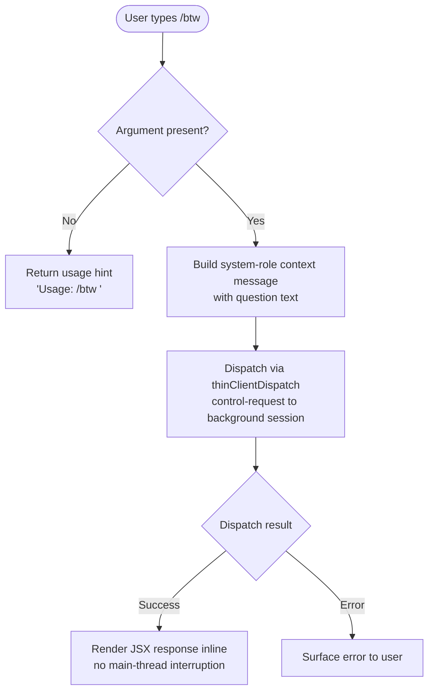

# `/btw`

> Analysis basis: CC v2.1.186 bundle.js (AST extraction + Claude interpretation)
> Minimum version: v2.1.186

---

## Overview

`/btw` ("by the way") lets the user inject a quick side question or supplementary remark into the active conversation without fully interrupting the ongoing agentic flow. The command is dispatched as a `control-request` to the background session infrastructure and resolves immediately (`immediate: true`), rendering a JSX response inline. Input that omits the question text triggers a usage hint rather than forwarding anything to the agent.

---

## Registration

| Field | Value |
|---|---|
| type | `local-jsx` |
| name | `btw` |
| description | Ask a quick side question without interrupting the main conversation |
| argumentHint | `<question>` |
| immediate | `true` |
| thinClientDispatch | `control-request` |
| module_id | `jul` |
| load_inline | `true` |
| loc_byte | `11243917` |
| loc_byte_end | `11244156` |
| loc_line | `6993` |
| arbor_handler.name | `bYp` |
| arbor_handler.fqn | `claude-2.1.186::bYp` |
| arbor_handler.kind | `AsyncFunction` |
| arbor_handler.resolution_path | `module_id` |
| arbor_handler.n_hits | `0` |

Analysis basis: CC v2.1.186 bundle.js:+11243917

---

## Input Branching

Three distinct paths exist: empty/missing argument, valid argument dispatched successfully, and an unexpected error from the dispatch layer.



Analysis basis: CC v2.1.186 bundle.js:+11243518, +11243520, +11243559, +11243628

---

## Behavioral Spec

### 1. Argument Validation and Usage Guard

When the handler (`bYp`) is invoked, it first checks whether the user supplied a non-empty `<question>` argument.

```
async function btwHandler(args, context):
    question = args.trim()

    if question is empty:
        return usageError("Usage: /btw <your question>")
        // literal at bundle.js:+11243520

    proceed to dispatch(question, context)
```

Analysis basis: CC v2.1.186 bundle.js:+11243518, +11243520

### 2. Constructing the Side-Channel Message

A message is assembled with `role: "system"` wrapping the user's question so that it reaches the running agent as an out-of-band annotation rather than a normal user turn.

```
function buildSideMessage(question):
    return {
        role: "system",         // literal at bundle.js:+11243559
        content: question
    }
```

Analysis basis: CC v2.1.186 bundle.js:+11243559

### 3. Dispatch via Control-Request

The assembled message is forwarded through the `thinClientDispatch` channel (`control-request`). Because `immediate: true` is set on the registration, the CLI does not wait for the agent to finish its current task before delivering the message; it inserts the side-question asynchronously.

```
async function dispatch(question, context):
    message = buildSideMessage(question)
    result  = await context.thinClientDispatch("control-request", message)
    return renderJSX(result)
```

Analysis basis: CC v2.1.186 bundle.js:+11243582, +11243628

### 4. Config Persistence (Side-Effect via `_n` / `saveGlobalConfig`)

The call graph shows that the handler chains into the global-config persistence path (`_n` → `IQn` → config lock/write helpers). This suggests the command records some state (e.g., last-used timestamp or session metadata) to the global config file under a file lock. The lock subsystem emits a warning if acquisition takes longer than expected and logs `"Lock acquisition took longer than expected - another Claude instance may be running"`.

```
async function persistSessionState(sessionData):
    acquire fileLock(configPath)
        // emits tengu_config_lock_contention on contention
    if reReadConfig is missing auth that cache has:
        log("saveConfigWithLock: re-read config is missing auth …")
        emit tengu_config_auth_loss_prevented
        return                          // refuses write to protect auth
    writeConfigAtomic(sessionData)
    release fileLock(configPath)
```

Analysis basis: CC v2.1.186 bundle.js:+13847130, +13850557, +13850884, +13851036

### 5. Jitter Helper (`e` → `Math.random` / `setTimeout`)

A small utility reachable from `bYp` introduces randomised jitter (integers 1–2) before retrying time-sensitive operations (e.g., lock contention back-off).

```
function jitteredDelay(baseMs):
    factor = Math.floor(Math.random() * 2) + 1   // values 1 or 2
                                                  // literals at +14192739, +14192755
    setTimeout(callback, baseMs * factor)
```

Analysis basis: CC v2.1.186 bundle.js:+14192739, +14192741, +14192755, +14192778

### 6. JSX Rendering

On success the handler calls `O_.jsx` to produce an inline React element that the CLI renders in-place without interrupting the conversation stream.

```
function renderResponse(dispatchResult):
    return O_.jsx(BtwResponseComponent, { result: dispatchResult })
```

Analysis basis: CC v2.1.186 bundle.js:+11243628

---

## State & Side Effects

| Item | Detail |
|---|---|
| Telemetry — config lock contention | `tengu_config_lock_contention` (bundle.js:+13850557) |
| Telemetry — stale config write | `tengu_config_stale_write` (bundle.js:+13850693) |
| Telemetry — config parse error | `tengu_config_parse_error` (bundle.js:+13853132) |
| Telemetry — auth loss prevented | `tengu_config_auth_loss_prevented` (bundle.js:+13851036) |
| Telemetry — config fallback write | `tengu_config_fallback_write` (bundle.js:+13850173) |
| Telemetry — bg dispatch SIGKILL escalation | `tengu_bg_dispatch_sigkill_escalate` (bundle.js:+17157626) |
| Telemetry — bg low memory | `tengu_bg_dispatch_low_mem` (bundle.js:+17158227) |
| Telemetry — bg spare session enabled | `tengu_bg_spare_enable` (bundle.js:+17158924) |
| Telemetry — bg spare session claimed | `tengu_bg_spare_claim` (bundle.js:+17159052) |
| Telemetry — bg spare claim failed | `tengu_bg_spare_claim_fail` (bundle.js:+17159318) |
| Telemetry — bg proto mismatch | `tengu_bg_proto_mismatch` (bundle.js:+17143249) |
| Telemetry — bg dispatch stale drop | `tengu_bg_dispatch_stale_drop` (bundle.js:+17144648) |
| Telemetry — bg attach legacy auto-respawn | `tengu_bg_attach_legacy_autorespawn` (bundle.js:+17147552) |
| Telemetry — bg attach | `tengu_bg_attach` (bundle.js:+17148811) |
| Telemetry — bg attach stall gave up | `tengu_bg_attach_stall_gave_up` (bundle.js:+17149741) |
| Telemetry — bg attach stall respawn | `tengu_bg_attach_stall_respawn` (bundle.js:+17150011) |
| Telemetry — bg attach kick | `tengu_bg_attach_kick` (bundle.js:+17151008) |
| Telemetry — daemon control | `tengu_daemon_control` (bundle.js:+17194642) |
| Config file write | Atomic write via file-lock to global config; protected against auth-loss regression (GH #3117) |
| thinClientDispatch | Sends a `control-request` message to the background daemon session |
| JSX render | Inline JSX element rendered via `O_.jsx`; does not interrupt the main conversation thread |
| appState changes | <!-- TODO: not found in depth-2 traversal; needs --depth 4 --> |
| Sound | <!-- TODO: not found in depth-2 traversal; needs --depth 4 --> |

---

## Version History

| Version | Change |
|---|---|
| v2.1.186 | Initial analysis |

---

## Common Mistakes

1. **Omitting the question text** — typing `/btw` with no argument returns the usage hint `"Usage: /btw <your question>"` and nothing is dispatched. Always include the question inline: `/btw <question>`.
2. **Expecting a blocking response** — because `immediate: true` is set, the side question is delivered asynchronously; the agent may acknowledge it after it finishes its current step, not immediately.
3. **Confusing `/btw` with a normal user turn** — the message is injected with `role: "system"`, not `role: "user"`, so it arrives as an out-of-band annotation and may be treated differently by the model than a regular follow-up message.
4. **Assuming no I/O overhead** — the command does touch the global config file (via the lock/write subsystem) as a side effect; in environments where `~/.claude.json` is on a slow filesystem, lock contention may cause a noticeable delay (telemetry: `tengu_config_lock_contention`).

---

## Appendix — Identifier Mapping

> For bundle debugging only. Identifiers change across versions.

| Identifier | Role |
|---|---|
| `bYp` | Main async handler for `/btw` (arbor_handler, AsyncFunction) |
| `e` | Jitter/delay utility — uses `Math.random` + `setTimeout` |
| `_n` | Global config save orchestrator (calls `IQn` and related helpers) |
| `IQn` | Config lock-acquire-and-write implementation |
| `Gt` | File path / filesystem helper (used throughout config and file ops) |
| `s` | File-lock set helper (calls `r.add`, manages lock lifecycle) |
| `r` | Lock registry / file-operation provider |
| `i` | Lock close / finalise helper |
| `RGs` | Config object merge/assign helper |
| `ERr` | Config error record constructor |
| `T` | Message / log formatting utility |
| `Pvc` | Log-line builder (calls `YP`, `lcr`, `U5o`) |
| `De` | JSON stringify wrapper |
| `Lc` | String redaction / path-trim utility (produces `[REDACTED]`) |
| `eze` | Content sanitise helper (calls `cWo`) |
| `Fvc` | File-write-with-byte-length utility |
| `W` | Wait / async-settle helper |
| `mn` | Warning/error logger |
| `cEe` | Config file read-and-parse implementation |
| `Bt` | JSON parse wrapper |
| `i9` | String prefix-strip utility (`startsWith` + `slice`) |
| `HGl` | Directory listing / backup-file helper |
| `_Oo` | Path join + directory resolution helper |
| `f` | Background session / process lifecycle manager |
| `EHt` | Config auth-loss guard helper |
| `n` | String lowercase normaliser |
| `I` | Scroll / viewport bounds calculator |
| `x` | Supervisor write / terminal I/O handler |
| `A` | Cursor / selection boundary calculator |
| `H` | Background daemon IPC frame handler |
| `g` | Socket / stream reader with timeout |
| `m` | Session kill-all helper |
| `fp` | Stream end / flush helper |
| `bYf` | Daemon session message dispatcher (handles ping, dispatch, attach, etc.) |
| `Ae` | String coerce helper (`String(...)`) |
| `BTt` | Atomic file write with lock, permissions preserve, and fsync |
| `Fd` | Realpath / symlink resolver |
| `u` | Daemon stop / process signal helper |
| `kn` | Warning-with-log helper (wraps `mn`) |
| `l7e` | Extended-attribute / unsupported-syscall error handler |
| `fDe` | Config field extractor / defaults helper |
| `hOo` | Config entries iterator |
| `TKt` | Timestamp provider (wraps `Date.now`) |
| `TQn` | Global config write-with-fallback orchestrator |
| `Pe` | Promise settle / resolve helper (calls `KVe`) |
| `KVe` | Core promise resolution utility |

---

Note: index built via Arbor fallback; some signals (telemetry, literals) may be missing — see arbor-fallback.js.