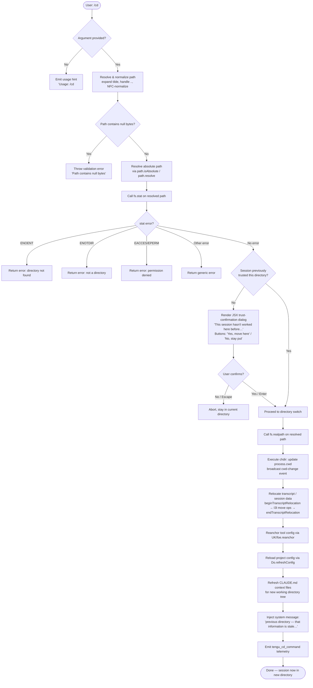

# `/cd`

> Analysis basis: CC v2.1.186 bundle.js (AST extraction + Claude interpretation)
> Minimum version: v2.1.186

---

## Overview

The `/cd` command moves the current Claude Code session to a new working directory supplied by the user as a path argument. It resolves and validates the target path, checks filesystem accessibility and permission policy (including whether the session has previously trusted the directory), then atomically relocates the session's working directory — updating shell state, reloading configuration, and refreshing all context files (CLAUDE.md, etc.) that apply to the new location.

---

## Registration

| Field | Value |
|---|---|
| type | `local-jsx` |
| name | `cd` |
| description | Move this session to a new working directory |
| argumentHint | `<path>` |
| module_id | `Tdl` |
| load_inline | `true` |
| loc_byte | 11277777 |
| loc_byte_end | 11277937 |
| loc_line | 7014 |
| arbor_handler.name | `QYp` |
| arbor_handler.fqn | `claude-2.1.186::QYp` |
| arbor_handler.kind | `AsyncFunction` |
| arbor_handler.resolution_path | `module_id` |
| arbor_handler.n_hits | 0 |

Analysis basis: CC v2.1.186 bundle.js:+11277777

---

## Input Branching

Five or more distinct handling branches exist (no argument, path resolution variants, filesystem errors, trust/permission gating, and success). A flowchart is used.



Analysis basis: CC v2.1.186 bundle.js:+11276280 (handler entry), +11276300 (usage string), +11276391 (stat call), +11276572 (ENOENT branch), +11276904 (Sdl trust check), +11276942 (Pr session-state lookup), +11277075 (XYp chdir execution), +11277155 (system message injection)

---

## Behavioral Spec

### 1 · Argument Validation and Path Normalization

```
async function handleCdCommand(rawArg, appContext):
    if rawArg is absent or blank:
        display "Usage: /cd <path>"
        return

    # Path sanitation (resolveAndNormalizePath / ps)
    trimmedArg = rawArg.trim()
    if trimmedArg contains null bytes:
        throw Error("Path contains null bytes")

    # NFC Unicode normalization
    normalized = unicodeNormalize(trimmedArg, "NFC")

    # Tilde expansion
    if normalized starts with "~/":
        normalized = os.homedir() + normalized.slice(1)

    # Windows-style tilde expansion (~\)
    if on Windows and normalized starts with "~\\":
        normalized = os.homedir() + normalized.slice(1)

    # Absolute / relative resolution
    if path.isAbsolute(normalized):
        resolved = path.normalize(normalized)
    else:
        resolved = path.resolve(currentWorkingDir, normalized)

    return resolved
```

Analysis basis: CC v2.1.186 bundle.js:+1094691 (trim), +1094657 (null-byte error), +65963 (NFC normalize), +1094785 (tilde "~/"), +13414711 (tilde "~\\"), +1094914 (isAbsolute), +1094968 (resolve)

---

### 2 · Filesystem Accessibility Check

```
async function checkPathAccessible(resolvedPath):
    try:
        stats = await fs.stat(resolvedPath)
    catch error:
        switch error.code:
            case "ENOENT":  return { ok: false, reason: "not found" }
            case "ENOTDIR": return { ok: false, reason: "not a directory" }
            case "EACCES":  return { ok: false, reason: "access denied" }
            case "EPERM":   return { ok: false, reason: "permission denied" }
            default:        return { ok: false, reason: error.message }

    return { ok: true, stats }
```

Analysis basis: CC v2.1.186 bundle.js:+11276391 (stat), +11276585 (ENOENT), +11276599 (ENOTDIR), +11276614 (EACCES), +11276628 (EPERM)

---

### 3 · Directory Trust / Permission Gate (JSX Dialog)

If the session has not previously visited the target directory, a JSX confirmation dialog is rendered before proceeding.

```
function renderTrustDialog(resolvedPath, onConfirm, onCancel):
    # Dialog text (paraphrased — © Anthropic PBC):
    #   "This session hasn't worked here before. Is this a directory
    #    you created or one you trust? Claude Code will be able to
    #    read, edit, and execute files here."
    #   Link: https://code.claude.com/docs/en/security  ("Security guide")

    primaryButton   = { label: "Yes, move here", key: "enter"/"confirm" }
    secondaryButton = { label: "No, stay put",   key: "escape"/"cancel" }

    render JSX dialog with warning style
    on primaryButton → onConfirm()
    on secondaryButton → onCancel()
```

The trust check consults the permission-policy subsystem (`Sdl` → `zYp` → `_We` / `zGt`) which evaluates allow-list patterns including glob matching for directory trees.

Analysis basis: CC v2.1.186 bundle.js:+11273492 (dialog text fragment "This session hasn"), +11273516 (text continuation), +11273826 (security URL), +11273878 ("Security guide"), +11273972 ("Yes, move here"), +11274001 ("No, stay put"), +11274202 (key "enter"), +11274246 (key "escape"), +11274345 ("warning" style), +11276904 (Sdl call)

---

### 4 · Permission Policy Evaluation

```
function evaluateDirectoryPolicy(resolvedPath, policyContext):
    # Check deny-rules first (Pq / hPo)
    for rule in denyRules:
        if matchesGlobPattern(resolvedPath, rule):
            return { result: "blockedByRule", rule }

    # Check allow patterns (zYp / zGt / _We)
    # Patterns support: "**/" prefix, glob wildcards (. * ? etc.),
    #                   absolute paths, relative segments
    for pattern in allowPatterns:
        compiled = compilePattern(pattern)   # escapes ^\$.|?+()[]{}
        if compiled.test(resolvedPath):
            return { result: "allowed" }

    # No matching allow rule
    return { result: "outsideAllowedPatterns" }
```

Analysis basis: CC v2.1.186 bundle.js:+11271749 (zYp), +11271774 (Pq deny check), +11271895 ("blockedByRule"), +11272002 ("allowed"), +11272129 ("outsideAllowedPatterns"), +11272693 (regex special-char escape set), +13683113 ("deny"), +13681471 ("allow")

---

### 5 · Directory Switch Execution (XYp)

```
async function executeDirectorySwitch(resolvedPath, appContext):
    # Resolve symlinks to canonical real path
    realPath = await fs.realpath(resolvedPath)

    # 1. Update process working directory
    process.chdir(realPath)

    # 2. Normalize and broadcast cwd-change event (WR / Dyt / gsr.emit)
    normalizedReal = path.normalize(realPath)
    eventBus.emit("cwd-change", normalizedReal)

    # 3. Update shell CWD state (kH → tengu_shell_set_cwd telemetry)
    updateShellCwd(realPath, appContext)

    # 4. Relocate transcript / session artefacts (_bo)
    session.beginTranscriptRelocation(realPath)
    await moveTranscriptFiles(currentTranscriptDir, newTranscriptDir)  # I3l
    session.endTranscriptRelocation()

    # 5. Reanchor tool configuration (UK / foe.reanchor)
    toolConfig.reanchor(realPath)

    # 6. Reload project configuration (Do.refreshConfig)
    projectConfig.refreshConfig()

    # 7. Refresh CLAUDE.md / context files for new tree (YYp → gOt / hOt)
    refreshContextFiles(realPath)

    # 8. Emit telemetry
    telemetry.emit("tengu_cd_command")
```

Analysis basis: CC v2.1.186 bundle.js:+11276771 (realpath), +11274853 (process.chdir), +11274876 (WR cwd broadcast), +11274870 (kH shell update), +11274904 (_bo relocation), +13349586 (beginTranscriptRelocation), +13349904 (endTranscriptRelocation), +11275158 (UK reanchor), +11275209 (Do.refreshConfig), +11275265 (YYp context refresh), +11275230 (tengu_cd_command)

---

### 6 · Transcript Relocation (I3l / V3l)

```
async function moveTranscriptFiles(sourceDir, targetDir):
    await fs.mkdir(targetDir, { mode: 0o700 })   # octal 448 decimal
    try:
        await fs.rename(sourceDir, targetDir)
    catch error:
        if error.code in ["EEXIST", "EBUSY", "ENOTEMPTY", "EXDEV",
                          "EISDIR", "ENOTSUP"]:
            # Cross-device or occupied: fall back to recursive copy
            await recursiveCopyDir(sourceDir, targetDir)   # V3l
            await fs.rm(sourceDir, { recursive: true })
        else:
            throw error
```

Analysis basis: CC v2.1.186 bundle.js:+13349672 (448 mkdir mode), +13349967 (rename), +13350017 (EEXIST), +13350044 (EBUSY), +13350057 (ENOTEMPTY), +13350158 (EXDEV), +13350222 (EISDIR), +13350236 (ENOTSUP), +13350372 (V3l mkdir), +13350427 (readdir), +13350550 (copyFile)

---

### 7 · Context File Refresh (CLAUDE.md)

```
function refreshContextFiles(newCwd):
    # Walk directory tree upward collecting CLAUDE.md files (gOt / b4 / awe)
    #   - "CLAUDE.md"       → Project instructions (checked into codebase)
    #   - "CLAUDE.local.md" → User's private project instructions (not checked in)
    #   - ".claude/rules"   → Additional rules directory
    #   - Global ~/.claude  → User's global instructions

    contextFiles = collectMdFiles(newCwd)       # recurse up, resolve symlinks
    systemPromptBlock = formatContextBlock(contextFiles)  # hOt
    injectSystemBlock(systemPromptBlock, role="system")
```

Analysis basis: CC v2.1.186 bundle.js:+5073459 ("CLAUDE.md"), +5073627 ("CLAUDE.local.md"), +5073493 ("Project"), +5073526 (".claude"), +5073708 ("rules"), +5075536 (project instructions label), +5075606 (private instructions label), +11277118 (role "system")

---

### 8 · Stale-Context System Message Injection

After a successful directory change, a system-role message is appended to the conversation informing the model that its prior understanding of the working directory is outdated.

The message begins with the fragment `"previous directory — that information is stale. All tool calls and "` and continues with further instructions (© Anthropic PBC — not quoted beyond this 30-char excerpt fragment).

Analysis basis: CC v2.1.186 bundle.js:+11275424 (stale-context fragment), +11277118 ("system" role), +11277155 (T call for message injection)

---

## State & Side Effects

| Item | Detail |
|---|---|
| Telemetry: `tengu_cd_command` | Emitted on successful directory change (bundle.js:+11275230) |
| Telemetry: `tengu_shell_set_cwd` | Emitted when shell CWD state is updated (bundle.js:+7052692) |
| Telemetry: `tengu_disable_bypass_permissions_mode` | Emitted if bypass-permissions mode is disabled during transition (bundle.js:+3390734) |
| Telemetry: `tengu_config_lock_contention` | Emitted when config write-lock takes too long (bundle.js:+13850557) |
| Telemetry: `tengu_config_stale_write` | Emitted on stale config write detection (bundle.js:+13850693) |
| Telemetry: `tengu_config_auth_loss_prevented` | Emitted when auth-data loss is prevented during config save (bundle.js:+13851036) |
| Telemetry: `tengu_config_fallback_write` | Emitted on config write fallback (bundle.js:+13850173) |
| Telemetry: `tengu_config_parse_error` | Emitted on config parse failure (bundle.js:+13853132) |
| Telemetry: `tengu_paper_halyard` | Emitted during CLAUDE.md loading (bundle.js:+5075375) |
| Telemetry: `tengu_claude_rules_md_permission_error` | Emitted if CLAUDE.md cannot be read due to permissions (bundle.js:+5072637) |
| `process.cwd()` | Changed via `process.chdir()` to the new real path (bundle.js:+11274853) |
| cwd-change event | Broadcast to internal event bus (`gsr.emit`) (bundle.js:+46643) |
| Transcript relocation | Session transcript directory moved (or copied) to sub-path under new cwd (bundle.js:+13349586) |
| Tool config reanchor | `foe.reanchor` called to rebind tool paths to new cwd (bundle.js:+1150980) |
| Project config reload | `Do.refreshConfig` reloads all project-level settings (bundle.js:+11275209) |
| Context file reload | CLAUDE.md hierarchy re-scanned and injected as system message (bundle.js:+11275265) |
| Conversation system message | Stale-context warning injected into conversation (bundle.js:+11275424) |
| Trust store update | New directory added to session trust set after user confirms (bundle.js:+11276904) |
| Sound | None observed in depth-2 traversal |

---

## Version History

| Version | Change |
|---|---|
| v2.1.186 | Initial analysis |

---

## Common Mistakes

1. **Omitting the argument** — `/cd` with no path prints `Usage: /cd <path>` and does nothing. The command requires exactly one path argument.
2. **Using a relative path from the wrong base** — Relative paths (e.g., `../sibling`) are resolved against the *current* session working directory at the time the command is issued, not the directory shown in any stale UI element.
3. **Expecting immediate file-read access after refusal** — If the user selects "No, stay put" in the trust dialog, the working directory is unchanged; subsequent tool calls still target the old directory.
4. **Assuming tilde expansion works on all platforms identically** — On Windows, `~\` is expanded using `os.homedir()`, whereas `~/` is used on POSIX. Mixing styles may produce unexpected paths.
5. **Ignoring the stale-context warning** — After `/cd` succeeds, the model receives a system message marking prior directory context as stale. Prompts that implicitly assume the old directory (e.g., "edit the same file as before") may produce incorrect tool calls.
6. **Paths with null bytes** — Any path containing null bytes (`\0`) is rejected with a validation error before any filesystem operation is attempted.
7. **Trusting directory listings shown before the switch** — After a successful `/cd`, all CLAUDE.md / context files are re-read; the effective rule set and instructions may change substantially compared to the previous directory.

---

## Appendix — Identifier Mapping

> For bundle debugging only. Identifiers change across versions.

| Identifier | Role |
|---|---|
| `QYp` | Main `/cd` command handler (AsyncFunction) |
| `ps` | Path resolution and normalization utility |
| `Ot` | CWD / session-context accessor |
| `hrn` | Async-local-store CWD reader |
| `YV` | CWD fallback value supplier |
| `gr` | Global app-state reader |
| `GL` | Low-level global state store |
| `Gt` | Logger / debug utility |
| `SH` | Unicode NFC normalization helper |
| `mn` | Error logging / reporting helper |
| `Sdl` | Directory trust and permission-policy evaluator |
| `Xo` | Permission result constructor |
| `lk` | Symlink-aware directory lister for trust check |
| `au` | Path utility: absolute-path helper |
| `Sm` | Path utility: stat-like helper |
| `Qlr` | Symlink-safe path resolver |
| `QNl` | Permission cache entry constructor |
| `Mre` | Recursive symlink resolver |
| `Fd` | Filesystem real-path helper |
| `jGt` | Home-directory prefix detector for display |
| `zYp` | Allow-list pattern matcher for directory paths |
| `zGt` | Glob pattern compiler for allow rules |
| `$wf` | Permission-rule lookup aggregator |
| `_We` | Secondary pattern matcher (exact/prefix rules) |
| `jYp` | Pattern-match result formatter |
| `Pq` | Deny-rule evaluator |
| `hPo` | Deny-rule entry builder |
| `zm` | Glob-pattern tokenizer |
| `nye` | Allow-rule entry builder |
| `Y6e` | Shell-command allow-list checker |
| `M4t` | Shell-command normalizer |
| `P4t` | Shell-command token parser |
| `hho` | Shell-command hash cache helper |
| `Pr` | Session system-prompt builder (reads appState) |
| `w8n` | System-prompt working-directory block builder |
| `L8n` | System-prompt allowed-tools block builder |
| `L2` | Permission-mode system-prompt builder |
| `it` | Permission-mode string formatter |
| `ORt` | Permission-mode label: "bypassPermissions" |
| `NRt` | Permission-mode label: "disable" |
| `$9` | Permission mode sub-formatter |
| `JEn` | Permission-mode deduplication cache |
| `wt` | Log writer for system messages |
| `JYp` | Stale-context system message builder |
| `uf` | Text escape helper (backslash, parens) |
| `Ziu` | Regex-escape replacer |
| `Pxe` | System message role formatter |
| `XYp` | Core directory-switch executor |
| `kH` | Shell CWD updater (emits `tengu_shell_set_cwd`) |
| `kn` | Error constructor wrapper |
| `o_r` | Async-local-store CWD setter |
| `bre` | Path normalization helper for store |
| `W` | Generic warn/log emitter |
| `WR` | CWD-change event broadcaster |
| `Dyt` | Path normalize + event emit helper |
| `_bo` | Transcript relocation orchestrator |
| `Rt` | Transcript path resolver |
| `Oc` | Hook-registration dispatcher |
| `Ai` | Hook registration caller |
| `QB` | Environment-check helper (production/test) |
| `ot` | String coercion utility |
| `F3l` | Transcript file-list builder |
| `N3` | Transcript metadata helper |
| `jNe` | Config directory helper |
| `jA` | Transcript event emitter |
| `T5o` | Pre-relocation event |
| `b5o` | Post-relocation event emitter |
| `I3l` | Transcript file-move / copy operation |
| `V3l` | Recursive directory copy helper |
| `T` | System-message / log-entry constructor |
| `Pvc` | Log-entry formatter |
| `De` | JSON serializer for log entries |
| `Lc` | Log-line truncator |
| `eze` | Log-line colorizer |
| `Fvc` | Log file writer |
| `Re` | Persistent log appender |
| `ao` | Log error wrapper |
| `Ki` | Log ring-buffer manager |
| `Pnu` | Log ring-buffer shift/push helper |
| `jOi` | Background-task context invalidator |
| `ly` | Background-task cache clearer |
| `Oi` | Background task file-state reader |
| `Jd` | Background task error logger |
| `Bt` | JSON parse helper |
| `kd` | Background task cache writer |
| `Tm` | Atomic file write utility |
| `Xf` | Background task state validator |
| `Ae` | String cast helper |
| `UK` | Tool-config reanchor caller |
| `_E` | Post-cd cleanup helper |
| `YYp` | Context-file refresh orchestrator |
| `pT` | Path normalization for context keys |
| `gOt` | CLAUDE.md file collector (walks directory tree) |
| `vh` | Config file reader |
| `b4` | Directory entry filter for CLAUDE.md |
| `awe` | Recursive directory walker |
| `pOt` | Gitignore / pattern filter for walker |
| `hOt` | Context-block formatter (assembles system prompt section) |
| `nVn` | HTML entity encoder for display |
| `Bv` | Post-refresh state updater |
| `_mt` | Pre-cd state snapshot helper |
| `PK` | Path normalizer for config keys |
| `JGt` | Config-refresh entry point |
| `_n` | Global config save orchestrator |
| `IQn` | Config write-with-lock implementation |
| `RGs` | Config write error reporter |
| `cEe` | Config file reader (with backup) |
| `EHt` | Config schema validator |
| `_Oo` | Config backup path builder |
| `BTt` | Atomic file write with fsync |
| `fDe` | Config pre-save hook |
| `hOo` | Config entry serializer |
| `TKt` | Config lock-timing tracker |
| `TQn` | Config write transaction helper |
| `Pe` | Platform capability checker |
| `bdl` | JSX trust-dialog component renderer |