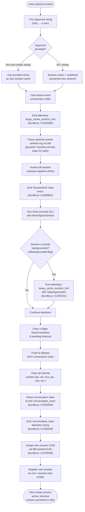

# `/clear`

> Analysis basis: CC v2.1.186 bundle.js (AST extraction + Claude interpretation)
> Minimum version: v2.1.186

---

## Overview

`/clear` starts a brand-new Claude Code session with an empty conversation context while preserving the previous session on disk so it can be restored later with `/resume`. It accepts an optional `[name]` argument to label the incoming session, and it supports both interactive (REPL) and non-interactive execution paths. The command is also accessible via the aliases `/reset` and `/new`.

---

## Registration

| Field | Value |
|---|---|
| type | `local` |
| name | `clear` |
| description | Start a new session with empty context; previous session stays on disk (resumable with /resume) |
| aliases | `reset`, `new` |
| argumentHint | `[name]` |
| supportsNonInteractive | `true` |
| thinClientDispatch | `post-text` |
| module_id | `Wdl` |
| load_inline | `true` |
| loc_byte | `11294230` |
| loc_byte_end | `11294521` |
| loc_line | `7016` |
| arbor_handler.name | `HXp` |
| arbor_handler.fqn | `claude-2.1.186::HXp` |
| arbor_handler.kind | `AsyncFunction` |
| arbor_handler.resolution_path | `module_id` |
| arbor_handler.n_hits | `0` |

Analysis basis: CC v2.1.186 bundle.js:+11294230

---

## Input Branching

The handler involves 4+ distinct paths based on the optional session name argument, the backgrounded state of the current session, and the deep session-teardown pipeline. A Mermaid flowchart is used.



---

## Behavioral Spec

### 1. Entry Point and Argument Parsing

The Arbor-resolved handler `HXp` is an `AsyncFunction` reached via `module_id → Wdl`.

```
async function clearCommandHandler(rawArg, context):
    trimmedArg = rawArg.trim()              # bundle.js:+11294056
    newSessionName = (trimmedArg.length > 0) ? trimmedArg : undefined
    return sessionResetOrchestrator(newSessionName, context)
```

Analysis basis: CC v2.1.186 bundle.js:+11294056, +11294071

---

### 2. Session Reset Orchestrator (`oWt`)

`oWt` is the core coordinator for the clear operation. It:

1. Emits `tengu_cache_eviction_hint` telemetry (Analysis basis: CC v2.1.186 bundle.js:+11291990).
2. Delegates context-window argument parsing to `iWt` (uses `parseInt` with radix `10` and `Number.isFinite`; clamps result between 1000 and a computed maximum with `Math.max` / `Math.min`). Analysis basis: CC v2.1.186 bundle.js:+13470252, +13470263, +13470439, +13470470, +13470483.
3. Calls the full session teardown pipeline (`SWe`).
4. Applies an `AbortSignal.timeout` guard on the teardown (Analysis basis: CC v2.1.186 bundle.js:+11291946).
5. Checks the `isBackgrounded` flag on the current session and emits a secondary `tengu_cache_eviction_hint` event if the session was running in the background (Analysis basis: CC v2.1.186 bundle.js:+11292101).
6. Collects currently tracked objects, clears pending timeouts with `clearTimeout`, flushes the `abortController` map (`t.clear`), and removes all entries from running-session tracking structures (Analysis basis: CC v2.1.186 bundle.js:+11292314, +11292614).
7. Calls the conversation-reset emitter (emits `"conversation_reset"` string literal, Analysis basis: CC v2.1.186 bundle.js:+11293309) and `"conversation_clear"` (Analysis basis: CC v2.1.186 bundle.js:+11292028).
8. Assigns a fresh session UUID via `$dl.randomUUID` (Analysis basis: CC v2.1.186 bundle.js:+11293348).
9. Re-initialises session tracking via `msr` (the session-start emitter) and re-registers hook watchers (Analysis basis: CC v2.1.186 bundle.js:+11293366).

```
async function sessionResetOrchestrator(newName, ctx):
    emit telemetry("tengu_cache_eviction_hint")
    contextWindowSize = parseAndClampContextWindow(ctx.arg)   # iWt
    await fullSessionTeardown(ctx)                             # SWe
    if ctx.session.isBackgrounded:
        emit telemetry("tengu_cache_eviction_hint", {source: "isBackgrounded"})
    clearAllAbortControllers(ctx)
    clearPendingTimeouts(ctx)
    emitConversationReset()           # "conversation_reset"
    emitConversationClear()           # "conversation_clear"
    newUUID = crypto.randomUUID()     # $dl.randomUUID
    initSessionTracking(newUUID, newName)
    restartHookWatchers()             # msr
    return newEmptySession
```

Analysis basis: CC v2.1.186 bundle.js:+11291886, +11292025, +11292066, +11292314, +11293309

---

### 3. Full Session Teardown Pipeline (`SWe`)

`SWe` performs the ordered shutdown of all subsystems before the new session is created.

```
async function fullSessionTeardown(ctx):
    emitHookEvent("SessionEnd")       # literal "SessionEnd", bundle.js:+11460802
    await runHookExecutor(ctx)        # kL — runs all registered hooks
    await flushAndCloseMCPConnections()  # vbo
    clearSkillIndexCache()            # a5 → e.clearSkillIndexCache
    clearInternalCaches()             # zte, w4, k1a, sja, myr, DBa, oyr, Uca, etc.
    resetAutonomousLoopState()        # wqp.resetAutonomousLoopDelivered
    disposeFileWatchers()             # WT → eit
    flushPendingLogs()                # aH → vJn.delete
    clearWorktreeStateIfNeeded()
```

Analysis basis: CC v2.1.186 bundle.js:+11291898, +13460775, +11290845, +10735662, +10735805

---

### 4. Hook Executor (`kL`)

`kL` is the central hook dispatch function invoked during `SWe`. Its responsibilities during `/clear` include:

- Running the `SessionEnd` hook type (string literal `"SessionEnd"`, Analysis basis: CC v2.1.186 bundle.js:+13460802).
- Building a hook-input payload, serialising it via `JSON.stringify` (Analysis basis: CC v2.1.186 bundle.js:+191820).
- Dispatching to configured hook handlers (command, callback, MCP-tool, HTTP, agent types identified at bundle.js:+13491051, +13490935, +13491605, +13491484, +13491359).
- Managing per-hook AbortControllers (`Gx`) with `clearTimeout` / `setTimeout` (Analysis basis: CC v2.1.186 bundle.js:+8945426, +8945469).
- Emitting telemetry `tengu_run_hook` (Analysis basis: CC v2.1.186 bundle.js:+13510418).
- On failure: logging `hook_callback_failed`, `hook_type_unsupported`, `hook_cancelled`, `hook_mcp_tool_failed`, `hook_exec_failed`, or `hook_nonzero_exit` depending on error category.
- On success: emitting `hook_success` / `hook_execution_complete` telemetry strings.

```
async function hookExecutor(hookType, payload, abortSignal):
    serialised = jsonStringify(payload)
    for each hookConfig in registeredHooks[hookType]:
        controller = new AbortController()
        Gx(controller)                 # arm timeout + cancel logic
        result = await dispatchHook(hookConfig, serialised, controller.signal)
        processHookResult(result)
    emit telemetry("tengu_run_hook")
    return mergedResults
```

Analysis basis: CC v2.1.186 bundle.js:+13510418, +13510256, +13510807

---

### 5. Cache and State Clearing (`vbo` / `zte`)

`vbo` orchestrates the bulk clearing of all in-memory caches across subsystems:

| Cleared subsystem | Implementation identifier | Cache operation |
|---|---|---|
| Skill index | `a5` | `e.clearSkillIndexCache` |
| Hook watch paths | `W6i` | `h8.clear` |
| MCP connection cache | `PWn` | `r6.delete`, `sEo.delete`, `R6t.delete`, `jGe.delete` |
| Session-start cache | `fOt` | internal clear |
| SGt cache | `w4` | `SGt.clear` |
| p5e / Rlo caches | `k1a` | `p5e.clear`, `Rlo.clear` |
| xpt / n5t caches | `sja` | `xpt.clear`, `n5t.clear` |
| NAe cache | `myr` | `NAe.clear` |
| m3n cache | `DBa` | `m3n.clear` |
| y7e cache | `oyr` | `y7e.clear` |
| xee / MLe caches | `Uca` | `xee.clear`, `MLe.clear` |
| Wol cache | `kWn` | `Wol.clear` |
| UNt / oJr caches | `pia` | `UNt.clear`, `oJr.clear` |
| Tool-result caches | `EH` | `xYt.clear`, `csr.clear` |

Analysis basis: CC v2.1.186 bundle.js:+11290845 through +11291493, +29197, +29209

---

### 6. Context Window Argument Parsing (`iWt`)

If the user supplies a numeric token alongside `/clear`, it is parsed as a context window size override:

```
function parseContextWindow(rawArg):
    parsed = parseInt(rawArg, 10)          # radix 10; bundle.js:+13470252, +13470263
    if not Number.isFinite(parsed):
        return defaultContextWindow        # dA path
    clamped = Math.max(1000, Math.min(parsed, maxAllowed))  # bundle.js:+13470439, +13470470, +13470483
    applyContextWindowOverride(clamped)    # aG → GL
    writeContextWindowSetting(clamped)     # wW → vBr
    return clamped
```

Analysis basis: CC v2.1.186 bundle.js:+13470252, +13470263, +13470274, +13470317, +13470325, +13470352

---

## State & Side Effects

| Item | Detail |
|---|---|
| Telemetry — `tengu_cache_eviction_hint` | Emitted on session reset entry and again if `isBackgrounded` is set (bundle.js:+11291990, +11292025) |
| Telemetry — `tengu_run_hook` | Emitted each time a hook is dispatched during teardown (bundle.js:+13510418) |
| Telemetry — `tengu_hook_plugin_metrics` | Emitted for plugin hook timing data (bundle.js:+13488502) |
| Telemetry — `tengu_repl_hook_finished` | Emitted when a REPL-mode hook finishes (bundle.js:+13494129) |
| Telemetry — `tengu_hook_plugin_injected` | Emitted when a plugin hook is injected (bundle.js:+13508747) |
| Telemetry — `tengu_feature_ok` / `tengu_feature_bad` | Emitted for feature-gate checks touched during hook execution (bundle.js:+1024705, +1024772) |
| Telemetry — `tengu_mcp_skills` | Emitted during MCP/skill teardown (bundle.js:+6640736) |
| Telemetry — `tengu_session_renamed` | Emitted if the new session name is set (bundle.js:+13367623) |
| Telemetry — `tengu_shell_set_cwd` | Emitted when the working directory is re-established (bundle.js:+7052692) |
| Conversation state | `"conversation_clear"` and `"conversation_reset"` string events are emitted; all in-memory messages are discarded |
| Session UUID | A new UUID is generated via `$dl.randomUUID` (bundle.js:+11293348); the old session file remains on disk |
| Hook lifecycle | `SessionEnd` hook is fired before teardown; all hook AbortControllers are cancelled and cleared |
| MCP connections | All MCP connections are flushed and caches cleared; `wqp.resetAutonomousLoopDelivered` is called |
| File watchers | Disposed via `WT → eit`; re-registered for the new session by `msr` |
| AbortControllers | All tracked AbortControllers are aborted and removed from the tracking map (bundle.js:+11292650) |
| Pending timeouts | All `clearTimeout` calls are executed to cancel deferred work (bundle.js:+11292614) |
| Disk persistence | The previous session transcript is NOT deleted — it remains available for `/resume` |
| Policy settings | Reloaded via `Qse` → `"policySettings"` key (bundle.js:+3399323) |
| Hooks config | Hooks are reloaded via `wBr` → `"hooks"` key (bundle.js:+3399161) |
| Sound | <!-- TODO: not found in depth-2 traversal; needs --depth 4 --> |

---

## Version History

| Version | Change |
|---|---|
| v2.1.186 | Initial analysis |

---

## Common Mistakes

1. **Confusing `/clear` with a destructive operation**: The previous session is preserved on disk and remains fully resumable via `/resume`. No conversation history is permanently deleted.
2. **Expecting the context window argument to be mandatory**: The `[name]` argument hint refers to an optional session name, not a context window size; a numeric value is parsed as a context size override, but this is not its primary purpose.
3. **Using `/clear` when you need `/reset` or `/new`**: All three are identical — they share the same handler via the `aliases` field (`reset`, `new`).
4. **Assuming `/clear` kills background sessions**: The handler detects the `isBackgrounded` flag and adjusts teardown telemetry, but background sessions are preserved (they transition to a resumable state rather than being terminated).
5. **Running `/clear` outside the REPL for hooks that need REPL context**: Certain hook types (`Stop`, `SubagentStop`, function hooks) emit explicit warnings when executed outside the REPL (string literals: `"Prompt stop hooks are not yet supported outside REPL"`, `"Internal error: function hook executed outside REPL context"`, bundle.js:+13511616, +13512942). The command itself (`supportsNonInteractive: true`) runs fine, but such hooks will be skipped or error.

---

## Appendix — Identifier Mapping

> For bundle debugging only. Identifiers change across versions.

| Identifier | Role |
|---|---|
| `HXp` | Main async handler for `/clear` (Arbor-resolved, `module_id` path via `Wdl`) |
| `oWt` | Session reset orchestrator — top-level coordinator called by `HXp` |
| `iWt` | Context-window argument parser (parseInt / Number.isFinite / Math.clamp) |
| `dA` | Default context-window applicator (fallback when arg is non-finite) |
| `Hl` | Settings reader used during context-window apply |
| `Qse` | Policy-settings reloader (`"policySettings"` key) |
| `aG` | Context-window override writer → `GL` |
| `GL` | Global settings store accessor |
| `wW` | Context-window setting persistence coordinator |
| `vBr` | Context-window cache (`mSi.get` / `mSi.set`) |
| `EH` | Tool-result cache clearer (`xYt.clear`, `csr.clear`) |
| `wBr` | Hooks-config reloader (`"hooks"` key) |
| `SWe` | Full session teardown pipeline |
| `od` | Session-end hook-event builder |
| `Rt` | Session state reader |
| `zP` | Session persistence / write utility |
| `UI` | Model-ID checker (claude-3-* / opus / sonnet / haiku family strings) |
| `nD` | Effort-level applicator (`"high"` effort, `"effort"` key) |
| `hR` | Hook-result formatter |
| `Ot` | Hook output renderer |
| `kL` | Hook executor — dispatches `SessionEnd` hooks |
| `R2` | Hook-input builder |
| `T` | Hook-type resolver (maps type strings to handler strategies) |
| `rEe` | Hook registration fetcher |
| `wDo` | Hook-config loader and validator |
| `vDo` | Third-party hook filter |
| `Wn` | Hook watcher wrapper |
| `W` | Async utility / promise wrapper |
| `De` | JSON-stringify helper |
| `Re` | Error logger (`VJ.logError`, `Jje.push`) |
| `xe` | Feature-gate "bad" path handler |
| `a1e` | Feature-gate entry (`jnn`) |
| `ke` | Feature-gate "ok" path handler |
| `Gx` | Per-hook AbortController manager (clearTimeout / setTimeout) |
| `h` | Hook callback invoker |
| `ice` | Hook instrumentation helper |
| `sP` | Hook status propagator |
| `BJn` | Hook batch result builder |
| `bDo` | MCP-tool hook dispatcher |
| `qJn` | Hook output JSON parser |
| `Kce` | Plugin hook metrics aggregator |
| `ADo` | HTTP hook executor (`US.post`, Content-Type: application/json) |
| `H4l` | HTTP hook response parser |
| `Pye` | Hook permission checker |
| `VJn` | Shell/spawn hook executor (`GJn.spawn`) |
| `c9e` | Hook cancellation handler |
| `j2` | Telemetry emitter (`dId.emit`, `Date.now`, `hve.get`/`set`) |
| `x6e` | Session-end event emitter |
| `Byt` | Cache eviction hint emitter |
| `Ke` | Non-conforming session handler (`KVe`) |
| `Mr` | Backgrounded-session path handler |
| `yH` | Background-session state reader (`KVe`) |
| `s` | Session tracking Set operations (add / finally / delete) |
| `r` | Session registry |
| `Ts` | Process-exit escalation (`process.exit`, `X8e`, `sT`) |
| `i` | Connection closer (`n.close`, `r.close`) |
| `n` | Connection name resolver (`i.toLowerCase`) |
| `f` | Session process manager (`D.kill`, `SIGKILL`, `n.get`) |
| `D` | Daemon/background session process entry |
| `grt` | Session config file reader (`t.readFile`, `Re`, `Ea`) |
| `d` | Session-process I/O handler (`r.write`, supervisor mode) |
| `_Q` | Post-write cleanup (`Cfe`) |
| `NPt` | Session config writer (`ywn.mkdir`, `ywn.writeFile`, `.claude` dir) |
| `PBi` | Session file filter (`hrt`) |
| `H` | IPC buffer handler (`Buffer.concat`, `ETOOLARGE`, `EUNKNOWN`) |
| `u` | Daemon control dispatcher (`ke`, `xe`, `gU`, `j6`) |
| `x` | Session process write handler (`d.write`, `GYf`) |
| `g` | Socket timeout manager (`r.setTimeout`) |
| `Mdc` | Session summary builder (`kD`, `Math.max`, `r.join`) |
| `uae` | Session cleanup runner (`grt`, `NPt`, `QV`) |
| `Bn` | Deferred abort handler (`setTimeout`, `clearTimeout`, `s.unref`) |
| `o` | Process name formatter (`i.padEnd`, padding `"  "`) |
| `IXn` | macOS memory monitor (`Kt`, `it`) |
| `it` | Platform-specific telemetry helper (`ORt`, `NRt`, `TW.get`) |
| `D2e` | Pins-file manager (`hb.lstat`, `hb.rm`, `pins.json`) |
| `dDt` | Pins path builder (`ay.join`, `Wk`) |
| `Bt` | JSON parser wrapper (`JSON.parse`) |
| `kn` | Error-code normaliser (`mn`, `ENOENT`) |
| `YTd` | Recursive file lister (`hb.readdir`, `hb.lstat`, `n.push`) |
| `N` | Permission-request handler (`Zut`, `J5`) |
| `Zut` | Permission classifier (`Ado`, `y9t`) |
| `J5` | Permission resolver (`zc`, `bit`, `IA`, `ot`) |
| `$Bo` | Background-session claim handler (`lV.claim`, `MOo`, `vrr.connect`) |
| `MOo` | Session manifest writer (`cV.mkdir`, `cV.writeFile`, `JSON.stringify`, 448/384 byte limits) |
| `pYf` | Claim send-timeout handler (5000 ms timeout, `send-claim timeout`) |
| `dYf` | Claim frame builder (`lV.buildClaimFrame`) |
| `Jd` | Serialise-error helper (`mn`) |
| `Ae` | String coercion wrapper (`String`) |
| `gR` | IPC message framer (`Buffer.from`, `Buffer.allocUnsafe`, `n.writeUInt32BE`) |
| `KBo` | Background-session lifecycle manager (roster, spawn, claim, state transitions) |
| `ec` | Socket path builder (`ay.join`, `Wk`) |
| `Oi` | File-watcher state reader (`GZ.get`/`set`/`delete`/`clear`, `ave.has`/`add`/`delete`) |
| `fg` | File-watcher active-state marker (`g0`) |
| `ive` | Include/exclude path matcher (`d4.has`, `lDt.has`, `x2e.has`) |
| `kd` | Watch-path config writer (`De`, `ay.join`, `Tm`, `ly`) |
| `jmt` | Hook post-clear callback (`gHl.then`, `$q`, `Cnf`) |
| `QWt` | Session file path builder (`Wh.join`, `XWt`) |
| `dye` | Session directory builder (`Wh.join`, `WWe`) |
| `yR` | Session roster path builder (`pHl`) |
| `nN` | Session roster entry writer (`RIo`, `zmt`) |
| `rM` | Session roster late-write handler (`pHl`) |
| `JWt` | Session file initialiser (`Wh.join`, `XWt`) |
| `p` | Force-shutdown handler (`Kb`, `process.exit`, `u.abort`, `"forced shutdown"`) |
| `mn` | Error message extractor |
| `Pe` | Non-conforming event emitter (`KVe`) |
| `Hc` | Session-tracking Set holder |
| `fE` | Session push helper |
| `vbo` | MCP/cache bulk-clear coordinator |
| `Abo` | MCP connection aborter |
| `Ix` | Skill-index cache clearer (`a5`, `Hqn`, `Bll`, `FGe`) |
| `a5` | Skill-index clear entry (`e.clearSkillIndexCache`, `HCo`) |
| `FGe` | MCP feature-gate clearner (`m6t`) |
| `W6i` | Hook watch-path cache clearer (`h8.clear`, `GBe`) |
| `GBe` | Hook cache persistence writer (`BLn.mkdir`, `BLn.writeFile`) |
| `zte` | Multi-subsystem cache reset orchestrator |
| `t$e` | Main-context reset (`$O`) |
| `PWn` | MCP ready-state cache clearer (`r6.delete`, `sEo.delete`, `R6t.delete`, `jGe.delete`) |
| `fOt` | Session-start event emitter (`A0`, `"session_start"`) |
| `_Et` | Post-compact cleanup trigger |
| `SEt` | Settings-event emitter (`GL`, `Sre`) |
| `kWn` | Wol-cache clearer (`Wol.clear`) |
| `pia` | UNt/oJr cache clearer (`UNt.clear`, `oJr.clear`) |
| `M6a` | M-subsystem reset |
| `dRe` | D-subsystem reset |
| `W_` | Output-token tracker reset (`pKe`, `Object.values`) |
| `fEo` | Post-reset finaliser |
| `w4` | SGt-cache clearer (`SGt.clear`) |
| `k1a` | p5e/Rlo cache clearer |
| `sja` | xpt/n5t cache clearer |
| `myr` | NAe cache clearer |
| `Fdl` | Fdl-subsystem clearer |
| `DBa` | m3n-cache clearer |
| `har` | har-set membership check (`e.has`) |
| `oyr` | y7e-cache clearer |
| `snl` | snl-cache clearer (`m6t`) |
| `m6t` | MCP client getter (`oWn.get`, `p6t`) |
| `Uca` | xee/MLe cache clearer |
| `kH` | CWD resolver (`xMn.isAbsolute`, `xMn.resolve`, `o_r`) |
| `Gt` | Path existence checker |
| `o_r` | CWD context store getter (`mrn.getStore`, `SH`) |
| `SH` | Path normaliser (`e.normalize`, NFC) |
| `bre` | Path breadcrumb builder (`Dyt`) |
| `gr` | Global registry accessor (`GL`) |
| `NBe` | Session-name setter |
| `VT` | Session-state validator (`"running"` literal) |
| `aH` | Log-flush coordinator (`LJn`, `vJn.delete`) |
| `LJn` | Pending-log tracker (`S9l.add`, `S9l.delete`) |
| `xit` | Post-clear hook trigger (`xfa`) |
| `WT` | File-watcher disposal + MCP skill re-scan (`eit`, `Qw`) |
| `eit` | File-watcher instance disposer (`ELe`) |
| `ELe` | File-hash calculator (`foa.createHash`, sha256, hex, 16-char prefix) |
| `Qw` | MCP skill scanner (`it`) |
| `Gdl` | CSe-subsystem clearer (`CSe`) |
| `ch` | Hook registration refresher (`Oc`) |
| `Oc` | Hook registry updater (`Ai`) |
| `Ai` | Hook observer registrar (`O5o.register`) |
| `gP` | Session-git state reader |
| `Of` | Session-path builder (`T$`, `Hg`, `gr`, `Dwe.join`) |
| `T$` | Session-directory resolver (`GL`) |
| `sWt` | Hook-watcher startup (`Oc`) |
| `msr` | Session-start event emitter (`xde.randomUUID`, `T5o`, `b5o`) |
| `T5o` | Session-start metadata builder |
| `b5o` | Session-start event publisher (`PYt.emit`) |
| `$ha` | Post-reset UI state resetter |
| `VY` | View-state reset (`Oc`) |
| `YOi` | File-state cleanup (`ly`, `Oi`, `kd`, `kn`) |
| `ly` | File-state cache entry remover (`GZ.delete`) |
| `Xf` | File-read handler (`mn`, `sOe.has`, `Ae`, `Re`) |
| `o6` | Session-log writer (`hR`, `tEe`, `tKt.emit`) |
| `tEe` | Sync log appender (`n.appendFileSync`, `n.mkdirSync`) |
| `QB` | Log formatter (`ot`, `F3l`, `N3`, `jNe`) |
| `N_e` | Symlink/task-directory manager (`Une.symlink`, `Une.unlink`, `mm`) |
| `gDo` | Task directory creator (`Une.mkdir`, `Tit`) |
| `Tit` | Task-path builder (`mDo.join`, `rqe`) |
| `mm` | Task-path linker (`mDo.join`, `Tit`) |
| `Qct` | Task directory re-initialiser (`LJn`, `gDo`, `Une.open`) |
| `Kw` | Sub-agent path builder (`T$`, `Hg`, `gr`, `$zr.get`) |
| `ud` | Session-unbind helper |
| `to` | Event-system initialiser (`EPe`, `Mor`, `q7t.call`, `V7t.bind`, `oEc`, `m3o.set`) |
| `_` | SDK/SSE connection manager (`N_t`, `BD`, `xx`, `I7`, `mB`) |
| `N_t` | SSE connection handler (`JHc`) |
| `JHc` | SSE key-set builder (`Object.keys`) |
| `ao` | Error string coercer (`Error`, `String`) |
| `E` | Dynamic connection handler (`yUt`, `N_t`) |
| `hm` | Heartbeat or keepalive helper |
| `Y5` | Worktree-state event emitter (`g8n.emit`, `"worktree-state"`) |
| `Qce` | Worktree-state file writer (`e9l`) |
| `e9l` | Async log appender (`hl.appendFile`, `hl.mkdir`) |
| `g8` | Plugin-hooks loader and session-start hook runner |
| `Ql` | Plugin-loader initialiser (`Hl`, `Ud`) |
| `Ud` | Plugin directory scanner (`ot`, `IXt`, `"--bare"`) |
| `ZQ` | Policy-inclusion set builder (`In`, `Object.entries`, `t.add`) |
| `In` | Settings-reader base (`Qon`, `Z$`) |
| `_7e` | Session-start timing logger (`Date.now`, `Rn`) |
| `Rn` | Append-file logger (`gsu`, `Gt`, `s.appendFileSync`) |
| `dge` | Plugin-directory safe-mode guard (`Hl`, `Z6i`, `"Safe mode: skipping plugin hook registration"`) |
| `jOt` | Main session loop entry (`od`, `ch`, `cC`, `NJn.randomUUID`) |
| `Ny` | Session-state notifier |
| `cC` | Full REPL conversation loop — invoked after session is cleared and re-initialised |
| `a` | MCP connection manager (`Z3e`, `arr`, `maa`, `q2o`) |
| `Z3e` | MCP server connection handler (`TB`, `Xw`, `fca`, `BD`, `xx`, `I7`) |
| `arr` | MCP update applier (`e.applyMcpUpdate`, `Q3e`, `WT`, `aE`) |
| `maa` | MCP auth handler (`AJr`) |
| `q2o` | MCP client refresher (`t.getClients`, `fRn`, `eit`, `Z3e`, `arr`) |
| `ti` | Tool-use session timestamper (`eAo.randomUUID`, `t.uuid`, `t.now`) |

---

Note: index built via Arbor fallback; some signals (telemetry, literals) may be missing — see arbor-fallback.js.