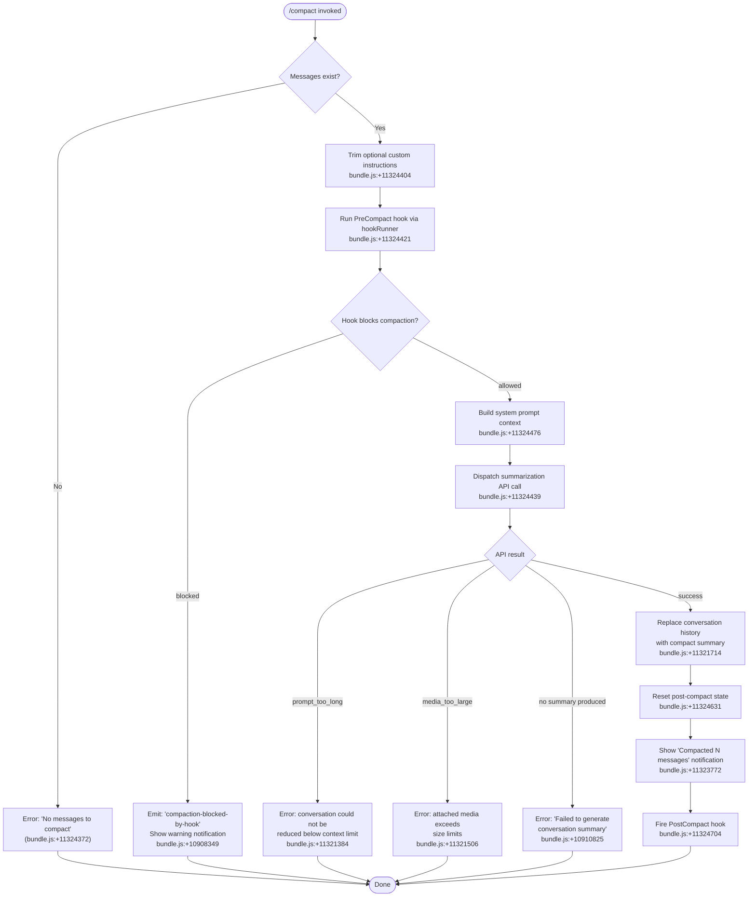

# `/compact`

> Analysis basis: CC v2.1.186 bundle.js (AST extraction + Claude interpretation)
> Minimum version: v2.1.186

---

## Overview

The `/compact` command summarizes the current conversation in order to free up context window space, replacing the full conversation history with a condensed summary. It supports optional custom summarization instructions and can be triggered interactively or in non-interactive (scripted) environments. After compaction, the conversation state is reset and a `PostCompact` hook is fired.

---

## Registration

| Field | Value |
|---|---|
| type | `local` |
| name | `compact` |
| description | `Free up context by summarizing the conversation so far` |
| argumentHint | `<optional custom summarization instructions>` |
| supportsNonInteractive | `true` |
| thinClientDispatch | `post-text` |
| module_id | `Opl` |
| load_inline | `true` |
| loc_byte | `11325340` |
| loc_byte_end | `11325640` |
| loc_line | `7104` |
| arbor_handler.name | `WXp` |
| arbor_handler.fqn | `claude-2.1.186::WXp` |
| arbor_handler.kind | `AsyncFunction` |
| arbor_handler.resolution_path | `module_id` |
| arbor_handler.n_hits | `0` |

Analysis basis: CC v2.1.186 bundle.js:+11325340

---

## Input Branching

The command handler (`WXp`) has more than three distinct execution paths depending on: whether messages exist to compact, whether the `PreCompact` hook blocks compaction, what type of compaction is attempted (manual vs. reactive vs. auto), and various error/success outcomes.



---

## Behavioral Spec

### 1. Guard: Empty Conversation Check

Before performing any work, the handler verifies that there are messages available to compact. If the conversation is empty (or already compacted to nothing), it raises an error and returns immediately.

```
function handleCompact(userArgs, context):
    messages = getCurrentMessages(context)
    if messages is empty:
        raise Error("No messages to compact")
    customInstructions = userArgs.trim()
    proceed to PreCompact hook phase
```

Analysis basis: CC v2.1.186 bundle.js:+11324366, +11324372, +11324404

---

### 2. PreCompact Hook Execution

The handler invokes the `PreCompact` hook (via the hook runner identified as `C4`) before performing any compaction work. If the hook returns a blocking decision, compaction is aborted and a warning notification is surfaced.

```
function runPreCompactHook(context, hookRunner):
    result = hookRunner.execute("PreCompact", context)
    if result.decision == "block":
        emitWarning("compaction-blocked-by-hook",
                    "compaction blocked by PreCompact hook")
        return BLOCKED
    return ALLOWED
```

Analysis basis: CC v2.1.186 bundle.js:+11324421, +10908349, +10908383, +10908450

---

### 3. System Prompt and Context Assembly

The compaction summarization call uses the current session's system prompt and app state. The context builder (`Ppl`) collects: the active system prompt, current app state, any memory content, and model configuration. Custom instructions provided by the user are appended to the summarization request.

```
function buildCompactionContext(session, customInstructions):
    appState   = session.getAppState()
    systemPrompt = session.getSystemPrompt()
    memory     = loadMemoryContext(appState)
    modelConf  = getModelConfig(appState)
    return CompactionContext {
        systemPrompt,
        memory,
        modelConf,
        customInstructions   // may be empty string
    }
```

Analysis basis: CC v2.1.186 bundle.js:+11324476, +11323828, +11323852, +11323895

---

### 4. Summarization API Call (Main Compaction Loop)

The core compaction logic lives in the orchestrator (`qXp`), which calls the summarization agent (`Npt`). The summarization agent:

1. Measures timing via `performance.now`.
2. Collects all conversation turns for summarization, building a compact prompt.
3. Calls the Anthropic API using a dedicated compaction model (compaction uses a separate model context — see `compact_auto` / `compact_manual` literals).
4. Compaction agent is restricted: tool use is denied during the summarization turn (literal: `"Tool use is not allowed during compaction"`, bundle.js:+10920077). Only text output is accepted.
5. The boundary between old and new context is marked with a special `compact_boundary` system message and a UUID (bundle.js:+13792565, +13792619).

```
async function runSummarizationAgent(context, messages, customInstructions):
    startTime = performance.now()
    
    compactionPrompt = buildSummarizationPrompt(messages, customInstructions)
    
    // Tool use explicitly denied for compaction agent turns
    response = await callAPI({
        prompt: compactionPrompt,
        denyToolUse: true,
        mode: "compact_auto" | "compact_manual"
    })
    
    if response has no text content:
        raise Error("compact_no_summary")
    
    summaryText = extractTextFromResponse(response)
    if summaryText is empty:
        raise Error("Failed to generate conversation summary - response did not contain valid text content")
    
    return summaryText
```

Analysis basis: CC v2.1.186 bundle.js:+11320430, +10909200, +10920077, +10920157, +10909338, +10910825, +13792565

---

### 5. Reactive Compact Path

In addition to manual invocation, the compact machinery supports a reactive (automatic) compact path (`compact_reactive`), triggered when the context window approaches its limit. The reactive path:

1. Checks if at least 2 conversation groups exist; if fewer, skips with `"too_few_groups"`.
2. Checks for at least one assistant message in the summarize set; if absent, bails.
3. Invokes the same summarization agent with stripped or filtered messages.
4. On `media_too_large` errors, retries with media stripped (`"Reactive compact: summarize hit media-size error, retrying stripped"`).

```
async function reactiveCompact(context):
    groups = getConversationGroups(context)
    if groups.length < 2:
        log("Reactive compact: fewer than 2 groups, nothing to compact")
        emit("too_few_groups")
        return
    
    hasAssistantMessage = groups.some(hasAssistantContent)
    if not hasAssistantMessage:
        log("Reactive compact: no assistant messages in summarize set, bailing")
        return
    
    try:
        result = await runSummarizationAgent(context, groups)
    catch MediaTooLargeError:
        log("Reactive compact: summarize hit media-size error, retrying stripped")
        result = await runSummarizationAgent(context, stripMedia(groups))
    
    applyCompactionResult(result, context)
```

Analysis basis: CC v2.1.186 bundle.js:+5251287, +5251377, +5251851, +5252978, +10742181, +10739712

---

### 6. Post-Compaction State Reset

After a successful summary is obtained, the handler replaces the conversation history with the summary (marked as a `compaction` message type), resets autonomous loop state, clears various caches, and stores compact metadata on the session.

```
function applyCompactionResult(summaryText, context):
    // Replace conversation history
    insertCompactionMessage({
        role: "system",
        type: "compact_boundary",
        content: summaryText,
        uuid: randomUUID()
    })
    
    // Reset post-compact state
    resetAutonomousLoopDelivered()
    clearInternalCaches()
    
    // Persist compact metadata
    session.compactMetadata = {
        summaryLength: summaryText.length,
        timestamp: Date.now()
    }
    
    updateAppState(context)
```

Analysis basis: CC v2.1.186 bundle.js:+11321714, +10735678, +10735805, +13792565, +13792121

---

### 7. PostCompact Hook and Notification

After state reset, the handler fires a `PostCompact` hook and displays a completion notification. If the operation was triggered via the REPL (interactive mode), the transcript toggle action is registered (`"app:toggleTranscript"`, `ctrl+o`).

```
function finalizeCompaction(context, messageCount):
    displayNotification("Compacted " + messageCount + " messages")
    fireHook("PostCompact", context)
    registerTranscriptToggle("ctrl+o")
```

Analysis basis: CC v2.1.186 bundle.js:+11323772, +11324704, +11323633, +11323665

---

### 8. Precomputed Compact (Cache Sharing)

The runtime also supports a precomputed compaction path: if a previously computed compact result is cached and still valid (boundary UUID present), it is consumed directly without re-calling the API. If the cached result is stale or the boundary UUID is missing, it is discarded and a fresh compaction is performed.

```
function maybeConsumePrecomputedCompact(context):
    cached = getPrecomputedCompact(context)
    if cached exists and boundaryUUID is valid:
        emit("tengu_precomputed_compact_consumed")
        return cached
    else:
        emit("tengu_precomputed_compact_discarded")
        return null
```

Analysis basis: CC v2.1.186 bundle.js:+10734276, +10734915, +11323083, +11323210

---

### 9. Cancellation

The user can cancel an in-progress compaction (literal: `"Compaction canceled."`, bundle.js:+11324913). Cancellation emits the `compact_reactive_aborted` state signal.

Analysis basis: CC v2.1.186 bundle.js:+11324913, +10740221

---

## State & Side Effects

| Item | Detail |
|---|---|
| Telemetry | `tengu_compact` (bundle.js:+10912391), `tengu_compact_cache_prefix`, `tengu_compact_cache_sharing_success`, `tengu_compact_cache_sharing_fallback`, `tengu_compact_failed`, `tengu_compact_ptl_retry`, `tengu_reactive_compact_attempt`, `tengu_reactive_compact_succeeded`, `tengu_reactive_compact_failed`, `tengu_compact_credits_clamp_rescue`, `tengu_precomputed_compact_consumed`, `tengu_precomputed_compact_discarded`, `tengu_compact_no_allowed_fallback`, `tengu_compact_substituted`, `tengu_model_fallback_triggered`, `tengu_run_hook`, `tengu_post_compact_file_restore_success`, `tengu_post_compact_file_restore_error` |
| Hook registration | Fires **PreCompact** hook before summarization (blocks if hook returns block decision); fires **PostCompact** hook after successful compaction |
| appState changes | Conversation history replaced with `compact_boundary` system message containing summary; `compactMetadata` written to session; autonomous loop state reset via `wqp.resetAutonomousLoopDelivered` |
| Cache effects | Internal caches cleared post-compaction (`kWn` clears `Wol`, `pia` clears `UNt` and `oJr`); precomputed compact slot consumed or discarded |
| Sound | <!-- TODO: not found in depth-2 traversal; needs --depth 4 --> |
| Non-interactive support | `supportsNonInteractive: true` — can be called from scripts or CI pipelines without a REPL session |
| thinClientDispatch | `post-text` — in thin-client environments the result is dispatched as post-text |

---

## Version History

| Version | Change |
|---|---|
| v2.1.186 | Initial analysis |

---

## Common Mistakes

1. **Running `/compact` on an empty or already-compacted conversation.** The command will immediately error with "No messages to compact" and do nothing. Ensure there is at least one exchange before invoking.
2. **Expecting tool use during compaction to succeed.** The compaction agent explicitly denies all tool calls — any tool invocations within the summarization turn will be blocked. Do not expect file reads or web fetches during compaction.
3. **Assuming PreCompact hooks cannot cancel compaction.** A `PreCompact` hook that returns a block decision will silently abort the compaction and emit a warning notification rather than an error. Check hook configurations if compaction appears to do nothing.
4. **Large media attachments preventing compaction.** When the conversation contains large media (images, documents), the summarization request may hit the `media_too_large` error path. The reactive path retries with stripped media, but the manual `/compact` path surfaces this as a terminal error ("Compaction failed · attached media exceeds size limits").
5. **Confusing reactive compaction with manual `/compact`.** Reactive compaction fires automatically (tracked as `compact_reactive`) when context limits are approached and operates on a subset of conversation groups. Manual `/compact` is tracked as `compact_manual` and always processes the full available history.

---

## Appendix — Identifier Mapping

> For bundle debugging only. Identifiers change across versions.

| Identifier | Role |
|---|---|
| `WXp` | Main compact command handler (AsyncFunction) |
| `qXp` | Compact orchestrator — coordinates summarization pipeline |
| `Npt` | Summarization agent — builds and sends the compaction API call |
| `Ppl` | Context assembler — collects system prompt, app state, memory for compact |
| `C4` | Hook runner — executes PreCompact/PostCompact hooks |
| `LH` | Conversation message loader / slicer |
| `Qqn` | Message group helper called by conversation loader |
| `DA` | Base message data accessor |
| `UY` | Environment and tool context collector |
| `kL` | Hook execution engine (dispatch, execute, callback) |
| `VJn` | Shell hook executor (spawns hook processes) |
| `UWn` | Agent query loop — sends API requests and processes streaming responses |
| `Lqp` | Agent sub-loop coordinator (tool use, model selection) |
| `gEo` | Reactive compact entry point |
| `n0n` | Reactive compact group analysis and seeding logic |
| `v1d` | Summarization model caller (inner API wrapper) |
| `zte` | Post-compact cleanup — resets caches and autonomous loop state |
| `VXp` | Precomputed compact consumer/discarder |
| `cEo` | Precomputed compact cache lookup |
| `xft` | Compact result applicator (writes `compact_boundary` message) |
| `DWn` | Compact result discarded path (stale boundary UUID) |
| `dEo` | Compact boundary finder in message list |
| `mal` | Agent main loop runner (streaming turn management) |
| `S5l` | Full agent query-to-response handler |
| `T0` | Turn orchestrator (manages per-turn state, streaming) |
| `c4n` | App state mutator within turn context |
| `UBe` | App state update emitter |
| `Dpl` | REPL notification and transcript toggle registration |
| `VI` | Keybinding registration for transcript toggle |
| `cR` | System prompt builder (assembles full context for compaction API) |
| `MLf` | System prompt section: output style reminder |
| `DLf` | System prompt section: confirmation for hard-to-reverse actions |
| `YDo` | System prompt section: flag settings injection |
| `YLf` | System prompt section: memory/routine schedules |
| `uxt` | Memory loader (reads memory files for context) |
| `r0f` | Environment info builder (git worktree, working dirs) |
| `FLf` | CLAUDE.md / instructions file watcher |
| `qw` | Message normalizer for API submission |
| `PLn` | Local-command-stdout message handler |
| `IOd` | Message ID and type normalizer |
| `g8` | Plugin/hook session start loader |
| `uxe` | Hook context builder (od + kL) |
| `Fk` | UI/notification dispatcher (wraps UI and nD) |
| `$h` | App state getter shorthand |
| `VDo` | Context type discriminator for system prompt |
| `mqn` | MCP server context map builder |
| `Nr` | Model display-name resolver |
| `pq` | Plan-mode awareness checker |
| `GSi` | Memory-directory status collector |
| `SIe` | AWS/Bedrock provider detector |
| `fGt` | Tool-search mode decision logic |
| `czp` | Tool-search configuration evaluator |
| `ZRe` | Tool-search server availability checker |
| `qPt` | Tool-search resolver (tst/tst-auto) |
| `bfe` | Memory context builder (loads CLAUDE.md and memory files) |
| `tU` | Memory file path resolver |
| `ja` | Memory content formatter |
| `jpt` | Background-session aware compact notifier |
| `LSo` | Fallback request broadcaster |
| `ATe` | Token budget resolver (Uy/nA) |
| `rge` | Model output-token cap resolver |
| `yIe` | Per-model context-window size lookup |
| `Hae` | Max-output-tokens environment variable parser |
| `Zrt` | Interrupt/error state classifier |
| `m4i` | Model error override handler |
| `TOt` | API error code → compact-error mapper |
| `ib` | Memory-dir availability checker |
| `vx` | Last-assistant-message finder |
| `ZLn` | Summary tag (`<summary>`) extractor |
| `e0n` | Summary text post-processor |
| `qzr` | Message content normalizer (strips images to placeholder) |
| `NKp` | Message array flattener/normalizer for compact input |
| `OKp` | Message filter (removes non-summarizable content) |
| `PKp` | Array-of-parts type guard |
| `hSo` | Nested content block flattener |
| `cal` | Surrogate-pair-aware character slicer |
| `dal` | Context-window trim calculator |
| `uot` | Token-push accumulator |
| `jrt` | Tool-result gap descriptor builder |
| `lge` | Content-block type tester (image/document detection) |
| `DOt` | Token count parser (for gap annotations) |
| `f1` | Content-block startsWith tester |
| `HEo` | Compaction model context builder |
| `lWe` | Filter for compaction-eligible message types |
| `D5` | Agent memory injector (loads memory into system prompt) |
| `Hv` | Permission context builder |
| `to` | Module export binder |
| `Ae` | String coercer utility |
| `De` | JSON.stringify wrapper |
| `Wn` | Timestamp/env formatter |
| `W` | Logging/warning output helper |
| `Pe` | Render/display helper (KVe-based) |
| `Ke` | Second render/display helper (KVe-based) |
| `Go` | Notification emitter (KVe-based) |
| `Re` | Error log + Jje push helper |
| `xe` | Feature flag reader (W + Pe) |
| `ke` | Feature flag reader variant 2 (W + Pe) |
| `Mt` | Metric sender (W + Pe) |
| `Xm` | UI component renderer (yH + Ke) |
| `Mr` | Alternate UI renderer (yH + Ke) |
| `yH` | KVe render accessor |
| `Zd` | Model metadata lookup (display name, context size) |
| `Rp` | Model slug normalizer |
| `LNe` | Model name case-normalizer |
| `Jpn` | Model family classifier |
| `Efe` | Tool-use array checker |
| `Yoe` | Model suffix matcher (e.g. `[1m]`) |
| `T` | Telemetry event emitter |
| `it` | Message queue dispatcher |
| `ORt` | Queue overflow handler |
| `NRt` | Queue drain handler |
| `$9` | Queue size estimator |
| `F9` | Token counter |
| `T2` | Token count inner calculator |
| `JEn` | Deduplication gate (P2r set) |
| `M2r` | Event-with-UUID emitter |
| `F2r` | Hook response post-processor |
| `wt` | Config file reader (cEe + Lxf) |
| `cEe` | Config read-and-parse implementation |
| `Lxf` | Config file watcher |
| `Gt` | Config path resolver |
| `mOo` | Config schema validator |
| `QL` | Config file path builder |

Note: index built via Arbor fallback; some signals (telemetry, literals) may be missing — see arbor-fallback.js.