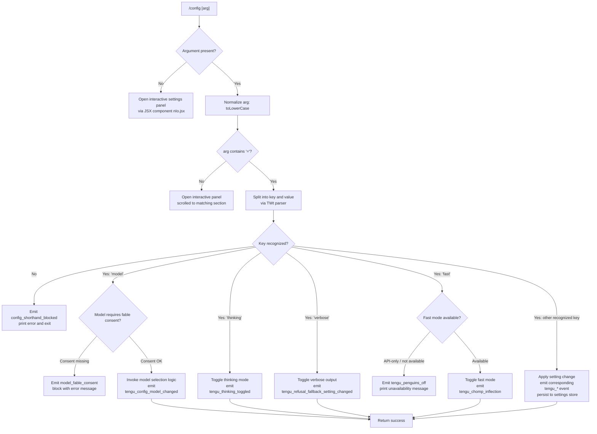

# `/config`

> Analysis basis: CC v2.1.186 bundle.js (AST extraction + Claude interpretation)
> Minimum version: v2.1.186

---

## Overview

The `/config` command (aliased as `/settings`) opens an interactive settings panel that allows users to inspect and modify Claude Code's runtime configuration. It accepts an optional `key=value` shorthand argument to set individual configuration entries directly from the command line without opening the full interactive UI. The command renders as a JSX component (`local-jsx` type) and delegates to the async handler `wef` to parse arguments, validate settings keys, and apply changes to persistent configuration stores.

---

## Registration

| Field | Value |
|---|---|
| type | `local-jsx` |
| name | `config` |
| description | `Open settings` |
| aliases | `["settings"]` |
| argumentHint | `[key=value]` |
| module_id | `Uhl` |
| load_inline | `true` |
| loc_byte | `11559571` |
| loc_byte_end | `11559849` |
| arbor_handler.name | `wef` |
| arbor_handler.fqn | `claude-2.1.186::wef` |
| arbor_handler.kind | `AsyncFunction` |
| arbor_handler.resolution_path | `module_id` |
| arbor_handler.n_hits | `0` |

Analysis basis: CC v2.1.186 bundle.js:+11559571

---

## Input Branching

The handler `wef` exhibits five or more distinct input paths based on argument presence, recognized key names, and model/feature guard conditions. A Mermaid flowchart is used.



Analysis basis: CC v2.1.186 bundle.js:+11558643, +11558704, +11558723, +11558833, +11558875

---

## Behavioral Spec

### 1. Argument Parsing (`TWt`)

The argument string is pre-processed before any branching occurs.

```
function parseConfigArgument(rawArg):
    trimmed = rawArg.trim()
    if trimmed does not include '=':
        return { mode: "open-panel", section: trimmed.toLowerCase() }
    equalsIndex = trimmed.indexOf('=')
    key   = trimmed.slice(0, equalsIndex).trim()
    value = trimmed.slice(equalsIndex + 1).trim()
    remaining = collect remaining segments after split
    return { mode: "set", key: key.toLowerCase(), value: value, extra: remaining }
```

Analysis basis: CC v2.1.186 bundle.js:+11361431, +11361448, +11361482, +11361538, +11361555, +11361699

### 2. Interactive Panel Rendering (`wef` → `nIo.jsx`)

When no `key=value` argument is provided, the command renders the full-screen settings panel JSX component.

```
async function configCommandHandler(context, args):
    normalizedArgs = args.toLowerCase()
    if NOT contains '=':
        render JSX component: settingsPanel(context)
        return
    // ... shorthand path follows
```

Analysis basis: CC v2.1.186 bundle.js:+11558643, +11558704

### 3. Settings Panel Content (`wmt`)

The interactive panel is composed of many individually registered setting rows, each with a display label, a config key, and a control type. The following settings are confirmed present (representative sample from literals):

| Config Key | Display Label | Control Type |
|---|---|---|
| `model` | `Model` | enum / model picker |
| `verbose` | `Verbose output` | boolean toggle |
| `thinking` | `Thinking mode` | boolean toggle |
| `fast` | `Fast mode` | boolean toggle (guarded) |
| `autoCompact` | `Auto-compact` | boolean toggle |
| `tips` | `Show tips` | boolean toggle |
| `reduceMotion` | `Reduce motion` | boolean toggle |
| `promptSuggestionEnabled` | `Prompt suggestions` | boolean toggle |
| `recap` | `Session recap` | boolean toggle |
| `checkpoints` | `Rewind code (checkpoints)` | boolean toggle |
| `workflows` | `Dynamic workflows` | boolean toggle |
| `progressBar` | `Terminal progress bar` | boolean toggle |
| `showStatusInTerminalTab` | `Show status in terminal tab` | boolean toggle |
| `turnDuration` | `Show turn duration` | boolean toggle |
| `timestamps` | `Show message timestamps` | boolean toggle |
| `permissionMode` | `Default permission mode` | enum (`default`, `plan`, `bypassPermissions`, `auto`) |
| `worktreeBaseRef` | `Worktree base ref` | enum (`fresh`, `head`) |
| `gitignore` | `Respect .gitignore in file picker` | boolean toggle |
| `copyFullResponse` | `Skip the /copy picker` | boolean toggle |
| `copyOnSelect` | `Copy on select` | boolean toggle |
| `autoScroll` | `Auto-scroll` | boolean toggle |
| `agentsView` | `Agents view` | managed enum |
| `defaultToAgentsView` | `Open agents view by default` | boolean toggle |
| `autoUpdatesChannel` | `Auto-update channel` | enum (`rc`, `slow`, `latest`) |
| `theme` | `Theme` | enum (with hint: use `/theme`) |
| `notifChannel` | `Notifications` | enum (`terminal_bell`, `iterm2+bell`, `none`) |
| `outputStyle` | `Output style` | enum (with hint: open `/config`) |
| `defaultView` | `Default view` | enum (`transcript`, `chat`) |
| `language` | `Language` | string (free text or ISO code) |
| `editor` | `Editor mode` | enum (`emacs`, `normal`, `vim`) |
| `externalEditorContext` | `Show last response in external editor` | boolean toggle |
| `prStatus` | `Show PR status footer` | boolean toggle |
| `diffTool` | `Diff tool` | enum (`terminal`) |
| `autoConnectIde` | `Auto-connect to IDE (external terminal)` | boolean toggle |
| `autoInstallIdeExtension` | `Auto-install IDE extension` | boolean toggle |
| `chrome` | `Claude in Chrome` | boolean toggle |
| `teammateMode` | `Teammate mode` | enum (`tmux`, `iterm2`, `in-process`) |
| `teammateDefaultModel` | `Default teammate model` | model picker |
| `remoteControl` | `Enable Remote Control for all sessions` | boolean toggle |
| `showExternalIncludesDialog` | `External CLAUDE.md includes` | boolean toggle |
| `apiKey` | `Use custom API key` | string input |
| `precomputeCompactionEnabled` | `Precompute compaction` | boolean toggle |
| `useAutoModeDuringPlan` | `Use auto mode during plan` | boolean toggle |
| `switchModelsOnFlag` | — | boolean toggle |
| `agentPushNotifEnabled` | — | boolean toggle |
| `inputNeededNotifEnabled` | — | boolean toggle |
| `preferredNotifChannel` | — | enum |
| `fileCheckpointingEnabled` | — | boolean toggle |
| `workflowKeywordTriggerEnabled` | `Ultracode keyword trigger` | boolean toggle |
| `terminalProgressBarEnabled` | — | boolean toggle |
| `autoScrollEnabled` | — | boolean toggle |
| `showTurnDuration` | — | boolean toggle |
| `showMessageTimestamps` | — | boolean toggle |
| `editorMode` | — | enum |
| `autoCompactEnabled` | — | boolean toggle |
| `remoteControlAtStartup` | — | boolean toggle |
| `leftArrowOpensAgents` | — | boolean toggle |
| `showExternalIncludesDialog` | — | boolean toggle |

Analysis basis: CC v2.1.186 bundle.js:+11345408, +11345533, +11346146, +11347126, +11347765, +11348221, +11349209, +11349780, +11350356, +11350643, +11351258, +11352082, +11352324, +11352513, +11352674, +11352881, +11353473, +11353736, +11353919, +11354438, +11354774, +11355229, +11355557, +11356121, +11356784, +11357031, +11357312, +11357617, +11357954, +11358307, +11358788, +11359369, +11359571

### 4. Model Setting — Fable Consent Guard (`wef` → shorthand `model`)

When `model` is set via shorthand, the handler checks whether the selected model requires "usage-credits" consent (fable model family).

```
function applyModelShorthand(context, value):
    if modelRequiresFableConsent(value):
        emitTelemetry("model_fable_consent")
        printError("needs usage-credits consent — run /model first")
        return blocked
    applyModelChange(context, value)
    emitTelemetry("tengu_config_model_changed")
```

Analysis basis: CC v2.1.186 bundle.js:+11356641, +11356663, +11356704, +11345088

### 5. Fast Mode Guard (`Woe`)

The fast mode toggle checks authentication type and provider before applying.

```
function applyFastModeToggle(context, enable):
    if provider is "bedrock" or "foundry" or "anthropicAws" or "mantle" or "vertex":
        printError("Fast mode is only available when using the Anthropic API directly")
        return
    if agentSdkMode:
        printError("Fast mode is not available in the Agent SDK")
        return
    if orgStatus == "pending":
        printError("Checking fast mode availability (org status pending)")
        return
    if orgStatus == "disabled" or "network_error" or "unknown":
        printError("Fast mode is not available")
        return
    toggleFastMode(enable)
    emitTelemetry("tengu_penguins_off")    // when disabling
    emitTelemetry("tengu_chomp_inflection") // when enabling
```

Analysis basis: CC v2.1.186 bundle.js:+2262728, +2262796, +2263143, +2263213, +2263305, +2263433, +2263468, +2262834, +11347731

### 6. Notification Preferences Patch (`ZXp`)

When notification-related settings change, a remote patch call is attempted.

```
function patchNotificationPreferences(newPrefs):
    logTelemetry("notif_prefs_patch")
    if notAuthenticated:
        logTelemetry("no_auth")
        return
    result = callRemotePatch(newPrefs)
    if result.ok:
        logTelemetry("notif_prefs_patch_ok")
    else if result.httpError:
        logTelemetry("http_error")
        logTelemetry("notif_prefs_patch_failed")
    else:
        logTelemetry("notif_prefs_patch_failed")
```

Analysis basis: CC v2.1.186 bundle.js:+11337608, +11337636, +11337674, +11337694, +11337715, +11337722, +11337810, +11337870

### 7. Settings Persistence (`ro` → `BTt` / `_n`)

All configuration mutations are written to disk through a locked file-write pipeline.

```
function persistSettings(settingLayer, delta):
    // settingLayer: one of "userSettings", "projectSettings", "localSettings", "policySettings"
    acquireLockWithTimeout(60000ms)      // 60 s max wait
    existingConfig = readConfigFromDisk()
    if existingConfig missing auth that cache holds:
        emitTelemetry("tengu_config_auth_loss_prevented")
        abort("refusing to write to avoid wiping ~/.claude.json")
    mergedConfig = merge(existingConfig, delta)
    atomicWriteWithFlush(mergedConfig)   // via BTt: temp file → fchmod → fsync → rename
    emitTelemetry("tengu_config_stale_write")   // if stale
    emitTelemetry("tengu_config_lock_contention") // if lock wait exceeded threshold
    invalidateCaches()                   // via EH: clears xYt and csr caches
```

The settings file paths resolved at runtime:
- User settings: `.claude/settings.json` (Analysis basis: CC v2.1.186 bundle.js:+1315390, +1315400)
- Local settings: `.claude/settings.local.json` (Analysis basis: CC v2.1.186 bundle.js:+1315462)

Analysis basis: CC v2.1.186 bundle.js:+13850329, +13850468, +13850557, +13850693, +13851036, +13851238, +1099028

### 8. Workflow Enable/Disable Toggle (`lTo`)

The settings panel includes workflow management that reads and sets the `appState`.

```
function toggleWorkflows(context, enable):
    currentState = context.getAppState()
    if enable:
        updateAppState("enableWorkflows")
        emitTelemetry("allow_workflows")
    else:
        updateAppState("disableWorkflows")
    context.setAppState(updatedState)
    persistViaZC(updatedState)
```

Analysis basis: CC v2.1.186 bundle.js:+11364608, +11364636, +11364660, +11365485

### 9. Thinking Mode Toggle (`wmt` → key `thinking`)

```
function applyThinkingToggle(context, enable):
    updateLocalSetting("thinking", enable)
    emitTelemetry("tengu_thinking_toggled")
    if enable:
        setAppState key="thinking_toggle"
```

Analysis basis: CC v2.1.186 bundle.js:+11347126, +11347143, +11347290, +11347331

---

## State & Side Effects

| Item | Detail |
|---|---|
| Telemetry: model change | `tengu_config_model_changed` (bundle.js:+11345088) |
| Telemetry: feature flags | `tengu_feature_ok`, `tengu_feature_sad`, `tengu_feature_bad` (bundle.js:+1024705, +1024853, +1024772) |
| Telemetry: push notif pref | `tengu_push_notif_pref_changed` (bundle.js:+11345864) |
| Telemetry: auto-compact | `tengu_auto_compact_setting_changed` (bundle.js:+11346302) |
| Telemetry: refusal fallback | `tengu_refusal_fallback_setting_changed` (bundle.js:+11346540) |
| Telemetry: tips | `tengu_tips_setting_changed` (bundle.js:+11346771) |
| Telemetry: reduce motion | `tengu_reduce_motion_setting_changed` (bundle.js:+11347069) |
| Telemetry: thinking | `tengu_thinking_toggled` (bundle.js:+11347290) |
| Telemetry: fast mode off | `tengu_penguins_off` (bundle.js:+2262834) |
| Telemetry: fast mode toggle | `tengu_chomp_inflection` (bundle.js:+11347731) |
| Telemetry: prompt suggestions | `tengu_sedge_lantern` (bundle.js:+11347965) |
| Telemetry: checkpoints | `tengu_file_history_snapshots_setting_changed` (bundle.js:+11348408) |
| Telemetry: dynamic workflows | `tengu_maple_sundial` (bundle.js:+11342956) |
| Telemetry: progress bar | `tengu_terminal_progress_bar_setting_changed` (bundle.js:+11349398) |
| Telemetry: terminal sidebar | `tengu_terminal_sidebar` (bundle.js:+11349465) |
| Telemetry: terminal tab status | `tengu_terminal_tab_status_setting_changed` (bundle.js:+11349713) |
| Telemetry: turn duration | `tengu_show_turn_duration_setting_changed` (bundle.js:+11349937) |
| Telemetry: sepia moth | `tengu_sepia_moth` (bundle.js:+11350001) |
| Telemetry: precompute compaction | `tengu_precompute_compaction_setting_changed` (bundle.js:+11350257) |
| Telemetry: silk hinge | `tengu_silk_hinge` (bundle.js:+11350328) |
| Telemetry: message timestamps | `tengu_show_message_timestamps_setting_changed` (bundle.js:+11350572) |
| Telemetry: gitignore | `tengu_respect_gitignore_setting_changed` (bundle.js:+11352263) |
| Telemetry: fullscreen (amber creek) | `tengu_amber_creek` (bundle.js:+3551256) |
| Telemetry: fullscreen (pewter brook) | `tengu_pewter_brook` (bundle.js:+3551164) |
| Telemetry: kairos input push | `tengu_kairos_input_needed_push` (bundle.js:+4931875) |
| Telemetry: default view | `tengu_default_view_setting_changed` (bundle.js:+11355158) |
| Telemetry: editor mode | `tengu_editor_mode_changed` (bundle.js:+11355747) |
| Telemetry: external editor context | `tengu_external_editor_context_changed` (bundle.js:+11356062) |
| Telemetry: PR status footer | `tengu_pr_status_footer_setting_changed` (bundle.js:+11356376) |
| Telemetry: diff tool | `tengu_diff_tool_changed` (bundle.js:+11356949) |
| Telemetry: auto-connect IDE | `tengu_auto_connect_ide_changed` (bundle.js:+11357221) |
| Telemetry: auto-install IDE extension | `tengu_auto_install_ide_extension_changed` (bundle.js:+11357525) |
| Telemetry: Claude in Chrome | `tengu_claude_in_chrome_setting_changed` (bundle.js:+11357861) |
| Telemetry: teammate mode | `tengu_teammate_mode_changed` (bundle.js:+11358257) |
| Telemetry: CCR bridge | `tengu_ccr_bridge` (bundle.js:+13834104) |
| Telemetry: auto mode config | `tengu_auto_mode_config` (bundle.js:+13713961) |
| Telemetry: kairos push notifications | `tengu_kairos_push_notifications` (bundle.js:+4931812) |
| Telemetry: config lock contention | `tengu_config_lock_contention` (bundle.js:+13850557) |
| Telemetry: config stale write | `tengu_config_stale_write` (bundle.js:+13850693) |
| Telemetry: config auth loss prevented | `tengu_config_auth_loss_prevented` (bundle.js:+13851036) |
| Telemetry: config parse error | `tengu_config_parse_error` (bundle.js:+13853132) |
| Telemetry: config fallback write | `tengu_config_fallback_write` (bundle.js:+13850173) |
| Telemetry: bg retire pinned | `tengu_bg_retire_pinned_low_mem` (bundle.js:+17162316) |
| Telemetry: bg prewarm per sweep | `tengu_bg_prewarm_per_sweep` (bundle.js:+17162437) |
| Telemetry: daemon config reload | `tengu_daemon_config_reload` (bundle.js:+17173497) |
| Telemetry: daemon idle exit | `tengu_daemon_idle_exit` (bundle.js:+17178932) |
| Telemetry: daemon yield | `tengu_daemon_yield` (bundle.js:+17177902) |
| Telemetry: amber flint | `tengu_amber_flint` (bundle.js:+7070691) |
| appState changes | `enableWorkflows` / `disableWorkflows` written via `lTo` → `e.setAppState` (bundle.js:+11365485); `thinking_toggle` key toggled (bundle.js:+11347331) |
| Settings files written | `.claude/settings.json` (user), `.claude/settings.local.json` (local) via atomic `BTt` pipeline with fsync + rename |
| Cache invalidation | `xYt` and `csr` caches cleared on every write (bundle.js:+29197, +29209) |
| Notification patch | Remote HTTP PATCH call attempted when notification preference changes (bundle.js:+11337636) |
| Lock file | Config writes acquire a file lock with a 60,000 ms timeout (bundle.js:+13851238); lock-contention events emitted if exceeded (bundle.js:+13850557) |
| Backup files | Up to 5 rotating backups created with `.backup.` prefix during atomic write (bundle.js:+13851354, +13851487) |
| Sound | <!-- TODO: not found in depth-2 traversal; needs --depth 4 --> |

---

## Version History

| Version | Change |
|---|---|
| v2.1.186 | Initial analysis |

---

## Common Mistakes

1. **Using `/config key value` instead of `/config key=value`**: The shorthand form requires an equals sign; a space-separated argument will be treated as a panel-open request with a section hint, not as a value assignment.
2. **Setting `model` to a fable-family model without prior consent**: The handler blocks the change and emits `model_fable_consent` telemetry. You must run `/model` first to accept usage-credits terms before `/config model=<fable-model>` succeeds.
3. **Attempting `fast=on` on non-Anthropic-API providers**: Fast mode is guarded against Bedrock, Foundry, Vertex, and Agent SDK contexts; the command will print an unavailability message and make no change.
4. **Expecting immediate disk persistence for all fields**: Some settings are session-only (e.g. the per-session model override with the hint `· this session only — /model to set up`); writing them via `/config` will not persist across sessions.
5. **Concurrent Claude instances writing config**: The lock-acquisition system prints a warning if another instance is holding the lock (Analysis basis: CC v2.1.186 bundle.js:+13850468). Concurrent writes can cause `tengu_config_lock_contention` events and may result in stale-write guards refusing the save to protect authentication data (Analysis basis: CC v2.1.186 bundle.js:+13850884).
6. **Expecting `/config theme=<name>` to work**: The `theme` entry in the panel shows the hint "For custom themes, use /theme." — theme changes should be made through `/theme`, not `/config`.

---

## Appendix — Identifier Mapping

> For bundle debugging only. Identifiers change across versions.

| Identifier | Role |
|---|---|
| `wef` | Main async command handler for `/config` (arbor_handler) |
| `TWt` | Argument parser: splits raw arg into key/value on `=` delimiter |
| `CWt` | Settings panel orchestrator; calls `wmt` and `lTo` |
| `wmt` | Large settings-row builder; constructs all individual setting entries |
| `lTo` | Panel render function; reads/writes appState, renders JSX settings UI |
| `nIo` | JSX component for the settings panel (rendered by `wef`) |
| `ZXp` | Notification preference remote-patch handler |
| `Nxe` | Model enum resolution and display-name mapping |
| `Woe` | Fast-mode availability checker and toggle applier |
| `ro` | Core settings read/write orchestrator |
| `BTt` | Atomic file-write utility: temp file → fchmod → fsync → rename |
| `_n` | Global config save function with auth-loss guard |
| `IQn` | Config file writer with lock acquisition and backup rotation |
| `cEe` | Config file reader (readFileSync with parse and stat) |
| `TQn` | Config write helper (inner) |
| `EH` | Cache invalidation: clears `xYt` and `csr` after write |
| `DG` | Settings loader from disk (emits `loadSettingsFromDisk_start/end` literals) |
| `Z$` | Settings layer merger (user / project / local / policy) |
| `p9` | Settings file path resolver (`.claude/settings.json`, etc.) |
| `Xss` | Gitignore tracking utility (writes to disk) |
| `Ts` | CLI error reporter: prints red error + exits with code 1 |
| `X8e` | Error formatter using `Et.red` |
| `sT` | Error file writer (writes diagnostic on fatal error) |
| `jm` | Project root resolver |
| `CEr` | Settings path composer |
| `Nyr` | Timestamp recorder (`lon.set` + `Date.now`) |
| `z1e` | Settings re-read helper |
| `De` | JSON serializer (`JSON.stringify`) |
| `Zo` | Model ID normalizer (trims, lowercases, maps aliases like `sonnet`, `haiku`, `opus`, `best`, `fable`) |
| `vm` | Model variant checker (includes guard for `opus-4-7`, `opus-4-8`) |
| `YG` | Model tier resolver |
| `TH` | Model family tagger |
| `b0` | First-party model validator |
| `VU` | Model display info builder |
| `sb` | Model display string builder (Tfe + br + yo + Di) |
| `Di` | Subscription tier descriptor |
| `Ife` | Subscription provider gate |
| `Tfe` | Model base name formatter |
| `br` | Provider name tagger (bedrock / foundry / vertex etc.) |
| `d2` | Settings schema descriptor |
| `sfn` | Setting-row factory (creates toggle/enum row objects) |
| `$g` | Setting composite builder (Zo + vw) |
| `ofl` | Setting-filter and option-list builder |
| `mz` | Model shorthand list builder |
| `jbo` | Model shorthand matcher (case-insensitive includes) |
| `Ybo` | Extended model shorthand matcher |
| `ja` | Model option parser (VIt + KIt + $o + Zo paths) |
| `Es` | Fullscreen mode evaluator |
| `G$` | Feature flag gate |
| `dx` | Local-agent feature check |
| `O3r` | Fullscreen option renderer |
| `dZ` | Fullscreen disabled renderer |
| `P3r` | Fullscreen availability checker |
| `Nr` | Settings writer (calls DG) |
| `vcd` | Fullscreen panel setting row |
| `px` | Settings panel section builder |
| `KZe` | Panel section inner builder (K2r) |
| `YRe` | Panel with tabs renderer |
| `ta` | Tab component |
| `Ql` | Safe-mode / bare-mode row builder |
| `Hl` | Safe-mode option row |
| `Ud` | Bare-mode option row |
| `W9` | Value prefix stripper (`e.startsWith` / `e.slice`) |
| `tTo` | <!-- TODO: not found in depth-2 traversal; needs --depth 4 --> |
| `bwn` | Push-notification gating (calls `it`) |
| `Ude` | Setting update emitter |
| `Pe` | Positive feature reporter (`KVe`) |
| `Ke` | Positive feature reporter wrapper |
| `iLn` | Model switch-on-flag row builder (`Jj`) |
| `Zbo` | Notification pref orchestrator; calls `efl` + `ZXp` |
| `efl` | Notification channel formatter (`Nr` + `wt`) |
| `rc` | Config reload and state synchronizer |
| `QR` | Config tag set manager |
| `BEr` | Project config resolver (`jm` + `Toe.resolve`) |
| `gSn` | Workflow consent gate (`yEi` + `ot` + `aBr`) |
| `yEi` | Workflow allowance checker |
| `aBr` | Consent storage writer (`Mid`) |
| `Fxe` | Feature check (`f9`) |
| `wWe` | Auto-mode state reader (`it` + `wPo`) |
| `pae` | Push-notification eligibility check (`it`) |
| `Ki` | Network mode accessor (`ins`) |
| `ins` | Inner network mode check |
| `aA` | Subscription accessor (`Gs`) |
| `U3e` | IDE connection checker (`e.some`) |
| `wHe` | Auto-update channel watcher (`Xje` + `wt`) |
| `SVn` | Teammate model row builder (`d2` + `c5t`) |
| `c5t` | Teammate model default resolver (`br` + `Vp`) |
| `AL` | Remote-control setting handler (`HQn` + `SKt` + `mq` + `c6e`) |
| `SKt` | Remote-control state manager (`BL`) |
| `mq` | Remote-control toggle row (`ot` + `ta`) |
| `c6e` | Remote-control inner state (`Nl` + `yHt` + `it`) |
| `nue` | Daemon heartbeat/watcher (`BL` + `wt` + `dL` + `to`) |
| `to` | Module initializer shim (`EPe` + `Mor` + `q7t` + `V7t` + `oEc` + `m3o`) |
| `aTo` | <!-- TODO: not found in depth-2 traversal; needs --depth 4 --> |
| `nT` | <!-- TODO: not found in depth-2 traversal; needs --depth 4 --> |
| `YN` | Slice helper (`e.slice` at byte 2155092) |
| `vmt` | Settings meta-writer (`wt` + `Nr`) |
| `ZC` | Settings commit relay (`ro`) |
| `OFt` | Output-style row builder (`F6` + `xPo` + `w$` + `lEe`) |
| `F6` | Output-style option list builder |
| `xPo` | Output-style formatter (`f9` + `Dv` + `zEr`) |
| `lEe` | Output-style display mapper |
| `NEo` | <!-- TODO: not found in depth-2 traversal; needs --depth 4 --> |
| `In` | Config import helper (`Qon` + `Z$`) |
| `Qon` | Config merge helper (`J4o` + `CEr` + `Q4o`) |
| `GM` | Notification-bubble formatter (`Con`) |
| `dO` | Notification-bubble gate (`BM.includes`) |
| `A` | Agent scheduler tick (`_` sub-graph) |
| `_` | Background agent lifecycle manager |
| `L` | Background worker sweep loop |
| `w` | Background focus/blur tracker |
| `hcc` | Away-summary message detector |
| `gcc` | Context summarizer gate |
| `d2` | Settings schema descriptor (also used in teammate path) |
| `N` | Agent task queue |
| `Zut` | Agent task runner (`Ado` + `y9t` + `T`) |
| `J5` | Agent task executor (`zc` + `bit` + `IA` + `ot` + `Zpt`) |
| `U` | Output write scheduler (`clearTimeout` + `setTimeout` + `d.write`) |
| `d` | Terminal output writer (supervisor mode) |
| `k` | Foreground-yield writer |
| `Ga` | Agent-teams row builder (`ot` + `NXd` + `it`) |
| `teo` | <!-- TODO: not found in depth-2 traversal; needs --depth 4 --> |
| `neo` | Simple text node (`T`) |
| `l5t` | <!-- TODO: not found in depth-2 traversal; needs --depth 4 --> |
| `Wn` | Literal passthrough (`t`) |
| `ib` | Model capability flags loader (`yl` + `So` + `YG`) |
| `zY` | Model display row (`ib` + `Zo` + `TOt`) |
| `TOt` | Model usage-credits check (`vKr`) |
| `Ire` | <!-- TODO: not found in depth-2 traversal; needs --depth 4 --> |
| `MC` | Cache manager (`zJ`) |
| `kn` | File-system utility (`mn`) |
| `Ea` | <!-- TODO: not found in depth-2 traversal; needs --depth 4 --> |
| `T` | Setting-value formatter (uOe + Pvc + De + Lc + XP + eze + Fvc) |
| `gr` | Permission checker (`GL`) |
| `ke` | Positive feature-flag reporter |
| `Mt` | Negative feature-flag reporter |
| `xe` | Error feature-flag reporter |
| `Re` | Agent request emitter (`ao` + `ot` + `Ki` + `Pnu`) |
| `it` | Config-access guard (`ORt` + `NRt` + `$9` + `JEn` + `wt`) |
| `wt` | Config file read-and-parse orchestrator (`Gt` + `QL` + `mOo` + `cEe` + `Lxf`) |
| `iBr` | Consent persistence relay (`aBr`) |
| `Cmt` | Verbose output row builder (`Uxe`) |
| `Uxe` | Verbose toggle with `it` guard |
| `_Te` | <!-- TODO: not found in depth-2 traversal; needs --depth 4 --> |
| `FNe` | Fast-mode row builder (`sb`) |
| `Cw` | Fast-mode wrapper (`$l` + `Woe`) |
| `A9` | <!-- TODO: not found in depth-2 traversal; needs --depth 4 --> |
| `$l` | Model context accessor (`br` + `ot`) |
| `ot` | String converter (`String`) |
| `P` | Timer unref handle |
| `P7e` | <!-- TODO: not found in depth-2 traversal; needs --depth 4 --> |
| `$` | Scheduler handle set |
| `Ude` | Update emitter |
| `XB` | <!-- TODO: not found in depth-2 traversal; needs --depth 4 --> |
| `hOo` | Object-entries iterator for config map |
| `TKt` | Timestamp writer (`Date.now`) |
| `EHt` | <!-- TODO: not found in depth-2 traversal; needs --depth 4 --> |
| `fDe` | <!-- TODO: not found in depth-2 traversal; needs --depth 4 --> |