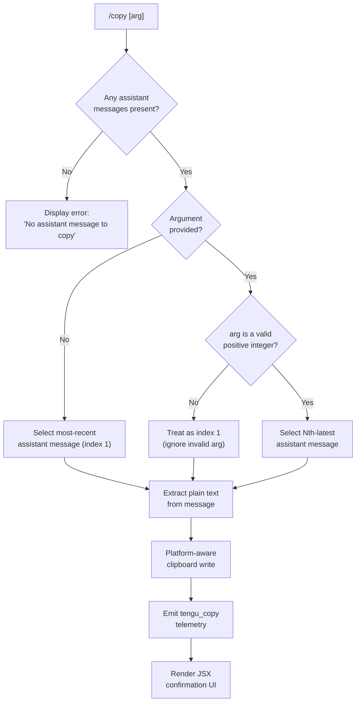

# `/copy`

> Analysis basis: CC v2.1.186 bundle.js (AST extraction + Claude interpretation)
> Minimum version: v2.1.186

---

## Overview

The `/copy` command copies Claude's last assistant-role response text to the system clipboard. An optional numeric argument `N` selects the Nth-latest assistant message instead of the most recent one. The command extracts plain text from conversation history, invokes a platform-aware clipboard writer, and emits a `tengu_copy` telemetry event on completion.

---

## Registration

| Field | Value |
|---|---|
| type | `local-jsx` |
| name | `copy` |
| description | `Copy Claude's last response to clipboard (or /copy N for the Nth-latest)` |
| module_id | `cpl` |
| load_inline | `true` |
| loc_byte | `11302649` |
| loc_byte_end | `11302835` |
| loc_line | `7026` |
| arbor_handler.name | `RXp` |
| arbor_handler.fqn | `claude-2.1.186::RXp` |
| arbor_handler.kind | `AsyncFunction` |
| arbor_handler.resolution_path | `module_id` |
| arbor_handler.n_hits | `0` |

Analysis basis: CC v2.1.186 bundle.js:+11302649

---

## Input Branching

Four distinct paths are possible depending on whether the conversation has any assistant messages and whether a valid integer argument is supplied.



---

## Behavioral Spec

### Top-Level Handler (`RXp`)

The Arbor-resolved handler is the async function `RXp` (module `cpl`), reached via `module_id` resolution.

```
async function copyCommandHandler(options):
    messages = collectAssistantMessages(options)

    if messages is empty:
        return renderError("No assistant message to copy")

    rawArg = options.userArgument           // text following "/copy"
    index  = 1                              // default: most-recent

    if rawArg is present:
        parsed = Number(rawArg)
        if Number.isInteger(parsed) and parsed >= 1:
            index = parsed
        // else: keep default index = 1

    targetMessage = messages[index - 1]    // 1-based, newest-first
    if targetMessage is undefined:
        return renderError("No assistant message to copy")

    plainText = extractPlainText(targetMessage)

    writeToClipboard(plainText)            // see platform dispatch below

    emit telemetry event "tengu_copy"      // bundle.js:+11302252

    return renderJsxConfirmation(plainText)
```

Analysis basis: CC v2.1.186 bundle.js:+11301833 – +11302376

---

### Assistant Message Collection (`ipl`)

Walks the conversation message array, keeps only entries whose role is `"assistant"` or whose content block type is `"text"`, and reverses them so index 1 is the most-recent.

```
function collectAssistantMessages(options):
    allMessages = options.messages          // literal key "messages" bundle.js:+11302138
    result = []

    if not Array.isArray(allMessages):
        return result

    for msg in allMessages:
        filtered = filterTextBlocks(msg)    // filterTextBlocks ≡ Wl
        if filtered is non-empty:
            result.push(filtered)

    return result                           // newest-first order preserved by caller
```

Analysis basis: CC v2.1.186 bundle.js:+11297910 – +11297958

---

### Text Block Filter (`Wl`)

Retains only content blocks whose `type` field equals the literal `"text"` (bundle.js:+13763129).

```
function filterTextBlocks(message):
    return message.content.filter(block => block.type === "text")
```

Analysis basis: CC v2.1.186 bundle.js:+13763106

---

### Plain-Text Extraction (`spl` / `apl`)

Converts the selected message's text content blocks into a single plain string. Markdown table syntax (`\|` separator, bundle.js:+11297033) is handled specially: columns are detected via `Pm.lexer` (a Markdown lexer, bundle.js:+11297491), rows are reformatted with `" | "` separators (bundle.js:+11297192) and aligned using `Math.max`-based column widths (bundle.js:+11297083) with alignment modes `"left"`, `"center"`, `"right"` (bundle.js:+11297301, +11297227, +11297265). Non-table content is returned after a `c.replace` call that strips internal pipe escapes.

Format constants found in the extraction path:

| Constant | Value | loc_byte |
|---|---|---|
| Table-cell separator | `" \| "` | 11297033 |
| Column separator output | `" | "` | 11297192 |
| Min column count | `3` | 11297092 |
| Alignment: center | `"center"` | 11297227 |
| Alignment: right | `"right"` | 11297265 |
| Alignment: left | `"left"` | 11297301 |
| Output format: table | `"table"` | 11297604 |
| Output format: plaintext | `"plaintext"` | 11298045 |

```
function extractPlainText(messageBlocks):
    rawText = join all block.text values

    tokens = markdownLexer(rawText)         // Pm.lexer  bundle.js:+11297491

    if tokens contain table token:
        return formatAsAlignedTable(tokens)
    else:
        return rawText.replace(pipeEscapePattern, "")   // apl  bundle.js:+11298005
```

Analysis basis: CC v2.1.186 bundle.js:+11297491 – +11298045

---

### Platform-Aware Clipboard Write (`kbo` / `rv` / `SAn` / `lpl`)

The clipboard write subsystem (`kbo`, bundle.js:+11298257) detects the current terminal/OS environment and dispatches to the appropriate native mechanism. The detection and dispatch logic (within `rv`) uses the following terminal-type constants:

| Terminal / mechanism | Literal | loc_byte |
|---|---|---|
| `"screen"` | GNU Screen | 3541092 |
| `"kitty"` | Kitty terminal | 3541561 |
| `"tmux-buffer"` | tmux paste buffer | 3541960 |
| `"osc52"` | OSC 52 escape | 3541980 |
| `"raw+dcs"` | Raw DCS sequence | 3543014 |
| `"dcs"` | DCS only | 3543037 |
| `"raw"` | Raw OSC only | 3543043 |
| `"none"` | No clipboard | 3543088 |

Platform-specific subprocess commands invoked:

| Platform | Command / args | loc_byte |
|---|---|---|
| macOS | `pbcopy` | 3543335 |
| Linux (Wayland) | `wl-copy` | 3542097 |
| Linux (X11, xclip) | `xclip -selection clipboard` | 3542165, 3543560 |
| Linux (X11, xsel) | `xsel --clipboard --input` | 3542205, 3543646, 3543660 |
| tmux | `tmux load-buffer -w` | 3542582, 3542590, 3542604 |
| WSL | `powershell.exe -NoProfile -NonInteractive -Command …` | 3543732, 3543750, 3543763, 3543781 |
| Windows (native) | `powershell` | 3543825 |

The OSC 52 path encodes content as `base64` (bundle.js:+3542916) and writes to the terminal via a `utf8`-decoded buffer (bundle.js:+3542899). A VS Code version compatibility warning is present inline: `"VS Code 1.123/1.124 will mojibake this paste — update to ≥1.125"` (bundle.js:+3542362).

The `SAn` function checks `D2.hasOsc52ClipboardUtf8Bug` (bundle.js:+3542305) before applying the OSC 52 path, gating the bug-affected workaround via `gcd` (bundle.js:+3542337).

Subprocess timeout: `2000` ms (bundle.js:+3543301).

The temporary-file helper (`lpl` → `uA`) writes clipboard content through a secure temp directory, verifying ownership and permissions:

| Constant | Value | loc_byte |
|---|---|---|
| Default tmp dir | `/tmp` | 3380289 |
| Owner mismatch error code | `"tempdir_owner_mismatch"` | 3380683 |
| Directory permissions (octal) | `511` (0o777) | 3380893 |
| File permissions (octal) | `448` (0o700) | 3381083 |

```
async function writeToClipboard(text):
    termType = detectTerminalType()        // rv  bundle.js:+3542930

    if SAn.hasOsc52Bug():
        // warn user: VS Code OSC52 mojibake note
        pass

    match termType:
        "tmux-buffer"  -> spawnTmux("load-buffer", "-w", tmpFile)
        "osc52"        -> writeOsc52Escape(base64(text))
        "screen"       -> writeScreenEscape(text)
        "kitty"        -> writeKittyEscape(text)
        "raw" | "raw+dcs" | "dcs" -> writeRawEscape(text)
        "none"         -> spawnNativeClipboard(text)
                          // pbcopy / wl-copy / xclip / xsel / powershell
```

Analysis basis: CC v2.1.186 bundle.js:+11298257 – +11298396

---

## State & Side Effects

| Item | Detail |
|---|---|
| Telemetry | `tengu_copy` (bundle.js:+11302252) — fired once per successful invocation |
| Telemetry (indirect, call graph depth-2) | `tengu_feature_ok` (+1024705), `tengu_feature_bad` (+1024772) — feature-flag probes reached via config path `wt` |
| Telemetry (indirect) | `tengu_config_parse_error` (+13853132), `tengu_config_auth_loss_prevented` (+13847465) — config read side effects |
| Clipboard write | System clipboard modified via platform subprocess or OSC 52 escape sequence |
| Subprocess spawned | One of: `pbcopy`, `wl-copy`, `xclip`, `xsel`, `powershell.exe`, `powershell`, `tmux` — with 2000 ms timeout |
| Temp file | Created in `$CLAUDE_CODE_TMPDIR` or `/tmp`; used as stdin pipe to clipboard subprocess; cleaned up after write |
| JSX render | Returns a JSX element (via `KY.jsx`, bundle.js:+11302376) confirming the copy; displayed in the CLI UI |
| appState changes | None observed at depth-2 traversal |
| Sound | None observed at depth-2 traversal |
| Hook registration | None observed at depth-2 traversal |

---

## Version History

| Version | Change |
|---|---|
| v2.1.186 | Initial analysis |

---

## Common Mistakes

1. **Passing a non-integer argument** — `/copy foo` is silently treated as `/copy 1` (falls back to most-recent message). No error is shown for non-numeric args.
2. **Using 0 or a negative index** — `Number.isInteger` check passes only for values ≥ 1; passing `0` or `-1` reverts to the default (index 1).
3. **Expecting Nth message from oldest** — The index counts from the **newest** assistant message, not the oldest. `/copy 2` gives the second-most-recent, not the second message in the session.
4. **VS Code terminal OSC 52 mojibake** — Running CC inside VS Code ≤1.124 may corrupt non-ASCII clipboard content via OSC 52. Upgrade VS Code to ≥1.125 or use a different terminal.
5. **Missing clipboard utility on Linux** — If none of `wl-copy`, `xclip`, or `xsel` is installed and no OSC 52 path is available, the clipboard write will fail silently. Install at least one X11/Wayland clipboard utility.
6. **`/tmp` ownership mismatch** — If `$CLAUDE_CODE_TMPDIR` or `/tmp` is owned by a different user, the command will refuse to write the temp file and emit a `"tempdir_owner_mismatch"` error. Set `CLAUDE_CODE_TMPDIR` to a directory you own.

---

## Appendix — Identifier Mapping

> For bundle debugging only. Identifiers change across versions.

| Identifier | Role |
|---|---|
| `RXp` | Top-level async handler for `/copy` command (Arbor-resolved, module `cpl`) |
| `opl` | Markdown table formatter / plain-text renderer |
| `CXp` | Inner cell-content mapper for table rows |
| `QNl` | Daemon status helper (called transitively via config path) |
| `_Q` | Configuration reader utility |
| `Cfe` | Text trimming / truncation helper (limit: 1000, loc_byte:+2300493) |
| `Xs` | AsyncLocalStorage store accessor (`bUu.getStore`) |
| `zqt` | Daemon status file path builder (`daemon.status.json`) |
| `De` | JSON serializer wrapper |
| `bn` | String normalization / escape helper |
| `on` | String visual width calculator (`Bun.stringWidth`) |
| `bf` | String repeat / pad helper |
| `Z3e` | MCP server connection manager |
| `TB` | MCP tool registration dispatcher |
| `Sst` | MCP skill/tool registration sub-handler |
| `m7` | Full MCP server connection lifecycle handler |
| `B4` | MCP SDK-type server enumerator |
| `aRn` | MCP connection error formatter (red/yellow ANSI) |
| `_st` | MCP SSE/HTTP transport negotiator |
| `JU` | MCP prototype chain builder (`Object.create`) |
| `Xw` | MCP state machine transition helper |
| `Jm` | MCP connection state initializer |
| `Wn` | Generic async task wrapper |
| `fca` | MCP plugin config hasher / cache-key builder |
| `kQr` | MCP needs-auth cache reader |
| `ELe` | SHA-256 content hasher (`foa.createHash`) |
| `Y_n` | Config object key enumerator |
| `X_n` | Config hash + integrity helper |
| `IT` | Config hash writer (`zai.createHash`) |
| `j_n` | Config read helper (`Bl` → `NGs`) |
| `Bl` | Low-level config file reader |
| `ln` | MCP debug logger (`VJ.logMCPDebug`) |
| `wRn` | MCP remote server retry orchestrator |
| `Lqd` | OAuth/SSE connection handler |
| `kqd` | MCP auth token exchange handler |
| `SUt` | MCP connect-with-cache helper |
| `Pxn` | MCP needs-auth cache path builder |
| `PXr` | MCP post-connect finalizer |
| `Ae` | String coercion wrapper |
| `Qw` | MCP skills telemetry emitter (`tengu_mcp_skills`) |
| `it` | MCP skill entry dispatcher |
| `EXr` | MCP transport exclusion checker |
| `_n` | Global config save helper |
| `w` | Background worker focus/blur lifecycle manager |
| `L` | Background worker sweep / prewarm orchestrator |
| `hcc` | Background session latest-message accessor |
| `gcc` | Background session message-list helper |
| `Wc` | MCP error logger (`VJ.logMCPError`) |
| `_ca` | Zod-like schema validator (`ZW`) |
| `ZW` | Schema/type validation engine |
| `nit` | `parseInt` wrapper (radix 10) |
| `Oxn` | `parseInt` wrapper (radix 20) |
| `arr` | MCP update applicator (`e.applyMcpUpdate`) |
| `Q3e` | MCP update content hasher |
| `WT` | MCP cleanup + reconnect orchestrator |
| `eit` | MCP content equality checker |
| `maa` | MCP server auto-reconnect helper (`AJr`) |
| `T` | Terminal/config context builder |
| `Pvc` | Config persistence writer |
| `U5o` | Config serializer sub-helper |
| `Lc` | Log file path builder / rotator |
| `SWo` | Log file suffix mapper |
| `eze` | TTY write helper |
| `cWo` | Raw TTY output writer |
| `Fvc` | File-write-and-flush implementation |
| `wKe` | Batched I/O scheduler (setTimeout/setImmediate) |
| `npe` | File path joiner for log output |
| `Rre` | Log file rename helper |
| `TWo` | Log path join helper |
| `pcr` | Log file rotation / stat checker |
| `Uvc` | Atomic append-file writer |
| `Ai` | Signal/process exit handler registrar |
| `q2o` | MCP client slot reconciler |
| `fRn` | MCP permission set checker |
| `Bn` | Async timeout-with-cleanup utility |
| `spl` | Per-message plain-text extractor (calls `opl`) |
| `Pm` | Markdown lexer wrapper (`bBe.parse`) |
| `apl` | Pipe-escape string replacer |
| `ipl` | Assistant message filter + collector |
| `Wl` | Text-block content filter |
| `IXp` | Markdown token normalizer / cleanup pass |
| `qke` | Token text replace helper |
| `wt` | Config file watcher initializer |
| `mOo` | Config file path resolver |
| `cEe` | Config file reader (readFileSync, UTF-8) |
| `Bt` | JSON parser wrapper |
| `i9` | Path prefix stripper |
| `mn` | Error logger / stderr writer |
| `HGl` | Config backup directory enumerator |
| `_Oo` | Config backup path joiner |
| `W` | General-purpose error reporter |
| `f` | Background worker instance manager |
| `D` | Scheduled task runner |
| `xe` | Feature-flag "ok" reporter (`tengu_feature_ok`) |
| `ke` | Feature-flag "bad" reporter (`tengu_feature_bad`) |
| `IXn` | macOS memory pressure checker |
| `D2e` | Temporary file lstat/rm helper |
| `Re` | Error event logger (`VJ.logError`) |
| `N` | Worker permission classifier (`deny`/`classify`/`ask`) |
| `$Bo` | Daemon socket connect helper |
| `KBo` | Background worker full lifecycle manager |
| `p` | Forced-shutdown / process-exit handler |
| `Pe` | KV-store entry accessor (`KVe`) |
| `Lxf` | Config file watcher (watchFile/unwatchFile) |
| `aV` | Config auto-save scheduler |
| `kbo` | Clipboard write dispatcher (calls `rv`, `SAn`, `lpl`) |
| `rv` | Terminal-type detection + clipboard write router |
| `_xt` | OSC / DCS escape sequence builder |
| `g_` | Raw escape sequence writer |
| `Dbi` | pbcopy/OSC52 subprocess launcher |
| `On` | Subprocess spawn abstraction |
| `R3r` | Linux clipboard subprocess selector (wl-copy/xclip/xsel) |
| `Hcd` | Clipboard write finalize helper |
| `k3r` | Terminal capability probe |
| `yxt` | DCS wrapper builder |
| `Nw` | tmux paste-buffer write helper |
| `Zy` | Screen DCS escape joiner |
| `Mbi` | Screen terminal escape builder |
| `tu` | String indexOf utility (clipboard path separator) |
| `SAn` | OSC52 UTF-8 bug detection gate |
| `gcd` | OSC52 bug workaround writer |
| `lpl` | Temp-file–based clipboard pipe helper |
| `uA` | Secure temp-directory creator/validator |
| `SU` | Temp-dir path resolver |
| `$Ei` | Temp-dir ownership/permission checker |
| `g_r` | Atomic file write helper (rename-into-place) |
| `u` | Worker sub-process accessor |
| `kn` | Filesystem error logger |
| `l7e` | fsync extended-attribute error filter |

Note: index built via Arbor fallback; some signals (telemetry, literals) may be missing — see arbor-fallback.js.