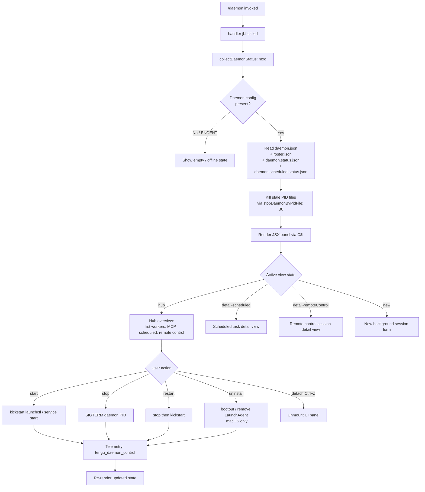

# `/daemon`

> Analysis basis: CC v2.1.186 bundle.js (AST extraction + Claude interpretation)
> Minimum version: v2.1.186

---

## Overview

The `/daemon` command provides an interactive management interface for the Claude Code background daemon process and its associated background services. It allows users to inspect daemon status, control the service lifecycle (start, stop, restart, uninstall), view scheduled task status, and monitor remote control sessions. The command renders a live JSX-based terminal UI panel that reflects real-time daemon state.

---

## Registration

| Field | Value |
|---|---|
| type | `local-jsx` |
| name | `daemon` |
| description | `Manage background services and routines` |
| immediate | `true` |
| module_id | `gxo` |
| load_inline | `true` |
| loc_byte | `13089872` |
| loc_byte_end | `13090040` |
| loc_line | `8828` |
| arbor_handler.name | `jbf` |
| arbor_handler.fqn | `claude-2.1.186::jbf` |
| arbor_handler.kind | `AsyncFunction` |
| arbor_handler.resolution_path | `module_id` |
| arbor_handler.n_hits | `0` |

Analysis basis: CC v2.1.186 bundle.js:+13089872

---

## Input Branching

The `/daemon` command has multiple distinct view branches (hub overview, scheduled detail, remote-control detail, new session, uninstall confirmation) and a series of lifecycle sub-commands, warranting a flowchart.



---

## Behavioral Spec

### 1. Command Entry — Handler `jbf`

The Arbor-resolved handler `jbf` (AsyncFunction, `claude-2.1.186::jbf`) is the true entry point.

Analysis basis: CC v2.1.186 bundle.js:+13079719

```
async function jbf(commandContext):
    statusBundle = await collectDaemonStatus()          // mxo
    jsx = renderDaemonPanel(statusBundle)               // C$l via Rc.jsx
    mount JSX panel into terminal UI
    await panel.lifecycle()
    panel.unmount()
```

### 2. Daemon Status Collection — `mxo`

`mxo` fans out several concurrent async reads and then assembles a composite status object.

Analysis basis: CC v2.1.186 bundle.js:+13079278

```
async function collectDaemonStatus():
    [configResult, pidFileResult, statusResult, scheduledStatusResult,
     rosterResult, launchctlResult] =
        await Promise.all([
            readDaemonConfig(),          // E$l  → reads daemon.json
            stopStalePidFile(),          // B0   → may send signal 0 / kill stale PID
            readStatusFile(),            // eUl  → reads daemon.status.json
            readScheduledStatusFile(),   // vFl  → reads daemon.scheduled.status.json
            readRoster(),               // $q   → reads roster.json
            queryLaunchctlStatus()      // eX   → runs launchctl print (macOS only)
        ])
    return assembleStatusBundle(...)
```

### 3. Config File Reading — `E$l` / `hRo`

Analysis basis: CC v2.1.186 bundle.js:+13074104, +12893611

```
async function readDaemonConfig():
    // Reads daemon.json from the Claude data directory
    // File size limit: 1 048 576 bytes (bundle.js:+12893669)
    stat = await fs.stat(configPath)
    if not stat.isFile():
        throw Error
    raw = await fs.readFile(configPath, "utf8")   // encoding: "utf8" (bundle.js:+12893788)
    trimmed = raw.trim()
    parsed = JSON.parse(trimmed)
    if not Array.isArray(parsed):
        throw validation error
    return parsed
```

### 4. Stale PID File Handling — `B0` / `VWt`

Analysis basis: CC v2.1.186 bundle.js:+11618156, +11617111

```
async function stopStalePidFile(pidFilePath):
    stat = await fs.lstat(pidFilePath)
    if not stat.isFile():
        // File size gate: 65 536 bytes max (bundle.js:+11617150)
        return null
    raw = await fs.readFile(pidFilePath)
    pid = parsePid(raw)                     // bIo: split, slice (bundle.js:+11618045)
    if pid matches "claude daemon":         // string literal (bundle.js:+11618075)
        try:
            process.kill(pid, 0)            // check process liveness (bundle.js:+11618184)
        catch:
            fs.rm(pidFilePath)              // remove stale file
    lines = await readDaemonLog()           // bIo reads log tail (4 lines, bundle.js:+11618102)
    return { pid, lines }
```

### 5. Roster File Reading — `$q` / `pne`

Analysis basis: CC v2.1.186 bundle.js:+11629430, +11625387

```
async function readRoster():
    stat = await fs.lstat(rosterPath)       // "roster.json" (bundle.js:+11625401)
    if not stat.isFile():
        // Emit telemetry if file exists but is not a regular file
        logWarning("is not a regular file — removing")  // (bundle.js:+11629577)
        fs.rm(rosterPath)
        return null
    raw = await fs.readFile(rosterPath)
    parsed = JSON.parse(raw)                // Bt helper (bundle.js:+192597)
    validateSchema(parsed)                  // hHl: Array.isArray + Object.keys checks
    return parsed

// On parse failure:
//   Telemetry: tengu_bg_roster_parse_failed (bundle.js:+11629623)
//   Error codes encountered: E2BIG (bundle.js:+11629703), EFTYPE (bundle.js:+11629715)
```

### 6. Status File Reading — `eUl` / `zqt`

Analysis basis: CC v2.1.186 bundle.js:+12893135

```
async function readStatusFile():
    // File: daemon.status.json (bundle.js:+12892849)
    path = buildPath("daemon.status.json")   // zqt via JNl.join
    raw = await fs.readFile(path)
    parsed = JSON.parse(raw)
    // On error: send SIGTERM to running daemon PID (bundle.js:+12893332)
    // Then wait for YC (process exit helper, bundle.js:+12893467)
    return parsed
```

### 7. Scheduled Status File Reading — `vFl` / `CFl`

Analysis basis: CC v2.1.186 bundle.js:+12985616

```
async function readScheduledStatusFile():
    // File: daemon.scheduled.status.json (bundle.js:+12985409)
    path = buildPath("daemon.scheduled.status.json")   // CFl via TFl.join
    raw = await fs.readFile(path)
    parsed = JSON.parse(raw)
    // "scheduled" string tag used (bundle.js:+12986914)
    return parsed
```

### 8. macOS `launchctl` Status Query — `eX` / `TKn`

Analysis basis: CC v2.1.186 bundle.js:+11622235

```
async function queryLaunchctlStatus():
    // Only meaningful on darwin (bundle.js:+11621746)
    uid = process.getuid()                    // rHl (bundle.js:+11619034)
    result = await runCommand(
        "launchctl",                          // (bundle.js:+11622238)
        ["print", `gui/${uid}/...`],          // (bundle.js:+11622251)
        { timeout: 5000 }                     // ms (bundle.js:+11622285)
    )
    return parseOutput(result)                // On

// Lifecycle sub-commands map to:
//   start   → "kickstart"   (bundle.js:+11621098)
//   stop    → "stop"        (bundle.js:+11621123) + SIGTERM
//   restart → stop + "kickstart"
//   uninstall → "bootout"   (bundle.js:+11620736)
//     Note: uninstall only available on darwin;
//     on other platforms: "service uninstall not available on darwin" (bundle.js:+11620867)
```

### 9. JSX Panel Rendering — `C$l` / `$rt` / `hxo`

Analysis basis: CC v2.1.186 bundle.js:+13079605, +13079851

The panel is a React/Ink JSX component tree. The root component (`hxo`) manages view state via `useState`.

```
function DaemonPanel(statusBundle):
    [viewState, setViewState] = useState("hub")   // tV.useState (bundle.js:+13079851)
    clockContext = useClock()                     // As → _ki.useContext (bundle.js:+3943310)
    startTimestamp = Date.now()                   // (bundle.js:+13079900)

    // Sub-views selectable:
    //   "hub"                → main overview
    //   "detail-scheduled"   → (bundle.js:+13080471)
    //   "detail-remoteControl" → (bundle.js:+13080611)
    //   "new"                → (bundle.js:+13080551)
    //   "uninstall"          → (bundle.js:+13080282)

    // Sections rendered in hub view:
    //   "Scheduled"          → (bundle.js:+13081001)
    //   "Remote Control"     → (bundle.js:+13081287)
    //   "Claude daemon"      → (bundle.js:+13081561)
    //   "permission"         → (bundle.js:+13081649)

    // MCP config rendered via C$l → $rt → COt (bundle.js:+5112870)
    //   includes model selection (firstParty / gateway, bundle.js:+5113967, +5113985)

    // Ctrl+Z → detach, abort AbortController, unmount
    onKeypress("Ctrl+Z"):
        abortController.abort()
        panel.unmount()
```

### 10. Background Worker Lifecycle Management (Supervisor Loop) — `w` / `L`

Analysis basis: CC v2.1.186 bundle.js:+16560341, +17161702

The daemon process runs an internal supervisor tick loop:

```
function supervisorTick():
    now = Date.now()
    blurState = currentFocusState   // "blurred" | "focused" (bundle.js:+16560353, +16560503)
    maxIdleAge = 3_600_000          // ms = 1 hour (bundle.js:+16560414)
    memThreshold = 0.8              // 80% (bundle.js:+16560470)

    for each worker in workerMap.values():
        worker.retireIfSettled()
        worker.respawnIfIdleStale()
        // Low-memory path: retire pinned settled workers as last resort
        // Telemetry: tengu_bg_retire_pinned_low_mem (bundle.js:+17162316)

    // Prewarm spare workers
    // Telemetry: tengu_bg_prewarm_per_sweep (bundle.js:+17162437)

    // Max prewarm per sweep: 12 (bundle.js:+17162471)
    // "prewarm" tag (bundle.js:+17163041)
```

### 11. Daemon IPC Protocol — `bYf`

Analysis basis: CC v2.1.186 bundle.js:+17141752

The daemon exposes a Unix socket IPC protocol. Known message types (literals found):

| Message type | Purpose |
|---|---|
| `ping` | Liveness check (bundle.js:+17141923) |
| `nudge` | Prompt worker to act (bundle.js:+17142348) |
| `yield` | Yield worker slot (bundle.js:+17142787) |
| `lease` / `leases` | Resource lease management (bundle.js:+17142847, +17142925) |
| `shutdown` | Graceful shutdown (bundle.js:+17142986) |
| `dispatch` | Send task to worker (bundle.js:+17144705) |
| `reply` | Worker reply to client (bundle.js:+17145540) |
| `exec` | Execute a task (bundle.js:+17145708) |
| `kill` | Kill a worker job (bundle.js:+17145773) |
| `resize` | Terminal resize event (bundle.js:+17146269) |
| `attach` | Attach client to session (bundle.js:+17148418) |
| `permission-response` | Permission gate answer (bundle.js:+17152681) |
| `subscribe` | Subscribe to state stream (bundle.js:+17152709) |
| `snapshot` | State snapshot request (bundle.js:+17152865) |
| `stream` | Streaming data (bundle.js:+17153052) |
| `state` | State update (bundle.js:+17153108) |
| `ensure-spare` | Ensure a spare worker exists (bundle.js:+17152476) |

**Protocol error codes:**

| Code | Meaning |
|---|---|
| `ETOOLARGE` | Payload exceeds size limit (bundle.js:+17139964) |
| `EUNKNOWN` | Unknown error (bundle.js:+17141805) |
| `ESTARTING` | Worker still starting (bundle.js:+17143154) |
| `EPROTO` | Protocol mismatch (bundle.js:+17143455) |
| `ESTALE` | Stale dispatch (bundle.js:+17141592) |
| `ETIMEOUT` | Request timed out (bundle.js:+17141683) |
| `EAUTH` | Authentication failure (bundle.js:+17144591) |
| `ENOJOB` | Job not found (bundle.js:+17145364) |
| `ENOREPLY` | Job not accepting replies (bundle.js:+17145505) |
| `EUNVERIFIED` | Worker identity unverified (bundle.js:+17147082) |
| `ERESPAWNING` | Worker restarting (bundle.js:+17147176) |

Dispatch timeout: 30 000 ms (bundle.js:+17140913). Dispatch cleanup grace: 25 retries (bundle.js:+17141193). Snapshot limit: 200 lines (bundle.js:+17152918).

### 12. Daemon Stop / Control — `ke` / `xe` / `j6`

Analysis basis: CC v2.1.186 bundle.js:+17194564, +17194567

```
async function stopDaemon(options):
    // Telemetry recorded:
    //   tengu_daemon_control (bundle.js:+17194642)
    //   daemon_stop literal   (bundle.js:+17194567)
    //   daemon_stop_failed    (bundle.js:+17194604)

    await Promise.race([
        gracefulShutdown(),      // wme → vme.shutdown (bundle.js:+3320508)
        clearPendingTimers(),    // Nme (bundle.js:+13860732)
        connectionDrain(500)     // Bn, 500ms timeout (bundle.js:+17189701)
    ])
    process.exit(0)             // j6 (bundle.js:+17189740)

// Forced shutdown literal: "forced shutdown" (bundle.js:+17190964)
// On stop failure: SIGKILL path via "session keeps stalling at startup"
//   literal (bundle.js:+17149965)
```

### 13. MCP Connection Management — `Z3e` / `q2o` / `arr`

Analysis basis: CC v2.1.186 bundle.js:+16798953, +16799797

The daemon manages MCP server connections. On each reconciliation cycle:

```
async function reconcileMcpConnections(mcpConfig):
    entries = Object.entries(mcpConfig)
    // Filter active vs. disabled slots
    // "disabled" literal (bundle.js:+6856617)
    activeSlots = entries.filter(slot => slot.state != "disabled")

    for each slot in activeSlots:
        clients = slot.getClients()             // q2o (bundle.js:+16799844)
        if allRemoteServersRecovered:
            log("[MCP] Retry: all remote servers recovered, stopping")
            // (bundle.js:+16799993)

        // Connect via transport type:
        //   "stdio"        (bundle.js:+6856719)
        //   "sse"          (bundle.js:+6570273)
        //   "sse-ide"      (bundle.js:+6856818)
        //   "ws-ide"       (bundle.js:+6856854)
        //   "http"         (bundle.js:+6570289)
        //   "claudeai-proxy" (bundle.js:+6857126)

        result = await connect(slot)            // Z3e
        applyConnectionResult(result)           // arr (bundle.js:+16800200)

// applyConnectionResult guards:
//   "applyConnectionResult: disposing orphaned connect (slot config changed mid-flight)"
//   (bundle.js:+16799381)
//   "applyConnectionResult: disposing orphaned connect (slot removed mid-flight)"
//   (bundle.js:+16799466)
```

### 14. Config Save / Auth-Loss Prevention — `_n`

Analysis basis: CC v2.1.186 bundle.js:+13847337

```
function saveGlobalConfigSafely(newConfig, cachedConfig):
    reRead = readCurrentConfig()
    if reRead is missing auth that cachedConfig has:
        // Refuse write, emit telemetry
        log("saveGlobalConfig fallback: re-read config is missing auth that cache has; refusing to write. See GH #3117.")
        // Telemetry: tengu_config_auth_loss_prevented (bundle.js:+13847465)
        return
    writeConfig(newConfig)
    // "save_global" event tag (bundle.js:+13847583)
```

---

## State & Side Effects

| Item | Detail |
|---|---|
| Telemetry | `tengu_bg_roster_parse_failed` (bundle.js:+11629623) |
| Telemetry | `tengu_daemon_config_reload` (bundle.js:+17173497) |
| Telemetry | `tengu_mcp_skills` (bundle.js:+6640736) |
| Telemetry | `tengu_config_auth_loss_prevented` (bundle.js:+13847465) |
| Telemetry | `tengu_bg_retire_pinned_low_mem` (bundle.js:+17162316) |
| Telemetry | `tengu_bg_prewarm_per_sweep` (bundle.js:+17162437) |
| Telemetry | `tengu_feature_ok` (bundle.js:+1024705) |
| Telemetry | `tengu_feature_bad` (bundle.js:+1024772) |
| Telemetry | `tengu_daemon_control` (bundle.js:+17194642) |
| Telemetry | `tengu_amber_anchor` (bundle.js:+3345838) |
| Telemetry | `tengu_bg_proto_mismatch` (bundle.js:+17143249) |
| Telemetry | `tengu_bg_dispatch_stale_drop` (bundle.js:+17144648) |
| Telemetry | `tengu_bg_state_read_transient` (bundle.js:+4291631) |
| Telemetry | `tengu_bg_attach_legacy_autorespawn` (bundle.js:+17147552) |
| Telemetry | `tengu_bg_attach_upgrade` (bundle.js:+13161582) |
| Telemetry | `tengu_bg_attach` (bundle.js:+17148811) |
| Telemetry | `tengu_bg_attach_stall_ms` (bundle.js:+17138462) |
| Telemetry | `tengu_bg_attach_stall_gave_up` (bundle.js:+17149741) |
| Telemetry | `tengu_bg_attach_stall_respawn` (bundle.js:+17150011) |
| Telemetry | `tengu_bg_attach_kick` (bundle.js:+17151008) |
| Telemetry | `tengu_daemon_idle_exit` (bundle.js:+17178932) |
| File reads | `daemon.json`, `daemon.status.json`, `daemon.scheduled.status.json`, `roster.json` |
| File writes | Stale PID file removal via `fs.rm`; roster rotation via `fs.rename` + `Date.now` timestamp |
| Process signals | `SIGTERM` to stale daemon PIDs (stop); `SIGKILL` on stall (bundle.js:+17149946) |
| IPC socket | Unix socket server bound; accepts attach / dispatch / permission-response / subscribe |
| UI mount | Ink JSX panel mounted to terminal; unmounted on Ctrl+Z or process exit |
| appState changes | MCP connection state mutated (`applyMcpUpdate`); global config written via safe save |
| Sound | <!-- TODO: not found in depth-2 traversal; needs --depth 4 --> |
| Hook registration | `WW.useSyncExternalStore` for external state sync (bundle.js:+3949840); `tV.useState` / `tV.useRef` for panel state |
| Platform guard | `uninstall` / `bootout` only on `darwin`; macOS LaunchAgent path: `~/Library/LaunchAgents/` (bundle.js:+11618965, +11618975) |
| Idle exit | `tengu_daemon_idle_exit` emitted; then `process.exit` (bundle.js:+17178932) |
| Config reload | `tengu_daemon_config_reload` on hot-reload of daemon config; watches `mtime changed` (bundle.js:+17178302, +17173497) |

---

## Version History

| Version | Change |
|---|---|
| v2.1.186 | Initial analysis |

---

## Common Mistakes

1. **Running `/daemon uninstall` on non-macOS**: The uninstall / bootout path is macOS-only (`darwin`). On other platforms the command logs "service uninstall not available on darwin" (bundle.js:+11620867) and does nothing.
2. **Stale PID file left behind**: If the daemon crashes without cleaning up its PID file, the next `/daemon` invocation will detect a non-live PID, remove the file, and show an offline state — this is expected behavior, not an error.
3. **Expecting instant restart**: The restart flow sends SIGTERM and waits up to ~10 s for the daemon to exit before issuing `kickstart`. If the daemon does not exit within that window, the restart is aborted (bundle.js:+11621420: "daemon did not exit within 10s of SIGTERM; restart aborted before kickstart").
4. **Protocol version mismatch**: Clients connecting to the daemon IPC socket that present a mismatched protocol version will receive `EPROTO` and the `tengu_bg_proto_mismatch` event is fired (bundle.js:+17143249). Restarting both daemon and client resolves this.
5. **Auth loss on config save**: A guard (GH #3117) prevents writing a global config that would silently drop authentication tokens. If this guard fires, the write is refused and `tengu_config_auth_loss_prevented` is emitted — manually reconcile the config file (bundle.js:+13847337).
6. **Dispatch control-key mismatch**: If a client sends a `dispatch` message without the correct daemon control key, the request is rejected with "dispatch rejected: this client didn't present the daemon control key" and `EAUTH` (bundle.js:+17144515, +17144591). Restart the daemon to regenerate the key pair.

---

## Appendix — Identifier Mapping

> For bundle debugging only. Identifiers change across versions.

| Identifier | Role |
|---|---|
| `jbf` | Primary async handler for `/daemon` command (Arbor-resolved entry point) |
| `nTf` | Foreground attach / render controller (mounts JSX panel, manages key bindings) |
| `mxo` | `collectDaemonStatus` — fans out all status reads in parallel |
| `nMe` | Internal helper called from `mxo` (status normalization) |
| `E$l` | `readDaemonConfig` — reads and validates `daemon.json` |
| `Dgt` | Scheduled task config loader (calls `hRo` and `qRo`) |
| `hRo` | Raw file reader with size guard (1 048 576 B limit) |
| `qRo` | Array validation helper for parsed scheduled task entries |
| `Re` | Logger / error reporter (calls `ao`, `ot`, `Ki`, `Pnu`) |
| `ao` | Error string builder |
| `ot` | String coercion utility |
| `Ki` | Essential-traffic classifier |
| `Pnu` | Rotating log buffer (shift/push, "essential-traffic") |
| `B0` | `stopStalePidFile` — checks PID liveness, removes stale PID files |
| `VWt` | File stat + conditional rm + readFile helper (used by `B0`) |
| `bIo` | Log tail reader (reads file, splits lines, slices last 4) |
| `YC` | Process-exit wait helper |
| `f$l` | Daemon instance enumerator (lists active daemon workdirs via `W8e`) |
| `W8e` | Workdir scanner — stat, ENOENT guard, key enumeration |
| `mn` | Path join utility |
| `i` | Stream close helper (n.close / r.close) |
| `Xs` | AsyncLocalStorage store getter (`bUu.getStore`) |
| `dxo` | Workdir path builder (calls `uxo`) |
| `Ae` | String coercion / display helper |
| `o` | Column formatter (map + padEnd with `"  "` separator) |
| `h6` | Daemon JSON path builder (`daemon.json` via `TIo.join`) |
| `t` | Generic map iterator |
| `eUl` | `readStatusFile` — reads `daemon.status.json` |
| `zqt` | Path builder for `daemon.status.json` via `JNl.join` |
| `vFl` | `readScheduledStatusFile` — reads `daemon.scheduled.status.json` |
| `CFl` | Path builder for `daemon.scheduled.status.json` via `TFl.join` |
| `$q` | `readRoster` — reads and validates `roster.json` |
| `pne` | Roster path builder via `Wh.join` + `uye` |
| `uye` | Base data-dir path builder via `Wh.join` |
| `W` | Generic async wrapper / utility |
| `Ke` | Error code tagger (E2BIG, EFTYPE via `KVe`) |
| `KVe` | Error code enum / registry |
| `RKn` | Roster rotation: `fs.rename` with `Date.now` timestamp suffix |
| `ZWt` | Timestamp helper (`Date.now`) |
| `Bt` | `JSON.parse` wrapper |
| `kn` | Encoding helper (`mn` / UTF-8) |
| `Jd` | Manifest normalizer (`mn`) |
| `cK` | Schema key checker |
| `hHl` | Roster schema validator (`Array.isArray` + `Object.keys`) |
| `pJt` | Compound validator (`Jd` + `cK` + `yH`) |
| `yH` | Extended validator via `KVe` |
| `Go` | Error tagger via `KVe` |
| `eX` | `queryLaunchctlStatus` entry |
| `On` | `launchctl` process runner (calls `$r` + `Ot`) |
| `$r` | Subprocess spawner with timeout and retry |
| `Ot` | Process output collector (`hrn` + `gr`) |
| `TKn` | UID-scoped service label builder (`rHl`) |
| `rHl` | `process.getuid()` wrapper |
| `e` | Random delay / setTimeout helper (Math.random, 2× base) |
| `C$l` | JSX panel factory — wires `$rt` + React render |
| `$rt` | Root panel component (hosts `COt`) |
| `COt` | MCP panel component (tool list, model selector, connection state) |
| `pPd` | MCP tool entry renderer |
| `T` | Model/token normalizer (uppercase, trim, locale logic) |
| `mPd` | Disabled/fable model banner renderer |
| `S4i` | Sidebar section renderer |
| `So` | Application-inference-profile handler |
| `$g` | Gateway model config helper |
| `Zo` | Model name parser / canonicalizer |
| `a` | MCP manager context (holds `Z3e`, `arr`, `s`, etc.) |
| `Z3e` | `reconcileMcpConnections` — full MCP lifecycle manager |
| `TB` | MCP server config diff/apply engine |
| `Sst` | Config snapshot differ |
| `m7` | MCP slot updater (Object.entries loop, approval state machine) |
| `B4` | SDK-type connection builder |
| `aRn` | Error color renderer (Et.red / Et.yellow) |
| `_st` | SSE/HTTP connection state machine |
| `JU` | Object.create-based connection factory |
| `d` | Supervisor-mode connection controller (start/stop/updateConfig) |
| `Xw` | MCP notification dispatcher (`Jm` + `SXr`) |
| `Jm` | Notification send helper (`Xue`, `wt`, `Ea`) |
| `Wn` | Config watcher wrapper |
| `yUt` | Config update utility |
| `fca` | MCP auth-cache reader (`kQr` + `ELe` + `Y_n`) |
| `kQr` | Auth-needs cache path resolver |
| `ELe` | SHA-256 hash helper for cache keying |
| `Y_n` | Cache entry parser (`Mse`, `Object.keys`, `O9`) |
| `X_n` | Cache key builder (`Y_n` + `IT`) |
| `IT` | Hash builder (`De` + `zai.createHash`) |
| `j_n` | Cache namespace builder (`Bl`) |
| `Bl` | Namespace util (`NGs`) |
| `ln` | MCP debug logger (`VJ.logMCPDebug`) |
| `wRn` | MCP connection runner (`Lr` + `Lqd` + `kqd`) |
| `Lr` | Transport selector |
| `Lqd` | Long-poll / streaming connection driver |
| `kqd` | OAuth callback handler |
| `SUt` | MCP post-auth connection restarter |
| `Pxn` | Needs-auth cache path builder (`Dxn.join`) |
| `De` | `JSON.stringify` wrapper |
| `PXr` | Connection result applier (`IT`, `Bl`, `ln`, `Ae`) |
| `m` | Worker kill iterator (`n.values` → `x.kill`) |
| `n` | Worker name normalizer (`i.toLowerCase`) |
| `x` | Worker process wrapper (`Tyc`, `ip`, `T`, `Re`, `GYf`) |
| `Qw` | Clock-tick dispatcher (`it`) |
| `it` | Clock tick handler (OIe, JEn, DRt, TW) |
| `EXr` | Server capability checker (`_n`) |
| `_n` | Global config reader with auth-loss guard |
| `w` | Supervisor sweep scheduler (Math.random jitter, setTimeout) |
| `oj` | Sweep state: "blurred" / "focused" |
| `L` | Supervisor tick body (retireIfSettled, respawnIfIdleStale, prewarm) |
| `v` | Worker state observer |
| `hcc` | History tail reader (`e.at`) |
| `gcc` | Grace-clock forwarder (`gnr`) |
| `Wc` | MCP error logger (`VJ.logMCPError`) |
| `_ca` | Mapper/multiplexer factory (`ZW`) |
| `ZW` | Async iterator mapper (addEventListener, AggregateError) |
| `nit` | parseInt-based port parser |
| `Oxn` | parseInt-based numeric parser |
| `arr` | `applyConnectionResult` — applies MCP connect result, detects orphaned mid-flight connections |
| `Q3e` | Connection hash checker (`ELe`) |
| `WT` | Cleanup orchestrator (`eit`, `o.cleanup`, `Qw`) |
| `eit` | Connection entry cleanup (`ELe`) |
| `maa` | MCP adapter factory (`AJr`) |
| `s` | Request-tracking set (r.add / i.finally / r.delete) |
| `l` | Daemon IPC send helper (`QNl`) |
| `QNl` | IPC message builder (`_Q`, `Date.now`, `Xs`, `zqt`, `De`) |
| `_Q` | Control-key fetcher (`Cfe`) |
| `q2o` | MCP client reconciler (Object.entries, filter, getClients, Z3e, arr) |
| `fRn` | Duplicate-server filter (`Q8d.has`, `wXr.has`) |
| `Bn` | Retry-with-timeout helper (setTimeout / clearTimeout / s.unref) |
| `c` | Background-session connection (`bn`) |
| `hxo` | `DaemonPanel` React component (useState, useRef, useContext, useMemo) |
| `As` | Clock context consumer (`_ki.useContext`) |
| `Vc` | Debounced ref hook (WW.useRef / useContext / useMemo / useSyncExternalStore) |
| `u` | App shutdown coordinator (`ke`, `xe`, `gU`, `j6`) |
| `ke` | `daemon_stop` emitter + stop flow (bundle.js:+17194567) |
| `Pe` | Stop-phase tracker (`KVe`) |
| `xe` | `daemon_stop_failed` emitter (bundle.js:+17194604) |
| `gU` | Graceful drain helper (`F9`, `Wz`, `o$e`, `x2r`) |
| `F9` | Timer factory (`T2`) |
| `o$e` | Timer list manager (`Ok`) |
| `x2r` | UUID-based shutdown token (`k2r.randomUUID`, `_W`, `e.emit`) |
| `j6` | Final exit sequencer (`Promise.race`, `Promise.all`, `process.exit`) |
| `wme` | Shutdown signal sender (`vme.shutdown`) |
| `Nme` | Pending timer canceller (`clearTimeout`, `AOo`) |
| `H` | IPC socket connection handler (Buffer.concat, read loop, bYf) |
| `g` | Socket read-with-timeout helper |
| `fp` | Socket stream finisher (`e.end`, `De`) |
| `bYf` | IPC message dispatcher (all protocol message types) |
| `TYf` | Message type router |
| `b_` | Background-service context tagger (`$Ie`) |
| `$Ie` | Clock-tick binder (`it`) |
| `WBo` | Byte-budget enforcer |
| `tyc` | Timeout/drop scheduler for oversized messages |
| `Yte` | Timing-safe key comparator (`Buffer.from`, `Ksl.timingSafeEqual`) |
| `y` | Session repaint manager (`v5e`) |
| `v5e` | Terminal repaint engine (Ink, `I5e`, `Bg`, `XHe`) |
| `Oi` | Job state reader (`hb.lstat`, `GZ` cache, `jTd`, `Bt`) |
| `ec` | Job directory resolver (`ay.join`, `Wk`) |
| `Wk` | Jobs base-path builder (`ay.join`) |
| `loe` | JSONL file scanner for resume IDs (`GS`, `Wy`, `Eru`) |
| `GS` | Realpath resolver (`SH`, `Y$.realpath`) |
| `Wy` | Path pattern tester (`yru.test`) |
| `X$` | Computed path builder (`MK.join`, `oO`, `DE`) |
| `Ew` | Directory walker (`Y$.readdir`, recursive) |
| `Eru` | Line-by-line JSONL reader (createInterface, createReadStream) |
| `CXn` | Upgrade-attach helper (`it`) |
| `SYf` | Stall detector (`it`, `Math.max`, 2000 ms stall threshold — bundle.js:+17138518) |
| `M` | Periodic write flusher (clearTimeout + c.write) |
| `P` | Heartbeat interval controller |
| `eue` | Terminal keep-alive |
| `AYf` | Worker health checker (`Oi`, `ec`, `loe`, `F_t.rm`, `e.kill`) |
| `Q` | Attach-mode controller (`_`, `arr`, `Y.applyMcpUpdate`, `Q3e`) |
| `_` | Pre-attach MCP resolver (`N_t`, `BD`, `xx`, `I7`, `mB`) |
| `Y` | Voice/recording state manager (`_.current`, `q.setTimeout`, `T`) |
| `z` | Keypress interceptor (backspace / preventDefault) |
| `X` | Session file reader (`VWt`, `Zgl`) |
| `$` | Active-session tracker |
| `E` | Error accumulator (`yUt`, `N_t`) |
| `N_t` | Connection-failed handler (`JHc`) |
| `U` | Write-throttle controller (clearTimeout / setTimeout / d.write / Math.round) |
| `N` | Permission-gate classifier (`Zut`, `J5`) |
| `Zut` | Permission type router (`Ado`, `y9t`, `T`) |
| `J5` | Permission sub-classifier (`zc`, `bit`, `IA`, `ot`, `Zpt`) |
| `V` | Session close handler |
| `CYf` | Terminal escape filter (`e.includes`, `e.replace`) |
| `K` | Write-and-filter wrapper (`X.write`, `CYf`, `H.write`) |
| `e7t` | Socket destroy helper (`e.destroy`, `e.write`, `De`) |
| `qmt` | Daemon socket-file cleaner (`vIo`, `On`, `TKn`, `ZY.unlink`, `kn`, `Ae`) |
| `vIo` | Socket path builder (`zWt.join`, `IIo.homedir`) |
| `YWt` | Daemon auto-restart manager (`wIo`) |
| `wIo` | Restart sequencer (`TKn`, `On`, `nHl.setTimeout`, 50-poll limit) |
| `gr` | Generic render helper (`GL`) |
| `GL` | Low-level terminal output writer |
| `A` | Viewport size clamp (`Math.max`, `Math.min`) |
| `p` | Abort / force-exit handler (`Kb`, `process.exit`, `u.abort`) |
| `Kb` | Forced-shutdown logger |