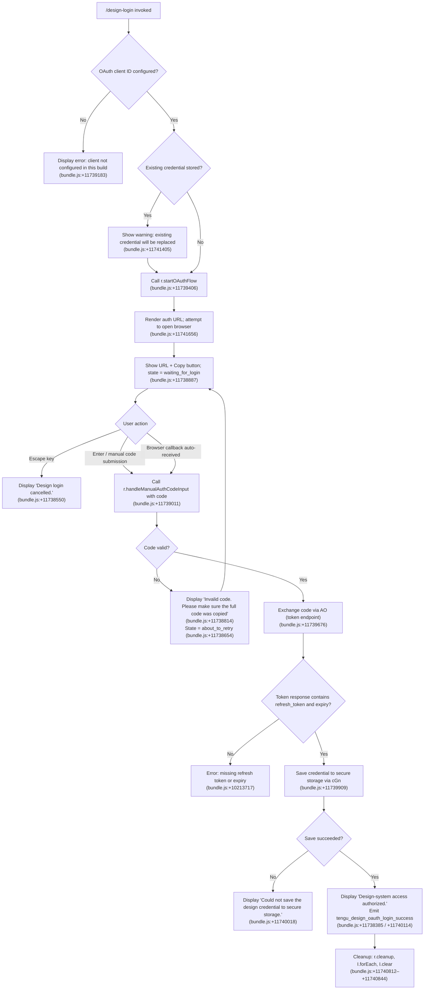

# `/design-login`

> Analysis basis: CC v2.1.186 bundle.js (AST extraction + Claude interpretation)
> Minimum version: v2.1.186

---

## Overview

`/design-login` initiates an OAuth 2.0 authorization flow that links the user's `claude.ai` account to Claude Code's design-system subsystem, enabling `/design-sync` to read and write the organization's `claude.ai/design` projects. The command renders an interactive Ink-based JSX component (`syl`) that guides the user through browser-based OAuth, manual authorization-code entry, and secure credential storage. This authentication is entirely separate from the main session's API credentials and modifies no other settings.

---

## Registration

| Field | Value |
|---|---|
| type | `local-jsx` |
| name | `design-login` |
| description | `Authorize design-system access for /design-sync with your claude.ai account` |
| loc_byte | `11744331` |
| loc_byte_end | `11744530` |
| loc_line | `7777` |
| module_id | `iyl` |
| load_inline | `true` |
| arbor_handler.name | `lyl` |
| arbor_handler.fqn | `claude-2.1.186::lyl` |
| arbor_handler.kind | `Function` |
| arbor_handler.resolution_path | `direct` |
| arbor_handler.n_hits | `1` |

Analysis basis: CC v2.1.186 bundle.js:+11744331

> **Note on handler resolution:** The Arbor symbol graph resolves the handler directly as `lyl` (FQN `claude-2.1.186::lyl`, `direct` path, 1 hit). The call-graph BFS entry-point `dof` is a secondary render helper; `lyl` is the authoritative handler name used throughout this spec.

---

## Input Branching

The command's interactive component exhibits six or more distinct runtime states, making a Mermaid flowchart the appropriate representation.



---

## Behavioral Spec

### Component Initialization (`syl`)

The top-level JSX component (`syl`) is the interactive UI layer rendered by the CLI.

```
function designLoginComponent(props):
    [flowState, setFlowState] = useState("starting")   // bundle.js:+11738089 / +11738070
    authContextRef = useRef(null)                       // bundle.js:+11738226
    terminalWidth = getTerminalWidth()                  // Hr → Gki.useContext, bundle.js:+11738283
    spinnerFrame = Math.max(0, terminalWidth - 50)      // bundle.js:+11738290 / +11738299

    if CLAUDE_CODE_DESIGN_OAUTH_CLIENT_ID not set:
        render error message                            // bundle.js:+11739183

    register useEffect to drive OAuth flow:
        call startOAuthAndRender()
    register useEffect cleanup:
        call r.cleanup()
        forEach pending abort: abort()
        I.clear()                                       // bundle.js:+11740812–+11740844

    return JSX tree (Ay.jsx / Ay.jsxs)                 // bundle.js:+11740918 / +11741091
```

Analysis basis: CC v2.1.186 bundle.js:+11738070

---

### OAuth Flow Launch (`r.startOAuthFlow`)

```
function startOAuthFlow():
    oauthClientId = env.CLAUDE_CODE_DESIGN_OAUTH_CLIENT_ID
    if not oauthClientId:
        throw error("client not configured")            // bundle.js:+11739183

    oauthParams = buildOAuthParams(oauthClientId)       // dGn / ks
    setFlowState("waiting_for_login")                   // bundle.js:+11738887
    authUrl = initiateAuthorizationRequest(oauthParams)
    attemptOpenBrowser(authUrl)
    renderAuthUrl(authUrl)                              // bundle.js:+11741656
    scheduleTimeout(3000ms)                             // p.setTimeout, bundle.js:+11739485 / +3000
```

Analysis basis: CC v2.1.186 bundle.js:+11739406

---

### Manual Authorization Code Handling (`r.handleManualAuthCodeInput`)

Triggered when the user submits a code string via the input field (Enter key) or the browser-redirect callback delivers it automatically.

```
function handleManualAuthCodeInput(rawInput):
    code = rawInput.split(delimiter)[relevant_part]    // I.split, bundle.js:+11738765
    if code is empty or malformed:
        setFlowState("about_to_retry")                 // bundle.js:+11738654
        renderError("Invalid code. Please make sure the full code was copied")
                                                       // bundle.js:+11738814
        return

    setFlowState("processing")                         // bundle.js:+11739713
    tokenResponse = await exchangeCodeForTokens(code)  // AO, bundle.js:+11739676
    handleTokenResponse(tokenResponse)
```

Analysis basis: CC v2.1.186 bundle.js:+11739011

---

### Token Exchange (`AO`)

```
function exchangeCodeForTokens(code):
    response = await httpClient.post(tokenEndpoint, {
        grant_type: "refresh_token",                   // bundle.js:+2140914
        code: code
    }, {
        headers: { "Content-Type": "application/json" }, // bundle.js:+2140969 / +2140984
        timeout: 5000                                  // bundle.js:+2141012
    })

    if isAxiosError(response):
        emit telemetry("oauth_token_revoke")           // bundle.js:+2141022
        classify error as "network"                    // bundle.js:+2141146
        propagate

    return response.data
```

Analysis basis: CC v2.1.186 bundle.js:+11739676 / +2140854

---

### Token Validation and Credential Storage (`AHo` → `cGn`)

```
function processTokenResponse(tokenResponse):
    if not tokenResponse.refresh_token or not tokenResponse.expiry:
        throw error("The token response was missing a refresh token or expiry...")
                                                    // bundle.js:+10213717
        return

    // Filter and join scopes
    scopes = Tpe.filter(...).join(...)              // bundle.js:+10213334 / +10213524

    saveResult = await cGn.saveDesignCredential(tokenResponse)
                                                    // bundle.js:+11739909
    if saveResult failed:
        renderError("Could not save the design credential to secure storage.")
                                                    // bundle.js:+11740018
        emit telemetry("tengu_design_oauth_login_error")
        return

    setFlowState("success")                         // bundle.js:+11738353
    renderSuccess("Design-system access authorized.")  // bundle.js:+11738385
    emit telemetry("tengu_design_oauth_login_success") // bundle.js:+11740114
    await delay(1500ms)                             // bundle.js:+11740243
    triggerCleanup()
```

Analysis basis: CC v2.1.186 bundle.js:+11739740 / +11739909

---

### Keyboard Handling

```
function onKeyPress(key):
    if key == "escape":
        renderMessage("Design login cancelled.")     // bundle.js:+11738550
        triggerCleanup()
        return

    if key == "return" and flowState == "waiting_for_login":
        handleManualAuthCodeInput(currentInputValue)
        return

    preventDefault()                                // bundle.js:+11738364
```

Analysis basis: CC v2.1.186 bundle.js:+11738461 / +11738550 / +11738614

---

### OAuth Endpoint Configuration (`ks` / `dGn`)

```
function buildOAuthBaseUrl(env):
    if env == "prod":
        return production endpoint                   // bundle.js:+862235
    elif env == "staging":
        return "http://localhost:8205"               // bundle.js:+863325 / +863470
    elif CLAUDE_CODE_CUSTOM_OAUTH_URL set:
        if not isApprovedEndpoint(customUrl):
            throw error("CLAUDE_CODE_CUSTOM_OAUTH_URL is not an approved endpoint.")
                                                     // bundle.js:+863630
        return customUrl with suffix "-custom-oauth" // bundle.js:+864146

    clientId = CLAUDE_CODE_DESIGN_OAUTH_CLIENT_ID
    if clientId starts with "00000000-":
        use local dev endpoints (8000 / 4000 / 3000) // bundle.js:+862509 / +862596 / +862686
    path template: "/v1/toolbox/shttp/mcp/{server_id}"  // bundle.js:+863364
```

Analysis basis: CC v2.1.186 bundle.js:+863434

---

### Credential Save (`cGn`)

```
function saveDesignCredential(tokens):
    checkpointHash = Bl(tokens)                     // bundle.js:+10210014
    result = t.onlyIf(checkpointHash, async () => {
        written = await T(tokens)                   // bundle.js:+10210157
        if not written:
            throw error("Failed to save design OAuth tokens")
                                                    // bundle.js:+10210243
    })
    await Ae(result)                                // bundle.js:+10210198
    return result
```

Analysis basis: CC v2.1.186 bundle.js:+11739909 / +10210014

---

### Manual Entry Telemetry (`tengu_design_oauth_manual_entry`)

Emitted when the user manually types or pastes the authorization code rather than having the browser callback deliver it automatically.

```
function onManualCodeDetected():
    emit telemetry("tengu_design_oauth_manual_entry")  // bundle.js:+11738973
```

Analysis basis: CC v2.1.186 bundle.js:+11738973

---

### Spinner and Copy-to-Clipboard

- The waiting-for-login screen renders the authorization URL alongside a **Copy** button (literal `"copy"`, bundle.js:+11741825) and a `"(Copied!)"` confirmation state (bundle.js:+11741752).
- Clipboard write is handled by the `rv` / `Dbi` / `On` / `$r` subsystem, which dispatches to platform-specific commands: `pbcopy` (macOS, bundle.js:+3543335), `wl-copy` / `xclip` / `xsel` (Linux, bundle.js:+3542097–+3542205), PowerShell clip (Windows, bundle.js:+3543732), and OSC 52 escape sequences (bundle.js:+3541980) as a fallback.
- The spinner advances at a cadence derived from `Math.max` against terminal width with a minimum step of `50` units (bundle.js:+11738299) and 4 frames (bundle.js:+11738323).

Analysis basis: CC v2.1.186 bundle.js:+11741752 / +3543335

---

## State & Side Effects

| Item | Detail |
|---|---|
| Telemetry: `tengu_design_oauth_manual_entry` | Fired when manual code entry path is taken (bundle.js:+11738973) |
| Telemetry: `tengu_design_oauth_login_success` | Fired on successful credential storage (bundle.js:+11740114) |
| Telemetry: `tengu_design_oauth_login_error` | Fired when credential storage fails (bundle.js:+11740267) |
| Telemetry: `tengu_feature_ok` | Generic feature success event (bundle.js:+1024705) |
| Telemetry: `tengu_feature_bad` | Generic feature failure event (bundle.js:+1024772) |
| Telemetry: `tengu_feature_sad` | Generic feature soft-failure event (bundle.js:+1024853) |
| Secure credential storage | `cGn` writes design OAuth tokens to secure storage; existing credential is silently replaced (bundle.js:+11741405) |
| appState changes | Flow state machine cycles through: `starting` → `waiting_for_login` → `processing` → `success` (or error/cancel states) |
| Clipboard side effect | Authorization URL may be copied to clipboard via platform clipboard tool (bundle.js:+11741825) |
| Timeout registered | `p.setTimeout` fires after 3000 ms during waiting state (bundle.js:+11739485 / +3000) |
| Cleanup on exit | `r.cleanup()`, abort-controller loop, `I.clear()` always run on component unmount (bundle.js:+11740812) |
| MCP subsystem interaction | `Z3e` / `q2o` / `arr` MCP manager re-evaluated after credential change to reconnect design-system servers |
| No changes to main session auth | The command explicitly scopes changes to design credentials only |

---

## Version History

| Version | Change |
|---|---|
| v2.1.186 | Initial analysis |

---

## Common Mistakes

1. **Missing `CLAUDE_CODE_DESIGN_OAUTH_CLIENT_ID` environment variable.** The command hard-fails with a clear error when this variable is absent (bundle.js:+11739183). This variable must be set to the registered OAuth client ID for the command to function; it is not bundled in public builds.
2. **Pasting only part of the redirect URL.** The manual-entry path requires the full `?code=...&state=...` query string. Pasting only the code portion (without `state`) causes a validation failure and the `about_to_retry` state loop (bundle.js:+11738814).
3. **Running on a remote/headless session without clipboard access.** The browser will not open automatically. The user must manually copy the displayed URL. If clipboard utilities (`pbcopy`, `xclip`, etc.) are unavailable, the OSC 52 path is attempted but may be silently ignored by the terminal emulator.
4. **Assuming this command authenticates the main Claude API session.** `/design-login` only stores a separate design-system OAuth credential. It does not affect `ANTHROPIC_API_KEY` or any other session token.
5. **Interrupting mid-flow.** Pressing Escape at any point cancels cleanly (bundle.js:+11738550), but the credential is not partially written — the old credential (if any) remains intact until a new one is successfully saved.
6. **Using a custom OAuth URL that is not on the approved list.** Setting `CLAUDE_CODE_CUSTOM_OAUTH_URL` to an unapproved host throws immediately (bundle.js:+863630).

---

## Appendix — Identifier Mapping

> For bundle debugging only. Identifiers change across versions.

| Identifier | Role |
|---|---|
| `lyl` | Arbor-resolved top-level handler for `/design-login` (FQN `claude-2.1.186::lyl`) |
| `dof` | JSX render entry-point / BFS call-graph root; calls `Ay.jsx` |
| `syl` | Interactive Ink/React component: design-login UI state machine |
| `As` | Clock context hook (`useClock`); throws if outside `ClockProvider` |
| `Hr` | Terminal-size context hook (`useTerminalSize`) |
| `I` | Keypress / input handler with `preventDefault`; delegates to `A` |
| `x` | File-watch or event handler with `Tyc`, `ip`, `T`, `Re`, `GYf`, `d` calls |
| `Tyc` | Filesystem realpath+stat utility |
| `kn` | Error-code helper (uses `mn`, ENOENT path) |
| `T` | Path/module resolution utility; uses `Pvc`, `Lc`, `XP`, `eze`, `Fvc` |
| `Pvc` | Path builder with `YP`, `lcr`, `U5o` |
| `De` | JSON serialiser wrapper (`JSON.stringify`) |
| `Lc` | Path-component extractor (`replace`, `at`, `lastIndexOf`, `slice`) |
| `eze` | Utility calling `cWo` |
| `Fvc` | File-write helper with byte-length check, `Buffer.byteLength` |
| `Re` | Error logging / normalisation; uses `ao`, `ot`, `Ki`, `Pnu`, `VJ.logError` |
| `ao` | Error wrapper (`Error`, `String`) |
| `ot` | String coercion helper |
| `Ki` | Queue/channel helper using `ins` |
| `Pnu` | Circular buffer with `crn.shift` / `crn.push` |
| `GYf` | Version-path resolver (`A2n`) |
| `A2n` | Joins `a5e` path segments; uses `bm`, `Dee` |
| `d` | File-writer orchestrator: `W8e`, `r.write`, `p$l`, `i.get`, `E.stop`, etc. |
| `W8e` | Stat-and-write file helper with 1 MB limit (`1048576`, bundle.js:+13066032) |
| `p$l` | Padding/max-width formatter using `Object.keys`, `Math.max`, `z_` |
| `E` | Watcher/timer using `yUt`, `N_t` |
| `A` | Spinner/progress ticker (`_`, `Math.max`, `Math.min`) |
| `Syc` | Heartbeat configurator (`zse`) |
| `s` | Async-set tracker (`r.add`, `i.finally`, `r.delete`) |
| `a` | MCP connection orchestrator; calls `Z3e`, `arr`, `maa`, `q2o`, `l` |
| `Z3e` | Core MCP server connection manager (entry iterator over all servers) |
| `TB` | MCP config sync/diff engine: `Sst`, `m7`, `B4`, `aRn`, `_st`, `JU` |
| `Sst` | Config state applier (`_1`, `Bpe`) |
| `m7` | MCP server reconciler (approved/pending/rejected states; `Ql`, `JU`, `Ab`, `Rae`, `zE`) |
| `B4` | MCP server entry builder (`Rae`, `n.push`) |
| `aRn` | MCP warning renderer (`yXr`, `Et.red`, `Et.yellow`) |
| `_st` | MCP state tracker/setter (`j_n`, `Xw`, `X_n`, `jai`, `xae`, `r.has/set/get`) |
| `JU` | Object-create factory |
| `Xw` | Connection wrapper invoking `Jm`, `SXr` |
| `Jm` | Connection executor (`Xue`, `wt`, `Ea`) |
| `Wn` | Utility calling `t` |
| `fca` | Server-entry hash+timestamp builder (`kQr`, `ELe`, `Y_n`, `Date.now`) |
| `kQr` | Server config reader (`Xs`, `Pxn`, `Bt`) |
| `ELe` | SHA-256 hash calculator (`foa.createHash`, `Object.keys`, `Array.isArray`) |
| `Y_n` | Config hash with `Mse`, `Object.keys`, `O9` |
| `X_n` | Extended hash util (`Y_n`, `IT`) |
| `IT` | Deep hash using `De`, `zai.createHash` |
| `j_n` | Hash finaliser (`Bl`) |
| `Bl` | Low-level hash builder (`NGs`) |
| `ln` | MCP debug logger (`Jje.push`, `VJ.logMCPDebug`) |
| `wRn` | MCP OAuth flow launcher (`Lr`, `Lqd`, `kqd`) |
| `Lqd` | OAuth connection handler with race/retry (`vqd`, `u9`, `Tqd`, `v8`, `g7`, `Cst`, `LRn`, `H7`, `c9`, `Xk`, `Wc`, `Ae`, `Promise.race`, `wqd`, `Cqd`) |
| `kqd` | OAuth callback handler (`u9`, `Iqd`, `Ist`, `vst`, `Ae`) |
| `SUt` | Server update trigger (`xxn.then`, `kQr`, `Xs`, `Pxn`, `De`) |
| `Xs` | Async-storage accessor (`bUu.getStore`) |
| `Pxn` | Path joiner using `Dxn.join`, `or`; references `mcp-needs-auth-cache.json` |
| `PXr` | Connection result applier (`IT`, `Bl`, `ln`, `Ae`) |
| `Ae` | String-coercion error wrapper |
| `m` | Process/worker map (`n.values`, `x.kill`) |
| `n` | Name normaliser (`i.toLowerCase`) |
| `Qw` | MCP skills emitter (`it`; fires `tengu_mcp_skills`) |
| `it` | Telemetry publisher (`ORt`, `NRt`, `$9`, `OIe.has`, `JEn`, `DRt.add`, `TW.has/get`, `wt`) |
| `EXr` | Stream processor (`_n`, `n.includes`) |
| `_n` | Config persistence layer (`IQn`, `QL`, `fDe`, `hOo`, `TKt`, `T`, `cEe`, `EHt`, `W`, `TQn`) |
| `w` | Background worker manager (`oj`, `Date.now`, `Math.min`, `L`, `v`, `hcc`, `gcc`) |
| `oj` | Worker state helper |
| `L` | Background sweep loop (`Date.now`, `w.values`, `q.shiftGraceClocksForward`, `CVt`, `q2l`, `D2e`, `Re`, `Wn`, `W`, `CXn`, `it`) |
| `hcc` | History entry accessor (`e.at`) |
| `gcc` | Grace-clock calculator (`gnr`) |
| `Wc` | MCP error logger (`Jje.push`, `VJ.logMCPError`) |
| `_ca` | MCP schema validator (`ZW`) |
| `ZW` | Schema/type validator (`TypeError`, `Number.isSafeInteger`, `o.addEventListener`, `AggregateError`) |
| `nit` | Integer parser (base 10, `parseInt`, bundle.js:+6853053) |
| `Oxn` | Integer parser variant (base 20, `parseInt`, bundle.js:+6853151) |
| `arr` | MCP connection result applier (`e.applyMcpUpdate`, `Q3e`, `ln`, `n.cleanup`, `WT`, `aE`) |
| `Q3e` | Capabilities diff helper (`ELe`) |
| `WT` | Connection cleanup orchestrator (`eit`, `o.cleanup`, `Qw`) |
| `eit` | Tool/capability entry iterator (`ELe`) |
| `maa` | MCP server adapter factory (`AJr`) |
| `l` | Daemon status reporter (`QNl`) |
| `QNl` | Status file writer (`_Q`, `Date.now`, `Xs`, `zqt`, `De`); writes `daemon.status.json` |
| `zqt` | Status path builder (`JNl.join`, `or`) |
| `q2o` | MCP reconnect orchestrator (`Object.entries`, `n.filter`, `t.getClients`, `fRn`, `Bn`, `T`, `eit`, `Z3e`, `arr`, `Object.fromEntries`) |
| `fRn` | Filter for suppressed-duplicate servers (`Q8d.has`, `wXr.has`) |
| `Bn` | Retry-with-backoff helper (`o`, `Error`, `r`, `setTimeout`, `clearTimeout`, `s.unref`) |
| `c` | Background-session identifier (`bn`) |
| `D5t` | Design OAuth params builder (`dGn`) |
| `dGn` | OAuth PKCE / client-config builder (detects `00000000-` prefix, bundle.js:+10213291) |
| `ks` | OAuth base-URL resolver (prod/staging/custom/local; `GYo`, `X5c`, `t.replace`, `rnn.includes`) |
| `GYo` | OAuth endpoint constants holder |
| `X5c` | OAuth URL validator |
| `p` | Forced-shutdown sequencer (`Kb`, `process.exit`, `u.abort`) |
| `Kb` | Shutdown signal handler |
| `u` | Graceful-exit coordinator (`ke`, `xe`, `gU`, `j6`) |
| `ke` | Feature-ok telemetry emitter (`W`, `Pe`; fires `tengu_feature_ok`) |
| `Pe` | Telemetry payload builder (`KVe`) |
| `xe` | Feature-bad telemetry emitter (`W`, `Pe`; fires `tengu_feature_bad`) |
| `gU` | Daemon-control event handler (`F9`, `Wz.push`, `o$e`, `x2r`; fires `tengu_daemon_control`) |
| `F9` | Daemon-control state machine (`T2`) |
| `o$e` | First-party marker setter (`Ok`) |
| `x2r` | Event emitter with `randomUUID`, `tZe`, `_W`, `e.emit` |
| `j6` | Shutdown finaliser (`Promise.race`, `Promise.all`, `wme`, `Nme`, `Bn`, `process.exit`) |
| `wme` | Shutdown broadcaster (`vme.shutdown`) |
| `Nme` | Timeout-clear + cleanup (`clearTimeout`, `AOo`) |
| `AO` | Token-exchange HTTP client (`co.post`, `ks`, `ke`, `co.isAxiosError`, `T`, `Mt`) |
| `Mt` | Feature-sad telemetry emitter (`W`, `Pe`; fires `tengu_feature_sad`) |
| `AHo` | Token-response processor and scope filter (`Tpe.filter`, `AO`, `n.join`, `Tpe.some`) |
| `cGn` | Secure credential writer (`Bl`, `t.onlyIf`, `T`, `Ae`); fires on token-save failure |
| `md` | React context/store bridge (`ihe.useContext`, `ihe.useRef`, `ihe.useMemo`, `ihe.useSyncExternalStore`) |
| `rv` | Clipboard write dispatcher (`_xt`, `Dbi`, `Hcd`, `k3r`, `T`, `yxt`, `Nw`, `Zy`) |
| `_xt` | Clipboard environment detector (`g_`) |
| `g_` | Terminal/environment capability probe |
| `Dbi` | Platform clipboard writer (macOS `pbcopy`, timeout 2000 ms; recurses `Dbi`) |
| `On` | Clipboard child-process spawner (`$r`, `Ot`) |
| `$r` | Child-process runner (`R1e`, `p`, `fsu`, `ip`, `T`, `mn`, `psu`, `Re`) |
| `Ot` | Process-output collector (`hrn`, `gr`) |
| `R3r` | Linux clipboard writer (`Kt`, `If`; tries `wl-copy`, `xclip`, `xsel`) |
| `If` | Clipboard tool selector (`VYo`) |
| `Hcd` | Tmux clipboard writer (`On`, `T`; `load-buffer -w`) |
| `k3r` | Screen/DCS clipboard writer (`g_`) |
| `yxt` | OSC 52 clipboard writer (`_xt`, `Kt`) |
| `Nw` | Escape-sequence clipboard writer (`k3r`, `e.replaceAll`) |
| `Zy` | Multi-strategy clipboard writer (`Mbi`, `e.join`) |
| `Mbi` | Base64 clipboard encoder (`g_`) |
| `M5t` | Design credential display helper (`Bl`, `T`, `Ae`) |

---

Note: index built via Arbor fallback; some signals (telemetry, literals) may be missing — see arbor-fallback.js.