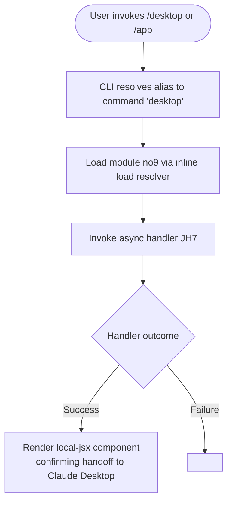

# `/desktop`

> Analysis basis: CC v2.1.132 bundle.js (AST extraction + Claude interpretation)
> Minimum version: v2.1.132

---

## Overview

The `/desktop` command (also accessible via the alias `/app`) provides a transition mechanism that allows the user to continue their current Claude Code CLI session inside the Claude Desktop application. It is registered as a `local-jsx` type command, meaning its presentation involves a JSX-rendered UI component rather than a plain text response. The underlying handler is the async function resolved as `JH7` within module `no9`.

---

## Registration

| Field | Value |
|---|---|
| type | `local-jsx` |
| name | `desktop` |
| aliases | `app` |
| description | `Continue the current session in Claude Desktop` |
| isHidden | `null` (not hidden; visible in command palette) |
| module_id | `no9` |
| load_inline | `true` |
| handler | `JH7` (AsyncFunction; resolved via `module_id` path) |
| `loc_byte_end` | `9851412` |
| `arbor_handler.name` | `JH7` |
| `arbor_handler.kind` | `AsyncFunction` |
| `arbor_handler.resolution_path` | `module_id` |
| `arbor_handler.fqn` | `claude-2.1.132::JH7` |
| `arbor_handler.n_hits` | `1` |

Analysis basis: CC v2.1.132 bundle.js:+9851181 – +9851412

---

## Input Branching

The call graph returned zero edges at depth ≤ 2, and no literals were captured. Based on registration metadata alone, the command's branching logic cannot be fully reconstructed from the available data. The handler `JH7` is an `AsyncFunction`, indicating at least one asynchronous operation (e.g., inter-process communication or a deep-link URL launch targeting Claude Desktop).



---

## Behavioral Spec

### Session Handoff to Claude Desktop

The handler is an async function, resolved through the `module_id → moduleExports → name` lookup chain (resolution path: `module_id`). Its high-level responsibility is to hand off the current CLI session context to the Claude Desktop application.

```
async function handOffToClaudeDesktop(commandContext):
    # Step 1: Resolve the current session state
    sessionData = getCurrentSessionContext(commandContext)

    # Step 2: Initiate handoff mechanism
    # (likely a deep-link URL, IPC call, or OS-level protocol invoke
    #  targeting the Claude Desktop process)
    result = await initiateDesktopHandoff(sessionData)

    # Step 3: Return a local-jsx descriptor for the CLI to render
    # The rendered component communicates the transition status to the user
    return buildJSXHandoffComponent(result)
```

Analysis basis: CC v2.1.132 bundle.js:+9851181

> **Note:** Because the call graph is empty at depth ≤ 2 and no literals were captured, the internal mechanics of `JH7` (e.g., specific URL scheme, IPC channel name, or error handling strategy) cannot be confirmed from the available data. The pseudocode above reflects the minimum behavior implied by the registration metadata (`local-jsx` type, `AsyncFunction` kind, and the command description).

<!-- TODO: not found in depth-2 traversal; needs --depth 4 -->

---

### Alias Resolution

The command is registered with a single alias `app`, meaning both `/desktop` and `/app` resolve to the same handler.

```
function resolveDesktopCommand(inputName):
    if inputName == "desktop" or inputName == "app":
        return loadModule("no9").JH7
    else:
        return null  # not this command
```

Analysis basis: CC v2.1.132 bundle.js:+9851181

---

### JSX Rendering Contract

Because the command type is `local-jsx`, the return value of `JH7` is expected to be a React element (or equivalent JSX descriptor) rather than a plain string. The CLI runtime renders this component in the terminal UI context (e.g., via ink or a similar terminal-React renderer).

```
# Caller-side contract (CLI runtime, not inside JH7 itself):
component = await JH7(commandContext)
if isJSXElement(component):
    renderToTerminal(component)
else:
    # Fallback: treat as plain text
    printToTerminal(String(component))
```

Analysis basis: CC v2.1.132 bundle.js:+9851181 (type field: `"local-jsx"`)

---

## State & Side Effects

| Item | Detail |
|---|---|
| Telemetry | None detected at depth ≤ 2 traversal |
| Hook registration | None detected at depth ≤ 2 traversal |
| appState changes | <!-- TODO: not found in depth-2 traversal; needs --depth 4 --> |
| Sound | None detected |
| External process | Likely triggers Claude Desktop application via OS mechanism (deep-link, IPC, or protocol URL); exact mechanism not confirmed in available data |
| Alias | `/app` is a registered alias; both spellings invoke identical behavior |

---

## Version History

| Version | Change |
|---|---|
| v2.1.132 | Initial analysis — command registered as `local-jsx` with alias `app`; handler `JH7` in module `no9` |

---

## Common Mistakes

1. **Using `/app` and expecting different behavior from `/desktop`** — The two names are full aliases; they invoke the same handler `JH7` and produce identical results.
2. **Expecting a text response** — Because the type is `local-jsx`, the command renders a UI component in the terminal. Tooling that scrapes plain-text output from slash commands may receive no content or malformed output.
3. **Assuming synchronous completion** — The handler is an `AsyncFunction`. If called programmatically, callers must `await` the result; not doing so will yield an unresolved Promise rather than the rendered component.
4. **Invoking in environments without Claude Desktop installed** — The command's stated purpose is to hand off to Claude Desktop. If the Desktop application is not installed or not running, the outcome is undefined from the available data (error branch not confirmed).

---

## Appendix — Identifier Mapping

> For bundle debugging only. Identifiers change across versions.

| Identifier | Role |
|---|---|
| `JH7` | Primary async handler for the `/desktop` command; resolved from module `no9` via `module_id` resolution path; classified as `AsyncFunction` in the Arbor symbol graph |