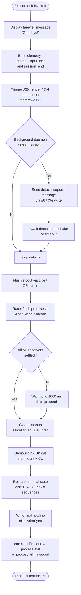

# `/exit`

> Analysis basis: CC v2.1.186 bundle.js (AST extraction + Claude interpretation)
> Minimum version: v2.1.186

---

## Overview

`/exit` (aliased as `/quit`) terminates the Claude Code CLI session. When invoked, the handler displays a farewell message, tears down UI components, flushes pending I/O, dispatches shutdown signals to any background daemon/worker processes, and ultimately calls `process.exit`. The command is marked `immediate`, meaning it executes without waiting for any in-progress agent turn to complete.

---

## Registration

| Field | Value |
|---|---|
| type | `local-jsx` |
| name | `exit` |
| description | `null` |
| aliases | `["quit"]` |
| immediate | `true` |
| module_id | `UOl` |
| load_inline | `true` |
| loc_byte | `12788994` |
| loc_byte_end | `12789190` |
| loc_line | `8685` |
| arbor_handler.name | `Pyf` |
| arbor_handler.fqn | `claude-2.1.186::Pyf` |
| arbor_handler.kind | `AsyncFunction` |
| arbor_handler.resolution_path | `module_id` |
| arbor_handler.n_hits | `1` |

Analysis basis: CC v2.1.186 bundle.js:+12788994

---

## Input Branching

The exit flow has 5+ distinct phases (farewell display → UI unmount → background session detach → process table drain → hard exit), warranting a Mermaid flowchart.



---

## Behavioral Spec

### Main Handler (`Pyf` / exitCommandHandler)

Analysis basis: CC v2.1.186 bundle.js:+12788253

```
async function exitCommandHandler(appState):
    # Step 1 — Farewell output
    write "Goodbye!" to stderr/stdout                     # bundle.js:+12788217
    invoke backgroundSessionCheck(appState)              # Ws → XNe  bundle.js:+12788253
    invoke randomDelayHelper()                           # e  bundle.js:+12788265
    invoke detachRequestDispatch(appState)               # rye  bundle.js:+12788269
    invoke scheduledTaskCleanup(appState)                # dVn  bundle.js:+12788300

    # Step 2 — JSX farewell render
    render FarewellComponent via FOl.jsx                 # bundle.js:+12788330
    invoke exitUIHelper(Dyf / eR)                        # bundle.js:+12788413

    # Step 3 — Core shutdown sequence (gi / shutdownSequence)
    invoke shutdownSequence(appState)                    # gi  bundle.js:+12788426

    # Step 4 — Emit prompt_input_exit telemetry
    emit "prompt_input_exit"                             # bundle.js:+12788431
```

---

### Background Session Check (`Ws` / backgroundSessionCheck)

Analysis basis: CC v2.1.186 bundle.js:+12788253

```
function backgroundSessionCheck(appState):
    call XNe(appState)        # checks for "bg", "daemon", "daemon-worker" modes
    # literals: "bg" bundle.js:+2305481, "daemon" bundle.js:+2305491,
    #           "daemon-worker" bundle.js:+2305505
```

The checker distinguishes three process roles — background (`bg`), daemon, and daemon-worker — to decide whether a detach handshake is required before exit.

---

### Detach Request Dispatch (`rye` / detachRequestDispatch)

Analysis basis: CC v2.1.186 bundle.js:+11310075

```
function detachRequestDispatch(appState):
    call yfn()                              # bundle.js:+11310075
    call gpl():                             # bundle.js:+11310094
        gpl calls l8n()                    # bundle.js:+11304133
        gpl calls bn()                     # bundle.js:+11304185, literal: 0, "task"
    call s6():                             # bundle.js:+11310103
        s6 writes "detach-request" message  # literal bundle.js:+11310112
        s6 calls Xte.write()               # bundle.js:+10804394
        s6 calls De() → JSON.stringify()   # bundle.js:+10804404
    call eue()                             # bundle.js:+11310188 (await/finalize)
```

The string literal `"detach-request"` (bundle.js:+11310112) is the IPC message type written to the background process socket.

---

### Scheduled Task Cleanup (`dVn` / scheduledTaskCleanup)

Analysis basis: CC v2.1.186 bundle.js:+11302884

```
function scheduledTaskCleanup(appState):
    call fI() → GL()                       # bundle.js:+11302884
    iterate scheduled tasks:               # literal "scheduled task" bundle.js:+11302925
        call MXp(task):                    # bundle.js:+11302952
            call kD(task)                  # task status formatter bundle.js:+11303038
                # parses cron fields, uses parseInt, o.match, s.match
                # literals: "Every minute" bundle.js:+4915141,
                #           "Every hour"   bundle.js:+4915358
            call s1(task)                  # bundle.js:+11303055
            call frt(task)                 # timestamp computation bundle.js:+11303071
            call Math.max, Date.now        # bundle.js:+11303130, +11303153
            call $i()                      # duration formatter bundle.js:+11303187
        call wa(text)                      # text width helper bundle.js:+11302967
            wa calls on() → Bun.stringWidth # bundle.js:+217105
```

Before exit, the handler collects and summarises any pending scheduled tasks so they can be reported or cancelled cleanly.

---

### Core Shutdown Sequence (`gi` / shutdownSequence)

Analysis basis: CC v2.1.186 bundle.js:+7218860

This is the most complex sub-routine; it orchestrates UI teardown, I/O flushing, MCP server settlement, and the final `process.exit` call.

```
async function shutdownSequence(appState):
    # Phase A — Resolve and schedule
    await Promise.resolve()                              # bundle.js:+7218860
    call Vd(); call o()
    schedule setTimeout callback                        # bundle.js:+7218911

    # Phase B — Unmount Ink UI (k9e / inkUnmount)
    call k9e():                                         # bundle.js:+7218928
        sHe.writeSync(...)                              # bundle.js:+7215860
        uu.get(instanceKey)                             # bundle.js:+7215887
        e.unmount()                                     # bundle.js:+7215938
        CU()                                            # bundle.js:+7215972
        call Zbn() / terminalStateRestore():            # bundle.js:+7216020
            LZ.writeSync(ESC-7 / ESC-8)                # bundle.js:+3891970
            call Y$e() → terminal capability probe      # bundle.js:+3892144
                checks "ghostty" >= 1.2.0              # bundle.js:+3617992
                checks "iTerm.app" >= 3.6.6            # bundle.js:+3618061
            call B$e()
            call Nw() / tmuxEscapeClean():             # bundle.js:+3892194
                replaces tmux escape sequences         # literal "tmux" bundle.js:+3541643

    # Phase C — Print final output summary (lto / finalOutputWriter)
    call lto():                                         # bundle.js:+7218934
        call cw(); call N3(); call Rt() → GL()
        call kFt() → statSync, Gt, zh.join             # bundle.js:+7216179
        call ch() → Oc() → Ai()                        # bundle.js:+7216199
        t.replaceAll("\\\\", ...) / ("\\"", ...)        # bundle.js:+7216236, +7216259
        call Tha()
        sHe.writeSync(final content)                    # bundle.js:+7216317
        Et.dim(...)                                     # bundle.js:+7216333

    # Phase D — Hard exit callback (cto / processExitCallback)
    call cto():                                         # bundle.js:+7218940
        clearTimeout(pendingTimer)                      # bundle.js:+7216444
        uu.get(instanceKey)                             # bundle.js:+7216477
        process.exit(code)                              # bundle.js:+7216525
        # fallback: process.kill(pid, signal)           # bundle.js:+7216550
        # fallback error: "unreachable"                 # bundle.js:+7216598

    # Phase E — Flush stdout
    call LKe() → O5o.drain()                           # bundle.js:+7219053

    # Phase F — Race flush vs timeout
    await Promise.race([flushPromise, AbortSignal.timeout(...)])
    # timeout thresholds: 5000 ms (bundle.js:+7218957), 3500 ms (bundle.js:+7218964)
    # inner Math.max with 2000 ms floor  (bundle.js:+7219142)

    clearTimeout(...)                                   # bundle.js:+7219154

    # Phase G — MCP server settlement (Nha / mcpSettleAll)
    call Nha():                                         # bundle.js:+7219202
        Promise.allSettled(Array.from(mcpServers))      # bundle.js:+13432511

    # Phase H — Session analytics (UDn / sessionAnalytics)
    call UDn():                                         # bundle.js:+7219291
        call cw(); call bha(); call W()
        call Aha() / sessionDurationCalc():             # bundle.js:+7218400
            Date.now(), Math.max, Math.round, Object.assign
        call Es() / telemetryFlush():                   # bundle.js:+7218417
            G$(), dx() → Eai.isEnabled()
            O3r() → ot()
            dZ() → Ccd()
            T()
            P3r() → Kt(), Boolean()
            Nr() → DG()
            vcd() → it()
            it() → ORt, NRt, $9, OIe.has, JEn, DRt.add, TW.has/.get, wt

    # Phase I — Cache eviction hint telemetry
    emit "tengu_cache_eviction_hint"                    # bundle.js:+7219316

    # Phase J — Conformance check
    call Ke() → KVe()                                   # bundle.js:+7219351
    call Mr() → yH() → KVe()                           # bundle.js:+7219385

    # Phase K — Cleanup promise (x9e)
    call x9e():                                         # bundle.js:+7219402
        Promise.resolve()
        DDn()
        e()

    # Phase L — Final write
    sHe.writeSync(...)                                  # bundle.js:+7219428
```

---

### Startup Profiling Flush (`DSt` / startupPerfFlush)

Analysis basis: CC v2.1.186 bundle.js:+224457

```
function startupPerfFlush():
    call Ccr() → VWo():
        # builds perf mark report
        # literals: "mark" bundle.js:+225089,
        #           "main_after_run" bundle.js:+225192,
        #           "startup-perf" bundle.js:+224941
        Math.round, Math.max, Number.parseInt, Number.isFinite
        Object.assign, Object.entries
        emit "tengu_startup_perf"                       # bundle.js:+226143
    call $Wo() / perfReportWriter():
        RSt.dirname, Gt, GSe() → fsyncSync, writeFileSync
        OWo() / buildReportLines()
        G3() → require("perf_hooks")                    # bundle.js:+223251
        JSON.stringify
        VWo()
        # literal "Startup profiling report:" bundle.js:+224841
        # literal "STARTUP PROFILING REPORT" bundle.js:+224128
```

On exit, any accumulated startup performance profiling data is flushed atomically via `fsyncSync` before the process terminates.

---

### Random Delay Helper (`e` / jitterDelay)

Analysis basis: CC v2.1.186 bundle.js:+14192741

```
function jitterDelay():
    multiplier = Math.random() * 2    # literals: 2 (bundle.js:+14192739), 1 (bundle.js:+14192755)
    setTimeout(callback, multiplier)
```

A small random jitter is applied during the exit path, likely to prevent thundering-herd effects when multiple sessions exit simultaneously.

---

### Process Exit Finalizer (`p` / processExitFinalizer)

Analysis basis: CC v2.1.186 bundle.js:+17190961

```
function processExitFinalizer():
    call Kb()                               # pre-exit cleanup
    process.exit(code)                      # bundle.js:+17190983
    # literal "forced shutdown"             # bundle.js:+17190964
    u.abort()                               # cancel any pending AbortController
```

`"forced shutdown"` (bundle.js:+17190964) is the label used for hard-exit situations where graceful teardown could not complete.

---

## State & Side Effects

| Item | Detail |
|---|---|
| Telemetry — `prompt_input_exit` | Emitted at command invocation (bundle.js:+12788431) |
| Telemetry — `session_end` | Emitted during shutdown sequence (bundle.js:+7219354) |
| Telemetry — `tengu_cache_eviction_hint` | Emitted during shutdown (bundle.js:+7219316) |
| Telemetry — `tengu_scroll_summary` | Emitted during session analytics phase (bundle.js:+7218373) |
| Telemetry — `tengu_amber_creek` | Emitted during telemetry flush (bundle.js:+3551256) |
| Telemetry — `tengu_pewter_brook` | Emitted during telemetry flush (bundle.js:+3551164) |
| Telemetry — `tengu_startup_perf` | Emitted if startup profiling was enabled (bundle.js:+226143) |
| Telemetry — `tengu_bg_dispatch_sigkill_escalate` | Emitted if background process required SIGKILL escalation (bundle.js:+17157626) |
| Telemetry — `tengu_bg_dispatch_low_mem` | Emitted if background process was low on memory (bundle.js:+17158227) |
| Telemetry — `tengu_bg_spare_enable` | Emitted when spare background session is enabled (bundle.js:+17158924) |
| Telemetry — `tengu_bg_spare_claim` | Emitted when spare session is claimed (bundle.js:+17159052) |
| Telemetry — `tengu_bg_spare_claim_fail` | Emitted when spare session claim fails (bundle.js:+17159318) |
| Telemetry — `tengu_daemon_config_reload` | Emitted during daemon config reload on exit (bundle.js:+17173497) |
| IPC side effect | `"detach-request"` message written to background session socket (bundle.js:+11310112) |
| Terminal state | ESC-7 / ESC-8 save/restore sequences written via `LZ.writeSync` (bundle.js:+3891970) |
| Stdout flush | `O5o.drain()` called; race against 5000 ms / 3500 ms timeouts (bundle.js:+7218957, +7218964) |
| MCP servers | `Promise.allSettled` called on all active MCP server handles (bundle.js:+13432511) |
| Ink UI | `e.unmount()` called on the active Ink render instance (bundle.js:+7215938) |
| Startup perf log | Written atomically with `fsyncSync` if profiling was active (bundle.js:+192431) |
| `process.exit` | Called in `cto` (bundle.js:+7216525); fallback `process.kill` at +7216550 |
| Alias | `/quit` is a registered alias for `/exit` |

---

## Version History

| Version | Change |
|---|---|
| v2.1.186 | Initial analysis |

---

## Common Mistakes

1. **Expecting synchronous termination**: `/exit` is `immediate` but the handler is an `AsyncFunction` (`Pyf`). Several async phases (flush race, MCP settlement, analytics) must complete before `process.exit` is called. Scripts that send `/exit` and immediately check for process termination may race.
2. **Confusing `/exit` with Ctrl-C**: `/exit` performs a graceful shutdown with detach handshake, telemetry flush, and terminal restoration. A raw SIGINT may skip several of these phases.
3. **Using `/exit` during an active agent turn**: The `immediate: true` flag means the command executes without waiting for the current turn. Any in-progress tool calls or API streaming may be aborted mid-flight; do not rely on partial results being written out.
4. **Daemon sessions**: In `daemon` or `daemon-worker` mode, `/exit` sends a `"detach-request"` IPC message rather than immediately terminating. The calling process must handle the detach acknowledgement protocol.
5. **Startup profiling output**: If `CLAUDE_CODE_STARTUP_PROFILING` (or equivalent) is active, the exit path writes a profiling report to disk via `fsyncSync` before terminating. On slow disks this may add observable latency to exit.

---

## Appendix — Identifier Mapping

> For bundle debugging only. Identifiers change across versions.

| Identifier | Role |
|---|---|
| `Pyf` | Main exit command handler (AsyncFunction) |
| `Ws` | Background session check dispatcher |
| `XNe` | Session mode resolver ("bg" / "daemon" / "daemon-worker") |
| `e` | Jitter delay helper (Math.random + setTimeout) |
| `rye` | Detach request dispatch orchestrator |
| `yfn` | Detach pre-flight helper |
| `gpl` | Task state collector (calls l8n, bn) |
| `l8n` | Task list initializer |
| `bn` | Task record builder |
| `s6` | IPC message writer (Xte.write + JSON.stringify) |
| `De` | JSON serializer wrapper |
| `eue` | Detach await/finalizer |
| `hm` | Farewell message display helper |
| `dVn` | Scheduled task cleanup orchestrator |
| `fI` | Task registry accessor → GL |
| `GL` | Global registry / store getter |
| `MXp` | Per-task formatter |
| `kD` | Cron/schedule status formatter (parseInt, date math) |
| `s1` | Schedule text parser |
| `qRd` | Cron expression tokenizer (split, match, parseInt) |
| `frt` | Next-run timestamp calculator (Date arithmetic) |
| `$i` | Human-readable duration formatter (Math.floor, Math.round) |
| `wa` | Text truncation helper |
| `on` | String visual width measurer → Bun.stringWidth |
| `xs` | String segment splitter using visual width |
| `By` | Segment joiner |
| `Dyf` | Farewell JSX component wrapper |
| `gi` | Core shutdown sequence (AsyncFunction) |
| `k9e` | Ink UI unmount + terminal cursor restore |
| `CU` | Post-unmount cleanup helper |
| `Zbn` | Terminal state restorer (ESC-7/ESC-8 sequences) |
| `Y$e` | Terminal capability probe (Ghostty, iTerm2 version checks) |
| `B$e` | Additional terminal cleanup helper |
| `Nw` | tmux escape sequence cleaner (replaceAll) |
| `ip` | Terminal I/O pipe reference |
| `T` | Output formatter / ANSI string builder |
| `lto` | Final output summary writer |
| `cw` | Console/writer reference |
| `N3` | Output buffer reference |
| `Rt` | Renderer helper → GL |
| `kFt` | File stat and path join helper |
| `T$` | Template string builder → GL |
| `gr` | Group renderer → GL |
| `Gt` | Path utility (join / resolve) |
| `ch` | Content handler → Oc |
| `Oc` | Output controller → Ai |
| `Tha` | Trailing newline / separator writer |
| `cto` | Process exit callback (clearTimeout → process.exit / process.kill) |
| `LKe` | Stdout flush helper → O5o.drain |
| `d` | Session supervisor / watcher manager |
| `W8e` | File stat helper with store lookup |
| `mn` | Metrics/monitor reference |
| `Xs` | Async local storage getter → bUu.getStore |
| `dxo` | Directory existence helper → uxo |
| `Ae` | String coercer → String() |
| `p$l` | Column width calculator (Object.keys, Math.max) |
| `E` | MCP connection manager (stop method) |
| `yUt` | MCP shutdown pre-hook |
| `N_t` | MCP transport teardown |
| `A` | Agent runner (stop/updateConfig/start) |
| `_` | Agent shutdown orchestrator (Promise.all, signal dispatch) |
| `Syc` | Heartbeat supervisor → zse |
| `I` | Input handler (Math.max, Math.floor, preventDefault) |
| `x` | Keypress/input event router |
| `W` | Watcher / file monitor |
| `Nha` | MCP server allSettled wrapper (Promise.allSettled, Array.from) |
| `DSt` | Startup perf flush entry point |
| `Ccr` | Perf mark collector → VWo, W |
| `VWo` | Performance metrics aggregator (G3, r.set/get, Object.entries, Math.round) |
| `$Wo` | Perf report writer (dirname, Gt, GSe, JSON.stringify) |
| `WWo` | Report line builder (RSt.join, or, Rt) |
| `GSe` | Atomic file writer (openSync, writeFileSync, fsyncSync, closeSync) |
| `OWo` | Report section builder (G3, n.push, t.entries, NJt, t.at, SJ, n.join) |
| `G3` | Module loader → require("perf_hooks") |
| `qWo` | Report footer builder (RSt.join, or, Rt) |
| `UDn` | Session analytics and telemetry flush orchestrator |
| `bha` | Session metadata collector |
| `Aha` | Session duration calculator (Date.now, Math.max, Math.round, Object.assign) |
| `Eha` | Duration formatting helper |
| `Es` | Telemetry flush entry (G$, dx, O3r, dZ, T, P3r, Nr, vcd, it) |
| `G$` | Feature flag / GZc.has checker |
| `dx` | Analytics enabled check → Eai.isEnabled |
| `O3r` | Analytics output router → ot |
| `dZ` | Analytics data coercer → Ccd |
| `P3r` | Platform detector (Kt, Boolean, "windows") |
| `Nr` | Diagnostics reporter → DG |
| `vcd` | Verbose cache diagnostics → it |
| `it` | Cache telemetry emitter (ORt, NRt, $9, OIe, JEn, DRt, TW, wt) |
| `Byt` | Post-shutdown bookkeeping helper |
| `Ke` | Conformance verifier → KVe |
| `KVe` | Conformance record store |
| `Mr` | Nonconforming-mode reporter → yH |
| `yH` | Nonconforming session recorder → KVe |
| `x9e` | Final cleanup promise (Promise.resolve, DDn) |
| `DDn` | Deferred cleanup finalizer |

---

*Note: index built via Arbor fallback; some signals (telemetry, literals) may be missing — see arbor-fallback.js.*