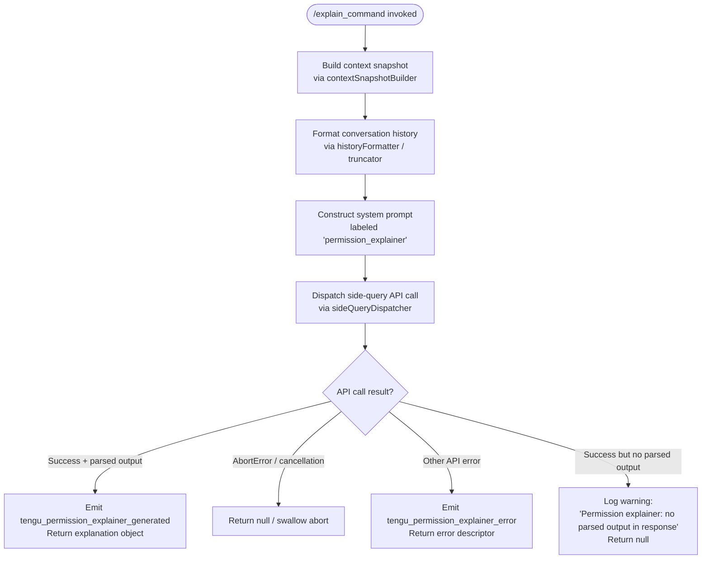

# `/explain_command`

> Analysis basis: CC v2.1.186 bundle.js (AST extraction + Claude interpretation)
> Minimum version: v2.1.186

---

## Overview

`/explain_command` is an internal tool-type command that generates human-readable explanations for why Claude Code is requesting a specific permission or tool use. It invokes a dedicated "permission explainer" sub-agent via an API call, produces a structured explanation object, and returns the result to the caller (typically a UI layer rendering a permission-request dialog). The command is identified internally by the label `"permission_explainer"` and fires dedicated telemetry events on both success and failure paths.

## Registration

| Field | Value |
|---|---|
| type | `tool` |
| name | `explain_command` |
| description | `null` |
| loc_byte | `14669948` |
| loc_byte_end | `14669984` |
| loc_line | `11171` |
| arbor_handler.name | `hZl` |
| arbor_handler.fqn | `claude-2.1.186::hZl` |
| arbor_handler.kind | `AsyncFunction` |
| arbor_handler.resolution_path | `direct` |
| arbor_handler.n_hits | `1` |

Analysis basis: CC v2.1.186 bundle.js:+14669948

---

## Input Branching

The handler has four distinct outcome branches: (1) normal success with a parsed explanation, (2) abort/cancellation, (3) API error, and (4) missing/unparsed output. A Mermaid flowchart is used.



Analysis basis: CC v2.1.186 bundle.js:+14669643, +14670431, +14670643, +14670778, +14671101, +14671172

---

## Behavioral Spec

### 1. Handler Entry — `permissionExplainerHandler` (`hZl`)

```
async function permissionExplainerHandler(toolInput, appState):
    timestamp_start = Date.now()

    # Step 1: Build conversation context
    contextSnapshot = buildConversationContext(appState)   // EFo → wt chain

    # Step 2: Format recent assistant messages for the explainer
    recentHistory  = formatRecentHistory(contextSnapshot)  // t9f + n9f

    # Step 3: Truncate / trim history to fit model window
    truncatedText  = truncateHistoryText(recentHistory)    // n9f → zR

    # Step 4: Resolve system-prompt configuration for 'permission_explainer'
    systemConfig   = resolveSystemConfig("permission_explainer", appState)  // _s chain

    # Step 5: Build full API request payload
    payload = buildSideQueryPayload(
        label        = "permission_explainer",
        history      = truncatedText,
        systemConfig = systemConfig,
        toolInput    = toolInput
    )  // $5 chain

    # Step 6: Fire API request
    result = await sideQueryDispatcher(payload)  // $5 → dW

    # Step 7: Branch on outcome
    if result contains parsed explanation:
        emit("tengu_permission_explainer_generated")
        return parseExplanationOutput(result)
    elif result is AbortError:
        return null
    elif result is api_error:
        emit("tengu_permission_explainer_error")
        return errorDescriptor(result)
    else:
        log_warn("Permission explainer: no parsed output in response")
        return null
```

Analysis basis: CC v2.1.186 bundle.js:+14669643, +14669667, +14669688, +14669706, +14669853, +14669866, +14670046, +14670239, +14670273, +14670429, +14670481, +14670530, +14670725, +14670982, +14671137

---

### 2. Context Builder — `buildConversationContext` (`EFo` → `wt`)

```
function buildConversationContext(appState):
    # Reads current conversation state and config
    config = readCurrentConfig()          // cEe → r.readFileSync (utf-8)
    files  = resolveRelatedFiles(config)  // HGl → t.readdirStringSync
    return { config, files, timestamp: Date.now() }
```

The config loader throws `"Config accessed before allowed."` if accessed before initialization is complete (literal at bundle.js:+13852501). File-not-found (`ENOENT`) is handled gracefully; `EEXIST` is similarly caught during backup-directory creation.

Analysis basis: CC v2.1.186 bundle.js:+13849149, +13849163, +13852495, +13852501, +13852557, +13852731

---

### 3. History Formatter — `formatRecentHistory` (`t9f`) and `truncateHistoryText` (`n9f`)

```
function formatRecentHistory(snapshot):
    # Serialises recent messages using JSON.stringify (De)
    # Converts to String for uniform handling
    # Filters to 'assistant' role messages only
    assistantMessages = snapshot.messages
        .filter(m => m.role == "assistant")
        .slice(-1000)          // keeps last 1000 messages approx.
    return String(assistantMessages)

function truncateHistoryText(messages):
    # Reverses list, applies character-level truncation (zR)
    # Safe-truncates at surrogate boundary (charCodes 55296–56319)
    # Prepends "..." marker when text is clipped
    # Re-joins with unshift to restore order
    reversed = messages.reverse()
    truncated = safeSliceAtSurrogateBoundary(reversed)  // zR
    if truncated.length < original.length:
        reversed.unshift("...")
    return reversed.join("")
```

- Maximum assistant message sample: 1000 entries (literal `1000` at bundle.js:+14669212).
- Surrogate pair boundary constants: `55296` (high surrogate start) and `56319` (high surrogate end) at bundle.js:+202110, +202120.
- Role filter literal `"assistant"` at bundle.js:+14669247.
- Truncation marker `"..."` at bundle.js:+14669443.

Analysis basis: CC v2.1.186 bundle.js:+14669158, +14669184, +14669224, +14669247, +14669267, +14669292, +14669435, +14669443, +14669451, +14669484

---

### 4. System-Config Resolution — `resolveSystemConfig` (`_s`)

```
function resolveSystemConfig(label, appState):
    # Calls modelConfigResolver (b9) which in turn invokes:
    #   - modelTierSelector (ja) to pick the correct model tier
    #   - policySettingsResolver (In) for policy overrides
    #   - providerFormatter (rfn) to build provider-specific config block
    # Falls back through Zo (model name normaliser) and dwt (tier canonicaliser)
    return buildSystemBlock(label, appState)
```

The label `"permission_explainer"` is recorded at bundle.js:+14670006. Model-tier selection uses tier names including `"sonnet"`, `"haiku"`, `"opus"`, `"fable"`, `"opusplan"`, and `"best"` (literals at bundle.js:+2294516, +2294555, +2294594, +2294412, +2294475, +2294628). Policy-settings key is `"policySettings"` (literal at bundle.js:+2275697).

Analysis basis: CC v2.1.186 bundle.js:+2278949, +2278985, +2278998, +2275290, +2275307, +2275558, +2275565

---

### 5. Side-Query Dispatcher — `sideQueryDispatcher` (`$5` → `dW`)

```
async function sideQueryDispatcher(payload):
    # Builds HTTP request headers:
    #   User-Agent, X-Claude-Code-Session-Id, x-app (cli / cli-bg),
    #   x-client-app, x-claude-code-agent-id, x-claude-code-parent-agent-id
    # Appends OAuth / API-key auth via oauthTokenChecker (wh → I_n → FUr)
    # Sets content-type, anthropic-beta headers
    # Fires fetch to Anthropic API endpoint
    # Streams response via streamingResponseHandler (bQu)
    # Applies byte-watchdog (timeout: 15000 ms first-byte, 120000 ms total)
    # Parses structured output from streamed chunks
    # Returns raw parsed result
```

Key timeouts and limits:
- First-byte idle timeout: 15 000 ms (literal at bundle.js:+3025026)
- Total stream timeout: 120 000 ms (literal at bundle.js:+3025044)
- Session-ID header: `"X-Claude-Code-Session-Id"` (literal at bundle.js:+3018441)
- Agent-ID header: `"x-claude-code-agent-id"` (literal at bundle.js:+3018599)
- Parent-agent-ID header: `"x-claude-code-parent-agent-id"` (literal at bundle.js:+3018662)
- App-type header value `"cli"` (literal at bundle.js:+3018417) or `"cli-bg"` (literal at bundle.js:+3018408)
- Base API URL: `"https://api.anthropic.com"` (literal at bundle.js:+2343142)
- Cloud-gateway session-expired message: `"Cloud gateway session expired — run /login to reconnect."` (literal at bundle.js:+3019559)

The internal query is tagged `"side_query"` (literal at bundle.js:+8947057) and `"sideQuery"` (literal at bundle.js:+8948468).

Analysis basis: CC v2.1.186 bundle.js:+8947012, +8947025, +8947114, +8947150, +8947171, +8947179, +8947214, +8947246, +8947255, +3018369, +3018386, +3018403, +3018423, +3018441, +3018565, +3018599, +3018662, +3019025, +3019149

---

### 6. Output Parsing and Telemetry Emission

```
function parseAndEmit(apiResult):
    if apiResult.parsed is not null:
        telemetry.emit("tengu_permission_explainer_generated", {
            duration: Date.now() - timestamp_start
        })
        return apiResult.parsed

    if apiResult.error.name == "AbortError":
        # Silent abort — caller handles UI cleanup
        return null

    if apiResult.error.type == "api_error":
        telemetry.emit("tengu_permission_explainer_error", {
            error: apiResult.error
        })
        return { type: "api_error", detail: apiResult.error }

    # Fallthrough: response arrived but no structured output found
    log_warn("Permission explainer: no parsed output in response")
    return null
```

The string `"permission_explainer_generate"` (literal at bundle.js:+14670533) is used as the internal sub-operation label within the dispatch chain.

Analysis basis: CC v2.1.186 bundle.js:+14670429, +14670431, +14670533, +14670643, +14670778, +14671101, +14671137, +14671172

---

## State & Side Effects

| Item | Detail |
|---|---|
| Telemetry — success | `tengu_permission_explainer_generated` (bundle.js:+14670431) |
| Telemetry — error | `tengu_permission_explainer_error` (bundle.js:+14670643) |
| Telemetry — upstream stream | `tengu_byte_watchdog_fired_late` (bundle.js:+3026077), `tengu_stream_watchdog_default_on` (bundle.js:+3026785), `tengu_byte_stream_idle_timeout_ms` (bundle.js:+3024815), `cli_byte_watchdog_fired` (literal bundle.js:+3025979) |
| Telemetry — background / daemon (transitive) | `tengu_bg_dispatch_sigkill_escalate`, `tengu_bg_dispatch_low_mem`, `tengu_bg_spare_enable`, `tengu_bg_spare_claim`, `tengu_bg_spare_claim_fail`, `tengu_bg_retire_pinned_low_mem`, `tengu_bg_prewarm_per_sweep`, `tengu_daemon_config_reload`, `tengu_daemon_control`, `tengu_daemon_yield`, `tengu_scheduled_task_missed` |
| Telemetry — config / auth (transitive) | `tengu_config_parse_error`, `tengu_config_auth_loss_prevented`, `tengu_prompt_cache_1h_config`, `tengu_lone_surrogate_sanitized`, `tengu_api_success`, `tengu_feature_ok`, `tengu_feature_bad`, `tengu_feature_sad` |
| appState changes | None observed directly; reads conversation state and config, does not mutate persistent store |
| Hook registration | Transitive only: `Ai` → `O5o.register` (bundle.js:+67125) via the file-watch path |
| File I/O | Config read (`r.readFileSync`, utf-8); backup directory creation (`r.mkdirSync`, `r.copyFileSync`); directory listing (`r.readdirStringSync`, `t.readdirStringSync`) — all via the `cEe`/`wt` context-builder chain |
| Sound | None observed |
| Network | Single outbound HTTPS request to `https://api.anthropic.com` carrying the permission-explainer prompt |

---

## Version History

| Version | Change |
|---|---|
| v2.1.186 | Initial analysis |

---

## Common Mistakes

1. **Treating this as a user-facing slash command.** `explain_command` is registered as `type: "tool"`, not as a REPL slash command. It is invoked programmatically by the permission-dialog layer, not by the user typing `/explain_command`.
2. **Expecting a description string.** The `description` field is `null` in the registration object; do not rely on it for display or routing purposes.
3. **Assuming synchronous execution.** The handler (`hZl`) is an `AsyncFunction`; callers must `await` it and handle the `AbortError` path (returns `null` silently).
4. **Ignoring the "no parsed output" branch.** A `null` return does not necessarily indicate a network error — it can also mean the model responded but produced no structured output. Callers should handle this case independently of the `api_error` path.
5. **Conflating the `"permission_explainer"` label with `"permission_explainer_generate"`.** The former identifies the system-config block; the latter (`bundle.js:+14670533`) is the sub-operation label used within the dispatch chain. They are distinct.

---

## Appendix — Identifier Mapping

> For bundle debugging only. Identifiers change across versions.

| Identifier | Role |
|---|---|
| `hZl` | Main async handler for `explain_command` (permissionExplainerHandler) |
| `EFo` | Conversation context builder (entry shim) |
| `wt` | Core context/state reader |
| `Gt` | Config guard / pre-check |
| `mOo` | Config options merger |
| `cEe` | Config file reader (readFileSync, backup, ENOENT handling) |
| `Bt` | JSON parser wrapper |
| `i9` | String prefix stripper |
| `mn` | Error/log helper |
| `HGl` | Directory listing / related-file resolver |
| `T` | Type / value formatter (shared utility) |
| `W` | Generic async work queue / awaiter |
| `_Oo` | Path join helper with fallback |
| `f` | Background session dispatcher |
| `Lxf` | File-watch registration for config reload |
| `aV` | Config change notifier |
| `Ai` | Hook/event registrar |
| `t9f` | History formatter (JSON.stringify + String coercion) |
| `De` | Deep serialiser (JSON.stringify wrapper) |
| `n9f` | History truncator and reverser |
| `e` | Generic random/timeout helper |
| `n` | String lowercaser / collection helper |
| `i` | Stream/socket close helper |
| `s` | Set-based subscription tracker |
| `zR` | Surrogate-safe string slicer |
| `_s` | System-config resolver entry point |
| `b9` | Model-config builder |
| `h_` | Model defaults loader |
| `iG` | Model identity resolver |
| `ja` | Model-tier selector with policy and provider logic |
| `VIt` | Model tier validator (hls/mls) |
| `KIt` | Policy settings applicator |
| `yl` | Model name formatter / alias expander |
| `l` | Locale/case utility |
| `o` | Padded-column formatter |
| `BNe` | Blocked-model checker |
| `XM` | Model name inclusion checker |
| `Zpn` | Recursive tier resolver |
| `$6s` | Object-entries model mapper |
| `In` | Policy-settings reader |
| `vXe` | Provider entry iterator |
| `F6s` | Model index finder |
| `z2u` | Model resolution with dwt/Zo |
| `Zo` | Model name normaliser (trim, toLowerCase, alias map) |
| `dwt` | Model tier canonicaliser |
| `j2u` | Model resolution with prefix filter |
| `$g` | System block builder (Zo + vw) |
| `vw` | Provider-config formatter (Bkr + rfn) |
| `Bkr` | Provider block composer |
| `rfn` | Full request-body builder |
| `$5` | Side-query payload builder and dispatcher |
| `Lf` | Feature-flag reader |
| `Rt` | Runtime-context reader |
| `GL` | Global config accessor |
| `dW` | HTTP request builder and sender |
| `gz` | Request signing helper |
| `gUr` | Header-line parser |
| `Ws` | App-type selector (bg/daemon/cli) |
| `XNe` | App type string constants |
| `Oz` | Async store accessor |
| `lfn` | AsyncLocalStorage getStore |
| `Kkr` | URL encoder |
| `ot` | String coercion utility |
| `wh` | OAuth token checker |
| `I_n` | OAuth token refresher |
| `Y6s` | Boolean coercion helper |
| `ny` | Auth credential resolver |
| `Ud` | Base auth object builder |
| `iA` | OAuth profile loader |
| `Nl` | First-party auth checker |
| `nT` | Auth-type discriminator |
| `Wg` | Full auth resolution flow |
| `Dkt` | Auth cache reader |
| `XQe` | Auth object constructor |
| `GH` | Global header store |
| `_Qu` | Request queue manager |
| `BQe` | In-flight request tracker |
| `Lr` | Logger reference |
| `gln` | Proxy auth helper runner |
| `hNe` | Auth helper subprocess launcher |
| `cvs` | Auth helper response parser |
| `SIu` | Integer parser with NaN check |
| `zN` | Auth credential storage writer |
| `OC` | Config reader (R1e) |
| `IQu` | Full API request executor |
| `br` | Provider-type checker |
| `Sii` | Stream response handler |
| `a` | Session/state map |
| `EUr` | API call wrapper (wt-based) |
| `CQu` | Response header inspector |
| `Aii` | Request object builder |
| `Eii` | Event-stream builder |
| `_Ur` | Timeout/limits calculator |
| `bQu` | Byte-stream watchdog handler |
| `bH` | Provider auth header builder |
| `wvt` | Header merger |
| `dUu` | Anthropic-prefix header detector |
| `LNe` | Case-insensitive header value lookup |
| `K$` | Region/endpoint resolver |
| `d1e` | Default endpoint constant |
| `J_` | Network policy / allowlist checker |
| `el` | String builder |
| `oz` | URL parser |
| `J7e` | Traffic category resolver |
| `uvs` | URL validation helper |
| `FIr` | Full URL policy checker (IP, split, include) |
| `GIr` | Domain/IP resolver |
| `TQu` | Stream type dispatcher |
| `Hii` | Handler-type switch |
| `yQu` | Request pre-processor |
| `c_n` | Config-context loader |
| `RKe` | Request context annotator |
| `kre` | Custom OAuth URL validator |
| `kRr` | OAuth redirect resolver |
| `ks` | Environment-based endpoint builder |
| `wTe` | Gateway token refresher |
| `Wir` | Refresh-guard helper |
| `t3u` | Token exchange HTTP caller |
| `nXt` | Next-refresh scheduler |
| `$ir` | Timestamp stamper |
| `Ekt` | Header case-normaliser |
| `_Ie` | SDK error logger |
| `D` | Scheduled-task / daemon worker driver |
| `grt` | File-read with parse helper |
| `d` | Daemon write / process controller |
| `_Q` | Config formatter (Cfe) |
| `NPt` | File-write helper (mkdir + writeFile) |
| `PBi` | File filter helper |
| `H` | Buffer stream reader |
| `u` | Daemon stop controller |
| `x` | Daemon write stream |
| `g` | Timeout-based map helper |
| `V` | Worker map iterator |
| `Mdc` | Multi-column display builder |
| `uae` | Aggregate file reader |
| `k` | Write-stream helper |
| `w` | Blur/focus timing tracker |
| `oj` | Blur event handler |
| `L` | Worker lifecycle manager |
| `v` | Generic value wrapper |
| `hcc` | History last-element getter |
| `gcc` | History context getter |
| `WC` | Worker creation wrapper (Wg) |
| `LTe` | LLM provider chain builder |
| `mJe` | WIF / federation credential fetcher |
| `ke` | Feature-flag OK emitter |
| `xe` | Feature-flag BAD emitter |
| `a3u` | Capability inclusion checker |
| `I` | Input event handler |
| `A` | Scroll position calculator |
| `wFe` | Model capability filter |
| `So` | Model-string normaliser |
| `YH` | Model alias resolver (lowercase, replace) |
| `EEt` | Model feature checker |
| `Rp` | Model string replacer |
| `SO` | Provider short-name resolver |
| `ese` | Structured output schema resolver |
| `Qyt` | Schema cache reader |
| `RRr` | Schema name builder |
| `_` | MCP/SDK connection manager |
| `N_t` | MCP key enumerator |
| `JHc` | MCP Object.keys wrapper |
| `Re` | Retry/error accumulator |
| `ao` | Error string builder |
| `Ki` | Traffic category inserter |
| `Pnu` | Error ring-buffer manager |
| `Ikp` | Message finder in history |
| `ddo` | SHA-256 hash builder |
| `ufn` | User-agent string builder |
| `Su` | Cache-control header builder |
| `ydn` | Cache-control formatter |
| `WNe` | Subagent header injector |
| `CSn` | Provider-type short-circuit checker |
| `Z5e` | Prompt-cache config builder |
| `yo` | Request context composer |
| `l2` | Array/include utility |
| `Ear` | Cache epoch marker |
| `it` | Prompt-cache flush/register |
| `ORt` | Cache-reset trigger |
| `NRt` | Cache notify helper |
| `$9` | Cache epoch store |
| `JEn` | Cache set/get with dedup |
| `Sar` | Cache-suffix builder |
| `ZM` | HIPAA / compliance flag resolver |
| `kUr` | Compliance header builder |
| `vFe` | Compliance option formatter |
| `UNe` | Compliance keyword checker |
| `JBa` | Response post-processor |
| `__n` | Temperature injector |
| `jC` | Message mapper |
| `Awe` | Aggregated tool-call builder |
| `_W` | Sub-agent session spawner |
| `_n` | Sub-agent config initialiser |
| `pc` | Agent context builder |
| `fWo` | Tool-call array manipulator (pop/push) |
| `IJt` | Tool-call type checker |
| `EN` | Deep-clone helper (structuredClone) |
| `vJt` | Tool-response array manipulator |
| `CJt` | Tool-response formatter |
| `Ke` | Config version accessor |
| `KVe` | Config version constant |
| `MRr` | Response validator |
| `aWs` | Response schema checker |
| `xRr` | Response cache updater |
| `ASe` | API success recorder |
| `Mr` | Config writer |
| `yH` | Config write helper |
| `Go` | Config accessor |
| `EDt` | Agent dispatch table builder |
| `_1i` | Builtin-agent resolver |
| `aId` | Agent ID classifier |
| `Snt` | Agent name resolver |
| `yDt` | Agent config merger |
| `_Dt` | Agent hash builder |
| `FU` | Agent context constructor |
| `iId` | Agent prefix stripper |
| `gCn` | Custom agent prefix handler |
| `i2r` | Agent path slicer |
| `$O` | Agent prefix matcher |
| `Wyt` | Final payload assembler |
| `Pi` | MCP tool name classifier |
| `Mt` | Model provider resolver |
| `Pe` | Provider constant accessor |
| `Ae` | String error formatter |