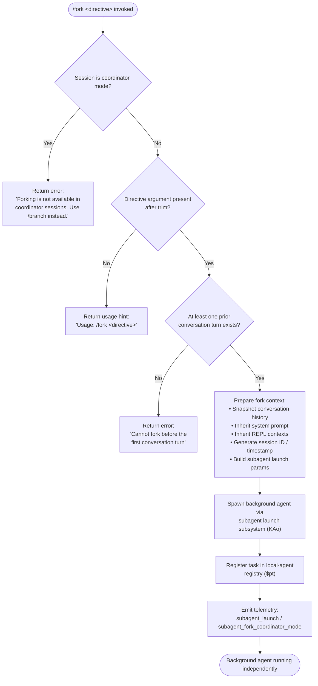

# `/fork`

> Analysis basis: CC v2.1.186 bundle.js (AST extraction + Claude interpretation)
> Minimum version: v2.1.186

---

## Overview

`/fork` spawns a detached background agent that inherits the full conversation history of the current session up to the moment of invocation. The user provides a directive string that becomes the forked agent's initial task. The command is unavailable in coordinator-mode sessions (which must use `/branch` instead) and requires at least one prior conversation turn before it can execute.

---

## Registration

| Field | Value |
|---|---|
| type | `local-jsx` |
| name | `fork` |
| description | Spawn a background agent that inherits the full conversation |
| argumentHint | `<directive>` |
| module_id | `bMl` |
| load_inline | `true` |
| loc_byte | `12638869` |
| loc_byte_end | `12639072` |
| arbor_handler.name | `sHf` |
| arbor_handler.fqn | `claude-2.1.186::sHf` |
| arbor_handler.kind | `AsyncFunction` |
| arbor_handler.resolution_path | `module_id` |
| arbor_handler.n_hits | `0` |

Analysis basis: CC v2.1.186 bundle.js:+12638869

---

## Input Branching

Three distinct guard branches exist before the fork is actually launched, plus the main execution path — a Mermaid flowchart is required.



Analysis basis: CC v2.1.186 bundle.js:+12638428 (trim guard), +12638452 (usage string), +12638566 (coordinator error), +12638639 (no-turn error)

---

## Behavioral Spec

### 1. Argument Validation (handler entry — `sHf`)

```
async function forkCommandHandler(input, context):
    directive = input.trim()                           // bundle.js:+12638428
    if directive is empty:
        return usageMessage("Usage: /fork <directive>")  // bundle.js:+12638452

    sessionMode = context.getAppState().mode
    if sessionMode is coordinator:                     // bundle.js:+12638561
        return error("Forking is not available in coordinator sessions. Use /branch instead.")

    conversationHistory = snapshotHistory(context)
    if conversationHistory has no prior turns:         // bundle.js:+12638639
        return error("Cannot fork before the first conversation turn")
```

Analysis basis: CC v2.1.186 bundle.js:+12638428

### 2. Conversation History Snapshot (`pYp` / `Pr`)

```
function buildForkContext(appState):
    messages = appState.getMessages()
    lastAssistantTurn = messages.findLast(isAssistantMessage)   // bundle.js:+10903154
    workingDirectory  = extractParam(lastAssistantTurn, "working_directory")  // +10903179
    allowedTools      = extractParam(lastAssistantTurn, "allowed_tools")       // +10903234
    disallowedTools   = extractParam(lastAssistantTurn, "disallowed_tools")    // +10903289
    avoidPrompts      = extractParam(lastAssistantTurn, "avoid_prompts")       // +10903350
    permissionMode    = extractParam(lastAssistantTurn, "permission_mode")     // +10903452
    bypassPermissions = extractParam(lastAssistantTurn, "bypassPermissions")   // +10903483
    sessionParam      = extractParam(lastAssistantTurn, "session")             // +10903782
    effortParam       = extractParam(lastAssistantTurn, "effort")              // +10903807
    modelParam        = extractParam(lastAssistantTurn, "model")               // +10903820
    maxThinkingTokens = extractParam(lastAssistantTurn, "max_thinking_tokens") // +10903832
    flagSettings      = extractParam(lastAssistantTurn, "flag_settings")       // +10903858
    return ForkContext { messages, workingDirectory, allowedTools, ... }
```

Analysis basis: CC v2.1.186 bundle.js:+10903154

### 3. Subagent Launch (`KAo`)

```
async function launchSubagent(forkContext, directive, parentContext):
    sessionId  = generateSessionId(randomBytes)        // bundle.js:+11231963
    startedAt  = Date.now()                            // bundle.js:+11231990
    replCtxs   = parentContext.getReplContexts()       // bundle.js:+11231788

    // Truncate conversation to last 50/49 turns for context window management
    sliceStart = max(0, messages.length - 50)          // bundle.js:+11231933
    sliceEnd   = max(0, messages.length - 49)          // bundle.js:+11231946
    trimmedMessages = messages.slice(sliceStart)

    systemBlock = buildSystemMessage(forkContext)      // type: "system", bundle.js:+12638492
    launchParams = {
        type:       "fork",                            // bundle.js:+11231748
        mode:       "subagent",                        // bundle.js:+11232470
        spawnMode:  "spawn",                           // bundle.js:+11232560
        directive:  directive,
        session:    sessionId,
        messages:   trimmedMessages,
        systemPrompt: systemBlock,
        replContexts: replCtxs,
        ...forkContext
    }

    emit telemetry("subagent_launch")                  // bundle.js:+11231557
    emit telemetry("subagent_fork_coordinator_mode")   // bundle.js:+11231575

    if directive is missing at this stage:
        emit telemetry("subagent_fork_prompt_missing") // bundle.js:+11231699

    taskHandle = await registerLocalAgent(launchParams) // via $pt
    return taskHandle
```

Analysis basis: CC v2.1.186 bundle.js:+11231542

### 4. Local Agent Registration (`$pt`)

```
async function registerLocalAgent(params):
    agentDir = resolveAgentDirectory(Kw)               // bundle.js:+10575105
    await createAgentDirectory(agentDir)               // Une.mkdir, bundle.js:+13428558
    await writeSymlink(agentDir)                       // Une.symlink, bundle.js:+13431039
    taskEntry = {
        status:  "pending",                            // bundle.js:+13432061
        type:    "local_agent",                        // bundle.js:+10575146
        runMode: "running",                            // bundle.js:+10575191
        purpose: "general-purpose"                     // bundle.js:+10575309
    }
    register(taskEntry, context)                        // a.register, bundle.js:+10575511
    startedAt = Date.now()                             // iC, bundle.js:+13432107
    return taskEntry
```

Analysis basis: CC v2.1.186 bundle.js:+10575099

### 5. Background Agent Execution (`i6e`)

The spawned background agent runs with a timeout budget of **600,000 ms (10 minutes)** before a stall watchdog fires.

```
async function runBackgroundAgent(agentContext):
    timeout = 600000                                   // bundle.js:+9034796
    agentStatus = "background"                         // bundle.js:+9034645
    agentMode   = "responding"                         // bundle.js:+9034887

    watchdogTimer = setTimeout(handleStallTimeout, timeout)
    try:
        result = await executeAgentLoop(agentContext)  // hKp inner loop
        emit telemetry("subagent_complete")            // bundle.js:+9036112
    catch stall:
        emit telemetry("subagent_stall_timeout")       // bundle.js:+9036132
    finally:
        clearTimeout(watchdogTimer)
        updateTaskRegistry(result)
        emit "subagent_end"                            // bundle.js:+9032271
```

Analysis basis: CC v2.1.186 bundle.js:+9034645

### 6. System Prompt Construction (`cR`)

The forked agent's system prompt is assembled from multiple feature-flag-gated sections. Key observed sections include:

| Section key | Description |
|---|---|
| `task_continuity` | Task ownership phrasing (bundle.js:+13575910) |
| `fable_identity` | Identity block for Fable model variants (bundle.js:+13575943) |
| `tool_param_json` | Tool parameter JSON formatting rules (bundle.js:+13575991) |
| `env_info_static` | Static environment description string (bundle.js:+13576281) |
| `env_info_simple` | Simplified environment block (bundle.js:+13576318) |
| `language` | Language/output locale (bundle.js:+13576356) |
| `output_style` | Response style guidance (bundle.js:+13576391) |
| `bg-session` | Background-session-specific instructions (bundle.js:+13576421) |
| `scratchpad` | Scratchpad usage policy (bundle.js:+13576481) |
| `context_management` | Context-window management hints (bundle.js:+13576509) |
| `brief` | Brief-mode instructions (bundle.js:+13576548) |
| `reproduce_verify_workflow` | Reproduce-and-verify workflow guidance (bundle.js:+13576602) |
| `act_dont_rederive` | Instruction not to re-derive known facts (bundle.js:+13576653) |
| `heron_brook` | Autonomy appendix (bundle.js:+13576696) |
| `autonomy_append` | Additional autonomy guidance (bundle.js:+13576724) |

Background-session-specific notes injected into system prompt (observed literal):

> "- Agent threads always have their cwd reset between bash calls, as a result please only use absolute file paths." (bundle.js:+13581955)

Analysis basis: CC v2.1.186 bundle.js:+13575556

### 7. Error / Early-Exit Paths

| Condition | Response |
|---|---|
| Coordinator session detected | Error string ending "…Use /branch instead." (bundle.js:+12638566) |
| No directive after trim | Usage hint "Usage: /fork \<directive\>" (bundle.js:+12638452) |
| No prior turn | Error "Cannot fork before the first conversation turn" (bundle.js:+12638639) |
| Missing prompt detected at launch | Telemetry `subagent_fork_prompt_missing` (bundle.js:+11231699) |
| Agent stall timeout (600 s) | Telemetry `subagent_stall_timeout` + watchdog action (bundle.js:+9035872) |

---

## State & Side Effects

| Item | Detail |
|---|---|
| Telemetry — subagent_launch | Fired when subagent launch parameters are assembled (bundle.js:+11231557) |
| Telemetry — subagent_fork_coordinator_mode | Fired alongside subagent_launch to record coordinator context (bundle.js:+11231575) |
| Telemetry — subagent_fork_prompt_missing | Fired if directive is absent at launch stage (bundle.js:+11231699) |
| Telemetry — subagent_complete | Fired when forked agent finishes successfully (bundle.js:+9036112) |
| Telemetry — subagent_stall_timeout | Fired when the 600 s stall watchdog triggers (bundle.js:+9036132) |
| Telemetry — subagent_end | Fired at end of background agent lifecycle (bundle.js:+9032271) |
| Telemetry — tengu_async_agent_stall_timeout | Internal watchdog telemetry (bundle.js:+9035872) |
| Telemetry — tengu_async_agent_stranded_tools_cleared | Fires if in-flight tools remain after abort (bundle.js:+9036832) |
| Telemetry — tengu_agent_tool_completed | Per-tool completion event inside agent (bundle.js:+9031676) |
| appState changes | Forked agent registers in the local-agent task registry via `$pt`; parent session appState is read-only from the fork's perspective |
| Filesystem side effects | Agent working directory created under subagent dir (`Une.mkdir`, `Une.symlink`); metadata written (bundle.js:+13428558) |
| Agent session ID | Generated via `randomBytes(8).toString("hex")` pattern (bundle.js:+27987) |
| Background session label | Logged as `"background session"` (bundle.js:+17194519) |
| Context window truncation | Parent conversation is sliced to the last ~50 messages before handoff (bundle.js:+11231933) |
| Stall watchdog timeout | 600,000 ms (10 minutes) (bundle.js:+9034796) |
| Sound | No evidence found in depth-2 traversal |
| Hook registration | Session hooks are not directly triggered by `/fork`; the forked agent inherits hook configuration from parent appState |

---

## Version History

| Version | Change |
|---|---|
| v2.1.186 | Initial analysis |

---

## Common Mistakes

1. **Using `/fork` inside a coordinator session.** The command explicitly rejects invocations in coordinator mode with a clear error. Use `/branch` in that context instead.
2. **Invoking `/fork` before any conversation turn.** The guard requires at least one completed exchange; running it immediately after starting a fresh session will produce an error.
3. **Omitting the directive argument.** `/fork` with no argument (or only whitespace) returns a usage hint and does nothing — the directive is mandatory.
4. **Expecting the fork to share live state with the parent.** The forked agent receives a snapshot of the conversation at the moment of invocation; changes made to the parent session after the fork are not visible to the child, and vice versa.
5. **Assuming unlimited runtime.** The background agent has a hard stall watchdog of 10 minutes (600,000 ms). Long-running work should be designed to produce checkpoints or complete within that window.
6. **Relying on relative paths inside the forked agent.** The system prompt explicitly warns that agent threads have their cwd reset between bash calls; absolute paths must be used.

---

## Appendix — Identifier Mapping

> For bundle debugging only. Identifiers change across versions.

| Identifier | Role |
|---|---|
| `sHf` | Main `/fork` command handler (AsyncFunction) |
| `KAo` | Subagent launch orchestrator — builds launch params and spawns agent |
| `pYp` | Fork context builder — snapshots conversation history and parameters |
| `Pr` | Conversation history retriever — finds last assistant turn and extracts params |
| `cR` | System-prompt assembler for forked agent |
| `$pt` | Local-agent registration entry point |
| `N_e` | Agent filesystem setup — creates directories and symlinks |
| `LJn` | Agent task set manager (add/delete from active set) |
| `gDo` | Agent working directory creator (`Une.mkdir`) |
| `mm` | Agent metadata file path builder |
| `Qct` | Agent metadata file writer (`Une.open`) |
| `iC` | Agent start-time recorder (`Date.now`) |
| `Kw` | Agent directory path resolver |
| `i6e` | Background agent execution loop |
| `KB` | Full REPL session runner (parent of `i6e`) |
| `hKp` | Core query/agent-loop function |
| `T0` | Stream-event processor within agent loop |
| `GBa` | Agent turn executor and summary generator |
| `Xae` | Agent state-transition handler (thinking/responding) |
| `wdo` | Agent output rendering and handoff-classifier gate |
| `y9t` | Handoff classifier invocation |
| `Cdo` | Agent tool-completion handler |
| `x3a` | Task-registry update on agent completion |
| `aH` | Agent flush handler (vJn cleanup) |
| `L3n` | Task-state update on agent abort/end |
| `D3n` | Conversation compaction boundary finder |
| `R3n` | Tool-permission evaluator (`GGe`) |
| `w8n` | Working-directory param extractor |
| `L8n` | Allowed-tools param extractor |
| `L2` | Conversation message builder |
| `Uul` | Directive trim helper |
| `X6n` | REPL context message injector |
| `pBp` | Assistant-message filter |
| `fBp` | Tool-use message filter |
| `dBp` | Tool-result message filter |
| `mBp` | Error-result message filter |
| `LM` | Session ID generator (randomBytes + hex) |
| `Hz` | Agent context initializer |
| `Qo` | GL/ud logger helper |
| `ud` | Unified debug/log emitter |
| `ute` | Model/provider resolution layer |
| `Tk` | Model name normalizer |
| `Zo` | Model alias resolver |
| `ja` | Per-model capability lookup |
| `JIp` | Model-request builder |
| `yl` | Model name string cleaner |
| `bH` | Provider prefix detector (bedrock/vertex/mantle) |
| `IXe` | Model string transformer |
| `FNa` | Model includes-check helper |
| `UNa` | Model context/style resolver |
| `XG` | Model context-window getter |
| `TH` | Tfe-based model type detector |
| `sco` | Scratchpad output collector |
| `T9` | Async-local store accessor |
| `JG` | Ewt async context runner |
| `ot` | String-to-text utility |
| `Hv` | Model header builder |
| `cw` | Model capability wrapper |
| `ta` | API transport adapter |
| `xe` | Feature-flag evaluator |
| `Pe` | KVe-based permission checker |
| `KVe` | Permission/capability constant map |
| `VDo` | System-prompt section renderer |
| `Ot` | Output-type discriminator |
| `So` | Application-inference-profile checker |
| `mqn` | Plugin tool-list builder |
| `Nr` | DG-based narrator/renderer |
| `EIe` | IUr-based tool feature enabler |
| `_L` | Literal system-prompt section injector |
| `MLf` | Output-style system-prompt section |
| `DLf` | Confirmation-required section |
| `PLf` | Oii-based permission-check section |
| `m_n` | Fable-identity prefix detector |
| `YG` | yl-based model-name section injector |
| `nEi` | $Rt-based memory section builder |
| `YDo` | Environment-info section assembler |
| `p0f` | YDo wrapper — simple env block |
| `pq` | Nr-based paragraph renderer |
| `YLf` | Session-guidance / schedule section builder |
| `uxt` | Memory-load prompt builder |
| `o0f` | Static environment info builder |
| `r0f` | Worktree / git env info builder |
| `BLf` | Language section injector |
| `GLf` | Output-style section injector |
| `i0f` | Background-session section builder |
| `p4n` | Scratchpad section builder |
| `l0f` | Brief-mode section (WDo.isBriefEnabled gate) |
| `d0f` | Flag-settings section builder |
| `QLf` | Base identity section (ot + it + T) |
| `FLf` | Heron-brook autonomy section builder |
| `$Lf` | Amber-sextant section builder |
| `TXa` | Tool-context cache loader (HEt + Promise.all) |
| `JLf` | qDo-based section appender |
| `WLf` | Inline literal section appender |
| `qLf` | ULf + Rq context-management section |
| `VLf` | it + Rq verified-vs-assumed section |
| `KLf` | YDo-based coordinator section |
| `zLf` | hv + Rq tool-usage section |
| `XLf` | Rq-based section ender |
| `GSi` | BSi + zBr memory-dir section |
| `SIe` | ZM + Su + br first-party/aws section |
| `U4l` | aqn + Uy + lqn system-prompt finalizer |
| `D5` | Agent-memory loader (getSystemPrompt) |
| `Cc` | Model-config constant |
| `fH` | Feature-flag handler |
| `Ke` | KVe-based key extractor |
| `de` | Full REPL session state builder |
| `ie` | Session-state object constructor |
| `Xn` | Vt + Re session-type resolver |
| `tn` | Session metadata container |
| `jn` | Session cleanup manager |
| `wca` | MCP server connection manager |
| `Xo` | App-state extractor |
| `l` | QNl-based listener |
| `Un` | p-based unread-message tracker |
| `c9` | dl-based config loader |
| `G4` | dl + startsWith config helper |
| `vGi` | VSCode extension feature gate |
| `iLn` | Jj-based inline listener |
| `Jj` | Event emitter helper |
| `Qvl` | MCP message serializer |
| `Jgc` | CCD-session gate |
| `Ate` | Agent-turn aggregator and permission accumulator |
| `Tdo` | Tool-permission filter |
| `Ido` | zm-based tool-permission accumulator |
| `f` | Agent process spawner (lV.spawn) |
| `bdo` | Tool-block parser |
| `hv` | Z3 + el + ot + it tool-usage section |
| `zm` | tau + Hk message-truncation utility |
| `E` | yUt + N_t event emitter |
| `t0` | e.split + o.join path joiner |
| `q1e` | u9-based quota checker |
| `L` | Agent-pool lifecycle manager |
| `I` | Math.max/floor input handler |
| `A` | Math.max/min range clamper |
| `rC` | ot + Iir result container |
| `fc` | Tool-call formatter |
| `ve` | ZYl + tXl + XYl + nXl session event loader |
| `ZYl` | I2 + ks + KE event list builder |
| `tXl` | eXl + xe + ke event fetch handler |
| `XYl` | t_t + Ozt + W + Pe + Ke worker-event handler |
| `nXl` | eXl-based truncation-harvest handler |
| `LPp` | getSystemPrompt + s4t system-prompt loader for fork |
| `s4t` | n0f + U4l system-prompt section combiner |
| `RPp` | p4n + Cc plugin capability checker |
| `i4t` | od + cC subagent-start hook runner |
| `od` | Rt + zP + UI + nD + hR + Ot agent-metadata builder |
| `cC` | Full agent-lifecycle callback orchestrator |
| `St` | Fw + g + xU + t + r command-queue entry |
| `Fw` | e.startsWith bash-prefix checker |
| `xU` | Fw + e.slice command parser |
| `ti` | eAo.randomUUID + t.uuid + t.now turn-id generator |
| `ee` | Promise.all + ZW + H.filter MCP-update applier |
| `ZW` | TypeError + Number.isSafeInteger MCP-entry validator |
| `nit` | parseInt-based MCP version parser |
| `Oxn` | parseInt-based MCP count parser |
| `ne` | ee + te + A + v MCP-set manager |
| `Q3e` | ELe-based MCP event emitter |
| `q2o` | Object.entries + t.getClients MCP client mapper |
| `zE` | In + Array.isArray tool-enable checker |
| `In` | Qon + Z$ capability-flag reader |
| `$me` | Tad.has managed-settings gate |
| `$Ba` | Object.keys + T + e.add session-block builder |
| `jl` | GL-based logger |
| `xPp` | zdt + fi + t.find plugin-command finder |
| `zdt` | uS-based tool-definition loader |
| `fi` | e.indexOf + e.slice arg parser |
| `N6e` | uS + t.map + pu plugin-command list builder |
| `uS` | t.find + A3l tool-definition lookup |
| `mt` | Array.from message-transcript holder |
| `_t` | I8 + Array.isArray + vn.some plugin command handler (getPromptForCommand) |
| `I8` | e.endsWith file-extension checker |
| `vn` | Plugin command executor |
| `Bt` | JSON.parse safe parser |
| `ur` | iVe.realpath + Gk file-permission validator |
| `jt` | dh + un.filter + ne.has + ur.indexOf + Ml.jsx command renderer |
| `Vt` | Bye + eEe + NA + FEe.cwd + rp + ope session runner |
| `Bye` | Full plugin-refresh orchestrator |
| `eEe` | v$ + e.filter event filter |
| `NA` | rJn + rnl + zke + S2a session-tool-set builder |
| `ope` | Object.assign shallow merger |
| `vPp` | iat + $me + zE + ESe + Ql + Hl + bB + ynt + B4 full session configurator |
| `iat` | Ito-based telemetry span initializer |
| `bB` | Ab + zE + v3e enterprise-MCP config loader |
| `ynt` | Che + MIe model-policy loader |
| `B4` | Object.entries + Rae + n.push tool-allowlist builder |
| `Ze` | W + Pe + xe session-filter helper |
| `xt` | Full remote-bridge session connector |
| `Rn` | gsu + Gt + De + s.appendFileSync log writer |
| `z` | K.preventDefault + N key-handler |
| `un` | Ei.startsWith + Ts remote-plugin parser |
| `en` | Promise.all + _7e + P9e + T + Ae + Pc managed-settings loader |
| `KOl` | u3n + Bt + Uyf + T + Fyf + Rko + ke + Ae + xe bridge-message ingress handler |
| `we` | YVt + Math.max + Promise.resolve + ve.slice + Mne + Due + wq bridge reconnect manager |
| `zOl` | Bridge transport write handler (T + n.write + qye + Ae + f/m/h/g/H/y/k sub-handlers) |
| `Dt` | a + aE + Xn.map + ie.map + qn.has + Mae + Un.isReadOnly + v_e + _ho + Object.keys session-close handler |
| `$Kl` | Session post-close cleanup |
| `S_e` | RD + $j + ZRe + vSo tool-permission state machine |
| `RD` | qPt + T + br + Su permission-decision renderer |
| `$j` | e.toLowerCase + Sxd + t.includes + r.toLowerCase tool-name normalizer |
| `ZRe` | e.some + fc permission-set checker |
| `vSo` | Full tool-permission update and sort handler |
| `f3n` | wt + So + Object.entries + n.includes session-metrics aggregator |
| `wt` | Gt + QL + mOo + cEe + Date.now + Lxf transcript-write helper |
| `c4n` | d1 + e.getAppState + tge + vwe + Qoa + e.setAppState + Object.assign + v8n + LM + Zil.randomUUID full session hydration |
| `d4n` | v$ + fc + jl + _b + bGt + e.getMcp + AGt + TY + aE + cae + tK + Tll + nA + Uy + zqr + z5e + kI + i.map MCP-tool-set delta processor |
| `bGt` | v$ + Qw + e.filter + oJn MCP-slot filter |
| `AGt` | e.filter + t.has + t.add tool-dedup filter |
| `TY` | oJn + t.add + e.filter + t.has + T MCP tool-set merger |
| `cae` | e.filter + t.some + A3l tool-availability checker |
| `Tll` | SGt.get/set + X_e.has + r.add + t.filter + r.has tool-dedup tracker |
| `nA` | kii + TUr + Rii notification-area renderer |
| `Uy` | GL-based URL handler |
| `zqr` | Full tool-priority queue and scoring algorithm |
| `z5e` | wt + Date.now + Math.pow + Math.max exponential-backoff timer |
| `kI` | Zo + yl + So + nBu.has model-identity resolver |
| `ok` | Tool execution OK status constant |
| `WL` | GL-based warning logger |
| `Sre` | Session-result envelope |
| `Q` | _ + arr + Y.applyMcpUpdate + Q3e + z.push + X.push MCP-state reducer |
| `arr` | e.applyMcpUpdate + Q3e + ln + n.cleanup + WT + aE MCP-slot applier |
| `Tfo` | Oc-based tool-fork context ref builder (literal: `"fork-context-ref"`) |
| `Oc` | Ai-based tool-context container |
| `Sce` | Oc + lWe session-context builder |
| `lWe` | e.filter + aJn + SJn + Awf ant-section injector |
| `Ydt` | N3l + hl.mkdir + zh.dirname + hl.writeFile + De + n.replace + Oc session-metadata persister |
| `N3l` | Kw-based agent-dir resolver |
| `De` | JSON.stringify serializer |
| `rr` | Full remote-session round-trip handler (ct.cancelAll + clearTimeout + He.drop + we + ae.write + jOl + Mko + Promise.race + ae.flush + Bn + ae.close + T + Rn + W + Pe + jt + Date.now + lzt) |
| `ct` | Math.min + $.slice + Fe.writeMessages message-write batcher |
| `He` | T + A + M + dy + K + te + fe session-queue manager |
| `jOl` | Mqt.randomUUID request-ID generator |
| `Mko` | Mqt.randomUUID response-ID generator |
| `Bn` | Timeout-with-abort promise wrapper |
| `lzt` | kx + co.post + WKl + T + Ae + co.isAxiosError HTTP request handler |
| `qe` | clearTimeout + setTimeout + tn.abort queue-abort manager |
| `Via` | Uae + eF + G3e + $D + kLe + performance.now telemetry-span wrapper |
| `Uae` | Session-span attribute setter |
| `eF` | Dge.active async-context getter |
| `G3e` | F2e-based span creator |
| `kLe` | LLe.set + Dge.enterWith span context setter |
| `V5` | hKp + PWn + ke + xe full session-lifecycle runner |
| `hKp` | Core agentic query loop (very large — handles streaming, tool execution, compaction, refusal handling, etc.) |
| `PWn` | x6t + r6.get + DWn + r6.delete + sEo.delete + R6t.delete + jGe.delete subagent exit cleanup |
| `Q5e` | Ekp.has feature-gate checker |
| `Ifo` | Full streaming-response parser and token estimator |
| `UBa` | _kp.has feature-gate checker |
| `Apo` | Spo.clear speculation-cache cleaner |
| `bpo` | hce + Spo.get/set + Date.now + t4a + n + i.findIndex + i.with speculation-cache updater |
| `cQn` | Math.ceil token-count ceiling |
| `Nrt` | Math.round token-count rounder |
| `aRf` | Response metadata recorder |
| `Gn` | Self-referential hook identifier (Gn) |
| `lce` | DA + Hkp + e.filter + s.has + e.push tool-capability filter |
| `Hkp` | e.find tool-definition finder |
| `wPp` | Session warm-up helper |
| `RBa` | Session result aggregator |
| `hy` | Bkf + n.get + o.push + HKt + Gkf skill-listing builder |
| `Bkf` | HKt-based skill-header builder |
| `Gkf` | HKt + cqt + Pn skill-entry builder |
| `f4n` | o + r fork parameter pair |
| `jdt` | hy + Wte + fft + Rt + ot + Date.now + Z5t tool-progress tracker |
| `Wte` | t.trim tool-name trimmer |
| `fft` | Array.isArray + rl + ace + n.push tool-filter aggregator |
| `PGa` | t.get + Hc + Kte agent-progress getter |
| `OBa` | Object.values + t.all agent-monitor awaiter |
| `b_e` | Rt + lP + vx + Wl + t4l + n4l + od + Kw + cC + o4l.randomUUID full subagent-start dispatcher |
| `lP` | wW + dA + aG + U3 agent-lifecycle logger |
| `t4l` | Object.values + xb + aOe + t.push tool-list builder for subagent |
| `n4l` | fI + e.map + aOe tool-name mapper for subagent |
| `t7` | D6i-based telemetry timer |
| `G6i` | h8.delete + GBe session-cache invalidator |
| `GBe` | P6i + O6i + De + L6i.then + BLn.mkdir + BU + BLn.writeFile session-cache writer |
| `bfo` | SGt.delete tool-session-cache cleaner |
| `F3e` | YRn.delete + cJr.delete span-cache cleaner |
| `Kia` | LLe.get + e.setAttribute + B3e + e.end + RLe span finalizer |
| `B3e` | e.setStatus span-status setter |
| `RLe` | eF + Dge.enterWith span-context restorer |
| `iGi` | $zr.delete registry-entry cleaner |
| `NBa` | Object.entries + t.all + VT + T + r_e + Nwe multi-agent batch updater |
| `VT` | Agent-value transformer |
| `r_e` | t.update + VT + T + Re + clearTimeout + Date.now + fm + aH agent-status updater |
| `ZPt` | Agent registry snapshot |
| `o0e` | ke-based agent output emitter |