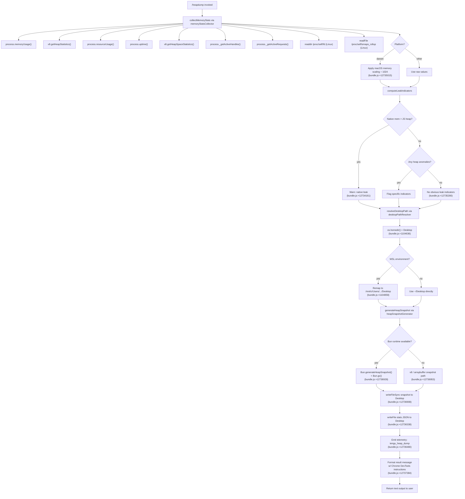

# `/heapdump`

> Analysis basis: CC v2.1.186 bundle.js (AST extraction + Claude interpretation)
> Minimum version: v2.1.186

---

## Overview

`/heapdump` is a hidden, non-interactive diagnostic command that captures a JavaScript heap snapshot of the running Claude Code process, collects comprehensive memory and resource statistics, and writes both to `~/Desktop` for offline analysis. It is intended for memory-leak investigations and is not surfaced in normal command listings.

---

## Registration

| Field | Value |
|---|---|
| type | `local` |
| name | `heapdump` |
| description | `Dump the JS heap to ~/Desktop` |
| supportsNonInteractive | `true` |
| isHidden | `true` |
| module_id | `CPl` |
| load_inline | `true` |
| loc_byte | `12738359` |
| loc_byte_end | `12738787` |
| loc_line | `8680` |
| arbor_handler.name | `v_f` |
| arbor_handler.fqn | `claude-2.1.186::v_f` |
| arbor_handler.kind | `AsyncFunction` |
| arbor_handler.resolution_path | `module_id` |
| arbor_handler.n_hits | `0` |

Analysis basis: CC v2.1.186 bundle.js:+12738359

---

## Input Branching

The command has 4+ distinct execution branches (runtime detection, Bun vs Node heap generation, memory-ratio classification, and output path resolution), so a Mermaid flowchart is used.



---

## Behavioral Spec

### Top-level Handler (`v_f`)

Analysis basis: CC v2.1.186 bundle.js:+12737228

```
async function heapDumpHandler(context):
    lines = []

    // Step 1: collect memory diagnostics
    statsReport = await collectMemoryAndStats(context)

    // Step 2: push instructional header
    lines.push("Open the .heapsnapshot in Chrome DevTools → Memory → Load to inspect retainers.")
    // (bundle.js:+12737384)

    // Step 3: append formatted stats lines
    lines.push(...statsReport.formattedLines)

    // Step 4: join and return as "text" content type
    return { type: "text", content: lines.join("\n") }
    // (bundle.js:+12737260, +12737496)
```

### Memory and Resource Statistics Collector (`TPl` → `memoryStatsCollector`)

Analysis basis: CC v2.1.186 bundle.js:+12735890, +12733391

```
async function memoryStatsCollector():
    stats = {}

    // Core JS memory
    stats.memoryUsage    = process.memoryUsage()           // bundle.js:+12733391
    stats.heapStats      = v8.getHeapStatistics()          // bundle.js:+12733415
    stats.resourceUsage  = process.resourceUsage()         // bundle.js:+12733441
    stats.uptime         = process.uptime()                // bundle.js:+12733467
    stats.heapSpaces     = v8.getHeapSpaceStatistics()     // bundle.js:+12733492
    stats.activeHandles  = process._getActiveHandles()     // bundle.js:+12733534
    stats.activeRequests = process._getActiveRequests()    // bundle.js:+12733571

    // Linux-only supplemental data
    try:
        stats.fdList = readdir("/proc/self/fd")            // bundle.js:+12733622
    catch: pass

    try:
        stats.smapsRollup = readFile(                      // bundle.js:+12733684
            "/proc/self/smaps_rollup", "utf8"              // bundle.js:+12733697, +12733723
        )
    catch: pass

    // Load bun:jsc module if available                     // bundle.js:+12733782
    // (used by Bun runtime for heap space data)

    // Compute age bucket for open-handle tracking
    // Threshold: 3600 seconds, chunk: 1048576 bytes
    // (bundle.js:+12733923, +12733928)

    // Normalize per-megabyte (÷ 100 for percentage display)
    // (bundle.js:+12734075)

    // Native vs JS heap ratio analysis
    if nativeMemory > jsHeapUsed:
        addWarning("Native memory > heap - leak may be in native addons (node-pty, sharp, etc.)")
        // bundle.js:+12734161

    // macOS: apply platform-specific scaling
    if platform == "darwin":                               // bundle.js:+12735434
        rss = rss / 1024  // macOS reports in blocks      // bundle.js:+12735025

    if platform == "macos":                               // bundle.js:+12735015
        // additional macOS path normalisation

    if noLeakIndicators:
        addNote("No obvious leak indicators. Check heap snapshot for retained objects.")
        // bundle.js:+12735280

    return stats
```

### Desktop Path Resolver (`crs`)

Analysis basis: CC v2.1.186 bundle.js:+12736186, +1104590

```
function resolveDesktopPath():
    home = os.homedir()                          // bundle.js:+1104590
    desktopPath = path.join(home, "Desktop")    // bundle.js:+1104626, +1104636

    // WSL detection: remap Windows home
    if desktopPath.startsWith("/mnt/c/Users"):  // bundle.js:+1104858
        // Filter out system accounts
        filtered = path excluding ["Public", "Default", "Default User", "All Users"]
        // bundle.js:+1104902, +1104921, +1104941, +1104966
        desktopPath = resolvedWindowsDesktop

    return desktopPath
```

### Heap Snapshot Generator (`C_f` → `heapSnapshotGenerator`)

Analysis basis: CC v2.1.186 bundle.js:+12736429, +12736908

```
async function heapSnapshotGenerator(outputPath):
    if Bun runtime detected:
        // Bun path
        snapshot = Bun.generateHeapSnapshot()    // bundle.js:+12736928
        Bun.gc(true)                             // bundle.js:+12736985
        data = snapshot in "v8" / "arraybuffer" format
        // bundle.js:+12736953, +12736958
    else:
        // Node.js / v8 path
        // write snapshot via v8 heapSnapshot API

    // Write snapshot file with mode 384 (0o600 — owner read/write only)
    fs.writeFileSync(outputPath, data, { mode: 384 })   // bundle.js:+12736908, +12736373

    // Trigger telemetry
    emit("tengu_heap_dump")                             // bundle.js:+12736480

    // Auto-1.5GB threshold label
    label = "auto-1.5GB"                               // bundle.js:+12736546

    return snapshotFilePath
```

### Memory Leak Classification and Result Formatter (`w_f`)

Analysis basis: CC v2.1.186 bundle.js:+12737347, +12737603

```
function formatMemorySummary(stats):
    lines = []

    jsRatio = jsHeapUsed / totalMemory
    nativeRatio = nativeMemory / totalMemory

    // Use Math.max for ratio clamping (bundle.js:+12737603)

    if jsRatio > nativeRatio:
        lines.push("— most memory is JS heap (inspect the .heapsnapshot)")
        // bundle.js:+12737671
    else:
        lines.push("— most memory is native (NOT in the .heapsnapshot)")
        // bundle.js:+12737731

    if noIndicators:
        lines.push("  (no obvious leak indicators)")    // bundle.js:+12737868

    // Absolute limit check: 1073741824 bytes (1 GiB) threshold
    // (bundle.js:+12738277)

    // Format memory values with toFixed(N) where N varies by magnitude
    // (bundle.js:+12734284)
    // Column padding: 8 chars (bundle.js:+12738003)

    return lines
```

### Orchestrator (`pko`)

Analysis basis: CC v2.1.186 bundle.js:+12737228

```
async function heapDumpOrchestrator(args, context):
    // Validate invocation mode = "manual", version = 0
    // (bundle.js:+12735866, +12735877)

    // Collect memory stats
    stats = await memoryStatsCollector()          // bundle.js:+12735903

    // Resolve desktop path
    outputDir = resolveDesktopPath()              // bundle.js:+12736186

    // Build timestamped output filename
    snapshotPath = path.join(outputDir, ...)     // bundle.js:+12736295

    // Write JSON stats sidecar file
    fs.writeFile(snapshotPath + ".json",          // bundle.js:+12736338
        JSON.stringify(stats),                    // via De → bundle.js:+12736354
        { mode: 384 }                             // bundle.js:+12736373
    )

    // Generate heap snapshot
    snapshotFile = await heapSnapshotGenerator(snapshotPath)
    // bundle.js:+12736429

    // Format user-facing result
    result = formatResult(stats, snapshotFile)
    // bundle.js:+12736478

    // Log error if any step failed
    // (bundle.js:+12736649, +12736658, +12736736)

    // Return 3-element result array (bundle.js:+12735946)
    return [messageText, snapshotPath, statsPath]
```

---

## State & Side Effects

| Item | Detail |
|---|---|
| Telemetry | `tengu_heap_dump` (bundle.js:+12736480); `tengu_bg_proto_mismatch` (bundle.js:+17143249); `tengu_bg_dispatch_stale_drop` (bundle.js:+17144648); `tengu_bg_attach_legacy_autorespawn` (bundle.js:+17147552); `tengu_bg_attach` (bundle.js:+17148811); `tengu_bg_attach_stall_gave_up` (bundle.js:+17149741); `tengu_bg_attach_stall_respawn` (bundle.js:+17150011); `tengu_bg_attach_kick` (bundle.js:+17151008) |
| Heap snapshot file | Written to `~/Desktop/*.heapsnapshot` (or WSL-remapped Windows Desktop). File mode: `0o600` (384 decimal). Analysis basis: bundle.js:+12736908, +12736373 |
| Stats JSON sidecar | Written alongside the snapshot as a `.json` file via `fs.writeFile`. Analysis basis: bundle.js:+12736338 |
| Bun GC | `Bun.gc(true)` is called after snapshot generation when running under Bun runtime. Analysis basis: bundle.js:+12736985 |
| Garbage collection | Forced GC triggered to get stable post-GC heap reading before snapshot. |
| appState changes | None observed in depth-2 traversal. |
| Sound | None. |
| Hook registration | None directly; calls into `O5o.register` via the `Ai` path (bundle.js:+67125) — likely telemetry hook registration, not command-specific. |
| `/proc` filesystem access | `readdir("/proc/self/fd")` and `readFile("/proc/self/smaps_rollup")` on Linux only (bundle.js:+12733622, +12733697). Failures are silently swallowed. |
| Error logging | Errors during orchestration are routed through the error-reporting path (`Re` → `VJ.logError`, bundle.js:+1055566). |

---

## Version History

| Version | Change |
|---|---|
| v2.1.186 | Initial analysis |

---

## Common Mistakes

1. **Expecting output in the working directory.** The command always writes to `~/Desktop` (or the WSL-remapped Windows Desktop). There is no flag to change the output path.
2. **Running on a non-writable Desktop.** If `~/Desktop` does not exist or is not writable, the command will fail. Create the directory first or ensure write permissions.
3. **Assuming the snapshot captures native memory.** The `.heapsnapshot` file only reflects the V8/Bun JS heap. Native memory leaks (node-pty, sharp, etc.) appear in the stats JSON but not in the snapshot itself. The command explicitly warns when native memory exceeds JS heap (bundle.js:+12734161).
4. **Using in non-interactive scripting without checking for Bun vs Node.** The snapshot format and generation path differ between Bun and Node runtimes (bundle.js:+12736928 vs +12736953). Both produce a Chrome DevTools-compatible `.heapsnapshot`, but tooling assumptions may differ.
5. **Missing the WSL path remapping.** On Windows Subsystem for Linux, `~/Desktop` is remapped to the Windows user's Desktop under `/mnt/c/Users/`. System accounts (`Public`, `Default`, `Default User`, `All Users`) are excluded from this mapping (bundle.js:+1104902–1104966).
6. **Ignoring the stats sidecar.** The `.json` sidecar file contains `resourceUsage`, `uptime`, active handles/requests, heap-space breakdown, and smaps data that are absent from the `.heapsnapshot`. Both files are needed for a full diagnosis.

---

## Appendix — Identifier Mapping

> For bundle debugging only. Identifiers change across versions.

| Identifier | Role |
|---|---|
| `v_f` | Top-level async command handler (`heapDumpHandler`); Arbor-resolved entry point |
| `pko` | Main orchestrator: coordinates stats collection, path resolution, file writes, and result formatting |
| `TPl` | Memory and resource statistics collector; calls Node/V8/Bun APIs and reads `/proc` on Linux |
| `C_f` | Heap snapshot generator; dispatches to Bun or V8 path and calls `writeFileSync` |
| `w_f` | Memory summary formatter; classifies JS-heap-dominant vs native-dominant usage |
| `crs` | Desktop path resolver; handles WSL remapping and home-directory lookup |
| `Rt` | Shared utility called from both `pko` and `TPl`; likely formatting/assertion helper |
| `GL` | Called from `Rt`; low-level utility (bundle.js:+45254) |
| `T` | Telemetry/logging dispatcher; routes debug-level messages |
| `Pvc` | Logger helper called from `T`; formats structured log entries |
| `U5o` | Inner logger utility reached via `Pvc` |
| `De` | JSON serialization wrapper (`JSON.stringify` delegate; bundle.js:+191820) |
| `Lc` | String path/label manipulation utility |
| `SWo` | Path-map utility called from `Lc` |
| `eze` | Output-write helper reached from `T` |
| `cWo` | Low-level `e.write` wrapper inside `eze` |
| `Fvc` | Log-file sink: handles mkdir, appendFile, rotation, and byte-length checks |
| `wKe` | Batch/flush writer with `setTimeout`/`setImmediate` scheduling |
| `npe` | Log-line formatter joining path segments |
| `Gt` | Filesystem stat/existence helper used in `pko` and `Fvc` |
| `Rre` | Error-code normalizer (maps `EISDIR` etc.) |
| `TWo` | Path join + existence check utility |
| `pcr` | File-rotation helper: stat → rename → unlink cycle |
| `Uvc` | Append-log writer: mkdir → appendFile → rotate |
| `Ai` | Hook/telemetry registrar; calls `O5o.register` |
| `o` | Map-and-pad formatter for tabular output lines |
| `s` | Async task tracker with add/delete/finally lifecycle |
| `i` | Inner async task body managing close operations |
| `crs` | Desktop path resolver (also listed above for clarity) |
| `W` | Result assembly helper used by `pko` |
| `ao` | Error constructor wrapper (`Error` + `String` coercion; bundle.js:+182056) |
| `ip` | Secondary error-handling path in `pko` |
| `Re` | Error reporter: normalizes, queues, and logs errors via `VJ.logError` |
| `ot` | String coercion utility (`String`; bundle.js:+29677) |
| `Ki` | Error intake normalizer feeding `Re` |
| `ins` | Inner error string converter inside `Ki` |
| `Pnu` | Rolling error-history buffer (shift/push ring; bundle.js:+1054846) |
| `ygt` | Utility reached from `w_f`; likely number-formatting helper |
| `y` | Process/event dispatcher called from `TPl`; bridges into `v5e` |
| `v5e` | TeammateMailbox message-read pipeline (incidentally reachable via process event handling) |
| `H` | IPC/process communication multiplexer (Buffer concat, message framing, kill) |
| `g` | Stream chunk accumulator with timeout |
| `m` | Active-process registry with SIGTERM kill |
| `fp` | Stream-end/drain helper |
| `bYf` | Daemon protocol message dispatcher (large handler; bg-attach/resize/kill/reply etc.) |
| `Ae` | String conversion helper (`String`; bundle.js:+182124) |