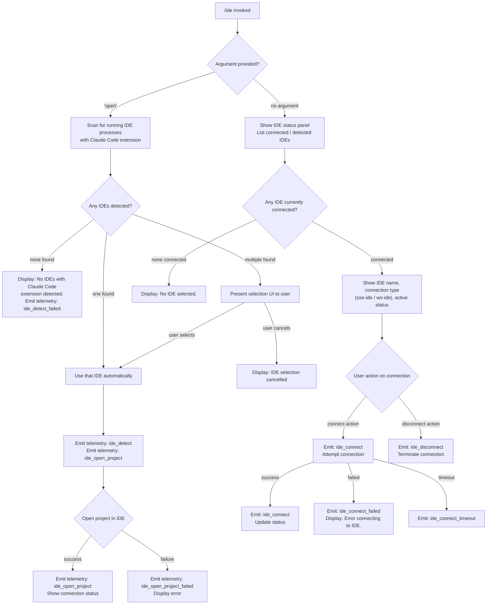

# `/ide`

> Analysis basis: CC v2.1.186 bundle.js (AST extraction + Claude interpretation)
> Minimum version: v2.1.186

---

## Overview

The `/ide` command manages IDE integrations for Claude Code, allowing the user to detect connected IDEs, view current connection status, and optionally open the current project in a detected or selected IDE. When invoked with the `open` sub-command argument, it attempts to locate a running IDE process with the Claude Code extension installed, establish a connection, and instruct that IDE to open the active project path.

---

## Registration

| Field | Value |
|---|---|
| type | `local-jsx` |
| name | `ide` |
| description | `Manage IDE integrations and show status` |
| argumentHint | `[open]` |
| module_id | `B_l` |
| load_inline | `true` |
| loc_byte | `11702629` |
| loc_byte_end | `11702785` |
| loc_line | `7293` |
| arbor_handler.name | `eof` |
| arbor_handler.fqn | `claude-2.1.186::eof` |
| arbor_handler.kind | `AsyncFunction` |
| arbor_handler.resolution_path | `module_id` |
| arbor_handler.n_hits | `0` |

Analysis basis: CC v2.1.186 bundle.js:+11702629

---

## Input Branching

The command exhibits 4+ distinct paths depending on: whether any IDEs are detected, whether the `open` sub-command is supplied, whether an IDE connection succeeds, and various error conditions. A Mermaid flowchart is used below.



Analysis basis: CC v2.1.186 bundle.js:+11698824 (handler entry `eof`), +11699039, +11699101, +11699194, +11699216, +11699259

---

## Behavioral Spec

### Top-level Handler (`eof`)

The primary handler is the async function `eof` (resolved via Arbor, `module_id` path from `B_l`).

```
async function ideCommandHandler(args, context):
    emit telemetry("tengu_ext_ide_command")           // always fires on entry

    subcommand = args[0]                              // e.g. "open" or undefined

    if subcommand == "open":
        return await openIDEFlow(context)
    else:
        return renderIDEStatusPanel(context)
```

Analysis basis: CC v2.1.186 bundle.js:+11698824, +11698932, +11698946, +11698970

---

### IDE Detection (`qRn` → process-scanning subsystem)

When the `open` path is taken, the handler calls into the IDE detection subsystem. Detection works by:

1. Enumerating candidate IDE socket or process paths (platform-aware: WSL paths under `/mnt/c/Users` are considered, and home-directory paths).
2. On Linux, running a shell process-list query matching editor names including `code`, `cursor`, `windsurf`, `devin-desktop`, IntelliJ-family IDEs (`idea`, `pycharm`, `webstorm`, `phpstorm`, etc.), and others.
3. Normalizing detected names (case-insensitive): recognized IDE variants include `windsurf`, `devin`, `cursor`, `insiders`, `vscode`, `vs code`, `visual studio code`, `vscodium`, `code - oss`, `codium`, `appcode`, and the JetBrains family.
4. Filtering out system/public user directories (`Public`, `Default`, `Default User`, `All Users`).
5. Deduplicating discovered paths using a `Set`.

```
async function detectIDEs(platform):
    candidates = []

    if platform == "wsl":
        candidates += scanWindowsUserPaths("/mnt/c/Users")
    
    candidates += scanHomeDirSocketPaths()

    if platform == "linux":
        processListOutput = shell("ps aux | grep -E '...'")
        candidates += parseProcessList(processListOutput)

    results = await Promise.all(candidates.map(resolveIDE))
    return deduplicate(results)
```

Analysis basis: CC v2.1.186 bundle.js:+6679143, +6679192, +6675612, +6676851, +6676928, +6677149, +6683908, +6682008–6682240

---

### IDE Name Normalization (`Jsa`, `VRn`, `Zw`)

After detection, the raw process or path name is normalized to a canonical IDE identifier:

```
function normalizeIDEName(rawName):
    lower = rawName.toLowerCase()
    
    if lower includes "windsurf":  return "windsurf"
    if lower includes "devin":     return "devin"
    if lower includes "cursor":    return "cursor"
    if lower includes "insiders":  return "insiders"
    if lower includes "vscode" or "vs code" or "visual studio code": return "vscode"
    if lower includes "vscodium" or "code - oss" or "codium":        return "vscodium"
    if lower includes "appcode" or jetbrains family names:           return "jetbrains"
    
    // Basename fallback for path-based detection
    return path.basename(rawName)
```

On Windows/WSL, `.cmd` suffix is stripped from executable names.

Analysis basis: CC v2.1.186 bundle.js:+6681978, +6682421, +6684802, +6682008–6682591

---

### IDE Open Project Flow (`eof` → `ide_open_project` telemetry path)

After an IDE is identified:

```
async function openProjectInIDE(ideDescriptor, context):
    emit telemetry("ide_open_project", {
        type: isWorktree ? "worktree" : "project"
    })

    try:
        result = await invokeIDEOpenCommand(ideDescriptor, projectPath)
        if not result:
            emit telemetry("ide_open_project_failed")
            display("Exited without opening IDE")
            return
        display success status
    catch error:
        emit telemetry("ide_open_project_failed")
        display error detail
```

Analysis basis: CC v2.1.186 bundle.js:+11699356, +11699393, +11699404, +11699466, +11699756

---

### Connection Management UI (`$_l` — JSX component)

The status/connection panel is a JSX component (`$_l`) rendered when no `open` argument is given. It uses React hooks: `useState`, `useRef`, `useEffect`, `useCallback`.

Key behaviors:
- Reads current IDE connection state from app state via `useAppState` (function `Ht`/`Ho`).
- Detects active connection type from transport prefix: `sse-ide` (Server-Sent Events) or `ws-ide` (WebSocket).
- Iterates over `mcp__ide__`-prefixed tool registrations to list IDE-provided capabilities.
- Shows connection status as one of: `pending`, `connected`, `ide_connect_failed`, `ide_connect_timeout`.
- Displays "Error connecting to IDE." on failure (literal at +11701168).
- Dispatches `ide_disconnect` telemetry event on disconnection action.
- Initiates connection attempt emitting `ide_connect` on success and `ide_connect_failed` / `ide_connect_timeout` on failure paths.
- Shows prompt "restart your IDE" as a recovery hint when connection fails (literal at +11700025).

```
function IDEStatusPanel(props):
    [connectionState, setConnectionState] = useState(null)
    appState = useAppState()
    ideRef = useRef()

    useEffect(() => {
        detectAndSubscribeToIDEConnection()
    }, [])

    useCallback(connectAction, () => {
        emit telemetry("ide_connect")
        attempt connection via transport (sse-ide or ws-ide)
        on success: update state
        on failure: emit("ide_connect_failed") or emit("ide_connect_timeout")
    })

    if connectionState starts with "ws:":
        transport = "ws-ide"
    else:
        transport = "sse-ide"

    render status panel with IDE name, transport type, capabilities list
```

Analysis basis: CC v2.1.186 bundle.js:+11700639, +11700710, +11700717, +11700731, +11700812, +11700853, +11700856, +11700926, +11700943, +11701050, +11701138, +11701168, +11701299, +11701446, +11701549, +11701653, +11701666

---

### Background Session Integration (`oCo` → `f` daemon-session handler)

The `/ide` command also touches the background-session daemon layer. When a new IDE connection is established, a daemon background session may be created or claimed for the IDE context:

```
function manageIDEDaemonSession(ideSockets, config):
    // Normalize socket list (NFC normalization, Math.floor for count)
    normalizedSockets = ideSockets.map(normalize)    // NFC at +11702212
    
    // Show truncated list if more than 3 sockets (literals: 3 at +11702144)
    if normalizedSockets.length > 3:
        display(first3 + ", …")                      // literal at +11702383
    else:
        display(normalizedSockets.join(", "))        // literal at +11702369

    // Attempt to claim or spawn background session
    claimOrSpawnSession(normalizedSockets, config)
```

The session management subsystem (`f`) handles states: `claimed`, `spawned`, `spare`, `idle`, `blocked`, `working`, `bg`, `daemon`, `enoent`, `econnrefused`.

Analysis basis: CC v2.1.186 bundle.js:+11702107, +11702114, +11702144, +11702175, +11702200, +11702212, +11702221, +11702239, +11702261, +11702287, +11702346, +11702369, +11702383

---

## State & Side Effects

| Item | Detail |
|---|---|
| Telemetry: `tengu_ext_ide_command` | Fired on every invocation of `/ide` (bundle.js:+11698826) |
| Telemetry: `ide_detect` | Fired when IDE detection succeeds (bundle.js:+6680498) |
| Telemetry: `ide_detect_failed` | Fired when no IDE is found (bundle.js:+6680562) |
| Telemetry: `ide_open_project` | Fired when attempting to open the project in the IDE (bundle.js:+11699359) |
| Telemetry: `ide_open_project_failed` | Fired when project-open fails (bundle.js:+11699466) |
| Telemetry: `ide_connect` | Fired on connection attempt (bundle.js:+11700856) |
| Telemetry: `ide_connect_failed` | Fired on connection failure (bundle.js:+11700943) |
| Telemetry: `ide_connect_timeout` | Fired on connection timeout (bundle.js:+11701050) |
| Telemetry: `ide_disconnect` | Fired on explicit disconnection (bundle.js:+11701549) |
| Telemetry: `tengu_feature_ok` / `tengu_feature_bad` / `tengu_feature_sad` | Feature gate events used by connection sub-path (bundle.js:+1024705, +1024772, +1024853) |
| Telemetry: `tengu_bg_sendclaim_failed` | Background session claim failure (bundle.js:+17133905) |
| Telemetry: `tengu_bg_spare_claim` / `tengu_bg_spare_claim_fail` | Spare session lifecycle (bundle.js:+17159052, +17159318) |
| appState changes | IDE connection state written via `useAppState`/`useSetAppState`; read by `Ht`/`Ho` hooks |
| MCP tool namespace | Tools prefixed `mcp__ide__` are listed in the status panel (bundle.js:+11701446) |
| Transport types | `sse-ide` (SSE transport) or `ws-ide` (WebSocket transport) registered as IDE channels (bundle.js:+11696865, +11696885) |
| Background session | May create/claim a daemon background session linked to the IDE socket |
| Hook: `onInstallIDEExtension` | Called during the `open` flow to trigger IDE extension installation check (bundle.js:+11699933) |
| Sound | None detected in traversal |

---

## Version History

| Version | Change |
|---|---|
| v2.1.186 | Initial analysis |

---

## Common Mistakes

1. **Running `/ide open` without an IDE that has the Claude Code extension installed** — the command will scan for running IDE processes but will report "No IDEs with Claude Code extension detected." if none match; install the extension first.
2. **Expecting `/ide` to connect automatically** — without the `open` argument, the command only displays current connection status; it does not initiate a new connection automatically.
3. **Multiple IDEs detected** — when more than one compatible IDE is running, the command presents a selection UI; typing before the prompt appears may cause the selection to be skipped and "IDE selection cancelled" to be shown.
4. **WSL users forgetting path mapping** — detection on WSL searches under `/mnt/c/Users` for Windows-side IDE sockets; if the IDE is running purely on the Linux side, the WSL path branch may not locate it.
5. **Confusing `sse-ide` vs `ws-ide` transports** — the status panel shows which transport is active; connection failures on one transport type do not automatically fall back to the other.
6. **Ignoring the "restart your IDE" hint** — on persistent `ide_connect_failed` events, the recovery action is to restart the IDE so the extension re-registers its socket; Claude Code does not attempt to restart the IDE on its own.

---

## Appendix — Identifier Mapping

> For bundle debugging only. Identifiers change across versions.

| Identifier | Role |
|---|---|
| `eof` | Primary async handler for `/ide` command (Arbor-resolved, `module_id` path) |
| `oCo` | Background-session socket list normalizer and display formatter |
| `Ot` | App-state / context accessor utility |
| `hrn` | Async store getter (calls `mrn.getStore`) |
| `YV` | Secondary value accessor in store lookup |
| `gr` | UI rendering helper (calls `GL`) |
| `GL` | Low-level render primitive |
| `Ts` | Process-exit / shutdown coordinator (calls `process.exit`) |
| `Kb` | Forced-shutdown initiator (`"forced shutdown"` literal) |
| `ke` | Feature-gate checker (`tengu_feature_ok`) |
| `Pe` | Feature-gate result handler (`KVe`) |
| `xe` | Feature-gate bad-path handler (`tengu_feature_bad`) |
| `gU` | Daemon control event emitter (`tengu_daemon_control`) |
| `F9` | Daemon control helper (`T2`) |
| `o$e` | First-party session tagger (`"firstParty"` literal) |
| `x2r` | Session UUID generator and emitter (`k2r.randomUUID`) |
| `j6` | Shutdown race coordinator (`Promise.race`, `Promise.all`) |
| `wme` | MCP server shutdown caller (`vme.shutdown`) |
| `Nme` | Timeout clearer during shutdown (`clearTimeout`, `AOo`) |
| `Bn` | Abort/timeout promise factory (`"aborted"`, `"abort"` literals) |
| `f` | Background-session manager (spawns, claims, kills daemon sessions) |
| `D` | IDE daemon session orchestrator (coordinates detection, connection, roster) |
| `grt` | IDE process/socket reader (`t.readFile`, `"utf-8"`) |
| `zhe` | Socket path resolver (`Ewn.join`) |
| `zo` | Error category mapper (`mn`) |
| `Re` | Error logger/reporter (`VJ.logError`, `"error"` literal) |
| `T` | Output formatter/colorizer (`t.toUpperCase`, `Lc`) |
| `De` | JSON serializer wrapper (`JSON.stringify`) |
| `s1` | Text trimmer/parser for socket entries (`e.trim`, `qRd`) |
| `d` | Socket-watcher and supervisor runner (`"supervisor"`, `"heartbeat"` literals) |
| `W8e` | File existence / stat checker (`d$l.stat`, `i.isFile`) |
| `p$l` | Column-width formatter for socket table (`Math.max`, `z_`) |
| `E` | Spinner/animation stop controller (`yUt`, `N_t`) |
| `A` | Scroll/viewport controller (`Math.max`, `Math.min`) |
| `Syc` | Heartbeat setup helper (`zse`) |
| `I` | Input/keyboard handler for the IDE panel (`x.preventDefault`) |
| `_Q` | Command-execution wrapper (`Cfe`) |
| `Cfe` | Shell command runner with timeout (`doe`, `t.trim`, `1000` ms literal) |
| `NPt` | `.claude` directory and config-file writer (`ywn.mkdir`, `Ewn.join`, `".claude"`) |
| `jl` | Path join helper (`GL`) |
| `PBi` | Roster entry filter (`hrt`) |
| `hrt` | Date/time parser for roster entries (`r.getTime`) |
| `H` | IPC daemon socket connection handler (buffer concat, ETOOLARGE) |
| `g` | Socket read-timeout helper (`r.setTimeout`) |
| `m` | Process-kill enumerator (`n.values`, `x.kill`) |
| `fp` | Socket frame writer (`e.end`, `De`) |
| `bYf` | Full daemon protocol message dispatcher (ping, reply, exec, kill, resize, attach, etc.) |
| `Ae` | String coercer (`String`) |
| `x` | IDE file-change watcher (`Tyc`, `ip`, `"mtime changed"` literal) |
| `Tyc` | Realpath + stat resolver (`Rrr.realpath`, `Rrr.stat`) |
| `ip` | Path input processor |
| `GYf` | File-watcher attach helper (`A2n`) |
| `V` | Watcher registry |
| `Mdc` | Scheduled-task metadata builder (`kD`, `Math.max`) |
| `kD` | Cron-expression parser (`parseInt`, date UTC methods) |
| `uae` | Session roster updater (`grt`, `NPt`) |
| `QV` | Known-set membership tester (`t.has`) |
| `IXn` | macOS memory monitor (`"macos"` literal, `Kt`) |
| `it` | Tool-call dispatcher (`ORt`, `NRt`, `$9`) |
| `JEn` | Tool-call dedup gate (`P2r.has`, `OIe.get`) |
| `wt` | Telemetry event recorder (`Date.now`, `Lxf`) |
| `D2e` | Pins-file manager (`"pins.json"`, `hb.lstat`) |
| `dDt` | Pins directory path builder (`ay.join`) |
| `Wk` | Workspace root resolver (`ay.join`, `or`) |
| `Bt` | JSON parser wrapper (`JSON.parse`) |
| `kn` | Filesystem error normalizer (`mn`) |
| `mn` | Base error constructor/normalizer |
| `YTd` | Directory file enumerator (`hb.readdir`, `hb.lstat`) |
| `o` | Padded label formatter (`i.padEnd`, `"  "` literal) |
| `KOi` | Directory creator helper (`hb.mkdir`, `ay.dirname`) |
| `Xf` | File-type checker and logger (`sOe.has`, `T`) |
| `N` | Permission-classifier subsystem entry (`Zut`, `J5`) |
| `Zut` | Classifier orchestrator (`Ado`, `y9t`) |
| `y9t` | Per-turn classifier runner (handles `allow`/`deny`/`classify`/`ask`) |
| `J5` | Rule-set evaluator (`zc`, `bit`, `IA`) |
| `zc` | Rule-cache lookup (`Kt`, `Lpe`) |
| `bit` | Rule bytecode executor (`rC`, `zc`) |
| `IA` | Rule action resolver (`el`) |
| `ot` | String coercer for rule output (`String`) |
| `Zpt` | Rule stack frame |
| `o_o` | Rule operand resolver (`rZa`, `to`) |
| `s_o` | Rule step executor (`c1`, `Rpt`, `to`) |
| `RD` | Provider capability resolver (`qPt`, `T`, `br`, `Su`) |
| `$Bo` | Background-session socket claim and connect handler (`lV.claim`, `vrr.connect`) |
| `MOo` | Background-session config file writer (`cV.writeFile`, `JSON.stringify`, `448`/`384` permission literals) |
| `JWt` | Socket path builder helper (`Wh.join`, `XWt`) |
| `XWt` | Auth-token path builder (`Wh.join`, `dne`, `"auth"`) |
| `pYf` | Socket connection with timeout (`Date.now`, `5000` ms timeout, `"send-claim timeout"`) |
| `fYf` | Low-level socket connector (`vrr.connect`, `o.once`) |
| `dYf` | Claim frame builder (`lV.buildClaimFrame`) |
| `Jd` | Error formatter (`mn`) |
| `gR` | Binary frame encoder (`Buffer.from`, `Buffer.allocUnsafe`, `n.writeUInt32BE`) |
| `KBo` | Full background-session lifecycle manager (spawn, kill, roster, file-watch) |
| `ec` | Job-directory path builder (`ay.join`, `Wk`) |
| `Oi` | Roster-file reader and state parser (`GZ.get/set/delete/clear`, `"unknown"`, `"order"`, `"stateOrder"`) |
| `a` | App-state accessor for IDE panel (`Z3e`, `arr`, `maa`, `s.get`) |
| `fg` | Session-state classifier (`g0`, `"active"` literal) |
| `g0` | Active-state detector (`Uie`) |
| `ive` | Ignore-list / gitignore-style pattern matcher (`d4.has`, `lDt.has`, `x2e.has`) |
| `c` | Background-task runner (`bn`) |
| `VTd` | Pattern matcher variant (`qTd.has`, `n.set`, `t.filter`) |
| `kd` | Job-directory writer (`Tm`, `ay.join`, `De`) |
| `Tm` | Atomic file writer (`s_r.randomBytes`, `xK.writeFile`, `xK.rename`, `"hex"`) |
| `ly` | Roster-cache invalidator (`GZ.delete`) |
| `jmt` | Roster persistence watcher (`$q`, `Cnf`, `Date.now`) |
| `$q` | Roster file validator and reader (`pue.lstat`, `pne`, `"is not a regular file — removing"`) |
| `Cnf` | Roster directory creator and atomic writer (`pue.mkdir`, `HHl.dirname`, `Tm`) |
| `QWt` | Socket-path lister (`Wh.join`, `XWt`) |
| `dye` | PTY-PID path builder (`Wh.join`, `WWe`, `"pty-pids"`) |
| `WWe` | PTY-PID directory helper (`Wh.join`, `uye`) |
| `yR` | Late-PID path handler (`pHl`, `"late"`) |
| `pHl` | PTY path splitter (`Kt`, `Wh.join`, `WWe`, `e.split`) |
| `nN` | PTY-watcher initializer (`Kt`, `RIo`, `Wh.join`, `zmt`, `"pty"`) |
| `RIo` | PTY watcher root (`Anf`) |
| `zmt` | PTY socket path builder (`Wh.join`, `dne`) |
| `rM` | Late-PTY path resolver (`pHl`) |
| `$` | Disposable resource handle |
| `hm` | App-state selector |
| `qRn` | IDE detection orchestrator (platform detection, process scanning, normalization) |
| `GRn` | Multi-path IDE scanner (`OVd`, `Promise.all`) |
| `OVd` | Single IDE candidate resolver (WSL paths, home dir, stat, realpath) |
| `DVd` | IDE display-name builder (`zkr`) |
| `zkr` | IDE name normalizer (`String`, `parseInt`, `isNaN`) |
| `$r` | IDE open command executor (`R1e`, `ip`, `fsu`) |
| `BMi` | IDE name pattern matcher (`e.match`) |
| `_` | MCP server capability enumerator (`N_t`, `BD`, `xx`) |
| `N_t` | MCP server method index builder (`JHc`) |
| `JHc` | MCP method key enumerator (`Object.keys`) |
| `ao` | Base error factory (`Error`, `String`) |
| `jsa` | Process signal sender (`process.kill`, `"ide"` literal context) |
| `Qsa` | IDE name display formatter (`e.replace`, `"Devin Desktop"`) |
| `Zw` | IDE type classifier from process name (`e.toLowerCase`, `FD.basename`, `P3e`) |
| `fi` | String slicer utility (`e.indexOf`, `e.slice`) |
| `Mt` | Telemetry emitter for detection results (`W`, `Pe`, `"ide_detect"`) |
| `Jsa` | IDE name inclusion tester (`e.toLowerCase`, `t.includes`) |
| `VRn` | IDE variant classifier (`t.toLowerCase`, `GVd`, `FD.basename`, `"codium"`, `".cmd"`) |
| `On` | IDE open-command builder (`$r`, `Ot`) |
| `tJr` | Installed IDE capability enumerator (`qVd`) |
| `qVd` | IDE tool/capability lister (`OC`, `Object.entries`, `"IDE"`) |
| `OC` | MCP connection accessor (`R1e`) |
| `R1e` | Core MCP client class (connect, disconnect, list tools/resources — `Hss`, `K_r`, `z_r`, etc.) |
| `wee` | IDE extension install-hint display |
| `jrf` | JSX fragment for filter/display of IDE options |
| `$_l` | JSX component for IDE status/connection panel |
| `Ht` | `useAppState` hook implementation (`G5r`) |
| `G5r` | AppState context reader (`BCe.useContext`, `BCe.useSyncExternalStore`) |
| `Ho` | `useAppState` variant hook (`G5r`) |
| `md` | Ink/terminal context accessor (`ihe.useContext`, `ihe.useMemo`) |
| `WT` | MCP skill watcher (`eit`, `o.cleanup`, `Qw`) |
| `eit` | MCP tool-hash computer (`ELe`) |
| `ELe` | Canonical hash builder (`De`, `Array.isArray`, `foa.createHash`, `"sha256"`) |
| `Qw` | MCP skills telemetry emitter (`it`, `"tengu_mcp_skills"`) |

---

Note: index built via Arbor fallback; some signals (telemetry, literals) may be missing — see arbor-fallback.js.