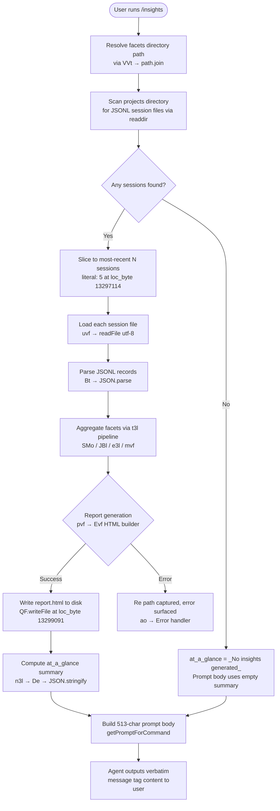

# `/insights`

> Analysis basis: CC v2.1.186 bundle.js (AST extraction + Claude interpretation)
> Minimum version: v2.1.186

---

## Overview

`/insights` generates an HTML usage-analytics report by scanning the user's Claude Code session data (JSONL transcripts and facet metadata), aggregates statistics across sessions, writes the report to disk, and instructs the agent to announce the result to the user via a fixed verbatim message. The command's entire user-visible output is pre-composed by the handler and delivered through a `<message>` tag template; the model has no latitude to paraphrase or omit lines.

---

## Registration

| Field | Value |
|---|---|
| `type` | `prompt` |
| `name` | `insights` |
| `description` | `Generate a report analyzing your Claude Code sessions` |
| `loc_byte` | `13309874` |
| `loc_byte_end` | `13311178` |
| `loc_line` | `9983` |
| `handler_method` | `getPromptForCommand` |
| `handler_method_start` | `13310048` |
| `handler_method_end` | `13311177` |
| `prompt_body.length` | `513` characters |
| `prompt_body.trace` | `call→n3l(...) (1 literals)` |
| `arbor_handler.name` | `getPromptForCommand` |
| `arbor_handler.fqn` | `claude-2.1.186::getPromptForCommand` |
| `arbor_handler.kind` | `Method` |
| `arbor_handler.resolution_path` | `direct` |
| `arbor_handler.n_hits` | `1` |

Analysis basis: CC v2.1.186 bundle.js:+13309874

---

## Input Branching

The handler follows four or more distinct paths depending on data availability, session count, and report generation success. A Mermaid flowchart is used.



---

## Behavioral Spec

### 1. Path Resolution

The handler derives the base data directory by calling the path-join helper (`VVt`) with a `"usage-data"` segment (bundle.js:+13235640) and a `"session-meta"` segment (bundle.js:+13235736). A further `"facets"` subdirectory (bundle.js:+13235690) is derived for facet JSON storage.

```
function resolveInsightsPaths(baseDir):
    usageDataDir  = pathJoin(baseDir, "usage-data")
    sessionMetaDir = pathJoin(usageDataDir, "session-meta")
    facetsDir     = pathJoin(usageDataDir, "facets")
    return { usageDataDir, sessionMetaDir, facetsDir }
```

Analysis basis: CC v2.1.186 bundle.js:+13235627

---

### 2. Session Discovery (`scanSessions`)

The session scanner (`Avf`) calls `fs.readdir` on the projects directory (bundle.js:+13296433), filters for directory entries via `isDirectory` (bundle.js:+13296501), then for each project subdirectory lists `.jsonl` files via the file-metadata helper (`rHt`, bundle.js:+13296591) which calls `fs.readdir` again (bundle.js:+13394064) and retains only `.jsonl`-suffixed files (literal `".jsonl"` at bundle.js:+13394170). File stats are gathered via `fs.stat` (bundle.js:+13394373) and stored in a Map. Results are sorted (bundle.js:+13296737) and the scan uses `setImmediate`-based yielding (bundle.js:+13296713) with concurrency limits (literals `10` and `9` at bundle.js:+13296683/+13296688; batch sizes `50` and `200` at bundle.js:+13296825/+13296830).

```
async function scanSessions(projectsRoot):
    entries = await fs.readdir(projectsRoot)
    dirs    = entries.filter(e => e.isDirectory())
    sessions = []
    for dir in dirs (batched, concurrency=10):
        files = await fs.readdir(pathJoin(projectsRoot, dir))
        jsonlFiles = files.filter(f => f.endsWith(".jsonl") AND f.isFile())
        for f in jsonlFiles:
            stat = await fs.stat(pathJoin(projectsRoot, dir, f))
            sessions.push({ path, stat })
        yield via setImmediate every 9 items
    sessions.sort(byMtime descending)
    return sessions
```

Analysis basis: CC v2.1.186 bundle.js:+13296414

---

### 3. Session Loading (`loadSession`)

Each of the most-recent sessions (up to 5 per invocation, literal at bundle.js:+13297114) is loaded by `uvf`, which path-joins the session file, reads it as UTF-8 (literal `"utf-8"` at bundle.js:+13241789), calls `JSON.parse` via `Bt` (bundle.js:+13241810), and forwards through the `QBl` validator (bundle.js:+13241806).

```
async function loadSession(sessionPath):
    raw  = await fs.readFile(sessionPath, "utf-8")
    data = safeJsonParse(raw)   // Bt → JSON.parse
    validated = validateSessionSchema(data)  // QBl
    return validated
```

Analysis basis: CC v2.1.186 bundle.js:+13241765

---

### 4. Facet Aggregation Pipeline (`aggregateFacets`)

The core aggregation function `t3l` drives the full pipeline:

1. **Load existing facet cache** — `lvf` reads a previously persisted JSON facet file and falls back gracefully if missing (`QF.unlink` cleanup at bundle.js:+13241457).
2. **Process JSONL records** — `SMo` calls `JBl` per session record, classifying tool use (`"tool_use"` literal at bundle.js:+13236219), detecting MCP prefixes (`"mcp__"` at bundle.js:+13236312), counting web search/fetch operations (`"WebSearch"` / `"WebFetch"` at bundle.js:+13236333/+13236357), edit/write operations (`"Edit"` / `"Write"` at bundle.js:+13236464/+13236476), git operations (`"git commit"` / `"git push"` at bundle.js:+13236720/+13236752), exit codes, rejections, and error categories.
3. **Statistical computation** — `e3l` computes medians, sort-based percentiles, and floor/round arithmetic (bundle.js:+13247578/+13247757).
4. **Histogram bucketing** — `ZBl` handles time-bucket membership with a 30-minute window (literal `1800000` ms at bundle.js:+13244213) and finite-number guards.
5. **Warm-up classification** — records tagged `"warmup_minimal"` (bundle.js:+13298621) are segregated from primary session data.
6. **Write facets to disk** — `dvf` creates the facets directory via `QF.mkdir` (bundle.js:+13242306) and writes JSON (384-byte target, literal at bundle.js:+13242438) via `QF.writeFile`.
7. **Write session-meta cache** — `cvf` mirrors the process for the `"session-meta"` subdirectory (bundle.js:+13241549).

```
async function aggregateFacets(sessions, paths):
    existing = await loadFacetCache(paths.facetsDir)   // lvf
    facets   = mergeFacetCache(existing)
    for session in sessions:
        records = parseJsonlRecords(session)           // SMo → JBl
        for record in records:
            classifyToolUse(record, facets)
            classifyErrors(record, facets)
            bucketResponseTime(record, facets)         // ZBl
    stats = computeStatistics(facets)                  // e3l
    await writeFacets(paths.facetsDir, stats)          // dvf
    await writeSessionMeta(paths.sessionMetaDir, stats)// cvf
    return stats
```

Analysis basis: CC v2.1.186 bundle.js:+13296879

---

### 5. HTML Report Generation (`buildHtmlReport`)

`pvf` orchestrates report generation. It calls `avf` → `ovf` to collect the batched, paginated session data (batch size `8`, literal at bundle.js:+13239921; max rows `300` at bundle.js:+13240475; timeouts `30000`/`25000` ms at bundle.js:+13240978/+13240999). `Evf` then renders the full HTML document:

- **Text sanitisation** — `Kd` → `Pl` escapes HTML entities (`&amp;`, `&lt;`, `&gt;`, `&quot;`, `&apos;` at bundle.js:+5270413–5270536).
- **Markdown-to-HTML** — `Evf` converts bold markers to `<strong>$1</strong>` (bundle.js:+13254682), bullets to `"• "` (bundle.js:+13254725), and line breaks to `<br>` (bundle.js:+13254755).
- **Chart colours** — fixed palette: `#2563eb` (bundle.js:+13290641), `#0891b2` (bundle.js:+13290779), `#10b981` (bundle.js:+13290951), `#8b5cf6` (bundle.js:+13291094), `#dc2626` (bundle.js:+13294357), `#16a34a` (bundle.js:+13294606), `#eab308` (bundle.js:+13295099).
- **Response-time buckets** — labelled `"2-10s"`, `"10-30s"`, `"30s-1m"`, `"1-2m"`, `"2-5m"`, `"5-15m"`, `">15m"` (bundle.js:+13252976–13253036); thresholds include `120` s and `900` s (bundle.js:+13253196/+13253278).
- **Time-of-day buckets** — `"Morning (6-12)"`, `"Afternoon (12-18)"`, `"Evening (18-24)"`, `"Night (0-6)"` (bundle.js:+13253824–13253977).
- **Max token budget for report body** — `8192` (bundle.js:+13252145).
- **Output path** — filename `"report.html"` (bundle.js:+13299063) written via `QF.writeFile` (bundle.js:+13299091).
- **"Add to CLAUDE.md" section label** — literal `"Add to CLAUDE.md"` (bundle.js:+13258320).
- **Empty-state placeholders** — `"<p class=\"empty\">No data</p>"` (bundle.js:+13252467), `"<p class=\"empty\">No response time data</p>"` (bundle.js:+13252924), `"<p class=\"empty\">No tool errors</p>"` (bundle.js:+13294368), `"<p class=\"empty\">No time data</p>"` (bundle.js:+13253774).

```
async function buildHtmlReport(facets, paths):
    rows    = await collectSessionRows(facets)      // avf → ovf (batch=8)
    html    = renderHtmlDocument(rows, facets)      // Evf
    outPath = pathJoin(paths.outputDir, "report.html")
    await fs.writeFile(outPath, html, "utf-8")
    return { url: outPath, htmlFile: outPath, facetsDir: paths.facetsDir }
```

Analysis basis: CC v2.1.186 bundle.js:+13243455

---

### 6. At-a-Glance Summary and Prompt Construction (`getPromptForCommand`)

After all disk work completes, the handler:

1. Computes `Math.round`-based summary metrics (bundle.js:+13310435).
2. Calls `n3l` with the collected data to interpolate the at-a-glance object (bundle.js:+13311080); uses `De` → `JSON.stringify` (bundle.js:+13311098) for serialisation.
3. Resolves the report directory path via `XXn` (bundle.js:+13311144).
4. If no sessions were found or generation failed, the summary defaults to the literal `"_No insights generated_"` (bundle.js:+13310945).
5. Constructs the 513-character prompt body containing: the full insights data payload, the report URL, HTML file path, facets directory path, the at-a-glance summary (marked as for-model context only), and a verbatim `<message>` block that the agent must output without modification.

The prompt body instructs the model: *"Output the text between `<message>` tags verbatim as your entire response. Do not omit any line."* The `<message>` block announces that the report is ready and offers to dig into any section.

```
function getPromptForCommand(sessionData, reportPaths):
    summary = computeAtAGlance(sessionData)          // Math.round + n3l
    if summary is empty:
        summary = "_No insights generated_"
    prompt  = buildPromptBody({
        insightsData  : JSON.stringify(sessionData), // De
        reportUrl     : reportPaths.url,
        htmlFile      : reportPaths.htmlFile,
        facetsDir     : reportPaths.facetsDir,
        atAGlance     : summary,                     // model-only context
        messageBlock  : verbatimUserMessage,
    })
    return prompt  // 513 chars
```

Analysis basis: CC v2.1.186 bundle.js:+13310048

---

## State & Side Effects

| Item | Detail |
|---|---|
| **Files written** | `report.html` (HTML report) via `QF.writeFile` (bundle.js:+13299091); facet JSON in `usage-data/facets/` via `dvf` (bundle.js:+13242387); session-meta JSON in `usage-data/session-meta/` via `cvf` (bundle.js:+13241637) |
| **Directories created** | `usage-data/facets/` and `usage-data/session-meta/` created with `QF.mkdir` if absent (bundle.js:+13242306, +13241549) |
| **Telemetry** | `tengu_transcript_phantom_parent` (bundle.js:+13379369); `tengu_relink_walk_broken` (bundle.js:+13358402); `tengu_transcript_parent_cycle` (bundle.js:+13383289); `tengu_chain_parent_cycle` (bundle.js:+13360179); `tengu_chain_timestamp_fallback` (bundle.js:+13360328); `tengu_chain_parallel_tr_recovered` (bundle.js:+13362194) — all fired during transcript/chain processing. Infrastructure-level events also reachable: `tengu_mcp_skills`, `tengu_daemon_config_reload`, `tengu_daemon_idle_exit`, `tengu_daemon_control`, `tengu_scheduled_task_fire`, `tengu_scheduled_task_expired`, `tengu_bg_*` family |
| **appState changes** | None directly; existing MCP state (reached via `Z3e` / `q2o`) may be read but is not mutated by the insights handler itself |
| **Sound** | None |
| **Network** | None — entirely local file I/O |
| **Session files read** | Up to 5 most-recent `.jsonl` sessions (literal `5` at bundle.js:+13297114) |
| **Concurrency** | Session scan uses concurrency limit of `10` / batch of `9` items with `setImmediate` yielding (bundle.js:+13296683–13296713) |

---

## Version History

| Version | Change |
|---|---|
| v2.1.186 | Initial analysis |

---

## Common Mistakes

1. **Running `/insights` with no prior sessions** — If no `.jsonl` session files exist under the projects directory, the at-a-glance summary will be `"_No insights generated_"` and the report will contain only empty-state placeholders. No error is raised; the agent still delivers the verbatim message block.
2. **Expecting editable output** — The agent's response is entirely dictated by the `<message>` tag template. The model is explicitly instructed not to paraphrase or omit lines; any follow-up customisation requires a second turn.
3. **Mistaking the at-a-glance summary for user output** — The prompt marks the at-a-glance block as "for your context only — the user has not seen any output yet." It is injected for model reasoning, not displayed directly.
4. **Assuming all sessions are analysed** — Only the 5 most-recent sessions are loaded per invocation (bundle.js:+13297114). Older sessions may be reflected in the cached facets from a prior run but not freshly parsed.
5. **Expecting a live URL** — The `Report URL` in the prompt is a local filesystem path to `report.html`, not an HTTP URL. Opening it requires a browser pointed at the local file.
6. **Calling `/insights` in a directory with no Claude Code data** — The scanner looks for `.jsonl` files in the Claude Code projects directory, not the current working directory. Running from an unrelated directory will yield an empty report.

---

## Appendix — Identifier Mapping

> For bundle debugging only. Identifiers change across versions.

| Identifier | Role |
|---|---|
| `__handler_insights` | Synthetic BFS entry point for the `/insights` command handler |
| `t3l` | Main facet-aggregation pipeline (drives all session processing) |
| `Avf` | Session directory scanner (readdir + filter + sort) |
| `n7` | Projects-root path helper (path.join + "projects") |
| `rHt` | Per-project JSONL file lister + stat collector |
| `wM` | JSONL filename pattern tester (hTc.test) |
| `T` | Generic type-classification / string-normalisation utility |
| `uvf` | Single-session file loader (readFile → JSON.parse) |
| `yMo` | Session-meta path resolver |
| `VVt` | Base data-directory path builder (path.join + "usage-data") |
| `QBl` | Session schema validator |
| `Bt` | Safe JSON parser (JSON.parse wrapper) |
| `Z3e` | MCP connection orchestrator (reached via `a.push`) |
| `TB` | MCP tool registry merger |
| `Xw` | MCP transport handler |
| `Wn` | General event emitter / notification helper |
| `fca` | MCP connection attempt scheduler |
| `X_n` | Auth-needed handler |
| `j_n` | MCP debug log emitter |
| `ln` | MCP debug log push helper |
| `wRn` | MCP retry/backoff controller |
| `SUt` | MCP connection state applier |
| `PXr` | MCP connection result processor |
| `Qw` | MCP skills telemetry emitter (tengu_mcp_skills) |
| `EXr` | MCP include-filter checker |
| `Wc` | MCP error log push helper |
| `Ae` | String coercion utility |
| `_ca` | MCP ZW-based cleanup helper |
| `nit` | Integer parser (parseInt wrapper, radix 3) |
| `Oxn` | Integer parser variant (parseInt wrapper, radix 20) |
| `arr` | MCP connection result applier |
| `Q3e` | MCP error status checker |
| `WT` | MCP cleanup/retirement coordinator |
| `maa` | MCP server address resolver (AJr) |
| `QNl` | Quota/rate-limit notifier |
| `q2o` | MCP per-slot connection manager |
| `fRn` | MCP capability flag checker (Q8d / wXr sets) |
| `Bn` | Abort-with-timeout helper |
| `eit` | MCP error initialiser (ELe) |
| `U` | Terminal write + timeout manager |
| `d` | Daemon supervisor/worker manager |
| `W8e` | File-read-with-size-limit helper (ENOENT / 1 MiB guard) |
| `p$l` | Column-width calculator for tabular output |
| `E` | Spinner stop/update helper |
| `A` | Scroll/view range calculator |
| `Syc` | Daemon heartbeat scheduler (zse) |
| `I` | Input event throttler / preventDefault handler |
| `W` | Generic write/flush utility |
| `JXn` | Session chain builder + facet map assembler |
| `Yle` | Full transcript-loading and chain-linking engine |
| `qvf` | Chain-link quick-validator |
| `M` | Timeout-controlled write queue |
| `M5` | Chain metadata extractor |
| `vJt` | JSON path-walker / deep-get utility |
| `DA` | Diff/apply helper |
| `c` | Background-session write controller (bn) |
| `g` | Socket timeout manager |
| `H` | Buffer stream line-parser (Buffer.concat / indexOf) |
| `y` | View-state renderer (v5e) |
| `_` | Agent lifecycle manager (BD / xx / Promise.all) |
| `u` | Transport connection handler (ke / xe / gU / j6) |
| `p` | Process-exit / abort handler (Kb / process.exit) |
| `f` | Background worker process manager (spawn / kill / freemem) |
| `qye` | Array-or-filter filter normaliser |
| `h` | Worker handle wrapper |
| `v` | View/scroll position tracker |
| `q` | Scheduled-task runner (UPt / Awn / rKf) |
| `L` | Background worker lifecycle sweeper (retire / respawn) |
| `ot` | String coercion (String wrapper) |
| `Hwf` | Binary JSONL reader (openSync / readSync / closeSync) |
| `_wf` | Fast binary file reader (openSync / readSync) |
| `v3l` | Session-chain relink walker |
| `gwf` | Buffer-based JSONL parser (indexOf / compare / subarray) |
| `$Ae` | Transport protocol negotiator (eiu / tiu / riu / niu) |
| `O` | Observable/stream wrapper |
| `zo` | Permission-error classifier (mn) |
| `Re` | Error logger (VJ.logError / Jje.push) |
| `te` | Session-set tracker |
| `ee` | Agent-update applier (applyMcpUpdate / q2o) |
| `z` | Keyboard backspace event handler |
| `X` | Terminal renderer (VWt / Zgl) |
| `K` | Output stream multiplexer (X.write / H.write) |
| `Q3l` | Facet-deduplication accumulator |
| `GHe` | Chain parent-resolution engine |
| `swf` | NaN-safe chain stat helper |
| `iwf` | Chain interleave/sort processor |
| `rwf` | Chain shift/ordering helper |
| `Vct` | Facet map transformer (e.map) |
| `JMo` | Prompt-text extractor (replaceAll / slice) |
| `dqt` | Record classifier (tool_result / text detection) |
| `ZMo` | Attachment/image filter |
| `awf` | Array-or-scalar trim checker |
| `lwf` | Array some-checker |
| `pJn` | Facet key getter/setter |
| `fJn` | Facet values collector (Array.from) |
| `nvf` | NaN-guard for numeric facets |
| `SMo` | Per-session record processor (JBl dispatcher) |
| `JBl` | Per-record tool/command classifier |
| `k` | Daemon-yield write helper |
| `qVt` | File-extension classifier |
| `tvf` | Extension extractor (path.extname) |
| `wwe` | Diff engine caller (E6i.diff) |
| `tu` | indexOf-based substring searcher |
| `x` | Terminal output / ANSI writer |
| `dh` | Duration/time formatter |
| `EMo` | Session-end event handler |
| `N` | Permission-classifier map (Zut / J5) |
| `Zut` | Permission check dispatcher (Ado / y9t) |
| `Ado` | Permission allowlist checker |
| `y9t` | Permission decision engine |
| `J5` | Policy rule evaluator (zc / bit / IA) |
| `zc` | Platform-specific policy adapter (windows) |
| `bit` | Rule-chain executor (rC / zc) |
| `IA` | Policy action executor (el) |
| `Zpt` | Policy timeout handler |
| `o_o` | Policy override handler (rZa / to) |
| `s_o` | Policy scope handler (c1 / Rpt / to) |
| `RD` | Permission request dispatcher (qPt / br / Su) |
| `dvf` | Facets-directory writer (mkdir + writeFile, 384-byte budget) |
| `De` | JSON serialiser (JSON.stringify wrapper) |
| `lvf` | Facet cache loader (readFile + JSON.parse + unlink) |
| `XXn` | Session-meta path builder (path.join + VVt) |
| `r3l` | Facet cache validator / cleaner |
| `pvf` | Report generation orchestrator (avf → Vpt → Cc → XBl → Lf) |
| `avf` | Batched session-row collector (ovf chunks + Promise.all) |
| `ovf` | Single-chunk session-row formatter (SMo → t.join) |
| `Vpt` | HTML report builder (Cc / q8n / Pn / x8e / WL) |
| `Cc` | Report template engine |
| `q8n` | Cache-hash / delta generator (createHash sha1) |
| `Pn` | Report UUID generator (kP.randomUUID) |
| `x8e` | Report section renderer (LSo / S5l) |
| `ok` | Report output serialiser |
| `WL` | Report writer (GL) |
| `WO` | Report post-processor |
| `XBl` | Insights-specific path builder (A_) |
| `A_` | Output directory resolver (STe) |
| `Lf` | Report output finisher (Rt → GL) |
| `Rt` | Final write helper (GL, "main") |
| `Wl` | Content filter (e.filter) |
| `ao` | Error constructor helper (Error + String) |
| `cvf` | Session-meta writer (mkdir + writeFile) |
| `bvf` | Facet key enumerator (Object.keys) |
| `e3l` | Statistical aggregator (median / percentile / floor / round) |
| `nHt` | Nested-entry enumerator (Object.entries) |
| `fi` | Substring extractor (indexOf + slice) |
| `ZBl` | Time-bucket histogram builder (1800000 ms windows) |
| `mvf` | Final facet-map serialiser (Array.from + Promise.all + YBl) |
| `YBl` | Per-facet HTML section builder (Vpt + Cc + Lf + Wl) |
| `JCf` | Insights output path helper (A_) |
| `Evf` | Full HTML document renderer (split / Kd / Zye / Hvf / yvf / _vf) |
| `Kd` | HTML entity escaper dispatcher (Pl) |
| `Pl` | HTML entity replacer (replaceAll: & < > " ') |
| `YXn` | Secondary entity escaper (Kd) |
| `yvf` | HTML section serialiser (De) |
| `Zye` | Table/chart row renderer (Object.entries / replaceAll / toUpperCase) |
| `Hvf` | Column-width balancer (Math.max / Object.values / Object.entries) |
| `_vf` | Bar-chart row renderer (t.map / r.map / Math.max) |
| `n3l` | At-a-glance summary builder (interpolates report paths + summary metrics) |

---

Note: index built via Arbor fallback; some signals (telemetry, literals) may be missing — see arbor-fallback.js.