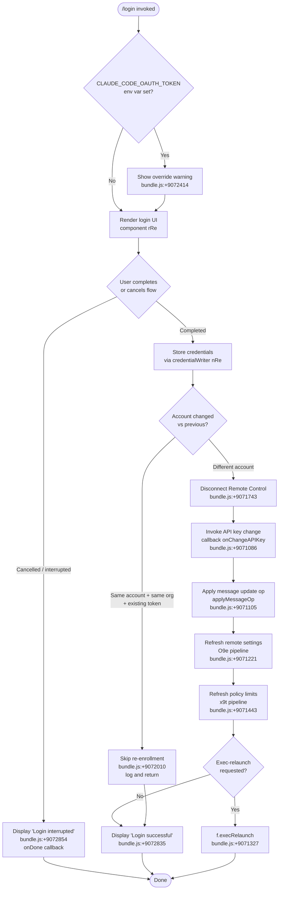

# `/login`

> Analysis basis: CC v2.1.186 bundle.js (AST extraction + Claude interpretation)
> Minimum version: v2.1.186

---

## Overview

`/login` initiates an interactive OAuth authentication flow that allows the user to sign in with their Anthropic account or switch to a different Anthropic account. It renders a JSX-based login UI component (`rRe`), orchestrates credential storage, triggers downstream effects such as remote-settings refresh and trusted-device enrollment, and optionally relaunches the active session when the account changes.

---

## Registration

| Field | Value |
|---|---|
| type | `local-jsx` |
| name | `login` |
| description | `Switch Anthropic accounts \| Sign in with your Anthropic account` |
| loc_byte | `11744568` |
| loc_byte_end | `11744788` |
| loc_line | `7777` |
| module_id | `L9a` |
| load_inline | `true` |
| arbor_handler.name | `uyl` |
| arbor_handler.fqn | `claude-2.1.186::uyl` |
| arbor_handler.kind | `Function` |
| arbor_handler.resolution_path | `direct` |
| arbor_handler.n_hits | `2` |

Analysis basis: CC v2.1.186 bundle.js:+11744568 – +11744788

---

## Input Branching

The command exhibits four or more distinct runtime branches depending on authentication state, environment variable overrides, existing credentials, and whether the account actually changes. A Mermaid flowchart is used.



---

## Behavioral Spec

### 1. Command Entry — Top-level Handler (`WRp` / Arbor: `uyl`)

The top-level JSX component (`WRp`) is the `handler_name` and wraps the actual login logic. It renders the login UI sub-component (`rRe`) and wires the `onDone` callback.

```
function loginCommandHandler(props):
    state = useState(initialLoginState)
    onDone = props.onDone

    if env.CLAUDE_CODE_OAUTH_TOKEN is set:
        emit warning message:
            "Warning: CLAUDE_CODE_OAUTH_TOKEN is set…"   # bundle.js:+9072414

    render LoginUI(
        onDone = onDone,
        symbol = Symbol.for("react.memo_cache_sentinel")  # bundle.js:+9072959
    )
```

Analysis basis: CC v2.1.186 bundle.js:+9072773 (call from `WRp` to `nRe`), +9072930 (useState), +9072959 (Symbol.for)

---

### 2. Login UI Component (`rRe`)

The React JSX component that presents the interactive login dialog. It uses `useReducer` / `useState` for local state, registers a key-handler via `Dr`, and renders a confirmation prompt with Esc / continue / cancel keys.

```
function LoginUIComponent(props):
    [loginState, dispatch] = useReducer(...)
    registerKeyHandler(Dr, handler=handleKeyInput)

    render:
        if loginState == "pending":
            show spinner / OAuth browser prompt
        if loginState == "done":
            show "Login successful"             # bundle.js:+9072835
        if loginState == "interrupted":
            show "Login interrupted"            # bundle.js:+9072854

        show key hints:
            "Press [Esc] to cancel"             # bundle.js:+9073449
            "Press [Enter] to continue"         # bundle.js:+9073469
```

Key event slots rendered: indexes 8–19 inclusive (numeric constants at bundle.js:+9073301, +9073530, +9073569, +9073616, +9073658, +9073685, +9073835, +9073865, +9073876, +9073887).

Label literals present: `"Login"` (bundle.js:+9073915), `"Settings"` (bundle.js:+9073203), `"permission"` (bundle.js:+9073940).

Analysis basis: CC v2.1.186 bundle.js:+9072900 (`rRe` definition start), +9073328 (jsxs), +9073389 (jsx)

---

### 3. Credential Write Pipeline (`nRe`)

`nRe` is the core credential-write orchestrator called after the OAuth flow completes. It:

1. Calls `onChangeAPIKey` to notify the API key subsystem.
2. Posts an `"update"` message operation via `applyMessageOp`.
3. Reads the current API key provider type via `uu.get` and determines the auth mode (`"gateway"` — bundle.js:+9071200).
4. Resolves the credential via `_Ke` (timestamped with `Date.now` — bundle.js:+51453).
5. Detects the provider family via `br` → `ot` → checks for `"bedrock"`, `"foundry"`, `"anthropicAws"`, `"mantle"`, `"vertex"`, `"firstParty"` (bundle.js:+2128842 – +2129059).
6. Invokes `O9e` to apply remote-settings refresh.
7. Triggers `J3n` (deep-equals comparison — bundle.js:+9064966) to detect whether the account actually changed.
8. If `Promise.resolve` short-circuits (same credentials — bundle.js:+9071275), skips relaunch.
9. Otherwise calls `f.execRelaunch` (bundle.js:+9071327).

```
function credentialWritePipeline(event, context):
    context.onChangeAPIKey(newKey)                   # bundle.js:+9071086
    context.applyMessageOp("update")                 # bundle.js:+9071105, +9071128

    timestamp = _Ke()                                # uses Date.now, bundle.js:+51453
    providerType = resolveProvider(br, ot)           # bundle.js:+9071193

    if providerType in ["gateway"]:                  # bundle.js:+9071200
        runRemoteSettingsRefresh(O9e)                # bundle.js:+9071221

    accountChanged = J3n(previousCredentials,
                         newCredentials)             # bundle.js:+9071228

    if not accountChanged:
        resolveImmediately()                         # bundle.js:+9071275
        return

    runPolicyLimitsRefresh(x9t)                      # bundle.js:+9071443
    runFeatureFlagRefresh(e9n)                       # bundle.js:+9071391
    runVseCleanup(Vse)                               # bundle.js:+9071455
    runPcRefresh(pc)                                 # bundle.js:+9071488

    appState = context.getAppState()                 # bundle.js:+9071658
    if appState.remoteControlActive:
        log("[bridge:repl] Account changed via /login — disconnecting Remote Control session")
                                                     # bundle.js:+9071743
    context.setAppState(updatedState)                # bundle.js:+9071831

    if sameAccountSameOrgWithExistingToken:
        log("[trusted-device] Same account+org re-login with existing token, skipping re-enrollment")
                                                     # bundle.js:+9072010
    else:
        runTrustedDeviceEnrollment(EFt)              # bundle.js:+9072117

    context.execRelaunch()                           # bundle.js:+9071327
```

Analysis basis: CC v2.1.186 bundle.js:+9071086 – +9072153

---

### 4. Remote Settings Refresh (`O9e`)

After a successful login, `O9e` orchestrates a remote-settings pull cycle. Sub-steps (all depth-1 callees confirmed in callGraph):

```
function remoteSettingsRefresh():
    hashPayload(Qha)                         # SHA-256, bundle.js:+7228419
    fetchRemoteSettings($ga)                 # HTTP GET with If-None-Match, bundle.js:+7253237

    match httpStatus:
        200 → parseAndApply(Vto)             # bundle.js:+7257065
        204 → noContent()
        304 → log("Remote settings: Using cached settings (304)")
                                             # bundle.js:+7253391
        401 → emit tengu_remote_settings_401_force_refresh_retry
                                             # bundle.js:+7254542
        404 → saveEmptySentinel()
              log("Remote settings: Saved empty sentinel (404 response)")
                                             # bundle.js:+7256362
        other → log("Remote settings: Using stale cache after error")
                                             # bundle.js:+7256576

    if settingsChanged:
        log("Remote settings: Refreshed after auth change")
                                             # bundle.js:+7257091
    triggerPollScheduler(Wga)               # cSn: setInterval/clearInterval
                                             # bundle.js:+7257607
```

Analysis basis: CC v2.1.186 bundle.js:+9071221, +7256972 – +7257146

---

### 5. Policy Limits Refresh (`x9t`)

In parallel with remote settings, `x9t` refreshes the policy limits cache:

```
function policyLimitsRefresh():
    checkModified(tOo)                       # bundle.js:+13832409
    loadPolicyFile(dGl)                      # mtime-stamped, bundle.js:+13830527

    emit tengu_policy_limits_fetch            # bundle.js:+13830674

    match result:
        succeeded → log("Policy limits: Applied new restrictions successfully")
                                             # bundle.js:+13831485
        stale_cache_used → log("Policy limits: Using stale cache after fetch failure")
                                             # bundle.js:+13831101
        304 → log("Policy limits: Cache still valid (304 Not Modified)")
                                             # bundle.js:+13831266
        error → log("Policy limits: Using stale cache after error")
                                             # bundle.js:+13831677

    log("Policy limits: Refreshed after auth change")   # bundle.js:+13832483
```

Analysis basis: CC v2.1.186 bundle.js:+9071443, +13832409 – +13832483

---

### 6. Feature-Flag Refresh (`e9n`)

`e9n` clears and reloads the feature-flag tables (`OIe`, `YEn`, `TW`) after account switch:

```
function featureFlagRefresh():
    clearCache(A9a)          # Ydo.clear, bundle.js:+9065714
    runZEn(ZEn)              # clears OIe, YEn, DRt, P2r, TW; reloads features
                             # bundle.js:+9067842
    refreshPayload(Fyi)      # OIe.set, YEn.add, TW.set per entry
                             # bundle.js:+3325671 – +3326563
    emitBZeChange(BZe.emit)  # bundle.js:+3329631
```

Analysis basis: CC v2.1.186 bundle.js:+9071391, +9067722 – +9067842

---

### 7. Trusted-Device Enrollment (`EFt`)

After a full account change, `EFt` performs optional device enrollment:

```
function trustedDeviceEnrollment(context):
    if env.CLAUDE_TRUSTED_DEVICE_TOKEN set:
        log("[trusted-device] CLAUDE_TRUSTED_DEVICE_TOKEN env var is set, skipping enrollment")
                                             # bundle.js:+7211186
        return

    if essentialTrafficOnly:
        log("[trusted-device] Essential traffic only, skipping enrollment")
                                             # bundle.js:+7211500
        return

    if not oauthToken:
        log("[trusted-device] No OAuth token, skipping enrollment")
                                             # bundle.js:+7211613
        return

    POST enrollmentEndpoint
        headers: {"Content-Type": "application/json"}  # bundle.js:+7211864
        timeout: 10000 ms                              # bundle.js:+7211907

    match response:
        201 → storeDeviceToken()             # emit tengu_bridge_trusted_device_enroll
                                             # bundle.js:+7212009
        other → emit http_error              # bundle.js:+7212214

    if device_token missing from response:
        log("Enrollment response missing device_token field")  # bundle.js:+7212292
        emit missing_token                   # bundle.js:+7212393
```

Analysis basis: CC v2.1.186 bundle.js:+9072117, +7210923 – +7212719

---

## State & Side Effects

| Item | Detail |
|---|---|
| Telemetry — `tengu_remote_settings_401_force_refresh_retry` | Fired when remote settings endpoint returns HTTP 401 after login (bundle.js:+7254542) |
| Telemetry — `tengu_managed_settings_security_dialog_shown` | Fired when the managed-settings security dialog is displayed (bundle.js:+7250153) |
| Telemetry — `tengu_managed_settings_security_dialog_accepted` | User accepted managed-settings dialog (bundle.js:+7249837) |
| Telemetry — `tengu_managed_settings_security_dialog_rejected` | User rejected managed-settings dialog (bundle.js:+7249887) |
| Telemetry — `tengu_feature_ok` | Feature-flag retrieval succeeded (bundle.js:+1024705) |
| Telemetry — `tengu_feature_bad` | Feature-flag retrieval failed (bundle.js:+1024772) |
| Telemetry — `tengu_feature_sad` | Feature-flag state is degraded (bundle.js:+1024853) |
| Telemetry — `tengu_config_auth_loss_prevented` | Config write aborted to prevent auth loss (bundle.js:+13847465) |
| Telemetry — `tengu_policy_limits_fetch` | Policy limits HTTP fetch result recorded (bundle.js:+13830674) |
| Telemetry — `tengu_disable_bypass_permissions_mode` | Bypass-permissions mode disabled during session rebuild (bundle.js:+13713420) |
| Telemetry — `tengu_auto_mode_config` | Auto-mode configuration evaluated post-login (bundle.js:+13711309) |
| Telemetry — `tengu_keybinding_fallback_used` | Key-binding fallback triggered in the login UI (bundle.js:+4253967) |
| `appState` changes | `setAppState` is called to update authentication and Remote Control fields (bundle.js:+9071831) |
| Remote Control disconnect | If a Remote Control session is active when the account changes, it is disconnected (bundle.js:+9071743) |
| API key propagation | `onChangeAPIKey` callback notifies the API key subsystem (bundle.js:+9071086) |
| Message update op | An `"update"` operation is posted to the message bus (bundle.js:+9071105, +9071128) |
| Remote settings refresh | Full pull cycle with SHA-256 ETag (bundle.js:+7228419) and `If-None-Match` header (bundle.js:+7253237) |
| Policy limits refresh | File-system-backed cache with mtime comparison; background poll rescheduled (bundle.js:+13827101, +13832670) |
| Feature-flag refresh | Clears `OIe`, `YEn`, `DRt`, `P2r`, `TW` maps and reloads from API payload (bundle.js:+3329211) |
| Credential storage | Written via `NGs` secure-storage path; events `secure_storage_credentials_write`, `plaintext_fallback_used` (bundle.js:+2333585, +2333832) |
| Trusted-device enrollment | HTTP POST with 10 000 ms timeout; device token written to secure store (bundle.js:+7211907) |
| Session exec-relaunch | `f.execRelaunch` is called when the account changes to restart the active session (bundle.js:+9071327) |
| Hook registration | `Dr` registers a key-event handler via `s.registerHandler` (bundle.js:+4203371) |
| Sound | <!-- TODO: not found in depth-2 traversal; needs --depth 4 --> |

---

## Version History

| Version | Change |
|---|---|
| v2.1.186 | Initial analysis |

---

## Common Mistakes

1. **Forgetting `CLAUDE_CODE_OAUTH_TOKEN` override**: If this environment variable is set, it silently overrides the newly stored login token at runtime. The command displays a warning (bundle.js:+9072414) but does not block the flow — users must unset the variable after logging in for the new credentials to take effect.

2. **Expecting immediate credential effect without relaunch**: When the account actually changes, `f.execRelaunch` is triggered (bundle.js:+9071327). Callers that hook into `onDone` without accounting for the relaunch cycle may observe stale state.

3. **Same-account re-login triggers trusted-device skip**: Re-logging in with the same account and organization when an existing token is present skips re-enrollment entirely (bundle.js:+9072010). This is intentional but may confuse users expecting the enrollment ceremony to repeat.

4. **Remote Control sessions are silently dropped**: Any active Remote Control (bridge/repl) session is disconnected when `/login` results in an account change (bundle.js:+9071743). Users should re-establish remote sessions after switching accounts.

5. **`/login` in essential-traffic mode is limited**: Trusted-device enrollment is skipped when essential-traffic-only mode is active (bundle.js:+7211500); some post-login capabilities may be unavailable until normal network access is restored.

---

## Appendix — Identifier Mapping

> For bundle debugging only. Identifiers change across versions.

| Identifier | Role |
|---|---|
| `uyl` | Arbor-resolved top-level login handler (registration direct hit) |
| `WRp` | Top-level login JSX wrapper component (handler_name) |
| `rRe` | Login UI React component (renders dialog, key hints) |
| `nRe` | Credential write and account-change orchestrator |
| `PA` | App-state provider accessor used in login UI |
| `H6e` | OAuth state reducer / useEffect wiring |
| `qz` | Feature-flag store subscription helper |
| `O9e` | Remote-settings refresh coordinator |
| `Vto` | Remote-settings fetch-and-apply implementation |
| `$ga` | HTTP fetch logic for remote settings |
| `Qha` | SHA-256 hash computation for settings ETag |
| `Gto` | Settings-loading timeout / consent gate |
| `Wga` | Background poll scheduler for remote settings |
| `GZd` | Polling cycle: fetch → apply → notify |
| `nPn` | `wD.notifyChange` dispatcher post-settings apply |
| `Nga` | Settings structure validator |
| `Mga` | Settings security-dialog orchestrator |
| `xZd` | Requester-wait queue for managed-settings dialog |
| `Rga` | Security-dialog approval / rejection handler |
| `x9t` | Policy limits refresh coordinator |
| `tOo` | Policy limits modification-check |
| `mQn` | Policy limits loading-timeout handler |
| `dGl` | Policy limits file-read and cache-compare |
| `gQn` | Policy limits background-poll scheduler |
| `pGl` | Policy limits poll cycle |
| `cGl` | Policy limits mtime staleness check |
| `ixf` | Policy limits hash computation |
| `axf` | Policy limits credential-type router (`wif`/`oauth`/`api_key`) |
| `lxf` | Policy limits retry with exponential back-off |
| `uxf` | Policy limits cache-write helper |
| `e9n` | Feature-flag refresh coordinator post-login |
| `ZEn` | Feature-flag table clear and reload |
| `Fyi` | Feature-flag payload parser and `OIe`/`YEn`/`TW` populator |
| `$yi` | Feature-flag snapshot builder (`Object.fromEntries`) |
| `A9a` | `Ydo.clear` — clears feature-flag dirty set |
| `EFt` | Trusted-device enrollment orchestrator |
| `HU` | Trusted-device enrollment pre-check (essential traffic, token presence) |
| `Gyi` | Feature-flag value getter used in enrollment gate |
| `ks` | OAuth endpoint URL builder |
| `J3n` | Credential deep-equals comparator (detects account change) |
| `Bir` | Previous-credential reader |
| `f` | Exec-relaunch / daemon-session manager |
| `D` | Daemon session spawn/config/reload orchestrator |
| `KBo` | Daemon session state machine (claimed/spawned/idle/working) |
| `$Bo` | Daemon send-claim helper |
| `bYf` | Daemon IPC message dispatcher |
| `N` | Session retirement/settle monitor |
| `Zut` | Session permission classifier |
| `y9t` | Permission classification logic |
| `J5` | Session job manager |
| `In` | React-tree state reader |
| `Z$` | Global state compound reader |
| `UIt` | WSL detection helper |
| `pc` | Configuration persistence helper |
| `ny` | Config writer (ANTHROPIC_API_KEY / auth tokens) |
| `Wg` | Auth credential resolver |
| `ux` | Flag-settings reader |
| `iA` | OAuth token resolver (`user_oauth` / `profile-implicit`) |
| `Ud` | `--bare` flag / environment variable reader |
| `Nl` | Provider-type helper |
| `wt` | Telemetry event emitter |
| `SKe` | `claude-vscode` provider check |
| `Pvt` | `CLAUDE_CODE_API_KEY_FILE_DESCRIPTOR` reader |
| `P7` | Authentication provider dispatcher (`local-agent`, `remote_cowork`, `enterprise`, `team`) |
| `Su` | Auth-state subscriber |
| `aA` | Auth store reader (`Gs`) |
| `Ukt` | Auth store writer (`Gs`) |
| `_Ke` | Credential timestamping helper (`Date.now`) |
| `br` | Provider-type string normaliser |
| `ot` | `String()` coercion utility |
| `Re` | Error-logging dispatcher |
| `ao` | `Error` / `String` conversion pair |
| `nRe` | (see above — credential write orchestrator) |
| `NGs` | Secure storage read/write/update implementation |
| `nUe` | Secure storage async read helper |
| `Bl` | Storage layer selector |
| `Dr` | Key-handler registration component |
| `YE` | Context reader for input-handler context |
| `km` | Input-action dispatcher |
| `dOi` | Action-resolver with `useMemo` |
| `yGr` | Input state machine with `useState` / `useCallback` |
| `vu` | `useRef` / `useEffect` focus tracker |
| `q2` | Debounced callback with `useCallback` |
| `XE` | Secondary context reader |
| `vw` | Model-name / config renderer |
| `Bkr` | Provider-badge renderer |
| `rfn` | Config-section renderer |
| `tU` | Model-tier resolver |
| `W6s` | Available-model enforcer |
| `ja` | Model string parser |
| `Zo` | Model canonical-name normaliser |
| `yl` | Model name replace helper |
| `Zpn` | Model-name alias resolver |
| `XM` | Model exclusion check |
| `Vu` | Provider-type to display string |
| `Koe` | `rBu.includes` check for model routing |
| `Y3n` | Config-section top-level component |
| `Jy` | Config-string formatter |
| `q6s` | Config-string normaliser |
| `Pr` | App-state diff reader |
| `w8n` | Working-directory field extractor |
| `L8n` | Allowed-tools field extractor |
| `L2` | Permission-rule comparator |
| `L9t` | Auto-mode configuration loader |
| `k9t` | Auto-mode gate logic |
| `Kz` | Feature-flag gate for auto mode |
| `_s` | Model-selection resolver |
| `b9` | Tier-to-model mapper |
| `$g` | Model-name normaliser chain |
| `dme` | Model-detection helper |
| `So` | Model-family classifier |
| `VQe` | Model string coercion |
| `whe` | Settings-event emitter (`permission_mode_changed`) |
| `Au` | Event-bus emitter |
| `lEe` | Permission-settings entries mapper |
| `W5` | Global-config save orchestrator |
| `b9a` | Config serialiser |
| `LK` | `WZc.has` — migration-flag check |
| `pdt` | Environment variable permission filter |
| `$Rp` | `t9n.has` — permission-set membership test |
| `FRp` | `URp.has` — permission-set lookup |
| `UOi` | Environment variable upper-case normaliser |
| `FOi` | `WTd.has` — deny-list check |
| `QR` | `aEt` / `TI.filter` — rule-set updater |
| `TSn` | Telemetry snapshot helper |
| `kls` | CA certificate cache clearer |
| `Dls` | mTLS configuration cache clearer |
| `zIr` | Proxy agent cache clearer |
| `jCt` | Network proxy configurator |
| `oz` | Proxy URL parser |
| `lvs` | Proxy-option builder |
| `avs` | Proxy error constructor |
| `_n` | Global-config writer with auth-loss guard |
| `Fyi` | (see above — feature-flag payload parser) |
| `Vse` | Feature-flag teardown (clears all flag maps) |
| `GZe` | Flag-store cleanup (`OIe`, `YEn`, `DRt`, `P2r`, `TW`) |
| `B2r` | `clearInterval` / `process.removeListener` cleanup |
| `TMt` | Trusted-device token cache |
| `tto` | React tree entry-point for login screen |
| `EFt` | (see above — trusted-device enrollment) |
| `dZd` | Context-reader for login screen |
| `Xeo` | Secondary context reader for login screen |
| `T9a` | Post-login telemetry snapshot |
| `w9t` | Permission-mode update handler |
| `PFt` | Permission-state transition |
| `tH` | Permission-rule table updater |
| `uf` | `Ziu` — permission-mode guard |
| `IIe` | Inter-process event relay |
| `epo` | Auth-provider-change event publisher |
| `Fxe` | Model-feature-flag evaluator |
| `Dga` | Settings-dialog display helper |
| `Ic` | Settings-panel router |
| `Uga` | OAuth token writer (writes to file via `n.writeFile`, `n.datasync`, `n.close`) |
| `mon` | `Dpe` / `Mis.join` — path joiner for OAuth token file |
| `Gga` | Settings change notifier (`W8`) |