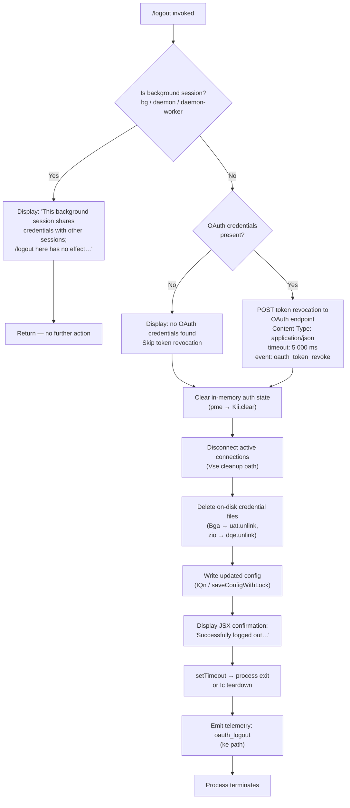

# `/logout`

> Analysis basis: CC v2.1.186 bundle.js (AST extraction + Claude interpretation)
> Minimum version: v2.1.186

---

## Overview

The `/logout` command signs the user out of their Anthropic account by revoking the OAuth token via a network call, clearing in-memory credentials and on-disk credential files, persisting an updated configuration, and then terminating the process. In background sessions (daemon or daemon-worker roles), the command is a no-op and instead displays an explanatory message directing the user to run `/logout` from their main terminal.

---

## Registration

| Field | Value |
|---|---|
| type | `local-jsx` |
| name | `logout` |
| description | Sign out from your Anthropic account |
| loc_byte | `11744849` |
| loc_byte_end | `11745133` |
| loc_line | `7777` |
| module_id | `Kio` |
| load_inline | `true` |
| arbor_handler.name | `Zyp` |
| arbor_handler.fqn | `claude-2.1.186::Zyp` |
| arbor_handler.kind | `AsyncFunction` |
| arbor_handler.resolution_path | `module_id` |
| arbor_handler.n_hits | `0` |

Analysis basis: CC v2.1.186 bundle.js:+11744849

---

## Input Branching

The handler has four distinct high-level branches based on session context and OAuth configuration, making a Mermaid flowchart the appropriate representation.



Analysis basis: CC v2.1.186 bundle.js:+8155354 (handler entry), +8157043 (background-session guard message), +2141022 (`oauth_token_revoke` literal), +8156714 (`oauth_logout` telemetry literal)

---

## Behavioral Spec

### 1. Handler Entry — `logoutCommandHandler` (`Zyp`)

The Arbor-resolved handler is `Zyp` (AsyncFunction), reached via `module_id → Kio`.

```
async function logoutCommandHandler(appContext):
    sessionRole = readSessionRole(appContext)          // Ws → XNe
    credentialStore = loadCredentialStore(appContext)  // $2e path

    if sessionRole in ["bg", "daemon", "daemon-worker"]:
        renderMessage("This background session shares credentials …")
        return                                          // early exit, no logout

    oauthCreds = credentialStore.read()
    if oauthCreds present:
        await revokeOAuthToken(oauthCreds)             // AO path

    await performLogout(appContext)                    // W2t path
    renderConfirmation()                               // ARa.jsx
    scheduleProcessExit()                              // setTimeout + Ic
```

Analysis basis: CC v2.1.186 bundle.js:+8156933 (`Zyp → Ws`), +8156944 (`Zyp → $2e`), +8157006 (`Zyp → Ylt`), +8157041 (`Zyp → e`), +8157217 (`Zyp → ARa.jsx`), +8157301 (`Zyp → setTimeout`)

---

### 2. Background-Session Guard

```
function isBackgroundSession(context):
    role = getSessionRole(context)   // literals: "bg", "daemon", "daemon-worker"
    return role in BACKGROUND_ROLES
```

The string constants `"bg"` (bundle.js:+2305481), `"daemon"` (bundle.js:+2305491), and `"daemon-worker"` (bundle.js:+2305505) are compared against the current session role. When matched, the literal message beginning `"This background session shares credentials…"` (bundle.js:+8157043) is displayed and the function returns without touching credentials.

Analysis basis: CC v2.1.186 bundle.js:+2305481, +2305491, +2305505, +8157043

---

### 3. OAuth Token Revocation — `revokeOAuthToken` (`AO`)

```
async function revokeOAuthToken(credentials):
    url = buildOAuthUrl(credentials)        // ks → GYo / X5c
    response = await httpClient.post(url, {
        body: { refresh_token: credentials.refreshToken },
        headers: { "Content-Type": "application/json" },
        timeout: 5000
    })
    if httpClient.isAxiosError(response):
        logNetworkError(response)            // T path
    return response
```

Key constants:
- `"refresh_token"` literal (bundle.js:+2140914)
- `"Content-Type": "application/json"` (bundle.js:+2140969, +2140984)
- Timeout: **5 000 ms** (bundle.js:+2141012)
- Telemetry event string `"oauth_token_revoke"` (bundle.js:+2141022)

On network failure, the error is classified (`"network"` literal at bundle.js:+2141146) but the logout proceeds regardless.

Analysis basis: CC v2.1.186 bundle.js:+2140854 (`AO → co.post`), +2141059 (`AO → co.isAxiosError`)

---

### 4. Logout Execution — `performLogout` (`W2t` / `Ylt`)

```
async function performLogout(appContext):
    // 4a. Clear in-memory credential cache
    clearCredentialCache()                  // pme → Kii.clear

    // 4b. Disconnect active connections and stop intervals
    disconnectConnections(appContext)       // Vse → GZe
        // GZe: clearInterval, process.removeListener
        // GZe: clears OIe, YEn, DRt, P2r, TW caches

    // 4c. Emit internal cleanup event
    eventBus.emit(CLEANUP_EVENT)           // Vse → BZe.emit

    // 4d. Delete on-disk OAuth credential files
    deleteCredentialFile_primary()         // Bga → uat.unlink  (bundle.js:+7255240)
    deleteCredentialFile_socket()          // zio → dqe.unlink  (bundle.js:+13832566)

    // 4e. Resolve config path components
    configPath = resolveConfigPath()       // GIe → lEi.join

    // 4f. Persist updated config (auth fields cleared)
    saveConfigWithLock(appContext)         // IQn path
        // Acquires write lock; re-reads config before write
        // Guards against losing auth: "saveConfigWithLock: re-read config
        //   is missing auth …" (bundle.js:+13850884)
        // Creates backup copies under "backups/" (bundle.js:+13852069)

    // 4g. Emit oauth_logout telemetry event
    emitTelemetry("oauth_logout")         // ke  (bundle.js:+8156714)
```

Analysis basis: CC v2.1.186 bundle.js:+8156791 (`W2t → vDn`), +8156797 (`W2t → BQ`), +8156802 (`W2t → pme`), +8156887 (`W2t → Bga`), +8156899 (`W2t → zio`), +3045303 (`pme → Kii.clear`), +7255240 (`Bga → uat.unlink`), +13832566 (`zio → dqe.unlink`)

---

### 5. Config Save Safety — `saveConfigWithLock` (`IQn`)

```
function saveConfigWithLock(config):
    acquireLock()                // BTt (file-lock with randomBytes)
    if lockContention:
        emitTelemetry("tengu_config_lock_contention")

    diskConfig = readConfigFromDisk()
    if diskConfig.auth missing AND cache.auth present:
        // Refuse to overwrite — safety guard (GH #3117)
        emitTelemetry("tengu_config_auth_loss_prevented")
        return

    backupConfig(diskConfig)     // copies to "backups/" dir; max 5 backups
    writeConfigFile(config)      // BTt → cf.writeFileSync + cf.fsyncSync
    releaseLock()
```

File permissions for the written config: octal **`0600`** (decimal 384, bundle.js:+13851769).
Lock timeout: **60 000 ms** (bundle.js:+13851238).

Analysis basis: CC v2.1.186 bundle.js:+13850884, +13851238, +13851769, +13852069

---

### 6. Process Teardown — `processExit` (`Ic` / `gi`)

```
async function processExit(appContext):
    // Unmount active Ink/JSX renders
    unmountRenders()                // k9e → e.unmount + Zbn
    // Wait for output drain
    drainOutput()                   // LKe → O5o.drain
    // Race: graceful shutdown vs. 3 500 ms hard timeout
    await Promise.race([
        gracefulShutdown(),         // gi → Nha (Promise.allSettled)
        timeout(3500)               // literal at bundle.js:+7218964
    ])
    // Final write flush
    writeSync(stdout)               // sHe.writeSync
    process.exit(0)                 // cto → process.exit
```

If graceful shutdown times out, `process.kill` with `SIGKILL` is used as a fallback (bundle.js:+7216550).

Analysis basis: CC v2.1.186 bundle.js:+8157317 (`Zyp → Ic`), +7218964 (3500 ms literal), +7216525 (`cto → process.exit`), +7216550 (`cto → process.kill`)

---

### 7. Confirmation Rendering

```
function renderConfirmationMessage():
    // Renders JSX element via ARa.jsx (bundle.js:+8157217)
    display({
        type: "system",
        text: "Successfully logged out from your Anthropic account."
    })
```

Literal `"Successfully logged out from your Anthropic account."` confirmed at bundle.js:+8157237. Message type `"system"` at bundle.js:+8157195.

Analysis basis: CC v2.1.186 bundle.js:+8157195, +8157217, +8157237

---

### 8. CLI Error Path — `cliError` (`Ts`)

If a fatal error occurs before logout completes:

```
function cliError(message):
    console.error(Et.red(message))   // X8e (bundle.js:+13194038)
    writeErrorToFile("cli_error")    // sT → Dre.writeFileSync (bundle.js:+199887)
    process.exit(1)                  // bundle.js:+13194106
```

Literal `"cli_error"` at bundle.js:+13194093. Exit code **1**.

Analysis basis: CC v2.1.186 bundle.js:+13194083 (`Ts → X8e`), +13194090 (`Ts → sT`), +13194106 (`Ts → process.exit`)

---

## State & Side Effects

| Item | Detail |
|---|---|
| Telemetry — `oauth_logout` | Emitted at end of successful logout sequence (bundle.js:+8156714) via the `ke` path |
| Telemetry — `oauth_token_revoke` | Emitted during HTTP token revocation call (bundle.js:+2141022) |
| Telemetry — `tengu_config_lock_contention` | Emitted when the config file lock is contested (bundle.js:+13850557) |
| Telemetry — `tengu_config_stale_write` | Emitted if a stale write is detected (bundle.js:+13850693) |
| Telemetry — `tengu_config_auth_loss_prevented` | Emitted when auth-loss guard blocks a config write (bundle.js:+13851036) |
| Telemetry — `tengu_config_parse_error` | Emitted if config JSON cannot be parsed during re-read (bundle.js:+13853132) |
| Telemetry — `tengu_config_fallback_write` | Emitted when the fallback write path is taken (bundle.js:+13850173) |
| Telemetry — `tengu_feature_ok` | Feature-level success event (bundle.js:+1024705) |
| Telemetry — `tengu_feature_sad` | Feature-level soft-failure event (bundle.js:+1024853) |
| Telemetry — `tengu_feature_bad` | Feature-level hard-failure event (bundle.js:+1024772) |
| Telemetry — `tengu_cache_eviction_hint` | Cache eviction hint emitted near session end (bundle.js:+7219316) |
| Telemetry — `tengu_scroll_summary` | Scroll summary emitted during terminal teardown (bundle.js:+7218373) |
| Credential cache | Cleared in-memory via `Kii.clear` (bundle.js:+3045303) |
| Disk credential files | Primary OAuth credential file unlinked via `uat.unlink` (bundle.js:+7255240); socket/daemon credential file unlinked via `dqe.unlink` (bundle.js:+13832566) |
| Config file | Auth fields removed; updated config written with file lock; up to **5** backup copies retained in `backups/` subdirectory |
| Active connections | Disconnected and all interval/listener registrations cleared via `GZe` (bundle.js:+3329845, +3329880) |
| Process listeners | Removed via `process.removeListener` and `process.off` (bundle.js:+3329880, +3329085) |
| appState changes | Auth state nulled; MCP server connections cleaned up; Ink render tree unmounted |
| Sound | None detected |
| Process exit | `process.exit(0)` on success after graceful drain; `process.kill(SIGKILL)` if 3 500 ms teardown timeout exceeded |

---

## Version History

| Version | Change |
|---|---|
| v2.1.186 | Initial analysis |

---

## Common Mistakes

1. **Running `/logout` in a background/daemon session** — In daemon or daemon-worker sessions (identified by the `"bg"`, `"daemon"`, or `"daemon-worker"` role literals), `/logout` is completely inert. Users must run it from their main interactive terminal session.

2. **Expecting an instant logout if the revocation call fails** — The OAuth token revocation POST uses a 5 000 ms timeout and is classified as a network error on failure. The logout proceeds and credentials are cleared locally even if the server-side revocation call fails; the session token may remain valid server-side until it expires naturally.

3. **Editing `~/.claude.json` immediately after running `/logout`** — The config save uses a file lock and performs a re-read before writing. An external edit made between the re-read and the write will be overwritten. The auth-loss guard (GH #3117) may additionally block the write if the re-read config appears to be missing credentials the in-memory cache has — in this case `tengu_config_auth_loss_prevented` is emitted and the config is not written.

4. **Assuming the process exits synchronously** — The process teardown races a graceful drain against a **3 500 ms** hard timeout. Scripts or CI pipelines that immediately attempt to re-invoke `claude` after `/logout` should wait for the process to fully exit.

5. **Confusing `/logout` with API key removal** — `/logout` targets OAuth-based Anthropic account sessions. Users authenticated via an `ANTHROPIC_API_KEY` environment variable or Bedrock/Vertex/Foundry credential modes are unaffected; those modes are detected via the `"bedrock"`, `"vertex"`, `"foundry"`, `"anthropicAws"`, `"mantle"`, `"firstParty"` literals in the credential-check path.

---

## Appendix — Identifier Mapping

> For bundle debugging only. Identifiers change across versions.

| Identifier | Role |
|---|---|
| `Zyp` | Main logout command handler (AsyncFunction); Arbor-resolved entry point |
| `Ylt` | Core logout execution routine (inner logout logic, called by `Zyp`) |
| `eEp` | Logout UI/rendering wrapper that invokes `Ylt` |
| `W2t` | Logout side-effects coordinator (credential clear, file deletion, config save) |
| `Ws` | Session role reader; determines whether session is background/daemon |
| `XNe` | Session role resolver helper |
| `vDn` | Auth state accessor used during logout |
| `BQ` | Credential store reference |
| `pme` | In-memory credential cache clear function |
| `IIe` | Additional in-memory state clear |
| `Vse` | Connection and listener cleanup dispatcher |
| `GZe` | Interval and process-listener teardown function |
| `B2r` | Clears a specific interval and removes a process listener |
| `Bga` | Primary credential file deletion function |
| `qga` | Credential path helper used by `Bga` |
| `UFt` | Credential file path resolver |
| `Dis` | Underlying path constant for credential file |
| `Dpe` | Path utility used during credential file operations |
| `mon` | File path join helper for credential deletion |
| `zio` | Socket/daemon credential file deletion function |
| `tOo` | Socket file path resolver |
| `rOo` | Socket path component |
| `Mme` | Socket existence check helper |
| `GIe` | Config path resolver for logout |
| `AO` | OAuth token revocation HTTP caller |
| `ks` | OAuth endpoint URL builder |
| `GYo` | OAuth base URL selector |
| `X5c` | OAuth URL path constructor |
| `Ts` | CLI fatal-error handler (logs, writes file, exits with code 1) |
| `X8e` | Error message formatter (uses `Et.red`) |
| `sT` | Error-file writer (`Dre.writeFileSync`) |
| `Ic` | Process teardown orchestrator |
| `gi` | Full graceful-shutdown sequence with race/timeout |
| `k9e` | Ink render unmount function |
| `Zbn` | Terminal output flush helper |
| `lto` | Terminal line/display cleanup |
| `cto` | Hard exit function (`process.exit` / `process.kill`) |
| `LKe` | Output drain helper (`O5o.drain`) |
| `Nha` | Graceful shutdown with `Promise.allSettled` |
| `DSt` | Startup/config persistence path |
| `$Wo` | Config file writer |
| `Ccr` | Config file path resolver |
| `UDn` | Display/scroll state cleanup |
| `Aha` | Scroll summary computation |
| `Es` | Terminal environment detector |
| `_n` | Global config save function (`saveGlobalConfig`) |
| `IQn` | Config save with lock (`saveConfigWithLock`) |
| `cEe` | Config file reader with backup support |
| `BTt` | Atomic file write helper (temp file + rename + fsync) |
| `TQn` | Config write worker |
| `TKt` | Config lock timestamp helper |
| `RGs` | Config object merge helper |
| `_Oo` | Config backup path builder |
| `hOo` | Config entries iterator |
| `fDe` | Config field filter |
| `EHt` | Config schema validator |
| `$2e` | Credential store accessor/factory |
| `DS` | String encoding helper used in credential store |
| `Au` | Credential store update emitter |
| `F2e` | Credential store core read/write class |
| `_W` | Credential store initializer |
| `ACn` | OTEL attribute builder for credential store |
| `bDt` | String converter for credential values |
| `G$` | Credential store cache checker |
| `pc` | Credential write path helper |
| `_Id` | Credential decode/parse helper |
| `I1i` | Credential field accessors (`hId`, `mId`) |
| `AEt` | Credential store event dispatcher |
| `cir` | Credential store change emitter |
| `NGs` | Storage key-value layer (read/write/delete with async) |
| `nUe` | Storage async read helper |
| `KBu` | Storage context resolver |
| `ke` | Telemetry emitter (feature events + `oauth_logout`) |
| `W` | Telemetry `ok` event emitter |
| `Pe` | Telemetry base emitter |
| `Mt` | Telemetry `sad` event emitter |
| `xe` | Telemetry `bad` event emitter |
| `Re` | Log/event dispatcher |
| `ao` | Error constructor helper |
| `ot` | String coercion utility |
| `Ki` | Essential-traffic logger |
| `Pnu` | Circular log buffer manager |
| `QUr` | Project config path resolver |
| `sai` | Workspace info builder |
| `VUs` | User identity resolver |
| `bO` | Path normalizer + hash generator |
| `OC` | Config reader |
| `YM` | OS user info accessor |
| `Ae` | String cast utility |
| `br` | Cloud provider detector (bedrock/vertex/foundry/mantle checks) |
| `Bl` | Storage layer bootstrapper |
| `BPe` | Additional state accessor used post-logout |
| `fJ` | Misc flag/config reader |
| `Byt` | Session-end event emitter |
| `Ke` | KVe-backed key-value accessor |
| `KVe` | Underlying KV store implementation |
| `Mr` | Nonconforming terminal handler |
| `yH` | Terminal type detector |
| `x9e` | Async result wrapper |
| `DDn` | Deferred resolver |
| `Rt` | GL-layer renderer |
| `W8e` | File stat + read async helper |
| `p$l` | Column-width calculator |
| `E` | Watcher stop helper |
| `Syc` | Heartbeat/supervisor manager |
| `d` | Supervisor session manager |
| `DSt` | Startup profiling persister |
| `cw` | Terminal cursor helper |
| `N3` | Terminal size helper |
| `kFt` | File-system stat helper for terminal |
| `ch` | Terminal octet/render helper |
| `Tha` | Terminal header renderer |
| `$9` | Internal state getter |
| `F9` | Inner state accessor |
| `bha` | Scroll state initializer |
| `Gt` | fs existence check |
| `mn` | Error code classifier (`EISDIR`, `ENOENT`, etc.) |
| `Rre` | EISDIR error handler |
| `TWo` | Log path joiner |
| `pcr` | Log file rotation helper |
| `Uvc` | Async log appender |
| `Ai` | OTEL exporter registrar |
| `De` | JSON stringify wrapper |
| `Lc` | Path redactor (replaces home dir with `[REDACTED]`) |
| `SWo` | Redaction map builder |
| `eze` | Output write helper |
| `cWo` | Raw stream writer |
| `Fvc` | Structured logger (debug/info level dispatcher) |
| `wKe` | Batched log line flusher |
| `npe` | Log path resolver |
| `Pvc` | Log level filter |
| `U5o` | Log sink selector |
| `T` | Top-level logger dispatch |
| `uir` | Credential emit helper |
| `Z3e` | MCP connection builder |
| `arr` | MCP connection result applier |
| `maa` | MCP retry scheduler |
| `q2o` | MCP connection orchestrator |
| `a` | MCP server manager |
| `l` | MCP client list helper |