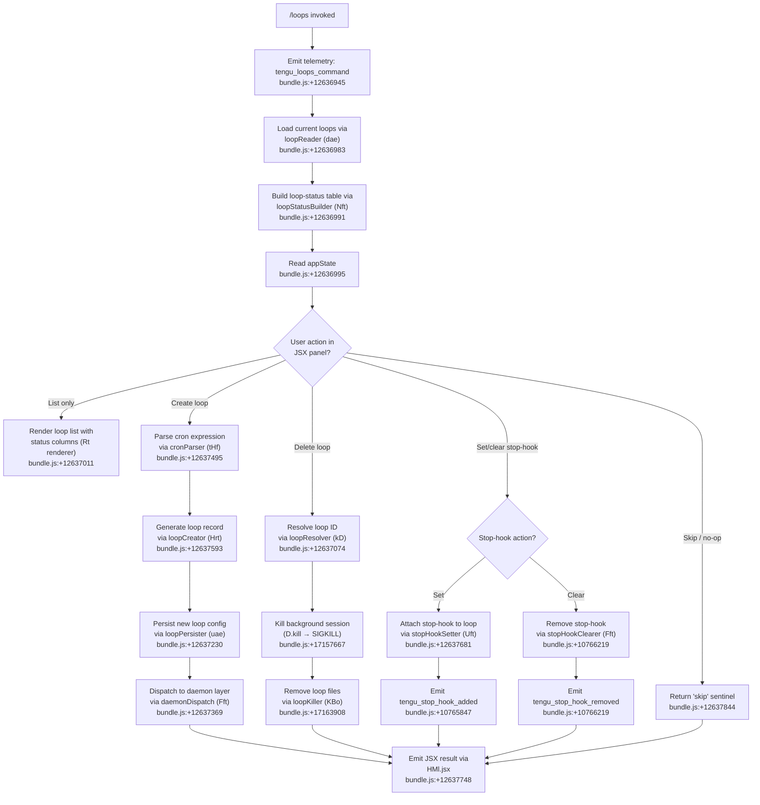

# `/loops`

> Analysis basis: CC v2.1.186 bundle.js (AST extraction + Claude interpretation)
> Minimum version: v2.1.186

---

## Overview

`/loops` is a local JSX command that lets users **list, create, and delete loops** — background scheduled tasks (background sessions driven by cron expressions). The command renders an interactive UI panel immediately upon invocation (`immediate: true`) and coordinates with the background-session daemon layer to manage loop lifecycle, including cron-schedule parsing, stop-hook management, and daemon dispatch.

---

## Registration

| Field | Value |
|---|---|
| type | `local-jsx` |
| name | `loops` |
| description | `List, create, and delete loops` |
| loc_byte | `12637978` |
| loc_byte_end | `12638135` |
| loc_line | `8558` |
| immediate | `true` |
| module_id | `gMl` |
| load_inline | `true` |
| arbor_handler.name | `nHf` |
| arbor_handler.fqn | `claude-2.1.186::nHf` |
| arbor_handler.kind | `AsyncFunction` |
| arbor_handler.resolution_path | `module_id` |
| arbor_handler.n_hits | `0` |

Analysis basis: CC v2.1.186 bundle.js:+12637978 – +12638135

---

## Input Branching

The handler presents more than three distinct operational branches (list, create loop, delete loop, manage stop-hook, dispatch daemon action), so a Mermaid flowchart is used.



---

## Behavioral Spec

### 1. Handler entry — `loopsCommandHandler` (nHf)

```
async function loopsCommandHandler(context):
    emit telemetry("tengu_loops_command")          // +12636945
    loops    = await loopReader(context)            // dae, +12636983
    statusMap = loopStatusBuilder(loops)            // Nft, +12636991
    appState = context.getAppState()                // +12636995
    rows     = loops.map(buildRow)                  // +12637023
    // Branch on user-selected action returned by JSX panel:
    result = await renderLoopsPanel(rows, appState) // HMl.jsx, +12637748
    return result
```

Analysis basis: CC v2.1.186 bundle.js:+12636943

---

### 2. Loop reader — `loopReader` (dae)

```
async function loopReader(context):
    rawConfig = await configFileReader(context)     // grt, +4919237
    loopList  = await loopIndexReader(context)      // fI, +4919273
    return merge(rawConfig, loopList)
```

The underlying config reader (`grt`) reads the loop configuration file with encoding `"utf-8"` (bundle.js:+4917277), handles filesystem errors including `ENOENT`, `EACCES`, `EPERM`, `ENOTDIR`, `ELOOP`, `ENAMETOOLONG`, `EROFS` (bundle.js:+183372 – +183461), and delegates path resolution through a path-join helper (`zhe` → `Ewn.join`, +4917180).

Analysis basis: CC v2.1.186 bundle.js:+4919237

---

### 3. Cron-expression parser — `cronParser` (tHf)

```
function cronParser(expression):
    parts = expression.match(cronPattern)           // +12636531
    minute = parseInt(parts[0])                     // +12636568
    // clamp minute to [0, 59]:
    minute = Math.max(0, Math.min(59, minute))      // +12636653, +12636710
    // compute next-run ceiling:
    nextRun = Math.ceil(minute / 60)                // +12636664
    nextRun = Math.round(nextRun)                   // +12636737
    // build schedule entry using s1 (scheduleBuilder):
    schedule = scheduleBuilder(expression)          // s1, +12636901
    return schedule

// scheduleBuilder (s1) calls qRd (rangeParser):
function scheduleBuilder(expr):
    trimmed = expr.trim()                           // +4913850
    ranges  = rangeParser(trimmed)                  // qRd, +4913936
    schedule.push(ranges)                           // +4913971

// rangeParser (qRd):
function rangeParser(expr):
    parts = expr.split(",")                         // +4913270
    for each part:
        match = part.match(rangeRegex)              // +4913290
        value = parseInt(match[1])                  // +4913335
        set.add(value)                              // +4913396
        // numeric bounds used: 10 (+4913349), 3 (+4913511), 6 (+4913547), 7 (+4913553)
    return Array.from(set)                          // +4913798
```

Named schedule presets found in literals: `"Every minute"` (bundle.js:+4915141), `"Every hour"` (bundle.js:+4915358), range notation `"1-5"` (bundle.js:+4916065).

Analysis basis: CC v2.1.186 bundle.js:+12636531

---

### 4. Loop creator — `loopCreator` (Hrt)

```
async function loopCreator(scheduleExpr, context):
    id        = crypto.randomUUID()                 // RBi.randomUUID, +4918577
    createdAt = Date.now()                          // +4918639
    meta      = buildLoopMeta(scheduleExpr)         // $de, +4918685
    config    = await configFileReader()            // grt, +4918729
    config.push(newLoopEntry)                       // a.push, +4918742
    await loopPersister(config, context)            // NPt via Hrt→NPt, +4918836
    await checkpointLog()                           // Rt, +4918774
    return newLoopEntry
```

The persister (`NPt`) creates the `.claude` directory (bundle.js:+4918418), writes the loop file via `ywn.writeFile` (+4918494), and joins paths with `Ewn.join` (+4918407).

Analysis basis: CC v2.1.186 bundle.js:+4918577

---

### 5. Loop resolver / status formatter — `loopResolver` (kD)

```
function loopResolver(input, loopMap):
    trimmed = input.trim()                          // +4915021
    match   = trimmed.match(idPattern)              // +4915162
    id      = parseInt(match[1])                    // +4915197
    entry   = loopMap.get(id)
    str     = entry.toString()                      // +4915395
    // compute next-schedule string:
    schedStr = formatSchedule(entry.cron)           // s.match, +4915432
    day = date.getUTCDay()                          // +4915898
    date.setUTCDate(...)                            // +4915917
    date.getUTCDate()                               // +4915930
    date.setUTCHours(0,0,0,0)                       // +4915948
    day = date.getDay()                             // +4915977
    return { id, entry, schedStr }
```

The loop type is always tagged `"cron"` (bundle.js:+12637041).

Analysis basis: CC v2.1.186 bundle.js:+4915021

---

### 6. Loop status builder — `loopStatusBuilder` (Nft)

```
function loopStatusBuilder(loops):
    statusMap = new Map()
    for each loop:
        col = columnFormatter(loop)                 // gRe, +9281950
        statusMap.set(loop.id, col)
    return statusMap

// columnFormatter (gRe) calls columnMapper (dGa):
function columnFormatter(loop):
    cols = loop => columnMapper(loop)               // dGa, +9281958
    // pads column values with "  " (two spaces) separator (+17183544)
    padded = col.padEnd(width)                      // o.padEnd, +17183523
    return padded
```

Analysis basis: CC v2.1.186 bundle.js:+10765160

---

### 7. Daemon dispatch — `daemonDispatch` (Fft) and `stopHookSetter` (Uft)

**Creating / updating a loop dispatches to the background-session layer:**

```
async function daemonDispatch(loop, context):
    renderer  = checkpointRenderer()                // Rt, +10765953
    statusMap = loopStatusBuilder(loop)             // Nft, +10765960
    appState  = context.getAppState()               // +10765964
    // append a goal message:
    context.applyMessageOp("append", goalMsg)       // +10766162
    newId = crypto.randomUUID()                     // _sl→hsl.randomUUID, +10766313
    context.setAppState(updated)                    // +10766093
    emit tengu_stop_hook_added / tengu_stop_hook_removed
    return rendered                                 // W, Ke, +10766217,+10766250
```

**Setting a stop-hook:**

```
async function stopHookSetter(hookExpr, context):
    policyReader = policySettingsReader()           // wEo→R2, +10765321
    trustGate    = checkTrustGate()                 // trust_gate literal, +10765411
    hooksGate    = checkHooksGate()                 // hooks_gate literal, +10765357
    appState     = context.getAppState()            // +10765546
    timestamp    = Date.now()                       // +10765710
    goalStatus   = buildGoalStatus()                // W_, +10765735
    context.setAppState(updated)                    // +10765748
    context.applyMessageOp("append", hookMsg)       // +10765790
    emit tengu_stop_hook_added                      // +10765847
    // If clearing: emit tengu_stop_hook_removed    // +10766219
    // Confirmation strings: "Stop hook set" (+12637705),
    //   "Stop hook not found" (+12637387),
    //   "Stop hook cleared" (+12637409)
```

Analysis basis: CC v2.1.186 bundle.js:+10765461, +10765832

---

### 8. Background-session kill path — `loopKiller` (KBo) and `bgSessionManager` (f → D)

```
async function loopKiller(loopId, context):
    // Attempt graceful stop:
    bgSession = sessionRegistry.get(loopId)        // n.get, +17157508
    emit W (logger)                                // +17157624
    bgSession.kill("SIGKILL")                      // D.kill, +17157667
    // SIGKILL escalation telemetry: tengu_bg_dispatch_sigkill_escalate (+17157626)
    // Remove loop state files:
    loopDir.rm(recursive)                          // wg.rm, +17163908
    loopDir.unlink(lockFile)                       // wg.unlink, +17164959
    // Roster cleanup:
    rosterEntry.delete(loopId)                     // t.rosterEntry, +17165231
    // Schedule deferred cleanup (300 000 ms timeout):
    setTimeout(cleanup, 300000)                    // +17165531
    // Final states observed: "done", "killed", "failed", "crashed",
    //   "blocked", "working", "bg", "daemon", "idle", "active"
    //   (bundle.js literals: +17163818, +17163836, +17163855, +17164002,
    //    +17164056, +17164163, +17164327, +17164652, +17164767, +4299479)
```

Low-memory guard in the background session dispatcher: when `os.freemem()` drops below threshold, telemetry `tengu_bg_dispatch_low_mem` fires (+17158227); on macOS this is further refined by `tengu_bg_low_mem_mb` (+13161365).

Spare-session pool telemetry: `tengu_bg_spare_enable` (+17158924), `tengu_bg_spare_claim` (+17159052), `tengu_bg_spare_claim_fail` (+17159318).

Analysis basis: CC v2.1.186 bundle.js:+17157508, +17163908

---

### 9. Loop persistence helper — `loopPersister` (uae / NPt)

```
async function loopPersister(loops, context):
    validated = loopFilter(loops)                   // qV, +4918907; filter, +4918965
    existing  = configFileReader()                  // grt, +4918956
    filtered  = existing.filter(not in validated)   // +4918965
    missing   = validated.filter(not in existing)   // n.has, +4918980
    await writeLoopFiles(missing, context)          // NPt, +4919029

// writeLoopFiles (NPt):
async function writeLoopFiles(loops, context):
    indexPath = jl(context)                         // jl, +4918386
    fs.mkdir(dir, {recursive:true})                 // ywn.mkdir, +4918397
    filePath  = Ewn.join(dir, id)                   // +4918407
    mapped    = loops.map(serialize)                // +4918458
    fs.writeFile(filePath, data)                    // ywn.writeFile, +4918494
    pathInfo  = zhe(filePath)                       // +4918508
    encoded   = De(data)                            // JSON.stringify, +4918515
```

Analysis basis: CC v2.1.186 bundle.js:+12637230, +4918907

---

## State & Side Effects

| Item | Detail |
|---|---|
| Telemetry — primary | `tengu_loops_command` (bundle.js:+12636945) |
| Telemetry — stop-hook added | `tengu_stop_hook_added` (+10765847) |
| Telemetry — stop-hook removed | `tengu_stop_hook_removed` (+10766219) |
| Telemetry — SIGKILL escalation | `tengu_bg_dispatch_sigkill_escalate` (+17157626) |
| Telemetry — daemon control | `tengu_daemon_control` (+17194642) |
| Telemetry — daemon config reload | `tengu_daemon_config_reload` (+17173497) |
| Telemetry — scheduled task missed | `tengu_scheduled_task_missed` (+16616739) |
| Telemetry — low memory dispatch | `tengu_bg_dispatch_low_mem` (+17158227); `tengu_bg_low_mem_mb` (+13161392) |
| Telemetry — spare session | `tengu_bg_spare_enable` (+17158924); `tengu_bg_spare_claim` (+17159052); `tengu_bg_spare_claim_fail` (+17159318) |
| Telemetry — daemon BG session create | `tengu_daemon_bg_session_create` (+17157942) |
| Telemetry — sendclaim failed | `tengu_bg_sendclaim_failed` (+17133905) |
| Telemetry — BG state read transient | `tengu_bg_state_read_transient` (+4291631) |
| Telemetry — feature flags | `tengu_feature_ok` (+1024705); `tengu_feature_bad` (+1024772); `tengu_feature_sad` (+1024853) |
| Telemetry — MCP skills | `tengu_mcp_skills` (+6640736) |
| appState changes | `setAppState` called on loop create, stop-hook set/clear; `applyMessageOp("append", ...)` used to inject goal messages |
| Filesystem | Writes loop config under `.claude` directory; creates `daemon.status.json`; uses `pins.json` for pin tracking; cleans up with `rm`/`unlink` on delete |
| Hook registration | Stop-hook expressions parsed and stored; clearing uses `"stophook"` key (+12637127) |
| Session registry | Background sessions tracked in an in-memory Map; entries added on create, removed (with 300 000 ms deferred cleanup) on delete |
| Send-claim timeout | 5 000 ms claim timeout for daemon socket (+17134339); 500 ms retry backoff (+17134543) |
| Kill signals | SIGKILL issued to background session process on loop delete (+17157667); SIGTERM used for graceful socket teardown (+17134143) |
| Sound | <!-- TODO: not found in depth-2 traversal; needs --depth 4 --> |

---

## Version History

| Version | Change |
|---|---|
| v2.1.186 | Initial analysis |

---

## Common Mistakes

1. **Confusing loops with plain `/run` invocations** — loops are persistent background sessions driven by cron expressions; they persist across CLI restarts and require explicit deletion via `/loops`.
2. **Malformed cron expressions** — the parser (`tHf`) expects standard minute/hour fields; range notation `1-5` is supported, but values outside `[0, 59]` for minutes or `[0, 23]` for hours are clamped or rejected.
3. **Deleting a loop without waiting for SIGKILL confirmation** — the kill path issues SIGKILL immediately but schedules a 300 000 ms deferred roster cleanup; inspecting loop state immediately after deletion may still show the entry as `"killed"` rather than fully removed.
4. **Expecting stop-hooks to survive loop deletion** — stop-hook data is stored alongside the loop record and is removed atomically when the loop is deleted; there is no separate stop-hook store.
5. **Ignoring the `.claude` directory requirement** — loop config files are written inside `.claude`; if the working directory is read-only, `EACCES`/`EROFS` errors will prevent creation without a clear user-facing message beyond the filesystem error code.
6. **Assuming the daemon is always running** — if the background daemon is not reachable, `tengu_bg_sendclaim_failed` fires and loop dispatch silently fails; verify the daemon is active before creating time-sensitive loops.

---

## Appendix — Identifier Mapping

> For bundle debugging only. Identifiers change across versions.

| Identifier | Role |
|---|---|
| `nHf` | Main async handler for `/loops` command (loopsCommandHandler) |
| `W` | General logging / warning emitter |
| `dae` | Loop reader — loads loop list and config (loopReader) |
| `grt` | Config file reader — reads loop config JSON from disk |
| `Gt` | Path/config getter utility |
| `zhe` | Path info resolver (joins and inspects paths) |
| `jl` | Loop index path resolver |
| `zo` | Error code classifier |
| `mn` | Low-level error constructor / messenger |
| `Re` | Config-reload orchestrator |
| `ao` | Error wrapper (wraps native Error with String) |
| `ot` | String coercion utility |
| `Ki` | Essential-traffic insertion helper |
| `Pnu` | Queue shift/push helper (ring-buffer style) |
| `T` | Token / content-block formatter |
| `Pvc` | Content-part builder |
| `De` | JSON serializer (JSON.stringify wrapper) |
| `Lc` | String redaction / sanitizer (inserts `[REDACTED]`) |
| `eze` | Whitespace/control-character cleaner |
| `Fvc` | File content reader with byte-length guard |
| `s1` | Schedule builder (builds schedule entry from expression) |
| `qRd` | Range parser (parses cron range notation like `1-5`) |
| `fI` | Loop index file reader |
| `GL` | Global logger / event emitter |
| `Nft` | Loop status builder (builds column status map) |
| `gRe` | Column formatter (formats status columns) |
| `dGa` | Column mapper (maps loop entries to display columns) |
| `Rt` | Checkpoint / log renderer |
| `kD` | Loop resolver and schedule-string formatter |
| `f` | Background session manager (per-session dispatch controller) |
| `D` | Background session subprocess spawner / lifecycle controller |
| `d` | Subprocess write / IPC handler |
| `_Q` | Config change detector |
| `NPt` | Loop file writer (persists new loop files to `.claude`) |
| `PBi` | Loop filter (filters loop list by condition) |
| `H` | Stream reader / buffer handler (reads subprocess stdout) |
| `u` | Daemon stop controller |
| `x` | Subprocess event router |
| `g` | Subprocess timeout scheduler |
| `Mdc` | Loop display table builder (formats loop list as text table) |
| `uae` | Loop persister / synchronizer (syncs loop configs to disk) |
| `Bn` | Abort/timeout utility (handles abort and clearTimeout) |
| `c` | IPC channel helper (`bn` wrapper) |
| `xe` | Feature-bad event emitter |
| `Pe` | Feature-event helper (wraps `KVe`) |
| `ke` | Feature-ok event emitter |
| `IXn` | macOS memory checker |
| `it` | Permission / trust-gate checker |
| `D2e` | Pin-file reader/writer (reads `pins.json`, handles loop pinning) |
| `dDt` | Pin path resolver (`ay.join` + `Wk`) |
| `Bt` | JSON parser wrapper |
| `kn` | Error-code normalizer |
| `YTd` | Directory scanner (reads loop directory entries recursively) |
| `N` | Session retirement controller |
| `Zut` | Session result classifier (`allow`/`deny`/`warn`/`classify`) |
| `J5` | Session retirement executor |
| `$Bo` | Daemon claim sender (sends claim frame over Unix socket) |
| `MOo` | Daemon session writer (writes session JSON to disk) |
| `pYf` | Claim-send timeout handler (5 000 ms timeout) |
| `dYf` | Claim frame builder |
| `Jd` | Error messenger |
| `Ae` | String coercion helper |
| `gR` | Binary frame encoder (Buffer + UInt32BE/UInt8 framing) |
| `KBo` | Loop killer / session teardown orchestrator |
| `ec` | Loop path resolver (`ay.join` + `Wk`) |
| `Oi` | Loop state file reader/writer (reads state, updates cache) |
| `fg` | Active-state checker |
| `ive` | Loop context builder (builds context passed to daemon) |
| `kd` | Loop metadata formatter |
| `jmt` | Task scheduler / missed-task detector |
| `QWt` | Session path builder (join + `XWt`) |
| `dye` | Session directory builder |
| `yR` | Session heartbeat reader (`pHl`) |
| `nN` | Session roster entry builder |
| `rM` | Session "late" checker (`pHl`) |
| `JWt` | Session lock-file path builder |
| `p` | Forced-shutdown handler (`process.exit` + abort) |
| `Kb` | Shutdown logger |
| `$` | Disposable / cleanup handle |
| `m` | Session kill-all iterator |
| `l` | Session log writer (`QNl` wrapper) |
| `QNl` | Daemon status logger (writes `daemon.status.json`) |
| `Xs` | AsyncLocalStorage store accessor |
| `zqt` | Daemon status path builder (`JNl.join`) |
| `h` | Date/time calculator for schedule formatting |
| `Fft` | Daemon dispatch / goal-message injector |
| `_sl` | UUID generator wrapper (`hsl.randomUUID`) |
| `Ke` | UI render helper (`KVe` wrapper) |
| `KVe` | Core UI primitive |
| `tHf` | Cron-expression parser (cronParser) |
| `Hrt` | Loop creator (generates new loop record with UUID + timestamp) |
| `$de` | Loop metadata builder |
| `a` | MCP manager / server connection orchestrator |
| `Z3e` | MCP server connector |
| `TB` | MCP tool capability checker |
| `Xw` | MCP schema validator |
| `Wn` | Prompt renderer |
| `yUt` | MCP update filter |
| `fca` | MCP connection executor |
| `X_n` | MCP auth handler |
| `j_n` | MCP auth fallback |
| `ln` | MCP debug logger |
| `wRn` | MCP retry controller |
| `SUt` | MCP connection result applier |
| `PXr` | MCP error reporter |
| `Qw` | MCP skills telemetry emitter |
| `EXr` | MCP capability filter |
| `w` | MCP reconnect backoff scheduler |
| `Wc` | MCP error logger |
| `_ca` | MCP connection cache clearer |
| `nit` | MCP integer parser (parseInt wrapper) |
| `Oxn` | MCP retry-count parser |
| `arr` | MCP connection result applier |
| `Q3e` | MCP tool list updater |
| `WT` | MCP cleanup orchestrator |
| `maa` | MCP server capabilities reader |
| `AJr` | MCP server capabilities parser |
| `q2o` | MCP multi-server synchronizer |
| `fRn` | MCP tool filter (checks `Q8d`/`wXr` sets) |
| `eit` | MCP server cleanup helper |
| `Uft` | Stop-hook setter (sets stop-hook on loop) |
| `wEo` | Policy settings reader |
| `R2` | Policy settings builder |
| `In` | Policy resolver |
| `Qse` | Policy scope builder |
| `Lr` | Trust/permission logger |
| `wd` | Trust-gate evaluator |
| `Txf` | Gate result formatter |
| `Mt` | UI message builder |
| `W_` | Goal-status builder (`pKe` + `Object.values`) |

---

Note: index built via Arbor fallback; some signals (telemetry, literals) may be missing — see arbor-fallback.js.