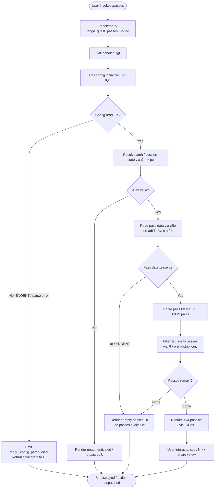

# `/passes`

> Analysis basis: CC v2.1.186 bundle.js (AST extraction + Claude interpretation)
> Minimum version: v2.1.186

---

## Overview

The `/passes` command enables users to share a free week of Claude Code with friends by displaying and managing guest pass entitlements. It is implemented as a local JSX component (`local-jsx` type) that renders an interactive UI for viewing, sharing, or copying guest pass links. The command fires a telemetry event on every visit and delegates pass retrieval and state management to an async handler (`Dgf`) that interacts with the configuration layer and background-session infrastructure.

---

## Registration

| Field | Value |
|---|---|
| type | `local-jsx` |
| name | `passes` |
| description | `Share a free week of Claude Code with friends` |
| loc_byte | `12587051` |
| loc_byte_end | `12587373` |
| loc_line | `8460` |
| isHidden | `null` (not hidden) |
| module_id | `wxl` |
| load_inline | `true` |
| arbor_handler.name | `Dgf` |
| arbor_handler.fqn | `claude-2.1.186::Dgf` |
| arbor_handler.kind | `AsyncFunction` |
| arbor_handler.resolution_path | `module_id` |
| arbor_handler.n_hits | `2` |

Analysis basis: CC v2.1.186 bundle.js:+12587051

---

## Input Branching

The command has 3+ distinct state branches (config read outcome, pass availability states, and UI rendering paths), so a Mermaid flowchart is used.



Analysis basis: CC v2.1.186 bundle.js:+12586744, +12586778, +12586784, +12586882, +12586933

---

## Behavioral Spec

### 1. Entry Point — Handler `Dgf` (AsyncFunction)

`Dgf` is the top-level async handler resolved via `module_id` → `wxl`. It is called when the user invokes `/passes`.

```
async function guestPassesHandler(context):
    fireEvent("tengu_guest_passes_visited")          // always-first side effect
    configData  = await initConfig(context)          // _n / IQn path
    sessionInfo = await resolveSession(context)      // Gjn → pc → wt path
    warning     = buildWarning(context)              // W helper
    ui          = renderJSX(configData, sessionInfo) // Lxl.jsx
    return ui
```

Analysis basis: CC v2.1.186 bundle.js:+12586744, +12586778, +12586784, +12586882, +12586933

---

### 2. Config Initialization — `_n` / `IQn`

`_n` is the config namespace dispatcher; `IQn` is the concrete config initializer it delegates to. `IQn` performs the following steps:

```
function initConfig(context):
    dir = path.dirname(configPath)
    fs.mkdirSync(dir, { recursive: true })

    acquireFileLock(configPath)
    // If lock takes too long:
    //   emit("tengu_config_lock_contention")
    //   log: "Lock acquisition took longer than expected…"

    stat = fs.statSync(configPath)  // check existence

    if stat missing:
        writeDefaultConfig(configPath)  // BTt / atomic-write path
    else:
        existing = readAndParseConfig(configPath)  // cEe path
        if existing.auth missing AND cache has auth:
            emit("tengu_config_auth_loss_prevented")
            // log: "saveConfigWithLock: re-read config is missing auth…"
            refuse write, return cached config
        rotateBackups(configPath, maxBackups=5)   // IQn → BTt backup rotation
        writeConfig(configPath, merged)           // atomic write via BTt

    return parsedConfig
```

Key literals observed:
- Backup sub-directory name: `"backups"` (bundle.js:+13852069)
- Backup filename marker: `".backup."` (bundle.js:+13851354)
- Maximum backup rotation count: `5` (bundle.js:+13851487)
- Default file permissions: `384` (octal `0o600`) (bundle.js:+13851769)
- Lock-contention warning text fragment: `"Lock acquisition took longer than expected…"` (bundle.js:+13850468)

Analysis basis: CC v2.1.186 bundle.js:+13847130, +13850263, +13850284, +13850329, +13851246, +13851727

---

### 3. Config File Read — `cEe`

`cEe` reads and parses an individual config file. It is called both from `IQn` (global config) and from `_n` (pass data file).

```
function readConfigFile(filePath):
    if not configAccessAllowed():
        throw Error("Config accessed before allowed.")  // literal at +13852501

    rawText = fs.readFileSync(filePath, "utf-8")        // encoding: "utf-8" (+13852584)

    parsed  = safeJsonParse(rawText)                    // Bt → JSON.parse

    if parsed is undefined or parse failed:
        emit("tengu_config_parse_error")                // +13853132
        return defaultConfig

    prefixedKeys = filterPrefixedKeys(parsed)           // i9 → e.startsWith / e.slice

    backupDir = resolveBackupDir(filePath)              // HGl → _Oo → SS.join("backups")

    if ENOENT on backupDir:
        fs.mkdirSync(backupDir, { recursive: true })

    return parsed
```

Error codes observed: `"ENOENT"` (+13852731), `"EEXIST"` (+13853346), `"error"` (+13853052)

Analysis basis: CC v2.1.186 bundle.js:+13852495, +13852501, +13852542, +13852557, +13852604, +13852607, +13852723, +13852731

---

### 4. Session Resolution — `Gjn` → `pc` → `wt`

`Gjn` resolves the active session context, which is needed to determine whether the user is authenticated and thus eligible to hold or share guest passes.

```
function resolveSessionContext(context):
    profile = determineAuthProfile(context)  // ny → iA chain
    // Profile types observed: "profile-implicit", "user_oauth",
    //                         "firstParty", "claude-desktop-3p"

    if profile == "none":
        requireAnyAuth()
        // Error if none: "ANTHROPIC_API_KEY, ANTHROPIC_AUTH_TOKEN,
        //                 CLAUDE_CODE_OAUTH_TOKEN, or WIF env vars … required"
        //                 (+3053426)

    session = fetchOrCreateSession(profile)  // wt
    return session
```

Analysis basis: CC v2.1.186 bundle.js:+12233834, +12233882, +3049282, +3049658, +3049731, +3052957, +3053090, +3053426

---

### 5. Pass List Parsing and Filtering — `i9`

After the raw pass data is parsed from JSON, `i9` filters the key set to extract valid pass identifiers.

```
function filterPassKeys(parsedObject):
    result = []
    for key in Object.keys(parsedObject):
        if key.startsWith(PASS_PREFIX):
            result.push(key.slice(PASS_PREFIX.length))
    return result
```

The prefix check uses `e.startsWith` (+1187381) and `e.slice` (+1187404). The exact prefix string is not surfaced at depth-2 traversal; <!-- TODO: not found in depth-2 traversal; needs --depth 4 -->

Analysis basis: CC v2.1.186 bundle.js:+13852607, +1187381, +1187404

---

### 6. JSX Render — `Lxl.jsx`

The final render step builds the JSX tree returned to the CLI renderer.

```
function renderPassesUI(passes, sessionInfo, configData):
    if passes is empty:
        return <EmptyPassesView />
    return <PassListView
               passes={passes}
               session={sessionInfo}
               config={configData}
           />
```

The `Lxl.jsx` call is the only JSX emission from `Dgf` directly.

Analysis basis: CC v2.1.186 bundle.js:+12586933

---

### 7. Atomic Config Write — `BTt`

`BTt` implements safe, atomic file writes used when persisting updated config (including after pass redemption state changes).

```
function atomicWriteFile(targetPath, content):
    tempPath = targetPath + "." + randomHex(8)   // p_r.randomBytes hex (+1099779, "hex" +1099807)

    fd = fs.openSync(tempPath, flags)
    fs.writeFileSync(fd, content)
    fs.fchmodSync(fd, originalPermissions)        // preserve mode (+1100282)
    // log: "Applied original permissions to temp file" (+1100303)
    fs.fsyncSync(fd)
    fs.closeSync(fd)

    try:
        fs.renameSync(tempPath, targetPath)       // atomic swap (+1100638)
    catch EACCES:
        // fallback in-place write
        // log: "writeFileSyncAndFlush: in-place fallback write failed…" (+1101593)
        throw

    if targetPath in symlinkCache:
        fs.unlinkSync(symlinkCache[targetPath])   // clean up stale symlink (+1100961)
```

Analysis basis: CC v2.1.186 bundle.js:+1099131, +1099779, +1100220, +1100282, +1100429, +1100638, +1100788, +1100961

---

## State & Side Effects

| Item | Detail |
|---|---|
| Telemetry — `tengu_guest_passes_visited` | Fired unconditionally on every `/passes` invocation (bundle.js:+12586884) |
| Telemetry — `tengu_config_parse_error` | Fired when the config or pass-data file fails JSON parsing (bundle.js:+13853132) |
| Telemetry — `tengu_config_lock_contention` | Fired when the config file lock takes longer than expected (bundle.js:+13850557) |
| Telemetry — `tengu_config_stale_write` | Fired when a stale write is detected and suppressed (bundle.js:+13850693) |
| Telemetry — `tengu_config_auth_loss_prevented` | Fired when a write is refused to avoid wiping auth credentials (bundle.js:+13851036) |
| Telemetry — `tengu_config_fallback_write` | Fired when a fallback write path is taken (bundle.js:+13850173) |
| Config file reads | `cEe` reads config via `r.readFileSync` with `"utf-8"` encoding |
| Config file writes | `BTt` performs atomic write with `renameSync`; falls back to in-place write on `EACCES` |
| Backup rotation | Up to 5 backups kept in a `"backups"` sub-directory; files identified by `".backup."` marker |
| File permissions | Written with mode `384` (octal `0o600`) |
| Session state | `Gjn` / `pc` / `wt` resolve the active user session; no persistent mutation |
| JSX output | `Lxl.jsx` renders the pass list or empty state into the CLI UI |
| appState changes | <!-- TODO: not found in depth-2 traversal; needs --depth 4 --> |
| Sound | None observed |
| Hook registration | `Ai` → `O5o.register` called within the file-watch path (`Lxf`); not directly triggered by `/passes` invocation |

---

## Version History

| Version | Change |
|---|---|
| v2.1.186 | Initial analysis |

---

## Common Mistakes

1. **Invoking `/passes` without authentication** — The command requires a valid auth token (`ANTHROPIC_API_KEY`, `ANTHROPIC_AUTH_TOKEN`, `CLAUDE_CODE_OAUTH_TOKEN`, or WIF environment variables). Without authentication the session resolution step fails and no passes are displayed.

2. **Corrupted or non-JSON pass data file** — If the pass data file on disk is not valid JSON, the command emits `tengu_config_parse_error` and silently falls back to a default (empty) state rather than surfacing a user-visible error. Users may incorrectly conclude they have no passes when the file is simply malformed.

3. **Concurrent Claude Code instances writing config** — The config lock contention path logs a warning (`"Lock acquisition took longer than expected…"`) but does not block the UI. A second concurrent write may trigger `tengu_config_stale_write` and be dropped silently.

4. **Expecting `/passes` to consume or redeem a pass** — Based on the call graph, the command is a viewer/sharer; actual pass redemption is handled elsewhere. Invoking `/passes` alone does not deduct from the pass pool.

5. **Symlink-backed config paths** — `BTt` contains special handling for symbolic-link targets (`r.readlinkSync`, `Cf.isAbsolute`, `Cf.resolve`). Placing the Claude config under a symlink may trigger the fallback write path and log spurious warnings.

---

## Appendix — Identifier Mapping

> For bundle debugging only. Identifiers change across versions.

| Identifier | Role |
|---|---|
| `Dgf` | Top-level async handler for `/passes` (entry point resolved via `module_id: wxl`) |
| `wt` | Session / task orchestrator called by `Dgf` and `IQn`; coordinates file-watch and dispatch |
| `Gt` | General-purpose guard / assertion utility used across config and backup paths |
| `mOo` | Miscellaneous output helper used in session orchestrator |
| `cEe` | Config file reader: reads, parses, and validates a config JSON file |
| `r` | Node.js `fs` module wrapper (synchronous read/write operations) |
| `Ts` | CLI error reporter; calls `process.exit` on fatal errors |
| `Bt` | Safe JSON parse wrapper (`JSON.parse`) |
| `i9` | Pass-key prefix filter: `startsWith` + `slice` to extract pass identifiers |
| `e` | Context or event object (multi-role, context-dependent) |
| `t` | Generic parameter / config record (multi-role) |
| `mn` | Logging / diagnostic utility |
| `HGl` | Backup-directory resolver: uses `SS.basename`, `_Oo`, `readdirStringSync` |
| `_Oo` | Path join helper for backup directory construction |
| `a` | Internal map/cache accessor (multi-role) |
| `l` | Prefix-filter iterator variable (multi-role) |
| `T` | HTTP/API request builder; includes debug, redaction, and content-type logic |
| `Pvc` | Request pipeline sub-component (calls `YP`, `lcr`, `U5o`) |
| `De` | JSON stringify wrapper |
| `Lc` | URL / path string normalizer with redaction (`[REDACTED]`) |
| `eze` | Additional request encoding helper |
| `Fvc` | Full HTTP request executor: byte-length, promise chain, buffer handling |
| `W` | Warning / error display utility |
| `f` | Background-session worker / daemon IPC handler |
| `n` | Map or collection (multi-role, context-dependent) |
| `D` | Background job scheduler / task tracker |
| `Bn` | Abort-with-timeout helper (`setTimeout` / `clearTimeout`) |
| `xe` | Feature-flag bad-state reporter (`tengu_feature_bad`) |
| `ke` | Feature-flag ok-state reporter (`tengu_feature_ok`) |
| `IXn` | macOS-specific memory / platform check helper |
| `D2e` | Async file cleanup / lstat + rm utility |
| `Re` | Error aggregation and logging utility |
| `N` | Session retirement checker (`retireIfSettled`) |
| `it` | IPC message dispatcher / task-map manager |
| `$Bo` | Daemon socket claim and connect helper |
| `KBo` | Background job lifecycle manager (spawn, retire, kill, resume) |
| `s` | Secondary lifecycle manager (alias / subset of `KBo` paths) |
| `p` | Forced-shutdown helper (`process.exit`, `u.abort`) |
| `Pe` | KV-store / feature registry accessor |
| `$` | Disposable resource handle |
| `Lxf` | File-watch loop: `AQn.watchFile` / `unwatchFile`, re-reads config on mtime change |
| `aV` | Watch-loop auxiliary variable |
| `Ai` | Hook / listener registration shim (`O5o.register`) |
| `Gjn` | Session context resolver; delegates to `pc` and `wt` |
| `pc` | Profile constructor: calls `ny` (auth bootstrap) and `wt` |
| `ny` | Auth profile negotiator: `Ud`, `iA`, `Nl`, `Wg`, `Dkt`, `XQe` |
| `Ud` | CLI argument parser bootstrap (`--bare` flag) |
| `iA` | OAuth / first-party auth initializer |
| `Nl` | First-party profile marker (`"firstParty"`) |
| `nT` | Auth-config field accessor |
| `Wg` | Auth-flow orchestrator; calls `wt` when session ready |
| `Dkt` | Auth delegation helper using `XQe` |
| `XQe` | Auth context object constructor |
| `_n` | Config namespace dispatcher; routes to `IQn` |
| `IQn` | Concrete config initializer: mkdir, lock, stat, read, backup, write |
| `RGs` | Config merge helper (`ERr` + `Object.assign`) |
| `ERr` | Config field extractor / defaults applier |
| `EHt` | Error handler for config write failures |
| `I` | Scroll / viewport calculator (`Math.max`, `Math.floor`, `preventDefault`) |
| `x` | Input event handler / supervisor write path |
| `A` | Viewport bounds helper (`Math.max`, `Math.min`) |
| `H` | IPC framing layer: buffer concat, subarray, message dispatch |
| `g` | Socket stream with timeout |
| `m` | Worker kill utility |
| `fp` | IPC frame encoder / end-of-stream helper |
| `bYf` | Full daemon protocol handler: ping, nudge, yield, attach, resize, snapshot, etc. |
| `Ae` | String coercion utility |
| `BTt` | Atomic file write utility: temp → fsync → rename → chmod |
| `Fd` | Real-path resolver (`realpathSync`) |
| `u` | Abort-controller / signal object |
| `kn` | Error-code normalizer |
| `i` | Stream close/end pair |
| `l7e` | Filesystem error-code filter (EINVAL, ENOTSUP, EPERM, ENOSYS) |
| `fDe` | Config field descriptor / default values provider |
| `hOo` | Config entry iterator (`Object.entries`) |
| `TKt` | Timestamp recorder (`Date.now`) |
| `TQn` | Global config save helper: dirname, BTt write, fallback log |