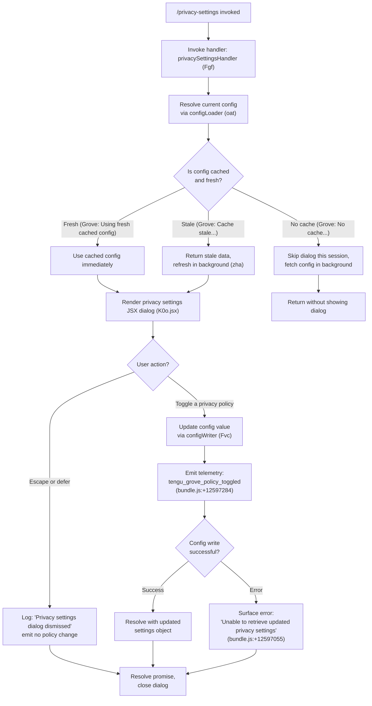

# `/privacy-settings`

> Analysis basis: CC v2.1.186 bundle.js (AST extraction + Claude interpretation)
> Minimum version: v2.1.186

---

## Overview

The `/privacy-settings` command opens an interactive JSX dialog that displays the user's current privacy configuration and allows them to toggle privacy-related policy settings. It is implemented as a `local-jsx` command, meaning it renders a React component directly in the terminal UI rather than sending a prompt to the model. Upon dismissal or change, relevant configuration is persisted and a telemetry event is emitted.

---

## Registration

| Field | Value |
|---|---|
| type | `local-jsx` |
| name | `privacy-settings` |
| description | `View and update your privacy settings` |
| module_id | `Dxl` |
| load_inline | `true` |
| loc_byte | `12597728` |
| loc_byte_end | `12597911` |
| loc_line | `8470` |
| arbor_handler.name | `Fgf` |
| arbor_handler.fqn | `claude-2.1.186::Fgf` |
| arbor_handler.kind | `AsyncFunction` |
| arbor_handler.resolution_path | `module_id` |
| arbor_handler.n_hits | `0` |

Analysis basis: CC v2.1.186 bundle.js:+12597728

---

## Input Branching

The handler has 4+ distinct paths depending on: (1) whether configuration data is already cached and fresh, (2) whether the dialog is dismissed vs. a setting is changed, (3) whether the config write succeeds or an error occurs, and (4) whether a Grove policy toggle telemetry event fires. A Mermaid flowchart is used.



---

## Behavioral Spec

### Handler Entry — `privacySettingsHandler` (`Fgf`)

The Arbor-resolved handler is `Fgf` (AsyncFunction), reached via `module_id` → `Dxl`.

```
async function privacySettingsHandler(context):
    # Parallel initialization
    await Promise.all([
        loadSettings(context),   // Uee
        loadP0eSidecar(context)  // p0e
    ])

    # Load current configuration through the caching layer
    configData = await configLoader(context)   // oat

    if configData is absent:
        # No cache available — skip dialog for this session
        log("Grove: No cache, fetching config in background (dialog skipped this session)")
        return

    # Render interactive JSX privacy settings dialog
    result = await renderJSXDialog(K0o.jsx, configData, settingsKey="settings")

    if result.action in ["escape", "defer"]:
        log("Privacy settings dialog dismissed")
        return

    # User changed a setting — persist and emit telemetry
    updatedConfig = await writeConfig(result.newSettings)   // configWriter (Fvc)
    emitTelemetry("tengu_grove_policy_toggled")

    return updatedConfig
```

Analysis basis: CC v2.1.186 bundle.js:+12596739, +12596779, +12596792, +12596798, +12596903, +12596917, +12596928, +12597284, +12597395

---

### Config Loading with Caching — `configLoader` (`oat`)

The config loader reads from a layered cache (called "Grove" in internal log strings) and applies freshness logic before returning data.

```
async function configLoader(context):
    localConfig  = readLocalConfig(configReader)      // DFe → Di
    projectConfig = readProjectConfig(configReader)   // DFe → yo
    mergedConfig  = mergeConfigs(localConfig, projectConfig)  // DFe → cai

    # Start file-watching for config changes
    watchConfig(fileWatcher)   // pc → wt → Lxf

    cacheAge = Date.now() - cache.timestamp

    if cache exists and cacheAge < freshnessThreshold:
        log("Grove: Using fresh cached config")
        return cache.data

    if cache exists and cacheAge >= freshnessThreshold:
        log("Grove: Cache stale, returning cached data and refreshing in background")
        triggerBackgroundRefresh(backgroundRefresher)   // zha
        return cache.data   # stale-while-revalidate

    # No usable cache
    log("Grove: No cache, fetching config in background (dialog skipped this session)")
    triggerBackgroundRefresh(backgroundRefresher)   // zha
    return null
```

Analysis basis: CC v2.1.186 bundle.js:+7225386, +7225407, +7225446, +7225475, +7225499, +7225501, +7225621, +7225727

---

### Background Config Refresh — `backgroundRefresher` (`zha`)

When a cache miss or stale cache is detected, a background task fetches the latest configuration and writes it back to the cache without blocking the dialog render path.

```
async function backgroundRefresher(context):
    loadSidecar(p0e)
    freshData = await readConfigFromDisk(fileWatcher)   // wt
    timestamp = Date.now()
    writeToGlobalConfig(globalConfigWriter)             // _n → IQn
    log("save_global", timestamp)
    emitToUI(T)
```

Analysis basis: CC v2.1.186 bundle.js:+7225581, +7225817, +7225873, +7225925, +7225960, +7226071

---

### Config Persistence — `configWriter` (`Fvc`)

Writes updated privacy settings to the on-disk configuration file, using locking, rotation, and backup logic to prevent data loss.

```
async function configWriter(newSettings):
    configPath = resolveConfigPath(pathResolver)        // npe, TWo
    currentSize = Buffer.byteLength(serialize(newSettings))

    # Backup rotation: keep up to 5 backups, name with ".backup." suffix
    rotateBackups(backupRotator, configPath, maxBackups=5)   // pcr

    # Atomic write via append + rename
    mkdir(configDir, recursive=true)                    // Uvc → SN.mkdir
    appendToTemp(tempFile, content)                     // Uvc → SN.appendFile
    renameToFinal(tempFile, configPath)                 // pcr → SN.rename

    # Register crash-safety atexit hook
    registerAtExit(atExitRegistrar)                     // Ai → O5o.register

    # Emit log with [REDACTED] masking for sensitive fields
    log(maskSensitive(newSettings))                     // Lc: replaces secrets with "[REDACTED]"
```

Constants:
- Backup suffix: `".backup."` (bundle.js:+13851354)
- Maximum backup count: `5` (bundle.js:+13851487)
- Lock timeout warning: `60000` ms (bundle.js:+13851238)
- Guard message for auth loss: `"saveConfigWithLock: re-read config is missing auth that cache has; refusing to write to avoid wiping ~/.claude.json. See GH #3117."` (bundle.js:+13850884)

Analysis basis: CC v2.1.186 bundle.js:+213720, +213745, +213753, +213783, +213873, +213890, +213922, +213928, +213961, +213987, +214083

---

### Global Config Write Guard — `globalConfigWriter` (`_n`)

Wraps all global config writes with an auth-loss prevention check. If the re-read config is missing authentication data that the in-memory cache has, the write is aborted to protect credentials.

```
async function globalConfigWriter(payload):
    acquireLock()
    reRead = readFromDisk()

    if cache.hasAuth and not reRead.hasAuth:
        log("saveGlobalConfig fallback: re-read config is missing auth that cache has; refusing to write. See GH #3117.")
        emitTelemetry("tengu_config_auth_loss_prevented")
        return

    writeAtomic(reRead, payload)    // IQn
    emitTag("save_global")
```

Analysis basis: CC v2.1.186 bundle.js:+13847130, +13847337, +13847583

---

### Local Config Reader — `localConfigReader` (`Di`)

Reads and parses the local `.claude.json` config file, normalizing tier values (`max`, `pro`) and checking for `ANTHROPIC_API_KEY` and `apiKeyHelper` settings.

```
function localConfigReader():
    raw = readFileSync(configPath, encoding="utf-8")    // cEe → r.readFileSync
    parsed = parseJSON(raw)
    normalizeFields(parsed, allowedTiers=["max", "pro"])  // DFe literals
    checkApiKey(parsed, key="ANTHROPIC_API_KEY", helper="apiKeyHelper")
    return parsed
```

Constants:
- Tier values: `"max"` (bundle.js:+3075452), `"pro"` (bundle.js:+3075463)
- API key env var: `"ANTHROPIC_API_KEY"` (bundle.js:+3050987)
- API key helper field: `"apiKeyHelper"` (bundle.js:+3051012)
- Config error guard: `"Config accessed before allowed."` (bundle.js:+13852501)
- File encoding: `"utf-8"` (bundle.js:+13852584)
- Missing file error: `"ENOENT"` (bundle.js:+13852731)

Analysis basis: CC v2.1.186 bundle.js:+3072833, +3072846, +3072856, +3075490, +3075502

---

### Error Rendering

If an error occurs when retrieving or writing settings:

```
function renderError():
    display("Unable to retrieve updated privacy settings")
    // literal at bundle.js:+12597055
```

Analysis basis: CC v2.1.186 bundle.js:+12597055

---

## State & Side Effects

| Item | Detail |
|---|---|
| Telemetry | `tengu_grove_policy_toggled` (emitted on every privacy policy toggle, bundle.js:+12597284) |
| Telemetry | `tengu_config_parse_error` (emitted on config file parse failure, bundle.js:+13853132) |
| Telemetry | `tengu_config_lock_contention` (emitted when lock acquisition is slow, bundle.js:+13850557) |
| Telemetry | `tengu_config_stale_write` (emitted when a stale write is detected, bundle.js:+13850693) |
| Telemetry | `tengu_config_auth_loss_prevented` (emitted when write is aborted to protect auth, bundle.js:+13851036) |
| Telemetry | `tengu_config_fallback_write` (emitted on fallback write path, bundle.js:+13850173) |
| Telemetry | `tengu_daemon_config_reload` (emitted when daemon reloads config, bundle.js:+17173497) |
| Hook registration | `Ai → O5o.register`: registers an atexit/crash-safety hook for config write integrity (bundle.js:+214083) |
| File watching | `Lxf → AQn.watchFile` / `AQn.unwatchFile`: watches config file for external changes; unwatches on cleanup (bundle.js:+13848652, +13848985) |
| Config file mutation | Writes updated settings to `~/.claude.json` (global config) with atomic rename and backup rotation |
| Backup files | Creates up to 5 rolling backups using `".backup."` suffix (bundle.js:+13851354, +13851487) |
| Sensitive field masking | Log output replaces sensitive values with `"[REDACTED]"` (bundle.js:+205649) |
| Dialog dismissal | When user presses Escape or selects "defer", logs `"Privacy settings dialog dismissed"` (bundle.js:+12596928); no config change is written |
| appState changes | Privacy policy toggle updates in-memory config state; UI receives updated state via `emitToUI` (`T`) |
| Sound | None detected |

---

## Version History

| Version | Change |
|---|---|
| v2.1.186 | Initial analysis |

---

## Common Mistakes

1. **Dismissing vs. saving**: Pressing Escape (action `"escape"`) or selecting defer (action `"defer"`) dismisses the dialog without persisting any change. Users expecting settings to be saved by simply opening the dialog will see no effect.
2. **Config locked by another instance**: If another Claude Code instance is running simultaneously, lock contention may trigger a `tengu_config_lock_contention` event and delay the write. The warning threshold is 60 000 ms (bundle.js:+13851238).
3. **Stale-while-revalidate behavior**: When the config cache is stale, the dialog renders with potentially outdated values while the refresh occurs in the background. The user's toggles apply on top of the stale snapshot, which is then reconciled.
4. **Auth-loss guard**: The system refuses to write a new config if the freshly read on-disk file is missing authentication data that the in-memory cache holds. This is a deliberate guard (GH #3117). Manually editing `~/.claude.json` to remove auth fields while Claude Code is running may trigger this block.
5. **No-cache session skip**: On very first invocations or after cache invalidation, the dialog may silently skip rendering (returning without showing any UI) while a background fetch is queued. Re-invoking `/privacy-settings` after a moment will succeed once the background fetch completes.

---

## Appendix — Identifier Mapping

> For bundle debugging only. Identifiers change across versions.

| Identifier | Role |
|---|---|
| `Fgf` | Main handler for `/privacy-settings` (AsyncFunction, arbor-resolved) |
| `oat` | Config loader with Grove caching layer |
| `DFe` | Config reader dispatcher (local + project merge) |
| `Di` | Local config file reader |
| `ALr` | Local config sub-reader helper A |
| `SLr` | Local config sub-reader helper B |
| `ny` | Config field normalizer / API key checker |
| `yo` | Project config reader |
| `l2` | Array inclusion check helper |
| `cai` | Config merge helper |
| `pc` | File-watch setup coordinator |
| `wt` | Config file watcher (reads + watches file) |
| `Gt` | General utility (likely path or env getter) |
| `mOo` | File watcher options builder |
| `cEe` | Low-level config file read/stat/backup helper |
| `Lxf` | File watch lifecycle manager (watchFile / unwatchFile) |
| `T` | Telemetry / UI emitter |
| `Pvc` | Telemetry payload builder |
| `U5o` | Telemetry sub-builder |
| `e` | Generic closure / iterator variable |
| `De` | JSON serializer wrapper |
| `t` | Generic closure / parameter |
| `Lc` | Sensitive field redactor (`[REDACTED]` masking) |
| `SWo` | Redaction map builder |
| `r` | Generic closure / file-system or array reference |
| `n` | Generic closure / string or collection |
| `eze` | stdout/stream writer |
| `cWo` | Raw stream write helper |
| `Fvc` | Config writer (atomic write + backup rotation) |
| `wKe` | Write queue / debouncer |
| `npe` | Config path resolver |
| `Rre` | Config directory setup helper |
| `TWo` | Final config path builder |
| `pcr` | Backup rotation handler (rename/unlink) |
| `Uvc` | Atomic append-and-rename writer |
| `Ai` | Atexit / crash-safety hook registrar |
| `zha` | Background config refresh coordinator |
| `_n` | Global config write guard (auth-loss prevention) |
| `IQn` | Atomic global config writer with lock and backup |
| `fDe` | Config file presence checker |
| `hOo` | Config entries iterator helper |
| `TKt` | Lock timestamp helper |
| `EHt` | Error handler for config write |
| `W` | Warning logger |
| `TQn` | Config write transaction helper |
| `a` | MCP server state manager closure |
| `Z3e` | MCP connection orchestrator |
| `TB` | MCP server table manager |
| `Sst` | MCP server state helper |
| `m7` | MCP server config applier |
| `B4` | MCP server entry builder |
| `aRn` | MCP error colorizer (red/yellow) |
| `o` | Generic collection / MCP client list |
| `_st` | MCP SSE/HTTP transport state tracker |
| `JU` | Object prototype chain helper |
| `d` | MCP daemon / supervisor manager |
| `Xw` | MCP connection slot resolver |
| `Jm` | MCP connection initializer |
| `SXr` | MCP transport selector |
| `Wn` | General wait/settle helper |
| `yUt` | MCP update filter |
| `fca` | MCP config hash/cache builder |
| `kQr` | MCP needs-auth cache reader |
| `ELe` | MCP config hasher (SHA-256) |
| `Y_n` | MCP schema key extractor |
| `X_n` | MCP schema normalizer |
| `IT` | MCP config identity hasher |
| `j_n` | MCP config key builder |
| `Bl` | MCP config normalizer |
| `ln` | MCP debug log emitter |
| `wRn` | MCP OAuth flow orchestrator |
| `Lr` | MCP OAuth client |
| `Lqd` | MCP OAuth connection handler |
| `kqd` | MCP OAuth callback handler |
| `SUt` | MCP server connection applicator |
| `Xs` | Async store getter |
| `Pxn` | MCP needs-auth cache path builder |
| `PXr` | MCP server pre-connection validator |
| `Ae` | String converter / error formatter |
| `m` | Worker/process map |
| `x` | Worker/subprocess controller |
| `Qw` | MCP skill emitter |
| `it` | MCP skill registration handler |
| `EXr` | MCP exclusion list checker |
| `w` | Background worker pool |
| `oj` | Worker state tracker |
| `L` | Background worker sweep/lifecycle manager |
| `v` | Worker variant selector |
| `hcc` | Away-summary cache accessor |
| `gcc` | Away-summary generator |
| `Wc` | MCP error log emitter |
| `_ca` | Async iterator / stream mapper |
| `ZW` | Async iterable mapper (ZW → TypeError on bad input) |
| `nit` | Port/number parser (radix 10) |
| `Oxn` | Port/number parser variant (radix 20) |
| `arr` | MCP connection result applicator |
| `Q3e` | MCP connection result hasher |
| `WT` | MCP slot cleanup handler |
| `eit` | MCP slot state equality checker |
| `maa` | MCP auto-discovery runner |
| `AJr` | MCP auto-discovery implementation |
| `s` | Generic set / subscription manager |
| `i` | Generic iterator / connection closer |
| `l` | Daemon status manager |
| `QNl` | Daemon status file writer |
| `_Q` | Daemon status path resolver |
| `zqt` | Daemon status file path builder |
| `q2o` | MCP connection retry / reconcile loop |
| `fRn` | MCP filter for unsupported transports |
| `Bn` | Timeout-with-abort helper |
| `c` | Background session marker |
| `Ke` | Settings key lookup helper |
| `KVe` | Settings key registry |

---

Note: index built via Arbor fallback; some signals (telemetry, literals) may be missing — see arbor-fallback.js.