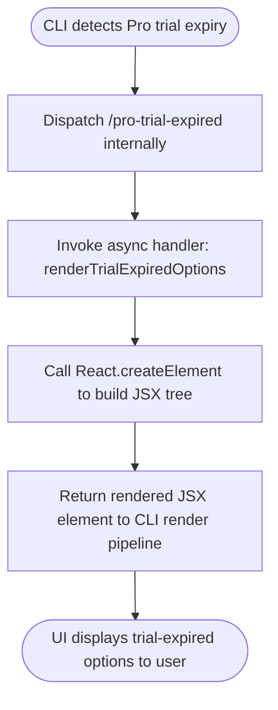

# `/pro-trial-expired`

> Analysis basis: CC v2.1.132 bundle.js (AST extraction + Claude interpretation)
> Minimum version: v2.1.132

---

## Overview

`/pro-trial-expired` is a hidden, locally-rendered JSX command that surfaces UI options to the user when their Claude Pro plan trial period has ended. Rather than sending a prompt to the agent, it renders a React component tree directly in the CLI interface, presenting upgrade or continuation paths appropriate to the post-trial state.

---

## Registration

| Field | Value |
|---|---|
| type | `local-jsx` |
| name | `pro-trial-expired` |
| description | `Options shown when the Pro plan Claude Code trial has ended` |
| isHidden | `true` |
| module_id | `nOq` |
| load_inline | `true` |
| handler | `bY7` (AsyncFunction, resolved via `module_id` path) |
| `loc_byte_end` | `11359438` |
| `arbor_handler.name` | `bY7` |
| `arbor_handler.kind` | `AsyncFunction` |
| `arbor_handler.resolution_path` | `module_id` |
| `arbor_handler.fqn` | `claude-2.1.132::bY7` |
| `arbor_handler.n_hits` | `0` |

Analysis basis: CC v2.1.132 bundle.js:+11359233 – +11359438

**Notes on registration shape:**

- `type: "local-jsx"` indicates the command does **not** submit text to the language model; instead, its handler returns a JSX element rendered directly in the CLI UI.
- `isHidden: true` means this command does not appear in the `/help` command listing or any user-facing command discovery surface. It is invoked programmatically by the application when the Pro trial expiry condition is detected.
- `load_inline: true` means the handler is bundled inline rather than being dynamically imported. The Arbor symbol graph resolved the handler as `bY7` via the `module_id` → `nOq` path.

---

## Input Branching

Because the command is of type `local-jsx` and `isHidden: true`, it is not intended for direct user invocation via the slash-command prompt. The call graph shows a single, linear execution path with no branching guarded by user input.



No user-supplied arguments, flags, or text body are parsed by this command. The depth-2 call graph contains only a single outbound call edge (to `HRA.createElement`), confirming the handler is a straightforward JSX factory with no conditional sub-routing detected at this traversal depth.

Analysis basis: CC v2.1.132 bundle.js:+11359113

---

## Behavioral Spec

### Trial-Expired UI Rendering

The handler is an async function that constructs and returns a React (JSX) element tree. The async nature allows for any prerequisite data (such as subscription state or account metadata) to be awaited before rendering, though no specific async callees were detected within the depth-2 traversal.

```
async function renderTrialExpiredOptions(commandContext):

    // Build a JSX component tree representing the trial-expired state UI.
    // The component is expected to present the user with options such as:
    //   - Upgrading to a paid Pro plan
    //   - Returning to a free-tier experience
    //   - Accessing account management links
    // (Exact option set is encapsulated within the JSX component; see callGraph.)

    uiElement = ReactCreateElement(TrialExpiredOptionsComponent, props)

    return uiElement
    // Returned element is handed back to the CLI render pipeline,
    // which mounts it in the active pane / message stream.
```

Analysis basis: CC v2.1.132 bundle.js:+11359113

**Key behavioral properties:**

- The command handler is typed `AsyncFunction` (confirmed by Arbor resolution). Any awaited operations inside (e.g., fetching account state) are opaque at depth-2 traversal.
- The sole detected callee is `HRA.createElement`, identifying `HRA` as the React (or React-compatible) namespace in use within this bundle. This is consistent with other `local-jsx` commands in the CC codebase.
- No text is submitted to the Claude model. The command is entirely self-contained on the client side.
- Because `isHidden: true`, the command cannot be triggered by the user typing `/pro-trial-expired` in normal interactive sessions; it is reserved for internal programmatic dispatch.

<!-- TODO: not found in depth-2 traversal; needs --depth 4 — specific JSX child components, props passed to createElement, and any async data-fetch calls inside the handler. -->

---

## State & Side Effects

| Item | Detail |
|---|---|
| Telemetry | None detected within depth-2 traversal |
| Hook registration | None detected within depth-2 traversal |
| appState changes | None detected within depth-2 traversal; UI state changes are driven by user interaction with the rendered component |
| Sound | None detected |
| Model invocation | None — `local-jsx` type; no prompt is sent to the Claude model |
| Visibility | Hidden from `/help` and command discovery (`isHidden: true`) |
| Render mechanism | Returns a `HRA.createElement`-produced JSX element consumed by the CLI render pipeline |

---

## Version History

| Version | Change |
|---|---|
| v2.1.132 | Initial analysis |

---

## Common Mistakes

1. **Attempting to invoke directly**: Because `isHidden: true`, typing `/pro-trial-expired` in a normal interactive session will not produce the expected UI. The command is dispatched programmatically by the application when it detects a trial expiry condition; manually invoking it in an ordinary session may produce no output or an unexpected no-op.
2. **Expecting model output**: This is a `local-jsx` command. It renders a UI component locally and does not forward any prompt to the Claude model. Do not expect a conversational response.
3. **Assuming synchronous rendering**: The handler is declared `AsyncFunction`. Any integration code that wraps or intercepts this command must properly `await` the handler's return value before attempting to mount the returned JSX element.
4. **Searching for telemetry events**: No telemetry events were found in the depth-2 traversal. Absence of telemetry does not indicate a no-op command — it may simply mean events are fired from child components not yet reached by the static analysis.
5. **Conflating `load_inline` with dynamic import**: `load_inline: true` means the handler is bundled at build time in the same chunk, not lazy-loaded. The module boundary (`nOq`) is a logical namespace, not a separate code-split chunk.

---

## Appendix — Identifier Mapping

> For bundle debugging only. Identifiers change across versions.

| Identifier | Role |
|---|---|
| `bY7` | Async handler function for `/pro-trial-expired`; resolved by Arbor via `module_id` → `nOq`; entry point for the command's JSX rendering logic |
| `HRA` | React (or React-compatible) namespace; `HRA.createElement` is called to construct the trial-expired UI component tree |