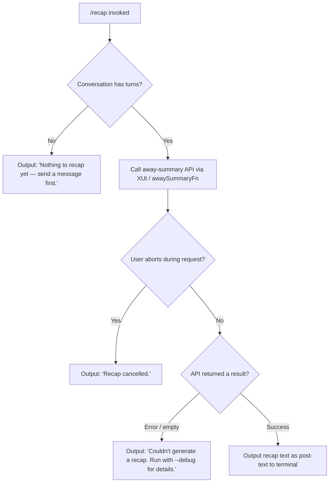

# `/recap`

> Analysis basis: CC v2.1.186 bundle.js (AST extraction + Claude interpretation)
> Minimum version: v2.1.186

---

## Overview

`/recap` generates a concise one-line summary of the current Claude Code session on demand. It delegates to the same "away summary" subsystem used for background/headless session summarisation, then prints the result (or an appropriate error message) directly to the terminal as post-text output. The command is non-interactive and does not support tool use within its summary request.

---

## Registration

| Field | Value |
|---|---|
| type | `local` |
| name | `recap` |
| description | `Generate a one-line session recap now` |
| loc_byte | `13104216` |
| loc_byte_end | `13104432` |
| supportsNonInteractive | `false` |
| thinClientDispatch | `post-text` |
| load_inline | `true` |
| load_ident | `NTf` |
| arbor_handler.name | `NTf` |
| arbor_handler.fqn | `claude-2.1.186::NTf` |
| arbor_handler.kind | `AsyncFunction` |
| arbor_handler.resolution_path | `load_ident` (followed `Promise.resolve({call: NTf})`) |
| arbor_handler.n_hits | `0` |

Analysis basis: CC v2.1.186 bundle.js:+13104216

---

## Input Branching

The handler has four distinct outcome paths based on session state and API result, so a flowchart is appropriate.



Analysis basis: CC v2.1.186 bundle.js:+13103966 (empty-session literal), +13104058 (cancelled literal), +13104116 (error literal)

---

## Behavioral Spec

### Handler entry point — `recapHandler` (`NTf`)

```
async function recapHandler(context):
    if conversationHasNoTurns(context):
        return postText("Nothing to recap yet — send a message first.")

    abortController = new AbortController()
    registerAbortListener(context, abortController)

    result = await awaySummaryDispatch(context, abortController.signal)

    if result.status == "abort":
        return postText("Recap cancelled.")

    if result.status == "error" or result.value is empty:
        return postText("Couldn't generate a recap. Run with --debug for details.")

    return postText(result.value)
```

Analysis basis: CC v2.1.186 bundle.js:+13103824 (`NTf` → `XUt` call edge)

---

### Away-summary dispatcher — `awaySummaryDispatch` (`XUt`)

```
async function awaySummaryDispatch(context, signal):
    params = context.getCacheSafeParams()
    if params is null:
        log("[awaySummary] no CacheSafeParams saved, skipping")
        return { status: "no-turn" }

    context.addEventListener("abort", () => signal.abort())

    outcome = await runQueryWithoutTools(params, signal)

    match outcome:
        case "abort"    => return { status: "abort" }
        case "api-error"=> return { status: "error" }
        case "ok"       => return { status: "ok", value: outcome.text }
        case "other"    => return { status: "error" }
```

Analysis basis: CC v2.1.186 bundle.js:+7068231 (`XUt` → `Qae`), +7068252 (no-CacheSafeParams log literal), +7068310 (`"no-turn"`), +7068366 (`"abort"`), +7068558 (`"Away summary cannot use tools"`), +7068611 (`"other"`), +7068859 (`"api-error"`), +7068920 (`"ok"`)

Key constraints surfaced in this layer:

- **No tool use**: the summary prompt explicitly forbids tool calls (`"Away summary cannot use tools"` — bundle.js:+7068558).
- The function checks `getCacheSafeParams()`; if none are saved (no prior turns), it short-circuits immediately.

---

### Query executor without tools — `runQueryWithoutTools` (`Qae`)

```
async function runQueryWithoutTools(params, signal):
    request = buildNoToolRequest(params)   // _s → b9, Zo, $g
    response = await callModel(request, signal)
    return normaliseOutcome(response)
```

Analysis basis: CC v2.1.186 bundle.js:+10895328 (`Qae` → `_s`)

The model-name resolution inside `_s` / `Zo` maps token strings to actual model identifiers. Observed model-tier literals reachable at this depth: `"fable"`, `"opusplan"`, `"sonnet"`, `"haiku"`, `"opus"`, `"best"` (bundle.js:+2294412–+2294628). The token `"[1m]"` (bundle.js:+2294460) and `"opusplan"` (bundle.js:+2294475) appear alongside these, suggesting a format-string context for model display names.

---

### Post-text output

The registration declares `thinClientDispatch: "post-text"`, meaning the return value of the handler is rendered directly as plain terminal text after the command completes — no assistant turn is created and no chat history entry is appended.

Analysis basis: CC v2.1.186 bundle.js:+13104216 (registration block)

---

### Abort / signal propagation

```
function registerAbortListener(context, abortController):
    context.addEventListener("abort", handler):
        abortController.signal.abort()
        // signal propagates into the in-flight API call
```

`n.abort()` is called when the parent context fires `"abort"` (bundle.js:+7068378), enabling clean cancellation before the upstream streaming response completes.

Analysis basis: CC v2.1.186 bundle.js:+7068347 (`e.addEventListener`), +7068378 (`n.abort`)

---

### Deep call path — main query loop (`hKp`)

`hKp` (the main agent query loop) is reached via `V5` → `hKp`. It is a very large function responsible for the full agentic turn lifecycle (tool dispatch, streaming, compaction, model fallback, etc.). For `/recap`, the relevant subset is:

```
function agentQueryLoop(params):
    // Tool use explicitly suppressed for this call path
    // Streaming request issued to model
    // On completion, outcome classified as:
    //   "end_turn" | "stop_sequence" | error variant
    // Result returned up to awaySummaryDispatch normaliser
```

`/recap` reaches this loop with a no-tool configuration, so branches for tool execution, permission dialogs, and hook callbacks are not exercised.

Analysis basis: CC v2.1.186 bundle.js:+10839255 (`V5` → `hKp`)

---

## State & Side Effects

| Item | Detail |
|---|---|
| Telemetry | No `tengu_*` events are emitted exclusively by the `/recap` command path itself. Events reachable via the shared query loop (`hKp`) include `tengu_query_error`, `tengu_model_fallback_triggered`, `tengu_auto_compact_succeeded`, and others — but these belong to the general query infrastructure, not to `/recap` specifically. |
| Hook registration | No hooks are registered specifically by this command. The abort listener on the context object is a transient event listener, not a persistent hook. |
| appState changes | None. `/recap` is a read-only, non-interactive command; it does not mutate conversation history or any appState field. |
| Sound | None observed in the call graph. |
| Conversation history | Not modified. The summary is printed as post-text only. |
| Tool use | Explicitly prohibited within the summary request (`"Away summary cannot use tools"` — bundle.js:+7068558). |
| Session requirement | Requires at least one prior user/assistant turn; otherwise exits immediately with a notification message. |

---

## Version History

| Version | Change |
|---|---|
| v2.1.186 | Initial analysis |

---

## Common Mistakes

1. **Running `/recap` in a fresh session**: If no messages have been exchanged yet, the command immediately prints `"Nothing to recap yet — send a message first."` and does nothing further. This is expected behaviour, not a bug.
2. **Expecting a full summary**: `/recap` is designed for a *one-line* session recap — not a detailed log. Users who want structured history should use `/compact` or export conversation logs directly.
3. **Expecting a new assistant turn**: Because `thinClientDispatch` is `"post-text"`, the recap output does not appear as an assistant chat bubble. It is rendered as plain terminal text and is not included in conversation context for subsequent turns.
4. **Assuming tool use is available during recap**: The away-summary subsystem used by `/recap` explicitly disables all tools. If the session is mid-tool-use or waiting on a permission dialog, those states are irrelevant to the recap call.
5. **Interpreting a missing recap as data loss**: If the API call fails or the signal is aborted, `/recap` prints `"Couldn't generate a recap. Run with --debug for details."` The original conversation is unaffected.

---

## Appendix — Identifier Mapping

> For bundle debugging only. Identifiers change across versions.

| Identifier | Role |
|---|---|
| `NTf` | `recapHandler` — top-level async handler for `/recap`; entry point resolved via `load_ident` |
| `XUt` | `awaySummaryDispatch` — orchestrates the away/recap summary request, checks CacheSafeParams, manages abort |
| `Qae` | `runQueryWithoutTools` — builds and issues the no-tool model request |
| `_s` | `buildModelRequest` — constructs the raw request object from params |
| `b9` | `requestFieldBuilder` — assembles individual request fields |
| `Zo` | `resolveModelName` — maps model-tier strings (e.g. `"sonnet"`, `"haiku"`) to concrete model identifiers |
| `$g` | `applyModelOverrides` — applies any model-tier overrides before dispatch |
| `T` | `streamingRequestDispatcher` — sends the streaming request and classifies the outcome |
| `Pvc` | `streamSetup` — prepares the streaming connection |
| `U5o` | `streamConnectionFactory` — low-level stream connection constructor |
| `De` | `jsonSerializer` — wraps `JSON.stringify` for request serialisation |
| `Lc` | `truncateOrRedact` — handles `[REDACTED]` substitution and length limiting in request bodies |
| `SWo` | `buildRedactMap` — builds the redaction map from `xvc` entries |
| `eze` | `writeOutputStream` — writes output via `cWo` / `e.write` |
| `cWo` | `outputStreamWriter` — raw stream write wrapper |
| `Fvc` | `transcriptLogger` — manages transcript file writing (append, rotate, size check) |
| `wKe` | `batchedWriter` — debounced/batched file write with `setTimeout`/`setImmediate` |
| `npe` | `transcriptEntryFormatter` — formats a transcript entry for disk |
| `Rre` | `mkdirSafe` — directory creation helper (calls `mn`) |
| `TWo` | `transcriptPathBuilder` — joins path segments via `tpe.join` |
| `pcr` | `transcriptRotator` — checks file size, renames, unlinks old transcript files |
| `Uvc` | `transcriptAppender` — `mkdir` + `appendFile` + rotate cycle |
| `Ai` | `hookRegistrar` — registers listeners via `O5o.register` |
| `T0` | `runSessionTurn` — outer session turn runner; dispatches the query and handles forked-agent logic |
| `c4n` | `buildTurnContext` — assembles turn context including `avoid_prompts`, UUIDs, app state |
| `d1` | `sessionStateLoader` — loads `Ll` / `r4i` session state |
| `tge` | `conversationDumper` — serialises conversation via `dB` / `t.load` / `e.dump` |
| `vwe` | `turnContextValidator` — validates turn context fields |
| `Qoa` | `preTurnHook` — pre-turn lifecycle hook |
| `a` | `messageSelector` — selects messages via `Z3e`, `arr`, `maa`, `s.get`, `T`, `s.values`, `q2o` |
| `v8n` | `contextWindowManager` — manages context window state |
| `LM` | `generateRequestId` — generates hex request IDs via `kYt.randomBytes` (63-byte pool, 8-char output) |
| `u4n` | `sessionMetrics` — collects session-level metrics |
| `Sce` | `summaryFilterDispatch` — filters and routes summary-related messages (`Oc`, `lWe`) |
| `Oc` | `summaryOccurrenceTracker` — tracks summary occurrences, calls `Ai` |
| `lWe` | `summaryMessageFilter` — filters messages with `aJn`, `SJn`, `Awf` |
| `V5` | `agentTurnOrchestrator` — selects between `hKp` (main loop), `PWn` (cleanup), `ke`/`xe` (feature flags) |
| `hKp` | `mainAgentQueryLoop` — full agentic turn: streaming, tool dispatch, compaction, model fallback, hooks |
| `PWn` | `subagentExitCleanup` — cleans up subagent registries on exit |
| `ke` | `featureCheckOk` — emits `tengu_feature_ok` |
| `xe` | `featureCheckBad` — emits `tengu_feature_bad` |
| `ok` | `activeGoalTracker` — tracks active goal state |
| `Q5e` | `toolUseSummaryChecker` — checks `Ekp` set for tool-use summary eligibility |
| `Jte` | `notificationDispatcher` — dispatches OS/UI notifications |
| `k8n` | `conversationResetHandler` — handles `conversation_reset` events |
| `FBa` | `postTurnSummaryGate` — gates post-turn summary emission |
| `f` | `sessionWorkerLoop` — main session worker: process management, memory checks, IPC |
| `W` | `logWriter` — general logging/output writer |
| `D` | `scheduledTaskRunner` — runs scheduled background tasks |
| `Bn` | `promiseWithTimeout` — wraps a promise with `setTimeout`/`clearTimeout` |
| `IXn` | `macosMemoryReporter` — emits `tengu_bg_low_mem_mb` on macOS |
| `D2e` | `tempFileReaper` — cleans up stale temp files via `hb.lstat` / `hb.rm` |
| `Re` | `errorReporter` — logs errors via `VJ.logError`, pushes to `Jje` |
| `N` | `jobRetirementManager` — retires settled jobs via `Zut` / `J5` |
| `it` | `toolAccessController` — manages `OIe`, `DRt`, `TW` permission sets |
| `$Bo` | `daemonConnectionSpawner` — claims a spare session and connects via `lV.claim` / `vrr.connect` |
| `KBo` | `backgroundJobManager` — manages background job lifecycle (spawn, retire, roster) |
| `s` | `backgroundJobManagerAlias` — alias reaching into `KBo`'s `r.add` / `i.finally` / `r.delete` |
| `p` | `forcedShutdownHandler` — calls `process.exit` after abort on `u.abort` |
| `mn` | `mkdirRecursive` — recursive directory creation |
| `Pe` | `featureGate` — wraps `KVe` feature-flag check |
| `$` | `disposableResource` — holds a `.dispose()` handle |
| `lce` | `messageSetFilter` — filters messages by set membership (`DA`, `Hkp`, `s.has`) |
| `DA` | `messageSetBuilder` — builds the allowable message set |
| `Hkp` | `messageFinder` — `e.find` over message list |
| `kKp` | `forkedAgentRunner` — runs forked agent sub-queries; emits `tengu_fork_agent_query` |
| `Mr` | `messageNormaliser` — normalises messages via `yH` / `Ke`; marks `"nonconforming"` |
| `Pn` | `ipcRequestHandler` — handles IPC UUID-keyed requests (`kP.randomUUID`) |
| `y` | `teammateMailboxDispatch` — dispatches to `v5e` (TeammateMailbox) |
| `v5e` | `teammateMailboxMarkRead` — marks messages as read in TeammateMailbox; acquires/releases lock |
| `H` | `ipcFrameParser` — parses framed IPC messages (`Buffer.concat`, `g.indexOf`, `g.subarray`) |
| `g` | `ipcTimeoutWrapper` — wraps `r.setTimeout` for IPC timeout |
| `m` | `sessionKillAll` — kills all active sessions via `x.kill` |
| `fp` | `ipcFrameWriter` — writes IPC frames via `e.end` / `De` |
| `bYf` | `daemonProtocolHandler` — full daemon protocol handler (all message types: ping, dispatch, attach, reply, etc.) |
| `Ae` | `stringCoercer` — coerces values to `String` |
| `gfa` | `flatMapResults` — `e.flatMap` over result array |

---

Note: index built via Arbor fallback; some signals (telemetry, literals) may be missing — see arbor-fallback.js.