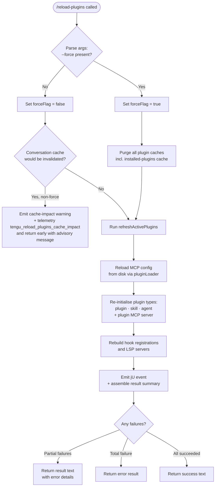

# `/reload-plugins`

> Analysis basis: CC v2.1.186 bundle.js (AST extraction + Claude interpretation)
> Minimum version: v2.1.186

---

## Overview

`/reload-plugins` activates pending plugin changes in the current Claude Code session without restarting the process. It rescans plugin configurations, rebuilds MCP server connections, refreshes skill/agent indexes, and optionally purges caches when `--force` is supplied. The command dispatches its work via the `control-request` thin-client path and does not support non-interactive operation.

---

## Registration

| Field | Value |
|---|---|
| type | `local` |
| name | `reload-plugins` |
| description | `Activate pending plugin changes in the current session` |
| argumentHint | `[--force]` |
| supportsNonInteractive | `false` |
| thinClientDispatch | `control-request` |
| module_id | `mPl` |
| load_inline | `true` |
| loc_byte | `12731833` |
| loc_byte_end | `12732077` |
| loc_line | `8673` |
| arbor_handler.name | `y_f` |
| arbor_handler.fqn | `claude-2.1.186::y_f` |
| arbor_handler.kind | `AsyncFunction` |
| arbor_handler.resolution_path | `module_id` |
| arbor_handler.n_hits | `0` |

Analysis basis: CC v2.1.186 bundle.js:+12731833

---

## Input Branching

The handler has four distinct runtime paths (no-op guard, normal reload, cache-impact telemetry branch, and force-purge branch), requiring a flowchart.



Analysis basis: CC v2.1.186 bundle.js:+12730531, +12730582, +12730953, +12730968, +12731031, +12731137, +12731191, +12731263

---

## Behavioral Spec

### 1. Entry point — `reloadPluginsHandler` (`y_f`)

The Arbor symbol graph resolves the handler to `y_f` (AsyncFunction, via `module_id` → `mPl`).

```
async function reloadPluginsHandler(context, rawArgs):
    // Trim raw argument string
    args = rawArgs.trim()                       // bundle.js:+12730917

    // Detect --force flag
    forceFlag = args.includes("--force")         // literal "--force" @ +12730953
                or args.includes("force")        // literal "force"  @ +12730968

    // Report current plugin-type breakdown
    pluginTypeCounts = countByType(context, ["plugin", "skill", "agent",
                                             "plugin MCP server"])
                                                 // literals @ +12730647, +12730678,
                                                 //            +12730706, +12730738

    // Guard: would a non-forced reload invalidate the conversation cache?
    if not forceFlag and cacheWouldBeInvalidated(context):
        emit telemetry: "tengu_reload_plugins_cache_impact"   // +12729825
        return advisory text containing:
            "…the whole conversation instead of using the cache.
             Run /reload-plugins --force to apply."           // literal @ +12730416

    // Retrieve current app state
    appState = context.getAppState()             // +12731031

    // Refresh active plugins (main reload routine)
    reloadResult = await refreshActivePlugins(appState, forceFlag)
                                                 // +12731137, +12731191, +12731263

    // Format output
    outputText = formatReloadSummary(reloadResult)
    return { type: "text", content: outputText } // literal "text" @ +12730895
```

Analysis basis: CC v2.1.186 bundle.js:+12730531, +12730582

---

### 2. Cache-impact guard — `cacheImpactChecker` (`fPl`)

```
function cacheImpactChecker(appState):
    // Delegates to W (conversational cache inspector)
    return conversationCacheWouldBeInvalidated(appState)   // +12729823
```

Analysis basis: CC v2.1.186 bundle.js:+12731137

---

### 3. Force-purge path — `clearAllPluginCaches` (`E_f`)

```
function clearAllPluginCaches(context):
    // Splits cached plugin list and clears each entry
    for each segment in pluginCacheKey.split(...):          // +12730313
        evict from cache
    log "refreshActivePlugins: clearing all plugin caches"  // literal @ +12727502
    log "Cleared installed plugins cache"                   // literal @ +11098903
```

Analysis basis: CC v2.1.186 bundle.js:+12731191, +12730313

---

### 4. Core reload orchestrator — `refreshActivePlugins` (`Bye`)

```
async function refreshActivePlugins(appState, force):
    // Clear skill-index cache
    clearSkillIndexCache(appState)               // call to a5 → e.clearSkillIndexCache @ +13316858

    // Reload MCP server config from disk (pluginLoader: m7)
    mcpConfig = await pluginLoader(appState)     // +12727628 → m7 @ +12727806

    // Load plugin descriptors by source type:
    //   Tee   — .mcpb / .dxt marketplace bundles
    //   t9e   — .lsp.json LSP descriptors
    //   Bxn   — extension-conflict check for LSP
    [mcpbPlugins, lspPlugins] = await Promise.all([
        loadMarketplaceBundles(mcpConfig),       // Tee @ +12727806
        loadLspDescriptors(mcpConfig),           // t9e @ +12727968
    ])                                           // Promise.all @ +12727609

    // Reduce results into a unified plugin map
    pluginMap = lspPlugins.reduce(...)           // +12728037
    pluginMap = mcpbPlugins.reduce(...)          // +12728062

    // Filter to changed/new vs. removed
    added   = filterAdded(pluginMap, appState)   // H_f @ +12728179
    removed = filterRemoved(pluginMap, appState) // __f @ +12728212

    // Apply hook registrations and LSP server updates
    hookResult = registerHooks(added, removed)   // dge @ +12728363

    // Rebuild MCP connection state via assemblePluginLoadResult
    loadResult = await assemblePluginLoadResult(appState, pluginMap)
                                                 // DAo (via vXr) @ +12731263

    // Emit internal event
    jU.emit("reload_plugins", loadResult)        // literal "reload_plugins" @ +12730582,
                                                 // jU.emit @ +12728609

    // Build summary text
    summary = buildSummaryText(loadResult, added, removed)
                                                 // rMn @ +12728338, dge @ +12728363,
                                                 //  Re @ +12728383, Ae @ +12728440

    return summary
```

Analysis basis: CC v2.1.186 bundle.js:+12727500, +12727554, +12727560, +12727609, +12728609

---

### 5. Plugin loader (MCP config scanner) — `pluginLoader` (`m7`)

```
async function pluginLoader(appState):
    // Read settings from: projectSettings, userSettings, localSettings, policySettings
    //   Sources: .mcp.json, settings.json, settings.local.json
    configs = await Promise.all([
        loadProjectSettings(),    // Ab @ +6577905
        loadUserSettings(),
        loadLocalSettings(),
        loadEnterprisePolicy(),
    ])                            // Promise.all @ +6578731

    // Merge MCP entries, deduplicate by name key
    merged = mergeAndDedup(configs)              // uoa @ +6579686

    // Validate each entry (type: stdio | sse | sse-ide | ws-ide | http | dynamic)
    validated = validate(merged)                 // J_n @ +6578233, zE @ +6578112

    // Mark suppressed duplicates
    //   emits "mcp-server-suppressed-duplicate" literal @ +6579821
    for each dup in findDuplicates(validated):
        mark(dup, "mcp-server-suppressed-duplicate")

    return validated
```

Analysis basis: CC v2.1.186 bundle.js:+6577762, +6577905, +6578112, +6578233, +6578731, +6579686

---

### 6. Marketplace bundle loader — `marketplaceBundleLoader` (`Tee`)

```
async function marketplaceBundleLoader(mcpConfig):
    // Handles .mcpb and .dxt extensions  (literals @ +6540484, +6540505)
    for each entry in mcpConfig:
        if entry.path endsWith ".mcpb" or ".dxt":
            // Read manifest.json from archive  (literal @ +6546601)
            manifest = readManifest(entry.path)  // pNt @ +6554589 → fXr @ +6554866

            // Validate manifest; emit warnings on failure
            pluginDesc = parseAndValidate(manifest)

            // Resolve marketplace entry (Yra)
            marketplaceEntry = resolveMarketplace(pluginDesc)  // Yra @ +6555022

    return bundleDescriptors
```

Analysis basis: CC v2.1.186 bundle.js:+6554173, +6554325, +6554866, +6555022

---

### 7. Assemble plugin load result — `assemblePluginLoadResult` (`DAo`)

```
async function assemblePluginLoadResult(appState, pluginMap):
    // Log telemetry markers:
    //   "plugin_load_all"               @ +11175834
    //   "plugin_load_total_failure"     @ +11175852
    //   "plugin_load_partial_failures"  @ +11175921

    // Guard: cwd must not have changed mid-scan
    if originalCwd != process.cwd():
        log "assemblePluginLoadResult: originalCwd changed mid-scan; skipping side-effects (stale early-kick)"
                                                 // literal @ +11175987
        return earlyAbortResult

    // Partition plugins by outcome:
    //   fulfilled / rejected              literals @ +11156827, +11156883
    //   generic-error                     literal  @ +11156999
    //   ineffective-disable               literal  @ +11175719
    [succeeded, failed] = await Promise.all(
        pluginMap.map(connectPlugin)
    )                                            // Promise.all @ +11175094

    // Collect MCP connection states (MAo)
    mcpStates = await loadMcpConnections(pluginMap)  // MAo @ via vXr +11174521

    return { succeeded, failed, mcpStates }
```

Analysis basis: CC v2.1.186 bundle.js:+11174513, +11175094, +11175834, +11175852, +11175921, +11175987

---

### 8. Format reload summary — `formatReloadSummary` (`$ie`)

```
function formatReloadSummary(loadResult):
    // Joins per-plugin lines with " · " separator (literal @ +12730765)
    lines = loadResult.results.map(entry =>
        formatEntry(entry)                       // es @ +4326994
    )
    return lines.join(" · ")
```

Analysis basis: CC v2.1.186 bundle.js:+12731338, +12730765, +4346688

---

## State & Side Effects

| Item | Detail |
|---|---|
| Telemetry | `tengu_reload_plugins_cache_impact` (bundle.js:+12729825) — fired when a non-forced reload would invalidate the conversation cache |
| Telemetry (indirect, via `DAo`) | `plugin_load_all`, `plugin_load_total_failure`, `plugin_load_partial_failures` (literals @ +11175834, +11175852, +11175921) |
| Telemetry (indirect, via `Yx`/`BGt`) | `tengu_plugin_state_file_error` (+11099082) |
| Internal event emission | `jU.emit("reload_plugins", loadResult)` (bundle.js:+12728609) — notifies subscribers of completion |
| appState changes | `context.getAppState()` read (+12731031); skill-index cache cleared on any reload; installed-plugins cache cleared on `--force` |
| Cache purge (force only) | All plugin caches purged via `E_f` (+12730313); installed plugins cache cleared via `a5 → e.clearSkillIndexCache` (+13316858) |
| Hook registration | Hooks re-registered via `dge` (+12728363); safe-mode guard present — emits `"Safe mode: skipping plugin hook registration"` (literal @ +5224141) |
| LSP server rebuild | LSP descriptors re-loaded via `t9e` (+12727968); extension-conflict check via `Bxn` (+12728096) |
| MCP connection reset | `MAo` reconnects all configured MCP servers; suppressed-duplicate entries tagged `"mcp-server-suppressed-duplicate"` (+6579821) |
| Sound | None observed in depth-2 traversal |

---

## Version History

| Version | Change |
|---|---|
| v2.1.186 | Initial analysis |

---

## Common Mistakes

1. **Omitting `--force` when config changes span cached conversation turns.** Without `--force`, the handler detects that reloading would invalidate the conversation cache and returns an advisory message instead of reloading. Users must explicitly pass `--force` to proceed in that scenario.
2. **Running in non-interactive mode.** `supportsNonInteractive` is `false`; the command silently does nothing (or errors) if invoked from a non-interactive pipeline or script.
3. **Expecting instant LSP re-activation.** LSP servers are rebuilt asynchronously after hook registration; tools depending on LSP completion may be unavailable for a brief window after the command returns.
4. **Assuming `--force` is safe in long sessions.** The force path purges all plugin caches. In sessions with large context, this may trigger a full context rebuild on the next turn.
5. **Confusing `reload-plugins` with a full restart.** The command only hot-reloads plugin state within the current session. Daemon-level changes (e.g. binary upgrades) still require a process restart.

---

## Appendix — Identifier Mapping

> For bundle debugging only. Identifiers change across versions.

| Identifier | Role |
|---|---|
| `y_f` | Main handler for `/reload-plugins` (AsyncFunction resolved via module_id `mPl`) |
| `OS` | Internal dispatcher / control-request forwarder called at handler entry |
| `Nu` | Low-level notification/output utility called by `OS` |
| `qPe` | Sub-utility called by `Nu` |
| `hX` | Plugin-type classifier (classifies "plugin", "skill", "agent", "plugin MCP server") |
| `bn` | Base notification builder |
| `pPl` | Cache-impact detection and telemetry emitter (`tengu_reload_plugins_cache_impact`) |
| `IXr` | Plugin registry / connection-state index |
| `ESe` | Plugin registry sub-component (entry setup) |
| `vXr` | Plugin load result dispatcher (routes to `DAo` and `MAo`) |
| `DAo` | `assemblePluginLoadResult` — gathers per-plugin outcomes and telemetry |
| `MAo` | MCP connection loader — reconnects all configured MCP servers |
| `m7` | `pluginLoader` — reads and merges all MCP config sources from disk |
| `Ql` | Settings-source resolver used by `pluginLoader` |
| `JU` | Object prototype helper used in plugin registry |
| `Ab` | Project/user/local settings reader (parses `.mcp.json`) |
| `Rae` | Plugin descriptor parser (handles git, npm, file, github source types) |
| `zE` | Policy settings filter |
| `J_n` | HTTP / dynamic transport validator |
| `cy` | Plugin install trigger classifier |
| `T` | General-purpose tagged-template / string formatting utility |
| `nRn` | MCP binary/extension descriptor loader |
| `bnt` | Binary-not-found error handler |
| `fPl` | Cache-impact checker (delegates to conversation-cache inspector `W`) |
| `W` | Conversation cache inspector |
| `E_f` | `clearAllPluginCaches` — purges plugin caches on `--force` |
| `Bye` | `refreshActivePlugins` — core reload orchestrator |
| `hcl` | Skill-index cache helper |
| `Bh` | Plugin cache clearing coordinator (calls `Yjp`, `Ix`, `J_e`, `Yqr`, `w4`) |
| `Yjp` | Plugin descriptor reload dispatcher |
| `_v` | Plugin state machine / loader |
| `Ix` | Skill-index cache clearer (`e.clearSkillIndexCache`) |
| `a5` | Installed-plugins cache clearer |
| `J_e` | Dependency resolution cache clearer |
| `w4` | Settings cache clearer (`SGt.clear`) |
| `Tee` | Marketplace bundle loader (`.mcpb` / `.dxt`) |
| `I8` | File-extension detector (`.mcpb`, `.dxt`) |
| `fXr` | MCPB archive reader / manifest extractor |
| `pNt` | Plugin manifest validator (reads `manifest.json`, computes MD5 hash) |
| `Yra` | Marketplace entry resolver |
| `t9e` | LSP descriptor loader (reads `.lsp.json`) |
| `r7d` | LSP descriptor sub-loader / path validator |
| `Bxn` | LSP extension-conflict checker |
| `QNl` | Daemon status writer |
| `_Q` | Conversation cache inspector (core) |
| `Xs` | Async-store context accessor (`bUu.getStore`) |
| `zqt` | Daemon status path resolver |
| `De` | JSON serialiser wrapper |
| `Hye` | Plugin state initialiser (reads plugin config files, builds per-plugin state) |
| `Xx` | Plugin marketplace config reader |
| `$f` | `known_marketplaces.json` reader |
| `Cqn` | Plugin data-directory path builder |
| `W2e` | Plugin schema validator |
| `In` | Schema validation dispatcher |
| `Z$` | Schema-type classifier |
| `qT` | Plugin source-URL parser |
| `wda` | URL scheme extractor |
| `xUt` | Plugin source-type router |
| `M8` | In-memory schema validator |
| `c6` | Per-plugin config-file reader |
| `RGt` | Plugin marketplace entry reader |
| `_Ao` | Plugin marketplace JSON parser |
| `Qk` | Plugin config aggregator (calls `EAo`, `$f`, `HP`) |
| `EAo` | Plugin config-file loader |
| `usf` | Installed-plugin presence checker |
| `BGt` | Full plugin initialisation orchestrator (large, covers all plugin subsystems) |
| `eL` | In-memory schema lookup |
| `Oqn` | Plugin schema parser |
| `kIt` | Local-source path guard (checks `./` prefix) |
| `Yx` | Plugin state-file loader (`SAo`, `xIt`, `RIt`, `AAo`) |
| `SAo` | Plugin state JSON reader (readFileSync) |
| `AAo` | Plugin state entry mapper |
| `PGt` | Plugin state writer |
| `wCn` | SemVer validation wrapper (`Lj.valid`, `Lj.coerce`, `Lj.satisfies`) |
| `N1i` | Dependency resolution engine |
| `vDt` | Version-range parser / conflict detector |
| `Mqn` | MCP server capability aggregator |
| `CAo` | MCP capability builder |
| `UGt` | MCP capability updater |
| `Pqn` | Git tag resolver / semver-max selector |
| `$Gt` | Plugin installation state manager (handles installs, removals, renames) |
| `umt` | Plugin package installer |
| `Rqn` | Plugin directory scanner |
| `bAo` | Plugin list updater (added / updated / removed) |
| `ro` | Settings writer / gitignore tracker |
| `CEr` | Settings-file updater |
| `Z3e` | MCP server connector (per-server connection logic) |
| `arr` | MCP connection result applier (`e.applyMcpUpdate`) |
| `q2o` | MCP client-slot reconciler |
| `wca` | MCP server connection manager (`Promise.allSettled`) |
| `H_f` | Added-plugins filter |
| `__f` | Removed-plugins filter |
| `dge` | Hook registration dispatcher (safe-mode aware) |
| `$ie` | Reload summary formatter (joins with `" · "`) |
| `rMn` | Reload result aggregator |
| `Re` | Error reporter / telemetry logger |
| `Ae` | String coercer |
| `gr` | Logger / console output helper |
| `OS` | Control-request forwarding shim |

---

Note: index built via Arbor fallback; some signals (telemetry, literals) may be missing — see arbor-fallback.js.