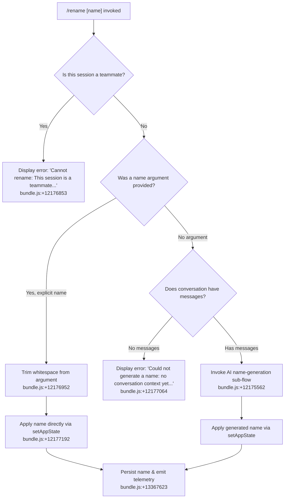

# `/rename`

> Analysis basis: CC v2.1.186 bundle.js (AST extraction + Claude interpretation)
> Minimum version: v2.1.186

---

## Overview

The `/rename` command sets or generates a display name for the current conversation session. When invoked with an explicit name argument, it applies that name immediately; when invoked without arguments (and conversation context exists), it uses the AI model to auto-generate a suitable name. The command is also registered under the alias `/name`.

---

## Registration

| Field | Value |
|---|---|
| type | `local-jsx` |
| name | `rename` |
| description | `Rename the current conversation` |
| argumentHint | `[name]` |
| immediate | `true` |
| aliases | `["name"]` |
| module_id | `NIl` |
| load_inline | `true` |
| loc_byte | `12177689` |
| loc_byte_end | `12177888` |
| loc_line | `8104` |
| arbor_handler.name | `zcf` |
| arbor_handler.fqn | `claude-2.1.186::zcf` |
| arbor_handler.kind | `AsyncFunction` |
| arbor_handler.resolution_path | `module_id` |
| arbor_handler.n_hits | `0` |

Analysis basis: CC v2.1.186 bundle.js:+12177689

---

## Input Branching

The command has four distinct paths based on session state and user input, requiring a flowchart.



---

## Behavioral Spec

### Top-Level Handler (`zcf`)

The Arbor-resolved handler `zcf` (AsyncFunction) is the command entry point. It receives the user's input string and the current application context, then delegates to the main rendering/dispatch helper.

Analysis basis: CC v2.1.186 bundle.js:+12177385

```
async function handleRenameCommand(inputArg, appContext):
    renderComponent(inputArg, appContext)   // delegates to yjn
    logContext(appContext)                  // side-effect: _jn
    dispatchHTMLEscape(inputArg)            // side-effect: _jn -> nVn
```

### Teammate Guard

Before any rename logic, the handler checks whether the current session is a "teammate" role (a subordinate in a multi-agent arrangement). If so, it short-circuits with a user-visible error message.

Analysis basis: CC v2.1.186 bundle.js:+12176853

```
function checkTeammateGuard(sessionState):
    if sessionState.isTeammate:
        return displayError(
            "Cannot rename: This session is a teammate. Teammate names are set by the team leader."
        )
    else:
        return proceedWithRename()
```

### Explicit Name Path (`yjn` — apply provided name)

When the user supplies a name argument, the handler trims whitespace and stores it in app state. This triggers a persistent session rename via the underlying state-write utility.

Analysis basis: CC v2.1.186 bundle.js:+12176952, +12177192

```
function applyExplicitName(rawName, appContext):
    trimmedName = rawName.trim()
    if trimmedName is empty:
        return fallThroughToAutoGenerate(appContext)
    appContext.setAppState({ sessionTitle: trimmedName })
    persistSessionLabel(trimmedName)          // yz -> Cwt path
    emitTelemetry("tengu_session_renamed")    // bundle.js:+13367623
```

### Auto-Name Generation Path (`Dht` → `Kcf` → `T0` → `c4n`)

When no argument is provided, the handler inspects the conversation's message history. If no messages exist it returns a user-facing error. Otherwise it launches an AI sub-query (with tools disabled) to generate a name.

Analysis basis: CC v2.1.186 bundle.js:+12175562, +12174829, +12174962

```
async function autoGenerateName(appContext):
    if conversationMessages(appContext).length == 0:
        return displayError(
            "Could not generate a name: no conversation context yet. Usage: /rename <name>"
        )

    // Build a minimal query context
    abortController = new AbortController()
    queryOptions = {
        toolPermissions: "deny",                    // bundle.js:+12174947
        toolsAllowed:    false,
        label:           "rename_generate_name",    // bundle.js:+12175065
        messageHistory:  summarizeConversation(appContext),
    }

    // Run the name-generation query (uses T0 -> c4n sub-flow)
    generatedName = await runNameQuery(queryOptions, abortController)
    generatedName = generatedName.trim()
    appContext.setAppState({ sessionTitle: generatedName })
    persistSessionLabel(generatedName)
    emitTelemetry("tengu_session_renamed")
```

### Session Persistence (`yz` → `Cwt`)

The name string is written atomically to the conversation record on disk. The writer reads the existing JSON, merges the new title field, and writes back.

Analysis basis: CC v2.1.186 bundle.js:+13371141, +2307249

```
async function persistSessionLabel(name):
    filePath = buildSessionFilePath()          // vfe.join path
    existingData = JSON.parse(readFile(filePath, "utf-8"))
    existingData.title = name
    writeFile(filePath, JSON.stringify(existingData))
    emitTelemetry("tengu_session_renamed")     // bundle.js:+13367623
    emitTelemetry("tengu_agent_name_set")      // bundle.js:+13371160
```

### HTML-Escape Utility (`nVn`)

A utility called during display rendering escapes HTML special characters in the name before rendering in the JSX component.

Analysis basis: CC v2.1.186 bundle.js:+12176701, +13767479

```
function escapeHtmlEntities(rawString):
    result = rawString
        .replaceAll("&",  "&amp;")     // bundle.js:+13767496
        .replaceAll("<",  "&lt;")      // bundle.js:+13767520
        .replaceAll(">",  "&gt;")      // bundle.js:+13767543
        .replaceAll("\r", "&#13;")     // bundle.js:+13767567
        .replaceAll("\n", "&#10;")     // bundle.js:+13767591
    return result
```

### Name-Query Sub-flow (`c4n`)

The AI query used for auto-generation explicitly sets `avoid_prompts` mode and a `"rename"` label. Tools are not available to this agent.

Analysis basis: CC v2.1.186 bundle.js:+10897430, +12175041

```
async function runNameQuerySubflow(options, abortCtl):
    state = getAppState(options.appContext)
    queryConfig = {
        mode:    "avoid_prompts",        // bundle.js:+10897430
        role:    "assistant",            // bundle.js:+10899936
        label:   "rename",              // bundle.js:+12175041
        role_tag: "main",               // bundle.js:+10900635
    }
    response = await dispatchModelRequest(queryConfig, abortCtl)
    return extractTextContent(response)
```

### Session Fork Telemetry (`it` — full-session-fork guard)

If the name-generation path triggers a full session fork (a rare path where the conversation graph must be forked), a dedicated telemetry event fires.

Analysis basis: CC v2.1.186 bundle.js:+3328181

```
function handleSessionFork(forkContext):
    emitTelemetry("tengu_rename_full_session_fork")   // bundle.js:+12175505
    setupForkStructures(forkContext)
    assignNewSessionId(crypto.randomUUID())
```

### Message History Summarization for Name Generation (`gjn`)

Before the name-generation query is dispatched, the conversation history is condensed into a text representation. Only message content of type `"text"` is included; array-valued messages are joined with newlines.

Analysis basis: CC v2.1.186 bundle.js:+12171955, +12172079

```
function buildNameGenerationContext(messages):
    parts = []
    for message in messages:
        if message.isMeta: continue              // bundle.js:+12171905
        if message.origin == "human": continue   // bundle.js:+12171940
        if Array.isArray(message.content):
            textParts = message.content
                .filter(block => block.type == "text")   // bundle.js:+12172079
                .map(block => block.text)
            parts.push(textParts.join("\n"))
        else:
            parts.push(String(message.content))
    return parts.join("\n").slice(0, MAX_CONTEXT_CHARS)
```

### Output-Name Schema Validation (`gF` path)

The generated name is validated against a JSON Schema (schema type `"json_schema"`) before being applied, ensuring the model's output is well-formed.

Analysis basis: CC v2.1.186 bundle.js:+12175672, +12175877

```
function validateGeneratedName(rawModelOutput):
    schema = getOutputSchema("json_schema")     // bundle.js:+12175877
    parsed = parseWithSchema(rawModelOutput, schema)
    if not valid:
        fallback = extractPlainText(rawModelOutput)
        return fallback
    return parsed.name
```

---

## State & Side Effects

| Item | Detail |
|---|---|
| Telemetry — primary | `tengu_session_renamed` (bundle.js:+13367623) — fires on every successful rename |
| Telemetry — agent name | `tengu_agent_name_set` (bundle.js:+13371160) — fires when the persisted agent label is updated |
| Telemetry — fork | `tengu_rename_full_session_fork` (bundle.js:+12175505) — fires if a session-graph fork is required during name application |
| appState changes | `setAppState({ sessionTitle: <name> })` written to in-memory state (bundle.js:+12177192) |
| Disk persistence | Session JSON file updated via atomic write through `Cwt` (bundle.js:+2307249) |
| Abort signal | An `AbortController` is created for the AI sub-query and wired to an `"abort"` event listener (bundle.js:+12174751, +12174770) |
| Tool permissions | AI name-generation sub-query runs with tools set to `"deny"` (bundle.js:+12174947) |
| HTML escaping | Name is HTML-escaped before display rendering via `nVn` (bundle.js:+13767479) |
| Sound | <!-- TODO: not found in depth-2 traversal; needs --depth 4 --> |
| Hook registration | No hook registration detected at depth ≤ 2 |

---

## Version History

| Version | Change |
|---|---|
| v2.1.186 | Initial analysis |

---

## Common Mistakes

1. **Invoking `/rename` with no arguments before any messages exist.** The command requires at least one prior message to generate an AI name. Attempting it on a brand-new session returns: `"Could not generate a name: no conversation context yet. Usage: /rename <name>"` (bundle.js:+12177064).
2. **Attempting to rename a teammate session.** If the current session is a teammate in a multi-agent team, the rename is blocked entirely with a specific error message (bundle.js:+12176853). The team leader's session must perform the rename.
3. **Providing whitespace-only as the name argument.** The argument is trimmed before use (bundle.js:+12176952); a purely whitespace string will fall through to the auto-generation path, which may be unexpected.
4. **Expecting the alias `/name` to behave differently.** The `name` alias is registered identically and shares all behavior with `/rename`.
5. **Assuming the rename is instantaneous when no argument is given.** The auto-generation path makes a full model API call. There is a visible async delay; an `AbortController` tied to an `"abort"` event can cancel it mid-flight.

---

## Appendix — Identifier Mapping

> For bundle debugging only. Identifiers change across versions.

| Identifier | Role |
|---|---|
| `zcf` | Top-level async handler for `/rename` (Arbor-resolved entry point) |
| `yjn` | Main rename dispatch function; routes between explicit-name and auto-generate paths |
| `_jn` | Component render helper; triggers HTML-escape and display-layer side-effects |
| `nVn` | HTML entity escape utility (replaces `&`, `<`, `>`, CR, LF) |
| `Bv` | Display/render utility called during the render phase |
| `df` | Store accessor helper called from `yjn` |
| `s0` | State store getter; calls `Jkr.getStore` |
| `Dht` | Core rename orchestrator: invokes session-state reader, AI query launcher, history builder, output validator |
| `it` | Session-fork handler; emits `tengu_rename_full_session_fork` |
| `ORt` | Fork helper (called from `it`) |
| `NRt` | Fork helper (called from `it`) |
| `$9` | Fork sub-utility (calls `F9`) |
| `F9` | Lower-level fork primitive |
| `JEn` | Session-state registry accessor (has/get/add pattern) |
| `M2r` | New session record creator; calls `crypto.randomUUID`, emits `zQ` event |
| `F2r` | Session finalization helper |
| `wt` | Session-write coordinator; calls `cEe` for file operations and `Lxf` for file watching |
| `cEe` | Config/session file I/O (read, write, mkdir, copy, stat, readdir) |
| `Lxf` | File-watch registration/deregistration around session file |
| `mSo` | Session-state timestamp helper; calls `_s` for model-name normalization |
| `_s` | Model name resolver; calls `b9` and `Zo` |
| `b9` | Model identifier builder |
| `Zo` | Model name normalizer (trim, toLowerCase, string replacements for known model families) |
| `$g` | Secondary model-name normalization path |
| `Gyt` | Post-timestamp utility called from `mSo` |
| `Kcf` | AI name-generation sub-flow orchestrator; sets up abort controller, calls `T0`, `Pn`, `OIl` |
| `Qae` | Message-history accessor called from `Kcf` |
| `T0` | Main model-query dispatcher for name generation |
| `c4n` | Core query construction: reads app state, builds options with `avoid_prompts` and `rename` labels, calls `setAppState` |
| `u4n` | Query post-processing helper |
| `LM` | Random hex ID generator (uses `kYt.randomBytes`, 63-byte output) |
| `Sce` | Stream context builder (calls `Oc`, `lWe`) |
| `T` | Logging/debug utility (level: `"debug"`) |
| `V5` | Sub-agent exit / command lifecycle state machine |
| `ok` | Utility called from `gF` and `T0` (context object helper) |
| `Q5e` | Message-type checker (checks for `tombstone`, `tool_use_summary`, `notification`, etc.) |
| `Jte` | Stream-event handler (called from `T0` and `S5l`) |
| `k8n` | Stream state helper |
| `FBa` | Message-filter helper (calls `Q5e`) |
| `f` | Background session process manager (spawn, kill, memory checks) |
| `lce` | Message-list filter/deduplication helper |
| `W` | Generic utility / object-merge helper |
| `kKp` | Forked-agent query orchestrator |
| `Pn` | UUID-keyed promise/channel primitive |
| `y` | Renderer primitive (`v5e`) |
| `H` | Stream buffer reader (Buffer.concat, subarray, indexOf) |
| `r` | Flat-map helper / process stream wrapper |
| `Ts` | Process-exit wrapper |
| `OIl` | Name output extractor (calls `Ea`, `J$`) |
| `J$` | Text-trimmer for extracted output |
| `Ae` | String coercion utility |
| `gjn` | Conversation history condenser for name-generation context |
| `cee` | Message iterator/filter base |
| `t` | Generic value container / small utility |
| `gF` | Output schema validator / name-result post-processor |
| `Cc` | Component/context primitive used by `gF` |
| `q8n` | Session record read/write (readFile, writeFile, mkdir, createHash) |
| `W8n` | Session-record helper |
| `qw` | Full agent turn executor (large orchestrator) |
| `pzp` | Message-content mapper |
| `Ot` | Output formatter (calls `hrn`, `gr`) |
| `De` | JSON serializer (`JSON.stringify`) |
| `Bt` | JSON parser (`JSON.parse`) |
| `Sal` | Post-write callback helper |
| `mn` | Internal logger / error reporter |
| `s` | Promise-tracking set (add/delete/finally) |
| `x8e` | API response unwrapper; calls `LSo` and `S5l` |
| `LSo` | Fallback-request handler |
| `S5l` | Main streaming loop / agent turn state machine (very large) |
| `WL` | Ink/React render helper (calls `GL`) |
| `GL` | Root render primitive |
| `LI` | Authentication/provider resolver (foundry, anthropicAws, mantle, vertex) |
| `br` | Provider base class |
| `Su` | Provider utility |
| `qkr` | API key type detector (`sk-ant-` prefix, `/login managed key`) |
| `Afe` | Auth flow helper |
| `WO` | Display output writer |
| `Lf` | Layout/render frame helper |
| `Rt` | React element / JSX factory |
| `Wl` | List filter wrapper |
| `K_e` | Main REPL/session lifecycle coordinator (large) |
| `gP` | Session-state getter |
| `Of` | JSX component: text renderer |
| `T$` | JSX element factory variant |
| `gr` | Text-content renderer helper |
| `o6` | Session-rename emitter; calls `tEe`, `hR`, emits `tKt` event, `tengu_session_renamed` |
| `hR` | Session-log writer helper |
| `tEe` | Log-file append helper (appendFileSync, mkdirSync) |
| `QB` | Log-path builder |
| `Oc` | Logging utility (calls `Ai`) |
| `Pe` | Event emitter wrapper (calls `KVe`) |
| `KVe` | Core event emitter |
| `jte` | Agent-name-set emitter; emits `tengu_agent_name_set`, calls `tEe`, `hR`, `tKt.emit` |
| `_E` | Context cleanup helper |
| `Mce` | Memory/context cleanup |
| `a` | MCP session lifecycle manager |
| `Z3e` | MCP client orchestrator (large) |
| `TB` | MCP tool-list merger |
| `Xw` | MCP event emitter wrapper |
| `o` | MCP output formatter |
| `Wn` | Generic value wrapper |
| `yUt` | Utility called from `Z3e` and `E` |
| `fca` | MCP connection attempt helper |
| `X_n` | MCP retry helper |
| `j_n` | MCP backoff helper |
| `ln` | MCP debug logger (calls `VJ.logMCPDebug`) |
| `wRn` | MCP transport resolver |
| `SUt` | MCP connection finalizer |
| `PXr` | MCP permission checker |
| `m` | Process kill helper (n.values, x.kill) |
| `Qw` | MCP skill emitter (`tengu_mcp_skills`) |
| `EXr` | MCP include-list filter |
| `w` | Focus/blur window state tracker |
| `Wc` | MCP error logger (calls `VJ.logMCPError`) |
| `_ca` | MCP cache writer |
| `nit` | MCP config integer parser |
| `Oxn` | MCP config integer parser (variant) |
| `arr` | MCP connection result applier |
| `Q3e` | MCP connection validator |
| `WT` | MCP cleanup orchestrator |
| `maa` | MCP auth handler |
| `AJr` | MCP auth sub-utility |
| `l` | MCP client slot manager |
| `QNl` | MCP slot state tracker |
| `q2o` | MCP server reconnect orchestrator |
| `fRn` | MCP server filter |
| `Bn` | Promise timeout wrapper |
| `eit` | MCP cleanup helper |
| `Dce` | Session teardown helper |
| `eWe` | Agent-name persistence writer; calls `hR`, `tEe`, `yz`, emits `tDo`, `tengu_agent_name_set` |
| `yz` | Session-title file writer orchestrator (calls `Cwt`) |
| `Cwt` | Atomic session-title file write (readFile/writeFile, `sU`) |
| `Nu` | Notification utility |
| `qPe` | Notification sub-utility |
| `lVn` | State-key enumerator (`Object.keys`) |
| `Oie` | File-cache read/write orchestrator for conversation context |
| `ec` | Cache-path builder |
| `Wk` | Path joiner for cache |
| `Oi` | Conversation-file reader (lstat, readFile, JSON parse, cache management) |
| `d` | Supervisor/display manager (stop, updateConfig, start) |
| `W8e` | File stat+read helper (checks `isFile`, size ≤ 1 MB) |
| `p$l` | Column-width calculator |
| `E` | Spinner/progress stop helper |
| `A` | Cursor/display position manager |
| `Syc` | Heartbeat manager |
| `I` | Input event handler (preventDefault, cursor math) |
| `u` | Daemon stop controller (calls `ke`, `xe`, `gU`, `j6`) |
| `ke` | Daemon-stop success path (`tengu_feature_ok`, `tengu_daemon_stop`) |
| `xe` | Daemon-stop failure path (`tengu_feature_bad`, `tengu_daemon_stop_failed`) |
| `gU` | Daemon stop dispatcher |
| `j6` | Promise.race wrapper for daemon-stop with timeout |
| `kn` | Error logger (calls `mn`) |
| `Jd` | Error display helper |
| `ly` | Cache-entry deleter |
| `kd` | Cache-file atomic writer (calls `Tm`) |
| `Tm` | Atomic file writer (randomBytes, writeFile, rename, copyFile, chmod, unlink) |
| `Xf` | Cache-entry existence checker |
| `Re` | Error reporter to log (calls `ao`, `ot`, `Ki`, `Pnu`, `VJ.logError`) |
| `ao` | Error string builder |
| `ot` | String coercion with `String()` |
| `Ki` | Error queue manager |
| `Pnu` | Ring-buffer push helper |
| `JE` | Session basename extractor |
| `zcf` | (repeated — primary entry point; see top of table) |

---

Note: index built via Arbor fallback; some signals (telemetry, literals) may be missing — see arbor-fallback.js.