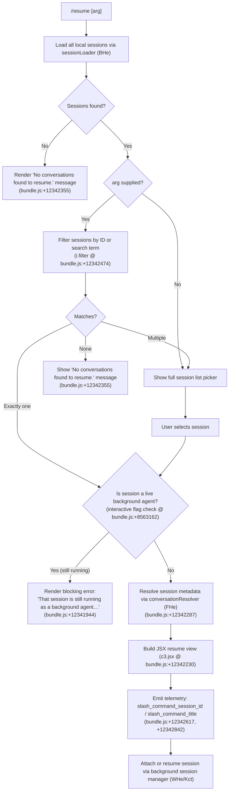

# `/resume`

> Analysis basis: CC v2.1.186 bundle.js (AST extraction + Claude interpretation)
> Minimum version: v2.1.186

---

## Overview

`/resume` (alias: `/continue`) allows the user to pick up a previous Claude Code conversation by supplying a conversation ID or a free-text search term. The command queries the local session store, optionally filters candidates against the supplied argument, and then either attaches the chosen session directly or renders an interactive picker component so the user can select among multiple matches. If the target session is already running as a background agent, resumption is blocked with an instructive error.

---

## Registration

| Field | Value |
|---|---|
| type | `local-jsx` |
| name | `resume` |
| description | `Resume a previous conversation` |
| argumentHint | `[conversation id or search term]` |
| aliases | `["continue"]` |
| module_id | `ELl` |
| load_inline | `true` |
| loc_byte | `12343300` |
| loc_byte_end | `12343497` |
| loc_line | `8142` |
| arbor_handler.name | `vff` |
| arbor_handler.fqn | `claude-2.1.186::vff` |
| arbor_handler.kind | `AsyncFunction` |
| arbor_handler.resolution_path | `module_id` |
| arbor_handler.n_hits | `0` |

Analysis basis: CC v2.1.186 bundle.js:+12343300

---

## Input Branching

The handler `vff` exhibits at least five distinct branching paths based on session availability, background-agent state, search-term matching, and result count. A Mermaid flowchart is used.



---

## Behavioral Spec

### 1. Handler Entry — `vff` (AsyncFunction)

`vff` is the primary async handler resolved by Arbor via `module_id → ELl`.

```
async function resumeCommandHandler(commandArg, appContext):
    // 1. Load sessions
    allSessions = await sessionLoader(appContext)         // BHe → n.listAllLiveSessions
    if allSessions is empty:
        return renderMessage("No conversations found to resume.")

    // 2. Optionally filter
    if commandArg is non-empty:
        candidates = allSessions.filter(session =>
            matchesIdOrSearchTerm(session, commandArg))   // i.filter (loc:+12342474)
    else:
        candidates = allSessions

    if candidates is empty:
        return renderMessage("No conversations found to resume.")

    // 3. Single vs. multiple
    if candidates.length == 1:
        target = candidates[0]
    else:
        target = await showInteractivePicker(candidates)  // WY (loc:+12342742)

    // 4. Background-agent guard
    if isSessionLiveInteractive(target):                  // "interactive" flag (loc:+8563162)
        return renderBlockingError(
            "That session is still running as a background agent…") // (loc:+12341944)

    // 5. Resolve metadata & build view
    metadata = await resolveConversation(target, Date.now())  // FHe (loc:+12342287)
    jsx      = buildResumeJSX(metadata)                       // c3.jsx (loc:+12342230)
    emitTelemetry("slash_command_session_id", target.id)      // (loc:+12342617)
    emitTelemetry("slash_command_title",      metadata.title) // (loc:+12342842)
    attachSession(target, appContext)                          // WHe/Kct path
    return jsx
```

Analysis basis: CC v2.1.186 bundle.js:+12341934, +12342165, +12342194, +12342230, +12342263, +12342287, +12342456, +12342474, +12342488, +12342582, +12342595, +12342611, +12342662, +12342723, +12342742, +12342892

---

### 2. Session Loading — `sessionLoader` (BHe)

`BHe` wraps the daemon's live-session enumeration.

```
async function sessionLoader(context):
    await Promise.resolve()                    // (loc:+8563019)
    sessionConfig = buildSessionConfig()       // Bct (loc:+8563049)
    sessions = await context.listAllLiveSessions(sessionConfig)  // (loc:+8563071)
    sessions = sessions.filter(s => s.type == "interactive")     // "interactive" (loc:+8563162)
    return sessions
```

Analysis basis: CC v2.1.186 bundle.js:+8563019, +8563049, +8563071, +8563162

---

### 3. Search-Term Matching — `searchFilter` (inside `vff` / `yLl`)

The pre-filter step called at `yLl` applies a case-insensitive match against the session list before the handler proceeds.

```
function preFilterSessions(sessions, rawArg):
    filtered = sessions.filter(s => matchesTerm(s, rawArg))  // e.filter (loc:+12341830)
    return digestSessionList(filtered)                         // dh (loc:+12341860)
```

Analysis basis: CC v2.1.186 bundle.js:+12341830, +12341860

---

### 4. Conversation Metadata Resolution — `conversationResolver` (FHe)

`FHe` resolves a session entry into a rich metadata object, including worktree detection, git state, and conversation title derivation.

```
async function conversationResolver(sessionEntry, nowMs):
    nowMs = Date.now()                                   // (loc:+8552115)
    worktreePath = detectWorktree(sessionEntry)          // $r (loc:+8552150)
    emitTelemetry("tengu_worktree_detection", ...)       // W (loc:+8552257)

    // Parse git worktree porcelain output
    lines = sessionEntry.split("\n")                     // n.split (loc:+8552340)
    for line in lines:
        if line.startsWith("worktree "):                 // (loc:+8552365, value:+8552378)
            worktreeName = line.slice(9)                 // (loc:+8552404, offset 9 from +8552412)
            normPath = normalizePath(worktreeName)       // SH (loc:+8552401)

    // Find best-matching session record
    match = sessions.find(s => ...)                      // s.find (loc:+8552504)
    match = match ?? sessions.filter(...)[0]             // s.filter (loc:+8552550)

    // Sort by locale for display
    sessions.sort((a,b) => a.localeCompare(b))          // l.localeCompare (loc:+8552583)
    return buildConversationMetadata(match, worktreePath)
```

Analysis basis: CC v2.1.186 bundle.js:+8552115, +8552150, +8552259, +8552340, +8552365, +8552378, +8552401, +8552404, +8552412, +8552504, +8552523, +8552550, +8552583

---

### 5. Session State Lookup & Attachment — `sessionStateManager` (WHe) and `conversationStore` (Kct)

When a specific session is selected, `WHe` orchestrates looking up per-session metadata (summary, last-prompt, title, tags, agent settings, permission-mode, worktree-state, etc.) from the conversation store `Kct`, then schedules background attachment.

```
function sessionStateManager(sessionId, store):
    entry = store.get(sessionId)                        // Kct path (loc:+12342662)
    if entry:
        metadata = {
            summary:       entry.get("summary"),        // (loc:+13380604)
            lastPrompt:    entry.get("last-prompt"),    // (loc:+13380671)
            customTitle:   entry.get("custom-title"),   // (loc:+13380767)
            aiTitle:       entry.get("ai-title"),       // (loc:+13380845)
            tag:           entry.get("tag"),            // (loc:+13380915)
            agentName:     entry.get("agent-name"),     // (loc:+13380976)
            agentColor:    entry.get("agent-color"),    // (loc:+13381050)
            agentSetting:  entry.get("agent-setting"),  // (loc:+13381126)
            mode:          entry.get("mode"),           // (loc:+13381206)
            permissionMode:entry.get("permission-mode"),// (loc:+13381269)
        }
    return metadata
```

Analysis basis: CC v2.1.186 bundle.js:+13372818, +13373276, +13380604, +13380671, +13380767, +13380845, +13380915, +13380976, +13381050, +13381126, +13381206, +13381269

---

### 6. Interactive Picker — `interactivePicker` (WY)

When multiple sessions match (or no argument was given), `WY` presents an interactive list.

```
async function interactivePicker(candidates, context):
    metadata = await conversationResolver(candidates, Date.now())  // FHe (loc:+13374629)
    normalized = candidates.map(c => c.toLowerCase())              // e.toLowerCase (loc:+13374689)
    filtered = candidates.filter(...)                              // i.filter (loc:+13374714)
    // Truncate display list
    display = filtered.slice(0, MAX_DISPLAY)                       // u.slice (loc:+13375028)
    // Sort for display
    display.sort(...)                                              // u.sort (loc:+13374962)
    // Render using dh helper
    return renderPickerComponent(display)                          // dh (loc:+13374862)
```

Analysis basis: CC v2.1.186 bundle.js:+13374629, +13374633, +13374647, +13374689, +13374714, +13374862, +13374880, +13374918, +13374936, +13374947, +13374962, +13375028

---

### 7. Background-Agent Guard (inline in `vff`)

The literal string `"That session is still running as a background agent. Open \`claude agents\` to attach to it, or stop it there first to resume here."` is surfaced verbatim to the user when the `interactive` flag is set on a matched session.

Analysis basis: CC v2.1.186 bundle.js:+12341944

---

### 8. Output Component — `HLl` (JSX render helper)

`HLl` applies bold formatting to specific parts of the rendered output via `Et.bold`.

```
function resumeOutputRenderer(metadata):
    title = Et.bold(metadata.title)    // HLl → Et.bold (loc:+12339646)
    return renderBox(title, metadata)
```

Analysis basis: CC v2.1.186 bundle.js:+12342892, +12339646

---

### 9. "Session Not Found" / "Multiple Matches" Result Types

Two symbolic result-type constants are used by the JSX layer to display differentiated UI states:

- `"sessionNotFound"` — (bundle.js:+12339611) displayed when no session matches the supplied argument.
- `"multipleMatches"` — (bundle.js:+12339682) displayed when the picker is shown for disambiguation.

Analysis basis: CC v2.1.186 bundle.js:+12339611, +12339682

---

## State & Side Effects

| Item | Detail |
|---|---|
| Telemetry — `tengu_worktree_detection` | Fired during conversation metadata resolution (bundle.js:+8552259) |
| Telemetry — `tengu_bg_attach` | Fired when attaching to a background session (bundle.js:+17148811) |
| Telemetry — `tengu_bg_attach_kick` | Fired when an existing attacher is kicked to allow this session (bundle.js:+17151008) |
| Telemetry — `tengu_bg_attach_stall_respawn` | Fired when a stalled session is respawned during attach (bundle.js:+17150011) |
| Telemetry — `tengu_bg_attach_stall_gave_up` | Fired when stall recovery is abandoned (bundle.js:+17149741) |
| Telemetry — `tengu_bg_attach_legacy_autorespawn` | Fired for legacy sessions without a control key (bundle.js:+17147552) |
| Telemetry — `tengu_bg_attach_upgrade` | Fired when attaching triggers a daemon upgrade path (bundle.js:+13161582) |
| Telemetry — `tengu_daemon_control` | Daemon control events during session attach (bundle.js:+17194642) |
| Telemetry — `tengu_transcript_phantom_parent` | Fired if transcript parent chain has a phantom entry (bundle.js:+13379369) |
| Telemetry — `tengu_transcript_parent_cycle` | Fired if transcript parent chain has a cycle (bundle.js:+13383289) |
| Telemetry — `tengu_chain_parent_cycle` | Fired if conversation chain has a cycle (bundle.js:+13360179) |
| Telemetry — `tengu_chain_timestamp_fallback` | Fired when timestamp fallback is used during chain build (bundle.js:+13360328) |
| Telemetry — `tengu_chain_parallel_tr_recovered` | Fired when parallel transcript entries are recovered (bundle.js:+13362194) |
| Literal key emitted | `"slash_command_session_id"` written to event context (bundle.js:+12342617) |
| Literal key emitted | `"slash_command_title"` written to event context (bundle.js:+12342842) |
| appState changes | Session attachment updates the active session pointer; a `user`-role message is injected (bundle.js:+12342085); a `skip` value is used to skip re-prompting (bundle.js:+12342147) |
| Background agent guard | If `interactive` flag is set on selected session, command returns an error JSX and does NOT attach (bundle.js:+8563162, +12341944) |
| Sound | <!-- TODO: not found in depth-2 traversal; needs --depth 4 --> |
| Hook registration | <!-- TODO: not found in depth-2 traversal; needs --depth 4 --> |

---

## Version History

| Version | Change |
|---|---|
| v2.1.186 | Initial analysis |

---

## Common Mistakes

1. **Trying to `/resume` a live background agent** — The command will refuse with the blocking error message pointing to `claude agents`. The user must stop the background session there before resuming it in the foreground.
2. **Expecting fuzzy matching to be case-sensitive** — The search filter lowercases both the query and session fields before comparing (bundle.js:+13374689; `n.toLowerCase` at +17185444), so exact casing is never required.
3. **Using `/resume` with an ambiguous short prefix** — If multiple sessions match, the command falls through to the interactive picker instead of resuming immediately. Supply a full session UUID to force a direct match.
4. **Assuming `/continue` behaves differently** — `continue` is a registered alias and invokes the identical handler `vff` with no behavioral difference (registration.aliases at bundle.js:+12343300).
5. **Expecting instant attachment in all states** — When a session is in a stalling startup state, the daemon may respawn it before attachment completes; the UI will display `"Session is starting — it will appear once ready. Ctrl+Z to detach"` (bundle.js:+17149362) during this window.

---

## Appendix — Identifier Mapping

> For bundle debugging only. Identifiers change across versions.

| Identifier | Role |
|---|---|
| `vff` | Primary async handler for `/resume` command (arbor_handler) |
| `yLl` | Pre-filter entry point; filters session list before handler |
| `BHe` | Session loader; wraps `listAllLiveSessions` |
| `FHe` | Conversation metadata resolver; worktree + git state |
| `WY` | Interactive session picker renderer |
| `WHe` | Session state manager; orchestrates metadata lookup and attachment |
| `Kct` | Conversation store accessor; per-session metadata map getter |
| `HLl` | JSX output renderer; applies bold formatting via `Et.bold` |
| `dh` | Display helper used by pre-filter and picker |
| `lte` | <!-- TODO: not found in depth-2 traversal; needs --depth 4 --> |
| `vye` | <!-- TODO: not found in depth-2 traversal; needs --depth 4 --> |
| `Re` | Error reporting / logging utility |
| `Ae` | String coercion helper |
| `gr` | Path utility (used in conversation resolver and picker) |
| `SH` | Path normalizer (`e.normalize`, NFC) |
| `wM` | Regex-based input validator (`hTc.test`) |
| `$r` | Main conversation run-loop / session spawner |
| `R1e` | Child process / subprocess manager |
| `QNl` | Daemon status JSON reader (`daemon.status.json`) |
| `zqt` | Status file path builder |
| `rKt` | Conversation list builder; aggregates session entries |
| `r9l` | Session directory walker; reads project transcript files |
| `n9l` | Wrapper that composes `Yle` (session entry store) with `ywf` |
| `Yle` | Session entry store; manages per-session metadata maps |
| `ywf` | Worktree and session path resolver |
| `n7` | Projects directory path builder |
| `iDe` | Session transcript entry processor |
| `jVt` | Session-to-metadata cache manager |
| `$Mo` | Directory recursive reader for session files |
| `nqe` | Session file byte-level reader |
| `vwf` | Low-level session file parser |
| `GHe` | Chain builder for conversation threads |
| `swf` | NaN-safe chain entry validator |
| `iwf` | Interleaved chain parallel-recovery resolver |
| `rwf` | Chain shift/push ordering helper |
| `Q3l` | Chain dedup/aggregator |
| `dJn` | Timestamp parser (`Date.parse`) |
| `pJn` | Per-session metadata getter/setter |
| `fJn` | Flat metadata values extractor |
| `UMo` | Unified metadata object builder |
| `JMo` | Conversation title truncator / slice helper |
| `Vct` | Session map helper |
| `ZMo` | Attachment/media-type filter |
| `awf` | Array-or-string predicate (`.some`) |
| `lwf` | Array predicate helper |
| `DA` | <!-- TODO: not found in depth-2 traversal; needs --depth 4 --> |
| `dqt` | Conversation content parser (text/tool_result/image/document) |
| `fl` | Markdown/frontmatter parser |
| `v3l` | Session roster walker |
| `nwf` | Roster chain relinker |
| `Go` | KVe-based initialization helper |
| `gwf` | Binary transcript file parser |
| `Hwf` | High-level transcript file reader/indexer |
| `_wf` | Synchronous transcript file reader |
| `$Ae` | BOM/encoding detector |
| `BSe` | JSON.parse wrapper for transcript entries |
| `zo` | `mn`-based utility |
| `Wn` | <!-- TODO: not found in depth-2 traversal; needs --depth 4 --> |
| `T$` | GL-based path formatter |
| `Ew` | Recursive directory lister |
| `T` | Conversation file I/O helper; system command runner |
| `De` | JSON.stringify wrapper |
| `Lc` | Path component extractor (lastIndexOf/slice/at) |
| `Fvc` | File context builder (dirname, byteLength, mcr) |
| `Pvc` | Path/locale formatter |
| `eze` | `cWo`-based string transformer |
| `Bt` | JSON.parse safe wrapper |
| `mn` | Module-level constant/utility |
| `ip` | <!-- TODO: not found in depth-2 traversal; needs --depth 4 --> |
| `W` | Telemetry/event emitter |
| `Pe` | `KVe`-based environment helper |
| `xe` | Feature flag checker (ok path) |
| `ke` | Feature flag checker (ok path, alternate) |
| `D` | Session lifecycle manager |
| `f` | Background session worker loop |
| `KBo` | Background session job executor |
| `$Bo` | Daemon socket connector |
| `L` | Background session sweep/GC loop |
| `q` | Background session task scheduler |
| `N` | Background session settler |
| `it` | Permission classifier |
| `IXn` | Memory probe helper (macOS) |
| `CVt` | Memory/GC sweep trigger |
| `q2l` | Background retire-grace bridged helper |
| `CXn` | Background upgrade-attach helper |
| `D2e` | Stale session file cleaner |
| `bYf` | Daemon protocol message handler |
| `H` | Daemon protocol I/O buffer |
| `fp` | Stream end helper |
| `Bn` | Socket connection retrier |
| `Z3e` | MCP connection lifecycle manager |
| `arr` | MCP update applier |
| `maa` | MCP server initializer |
| `q2o` | MCP client roster reconciler |
| `ee` | MCP server group handler |
| `Yle` | (see above — session entry store) |
| `uae` | Scheduled task sweeper |
| `UPt` | Task window calculator |
| `Awn` | Task window max-calculator |
| `xdc` | Boolean coercion helper |
| `QV` | Set membership checker |
| `vJt` | Message token processor |
| `IJt` | Token validator |
| `CJt` | Token string cleaner |
| `qye` | Array isArray + filter helper |
| `ao` | Error/String formatter |
| `ot` | String coercion utility |
| `Ki` | `ins`-based key inserter |
| `ins` | Key normalization helper |
| `Pnu` | Queue shift/push manager |
| `Hss` | Process spawn helper (utf8/win32) |
| `K_r` | Process argument builder |
| `z_r` | Process output stream handler |
| `Y_r` | Process result assembler |
| `Ios` | Number.isFinite guard |
| `WTt` | Child process buffer manager |
| `V_r` | Reflect.apply wrapper |
| `tss` | EventEmitter `on` helper |
| `Tos` | Timeout race helper |
| `Cos` | Process kill helper |
| `Aos` | Process spawn args builder |
| `bos` | Process SIGKILL escalator |
| `Zos` | Promise.all process manager |
| `zTt` | `I_r`-based subprocess handler |
| `Jos` | Pipe/stream joiner |
| `Qos` | `jos.default` stream add |
| `kos` | `P_r.bind` process binding |
| `fsu` | String formatter for child process |
| `psu` | `mn`-based process util |
| `p` | Forced-shutdown / process.exit handler |
| `Kb` | <!-- TODO: not found in depth-2 traversal; needs --depth 4 --> |
| `u` | Abort controller / session abort handler |
| `gU` | <!-- TODO: not found in depth-2 traversal; needs --depth 4 --> |
| `j6` | <!-- TODO: not found in depth-2 traversal; needs --depth 4 --> |

---

Note: index built via Arbor fallback; some signals (telemetry, literals) may be missing — see arbor-fallback.js.