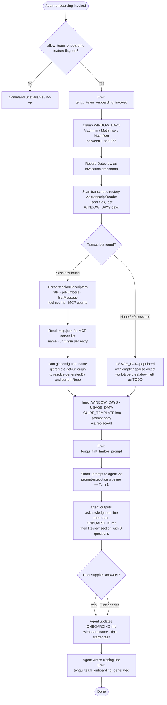

# `/team-onboarding`

> Analysis basis: CC v2.1.186 bundle.js (AST extraction + Claude interpretation)
> Minimum version: v2.1.186

---

## Overview

`/team-onboarding` is a `prompt`-type slash command that scans the invoking user's local Claude Code transcripts from the past configurable number of days, derives a work-type breakdown from those sessions, and co-authors a ready-to-share `ONBOARDING.md` guide that teammates can paste into Claude Code for an interactive walkthrough. The command runs in two collaborative turns: it produces a concrete first draft immediately, then asks three targeted review questions before finalising the file.

---

## Registration

| Field | Value |
|---|---|
| type | `prompt` |
| name | `team-onboarding` |
| description | Help teammates ramp on Claude Code with a guide from your usage |
| isHidden | `false` |
| loc_byte | `13137181` |
| loc_byte_end | `13138255` |
| loc_line | `8981` |
| handler_method | `getPromptForCommand` |
| handler_method_start | `13137544` |
| handler_method_end | `13138254` |
| prompt_body.length | `4539` characters |
| prompt_body.trace | `identifier→l (local→1 ext vars)` |
| arbor_handler.name | `getPromptForCommand` |
| arbor_handler.kind | `Method` |
| arbor_handler.fqn | `claude-2.1.186::getPromptForCommand` |
| arbor_handler.resolution_path | `direct` |
| arbor_handler.n_hits | `2` |

Analysis basis: CC v2.1.186 bundle.js:+13137181

---

## Input Branching

The handler follows more than three distinct paths (feature-flag guard, window-day clamping, transcript scan result, MCP data presence), so a Mermaid flowchart is used.



---

## Behavioral Spec

### 1. Feature-flag guard

Before any data collection, the handler checks that the `allow_team_onboarding` feature flag is active for the current account tier (Analysis basis: CC v2.1.186 bundle.js:+10300457). The flag is evaluated via the same subscription/plan resolver used by other gated commands (identifiers `sft` → `Js` → `allow_team_onboarding` literal). If the flag is absent the command does not proceed.

### 2. Window-day clamping

```
function clampWindowDays(rawValue):
    lower  = Math.max(1, rawValue)
    upper  = Math.min(365, lower)
    result = Math.floor(upper)
    return result          # integer in [1, 365]
```

The constants `1` and `365` are sourced directly from the handler (Analysis basis: CC v2.1.186 bundle.js:+13137790 and +13137793). A `Date.now()` call immediately after records the invocation epoch for transcript age filtering (Analysis basis: CC v2.1.186 bundle.js:+13137893).

### 3. Transcript scanning (`transcriptReader`)

```
async function readTranscripts(transcriptDir, windowDays, nowMs):
    cutoff  = nowMs - windowDays * 24 * 60 * 60 * 1000
    files   = await fs.readdir(transcriptDir)
    jsonlFiles = files.filter(f => path.extname(f) === ".jsonl")

    sessions = []
    for file in jsonlFiles:
        stat = await fs.stat(path.join(transcriptDir, file))
        if stat is not a file: continue
        if stat.mtime < cutoff: continue

        raw = await fs.readFile(path.join(transcriptDir, file))
        lines = raw.split("\n")

        descriptor = extractSessionDescriptor(lines)
        # descriptor contains: title, prNumbers, firstUserMessage,
        #                       toolCallCount, mcpCallCount
        sessions.append(descriptor)

    return sessions
```

The filter uses `.jsonl` extension (Analysis basis: CC v2.1.186 bundle.js:+13126226) and the constants `24` hours and `60` minutes (Analysis basis: CC v2.1.186 bundle.js:+13126111 and +13126114). MCP server names are detected by scanning for the literal prefix `"name":"mcp__` (Analysis basis: CC v2.1.186 bundle.js:+13126805). Tool-result blocks are identified by the literal `"content":[` with a minimum content-array depth of `3` (Analysis basis: CC v2.1.186 bundle.js:+13127155 and +13127258).

### 4. MCP server discovery (`mcpConfigReader`)

```
function readMcpConfig(workspaceRoot):
    mcpPath = path.join(workspaceRoot, ".mcp.json")
    raw     = fs.readFileSync(mcpPath)
    parsed  = JSON.parse(raw)
    servers = parsed["mcpServers"] ?? {}
    return servers   # keyed by name, each may include urlOrigin
```

The literal keys `".mcp.json"` and `"mcpServers"` are confirmed in the bundle (Analysis basis: CC v2.1.186 bundle.js:+13128256 and +13128312).

### 5. Git metadata resolution

```
function resolveGitMeta(cwd):
    userName   = runGit(["config", "user.name"], cwd)
    remoteUrl  = runGit(["remote", "get-url", "origin"], cwd)
    currentRepo = path.basename(remoteUrl or cwd)
    generatedBy = userName.trim() or null
    return { currentRepo, generatedBy }
```

The git subcommand literals `"config"`, `"user.name"`, `"remote"`, `"get-url"`, and `"origin"` appear in the handler (Analysis basis: CC v2.1.186 bundle.js:+13128879 through +13128970). If git is unavailable the values are omitted gracefully.

### 6. Prompt assembly and template substitution

```
function buildPrompt(promptTemplate, context):
    filled = promptTemplate
        .replaceAll("{{WINDOW_DAYS}}", String(context.windowDays))
        .replaceAll("{{USAGE_DATA}}",  JSON.stringify(context.usageData))
        .replaceAll("{{GUIDE_TEMPLATE}}", context.guideTemplate)
    return filled
```

The three placeholder literals `{{WINDOW_DAYS}}`, `{{USAGE_DATA}}`, and `{{GUIDE_TEMPLATE}}` are explicit in the handler (Analysis basis: CC v2.1.186 bundle.js:+13138004, +13138079, and +13138044). The call to `String()` coerces the day count (Analysis basis: CC v2.1.186 bundle.js:+13138022) and `t.replaceAll` performs in-place substitution (Analysis basis: CC v2.1.186 bundle.js:+13137991).

### 7. Work-type classification (agent-side, instructed by prompt)

The prompt instructs the agent to classify each session into exactly one of seven task types:

| Category key | Display label | Description (per prompt) |
|---|---|---|
| `build_feature` | Build Feature | New functionality, scripts, tools, config/CI/env setup |
| `debug_fix` | Debug Fix | Investigating and fixing bugs |
| `improve_quality` | Improve Quality | Refactoring, tests, cleanup, code review |
| `analyze_data` | Analyze Data | Queries, metrics, number crunching |
| `plan_design` | Plan Design | Architecture, approach, strategy, design review |
| `prototype` | Prototype | Spikes, POCs, throwaway exploration |
| `write_docs` | Write Docs | PRDs, RFCs, READMEs, design docs |

The agent selects the top 3–5 categories with rough percentages. When first messages are uninformative, tool and MCP call counts serve as a weak tiebreaker. If the session count is approximately zero, the breakdown is left as a TODO placeholder.

### 8. Guide authoring — two-turn collaborative flow

**Turn 1 — immediate draft:**

The prompt mandates a fixed first visible output line beginning with "Looking at how you've used Claude over the last" before any classification or tool use. This line is non-negotiable: no thinking, no tool calls precede it. The agent then produces the full `ONBOARDING.md` draft in a fenced code block, followed by a `---` rule and a `**Review**` heading containing exactly three numbered questions:

1. Team-name confirmation (or request).
2. Starter task prompt (ticket or doc link, optional).
3. Request for team tips not already in `CLAUDE.md`.

**Turn 2 — revision loop:**

After the user responds, the agent writes the final `ONBOARDING.md` with:
- Confirmed team name
- Supplied team tips
- Starter task link

It then closes with a fixed exact line: `Saved to \`ONBOARDING.md\`. Drop it in your team docs and channels — when a new teammate pastes it into Claude Code, they get a guided onboarding tour from there.`

Further edits from the user are applied directly to the file.

### 9. ASCII bar chart rendering

The guide template calls for ASCII bar charts using `█` (filled) and `░` (empty) characters at exactly 20 characters wide. Values come from the real usage-data numbers; no placeholder values are permitted in the rendered guide.

### 10. `generatedBy` handling

If the git `user.name` lookup succeeds, the guide credits the author by name. If the lookup fails or returns empty, the name attribution is omitted entirely from the guide.

---

## State & Side Effects

| Item | Detail |
|---|---|
| Telemetry — invocation | `tengu_team_onboarding_invoked` emitted at handler entry (CC v2.1.186 bundle.js:+13137804) |
| Telemetry — prompt sent | `tengu_flint_harbor_prompt` emitted when prompt is submitted to agent (CC v2.1.186 bundle.js:+13137581) |
| Telemetry — guide generated | `tengu_team_onboarding_generated` emitted after guide is written (CC v2.1.186 bundle.js:+13138123) |
| Telemetry — share | `tengu_flint_harbor_share` emitted via the `allow_team_onboarding` feature-flag path (CC v2.1.186 bundle.js:+10300519) |
| Telemetry — config lock | `tengu_config_lock_contention` if config lock acquisition is slow (CC v2.1.186 bundle.js:+13850557) |
| Telemetry — config stale write | `tengu_config_stale_write` on stale config write attempt (CC v2.1.186 bundle.js:+13850693) |
| Telemetry — config parse error | `tengu_config_parse_error` on config parse failure (CC v2.1.186 bundle.js:+13853132) |
| Telemetry — config fallback write | `tengu_config_fallback_write` on fallback config write path (CC v2.1.186 bundle.js:+13850173) |
| Telemetry — config auth loss | `tengu_config_auth_loss_prevented` when write is refused to avoid wiping auth (CC v2.1.186 bundle.js:+13851036) |
| File written | `ONBOARDING.md` created or updated in the working directory after Turn 2 |
| File read | `.mcp.json` in workspace root (non-fatal if absent) |
| Subprocesses | `git config user.name` and `git remote get-url origin` (non-fatal if git unavailable) |
| Filesystem scan | User's Claude Code transcript directory — reads `.jsonl` files, no writes |
| appState changes | None identified within depth-2 traversal |
| Sound | None identified |
| Hook registration | None identified |

---

## Version History

| Version | Change |
|---|---|
| v2.1.186 | Initial analysis — command registered, `getPromptForCommand` handler confirmed via Arbor direct resolution |

---

## Common Mistakes

1. **Invoking without the feature flag active.** The `allow_team_onboarding` flag gates the command entirely. Users on plans that do not expose this flag will see no output or an error; upgrading the plan or enabling the flag in org settings is required.

2. **No transcripts in the window.** If the user has no `.jsonl` files newer than `WINDOW_DAYS` days, the work-type breakdown is left as a TODO in the draft. Running `/team-onboarding` after an active period of Claude Code usage produces more useful guides.

3. **Git not initialised in the working directory.** The `generatedBy` and `currentRepo` fields rely on `git config user.name` and `git remote get-url origin`. In a non-git directory both are omitted silently; the guide still generates but lacks author attribution and repo context.

4. **Editing `ONBOARDING.md` before Turn 2 is complete.** The file is written only after the agent receives the Turn 2 review answers and emits the closing line. Editing the file externally before that point risks the agent overwriting manual changes.

5. **Expecting instant classification.** The prompt explicitly orders the agent to emit the acknowledgment line *before* any classification thinking. If the model skips or delays this line the guide creator sees a blank screen; this is a prompt-compliance issue, not a CLI bug.

6. **Assuming all seven task categories will always appear.** The agent selects only the top 3–5 categories observed in the transcript data. Categories not represented in the user's sessions are omitted from the guide.

7. **Misreading the `{{WINDOW_DAYS}}` default.** The value is clamped to the integer range `[1, 365]`; values outside that range are silently clamped, not rejected.

---

## Appendix — Identifier Mapping

> For bundle debugging only. Identifiers change across versions.

| Identifier | Role |
|---|---|
| `__handler_team-onboarding` | Synthetic BFS entry point for the command handler; maps to `getPromptForCommand` |
| `it` | Prompt-execution pipeline dispatcher |
| `ORt` | Prompt pipeline sub-routine A (called from dispatcher) |
| `NRt` | Prompt pipeline sub-routine B (called from dispatcher) |
| `$9` | Prompt pipeline branching helper |
| `F9` | Prompt execution core |
| `T2` | Prompt state initialiser |
| `JEn` | Deduplication / session-tracking helper |
| `M2r` | Session record builder |
| `o$e` | Session persistence helper |
| `_W` | Random-bytes / nonce generator |
| `De` | JSON serialiser wrapper |
| `Wsd` | Event emitter utility |
| `F2r` | Prompt routing function |
| `bai` | Template string utility |
| `Nr` | Display / render helper |
| `Byi` | Prompt metadata tagger |
| `G$` | Capability set checker |
| `Jm` | UI update helper |
| `wt` | Timestamp / clock utility |
| `W` | General-purpose wait / async helper |
| `_n` | Config save (global) orchestrator |
| `IQn` | Config save-with-lock implementation |
| `Gt` | File-system accessor (read/stat) |
| `RGs` | Config object merger |
| `ERr` | Config error handler |
| `T` | API request builder / sender |
| `Pvc` | API endpoint resolver |
| `Lc` | String path normaliser |
| `eze` | String codec helper |
| `Fvc` | HTTP request executor |
| `mn` | Error logger |
| `cEe` | Config file reader with backup logic |
| `Bt` | JSON.parse wrapper |
| `i9` | String prefix stripper |
| `HGl` | Backup directory enumerator |
| `_Oo` | Path joiner with OS separator |
| `f` | Background session / process manager |
| `EHt` | Config auth-loss guard |
| `n` | String lower-case normaliser |
| `I` | Scroll / cursor position calculator |
| `x` | Input event handler |
| `A` | Viewport clamp helper |
| `H` | IPC message framer / parser |
| `g` | Socket read helper |
| `m` | Process kill helper |
| `fp` | Stream end / flush helper |
| `bYf` | Daemon message dispatch handler |
| `Ae` | String coercion utility |
| `BTt` | Atomic file write helper (rename-on-close) |
| `Fd` | Real-path resolver |
| `u` | Daemon lifecycle helper |
| `kn` | Error code mapper |
| `l7e` | Permission error classifier |
| `fDe` | Config directory resolver |
| `hOo` | Object entries iterator |
| `TKt` | Timestamp comparator |
| `TQn` | Config write with lock (outer) |
| `Pe` | Promise-based event waiter |
| `KVe` | Promise resolve helper |
| `wIf` | Usage-data collector (transcript scanner orchestrator) |
| `gr` | Logger / telemetry emitter |
| `GL` | Global logger instance |
| `X$` | Project config path resolver |
| `oO` | Projects directory resolver |
| `DE` | Path relative-iser |
| `Sru` | Absolute-path length comparator |
| `E2l` | Transcript file reader and session descriptor extractor |
| `zo` | Error suppressor / null-coalescer |
| `o` | String padding formatter |
| `c` | File-type checker |
| `bn` | Background session type guard |
| `l` | JSONL line parser |
| `QNl` | Session line classifier |
| `p` | Process / abort controller |
| `Kb` | Abort signal handler |
| `vIf` | MCP config file reader (`.mcp.json`) |
| `CIf` | Git metadata resolver |
| `$r` | Child-process spawner (git commands) |
| `R1e` | Child-process execution core |
| `Hss` | Shell command builder |
| `K_r` | Argument sanitiser A |
| `z_r` | Argument sanitiser B |
| `Y_r` | Argument sanitiser C |
| `Ios` | Finite-number validator |
| `WTt` | Child-process output buffer |
| `V_r` | Reflect-apply wrapper |
| `tss` | Process event listener |
| `Tos` | Process timeout handler |
| `Cos` | Process kill-on-timeout |
| `Aos` | Process stdout handler |
| `bos` | Process force-kill handler |
| `Zos` | Promise.all coordinator for process I/O |
| `zTt` | Process I/O stream setup |
| `Jos` | Pipe connector |
| `Qos` | stdio add helper |
| `kos` | Process binding helper |
| `fsu` | String coercion (child-process output) |
| `ip` | Internal path resolver |
| `psu` | Error message formatter |
| `Re` | Execution error reporter |
| `ao` | Error object builder |
| `ot` | String coercer (general) |
| `Ki` | Subscription / feature-flag resolver |
| `Pnu` | Log ring-buffer manager |
| `P1e` | Git remote URL parser |
| `Wsu` | Host extractor from URL |
| `fi` | String slice-at-index helper |
| `sft` | Feature-flag gate for `allow_team_onboarding` |
| `Js` | Plan/tier feature-set evaluator |
| `cEi` | Feature-set cache lookup |
| `Xz` | Feature-set cache entry builder |
| `C2` | Auth-context resolver |
| `br` | Auth provider identifier |
| `Su` | Auth token accessor |
| `Wg` | API auth config builder |
| `iA` | OAuth profile resolver |
| `Sme` | Feature-set capability tester |
| `aA` | Feature-set capability mapper |

---

Note: index built via Arbor fallback; some signals (telemetry, literals) may be missing — see arbor-fallback.js.