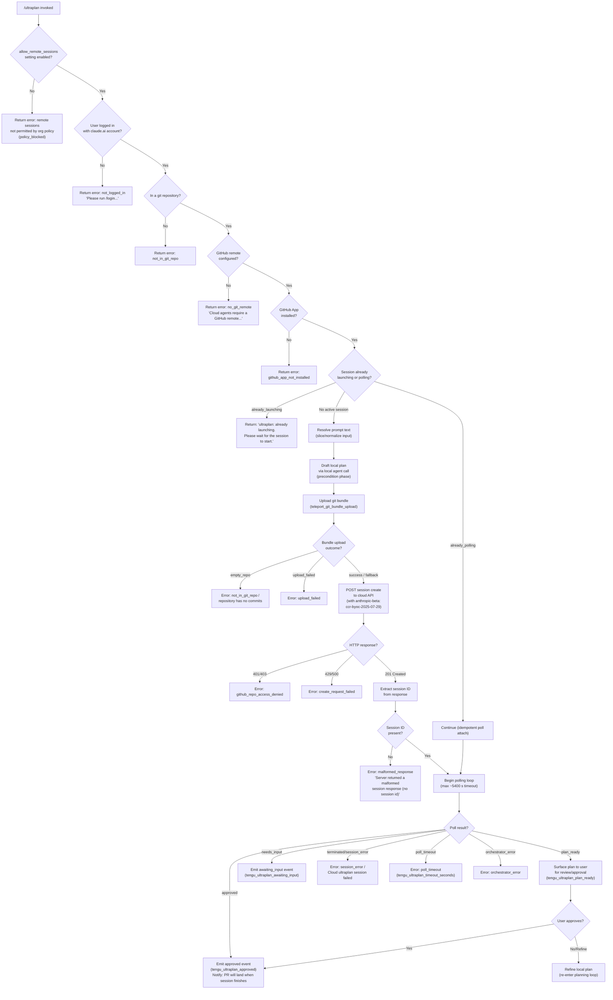

# `/ultraplan`

> Analysis basis: CC v2.1.186 bundle.js (AST extraction + Claude interpretation)
> Minimum version: v2.1.186

---

## Overview

`/ultraplan` drafts an editable plan in Claude Code on the web by launching a cloud (remote) agent session. The command checks a series of preconditions (authentication, git repo, remote, GitHub App, organizational policy), uploads the current repository state as a git bundle, creates a remote cloud session, and then polls for the resulting plan — surfacing it back to the local CLI for user review and approval.

---

## Registration

| Field | Value |
|---|---|
| type | `local-jsx` |
| name | `ultraplan` |
| description | `Draft an editable plan in Claude Code on the web ( ... ) · See  ...` |
| argumentHint | `<prompt>` |
| load_inline | `true` |
| load_ident | `Jff` |
| loc_byte | `12376630` |
| loc_byte_end | `12376862` |
| loc_line | `8233` |
| arbor_handler.name | `Jff` |
| arbor_handler.fqn | `claude-2.1.186::Jff` |
| arbor_handler.kind | `AsyncFunction` |
| arbor_handler.resolution_path | `load_ident` |
| arbor_handler.n_hits | `1` |

Analysis basis: CC v2.1.186 bundle.js:+12376630

The handler was inlined into a `load:()=>Promise.resolve({call: Jff})` shape (no `module_id`). The Arbor symbol graph resolved it via `load_ident` path with exactly 1 hit. `Jff` is the sole authoritative entry point for this command.

---

## Input Branching

The command has 5+ distinct state branches (pre-condition failures, already-launching guard, cloud-session launch, plan-ready poll, approval/rejection). A Mermaid flowchart is used.



Analysis basis: CC v2.1.186 bundle.js:+12374765, +12372212, +12372230, +12372277, +12373697

---

## Behavioral Spec

### 1. Handler Entry — `ultraplanHandler` (`Jff`)

```
async function ultraplanHandler(commandContext):
    appState = commandContext.getAppState()

    // Check remote sessions policy
    if not appState.allow_remote_sessions:
        return error("policy_blocked")

    // Resolve normalized prompt text
    rawPrompt = commandContext.input
    normalizedPrompt = resolvePrompt(rawPrompt)   // via promptNormalizer (iqn)

    // Guard: already launching or polling
    launchState = checkLaunchState()              // via sessionStateChecker (Js)
    if launchState == "already_launching":
        return message("ultraplan: already launching. Please wait for the session to start.")
    // "already_polling" falls through to attach to the existing poll

    // Eligibility preconditions
    eligibilityResult = await checkEligibility(appState)
    if eligibilityResult.error:
        return eligibilityResult

    // Launch main session workflow
    result = await launchUltraplanSession(normalizedPrompt, appState)

    commandContext.setAppState(updatedState)
    return result
```

Analysis basis: CC v2.1.186 bundle.js:+12374765, +12375100, +12375131, +12375221, +12375259, +12375293, +12375322

---

### 2. Prompt Normalization — `promptNormalizer` (`iqn`)

```
function resolvePrompt(rawInput):
    // Detect if "ultraplan" keyword appears anywhere in input
    // (case-insensitive, global regex match "gi")
    normalized = sqn(rawInput)        // stripCommandPrefix (sqn)

    // If the word "ultraplan" is in the stripped text,
    // the slice already serves as the prompt body.
    // Otherwise use the full input slice.
    result = rawInput.slice(...)      // trim leading command token
    result = result.replace("$1$2", ...)   // collapse whitespace sequences

    // Truncate identifier suffix to max 40 chars
    // Numeric replacement constant: 5 words
    return result
```

Analysis basis: CC v2.1.186 bundle.js:+11000751, +11000779, +11000850, +11000876, +11000899, +11000199

**Key constants:**
- Regex flags: `"gi"` (global + case-insensitive) for the `"ultraplan"` keyword match (bundle.js:+11000199, +11000551)
- Replacement pattern: `"$1$2"` (bundle.js:+11000876)
- Word count threshold: `5` (bundle.js:+11000899)
- Name suffix max length: `40` characters (bundle.js:+17185518)

---

### 3. Session State Check — `sessionStateChecker` (`Js`)

```
function checkLaunchState():
    // Checks two Set-based registries:
    //   - activePollingSet (gid): sessions currently being polled
    //   - activeLaunchingSet (Hid): sessions currently launching

    if activePollingSet.has(sessionKey):
        return "already_polling"
    if activeLaunchingSet.has(sessionKey):
        return "already_launching"

    // Check firstParty provider requirement
    providerInfo = getProviderConfig()     // C2
    if providerInfo.type != "firstParty":
        return error("not_first_party",
            "Cloud sessions are only available on the first-party Anthropic API provider.")

    // Check allow_product_feedback setting (Sme)
    // Check authentication credential presence
    return "eligible"
```

Analysis basis: CC v2.1.186 bundle.js:+3347778, +3347810, +3347793, +3347860, +3347261

**Key literals:**
- Provider type required: `"firstParty"` (bundle.js:+3347261)
- Org plan literals checked: `"enterprise"`, `"team"` (bundle.js:+3347533, +3347568)
- Feedback setting key: `"allow_product_feedback"` (bundle.js:+3347834)

---

### 4. Eligibility Check — `eligibilityWorker` (`lha`, called via `Xle`)

```
async function checkEligibility(appState):
    // Run eligibility checks in parallel (Promise.all)
    results = await Promise.all([
        checkLogin(),
        checkGitRepo(),
        checkGitRemote(),
        checkGithubApp(),
        checkOrgPolicy()
    ])

    // Aggregate results, return first blocking error

    // If BYOC environment detected (literal "byoc"):
    //   check "github.com" presence in remote URL
    //   emit tengu_ccr_bundle_seed_enabled if seed bundle used

    return firstError ?? { ok: true }
```

Analysis basis: CC v2.1.186 bundle.js:+8606056, +7202749, +7202884, +7203130, +7203418, +7203222

**Error codes surfaced:**
| Code | Message |
|---|---|
| `not_logged_in` | `Please run /login and sign in with your Claude.ai account (not Console).` (bundle.js:+8606203) |
| `not_in_git_repo` | (implicit) (bundle.js:+8606282) |
| `no_git_remote` | `Cloud agents require a GitHub remote. Add one with \`git remote add origin REPO_URL\`.` (bundle.js:+8606438) |
| `github_app_not_installed` | (bundle.js:+8606529) |
| `policy_blocked` | `Cloud sessions are disabled by your organization's policy. Contact your organization admin to enable them.` (bundle.js:+8606706) |

---

### 5. Git Bundle Upload — `gitBundleUploader` (`jlo`)

```
async function uploadGitBundle(sessionConfig):
    // Phase logged: "[teleport] phase: env-select" (bundle.js:+8594752)

    // Verify git repository
    if not inGitRepo():
        return { status: "empty_repo", error: "Not in a git repository" }

    // Create stash reference for uncommitted changes
    // git update-ref refs/seed/stash / refs/seed/root
    // git for-each-ref --count=1 refs/

    // git rev-parse --verify HEAD
    // If no commits: return "Repository has no commits yet"

    // Bundle the repository
    bundleName = "ccr-seed" + ".bundle"   // or "_source_seed.bundle"
    // Upload bundle via HTTP POST (checking HTTP 200)

    // Log phase: "[teleport] phase: bundle-upload"
    // Emit: tengu_ccr_bundle_upload

    // Clean up temp files (Yct.unlink)

    return { status: "success" | "head" | "fallback_head" | "squashed" | "fallback_squashed" }
```

Analysis basis: CC v2.1.186 bundle.js:+8575791, +8575849, +8575881, +8575921, +8575939, +8576023, +8576113, +8577116, +8577423, +8577724

**Key literals:**
- Stash ref: `"refs/seed/stash"` (bundle.js:+8575921)
- Root ref: `"refs/seed/root"` (bundle.js:+8575939)
- Bundle name suffix: `".bundle"` (bundle.js:+8577127)
- Seed bundle name: `"_source_seed.bundle"` (bundle.js:+8577423)
- HTTP success: `200` (bundle.js:+8576637)

---

### 6. Session Creation — `remoteSessionCreator` (`R5`)

```
async function createRemoteSession(prompt, bundleInfo, orgUuid):
    // Resolve access token
    if not accessToken:
        return error("no_access_token",
            "Cloud sessions require a claude.ai login. Run /login to authenticate.")

    // Resolve org UUID
    if not orgUuid:
        return error("no_org_uuid",
            "Unable to get organization UUID for cloud session creation")

    // Build HTTP request headers:
    //   "Content-Type": "application/json"
    //   "anthropic-version": "2023-06-01"
    //   "anthropic-beta": "ccr-byoc-2025-07-29"
    //   "x-organization-uuid": orgUuid

    // POST to cloud API endpoint
    // Log phase: "[teleport] phase: POST-sent"
    response = await co.post(sessionEndpoint, payload, headers)

    // Handle response codes:
    if response.status in [401, 403]:
        return error("github_repo_access_denied")
    if response.status in [429, 500]:
        return error("create_request_failed")
    if response.status == 409:
        // Conflict — handle duplicate
    if response.status == 201:
        sessionId = response.data.id
        if not sessionId:
            return error("malformed_response",
                "Server returned a malformed session response (no session id)")
        return { sessionId }

    // Emit: tengu_teleport_bundle_mode
    // Emit: tengu_ccr_session_link
```

Analysis basis: CC v2.1.186 bundle.js:+8591542, +8592156, +8592210, +8592612, +8592629, +8592651, +8593852, +8593944, +8594013, +8594017, +8594021, +8594518, +8594581, +8592979, +8586085

**HTTP status code handling:**
| Status | Outcome |
|---|---|
| `201` | Success — session created (bundle.js:+8593944) |
| `401` | `github_repo_access_denied` (bundle.js:+8594013) |
| `403` | `github_repo_access_denied` (bundle.js:+8594017) |
| `429` | `create_request_failed` (bundle.js:+8594021) |
| `500` | `create_request_failed` (bundle.js:+8593908) |
| `409` | Duplicate / conflict (bundle.js:+8602439) |

**API version header:** `"ccr-byoc-2025-07-29"` (bundle.js:+8592629)

---

### 7. Plan Poll Loop — `planPoller` (`BLl` + `Kff`)

```
async function pollForPlan(sessionId, timeout):
    // Maximum timeout: 5400 seconds (90 minutes)
    // (bundle.js:+12367519 value: 5400)
    // Poll interval base: 1000 ms, max: 1800000 ms (30 min)
    // (bundle.js:+8613249, +8613256)

    startTime = Date.now()
    deadline = startTime + (timeout * 1000)   // timeout in seconds

    loop:
        if Date.now() > deadline:
            emit("tengu_ultraplan_timeout_seconds")
            return error("timeout_pending" | "timeout_no_plan")

        status = await fetchSessionStatus(sessionId)

        switch status:
            case "plan_ready":
                emit("tengu_ultraplan_plan_ready")
                plan = extractPlanFromSession(sessionId)
                return { status: "plan_ready", plan }

            case "needs_input":
                emit("tengu_ultraplan_awaiting_input")
                // Continue polling

            case "approved":
                emit("tengu_ultraplan_approved")
                return { status: "approved",
                    message: "Results will land as a pull request when the cloud session finishes. There is nothing to do here." }

            case "terminated" | "session_error":
                emit("tengu_ultraplan_failed")
                return error("session_error",
                    "Cloud ultraplan session failed. Wait for the user's next instructions.")

            case "orchestrator_error":
                return error("orchestrator_error")

            case "poll_timeout":
                return error("poll_timeout")

            case "running" | "starting" | "pending":
                wait(backoffInterval)

        // On network error: retry with backoff
        // After repeated retries: return "network_or_unknown"
        //   with message: "Lost connection to the cloud session after repeated retries..."
```

Analysis basis: CC v2.1.186 bundle.js:+12367519, +12358347, +12358486, +12358542, +12358771, +12358845, +12359030, +12359104, +12359230, +12359345, +12359483, +12359535, +12359550, +12359665, +12359888, +12359906, +8613249, +8613256

**Key timeout constants:**
- Overall timeout: `5400` seconds (90 minutes) (bundle.js:+12367519)
- Poll interval min: `1000` ms (bundle.js:+8613249)
- Poll interval max: `1800000` ms (30 minutes) (bundle.js:+8613256)
- Time unit display: `"minute"` / `"minutes"` (bundle.js:+12359680, +12359689), with unit: `60000` ms (bundle.js:+12359665)

---

### 8. Remote Session Launcher — `remoteWorkflowOrchestrator` (`Xff`)

```
async function launchUltraplanSession(prompt, appState):
    // Phase 1: Eligibility (lha via Xle)
    eligibility = await checkEligibility(appState)
    if eligibility.error:
        return emitPreconditionError(eligibility)   // type: "precondition"

    // Phase 2: Title generation for the task branch (kIp)
    //   Uses claude/task endpoint pattern
    //   Schema fields: "title", "branch"
    //   Label: "Background task" (bundle.js:+8596730)
    //   Emit: tengu_teleport_bundle_mode

    // Phase 3: Git bundle upload (R5 → jlo)
    //   Phase log: "[teleport] phase: branch-detect" (bundle.js:+8596557)
    bundleResult = await uploadGitBundle(config)

    // Phase 4: POST session create (R5)
    sessionResult = await createRemoteSession(prompt, bundleResult, orgUuid)
    if sessionResult.error:
        return { type: "create_api_fail" | "teleport_null", ... }

    // Phase 5: Open web browser to session URL (KHe → Qct)
    //   Uses Une.open for OS-level URL open
    openBrowserToSession(sessionResult.sessionId)

    // Phase 6: Begin polling loop (Kff → BLl)
    emit("tengu_ultraplan_launched")
    pollResult = await pollForPlan(sessionResult.sessionId, TIMEOUT)

    // Phase 7: Surface plan for review / approval
    if pollResult.status == "plan_ready":
        // Render "Here is a draft plan to refine:" header
        // Show plan content with "Refine local plan" action label
        return interactivePlanReview(pollResult.plan)

    // On unexpected error:
    //   emit("unexpected_error")
    //   message: "Ultraplan hit an unexpected error during launch.
    //             Wait for the user's next instructions."
    //   Archive orphaned sessions: "ultraplan: failed to archive orphaned session"

    return pollResult
```

Analysis basis: CC v2.1.186 bundle.js:+12372722, +12372805, +12372981, +12373049, +12373057, +12373082, +12373137, +12373172, +12373373, +12373391, +12373473, +12373687, +12373697, +12374117, +12374289, +12374450, +8596557, +12367826

**Key literals in plan UI:**
- Draft plan header: `"Here is a draft plan to refine:"` (bundle.js:+12367826)
- Refine action label: `"Refine local plan"` (bundle.js:+12373137)
- Plan type tag: `"plan"` (bundle.js:+12373172)
- Task notification type: `"task-notification"` (bundle.js:+12372981)
- Precondition error type: `"precondition"` (bundle.js:+12372805)
- Session source tag used internally: `"slash"` (bundle.js:+12374911)

---

### 9. Usage Validation

```
function validateUsage(input):
    // If prompt is empty and "ultraplan" does not appear
    // naturally in the user's message:
    return error(
        "Usage: /ultraplan \\<prompt\\>, or include \"ultraplan\" anywhere in your prompt"
    )
    // (bundle.js:+12372277, +12372343)
```

Analysis basis: CC v2.1.186 bundle.js:+12372277, +12372343

---

### 10. Background Session Daemon Integration (`KBo`, `$Bo`)

The ultraplan workflow integrates with Claude Code's background session daemon for lifecycle management:

```
function manageDaemonSession(sessionRecord):
    // Register session with daemon (lV.spawn / lV.claim)
    // Track states: "pending" → "starting" → "running" →
    //               "working" | "blocked" | "idle" →
    //               "completed" | "archived" | "terminated"

    // On low memory: emit tengu_bg_dispatch_low_mem
    // On SIGKILL escalation: emit tengu_bg_dispatch_sigkill_escalate
    // Timeout: 300000 ms (5 min) for daemon operations (bundle.js:+17165531)

    // Socket auth via o.socketAuth
    // Connection via vrr.connect with events: "connect", "kill", "done", "killed"
```

Analysis basis: CC v2.1.186 bundle.js:+17133704, +17133808, +17133903, +17134052, +17165531, +17159381

---

## State & Side Effects

| Item | Detail |
|---|---|
| Telemetry — launch | `tengu_ultraplan_launched` (bundle.js:+12373697) |
| Telemetry — create failed | `tengu_ultraplan_create_failed` (bundle.js:+12371990) |
| Telemetry — prompt identifier | `tengu_ultraplan_prompt_identifier` (bundle.js:+12367652) |
| Telemetry — awaiting input | `tengu_ultraplan_awaiting_input` (bundle.js:+12368129) |
| Telemetry — plan ready | `tengu_ultraplan_plan_ready` (bundle.js:+12368197) |
| Telemetry — approved | `tengu_ultraplan_approved` (bundle.js:+12368617) |
| Telemetry — failed | `tengu_ultraplan_failed` (bundle.js:+12369506) |
| Telemetry — timeout | `tengu_ultraplan_timeout_seconds` (bundle.js:+12367485) |
| Telemetry — bundle upload | `tengu_ccr_bundle_upload` (bundle.js:+8576113) |
| Telemetry — bundle mode | `tengu_teleport_bundle_mode` (bundle.js:+8592979) |
| Telemetry — session link | `tengu_ccr_session_link` (bundle.js:+8586085) |
| Telemetry — seed bundle | `tengu_ccr_bundle_seed_enabled` (bundle.js:+7203222) |
| Telemetry — source decision | `tengu_teleport_source_decision` (bundle.js:+8598603) |
| Telemetry — title generation | `teleport_generate_title` (referenced via `kIp` at bundle.js:+8579502) |
| Telemetry — env list | `teleport_environments_list` (bundle.js:+7198214) |
| Telemetry — default env create | `teleport_default_environment_create` (bundle.js:+7199270) |
| Telemetry — bg dispatch | `tengu_bg_dispatch_sigkill_escalate`, `tengu_bg_dispatch_low_mem`, `tengu_bg_spare_enable`, `tengu_bg_spare_claim`, `tengu_bg_spare_claim_fail`, `tengu_bg_sendclaim_failed` |
| Telemetry — config | `tengu_config_parse_error` |
| appState reads | `allow_remote_sessions` setting checked at entry (bundle.js:+12374786) |
| appState writes | `t.setAppState(...)` called after session lifecycle update (bundle.js:+12375322) |
| appState reads | `t.getAppState()` called at handler start (bundle.js:+12375100) |
| Browser side-effect | OS-level URL open via `Une.open` to cloud session URL (bundle.js:+13430863) |
| File system | Temp git bundle files created and cleaned up via `Yct.unlink` (bundle.js:+8578068) |
| File system | `hl.unlink` for session temp files (bundle.js:+13331418) |
| File system | Config read via `r.readFileSync` (bundle.js:+13852557) |
| Daemon socket | IPC socket connection to background daemon via `vrr.connect` (bundle.js:+17134052) |
| Session registry | Launching/polling guard sets updated during session lifecycle |
| Hook registration | `Ai` calls `O5o.register` for hook callback registration (bundle.js:+67125) |
| Random UUID | `Xct.randomUUID` used for session ID generation in request (bundle.js:+8590983) |
| Crypto | `I9l.randomBytes` used for session token (bundle.js:+13431938) |
| Network | HTTP POST to cloud API with `anthropic-beta: ccr-byoc-2025-07-29` header |
| Network retry | Exponential backoff on network errors; max retry exhaustion emits `network_or_unknown` |

---

## Version History

| Version | Change |
|---|---|
| v2.1.186 | Initial analysis — `local-jsx` type, handler `Jff`, BYOC beta header `ccr-byoc-2025-07-29`, 5400 s poll timeout |

---

## Common Mistakes

1. **Invoking without a `claude.ai` login** — `/ultraplan` requires a `claude.ai` account authenticated via `/login`, not just an API key. API-key-only auth will fail with `not_logged_in` or `no_access_token`.

2. **No git repository or no commits** — The command requires a git repository with at least one commit. Running `/ultraplan` in a bare directory or a repo with no commits triggers `empty_repo` / `not_in_git_repo`.

3. **Missing GitHub remote** — A `remote.origin.url` pointing to a GitHub-hosted repository is required. Without it the command fails with `no_git_remote` and prompts the user to `git remote add origin REPO_URL`.

4. **GitHub App not installed** — Even with a GitHub remote, the Anthropic GitHub App must be installed on the repository's organization. Absence causes `github_app_not_installed`.

5. **Organizational policy block** — If an Anthropic Console admin has disabled remote/cloud sessions for the organization, the command returns `policy_blocked` and cannot proceed regardless of other conditions.

6. **Repeated invocation while launching** — Calling `/ultraplan` again while a session is already launching returns `"ultraplan: already launching. Please wait for the session to start."` The guard state is tracked in an in-memory set and does not persist across process restarts.

7. **Non-first-party API provider** — If Claude Code is configured to use a non-Anthropic API endpoint, `/ultraplan` fails with `not_first_party`: `"Cloud sessions are only available on the first-party Anthropic API provider."`.

8. **Expecting instant results** — The poll loop can run for up to 90 minutes (5400 s). Users should not expect immediate plan output; the cloud agent works asynchronously and surfaces a draft plan when ready.

---

## Appendix — Identifier Mapping

> For bundle debugging only. Identifiers change across versions.

| Identifier | Role |
|---|---|
| `Jff` | Main handler (`ultraplanHandler`) — async entry point for `/ultraplan` |
| `iqn` | Prompt normalizer — strips command prefix, resolves prompt text |
| `sqn` | Command prefix stripper — removes leading `/ultraplan` token |
| `KSo` | Keyword detector — matches `"ultraplan"` keyword in input (global/case-insensitive) |
| `Js` | Session state checker — guards against duplicate launch/poll |
| `cEi` | Provider/config resolver |
| `Xz` | Configuration loader |
| `C2` | Provider type checker — enforces `"firstParty"` requirement |
| `qRt` | Config file reader (readFileSync + UTF-8 decode) |
| `Mme` | Org plan gate — checks `"enterprise"` / `"team"` membership |
| `Ki` | Telemetry setting resolver |
| `ins` | Telemetry level normalizer |
| `ot` | String conversion utility |
| `Sme` | Feedback setting accessor |
| `cte` | Session context object |
| `mqt` | Session launch orchestrator (intermediate layer) |
| `W` | React/UI state hook (useState equivalent) |
| `Ke` | Key-value state accessor |
| `KVe` | State key-value store |
| `YLl` | Session lifecycle event emitter |
| `f7n` | Session pre-flight runner |
| `p7n` | Pre-flight check executor |
| `it` | Background session dispatcher |
| `Gff` | Session initializer helper |
| `Xff` | Remote workflow orchestrator (main cloud session flow) |
| `Xle` | Eligibility runner wrapper |
| `lha` | Eligibility worker — runs parallel precondition checks |
| `Qo` | URL builder |
| `GL` | Base URL resolver |
| `ud` | URL path joiner |
| `Vff` | Plan text assembler — builds "Here is a draft plan to refine:" block |
| `qff` | Plan section formatter |
| `Bff` | Plan bullet builder |
| `R5` | Remote session creator — handles POST and response parsing |
| `Ot` | Operation context object |
| `Nl` | Network layer helper |
| `wh` | Auth token refresher |
| `W2n` | Request header builder |
| `Re` | Response error handler |
| `c2` | HTTP client wrapper |
| `ks` | OAuth endpoint resolver |
| `KE` | API headers configurator (sets `Content-Type`, `anthropic-version`, etc.) |
| `jlo` | Git bundle uploader (`teleport_git_bundle_upload` phase) |
| `Rt` | Redirect/response type handler |
| `T` | Log level selector |
| `Pe` | Promise executor |
| `iO` | Git remote URL resolver (`remote.origin.url`) |
| `RNa` | Session request builder (randomUUID, control events) |
| `mFt` | Metadata field transformer |
| `De` | JSON serializer wrapper |
| `ne` | Event stream reader |
| `kNa` | Session link builder |
| `yDn` | BYOC environment detector |
| `Nee` | Environment list fetcher (`teleport_environments_list`) |
| `Xit` | Default environment creator (`teleport_default_environment_create`) |
| `Ae` | String coercion helper |
| `c` | Session list/map structure |
| `kIp` | Title/branch generator (`teleport_generate_title`) |
| `HU` | Session status checker |
| `b9e` | GitHub App installation checker |
| `JR` | Default branch resolver (`symbolic-ref`, `main`/`master` fallback) |
| `_s` | Session state serializer |
| `moe` | Remote URL parser (https/http scheme detection) |
| `K` | Output stream (stdout/stderr writer) |
| `se` | Output segment splitter |
| `ao` | Error constructor |
| `H_` | Abort handler |
| `WH` | Warning emitter |
| `dy` | Claude.ai environment URL resolver |
| `to` | Module initializer / ES module bootstrap |
| `Cjr` | Environment config object |
| `jff` | Session flag accessor |
| `KHe` | Browser open + session watcher (cloud session link opener) |
| `wB` | Random bytes generator |
| `Qct` | OS URL opener wrapper (Une.open) |
| `iC` | Session pending state checker |
| `FIp` | Session URL formatter |
| `PNa` | Remote session poll loop core |
| `Kx` | Task state machine |
| `J4p` | Task start handler |
| `Y4p` | Task update handler |
| `WMn` | State setter (Jge.setState) |
| `v_o` | Task state reducer |
| `Q4p` | Task started event processor |
| `Z4p` | Task updated event processor |
| `Nce` | Task event classifier |
| `Kff` | Plan poll outer loop with timeout bookkeeping |
| `BLl` | Poll ingest loop — consumes remote session events |
| `$ff` | Background session dispatcher reference |
| `Yff` | Poll progress tracker |
| `JBt` | Session cleanup handler (`hl.unlink`) |
| `o` | Column formatter / padEnd utility |
| `x5` | Result POST sender |
| `Ai` | Hook registrar (`O5o.register`) |
| `zff` | Session abort handler |
| `wt` | Config watcher |
| `Gt` | Config directory resolver |
| `mOo` | Config change event |
| `cEe` | Config read/write with backup |
| `Bt` | JSON parser wrapper |
| `i9` | Path prefix normalizer |
| `mn` | Config logger |
| `HGl` | Config backup directory handler |
| `_Oo` | Backup path builder |
| `l` | File watcher list |
| `f` | Background session process manager |
| `D` | Scheduled task dispatcher |
| `Bn` | Process spawn wrapper with timeout |
| `xe` | Feature flag — bad state reporter (`tengu_feature_bad`) |
| `ke` | Feature flag — ok state reporter (`tengu_feature_ok`) |
| `IXn` | macOS memory checker (`tengu_bg_low_mem_mb`) |
| `D2e` | Temp file cleanup utility |
| `N` | Permission classifier |
| `$Bo` | Background session IPC connector (vrr.connect, socket auth) |
| `KBo` | Background session lifecycle manager |
| `p` | Process exit handler |
| `$` | Resource disposer |
| `Lxf` | File watcher setup (AQn.watchFile / unwatchFile) |
| `aV` | File watch event handler |
| `Jht` | Initialization preflight (Promise.all of iO + HU + lu + b9e) |