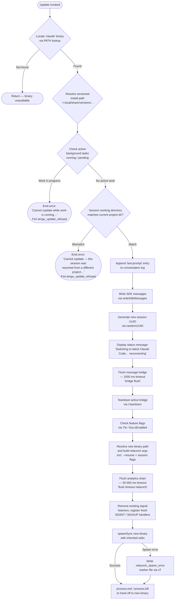

# `/update`

> Analysis basis: CC v2.1.186 bundle.js (AST extraction + Claude interpretation)
> Minimum version: v2.1.186

---

## Overview

The `/update` command performs an in-place upgrade of the running Claude Code CLI to the latest installed version without ending the current conversation. It validates that the environment is safe to restart (no background work in progress, no cross-directory session mismatch), then orchestrates a controlled teardown of the current process and an `execve`-style relaunch into the new binary, resuming the session automatically via `--resume`.

---

## Registration

| Field | Value |
|---|---|
| type | `local` |
| name | `update` |
| description | `Switch to the latest version (conversation continues)` |
| loc_byte | `12801004` |
| loc_byte_end | `12801245` |
| loc_line | `8688` |
| supportsNonInteractive | `false` |
| isHidden | `true` |
| module_id | `JOl` |
| load_inline | `true` |
| arbor_handler.name | `Byf` |
| arbor_handler.fqn | `claude-2.1.186::Byf` |
| arbor_handler.kind | `AsyncFunction` |
| arbor_handler.resolution_path | `module_id` |
| arbor_handler.n_hits | `0` |

Analysis basis: CC v2.1.186 bundle.js:+12801004

---

## Input Branching

The handler has 4+ distinct branches (background-work guard, project-directory guard, normal in-progress path, and relaunch path), so a flowchart is required.



---

## Behavioral Spec

### Pre-flight: Locate Binary and Resolve Version Path

```
async function resolveVersionedBinary():
    binaryPath = Bun.which("claude")          # PATH lookup
    if binaryPath is null:
        return null

    versionsDir = path.join(homedir(), ".local", "share", "versions")
    # A2n builds the concrete versioned path from versionsDir + current version
    resolvedPath = buildVersionPath(versionsDir, binaryPath)
    return resolvedPath
```

Analysis basis: CC v2.1.186 bundle.js:+12798800, +865833, +8514976, +7033035, +7033308, +7033317, +8514874

---

### Guard: Reject Update During Active Background Work

```
function checkBackgroundWorkGuard(appState):
    activeTasks = Object.values(appState.backgroundTasks)
    for task in activeTasks:
        if task.status == "running" or task.status == "pending":
            emitTelemetry("tengu_update_refused")
            return ErrorMessage(
                "Cannot /update while work is running in the background " +
                "— wait for it to finish, then try again."
            )
    return null
```

Analysis basis: CC v2.1.186 bundle.js:+12799123, +12799161, +12799183, +12799264, +12798900

---

### Guard: Reject Update on Cross-Directory Resumed Sessions

```
function checkProjectDirectoryGuard(sessionState, currentWorkingDir):
    if sessionState.workingDirectory != currentWorkingDir:
        emitTelemetry("tengu_update_refused")
        return ErrorMessage(
            "Cannot /update — this session was resumed from a different " +
            "project directory. Restart manually with --resume to continue " +
            "on the latest version."
        )
    return null
```

Analysis basis: CC v2.1.186 bundle.js:+12799374, +12799508, +12798900

---

### Session Snapshot: Persist Last Prompt

```
function persistLastPrompt(conversationLog):
    # Pqt appends a "last-prompt" entry so --resume can replay it
    entry = buildEntry(type="last-prompt", content=conversationLog.lastUserMessage)
    conversationLog.appendEntry(entry)
```

Analysis basis: CC v2.1.186 bundle.js:+12799728, +13347740, +13347720

---

### Bridge Teardown and Status Messaging

```
async function teardownAndNotify(bridge, sessionId):
    # Write synthetic assistant message informing the user
    newSessionId = generateUUID()          # YOl → Mqt.randomUUID
    bridge.writeSdkMessages([
        assistantMessage("Switching to latest Claude Code… reconnecting")
    ])

    # Flush with 2000 ms deadline
    await withTimeout(bridge.flush(), 2000, label="bridge flush")

    bridge.teardown()
    return newSessionId
```

Analysis basis: CC v2.1.186 bundle.js:+12799969, +12799989, +12800060, +12800063, +12800114, +12799993, +2000, +12800073, +12800078

---

### Build Relaunch Argument Vector

```
function buildRelaunchArgv(currentArgv, newSessionId, addedDirs, flags):
    args = Array.from(currentArgv)          # U7n starts from original argv

    # Inject --resume with the new session UUID
    insertOrReplace(args, "--resume", newSessionId)

    # Re-inject --add-dir entries for additional watched directories
    for dir in addedDirs:
        args.push("--add-dir", dir)

    # Propagate relevant flags: --effort, --permission-mode,
    # --allow-dangerously-skip-permissions
    for flag in [flags.effort, flags.permissionMode, flags.bypassPermissions]:
        if flag is set:
            args.push(flag.cliName, flag.value)

    return args
```

Analysis basis: CC v2.1.186 bundle.js:+12800318, +12541239, +12541414, +12541529, +12541671, +12541688, +12539890

---

### Relaunch via execve-Style Handoff (DMe / vRl)

```
async function performRelaunch(newBinaryPath, argv, env):
    # Step 1 — stat the target binary to confirm it exists
    stat = await fs.stat(newBinaryPath)

    # Step 2 — flush analytics with a 30 000 ms hard timeout
    await withTimeout(analyticsFlush(), 30000, label="flush timeout (relaunch)")

    # Step 3 — run cleanup hooks (hC → Oc) and drain O5o event queues
    await Promise.all([runCleanupHooks(), drainEventQueue()])

    # Step 4 — clean up terminal / UI (k9e unmounts Ink renderer,
    #           Zbn restores terminal cursor/screen state)
    unmountRenderer()
    restoreTerminalState()

    # Step 5 — resolve working directory; if path is relative resolve to cwd
    targetDir = resolveDirectory(newBinaryPath)
    process.chdir(targetDir)

    # Step 6 — open native libc via bun:ffi
    #   macOS: /usr/lib/libSystem.B.dylib
    #   Linux: libc.so.6
    lib = dlopen(platformLibcPath, { execve: { args: ["ptr","ptr","ptr"], returns: "int" } })

    # Step 7 — encode argv and env as null-terminated C string arrays
    argvPtr  = encodeStringArrayToPtr(argv,  encoding="utf8")
    envPtr   = encodeStringArrayToPtr(buildEnv(env), encoding="utf8")

    # Step 8 — remove signal listeners, re-register SIGINT / SIGHUP
    process.removeAllListeners("SIGINT")
    process.removeAllListeners("SIGHUP")
    process.on("SIGINT",  sigintHandler)
    process.on("SIGHUP",  sighupHandler)

    # Step 9 — spawnSync new binary with inherited stdio as fallback
    result = spawnSync(newBinaryPath, argv, { stdio: "inherit" })

    if result.error:
        writeMarkerFile("relaunch_spawn_error")
        process.exit(128)

    # Step 10 — call execve (replaces process image)
    lib.execve(newBinaryPath, argvPtr, envPtr)

    # Should not be reached; belt-and-suspenders exit
    process.exit(0)
```

Analysis basis: CC v2.1.186 bundle.js:+12800259, +12539744, +12539838, +12539949, +12539957, +12539963, +12540008, +12539918, +12540064, +12540318, +12540392, +12538907, +12538949, +12538963, +12538986, +12539017, +12539030, +12539038, +12539067, +12539149, +12540459, +12540489, +12540516, +12540551, +12540738, +12540765, +12540830, +30000, +128

---

### Session-State Reconstruction for Relaunch (Pr / $h)

```
function collectResumableState(appState, conversationHistory):
    # Pr: find last message of type working_directory / allowed_tools /
    #     disallowed_tools / avoid_prompts / permission_mode / bypassPermissions
    workingDir     = findLast(conversationHistory, "working_directory")
    allowedTools   = findLast(conversationHistory, "allowed_tools")
    disallowedTools= findLast(conversationHistory, "disallowed_tools")
    avoidPrompts   = findLast(conversationHistory, "avoid_prompts")
    permissionMode = findLast(conversationHistory, "permission_mode")
    bypassPerms    = findLast(conversationHistory, "bypassPermissions")

    # $h reads effort / model / max_thinking_tokens / flag_settings from appState
    effort          = appState.effort
    model           = appState.model
    maxThinking     = appState.max_thinking_tokens
    flagSettings    = appState.flag_settings

    return { workingDir, allowedTools, disallowedTools, avoidPrompts,
             permissionMode, bypassPerms, effort, model, maxThinking, flagSettings }
```

Analysis basis: CC v2.1.186 bundle.js:+12800322, +10903074, +10903154, +10903179, +10903234, +10903289, +10903350, +10903452, +10903483, +12800328, +10903910, +10903807, +10903820, +10903832, +10903858

---

## State & Side Effects

| Item | Detail |
|---|---|
| Telemetry — `tengu_update_refused` | Fired when either guard (background work or directory mismatch) blocks the update (bundle.js:+12798900) |
| Telemetry — `tengu_scroll_summary` | Fired during terminal scroll/screen restoration in `UDn` path (bundle.js:+7218373) |
| Telemetry — `tengu_amber_creek` | Fired inside the fullscreen-mode renderer (`Es` / `vcd`) during teardown (bundle.js:+3551256) |
| Telemetry — `tengu_pewter_brook` | Fired inside the fullscreen-mode renderer (`Es`) during teardown (bundle.js:+3551164) |
| Telemetry — `tengu_bg_dispatch_sigkill_escalate` | May fire if a background session does not exit cleanly during teardown (bundle.js:+17157626) |
| Telemetry — `tengu_bg_spare_enable/claim/claim_fail` | Fired during background-session spare-slot management touched in the relaunch path (bundle.js:+17158924, +17159052, +17159318) |
| Telemetry — `tengu_daemon_control` | Fired inside daemon stop/start helpers invoked by `u` (bundle.js:+17194642) |
| Telemetry — `tengu_config_parse_error` | May fire during config read in `cEe` if the config file is corrupt (bundle.js:+13853132) |
| Telemetry — `tengu_disable_bypass_permissions_mode` | Fired if bypass-permissions mode is disabled during session state reconstruction (bundle.js:+3390734) |
| appState changes | `t.getAppState` / `t.setAppState` — update state to reflect the in-progress update; session ID is replaced with a new UUID (bundle.js:+12799768, +12799883) |
| Conversation log | A `last-prompt` entry is appended so the next process can replay via `--resume` (bundle.js:+13347740) |
| Marker file | `sT` writes a `relaunch_spawn_error` file if `spawnSync` fails, allowing crash diagnostics (bundle.js:+12540741, +199887) |
| Signal handlers | All existing `SIGINT` / `SIGHUP` listeners are removed and fresh handlers are registered immediately before relaunch (bundle.js:+12540459, +12540489, +12540430, +12540449) |
| Terminal/UI | Ink renderer is unmounted; terminal cursor and screen position are restored via escape sequences `\x1b7` / `\x1b8` (bundle.js:+7215938, +3892124, +3892135) |
| Analytics drain | `O5o.drain` / analytics flush with 30 000 ms timeout runs before execve (bundle.js:+67168, +12539957) |
| Bridge flush timeout | 2 000 ms hard limit on message bridge flush before teardown (bundle.js:+12800073) |
| Process replacement | `execve` via `bun:ffi` replaces the current process image; on failure `process.exit(128)` is called (bundle.js:+12540765, +12540830, +128) |
| Hook: `isHidden` | `true` — the command does not appear in `/help` output (bundle.js:+12801004) |
| Hook: `supportsNonInteractive` | `false` — the command cannot be invoked in non-interactive / scripted mode (bundle.js:+12801004) |

---

## Version History

| Version | Change |
|---|---|
| v2.1.186 | Initial analysis |

---

## Common Mistakes

1. **Running `/update` while background tasks are active** — The command will be rejected with a clear error message. Wait for all background tasks (status `running` or `pending`) to complete before retrying.
2. **Running `/update` in a cross-directory resumed session** — If the session was started in a different project directory and then resumed from another location, the command is blocked. Re-run Claude Code manually with `--resume` to land on the correct version.
3. **Expecting the command to appear in `/help`** — The command is registered with `isHidden: true` and will not be listed in the help menu; it must be typed explicitly.
4. **Using `/update` in non-interactive mode** — `supportsNonInteractive` is `false`; invoking it from a script or pipe will not work as intended.
5. **Assuming the conversation is lost** — The handler intentionally writes a `last-prompt` entry and passes `--resume` with the new session UUID to the relaunched binary, so the conversation context survives the process replacement.
6. **Expecting an immediate UI response** — There is a 2 000 ms bridge-flush pause and a potential 30 000 ms analytics-drain pause before the new binary starts. In slow environments this can appear as a hang.

---

## Appendix — Identifier Mapping

> For bundle debugging only. Identifiers change across versions.

| Identifier | Role |
|---|---|
| `Byf` | Main async handler for `/update` (arbor_handler) |
| `gYn` | Background-work guard — checks active tasks before update |
| `If` | Binary PATH lookup wrapper (calls `Bun.which`) |
| `VYo` | Inner helper that invokes `Bun.which("claude")` |
| `hF` | Versioned install path resolver (builds path under `~/.local/share/versions`) |
| `A2n` | Concrete version path builder (joins versionsDir + version segment) |
| `bm` | Array-check utility (wraps `Array.isArray`) |
| `Dee` | Home-directory path helper |
| `TMn` | Retrieves OS home directory via `os.homedir()` |
| `jae` | Builds `bin/` sub-path within the versioned install |
| `Ws` | Background-mode / daemon status check |
| `XNe` | Inner daemon state reader |
| `W` | Generic logger / warning emitter |
| `JE` | Path utility — extracts basename and resolves via `Rt` |
| `Rt` | Low-level string/path resolver (calls `GL`) |
| `GL` | Core string primitive |
| `gP` | Current working directory getter |
| `w0o` | Relaunch argument assembler (builds new argv with `--resume`) |
| `gr` | Sub-helper used inside relaunch assembler |
| `jl` | Another sub-helper inside relaunch assembler |
| `Due` | Session-directory mismatch checker |
| `Mne` | Hook-set membership checker (checks `Swf`) |
| `aJn` | Hook attachment builder |
| `Pqt` | Last-prompt log entry appender |
| `Oc` | Cleanup hook runner |
| `Ai` | Hook registration helper (`O5o.register`) |
| `Re` | Error / telemetry logger |
| `ao` | Error constructor wrapper |
| `ot` | String coercion utility |
| `Ki` | Inner telemetry formatter |
| `ins` | Inner helper for `Ki` |
| `Pnu` | Circular log buffer manager (shift/push) |
| `df` | Store accessor (wraps `s0`) |
| `s0` | AsyncLocalStorage getter (`Jkr.getStore`) |
| `_E` | App-state transformation helper |
| `l` | Message bridge / SDK message writer |
| `QNl` | SDK message serialization and dispatch |
| `_Q` | Message formatter |
| `Cfe` | Text content extractor / trimmer |
| `Xs` | Session store getter (`bUu.getStore`) |
| `zqt` | Daemon status file path builder (`daemon.status.json`) |
| `De` | JSON serializer |
| `YOl` | New session UUID generator (`Mqt.randomUUID`) |
| `Mc` | Timed promise — wraps `Promise.race` + `setTimeout` + `clearTimeout` |
| `TIe` | Feature-flag checker (`Eai.isEnabled`) |
| `lve` | Version string coercer |
| `DMe` | Full relaunch orchestrator (stat → flush → cleanup → execve) |
| `wFt` | Interval-clearing helper for UI spinner (`Hto`) |
| `Hto` | `clearInterval` wrapper |
| `k9e` | Ink renderer unmounter and terminal writer |
| `CU` | Terminal cleanup helper |
| `Zbn` | Terminal screen/cursor state restorer (emits `\x1b7` / `\x1b8`) |
| `Y$e` | Terminal emulator version checker (Ghostty, iTerm2) |
| `B$e` | Terminal state buffer writer |
| `Nw` | tmux/screen escape-sequence replacer |
| `ip` | Terminal restore sub-step |
| `T` | Structured log / message formatter |
| `UDn` | Scroll-summary and display-state updater |
| `cw` | Display context accessor |
| `bha` | Display bounds helper |
| `Aha` | Animation frame scheduler (Date.now / Math.max / Math.round) |
| `Eha` | Animation state updater |
| `Es` | Fullscreen renderer teardown orchestrator |
| `G$` | Local-agent registry checker (`GZc.has`) |
| `dx` | Feature-flag inner check (`Eai.isEnabled`) |
| `O3r` | String coercion for renderer |
| `dZ` | Renderer context destructor |
| `P3r` | Boolean-coercion renderer helper |
| `Nr` | Display group helper (`DG`) |
| `vcd` | Renderer variant dispatcher |
| `it` | React/Ink render scheduler |
| `hC` | Cleanup hook caller (wraps `Oc`) |
| `LKe` | Analytics event-queue drainer (`O5o.drain`) |
| `x9e` | Async relaunch finalizer (Promise.resolve + `DDn`) |
| `DDn` | Post-relaunch cleanup step |
| `vRl` | execve orchestrator — chdir, ffi dlopen, C string encoding, execve call |
| `sT` | Error marker-file writer (`Dre.writeFileSync`) |
| `U7n` | Argv reconstruction for relaunch (Array.from + flag injection) |
| `DPe` | Argv diff/patch helper |
| `KIe` | Boolean-filter for argv reconstruction |
| `wt` | Config snapshot/backup manager |
| `Gt` | Config path resolver |
| `mOo` | Config accessor |
| `cEe` | Config file reader and backup copier |
| `Lxf` | Config file watcher (watchFile / unwatchFile) |
| `Pr` | Session-state collector (working_directory, tools, permission_mode) |
| `w8n` | working_directory field extractor |
| `Xo` | Generic history-entry accessor |
| `L8n` | Tool-settings field extractor |
| `L2` | Permission-mode extractor |
| `$h` | Effort / model / thinking-tokens / flag-settings collector |
| `f` | Background session lifecycle manager |
| `D` | Scheduled-task runner |
| `Bn` | Timed-promise with abort support |
| `xe` | Feature-ok telemetry emitter |
| `ke` | Feature-bad telemetry emitter |
| `IXn` | Low-memory checker for background sessions |
| `D2e` | Stale-session file cleaner |
| `N` | Settled-promise reaper |
| `$Bo` | Background-session claim and socket-auth handler |
| `KBo` | Background-session lifecycle state machine |
| `p` | Forced-shutdown handler (`process.exit` + `u.abort`) |
| `mn` | UI message emitter |
| `Pe` | Feature telemetry dispatcher |
| `a` | MCP connection orchestrator (execve env builder) |
| `Z3e` | MCP server connection initializer |
| `arr` | MCP update applicator |
| `maa` | MCP auth-request handler |
| `q2o` | MCP client retry coordinator |
| `u` | Daemon stop/start controller |
| `gU` | Daemon-control analytics emitter |
| `j6` | Daemon lifecycle race (Promise.race / process.exit) |
| `Ae` | String coercion for env values |
| `c` | Background-session IPC helper |
| `bn` | IPC sub-step |