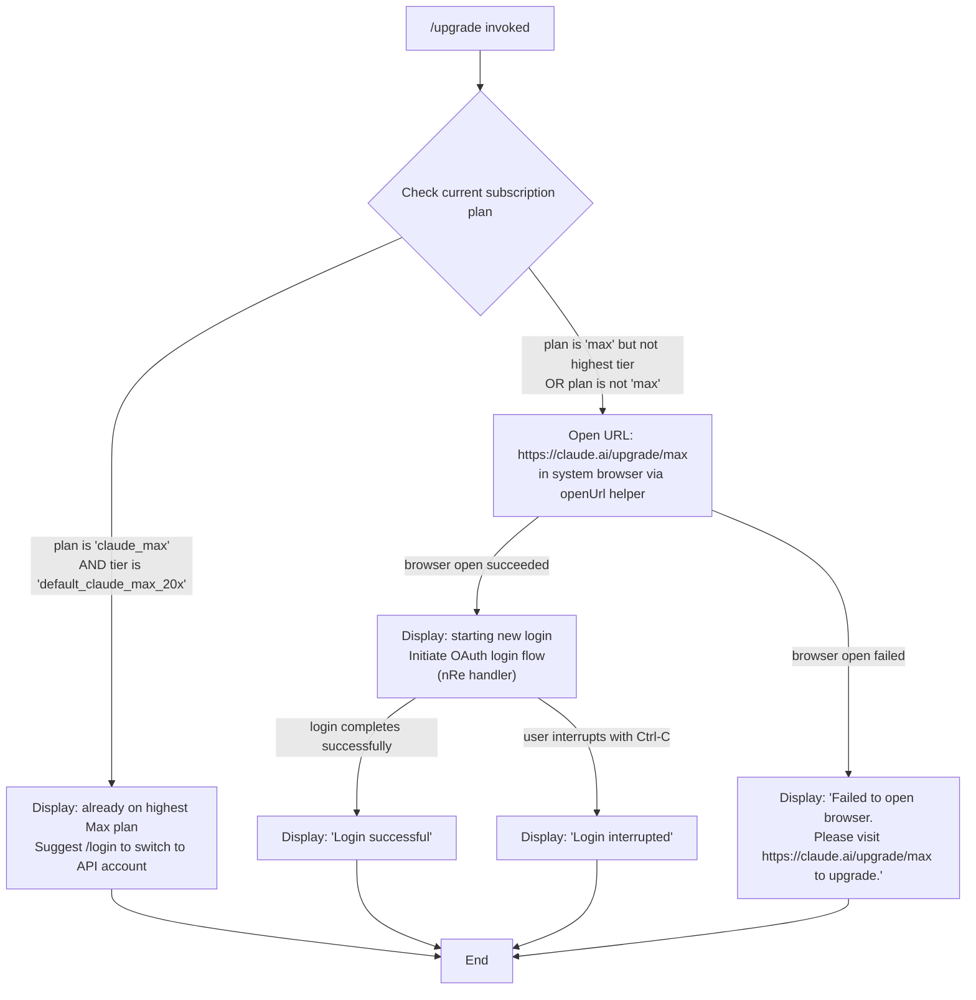

# `/upgrade`

> Analysis basis: CC v2.1.186 bundle.js (AST extraction + Claude interpretation)
> Minimum version: v2.1.186

---

## Overview

The `/upgrade` command guides the user through upgrading their Claude subscription to the Max plan, which provides higher rate limits and expanded access to Opus models. When invoked, the command detects whether the user is already on the highest Max tier, and if not, opens the upgrade URL in a browser and optionally initiates a fresh login flow so the newly-upgraded account credentials are applied. If the browser cannot be opened, a fallback message with the upgrade URL is displayed.

---

## Registration

| Field | Value |
|---|---|
| type | `local-jsx` |
| name | `upgrade` |
| description | `Upgrade to Max for higher rate limits and more Opus` |
| loc_byte | `12850698` |
| loc_byte_end | `12850945` |
| loc_line | `8694` |
| module_id | `Xko` |
| load_inline | `true` |
| arbor_handler.name | `Bqt` |
| arbor_handler.fqn | `claude-2.1.186::Bqt` |
| arbor_handler.kind | `AsyncFunction` |
| arbor_handler.resolution_path | `module_id` |
| arbor_handler.n_hits | `0` |

Analysis basis: CC v2.1.186 bundle.js:+12850698

---

## Input Branching

The command has 4+ distinct decision paths: (1) already on highest Max plan, (2) successfully open browser and user completes login, (3) successfully open browser but user interrupts login, (4) browser open fails. A Mermaid flowchart is used.



Analysis basis: CC v2.1.186 bundle.js:+12849597 (handler entry `Bqt`), +12849683 (`"max"` literal), +12849708 (`"default_claude_max_20x"` literal), +12849827 (`"claude_max"` literal), +12849928 (already-on-highest-plan message), +12850074 (`"https://claude.ai/upgrade/max"` literal), +12850223 (new-login message), +12850418 (`"Login successful"`), +12850437 (`"Login interrupted"`), +12850491 (browser-open-failed message)

---

## Behavioral Spec

### Main Handler (`upgradeCommandHandler`)

The Arbor-resolved handler is `Bqt` (AsyncFunction, resolved via `module_id → Xko`).

```
async function upgradeCommandHandler(context):

    // Step 1 — Determine current plan
    planInfo = getPlanInfo(context)   // calls subscriptionChecker (yo → l2, Gs)

    if planInfo.plan == "claude_max" AND planInfo.tier == "default_claude_max_20x":
        // User is already on the highest Max 20× plan
        displayMessage(
            "You are already on the highest Max subscription plan. " +
            "For additional usage, run /login to switch to an API usage-billed account."
        )
        return

    // Step 2 — Attempt to open upgrade URL in the system browser
    upgradeUrl = "https://claude.ai/upgrade/max"
    openResult = await openUrlInBrowser(upgradeUrl)  // calls Jl → Nai

    if openResult.success:
        // Step 3 — Initiate a fresh login so the upgraded account is applied
        displayMessage(
            "Starting new login following /upgrade. Exit with Ctrl-C to use existing account."
        )
        setTimeout(startLoginFlow, delay)   // delayed start via setTimeout (+12849913)

        loginOutcome = await runLoginFlow(context)  // calls nRe OAuth handler

        if loginOutcome == "success":
            displayMessage("Login successful")
        else:
            displayMessage("Login interrupted")

    else:
        // Browser could not be opened
        displayMessage(
            "Failed to open browser. Please visit https://claude.ai/upgrade/max to upgrade."
        )
```

Analysis basis: CC v2.1.186 bundle.js:+12849597, +12849609, +12849769, +12849913, +12850071, +12850113, +12850194, +12850356, +12850385, +12850418, +12850437, +12850470, +12850491

---

### Plan/Subscription Check (`subscriptionChecker`)

```
function checkSubscriptionPlan(context):
    // Resolves whether the user is on "max" plan and which tier
    // Uses plan literal "max" (bundle.js:+12849683)
    // and tier sentinel "default_claude_max_20x" (bundle.js:+12849708)
    // Internal references: yo → l2 (array/include check), yo → Gs (global state read)
    planData = readGlobalPlanState()
    tierData = readGlobalTierState()
    return { plan: planData, tier: tierData }
```

Analysis basis: CC v2.1.186 bundle.js:+12849597 (`Bqt → yo`), +12849609 (`Bqt → Gs`), +3072035 (`yo → ny`), +3072056 (`yo → l2`), +3072059 (`yo → Gs`)

---

### URL Opener (`openUrlInBrowser`)

```
async function openUrlInBrowser(url):
    // Validates that url starts with "http:" or "https:" (+3112376, +3112398)
    if not (url.startsWith("http:") or url.startsWith("https:")):
        throw Error("invalid URL scheme")

    // On macOS ("darwin", +3113064): uses "open" command (+3113083)
    // Delegates to Nai → g_ (platform check) → On (spawn subprocess)
    platform = process.platform
    if platform == "darwin":
        spawnProcess("open", [url])
    else:
        spawnProcess(defaultBrowserCommand, [url])

    return { success: true/false based on subprocess result }
```

Analysis basis: CC v2.1.186 bundle.js:+12850071 (`Bqt → Jl`), +3112326 (`oed → Error`), +3112934 (`Jl → oed`), +3112947 (`Jl → Nai`), +3113005 (`Nai → g_`), +3113064 (`"darwin"`), +3113083 (`"open"`), +3113105 (`Nai → On`)

---

### OAuth Login Flow (`oauthLoginFlowHandler`, `nRe`)

Invoked after the browser upgrade URL has been opened. This is a full OAuth re-login sequence that:

1. Fires `e.onChangeAPIKey` and `e.applyMessageOp` to reset credentials state.
2. Calls the token-fetch helper (`lTe`) to perform an OAuth profile fetch (event `"oauth_profile_fetch"`, timeout 10 000 ms, bundle.js:+2136020).
3. On token failure, logs event `"oauth_profile_token_failed"` (bundle.js:+2136103).
4. Calls `e9n` to clear feature flag caches and refresh features.
5. Calls `W5` to rebuild global settings after the account change.
6. On success, calls `f.execRelaunch` to apply the new credentials without a full restart where possible.
7. Emits `"[bridge:repl] Account changed via /login — disconnecting Remote Control session"` (bundle.js:+9071743) if a remote control bridge is active.

```
async function oauthLoginFlowHandler(env):
    env.onChangeAPIKey(newKey)
    env.applyMessageOp(credentialUpdate)

    tokenResult = await fetchOAuthProfile()   // lTe, timeout 10 000 ms
    if tokenResult.error:
        logTelemetry("oauth_profile_token_failed")
        return "interrupted"

    refreshFeatureFlags()   // e9n → ZEn → Fyi
    rebuildGlobalSettings() // W5 → pdt, QR, In, TSn, …

    if bridgeActive:
        emitBridgeDisconnect()   // log account-change message

    execRelaunch()   // f.execRelaunch
    return "success"
```

Analysis basis: CC v2.1.186 bundle.js:+12850356 (`Bqt → nRe`), +9071086 (`nRe → e.onChangeAPIKey`), +9071105 (`nRe → e.applyMessageOp`), +9071327 (`nRe → f.execRelaunch`), +9071391 (`nRe → e9n`), +9071406 (`nRe → W5`), +9071658 (`nRe → e.getAppState`), +9071741 (`nRe → T`), +9071831 (`nRe → e.setAppState`), +9071743 (bridge disconnect log)

---

### OAuth Profile Fetch (`oauthProfileFetcher`, `lTe`)

```
async function oauthProfileFetcher():
    // Resolves OAuth endpoint (ks → GYo, X5c, t.replace)
    // Validates against approved endpoints; throws on unapproved custom URL
    // (+863630: "CLAUDE_CODE_CUSTOM_OAUTH_URL is not an approved endpoint.")
    endpoint = resolveOAuthEndpoint()

    // GET request with Content-Type: application/json (+2135977, +2135992)
    // 10 000 ms timeout (+2136020)
    // Telemetry event: "oauth_profile_fetch" (+2136036)
    response = await httpGet(endpoint, {
        headers: { "Content-Type": "application/json" },
        timeout: 10000,
    })

    if response.error:
        // Telemetry event: "oauth_profile_token_failed" (+2136103)
        logTelemetry("oauth_profile_token_failed")
        return null

    return response.data
```

Analysis basis: CC v2.1.186 bundle.js:+12849769 (`Bqt → lTe`), +2135876 (`lTe → ks`), +2135930 (`lTe → co.get`), +2136033 (`lTe → ke`), +2136036, +2136078 (`lTe → Mt`), +2136103, +2136133 (`lTe → WH`), +2136139 (`lTe → T`), +2136218 (`lTe → Re`)

---

### Already-On-Max Guard

```
function isAlreadyOnHighestMaxPlan(planInfo):
    // Checks for plan == "claude_max" AND tier == "default_claude_max_20x"
    // Message displayed: "You are already on the highest Max subscription plan.
    //   For additional usage, run /login to switch to an API usage-billed account."
    return planInfo.plan == "claude_max" AND planInfo.tier == "default_claude_max_20x"
```

Sentinel values:
- Plan string `"claude_max"` — Analysis basis: CC v2.1.186 bundle.js:+12849827
- Tier string `"default_claude_max_20x"` — Analysis basis: CC v2.1.186 bundle.js:+12849708
- Already-on-plan message (first ~30 chars: `"You are already on the highest"`) — Analysis basis: CC v2.1.186 bundle.js:+12849928

---

## State & Side Effects

| Item | Detail |
|---|---|
| Telemetry — `tengu_feature_ok` | Fired on successful feature flag read (bundle.js:+1024705) |
| Telemetry — `tengu_feature_sad` | Fired on degraded feature flag state (bundle.js:+1024853) |
| Telemetry — `tengu_feature_bad` | Fired on feature flag read error (bundle.js:+1024772) |
| Telemetry — `tengu_managed_settings_security_dialog_shown` | Fired if managed-settings security dialog is triggered during login (bundle.js:+7250153) |
| Telemetry — `tengu_managed_settings_security_dialog_accepted` | Fired when the dialog is accepted (bundle.js:+7250490) |
| Telemetry — `tengu_managed_settings_security_dialog_rejected` | Fired when the dialog is rejected (bundle.js:+7250649) |
| Telemetry — `tengu_policy_limits_fetch` | Fired during post-login policy limits refresh (bundle.js:+13830674) |
| Telemetry — `tengu_auto_mode_config` | Fired when auto-mode configuration is evaluated after login (bundle.js:+13711309) |
| Telemetry — `tengu_disable_bypass_permissions_mode` | Fired if bypass-permissions mode is toggled during credential update (bundle.js:+13713420) |
| OAuth profile fetch | HTTP GET to the resolved OAuth endpoint; timeout 10 000 ms; emits `oauth_profile_fetch` / `oauth_profile_token_failed` (bundle.js:+2136036, +2136103) |
| Browser launch | Spawns `open <url>` on macOS, default browser command on other platforms (bundle.js:+3113064, +3113083) |
| Credential state | `e.onChangeAPIKey` and `e.applyMessageOp` are called to update app-level credentials (bundle.js:+9071086, +9071105) |
| App state (getAppState / setAppState) | Read and written during the login flow (bundle.js:+9071658, +9071831) |
| Remote Control bridge disconnect | Emits disconnect notice if bridge is active after account change (bundle.js:+9071743) |
| Feature flag cache clear | `e9n → A9a → Ydo.clear` and related caches cleared on re-login (bundle.js:+9067733, +9065714) |
| Exec relaunch | `f.execRelaunch` is called to apply new credentials in the running process (bundle.js:+9071327) |
| setTimeout delay | A timeout is set before the login flow begins after browser open (bundle.js:+12849913) |
| Hook registration | `Ai → O5o.register` seen in call graph — used for exit/shutdown hook registration (bundle.js:+67125) |
| Sound | None observed in call graph or literals |

---

## Version History

| Version | Change |
|---|---|
| v2.1.186 | Initial analysis |

---

## Common Mistakes

1. **Running `/upgrade` when already on the Max 20× plan.** The command immediately exits with an informational message and does not open a browser. Use `/login` instead if you want to switch to an API-billed account.
2. **Interrupting with Ctrl-C during the login flow.** The upgrade URL has already been opened in the browser, but the in-process credential update is aborted. You must complete the OAuth flow manually or re-run `/login` afterward to apply the new credentials.
3. **Browser not available in headless/SSH environments.** The command will fall back to printing the upgrade URL (`https://claude.ai/upgrade/max`) but will not apply new credentials automatically — you must run `/login` separately after upgrading via the URL on another device.
4. **Assuming the command switches models immediately.** `/upgrade` only initiates the subscription change and re-login. Model availability updates after the OAuth profile is refreshed and the process re-applies its feature flags.
5. **Confusing `/upgrade` with `/login`.** `/login` re-authenticates with an existing account. `/upgrade` is specifically for moving to the Max plan and internally triggers `/login` only after the browser-based upgrade is initiated.

---

## Appendix — Identifier Mapping

> For bundle debugging only. Identifiers change across versions.

| Identifier | Role |
|---|---|
| `Bqt` | Main upgrade command handler (AsyncFunction; Arbor-resolved via module_id `Xko`) |
| `yo` | Subscription plan checker called at command entry |
| `ny` | Auth/credential resolution helper (called by subscription checker) |
| `Ud` | CLI argument/flag parser utility |
| `ot` | String/output formatter |
| `IXt` | Bare-flag handler (`--bare` literal at +69269) |
| `iA` | Auth provider resolver (checks profile-implicit, user_oauth, bedrock, foundry, etc.) |
| `wdn` | OAuth background helper |
| `XQe` | Auth check utility (calls `ot`, `LK`) |
| `GG` | Token source resolver (CLAUDE_CODE_OAUTH_TOKEN_FILE_DESCRIPTOR) |
| `ux` | Flag-settings reader (`"flagSettings"` literal) |
| `l2` | Array inclusion checker |
| `Nl` | Output/notification helper |
| `br` | Provider type checker (bedrock/foundry/vertex/etc.) |
| `nT` | Next-step sequencer |
| `Wg` | Auth flow orchestrator (checks ANTHROPIC_API_KEY, apiKeyHelper, etc.) |
| `Rkt` | Retry/kick helper in auth flow |
| `SKe` | VS Code integration helper (`"claude-vscode"` literal) |
| `Pvt` | API key file descriptor helper (CLAUDE_CODE_API_KEY_FILE_DESCRIPTOR) |
| `wt` | Telemetry/timing event emitter (calls `Gt`, `QL`, `mOo`, `Date.now`) |
| `YN` | Slice/trim utility |
| `Dkt` | Auth diagnostics helper |
| `lTe` | OAuth profile fetcher (HTTP GET, 10 000 ms timeout, `oauth_profile_fetch`) |
| `ks` | OAuth endpoint resolver (validates/replaces endpoint strings) |
| `GYo` | OAuth environment/endpoint selector |
| `X5c` | Endpoint string builder |
| `ke` | HTTP GET helper (calls `W`, `Pe`) |
| `W` | HTTP client core |
| `Pe` | HTTP response processor |
| `KVe` | HTTP error classifier |
| `Mt` | Alternate HTTP GET helper |
| `WH` | Token validation helper |
| `T` | Telemetry/logging transport (writes to log stream) |
| `Pvc` | Log path resolver |
| `U5o` | Log storage helper |
| `De` | JSON serializer wrapper (`JSON.stringify`) |
| `Lc` | Log line formatter |
| `SWo` | Log rotation/mapping helper |
| `eze` | Log writer (`cWo → e.write`) |
| `cWo` | Raw stream writer |
| `Fvc` | File logging orchestrator (mkdir, appendFile, rotate, etc.) |
| `wKe` | Output queue/flush manager (clearTimeout, setTimeout, setImmediate) |
| `npe` | Log-entry assembler |
| `Gt` | Timestamp generator |
| `Rre` | Log error handler |
| `TWo` | Log path joiner |
| `pcr` | Log file rotator (stat, rename, unlink) |
| `Uvc` | Log file append helper (mkdir, appendFile) |
| `Ai` | Exit/shutdown hook registrar (`O5o.register`) |
| `Re` | Credential/token store manager (shift/push circular buffer) |
| `ao` | Error stringifier |
| `Ki` | Credential insert helper |
| `ins` | Credential output formatter |
| `Pnu` | Credential ring-buffer manager |
| `Jl` | URL opener orchestrator |
| `oed` | URL validation helper (http/https scheme check) |
| `Nai` | Platform-specific browser launcher |
| `g_` | Platform detector |
| `On` | Process spawner |
| `$r` | Spawn options builder |
| `Ot` | Spawn result handler |
| `pc` | Post-login flow runner (calls `ny`, `wt`) |
| `nRe` | OAuth login flow handler (onChangeAPIKey, applyMessageOp, execRelaunch) |
| `_Ke` | Timestamp helper (`Date.now`) |
| `O9e` | Remote settings + trusted-device enrollment coordinator |
| `qga` | Remote settings orchestrator entry |
| `UFt` | Remote settings fetch dispatch |
| `Dis` | Remote settings data normalizer |
| `P7` | Remote settings loader/applier |
| `Dpe` | Remote settings cache reader |
| `goe` | Remote settings hash verifier |
| `$Pe` | Remote settings policy extractor |
| `GH` | Remote settings sentinel writer |
| `Su` | Remote settings notification helper |
| `aA` | Post-settings global state updater |
| `Ukt` | Settings change propagator |
| `nPn` | Settings notification emitter (`wD.notifyChange`) |
| `Pis` | Settings persistence helper |
| `Gto` | Remote settings poll coordinator |
| `Fga` | Remote settings fetch helper |
| `xga` | Remote settings timeout manager |
| `Vto` | Remote settings full fetch-and-apply flow |
| `Ppe` | Remote settings diff/comparison helper |
| `Qha` | Remote settings hash calculator (SHA-256) |
| `$Zd` | Remote settings apply-to-disk helper |
| `xe` | HTTP client alternate (calls `W`, `Pe`) |
| `R7e` | Remote settings error handler |
| `Nga` | Remote settings key extractor |
| `Mga` | Remote settings security-check dialog coordinator |
| `Dga` | Remote settings approval handler |
| `Uga` | Remote settings write-to-disk helper (open/writeFile/datasync/close) |
| `Gga` | Remote settings background updater |
| `Wga` | Remote settings auth-change refresh handler |
| `cSn` | Polling interval manager (setInterval/clearInterval) |
| `GZd` | Remote settings background-poll-and-apply helper |
| `J3n` | Deep-equality credential comparator (`Bun.deepEquals`) |
| `Bir` | Credential binary comparator |
| `In` | State store initializer |
| `Qon` | Store constructor helper |
| `Z$` | Full store initializer (gr, aEt, Mir, oEt, etc.) |
| `f` | Daemon/background session manager (spawn, relaunch, kill, etc.) |
| `D` | Background session process controller |
| `grt` | Background session config reader |
| `d` | Supervisor IPC writer |
| `_Q` | Background session config validator |
| `NPt` | Background session directory/file initializer |
| `PBi` | Background session filter helper |
| `H` | Network buffer/socket handler |
| `u` | Daemon stop helper (daemon_stop / daemon_stop_failed events) |
| `x` | Background session mtime watcher |
| `g` | Socket timeout manager |
| `s` | Task set manager (r.add, i.finally, r.delete) |
| `Mdc` | Background session roster formatter |
| `uae` | Background session launcher (calls grt, NPt) |
| `Bn` | Process timeout/abort wrapper |
| `o` | Column formatter (s.map, i.padEnd) |
| `c` | Background session IPC helper |
| `IXn` | macOS memory monitor (`macos` literal, +13161365) |
| `it` | Feature-flag evaluator (ORt, NRt, $9, OIe, JEn, DRt, TW) |
| `D2e` | File-system cache reader (lstat, rm, readFile, readdir) |
| `dDt` | Cache path builder |
| `Bt` | JSON parser wrapper |
| `kn` | EISDIR/ENOENT error handler |
| `YTd` | Recursive directory scanner |
| `N` | Permission decision engine (Zut, J5) |
| `Zut` | Permission policy evaluator (Ado, y9t) |
| `J5` | Permission rule matcher (zc, bit, IA, ot, Zpt) |
| `$Bo` | Daemon claim/spawn helper (lV.claim, MOo, pYf, dYf, socket auth) |
| `MOo` | Daemon state file writer (mkdir, writeFile, JSON.stringify) |
| `pYf` | Claim timeout handler |
| `dYf` | Claim frame builder |
| `Jd` | Credential string sanitizer |
| `Ae` | String coercer |
| `i` | Socket close helper |
| `gR` | Binary frame encoder (Buffer.from, allocUnsafe, writeUInt32BE, writeUInt8) |
| `KBo` | Background session lifecycle manager (claim, roster, watch, gc) |
| `ec` | Session path builder |
| `Oi` | Session file watcher/reader |
| `fg` | Session state tracker |
| `ive` | Session event parser |
| `kd` | Session order/state helper |
| `jmt` | Session async task tracker |
| `QWt` | Session socket path builder |
| `dye` | Session directory path builder |
| `yR` | Session roster-entry path builder |
| `nN` | Session roster writer |
| `rM` | Session late-entry path builder |
| `JWt` | Session socket path initializer |
| `p` | Forced-shutdown helper (process.exit, u.abort) |
| `Kb` | Shutdown flag manager |
| `mn` | EISDIR/ENOENT filesystem error classifier |
| `$` | Disposable resource holder |
| `e9n` | Feature flag cache invalidation + refresh (KYt, BQ, A9a, Cse, AIe, E9a, Jdo, ZEn) |
| `KYt` | Feature flag version checker |
| `BQ` | Feature flag broadcaster |
| `A9a` | Feature flag cache clearer (Ydo.clear) |
| `Cse` | Feature flag consistency checker |
| `AIe` | Feature flag index rebuilder |
| `E9a` | Feature flag epoch updater |
| `Jdo` | Feature flag journal helper |
| `ZEn` | Feature flag full refresh orchestrator ($9, Nk, Fyi, $yi, BZe.emit) |
| `$9` | Feature flag store getter |
| `Fyi` | Feature flag payload applier (getPayload, OIe, YEn, TW) |
| `$yi` | Feature flag snapshot builder (Object.fromEntries, Array.from, OIe.keys) |
| `W5` | Global settings rebuilder after account change (pdt, wt, QR, In, TSn, kls, Dls, zIr, jCt) |
| `b9a` | Settings deserialization helper |
| `LK` | Settings whitelist checker (`WZc.has`) |
| `pdt` | Settings diff processor (BRp, $Rp, FRp, NRp) |
| `BRp` | Settings base diff |
| `$Rp` | Settings entry diff (Object.entries, t9n.has) |
| `FRp` | Settings override diff (URp.has, UOi, FOi) |
| `NRp` | Settings null-diff sentinel |
| `QR` | Settings change recorder (aEt, t.add, TI.filter, t.has) |
| `aEt` | Settings event emitter |
| `TSn` | Settings schema normalizer |
| `kls` | CA certificates cache clearer |
| `Dls` | mTLS configuration cache clearer |
| `zIr` | Proxy agent cache clearer |
| `jCt` | Network configuration rebuilder (zN, ZEr, lvs, oz, require undici) |
| `zN` | Network zone selector |
| `lvs` | Network layer initializer |
| `oz` | Proxy URL parser |
| `x9t` | Policy limits loader/orchestrator (tOo, mQn, C2, dqe, GIe, gQn) |
| `tOo` | Policy limits timeout manager |
| `rOo` | Policy limits timer initializer |
| `Mme` | Policy limits model check (m6s, n.some, t.includes, BQ) |
| `mQn` | Policy limits poll orchestrator (C2, setTimeout, jue) |
| `C2` | Policy limits data processor (br, Su, Wg, iA, Gs) |
| `GIe` | Policy limits path builder |
| `gQn` | Policy limits background refresh (C2, dGl, pGl) |
| `dGl` | Policy limits fetch-and-apply (C2, qRt, cGl, WRt, Mme, Date.now) |
| `pGl` | Policy limits poll manager (C2, cSn, pxf, Ai) |
| `IIe` | Session isolation/identity helper |
| `Vse` | Session cleanup orchestrator ($9, GZe, BZe.emit, Nk) |
| `GZe` | Session teardown helper (process.off, OIe/YEn/DRt/P2r/TW clear) |
| `B2r` | Interval/listener cleanup helper |
| `TMt` | Trusted-device enrollment manager |
| `tto` | React root/render initializer |
| `to` | React component registry (EPe, Mor, q7t, V7t, oEc, m3o) |
| `V7t` | React event binder |
| `a0e` | App state initializer |
| `Bl` | Storage sync manager |
| `NGs` | Storage read/write/update/delete coordinator |
| `EFt` | Trusted-device enrollment flow (co.post, ks, gha.hostname, yrn) |
| `HU` | Feature-gate evaluator (ORt, NRt, $9, wt, OIe, JEn, DRt, Gyi) |
| `ORt` | Feature flag raw reader |
| `NRt` | Feature flag normalized reader |
| `JEn` | Feature flag deduplicator (P2r.has, OIe.get, P2r.add, M2r, F2r) |
| `Gyi` | Feature-gate decision maker (ORt, NRt, $9, Nk, TW, s.getFeatureValue) |
| `dZd` | App render helper A |
| `Xeo` | App render helper B |
| `yrn` | Enrollment request builder |
| `T9a` | Trusted-device re-enrollment guard |
| `w9t` | Permission mode loader (n9n, PFt) |
| `n9n` | Permission mode store reader |
| `$2r` | Permission mode feature evaluator (ORt, NRt, $9, wt) |
| `PFt` | Permission mode applier (tH) |
| `tH` | Permission settings writer (T, uf, De, n.set, n.delete) |
| `Pr` | Session context rebuilder (e.getAppState, n.findLast, w8n, L8n, L2) |
| `w8n` | Working-directory context helper |
| `Xo` | Context object builder |
| `L8n` | Allowed-tools context helper |
| `L2` | Feature-flag disable helper |
| `epo` | Session epoch updater |
| `L9t` | Auto-mode configuration loader (k9t) |
| `k9t` | Auto-mode configuration applier (Kz, wPo, vPo, _s, dme, Fxe, VQe, br, tH, lEe) |
| `Kz` | Auto-mode feature-flag reader |
| `wPo` | Auto-mode enable helper |
| `vPo` | Auto-mode disable helper |
| `_s` | Auto-mode state initializer (b9, Zo, $g) |
| `dme` | Auto-mode model compatibility checker (So, br, VQe, t.includes) |
| `Fxe` | Auto-mode circuit-breaker reader |
| `VQe` | Model name parser/normalizer |
| `Fne` | Auto-mode flag applier |
| `w$` | Auto-mode plan validator |
| `whe` | Permission-mode change notifier (`permission_mode_changed` event) |
| `lEe` | Auto-mode settings entry mapper |

---

Note: index built via Arbor fallback; some signals (telemetry, literals) may be missing — see arbor-fallback.js.