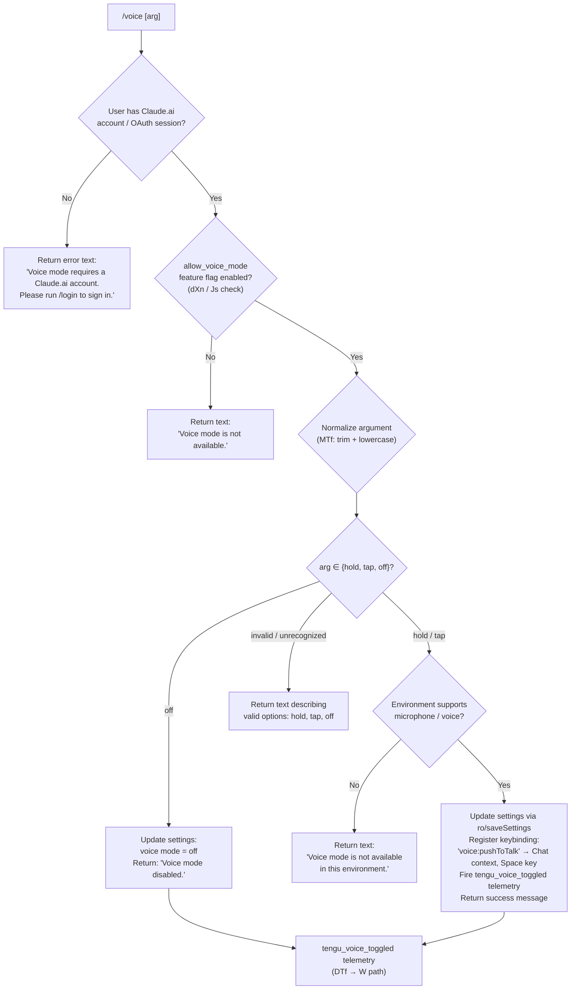

# `/voice`

> Analysis basis: CC v2.1.186 bundle.js (AST extraction + Claude interpretation)
> Minimum version: v2.1.186

---

## Overview

The `/voice` command toggles or configures voice mode in Claude Code, accepting an optional mode argument (`hold`, `tap`, or `off`). It validates the user's authentication and feature-flag eligibility, updates the persisted voice-mode setting via the settings subsystem, and optionally registers a push-to-talk keybinding for the `Chat` context. The command is not available in non-interactive environments.

---

## Registration

| Field | Value |
|---|---|
| type | `local` |
| name | `voice` |
| description | `Toggle voice mode` |
| argumentHint | `[hold\|tap\|off]` |
| supportsNonInteractive | `false` |
| isHidden | `null` |
| module_id | `B$l` |
| load_inline | `true` |
| loc_byte | `13103501` |
| loc_byte_end | `13103743` |
| loc_line | `8839` |
| arbor_handler.name | `DTf` |
| arbor_handler.fqn | `claude-2.1.186::DTf` |
| arbor_handler.kind | `AsyncFunction` |
| arbor_handler.resolution_path | `module_id` |
| arbor_handler.n_hits | `1` |

Analysis basis: CC v2.1.186 bundle.js:+13103501

---

## Input Branching

The command has five distinct execution paths based on authentication state, feature-flag availability, argument value, and environment capability, making a Mermaid flowchart the appropriate representation.



Analysis basis: CC v2.1.186 bundle.js:+13100986 (handler entry `DTf → $gt`), +13100903 (literals `hold`, `tap`, `off`), +13101027 (auth error string), +13101126 (unavailable string)

---

## Behavioral Spec

### 1. Feature-flag and Authentication Gate

The handler `DTf` first calls `voiceModeEligibilityCheck` (bundle identifier `$gt`) which internally invokes `checkAuthStatus` (`uXn`) and `getFeatureFlags` (`dXn`).

```
async function voiceModeEligibilityCheck(context):
    authState = checkAuthStatus(context)       // uXn → ny
    if authState is not authenticated:
        return { eligible: false, reason: "needs_login" }

    flags = loadFeatureFlags(context)          // dXn → Js
    if NOT flags.has("allow_voice_mode"):
        return { eligible: false, reason: "feature_disabled" }

    return { eligible: true }
```

- Authentication check (`ny`) resolves profile type, inspects `firstParty` account status, and checks for a valid OAuth or API-key credential. Analysis basis: CC v2.1.186 bundle.js:+13090269
- Feature flag `"allow_voice_mode"` is tested explicitly via `Js` against a known-flags set. Analysis basis: CC v2.1.186 bundle.js:+13090224, +13090227
- If not authenticated: returns a `text`-type message `"Voice mode requires a Claude.ai account. Please run /login to sign in."` Analysis basis: CC v2.1.186 bundle.js:+13101014, +13101027
- If feature flag absent: returns `"Voice mode is not available."` Analysis basis: CC v2.1.186 bundle.js:+13101126

### 2. Argument Normalization

```
function normalizeVoiceArg(rawArg):
    trimmed = rawArg.trim()          // MTf, loc_byte 13100856
    lower   = trimmed.toLowerCase()  // mKe, loc_byte 13102896

    if lower in {"hold", "tap", "off"}:
        return lower
    return "invalid"
```

The valid argument values `"hold"`, `"tap"`, and `"off"` are literal constants. Analysis basis: CC v2.1.186 bundle.js:+13100903, +13100915, +13100926, +13100947

### 3. Settings Persistence

When a valid mode (`hold` or `tap`) is selected, `DTf` delegates to `saveSettings` (bundle identifier `ro`) to persist the chosen mode to the user's local settings file.

```
async function saveVoiceModeSetting(mode, context):
    settingsPath = resolveSettingsPath(context)    // ro → p9 → mO.join(".claude/settings.local.json")
    currentConfig = loadSettingsFromDisk(context)  // ro → DG → vEr
    currentConfig.voiceMode = mode
    writeSettingsSafe(settingsPath, currentConfig) // ro → BTt (atomic write with temp file + rename)
    invalidateSettingsCache()                      // ro → EH → xYt.clear + csr.clear
```

- Settings are persisted to `~/.claude/settings.local.json` or the project-local equivalent. Analysis basis: CC v2.1.186 bundle.js:+1315462 (`"settings.local.json"`)
- Atomic write uses a temp file with `randomBytes`-generated name, followed by `fsyncSync` and `renameSync`. Analysis basis: CC v2.1.186 bundle.js:+1099779
- On write failure, the handler returns `"Failed to update settings. Check your settings file for syntax errors."` Analysis basis: CC v2.1.186 bundle.js:+13101414

### 4. Voice Disabled Path

When argument is `"off"`:

```
async function disableVoiceMode(context):
    saveVoiceModeSetting("off", context)
    emitTelemetry("tengu_voice_toggled", { mode: "off" })
    return textMessage("Voice mode disabled.")
```

Return string: `"Voice mode disabled."` Analysis basis: CC v2.1.186 bundle.js:+13101552

### 5. Keybinding Registration

When voice mode is enabled (`hold` or `tap`), `DTf` calls `registerVoiceKeybinding` (bundle identifier `VI`) to bind the push-to-talk action.

```
function registerVoiceKeybinding():
    action  = "voice:pushToTalk"      // literal, loc_byte 13102765
    context = "Chat"                  // literal, loc_byte 13102784
    key     = "space"                 // literal, loc_byte 13102791

    loadKeybindingConfig(context)     // VI → kTn → CMt
    if NOT alreadyRegistered("voice:pushToTalk"):
        addBinding({ action, context, key })
        emitTelemetry("tengu_custom_keybindings_loaded")
        emitTelemetry("tengu_keybinding_customization_release")
```

Analysis basis: CC v2.1.186 bundle.js:+13102762 (`VI`), +13102765, +13102784, +13102791

### 6. Environment Capability Check

Before activating hold/tap mode, the handler checks whether the current runtime environment supports microphone access.

```
function checkVoiceEnvironmentSupport():
    // Checks platform capability via mKe (locale + feature set lookup)
    // On macOS: references "System Settings → Privacy & Security → Microphone"
    if NOT microphoneAvailable():
        return { supported: false,
                 message: "Voice mode is not available in this environment." }
    return { supported: true }
```

- On unsupported environments, returns `"Voice mode is not available in this environment."` Analysis basis: CC v2.1.186 bundle.js:+13101796
- The macOS permission guidance string `"System Settings → Privacy & Security → Microphone"` is embedded. Analysis basis: CC v2.1.186 bundle.js:+13102303
- The `mKe` function checks language (`"en"`, loc_byte +30406), normalizes locale strings, and tests a known-capabilities Set (`H5o.has`). Analysis basis: CC v2.1.186 bundle.js:+13102896, +30418, +30468

### 7. Telemetry Emission

After any state change (enable or disable), `DTf` emits telemetry via the `W` path:

```
function emitVoiceToggled(newMode):
    emitTelemetry("tengu_voice_toggled", {
        mode: newMode    // "hold" | "tap" | "off"
    })
```

Analysis basis: CC v2.1.186 bundle.js:+13101495 (`DTf → W`), telemetry event `tengu_voice_toggled` at +13101497

---

## State & Side Effects

| Item | Detail |
|---|---|
| Telemetry | `tengu_voice_toggled` (on enable or disable); `tengu_feature_ok` / `tengu_feature_bad` / `tengu_feature_sad` (via feature-flag check path); `tengu_custom_keybindings_loaded` and `tengu_keybinding_customization_release` (on keybinding registration); `tengu_config_parse_error` (on settings parse failure) |
| Settings write | Persists `voiceMode` field to `settings.local.json` (or equivalent) via atomic temp-file rename |
| Settings cache invalidation | Clears `xYt` and `csr` in-memory caches on successful write (`EH` path) |
| Keybinding registration | Registers `voice:pushToTalk` → `Space` key in the `Chat` keybinding context (`VI → kTn → CMt`) |
| `appState` changes | Voice mode field updated in application state after settings persistence; keybinding map updated in memory |
| Sound | None found in depth-2 traversal |
| Non-interactive | Command is disabled (`supportsNonInteractive: false`); calling from a non-interactive context has no effect |
| Auth requirement | Requires Claude.ai account (OAuth / `firstParty`); rejects API-key-only or unauthenticated sessions for this feature |

---

## Version History

| Version | Change |
|---|---|
| v2.1.186 | Initial analysis |

---

## Common Mistakes

1. **Calling `/voice` without a Claude.ai account** — using an API key alone is insufficient; the command checks for an OAuth-backed `firstParty` session and returns a login prompt if absent.
2. **Using `/voice` in non-interactive mode** — `supportsNonInteractive` is `false`; the command will not execute in headless or pipe-mode invocations.
3. **Passing an unlisted argument** — only `hold`, `tap`, and `off` are accepted after normalization. Any other string (including absent arguments when a specific mode is required) falls through to the invalid-argument path.
4. **Expecting voice on unsupported platforms** — even with a valid account and feature flag, environments without microphone access (detected at runtime) return the unavailability message rather than activating.
5. **Syntax errors in settings files** — if the settings JSON is malformed, the settings write fails silently from the user's perspective with a specific error message; voice mode will not be activated.
6. **Assuming the Space keybinding is always registered** — the `voice:pushToTalk` / Space binding is only registered when activating `hold` or `tap` mode; it is not present when disabling with `off`.

---

## Appendix — Identifier Mapping

> For bundle debugging only. Identifiers change across versions.

| Identifier | Role |
|---|---|
| `DTf` | Main async handler for `/voice` command (Arbor-resolved entry point) |
| `$gt` | Voice mode eligibility check (auth + feature flag gate) |
| `uXn` | Authentication status checker |
| `ny` | Auth profile resolver (checks `firstParty`, OAuth, API-key) |
| `Ud` | Auth credential accessor (calls `ot`, `IXt`) |
| `iA` | Auth state builder (assembles profile fields including `profile-implicit`, `user_oauth`) |
| `Nl` | First-party account checker (uses `"firstParty"` literal) |
| `Wg` | Authentication flow orchestrator (checks `ANTHROPIC_API_KEY`, `apiKeyHelper`, `none`) |
| `Dkt` | Feature-flag sub-checker |
| `XQe` | Feature-flag lookup helper |
| `aA` | Supplementary auth accessor |
| `dXn` | Feature-flag loader (checks `"allow_voice_mode"`) |
| `Js` | Feature-flag set interrogator (tests `gid.has`, `Hid.has`) |
| `cEi` | Feature-flag cache initializer |
| `C2` | Flag-to-config mapper |
| `Ki` | Essential-traffic feature guard (`"essential-traffic"`) |
| `Sme` | Feature-flag state emitter |
| `Xz` | Feature-flag resolver chain |
| `Nr` | Settings loader orchestrator |
| `DG` | Settings load coordinator (emits `loadSettingsFromDisk_start` / `_end` marks) |
| `BL` | Settings baseline loader |
| `na` | Memory-usage / performance hook on settings load |
| `G3` | `perf_hooks` require wrapper |
| `vEr` | Settings load executor (emits `settings_load_started` / `settings_load_completed`) |
| `Rn` | Settings file appender / directory creator |
| `NIt` | Settings flag/policy filter (`flagSettings`, `policySettings`) |
| `Xas` | Settings key aggregator |
| `QAe` | Settings path resolver (`userSettings`, `projectSettings`, `localSettings`) |
| `MG` | Settings merge helper |
| `jas` | SDK inline settings injector (`"SDK inline settings"`) |
| `Z$` | Settings object assembler (composes all setting layers) |
| `UIt` | WSL detection helper (`"wsl"`) |
| `MYt` | Settings post-processor |
| `mVt` | Settings validation helper |
| `MTf` | Argument trim normalizer |
| `ro` | Settings save / persist orchestrator |
| `jm` | Settings path and object lookup |
| `CEr` | Settings cache and event pipeline |
| `MC` | Settings module coordinator |
| `zJ` | Settings file reader (UTF-8 / UTF-16 detection, BOM handling) |
| `Fd` | File system real-path resolver |
| `T` | Platform-aware path/encoding helper |
| `grn` | File read helper |
| `kn` | Directory creation helper |
| `mn` | Generic mkdir utility |
| `Nyr` | Settings timestamp recorder |
| `z1e` | Settings object path resolver |
| `Xon` | Settings directory path builder |
| `BTt` | Atomic file write (temp + fsync + rename with `randomBytes`) |
| `l7e` | fchmod error handler (`EINVAL`, `ENOTSUP`, `EPERM`, `ENOSYS`) |
| `De` | JSON serializer wrapper |
| `EH` | Settings cache invalidator (clears `xYt` and `csr`) |
| `Xss` | Settings file read/write with gitignore awareness |
| `Ot` | Async-local-store context getter |
| `hrn` | Store getter helper |
| `yyr` | Settings line helper |
| `ron` | Git check-ignore runner |
| `$r` | Git subprocess executor |
| `Vsu` | Path expansion helper (home directory, absolute path) |
| `jss` | Git ls-files tracker |
| `Yss` | Gitignore append helper |
| `p9` | `.claude` directory path builder |
| `Mt` | Feature flag emitter (ok path) |
| `W` | Telemetry event emitter |
| `Pe` | Feature flag bad/sad path emitter |
| `KVe` | Telemetry event base constructor |
| `Re` | Error recorder / log push |
| `ao` | Error string normalizer |
| `ot` | String coercion helper |
| `Pnu` | Circular error buffer manager |
| `VI` | Keybinding registration orchestrator |
| `kTn` | Keybinding config loader |
| `CMt` | Keybinding config parser and validator |
| `J5r` | Keybinding entry builder |
| `KW` | Keybinding telemetry emitter (`tengu_keybinding_customization_release`) |
| `Ql` | Keybinding lookup helper |
| `che` | Keybinding file path resolver (`"keybindings.json"`) |
| `Bt` | JSON.parse wrapper |
| `vTn` | Keybinding array validator |
| `TTn` | Keybinding block expander |
| `cRi` | Keybinding registration emitter (`tengu_custom_keybindings_loaded`) |
| `Y5r` | Duplicate-key detector in keybinding JSON |
| `X5r` | Keybinding structure validator |
| `RTn` | Keybinding platform normalizer (linux / macos modifiers) |
| `n6r` | Keybinding platform resolver |
| `t6r` | Platform key-string builder |
| `tRi` | Keybinding action map builder |
| `V5r` | Keybinding binding descriptor builder |
| `Ke` | Keybinding fallback telemetry emitter (`tengu_keybinding_fallback_used`) |
| `mKe` | Locale / capability checker (language `"en"`, `H5o.has`) |
| `wt` | Config file watcher / global config manager |
| `cEe` | Global config read/write with backup logic |
| `i9` | Config string prefix stripper |
| `HGl` | Config backup directory scanner |
| `_Oo` | Config backup path builder |
| `Lxf` | File watcher registration helper |
| `aV` | File watch callback |
| `Ai` | Signal handler registration (`O5o.register`) |
| `_n` | Global config save guard (auth-loss prevention, emits `tengu_config_auth_loss_prevented`) |
| `a` | MCP manager update handler |
| `Z3e` | MCP server connection orchestrator |
| `arr` | MCP connection result applier |
| `q2o` | MCP server reconciler |
| `WT` | MCP server cleanup handler |
| `maa` | MCP auto-discovery helper |
| `l` | MCP session lifecycle manager |
| `QNl` | Daemon status file writer |
| `_Q` | Config accessor |
| `zqt` | Daemon status path builder |
| `Lqd` | MCP OAuth flow handler |
| `kqd` | MCP OAuth callback handler |
| `fca` | MCP server connection bootstrapper |
| `kQr` | MCP connection context builder |
| `ELe` | MCP command hash generator |
| `Y_n` | MCP schema builder |
| `X_n` | MCP tool schema resolver |
| `IT` | MCP schema hash builder |
| `j_n` | MCP schema baseline builder |
| `Bl` | Schema normalizer |
| `ln` | MCP debug logger |
| `wRn` | MCP server lifecycle runner |
| `Lr` | MCP server runner base |
| `SUt` | MCP connection result handler |
| `Xs` | Async-local-store reader |
| `Pxn` | MCP server path resolver |
| `PXr` | MCP tool registration handler |
| `Ae` | String coercion utility |
| `Qw` | MCP skills telemetry emitter (`tengu_mcp_skills`) |
| `it` | MCP tool registry checker |
| `EXr` | MCP error handler |
| `Wc` | MCP error logger |
| `_ca` | MCP async stream mapper |
| `ZW` | Async stream / abort-signal implementation |
| `nit` | MCP integer parser (slot index) |
| `Oxn` | MCP integer parser (server index) |
| `w` | Background worker clock/blur tracker |
| `L` | Background worker sweep scheduler |
| `hcc` | Worker context history accessor |
| `gcc` | Worker clock tick handler |
| `f` | Background session manager / worker dispatcher |
| `D` | Background task scheduler |
| `IXn` | Low-memory monitor (emits `tengu_bg_low_mem_mb`) |
| `D2e` | Temp-file cleanup helper |
| `N` | Worker permission classifier |
| `$Bo` | Unix-socket background session connector |
| `KBo` | Background session lifecycle handler |
| `p` | Forced-shutdown initiator |
| `Bn` | Retry-with-backoff helper |
| `c` | Native binding loader |
| `u` | Daemon stop / daemon-stop-failed handler |
| `ke` | Daemon stop emitter (`"daemon_stop"`) |
| `xe` | Daemon stop-failed emitter (`"daemon_stop_failed"`) |
| `gU` | Daemon config reload emitter (`tengu_daemon_control`) |
| `j6` | Daemon process exit orchestrator |

---

Note: index built via Arbor fallback; some signals (telemetry, literals) may be missing — see arbor-fallback.js.