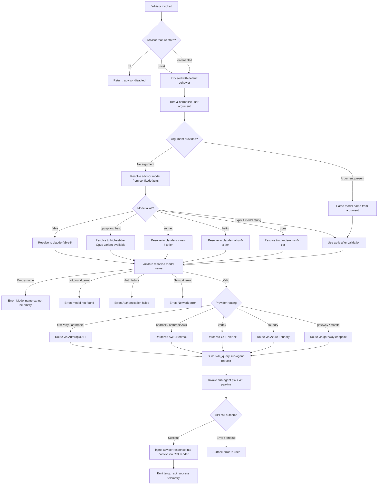

# `/advisor`

> Analysis basis: CC v2.1.187 bundle.js (AST extraction + Claude interpretation)
> Minimum version: v2.1.187

---

## Overview

The `/advisor` command allows Claude Code to consult a stronger (typically larger) model at key decision points during an ongoing session. When invoked, it dispatches a side query to an advisor model — selected from a ranked list of available Claude models — and injects the response back into the current agent context. The command is implemented as a `local-jsx` command type with an async handler that performs model resolution, context extraction, and a sub-agent API call.

---

## Registration

| Field | Value |
|---|---|
| type | `local-jsx` |
| name | `advisor` |
| description | `Let Claude consult a stronger model at key moments` |
| argumentHint | `[ ... ]` |
| isHidden | `null` (not hidden) |
| module_id | `EOl` |
| load_inline | `true` |
| loc_byte | `12666014` |
| loc_byte_end | `12666270` |
| loc_line | `8672` |
| arbor_handler.name | `__f` |
| arbor_handler.fqn | `claude-2.1.187::__f` |
| arbor_handler.kind | `AsyncFunction` |
| arbor_handler.resolution_path | `module_id` |
| arbor_handler.n_hits | `2` |

Analysis basis: CC v2.1.187 bundle.js:+12666014

---

## Input Branching

The command's execution involves 5+ distinct branching paths: advisor feature state (off/unset/on), model name resolution (fable / opusplan / sonnet / haiku / opus / best and explicit model strings), provider routing (firstParty, bedrock, vertex, foundry, gateway, mantle, anthropicAws), model validation outcomes (empty name, not-found error, auth failure, network error), and sub-agent invocation success/failure. A Mermaid flowchart is used.



---

## Behavioral Spec

### Handler Entry Point (`__f`)

The main handler is the `AsyncFunction` identified as `__f` (Arbor resolution via `module_id` → `EOl`).

```
async function advisorHandler(args, appContext):
    trimmedArg = trim(args)

    advisorState = readAdvisorFeatureState(appContext)  // literals: "off", "unset"
    if advisorState == "off":
        return renderDisabledMessage()

    modelName = resolveAdvisorModel(trimmedArg, appContext)
    // calls modelResolutionPipeline (Qo)

    renderedUI = renderJSX(advisorUIComponent, { modelName, appContext })
    // calls x6.jsx (bundle.js:+12665528)

    sideQueryResult = await dispatchSideQuery(modelName, appContext)
    // calls P9t (bundle.js:+12665640)

    return sideQueryResult
```

Analysis basis: CC v2.1.187 bundle.js:+12665492

---

### Model Resolution Pipeline (`Qo`)

Called at bundle.js:+12665626. Normalizes and resolves model aliases into canonical model IDs.

```
function resolveModelName(rawInput, context):
    normalized = normalize(rawInput)           // nl, trim, toLowerCase
    providerCtx = detectProvider(context)      // wH → xfe → nt

    if isKnownAlias(normalized):              // ix checks wfe list
        switch normalized:
            case "fable":
                return resolveViaFableChain()  // jNe → pRr → Kp
            case "opusplan":
                return resolveOpusPlan()       // opusplan literal: +2297992
            case "sonnet":
                return resolveSonnetTier()     // sonnet literal: +2298033
            case "haiku":
                return resolveHaikuTier()      // haiku literal: +2298072
            case "opus":
                return resolveOpusTier()       // opus literal: +2298111
            case "best":
                return resolveBestAvailable()  // best literal: +2298145

    // Tier-ordered model preference list (from literals):
    // claude-mythos-5, claude-opus-4-8..4-5, claude-opus-4-1, claude-opus-4-0
    // claude-sonnet-4-6..4-5, claude-sonnet-4-0
    // claude-haiku-4-5, claude-3-7-sonnet, claude-3-5-sonnet, claude-3-5-haiku
    // claude-3-opus, claude-3-sonnet, claude-3-haiku

    resolved = matchAgainstTierList(normalized)  // Vu, joe, YNe, h3u
    return applyProviderPrefix(resolved, providerCtx)  // pU → vH → DNe
```

Analysis basis: CC v2.1.187 bundle.js:+12665626; model tier list literals at +2294495 through +2295441

---

### Provider Detection (`pU` / `vH` / `DNe`)

Determines which API endpoint to target for the advisor call.

```
function detectProvider(context):
    providerStr = getProviderString(context).toLowerCase()  // DNe: +2126052

    knownProviders = [
        "firstParty",      // +2131842
        "anthropicAws",    // +2131691
        "gateway",         // +2131711
        "bedrock",         // +2131018
        "foundry",         // +2131068
        "mantle",          // +2131178
        "vertex",          // +2131226
    ]

    for provider in knownProviders:
        if providerStr matches provider:
            return provider

    // Prefix check: "anthropic." prefix → firstParty  (+2131457)
    if providerStr.startsWith("anthropic."):
        return "firstParty"

    return "unknown"
```

Analysis basis: CC v2.1.187 bundle.js:+3034629, +2126052, +2131018–2131842

---

### Sub-Agent Dispatch and Context Assembly (`P9t`)

Called at bundle.js:+12665640. Assembles the side-query sub-agent request and executes the API call pipeline.

```
async function dispatchAdvisorSideQuery(resolvedModel, context):
    // Validate model name
    if resolvedModel.trim() == "":
        throw Error("Model name cannot be empty")  // literal: +8938457

    // Check structured output support
    modelSupportsStructuredOutputs = checkFeatureSupport(resolvedModel, "structured_outputs")
    // literal "structured_outputs": +8819432

    // Build request headers
    headers = buildHeaders({
        "x-app": "cli",              // +3022084
        "User-Agent": buildUserAgent(),
        "X-Claude-Code-Session-Id": sessionId,
        "x-client-app": clientApp,
        "x-claude-code-agent-id": agentId,
        "x-claude-code-parent-agent-id": parentAgentId,
    })

    // Assemble messages for side query
    messages = buildSideQueryMessages(context)   // Ba pipeline
    // type label: "side_query" (+8819304), message role: "user" (+8818869)

    // Execute sub-agent call with request pipeline W5
    cacheKey = computeHash(messages, resolvedModel)  // Ldo: sha256, +8818309/+8818336
    request = buildAPIRequest(messages, resolvedModel, headers)

    // Set ephemeral cache marker
    cacheConfig = { type: "ephemeral" }           // literal: +8938915
    request.cache_control = "cache_control"        // literal: +8821474

    result = await executeAPIRequest(request)     // pW pipeline

    if result.error:
        handleAdvisorError(result.error)
    else:
        storeAdvisorResult(result, cacheKey)     // fpo.set: +8938934
        return result
```

Analysis basis: CC v2.1.187 bundle.js:+12665640, +8938420, +8938491, +8819304

---

### API Execution Pipeline (`pW` / `W5`)

The core HTTP pipeline used to call the advisor model.

```
async function executeAPIRequest(request):
    // Timeout: 600000 ms (10 minutes)  (+3023017)
    // Retry limit: 10 attempts          (+3023025)

    tokenResult = await getAuthToken()         // I.getToken: +3026623
    if tokenSource == "oauth":
        logDebug("[API:auth] OAuth token check starting")   // +3022645
        token = await refreshIfExpired()        // Rh → W_n
        logDebug("[API:auth] OAuth token check complete")   // +3022699

    if provider == "foundry":
        // Azure Cognitive Services token
        azureScope = "https://cognitiveservices.azure.com/.default"  // +3024535

    if sessionExpired:
        throw Error("Cloud gateway session expired — run /login to reconnect.")  // +3023226

    response = await fetch(endpoint, {
        method: "POST",
        headers: headers,
        body: JSON.stringify(request),
        signal: AbortSignal.timeout(10000),    // inner timeout: +2346932
    })

    // Stream response
    if contentType == "text/event-stream":     // +3031295
        processSSEStream(response)
    elif contentType includes "vnd.amazon.eventstream":  // +3031345
        processBedrockStream(response)

    emitTelemetry("tengu_api_success")         // +8820975
    return parsedResponse
```

Analysis basis: CC v2.1.187 bundle.js:+3022036, +3023017, +3023025, +3023226

---

### Context and Message Building (`Ba` / `Nke` / `guo`)

Constructs the conversation context payload sent to the advisor model.

```
function buildAdvisorMessages(appContext):
    // Extract current conversation messages
    rawMessages = extractMessages(appContext)   // zNe pipeline

    // Normalize each message
    normalized = rawMessages.map(msg =>
        normalizeMessage(msg)                  // nl, trim, ix checks
    )

    // Resolve model-specific formatting
    for msg in normalized:
        if msg requires fable-5 treatment:     // "claude-fable-5": +2281884
            applyFableFormatting(msg)
        applyProviderFormatting(msg, providerCtx)

    // Apply policy settings
    policies = getPolicies(appContext)         // Tn → "policySettings": +2278389

    // Build final message list
    sideQueryMessages = formatForSideQuery(normalized, policies)
    return sideQueryMessages
```

Analysis basis: CC v2.1.187 bundle.js:+12665714, +8669543, +8669590

---

### Advisor Feature Guard (`__f` entry / literals)

At the top of the handler, the advisor feature state is checked before any model resolution occurs.

```
function checkAdvisorEnabled(appContext):
    state = readSetting("advisor", appContext)

    if state == "off":     // literal: +12665558
        return DISABLED
    if state == "unset":   // literal: +12665569
        return DEFAULT_BEHAVIOR

    return ENABLED
```

Analysis basis: CC v2.1.187 bundle.js:+12665558, +12665569

---

### Error Handling Within Sub-Agent (`P9t` error paths)

```
function handleAdvisorError(error):
    switch error.type:
        case "not_found_error":       // literal: +8939414
            display("model: <name> not found")  // "model:": +8939496
        case auth error (401/403):
            display("Authentication failed. Please check your API credentials.")  // +8939193
        case network error:
            display("Network error. Please check your internet connection.")     // +8939295
        default:
            display(error.message)

    // Validation log emitted with label "model_validation"  // +8938821
    logTelemetry("model_validation", { model: resolvedModel, outcome: "error" })
```

Analysis basis: CC v2.1.187 bundle.js:+8939193, +8939295, +8939393, +8939414

---

## State & Side Effects

| Item | Detail |
|---|---|
| Telemetry | `tengu_api_success` (+8820975); `tengu_prompt_cache_1h_config` (+13502392); `tengu_lone_surrogate_sanitized` (+8820671); `tengu_scheduled_task_fire` (+16517650); `tengu_scheduled_task_expired` (+16517993); `tengu_bg_retire_grace_bridged_min` (+13053366); `tengu_bg_retire_pinned_low_mem` (+17200753); `tengu_bg_attach_upgrade` (+13053438); `tengu_bg_prewarm_per_sweep` (+17200874) |
| Sub-agent dispatch | Creates a `side_query` sub-agent request labeled `"side_query"` (+8819304), separated from the main conversation thread |
| Model result caching | Stores advisor response keyed by SHA-256 hash of messages+model via `fpo.set` (+8938934); uses `ephemeral` cache_control marker (+8938915) |
| API headers | Sets `x-app`, `User-Agent`, `X-Claude-Code-Session-Id`, `x-client-app`, `x-claude-code-agent-id`, `x-claude-code-parent-agent-id`, `x-anthropic-additional-protection` (+3022599) |
| OAuth token refresh | Triggers OAuth token check and potential refresh cycle when provider is `firstParty` (+3022645, +3022699) |
| appState changes | Advisor result injected into active conversation context; feature state readable via `"off"`/`"unset"` settings keys |
| Sound | <!-- TODO: not found in depth-2 traversal; needs --depth 4 --> |
| Hook registration | `rXe.trustAccepted` checked during proxy-auth helper evaluation (+1862188); hook agent path resolved via `"hook_agent"` label (+3287085) |
| Process lifecycle | `process.exit` reachable via error handler `Is` → `aqe`/`oT` path if fatal CLI error (`"cli_error"` literal: +13085957) with exit code `1` (+13085983) |

---

## Version History

| Version | Change |
|---|---|
| v2.1.187 | Initial analysis |

---

## Common Mistakes

1. **Invoking `/advisor` when the feature is set to `"off"`**: The command silently returns a disabled message without performing any model resolution. Check session/project settings if the command appears to do nothing.
2. **Providing an unsupported model alias**: Only the aliases `fable`, `opusplan`, `sonnet`, `haiku`, `opus`, and `best` are recognized shorthand. Any other string is treated as a literal model ID and validated directly — a typo will produce a `not_found_error`.
3. **Expecting synchronous output**: The handler is `async` and performs a full API round-trip. On slow networks or with large contexts, the advisor response may be delayed; the 600-second timeout (+3023017) applies to the entire pipeline.
4. **Assuming provider auto-detection is transparent**: The provider is inferred from the current model string prefix and configuration context. In Bedrock, Vertex, or Foundry deployments, the model ID must match the platform's naming convention; using an `anthropic.` prefix in a Bedrock environment routes via the firstParty path instead.
5. **Using `/advisor` in a sub-agent context**: The command builds its own sub-agent side-query internally. Nesting advisor calls within an already-running sub-agent may result in unexpected parent-agent-id header propagation and quota accounting.
6. **Ignoring workspace trust requirements**: The proxy-auth helper is skipped if workspace trust has not been accepted (+1862188, +1862217), which may silently fall back to a different authentication path than expected.

---

## Appendix — Identifier Mapping

> For bundle debugging only. Identifiers change across versions.

| Identifier | Role |
|---|---|
| `__f` | Main async handler for `/advisor` command (Arbor: `claude-2.1.187::__f`) |
| `Qo` | Model name resolution pipeline (alias normalization → canonical model ID) |
| `P9t` | Sub-agent side-query dispatcher (model validation, message assembly, API call) |
| `W5` | Core API execution pipeline (HTTP request, retry, streaming response handling) |
| `pW` | Low-level API request builder (headers, auth, timeout, provider routing) |
| `Ba` | Conversation context and message builder for advisor payload |
| `Nke` | Advisor context extraction and normalization wrapper |
| `guo` | Inner message normalization helper (provider/format checks) |
| `wBn` | Advisor result mapper and post-processor |
| `Mut` | Advisor filter pipeline (filters `Fvp` candidates, calls `wBn`) |
| `Akp` | Model alias expansion entry point |
| `bkp` | Model alias-to-ID resolver (fable-5, opus-4-x, sonnet-4-x variants) |
| `Kp` | Provider capability lookup (WPe, dFs, cFs, Yvt, Ir) |
| `uz` | Provider type resolver (Ir, Eu branches) |
| `Uwt` | Model string replacer/normalizer |
| `jNe` | Fable model resolution chain (pRr → Kp → uz → Uwt) |
| `pRr` | Fable-tier model preference resolver |
| `XC` | Model chain resolution dispatcher (`_fn`) |
| `_fn` | Model chain inner resolver (Kp, Vu) |
| `tse` | Sonnet-tier model resolver (fRr → Kp) |
| `fRr` | Sonnet model preference lookup |
| `n_` | Opus/alternative tier resolver (RTe) |
| `RTe` | Ranked tier resolution (Kp, Ir, Vu) |
| `kGs` | Comprehensive model resolution orchestrator (ese, jNe, Ba, n_) |
| `ese` | Model capability/availability evaluator (Ir, Eu, kfe, Yoe) |
| `Yoe` | Model inclusion check (`e.includes`) |
| `kfe` | Feature flag checker (Dt, Array.isArray) |
| `Eu` | Provider environment resolver (Odn) |
| `pU` | Provider detection pipeline entry (xfe, Eo, vH, Eu) |
| `vH` | Provider string matcher (zvt, wFu, Ir, DNe) |
| `DNe` | Provider name normalizer (toLowerCase, Object.values) |
| `zvt` | Provider value extractor (Ir, nt) |
| `wFu` | Provider prefix checker (`e.startsWith`) |
| `Eo` | Model routing evaluator ($Xe, t_, e.includes, UEt, Mp) |
| `t_` | Model string transformer (toLowerCase, includes, replace) |
| `Mp` | Model string replacer (e.replace) |
| `wH` | Model string formatter (xfe) |
| `xfe` | String normalization utility (nt) |
| `nt` | Base string conversion (String) |
| `nl` | String replace normalizer (e.replace) |
| `ix` | Model set membership checker (wfe.includes) |
| `joe` | Model inclusion validator (A3u.includes) |
| `YNe` | Model name builder (nt) |
| `h3u` | Model name lowercaser (e.toLowerCase) |
| `kwt` | Model rank resolution (nl, Hfn, toLowerCase, startsWith, Vu, joe, RTe, HTe) |
| `Vu` | Model variant resolver (Ir) |
| `Ir` | Core string/token resolver (nt) |
| `zNe` | Message normalization and deduplication (nl, trim, ix, Qo, t.has, Eo) |
| `Lfe` | Message linking helper (Ir, d3u, uRr) |
| `KNe` | Known model/alias set checker (c3u.includes) |
| `gfn` | Recursive message formatting helper (nl, Qo, kwt, ix, Ba) |
| `wGs` | Object-entry-based message formatter (nl, Object.entries) |
| `p3u` | Message processing sub-pipeline (ix, kwt, Qo, IGs) |
| `f3u` | Message start-check sub-pipeline (ix, Qo, CGs, t.startsWith) |
| `vGs` | Model index lookup (KNe, n.indexOf) |
| `$Xe` | Entry/key-based context builder (Ur, Object.entries) |
| `Tn` | Policy settings accessor (hsn, l2, "policySettings") |
| `uCt` | Message counter (ncs, tcs) |
| `dCt` | Context detail builder (q5o, Object.keys, Ioe, Asn, abe, l2, Toe, aCt, V5o) |
| `Ba` | Full conversation message assembler (uCt, dCt, zNe, Lfe, Bo, nl, KNe, ix, gfn, wGs, Tn, $Xe, vGs, p3u, Qo, kwt, f3u) |
| `Is` | Fatal error handler (aqe, oT, process.exit) |
| `s` | Async task set manager (r.add, i.finally, r.delete) |
| `n` | Stream/connection normalizer (i.toLowerCase, n.close, r.close, s) |
| `wfn` | API response processor (Za, Ir, Eu, Cfn, PTe, T) |
| `Cfn` | Async local store accessor (PGs.getStore) |
| `Za` | String utility wrapper (String) |
| `VSn` | API response validator (Ir) |
| `u6e` | Prompt cache configuration handler (nt, Ir, Ao, Var, it, Kar, t.some, n.endsWith, e.startsWith, n.slice) |
| `Ao` | Cache render helper (ay, H2, Gs) |
| `it` | Cache insertion tracker (ext, txt, V9, zIe.has, hSn, QRt.add, IW.has, IW.get, Dt) |
| `tD` | Memory/disk context handler (oFr, MFe) |
| `oFr` | Context file reader (Ir) |
| `MFe` | Context format builder (nt, WNe) |
| `axr` | Response annotation handler (Ir, jWs) |
| `jWs` | Web search result parser (e.match, t.split, o.trim, r.every, zWs.test, n.split, R9u.test) |
| `ixr` | Response item validator (sxr, hEt, r.get, t.every, o.has, s.add, r.set, T) |
| `sxr` | Resource reference resolver (e.replace, oxr) |
| `rse` | Model response handler (hEt, n.get, sxr) |
| `DFe` | Model compatibility checker (Eo, vH, bO, t.includes) |
| `bO` | Provider fallback resolver (Ir) |
| `qZu` | Request ID and dedup manager (Ir, lai, a.has, a.set, sai.randomUUID, jUr, String, a.get, T, gOe, Me, VZu, n, cai, aai, KUr, GZu, Object.defineProperty) |
| `WZu` | Request abort/cleanup (aai, oai, Ir) |
| `UZu` | Request lifecycle manager (v_n, H1e, GKe, xre, oxr, zH, Ls) |
| `v_n` | Response stream handler (RI, ys, Eo, H1e) |
| `FTe` | Fetch timing tracker (zH, Date.now, Promise.resolve, far, E9u, yXt) |
| `Mln` | Auth helper executor (ENe, Xvs, wr, rXe.trustAccepted, T, Date.now, UCu, rU, NC, console.error) |
| `ny` | Proxy auth handler (nt, Za, rU, az, uYe, Jvs, dCr, mCr) |
| `NZu` | Session token manager (tT, tZe) |
| `cA` | OAuth credential builder (Vdn, Ad, uZe, WG, fx, nt, GG, Gs, H2, NNe, $ai, Bai) |
| `$Te` | WIF token exchange handler (wJe, e.provider, Le, String, Re, C9u, T) |
| `wJe` | Credential resolution fetcher (yl, w9u, GG, rOe, Promise.all, Promise.resolve, ww, e_, oOe, fetch, s, String, AbortSignal.timeout, o, T, rmn, T9u, I9u, be) |
| `ay` | Credential assembly helper (Ad, cA, Nl, Bo, tT, Yg, Zkt, uZe) |
| `Rh` | OAuth refresh handler (W_n) |
| `xre` | Model profile resolver (rCc.find, e.startsWith, BXt) |
| `qC` | Context queue handler (Yg) |
| `YU` | Agent ID resolver (TCd, rD, ke) |
| `TCd` | Agent route classifier (e.startsWith, e.slice, OCn, P2r, rD) |
| `rD` | Thread type resolver (e.startsWith, "repl_main_thread": +3287010) |
| `BDt` | Background task dispatcher (pNi, Ont, $Dt) |
| `pNi` | Background task initializer (ICd, ke) |
| `Ont` | Background notify handler (Ng) |
| `$Dt` | Background task settler (Ont, FDt) |
| `L` | Worker pool sweep manager (Date.now, w.values, V, k, DVt, V2l, N2e, ke, F, zn, e, W, WXn, it, z) |
| `V` | Worker lifecycle manager (u, F.add, y.has, g.get, oOt, Bwn, g.set, T, W, bVf.isLoopDefaultSentinel, o, t, kdc, Math.floor, N.push, tK, g.delete, y.add, pae, y.delete) |
| `DVt` | Memory monitor (GXn, q2l.freemem) |
| `V2l` | Worker retire check (it) |
| `N2e` | Stale file pruner (gb.lstat, xDt, e.isFile, gb.rm, gb.readFile, Gt, Array.isArray, n.filter, kn, fCd) |
| `p0p` | Cache hit checker (e.find, n.find) |
| `Ldo` | Cache key hasher (RBa.createHash, sha256, hex) |
| `Dwe` | Response data writer (Sa, Array.isArray, T, yW, hc, kt, Me) |
| `yW` | Binary data handler (Dt, OOo.randomBytes, hn, T) |
| `t8o` | Message array manipulator (t.pop, Array.isArray, GJt, t.push, Object.keys) |
| `qJt` | Message normalizer (n.pop, Array.isArray, GJt, WJt, n.push, Object.keys) |
| `WJt` | Content block normalizer (QWo, e.replace) |
| `GJt` | Content type checker (BJt, qwc.test) |
| `kN` | Deep clone utility (structuredClone) |
| `Rr` | Response validator (Ng, Ve) |
| `Ng` | Protocol conformance checker (rKe) |
| `Fo` | Format validator (rKe) |
| `Ve` | Version/shape checker (rKe) |
| `xSe` | Response size tracker |
| `eyt` | SDK transport selector (fyc) |
| `ke` | Error logging wrapper (fo, nt, Vi, Qru, c7e.push, jJ.logError) |
| `fo` | Error constructor wrapper (Error, String) |
| `iEt` | Cache insertion tracker (terminal) |
| `muo` | Context metadata extractor (called from Nke) |
| `hJe` | Message inclusion gate (e.includes) |
| `yfn` | Message type filter (Ir, Eu, kfe, hJe) |
| `wBn` | Advisor result post-processor (Nke, Mp, Qo) |

---

Note: index built via Arbor fallback; some signals (telemetry, literals) may be missing — see arbor-fallback.js.