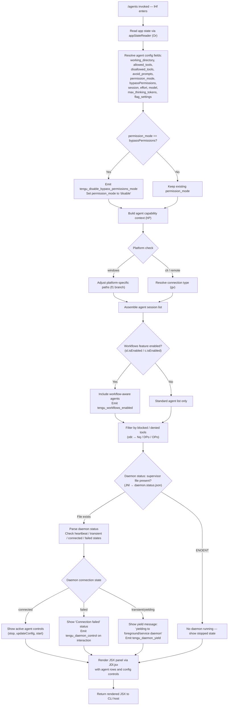

# `/agents`

> Analysis basis: CC v2.1.187 bundle.js (AST extraction + Claude interpretation)
> Minimum version: v2.1.187

---

## Overview

The `/agents` command provides an interactive management interface for agent configurations within Claude Code. It renders a JSX-based UI panel through which the user can inspect, start, stop, and reconfigure local agent daemons. The command queries current application state to enumerate running and available agent sessions, then presents a live control surface for daemon lifecycle operations and permission-mode adjustments.

---

## Registration

| Field | Value |
|---|---|
| type | `local-jsx` |
| name | `agents` |
| description | `Manage agent configurations` |
| module_id | `XDl` |
| load_inline | `true` |
| loc_byte | `12614740` |
| loc_byte_end | `12614865` |
| loc_line | `8661` |
| arbor_handler.name | `lHf` |
| arbor_handler.fqn | `claude-2.1.187::lHf` |
| arbor_handler.kind | `AsyncFunction` |
| arbor_handler.resolution_path | `module_id` |
| arbor_handler.n_hits | `0` |

Analysis basis: CC v2.1.187 bundle.js:+12614740

---

## Input Branching

The command's handler (`lHf`) and the primary rendering function (`hP`) each branch across more than three distinct paths depending on agent state, permission mode, feature flags, and daemon lifecycle status. A Mermaid flowchart is used below.



Analysis basis: CC v2.1.187 bundle.js:+12614601, +12614609, +12614622, +10787750, +10787928, +10229210, +17211390, +17210611, +17030677, +17030869, +17216460

---

## Behavioral Spec

### 1. Handler Entry — `agentsCommandHandler` (`lHf`)

The top-level async handler is resolved from module `XDl` via `module_id` path resolution.

```
async function agentsCommandHandler(context):
    appState = readAppState(context)           // Or → e.getAppState
    agentPanel = buildAgentPanel(appState)     // hP
    jsxOutput  = renderJSX(agentPanel)         // JDl.jsx
    return jsxOutput
```

Analysis basis: CC v2.1.187 bundle.js:+12614601, +12614609, +12614622

---

### 2. App State Reader — `appStateReader` (`Or`)

Reads current application state and extracts agent configuration fields. Uses `findLast` to obtain the most recent agent session entry.

```
function appStateReader(appContext):
    state = appContext.getAppState()

    agentConfig = {
        working_directory : state["working_directory"],    // +10787855
        allowed_tools     : state["allowed_tools"],        // +10787910
        disallowed_tools  : state["disallowed_tools"],     // +10787965
        avoid_prompts     : state["avoid_prompts"],        // +10788026
        permission_mode   : state["permission_mode"],      // +10788128
        bypassPermissions : state["bypassPermissions"],    // +10788159
        session           : state["session"],              // +10788458
        effort            : state["effort"],               // +10788483
        model             : state["model"],                // +10788496
        max_thinking_tokens: state["max_thinking_tokens"], // +10788508
        flag_settings     : state["flag_settings"],        // +10788534
    }

    if agentConfig.permission_mode == "bypassPermissions":
        telemetry.emit("tengu_disable_bypass_permissions_mode")  // +3395452
        agentConfig.permission_mode = "disable"                  // +3395553

    lastSession = state.sessions.findLast(...)   // +10787830

    allowedToolsConfig  = resolveAllowedTools(agentConfig)    // G8n → os +10787928
    disallowedConfig    = resolveDisallowedTools(agentConfig) // W8n → os +10787986
    capabilityContext   = buildCapabilityContext(agentConfig) // N2       +10788181

    return { agentConfig, lastSession, allowedToolsConfig,
             disallowedConfig, capabilityContext }
```

Analysis basis: CC v2.1.187 bundle.js:+10787750, +10787830, +10787855, +10788159, +3395452, +3395553

---

### 3. Agent Panel Builder — `buildAgentPanel` (`hP`)

Assembles the full data structure powering the JSX render. Combines platform resolution, feature-flag checks, daemon status inspection, and session lifecycle management.

```
function buildAgentPanel(appState):
    // 3a. Resolve connection mode (cli vs remote)
    connectionMode = resolveConnectionMode(appState)   // gv → r9, Za, nt, it
    // Values: "cli" (+4976922) or "remote" (+4976933)

    // 3b. Platform-specific initialization
    if platform == "windows":                          // +4974153
        agentPaths = resolvePlatformPaths(appState)    // f1 → jt, nt, Za, Upe, it
    else:
        agentPaths = defaultPaths(appState)

    // 3c. Feature flag checks
    workflowsEnabled = featureFlagService.isEnabled("allow_workflows")  // sl.isEnabled +10229596
    productFeedback  = featureFlagService.isEnabled("allow_product_feedback") // +3352407
    if workflowsEnabled:
        telemetry.emit("tengu_workflows_enabled")   // +3372809

    // 3d. Build tool permission context
    toolPermissions = buildToolPermissions(appState)   // fb → MSn, pSi, NBr, Qad
    // Includes: nSi, K9, Vi, Lme, Qz checks on Oad/Nad membership sets

    // 3e. Filter agents by blocked/denied tools
    filteredAgents = filterAgents(appState.agents)     // Gte → e.filter, o6t
    // o6t branches: Nq (deny), DPo (Kpe/ZIt/obe/FEr/s0), OPo

    // 3f. Read daemon status file
    daemonStatus = readDaemonStatus()                  // JNl → "daemon.status.json" +12784279
    // JNl calls: SQ (Dfe), Date.now, Xs, tVt (XNl.join, or), Me (JSON.stringify)

    // 3g. Resolve agent session objects
    agentSessions = resolveAgentSessions(appState)     // o3 → Yc, Nit, vA, nt, aft, T_o, I_o, GZa, MD

    // 3h. Build model descriptor for each agent
    for each session in agentSessions:
        modelDesc = buildModelDescriptor(session)      // MD → uOt, T, Ir, Eu
        // uOt checks: "standard" (+4962369), "tst" (+4962448), 100 (+4962461),
        //             "tst-auto" (+4962498)
        // T handles: "debug" (+214506), uppercase conversion, trim, QP, dze, eLc
        // Ir → nt (provider name resolution)
        // Eu → Odn (extended model info)
        // Provider literals seen: "bedrock" (+2131018), "foundry" (+2131068),
        //   "anthropicAws" (+2131124), "mantle" (+2131178), "vertex" (+2131226)
        // Vertex note: "[ToolSearch:optimistic] disabled..." (+4963692)

    // 3i. Daemon lifecycle controls (per session)
    daemonControls = buildDaemonControls(agentSessions)  // u → Le, Re, CU, X6

    // u pushes items tagged:
    //   "daemon_stop"        (+17233717) → Le (W, Pe → rKe)
    //   "daemon_stop_failed" (+17233754) → Re (W, Pe)
    //   daemon_control CU → q9 (M2), Vz.push, u$e (xw), aBr
    //     aBr: lSn, sBr.randomUUID, hZe, yW, e.emit("firstParty" +3324869)
    //   X6: Promise.race, Promise.all, Ome (Pme.shutdown), Vme (clearTimeout, GOo),
    //       Kn (o, Error, r, setTimeout, c, clearTimeout, s.unref),
    //       process.exit (+17228890), timeout 500ms (+17228851)

    telemetry.emit("tengu_daemon_control")   // +17233792 on control interactions
    telemetry.emit("tengu_feature_ok")       // +1025122 on successful feature gate
    telemetry.emit("tengu_feature_bad")      // +1025189 on failed feature gate

    return panelDescriptor
```

Analysis basis: CC v2.1.187 bundle.js:+10229210, +10229282, +10229297, +10229311, +10229333, +10229348, +10229360, +10229420, +10229527, +10229545, +10229573, +10229585, +10229596, +10229672, +10229687, +10229715, +10229726, +10229768, +10229813

---

### 4. Daemon File I/O & Supervisor Loop — `supervisorFileHandler` (`Z8e`) and `daemonStatusReader` (`JNl`)

```
function supervisorFileHandler(path):
    try:
        stat = fs.stat(path)                   // p$l.stat +12957797
        if not stat.isFile():                  // +12957869
            return Promise.reject(...)
        if file.size > 1048576:                // 1 MiB limit +12957888
            return Promise.reject(...)
        content = readContent(path)            // Xs → $Fu.getStore +2153553
        parsed  = parseContent(content)        // vxo → Cxo +12957737
        keys    = Object.keys(parsed)          // +12958306
        result  = formatTable(keys)            // o → s.map, i.padEnd(40) +17222673
        // Column separator: "  " (two spaces) +17222694
        return result
    catch ENOENT:                              // +12957828
        return cnHandler(path)                 // cn +12957820

function daemonStatusReader():
    filePath = joinPath(XNl, "daemon.status.json")  // tVt → XNl.join +12784265, +12784279
    timestamp = Date.now()                           // +12784391
    storeRef  = getContextStore()                    // Xs → $Fu.getStore
    token     = buildToken(tVt, or)                  // +12784274
    data      = Me(JSON.stringify(...))              // +12784446, +192118
    return { filePath, timestamp, token, data }
```

Analysis basis: CC v2.1.187 bundle.js:+12957797, +12957828, +12957842, +12957869, +12957888, +12958306, +17222673, +12784279, +12784391

---

### 5. Daemon Lifecycle Actions — `daemonStopHandler` (`d`) and `connectionManager` (`_`)

```
function daemonStopHandler(agentId, registry):
    supervisor = registry.get("supervisor")          // +17211390
    agentInst  = instanceMap.get(agentId)            // i.get +17211638

    agentInst.stop()                                 // E.stop +17211658
    // E internally: FUt, eyt → fyc (http/sse/dynamic) +17027757

    instanceMap.delete(agentId)                      // i.delete +17211667
    supervisor.stop()                                // A.stop +17211778
    // A: Math.max/min bounds, _ (connectionManager)

    newConfig = computeNewConfig(agentId)
    supervisor.updateConfig(newConfig)               // A.updateConfig +17211787
    supervisor.start()                               // A.start +17211805

    heartbeatHandler = OEc(Xse)                      // +17211907, +17210624
    // Heartbeat key: "heartbeat" +17210611

    instanceMap.set(agentId, newInst)                // i.set +17211952
    newInst.start()                                  // I.start +17211963
    telemetry.emit("tengu_daemon_config_reload")     // +17212183

    registry.write(updatedRegistry)                  // d.write +17211382

function connectionManager(agent):
    // Connection type dispatch (eyt → fyc)
    types handled: "http" (+17027711), "sse" (+17027728), "dynamic" (+17027808)

    connectAgent(agent)                              // qD, Ox +17030645, +17030701
    results = Promise.all([...connections])          // +17030782

    if connection.state == "connected":              // +17030677
        onConnected(agent)                           // k7, SB, ke, fo
    elif connection.state == "failed":               // +17030869
        raiseError("Connection failed")              // +17030887
    elif connection.state == "transient":            // +17216460
        log("yielding to a foreground/service daemon — bg workers will be re-adopted")
        // +17216513
        telemetry.emit("tengu_daemon_yield")         // +17216595
        daemonYieldHandler()                         // x.preventDefault, d.write, W
```

Analysis basis: CC v2.1.187 bundle.js:+17211390, +17211658, +17211667, +17211778, +17211787, +17211805, +17211907, +17211952, +17211963, +17212183, +17027711, +17027728, +17027808, +17030677, +17030869, +17030887, +17216460, +17216513, +17216595

---

### 6. Telemetry Slate/Cobalt Signals — `connectionModeEmitter` (`gv`) and `platformEmitter` (`f1`)

```
function connectionModeEmitter(appState):
    // Determines if session is cli-local or remote
    if mode == "cli":
        telemetry.emit("tengu_slate_harbor")    // +4976952
    elif mode == "remote":
        telemetry.emit("tengu_slate_harbor")    // same event, different branch

function platformEmitter(session):
    if platform == "windows":
        // windows-specific agent path resolution
        telemetry.emit("tengu_cobalt_ridge")    // +4974247
```

Analysis basis: CC v2.1.187 bundle.js:+4976922, +4976933, +4976952, +4974153, +4974247

---

### 7. Feature Gate Checks — `featureGateCheck` (`Le`, `Re`)

```
function featureGateOk(feature):
    result = W(feature)             // W = base renderer
    render = Pe(result)             // Pe → rKe +3808
    telemetry.emit("tengu_feature_ok")   // +1025122
    return render

function featureGateBad(feature):
    result = W(feature)
    render = Pe(result)
    telemetry.emit("tengu_feature_bad")  // +1025189
    return render
```

Analysis basis: CC v2.1.187 bundle.js:+1025120, +1025155, +1025187, +1025228, +1025122, +1025189

---

## State & Side Effects

| Item | Detail |
|---|---|
| Telemetry: `tengu_disable_bypass_permissions_mode` | Emitted when `permission_mode` equals `bypassPermissions`; mode is forced to `"disable"` (bundle.js:+3395452) |
| Telemetry: `tengu_slate_harbor` | Emitted during connection-mode resolution (`cli` or `remote`) (bundle.js:+4976952) |
| Telemetry: `tengu_daemon_yield` | Emitted when daemon enters transient/yielding state (bundle.js:+17216595) |
| Telemetry: `tengu_daemon_config_reload` | Emitted after daemon config is updated and supervisor restarted (bundle.js:+17212183) |
| Telemetry: `tengu_workflows_enabled` | Emitted when the `allow_workflows` feature flag is active (bundle.js:+3372809) |
| Telemetry: `tengu_cobalt_ridge` | Emitted on Windows platform agent path resolution (bundle.js:+4974247) |
| Telemetry: `tengu_feature_ok` | Emitted on successful feature gate passage (bundle.js:+1025122) |
| Telemetry: `tengu_feature_bad` | Emitted on failed feature gate (bundle.js:+1025189) |
| Telemetry: `tengu_daemon_control` | Emitted on user interaction with daemon lifecycle controls (bundle.js:+17233792) |
| Daemon status file | Reads `daemon.status.json` from daemon directory; ENOENT yields "stopped" state (bundle.js:+12784279, +12957828) |
| Supervisor registry | `supervisorRegistry.write()` called after config changes; tracks `"supervisor"` key (bundle.js:+17211382, +17211390) |
| appState changes | `permission_mode` may be overwritten from `bypassPermissions` → `"disable"` (bundle.js:+3395553) |
| Daemon process | `stop()`, `updateConfig()`, `start()` called on agent instances; `process.exit` reachable on shutdown timeout of 500 ms (bundle.js:+17228851, +17228890) |
| Heartbeat loop | `heartbeatHandler` established via `OEc`/`Xse` after daemon restart (bundle.js:+17211907, +17210611) |
| File size limit | Supervisor status files rejected if larger than 1,048,576 bytes (1 MiB) (bundle.js:+12957888) |
| Column padding | Agent table columns padded to 40 characters with two-space separator (bundle.js:+17222673, +17222694) |
| Randomness | `Math.random()` and `setTimeout()` used in app-state polling (bundle.js:+14093350, +14093387) |
| Sound | <!-- TODO: not found in depth-2 traversal; needs --depth 4 --> |

---

## Version History

| Version | Change |
|---|---|
| v2.1.187 | Initial analysis |

---

## Common Mistakes

1. **Expecting a text response**: `/agents` is a `local-jsx` command; it renders an interactive JSX panel, not a plain-text reply. Piping its output to non-interactive contexts may yield nothing visible.
2. **Assuming `bypassPermissions` persists**: The command silently downgrades `permission_mode` from `bypassPermissions` to `"disable"` before rendering. Any configuration that relied on bypass mode will see a changed state after `/agents` opens.
3. **Confusing daemon "stopped" with an error**: An `ENOENT` on `daemon.status.json` is normal when no daemon has been started — it does not indicate a fault.
4. **Overlooking the 1 MiB file limit**: Supervisor status files exceeding 1,048,576 bytes are rejected. Unusually verbose daemon logs written into that file will cause the status read to fail.
5. **Expecting instant daemon restart**: After `stop()` + `start()`, the 500 ms timeout in `X6` can invoke `process.exit` if the new connection does not resolve in time. Do not issue `/agents` config changes immediately before a long-running task.
6. **Vertex AI tool-search warning**: When using a Vertex AI model, tool-search optimistic mode is automatically disabled unless `ENABLE_TOOL_SEARCH=true` is set in the environment (bundle.js:+4963692).

---

## Appendix — Identifier Mapping

> For bundle debugging only. Identifiers change across versions.

| Identifier | Role |
|---|---|
| `lHf` | Top-level async command handler (`agentsCommandHandler`) — Arbor-resolved entry point |
| `Or` | App state reader; extracts agent config fields and last session |
| `hP` | Agent panel builder; orchestrates all sub-builders and returns panel descriptor |
| `G8n` | Allowed-tools resolver (delegates to `os`) |
| `W8n` | Disallowed-tools resolver (delegates to `os`) |
| `os` | Shared tool-list processor |
| `N2` | Capability context builder |
| `it` | Capability context internal helper (ext, txt, V9, zIe, hSn, QRt, IW, Dt branches) |
| `hSn` | Capability set membership checker (uBr, zIe, lBr, mBr) |
| `Dt` | Capability descriptor builder (Wt, n0, MOo, _Ee, Date.now, MRf) |
| `gv` | Connection-mode resolver (cli/remote); emits `tengu_slate_harbor` |
| `Z8e` | Supervisor file reader; enforces 1 MiB limit; handles ENOENT |
| `vxo` | Content parser wrapper (delegates to `Cxo`) |
| `f$l` | Table formatter (Object.keys, Math.max, XH) |
| `E` | Agent instance stop controller (FUt, eyt → fyc) |
| `eyt` | Transport-type dispatcher (http/sse/dynamic) |
| `A` | Supervisor instance (stop/updateConfig/start, Math.max/min, `_`) |
| `_` | Connection manager; handles connected/failed/transient states; emits `tengu_daemon_yield` |
| `OEc` | Heartbeat handler factory (delegates to `Xse`) |
| `I` | Foreground-agent controller (Math.max/floor, x.preventDefault, A) |
| `x` | Yield-state handler (d.write, W) |
| `T_o` | Terminal/output object builder (WQa, oo) |
| `oo` | Output stream initializer (wPe, nsr, aYt, lYt, ySc, t9o) |
| `fb` | Tool-permission builder (MSn, pSi, NBr, Qad) |
| `MSn` | Model-setting normalizer (nt, qL) |
| `pSi` | Permission set initializer (Js) |
| `Js` | Permission rule evaluator (nSi, Oad, K9, Nad, Vi, Lme, Qz, r.includes) |
| `NBr` | Named-block rule builder (Zad) |
| `Zad` | Rule-entry constructor (nt, it, Za, xi) |
| `Qad` | Quick-allow descriptor (qL) |
| `Gte` | Agent filter by blocked status (e.filter, o6t) |
| `o6t` | Filtering strategy selector (Nq deny, DPo multi-factor, OPo) |
| `Nq` | Deny-list filter (MPo) |
| `DPo` | Multi-factor filter (Kpe, ZIt, obe, FEr, s0) |
| `I_o` | Interactive session options builder (f1, Npt, oo) |
| `f1` | Platform path resolver; emits `tengu_cobalt_ridge` on Windows |
| `Yc` | Session descriptor builder (jt, Upe) |
| `Le` | Feature-gate OK renderer; emits `tengu_feature_ok` |
| `Re` | Feature-gate BAD renderer; emits `tengu_feature_bad` |
| `CU` | Daemon control action builder (q9, Vz, u$e, aBr) |
| `q9` | Control queue manager (M2) |
| `u$e` | Control utility (xw) |
| `aBr` | Action broadcaster (lSn, sBr.randomUUID, hZe, yW, e.emit firstParty) |
| `X6` | Shutdown sequencer (Promise.race/all, Ome, Vme, Kn, process.exit, 500 ms timeout) |
| `Ome` | Shutdown trigger (Pme.shutdown) |
| `Vme` | Timeout cleaner (clearTimeout, GOo) |
| `Kn` | Abort controller (o, Error, r, setTimeout, c, clearTimeout, s.unref) |
| `o3` | Agent session resolver (Yc, Nit, vA, nt, aft, T_o, I_o, GZa, MD) |
| `Nit` | Session normalizer (oC, Yc) |
| `oC` | Session type checker ("local-agent" literal) |
| `vA` | Path formatter (Za) |
| `MD` | Model descriptor builder (uOt, T, Ir, Eu) |
| `uOt` | Model variant resolver (MFe, FVr, $Md, nt, Za; standard/tst/tst-auto) |
| `T` | Model name formatter (gOe, Xwc, e.includes, Me, toUpperCase, wc, trim, QP, dze, eLc) |
| `Ir` | Provider name resolver (nt) |
| `Eu` | Extended model info resolver (Odn) |
| `JNl` | Daemon status file reader (SQ, Date.now, Xs, tVt, Me) |
| `tVt` | Status file path builder (XNl.join, or) |
| `SQ` | Store accessor (Dfe) |
| `ql` | Feature-flag query helper |
| `c` | Secondary feature-flag service handle |
| `En` | Feature-flag engine backing `c` |
| `l` | Daemon include-list handle (JNl) |
| `Me` | JSON serializer wrapper (JSON.stringify) |