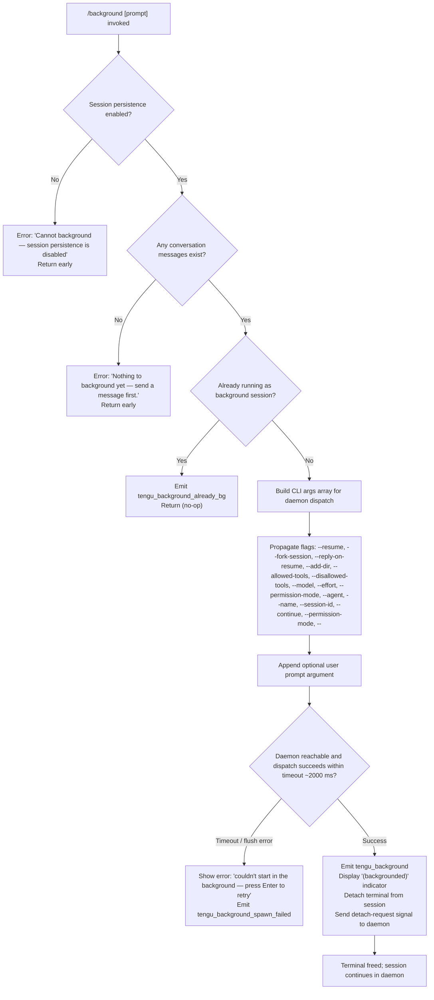

# `/background`

> Analysis basis: CC v2.1.187 bundle.js (AST extraction + Claude interpretation)
> Minimum version: v2.1.187

---

## Overview

The `/background` command (alias `/bg`) sends the current interactive Claude Code session to the background daemon, freeing the terminal for other use. It forks the active session into a background job managed by the Claude Code daemon process, then detaches the terminal from that job. An optional prompt argument can be provided to queue a task for the backgrounded session immediately upon detach.

---

## Registration

| Field | Value |
|---|---|
| type | `local-jsx` |
| name | `background` |
| description | `Send this session to the background and free the terminal` |
| aliases | `["bg"]` |
| argumentHint | `[prompt]` |
| immediate | `null` |
| module_id | `BBl` |
| load_inline | `true` |
| loc_byte | `13125754` |
| loc_byte_end | `13125994` |
| loc_line | `9075` |
| arbor_handler.name | `OIf` |
| arbor_handler.fqn | `claude-2.1.187::OIf` |
| arbor_handler.kind | `AsyncFunction` |
| arbor_handler.resolution_path | `module_id` |
| arbor_handler.n_hits | `0` |

Analysis basis: CC v2.1.187 bundle.js:+13125754

---

## Input Branching

The command has 4+ distinct execution branches depending on session state, persistence configuration, and daemon availability.



Analysis basis: CC v2.1.187 bundle.js:+13119022, +13125006, +13125042, +13125060, +13125211, +13125250, +13125320

---

## Behavioral Spec

### Guard: Persistence and Message Checks

```
async function backgroundCommandHandler(args, appState):
    // Guard 1: persistence must be enabled
    if not sessionPersistenceEnabled(appState):
        return errorMessage(
            "Cannot background — session persistence is disabled, " +
            "so the forked job would have nothing to resume."
        )

    // Guard 2: at least one message must exist
    if conversationIsEmpty(appState):
        return errorMessage(
            "Nothing to background yet — send a message first."
        )

    // Guard 3: already in background?
    if isAlreadyBackgroundSession(appState):
        emitTelemetry("tengu_background_already_bg")
        return  // silent no-op
```

Analysis basis: CC v2.1.187 bundle.js:+13125042, +13125060, +13125074, +13125250, +13125008

---

### Argument Construction

The handler assembles a CLI argument array that is passed to the daemon dispatch mechanism. It collects flags from the current session's state and maps them to the equivalent CLI flags that the daemon's worker process will understand when re-launching.

```
function buildDaemonArgs(sessionState, userPrompt):
    args = []

    // Session continuity
    if sessionState.resumeId:
        args.push("--resume", sessionState.resumeId)

    args.push("--fork-session")

    if userPrompt:
        args.push("--reply-on-resume", userPrompt)

    // Working directories
    for dir in sessionState.additionalDirs:
        args.push("--add-dir", dir)

    // Tool access controls
    if sessionState.allowedTools.length > 0:
        args.push("--allowed-tools", sessionState.allowedTools.join(","))
    if sessionState.disallowedTools.length > 0:
        args.push("--disallowed-tools", sessionState.disallowedTools.join(","))

    // Model / effort / permission flags
    if sessionState.model:
        args.push("--model", sessionState.model)
    if sessionState.effort:
        args.push("--effort", sessionState.effort)
    if sessionState.permissionMode:
        args.push("--permission-mode", sessionState.permissionMode)

    // Named agent / session identity
    if sessionState.agentName:
        args.push("--agent", sessionState.agentName)
    if sessionState.sessionId:
        args.push("--session-id", sessionState.sessionId)

    // End-of-flags sentinel
    args.push("--")
    return args
```

Analysis basis: CC v2.1.187 bundle.js:+13119373, +13119386, +13119428, +13119480, +13119515, +13119540, +13119556, +13119587, +13119616, +13119633, +13119661

---

### Daemon Dispatch with Flush Timeout

The assembled argument list is handed to the background-dispatch subsystem. A flush timeout of **2000 ms** is applied (`bundle.js:+13119317`). If the daemon does not acknowledge within this window, the operation is treated as a failure.

```
async function dispatchToBackground(args):
    flushTimeoutMs = 2000  // bundle.js:+13119317

    try:
        result = await Promise.race([
            daemonDispatch(args),
            rejectAfter(flushTimeoutMs, "flush timeout")
        ])
        return result
    catch error:
        if isFlushTimeout(error) or isDaemonUnreachable(error):
            emitTelemetry("tengu_background_spawn_failed")
            showRetryPrompt("couldn't start in the background — press Enter to retry")
            return failure
```

Analysis basis: CC v2.1.187 bundle.js:+13119309, +13119317, +13119322, +13120017

---

### Successful Detach Path

When dispatch succeeds, the UI renders a `(backgrounded)` label and the terminal is released back to the shell.

```
function onDispatchSuccess(appState):
    emitTelemetry("tengu_background")
    renderLabel("(backgrounded)")   // bundle.js:+13121553
    sendDetachRequest()             // bundle.js:+13125320
    // XVt.jsx renders the JSX confirmation element
```

The detach signal uses the `detach-request` message type (`bundle.js:+11196009`) sent over the daemon control socket to the background worker (`daemon-worker`, `bundle.js:+2309172`).

Analysis basis: CC v2.1.187 bundle.js:+13120818, +13121553, +13125320

---

### Permission / Flag Gate Checks (during daemon-side launch)

Before the daemon accepts the job, several gate checks are applied server-side in the dispatch handler (`uJn` → `LX` → `IIf` path):

```
function checkPermissionGates(parsedArgs):
    // --dangerously-skip-permissions requires prior interactive acceptance
    if args.bypassPermissions and not disclaimerAccepted:
        return error(
            "--bg with bypassPermissions requires accepting the disclaimer first. " +
            "Run `claude --dangerously-skip-permissions` once interactively."
        )

    // --permission-mode auto requires prior interactive opt-in
    if args.permissionMode == "auto" and not autoModeOptedIn:
        return error(
            "--bg with auto mode requires opting in first. " +
            "Run `claude --permission-mode auto` once interactively."
        )

    // --bg and --cloud are mutually exclusive
    if args.cloud or args.remote:
        return error(
            "--bg and --cloud are different backends. " +
            "Use `claude --cloud '<task>'` directly to start a cloud session."
        )
```

Analysis basis: CC v2.1.187 bundle.js:+13107748, +13107910, +13052672

---

### Session Flush: Active Connections Before Detach

Before the terminal is released, the handler drains active I/O sessions. It iterates all active sessions, calls `close()` on each, and then removes them from the active-sessions registry.

```
function flushActiveSessions(sessions):
    sessionList = Array.from(sessions.values())  // bundle.js:+13119060
    for session in sessionList:
        session.close()                          // bundle.js:+17208740
        sessions.delete(session)                 // bundle.js:+17202184
    // Each session connection emits "data" events up to 1024 bytes
    // before the final close (bundle.js:+17093531)
```

Analysis basis: CC v2.1.187 bundle.js:+13119022, +13119056, +13119060

---

### Daemon Ensure-Running Sub-flow

If no daemon is currently running, the system attempts to start one before dispatching. The daemon start flow supports three modes:

1. **Service (launchd/systemd)** — daemon is registered as a persistent service; queried first.
2. **Transient spawn** — daemon is started on demand for this session only.
3. **Ask user** — first use prompts: `Install as a service now? [y/N/never, or 'once' just for now]`

```
async function ensureDaemonRunning(config):
    status = checkDaemonStatus()
    if status == "up":
        return ok

    if config.daemonInstallMode == "ask":
        answer = await promptUser(
            "Install as a service now? [y/N/never, or 'once' just for now] "
        )
        emitTelemetry("tengu_bg_daemon_cold_start_ask_answer")
        // "yes" → install; "once" → transient; "no"/"never" → transient or abort

    if shouldInstallService(answer):
        installService()
        emitTelemetry("tengu_bg_daemon_install")
    else:
        spawnTransient()

    waitForDaemonReady(timeoutMs: 5000)
```

Analysis basis: CC v2.1.187 bundle.js:+13050235, +13050310, +13043006, +13043524, +13043539

---

## State & Side Effects

| Item | Detail |
|---|---|
| Telemetry: `tengu_background` | Emitted on successful background dispatch (bundle.js:+13120818) |
| Telemetry: `tengu_background_already_bg` | Emitted when session is already in background mode (bundle.js:+13125008) |
| Telemetry: `tengu_background_spawn_failed` | Emitted when daemon dispatch fails or times out (bundle.js:+13120017) |
| Telemetry: `tengu_bg_dispatch` | Emitted by the daemon dispatch sub-system (bundle.js:+13084732) |
| Telemetry: `tengu_bg_dispatch_fallback` | Emitted when dispatch falls back to alternate path (bundle.js:+13085262) |
| Telemetry: `tengu_bg_dispatch_rescued` | Emitted when dispatch recovers from a transient error (bundle.js:+13091796) |
| Telemetry: `tengu_bg_daemon_cold_start_ask` | Emitted when user is asked whether to install the daemon (bundle.js:+13043582) |
| Telemetry: `tengu_bg_daemon_cold_start_ask_answer` | Emitted after user answers the install prompt (bundle.js:+13050310) |
| Telemetry: `tengu_bg_daemon_spawn_failed` | Emitted if daemon spawn fails (bundle.js:+13044153) |
| Telemetry: `tengu_bg_daemon_install` | Emitted when daemon service is installed (bundle.js:+13043017) |
| Telemetry: `tengu_rename_full_session_fork` | Emitted during session forking for rename/background (bundle.js:+12067279) |
| Telemetry: `tengu_daemon_control` | Emitted by the daemon control channel (bundle.js:+17233792) |
| Detach signal | Sends `detach-request` message type over daemon control socket |
| Session fork | Copies current session state into a new background job with `--fork-session` |
| Terminal | Freed after successful detach; the daemon adopts the PTY |
| appState changes | Session transitions from foreground interactive to background daemon-managed |
| Hook registration | No explicit hook registration in the command handler itself; hooks fire in the daemon-side job lifecycle |
| Sound | None detected in depth-2 traversal |
| Flush timeout | 2000 ms hard limit on daemon acknowledgment (bundle.js:+13119317) |
| Session list drain | All active I/O connections closed before detach (bundle.js:+13119022) |

---

## Version History

| Version | Change |
|---|---|
| v2.1.187 | Initial analysis |

---

## Common Mistakes

1. **Invoking `/background` before sending any message** — The guard at `bundle.js:+13125250` blocks the command with "Nothing to background yet — send a message first." You must have at least one conversation turn.

2. **Using `/background` when session persistence is disabled** — If the Claude Code project or environment has session persistence turned off, the command will immediately error: "Cannot background — session persistence is disabled." Enable persistence in project settings first.

3. **Using `/background` alongside `--cloud` or `--remote` flags** — These backends are incompatible. The daemon gate rejects the combination at `bundle.js:+13052672`. Start a cloud session directly with `claude --cloud '<task>'` instead.

4. **Using `/background` with `--dangerously-skip-permissions` without prior interactive acceptance** — The gate at `bundle.js:+13107748` requires that you first run `claude --dangerously-skip-permissions` at least once in an interactive session to accept the disclaimer.

5. **Expecting the command to work when no daemon is running and the user declines installation** — If you answer "no" to the "Install as a service now?" prompt and transient spawn also fails, `/background` will report it could not start in the background. Run `claude daemon install` beforehand to avoid the cold-start prompt.

6. **Confusing `/bg` (alias) with the `--bg` CLI flag** — `/bg` is the slash-command alias for in-session use, while `--bg` is a CLI flag for starting a session directly in background mode. They share underlying infrastructure but are invoked differently.

---

## Appendix — Identifier Mapping

> For bundle debugging only. Identifiers change across versions.

| Identifier | Role |
|---|---|
| `OIf` | Main async handler for `/background` command (arbor_handler) |
| `uJn` | Background dispatch orchestrator; builds CLI args and coordinates daemon launch |
| `dJn` | Command argument renderer / JSX wrapper for the background command UI |
| `S_` | Session list accessor (collects active sessions for flush) |
| `Is` | Terminal flush sub-routine; emits "cli_error" on failure, calls `process.exit(1)` |
| `Hm` | Session-key or state helper accessed during dispatch setup |
| `MMo` | Registration hook helper (`Rc` → `Ei` → `b6o.register`) |
| `Rc` | Feature-flag / hook registration utility |
| `Ei` | Hook registration executor (`b6o.register`) |
| `Dc` | Flush timeout race helper (`Promise.race`, `setTimeout`, `clearTimeout`) — 2000 ms |
| `HC` | Another hook/registration utility (calls `Rc`) |
| `GPe` | Session-state accessor called during arg-building phase |
| `p` | Forced-shutdown branch: calls `process.exit` with "forced shutdown" |
| `Kb` | Sub-routine called in forced-shutdown path |
| `u` | Daemon stop orchestrator (`Le`, `Re`, `CU`, `X6`) |
| `Le` | Feature-telemetry emitter (`tengu_feature_ok`) |
| `Re` | Feature-telemetry emitter (`tengu_feature_bad`) |
| `CU` | Daemon control helper (queues `firstParty` stop, emits UUID event) |
| `aBr` | Daemon stop event emitter (`e.emit`, random UUID, `yW`) |
| `X6` | Exit-race handler (`Promise.race`, `Promise.all`, `process.exit`) |
| `Ome` | Daemon shutdown caller (`Pme.shutdown`) |
| `Vme` | Timeout clear + `GOo` call during exit race |
| `Kn` | Generic timeout/abort-signal race helper |
| `g` | MCP server lifecycle manager (sets `r.setTimeout`) |
| `a` | MCP orchestrator: calls `a9e`, `brr`, `hla`, `uBo`, etc. |
| `a9e` | MCP connection driver (handles stdio/sse/http/ws-ide transports) |
| `brr` | MCP update applier (`e.applyMcpUpdate`, `ln`, `n.cleanup`) |
| `H` | PTY/IPC framing reader (`Buffer.concat`, `bJf`) |
| `bJf` | Daemon protocol message dispatcher (central daemon IPC handler) |
| `LX` | Background job launcher: validates gates, creates temp dir, calls `HIf` |
| `IIf` | Argument parser for background job (parses `--agent`, `--name`, `--resume`, etc.) |
| `HIf` | Full background session setup (connects via `yMo`, `Ty`, manages job lifecycle) |
| `yMo` | Daemon dispatch core: connects to control socket, sends dispatch, monitors ack |
| `N6` | Daemon-ensure-running: checks service status, optionally installs or spawns |
| `Kht` | Interactive background session runner (calls `qlf`, `kjn`, `IF`, `Cc`) |
| `qlf` | Background attach loop: attaches terminal to daemon job, handles redraw states |
| `C0` | Main query/turn driver called within the daemon-side job |
| `f4n` | Agent state machine: `getAppState`/`setAppState`, runs turn loop |
| `pye` | Detach signal sender: sends `detach-request` over daemon socket |
| `a6` | Daemon socket writer (`Qte.write`) for detach and task messages |
| `ipl` | Daemon IPC encoder (`b8n`, `En`) |
| `s3` | Background UI shell renderer (`nt`, `$3l`, `B3`, `eUe`) |
| `eUe` | Environment detection for tmux/CLAUDE_CODE_CHILD_SESSION context |
| `R3u` | Tmux `show-environment` spawner for child-session detection |
| `Ws` | `nUe` caller — daemon-worker mode initializer |
| `MH` | `pVn`/`PA` helper used in command argument slicing |
| `Uie` | File-based state helper used in dispatch result writing |
| `Df` | Dispatch error classifier (`cn`, `ipe.has`, `be`, `ke`) |
| `mat` | Telemetry helper called after successful background |
| `pHe` | Post-detach cleanup helper |
| `Mt` | Feature telemetry emitter (`tengu_feature_sad`) |
| `Ph` | `kt`/`Rc` pair — command registration helper |
| `Fq` | `kt`/`Rc` pair — command registration helper (second instance) |
| `KR` | State accessor called during fork setup |
| `Vce` | Array-some utility used in argument validation |
| `lP` | `AY` caller — list-format helper |
| `AY` | Array filter + `Kl` formatter |
| `qce` | String-startsWith guard used in command routing |
| `_8` | `Array.isArray` check helper |
| `dDe` | Path-prefix matcher used in allowed-path checks |
| `oV` | Permission-set checker (`t.has`, `dDe`, `t.add`) |
| `cHt` | File-path allowed-set validator |
| `Une` | Path `startsWith` guard |
| `eJn` | Argument parser helper for `--resume=` and `--session-id=` |
| `CBl` | Argument parser helper for `--resume` value extraction |
| `tJn` | Argument parser helper for `--session-id=` value extraction |
| `wBl` | Argument parser for `--name`/`-n` |
| `HIf` | (see above) Full session setup after gate checks pass |
| `gIf` | `Urn`/`jt` caller — session startup notifier |
| `Urn` | Startup log emitter |
| `vBl` | Argument validator for bg-mode flags |
| `nMo` | Cloud/remote-flag conflict detector (`--cloud`, `--remote` checks) |
| `MVt` | Daemon service lifecycle manager (install, poll, spawn) |
| `HMo` | Daemon status string parser |
| `qKn` | Control-socket connector with timeout and unref |
| `QWe` | Socket path resolver |
| `Ty` | Full daemon TCP/Unix connect + protocol handshake |
| `fue` | Daemon lock-file reader (`_S.lstat`, `_S.readFile`) |
| `_Bl` | Daemon alive-check: `EALIVE` sentinel, `Date.now` |
| `yIf` | Post-connect session tracker |
| `Jse` | `Fme`/`hx` pair — amber-anchor telemetry helper |
| `Fme` | `hx` caller — `tengu_amber_anchor` emitter |
| `RSo` | Rename/fork session helper (`ys`, `sEt`) |
| `ys` | Model-name resolver (`v9`, `Qo`, `Kg`) |
| `Qo` | Model alias normalizer (sonnet, haiku, opus, best, fable, etc.) |
| `Kg` | Model alias router |
| `qlf` | (see above) Background attach loop |
| `ele` | Session entry-point called by `qlf` |
| `kjn` | Message formatter for background job (joins array messages) |
| `IF` | Full background query runner (`Cc`, `oqn`, `On`, `G8e`) |
| `T5l` | Main agent turn loop (very large; handles all tool dispatch, streaming, fallbacks) |
| `G8e` | Query result wrapper (`KSo`, `T5l`) |
| `KSo` | Fallback-request handler |
| `oqn` | Agent listing delta processor |
| `Kw` | Tool-schema and response builder (very large; parses all tool types) |
| `N6` | (see above) Daemon-ensure-running |
| `Dt` | Config/state file manager (`_Ee`, `MRf`) |
| `_Ee` | Config file reader with backup/migration logic |
| `MRf` | Config file watcher setup (`fIt`, `mis.watchFile`) |
| `fIt` | File watcher initializer |
| `uV` | Config migration helper |
| `cn` | Generic error logger / console helper |
| `Jd` | JSON write helper (`cn`) |
| `kn` | String normalizer (`cn`) |
| `Cm` | Atomic file writer (`PK.writeFile`, `PK.rename`, `L_r.randomBytes`) |
| `ec` | Job directory path builder (`py.join`, `Vk`) |
| `Vk` | Jobs subdirectory resolver (`py.join`, `or`) |
| `Di` | Job state file reader/writer (order, stateOrder, lstat, readFile, JSON) |
| `f` | Worker-pool slot manager (spawn, retire, low-memory shed) |
| `L` | Sweep timer: scans workers, memory, retires settled/pinned |
| `V` | Grace-clock manager for worker retirement scheduling |
| `k` | Worker clock tracker (`w.delete`, `w.get`, `w.set`) |
| `DVt` | Memory-threshold checker (`q2l.freemem`) |
| `V2l` | Low-memory grace-bridge metric emitter (`tengu_bg_retire_grace_bridged_min`) |
| `N2e` | Temp-file reaper (`gb.lstat`, `gb.rm`) |
| `F` | Interval handle holder (`clearInterval`) |
| `U` | Idle-exit timer (writes daemon idle-exit telemetry, `M.unref`) |
| `M` | Writer for periodic idle-exit signal |
| `P` | Interval state holder |
| `v` | Variable used inside the attach-loop interval |
| `rue` | Renderer refresh helper called after state transitions |
| `AJf` | Worker spawn watchdog (Di, ec, uoe, e.kill, ke) |
| `WXn` | Worker upgrade checker (`tengu_bg_attach_upgrade`) |
| `SJf` | Stall detection helper (`Math.max`) |
| `HEc` | Dispatch-slot manager (Date.now, Math.min, `Kn`, `mp`) |
| `Jte` | HMAC timing-safe comparison for daemon control key (`Psl.timingSafeEqual`) |
| `CJf` | Path normalizer used in snapshot/stream messages |
| `K` | Permission-socket handler (`cMe`, `zgl`) |
| `cMe` | Permission file reader (`SP.lstat`, `SP.readFile`, `Sa`) |
| `zgl` | Permission file unlinker (`SP.unlink`) |
| `g7t` | Stream-destroy helper (`e.destroy`, `e.write`) |
| `uoe` | Job-file scanner (computes paths, scans for resume IDs) |
| `VS` | Realpath resolver (`TH`, `o2.realpath`) |
| `Wy` | Path validity checker (regex test) |
| `s2` | Path joiner + `iO`/`NE` helpers |
| `Ew` | Directory reader for job scanning (`o2.readdir`) |
| `Nou` | File-line scanner for resume-ID extraction |
| `nCe` | Config boolean coercer (`Dt`, `Boolean`) |
| `LX` | (see above) Gate-check + job-dir creation before dispatch |
| `c2` | Settings-layer merger (`Tn`) |
| `Tn` | Settings resolver (`hsn`, `l2`) |
| `H9` | Argument validation result holder |
| `kd` | Atomic write helper for job metadata (`Cm`, `py.join`, `Me`, `fy`) |
| `fy` | Cache-invalidation helper (`qZ.delete`) |
| `Fie` | File-state formatter (`wc`) |
| `gBl` | Message array mapper (`e.map`) |
| `pK` | Cleanup helper called after job launch |
| `KR` | Session-key reader called during dispatch |
| `mat` | Telemetry batch emitter |
| `pHe` | State propagation helper post-detach |
| `Mt` | `tengu_feature_sad` emitter |
| `Ace` | `Rc`/`_We` pair — feature gate checker |
| `j5` | Sub-agent exit handler (`aVp`, `YWn`, `Le`, `Re`) |
| `lk` | Look-up key helper |
| `c6e` | `a0p.has` tombstone checker |
| `Zte` | State-change notifier |
| `q8n` | Queue depth helper |
| `SBa` | `c6e` wrapper — secondary tombstone check |
| `cce` | `PA`/`o0p` pairing — notification filter |
| `AVp` | Fork-agent query runner (`W`, `Pe`, `Rr`) with `tengu_fork_agent_query` |
| `On` | Session-identity helper (`xP.randomUUID`, `y`) |
| `MIl` | Message trimmer (`Sa`, `i2`) |
| `i2` | String trimmer (`e.trim`) |
| `kjn` | (see above) Message joiner |
| `fee` | Message type extractor |
| `Cc` | Context/conversation-state accessor |
| `oKp` | Agent listing mapper (`e.map`, `nqn`, `sKp`) |
| `fal` | `iKp` caller — fallback-request builder |
| `zL` | `VL` caller — logger |
| `VL` | Logging sink |
| `RI` | API-provider selector (`Ir`, `Eu`, `HRr`, `ys`, `tse`) |
| `Ir` | Provider: `nt` (foundry/anthropic type) |
| `Eu` | Provider: `Odn` |
| `HRr` | API-key prefix checker (`sk-ant-`) |
| `tse` | `fRr` caller — auth-type resolver |
| `KO` | Fallback-credential provider |
| `kf` | Settings key normalizer (`kt`) |
| `kt` | `VL` wrapper — keyed logger |
| `Kl` | Array filter helper (`e.filter`) |
| `MH` | Arg-slice utility (`pVn`, `PA`) |
| `pVn` | `PA` caller |
| `PA` | Array-predicate helper |
| `Uie` | State-file writer for dispatch result |
| `Df` | Error-code classifier for dispatch failures |
| `dJn` | JSX/UI renderer for background command result |
| `_8` | `Array.isArray` guard |
| `Vce` | `t.some` predicate utility |
| `lP` | List formatter (`AY`) |
| `AY` | List formatter with `Kl` |
| `qce` | Prefix-check guard (`e.startsWith`) |
| `ph` | Command-type renderer pair (`kt`, `Rc`) |
| `Fq` | Command-type renderer pair (`kt`, `Rc`) |
| `Ws` | `nUe` initializer for daemon-worker mode |
| `nUe` | Daemon-worker bootstrap |
| `pye` | Detach-request sender |
| `Nfn` | Daemon socket setup helper |
| `ipl` | IPC frame encoder (`b8n`, `En`) |
| `b8n` | Binary frame builder |
| `En` | Encoding utility |
| `a6` | Socket write for task/detach messages |
| `s3` | Background UI wrapper renderer |
| `nt` | String coercer (`String`) |
| `$3l` | UI sub-component |
| `B3` | UI sub-component |
| `eUe` | Tmux/child-session environment probe |
| `cw` | Context-window helper |
| `df` | `c0` caller — async-local-storage store reader |
| `c0` | `IRr.getStore` — reads request-scoped store |
| `R3u` | Tmux environment spawner |
| `x3u` | Tmux `spawnSync` executor (`UGs.spawnSync`) |

---

Note: index built via Arbor fallback; some signals (telemetry, literals) may be missing — see arbor-fallback.js.