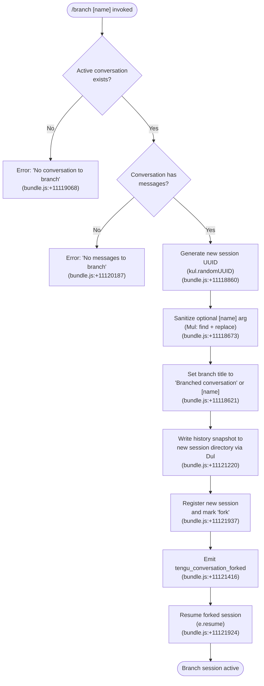

# `/branch`

> Analysis basis: CC v2.1.187 bundle.js (AST extraction + Claude interpretation)
> Minimum version: v2.1.187

---

## Overview

The `/branch` command creates a divergent copy ("fork") of the current conversation at the point where the command is issued, allowing the user to explore alternative directions without losing the original thread. It duplicates the existing message history into a new session, optionally naming the branch via an argument, then resumes the new session. Internally it is handled by the async function `s7p` (resolved via `module_id → pbo`).

---

## Registration

| Field | Value |
|---|---|
| type | `local-jsx` |
| name | `branch` |
| description | `Create a branch of the current conversation at this point` |
| argumentHint | `[name]` |
| module_id | `pbo` |
| load_inline | `true` |
| loc_byte | `12529207` |
| loc_byte_end | `12529384` |
| loc_line | `8548` |
| arbor_handler.name | `s7p` |
| arbor_handler.fqn | `claude-2.1.187::s7p` |
| arbor_handler.kind | `AsyncFunction` |
| arbor_handler.resolution_path | `module_id` |
| arbor_handler.n_hits | `0` |

Analysis basis: CC v2.1.187 bundle.js:+12529207

---

## Input Branching

Four distinct execution paths exist in the handler, so a flowchart is used.



---

## Behavioral Spec

### Top-level handler (`s7p`)

`s7p` is an `AsyncFunction` resolved from module `pbo` via the `load_inline` pattern.

Analysis basis: CC v2.1.187 bundle.js:+11122220 (call to `Pul` from `s7p`)

```
async function branchCommandHandler(context):
    result = await orchestrateBranch(context)
    return result
```

### Orchestration (`Pul`)

`Pul` is the primary orchestration function called by `s7p`.

Analysis basis: CC v2.1.187 bundle.js:+11121112

```
async function orchestrateBranch(context):
    // 1. Resolve conversation state
    sessionInfo = resolveCurrentSession(context)          // kt, ph
    if sessionInfo is null:
        raise Error("No conversation to branch")          // +11119068

    // 2. Validate message history
    messages = getMessageHistory(sessionInfo)
    if messages is empty:
        raise Error("No messages to branch")              // +11120187

    // 3. Sanitize branch name argument
    rawName = context.args                                // optional [name]
    sanitizedName = sanitizeBranchName(rawName)           // Mul

    // 4. Derive branch title
    branchTitle = sanitizedName if sanitizedName else "Branched conversation"  // +11118621

    // 5. Create new session directory and write snapshot
    newSessionId = crypto.randomUUID()                   // kul.randomUUID, +11118860
    await writeBranchSnapshot(newSessionId, messages, branchTitle)  // Dul

    // 6. Register branch with "fork" marker
    registerFork(newSessionId, sessionInfo, "fork")       // +11121937

    // 7. Emit telemetry
    emit("tengu_conversation_forked")                    // +11121416

    // 8. Optionally set custom title / agent-name metadata
    setCustomTitle(newSessionId, branchTitle)             // i6, +11121383
    setAgentName(newSessionId, context)                   // uWe, +11121401

    // 9. Resume forked session in UI
    resumeSession(newSessionId)                           // e.resume, +11121924

    return newBranchContext
```

### Branch-name sanitization (`Mul`)

Analysis basis: CC v2.1.187 bundle.js:+11118673

```
function sanitizeBranchName(rawInput):
    // Search for disallowed characters using a pattern
    match = rawInput.find(DISALLOWED_PATTERN)             // t.find, +11118673
    if match:
        // Replace disallowed characters
        cleaned = rawInput.replace(DISALLOWED_PATTERN, SAFE_SUBSTITUTE)  // n.replace, +11118751
        return cleaned
    return rawInput
```

### Snapshot writer (`Dul`)

`Dul` handles disk I/O for the branch: it copies the current conversation log to a new session directory.

Analysis basis: CC v2.1.187 bundle.js:+11118860

```
async function writeBranchSnapshot(newSessionId, messages, title):
    // Build target path
    targetDir = buildSessionPath(newSessionId)            // EL, Uf
    await fs.mkdir(targetDir, {recursive: true})          // cVn.mkdir, +11118922

    // Open read stream from current conversation log
    readStream = fs.createReadStream(sourceLogPath,       // lVn.createReadStream, +11118971
                                     {encoding: "utf8"})  // +11119004

    // Wait for stream to open
    await once(readStream, "open")                        // dbo.once, +11119019

    // On read error, check if current conversation exists (ENOENT guard)
    // kn + Error, +11119062

    // Write initial snapshot entry with title and type="text"
    writeStream = fs.createWriteStream(targetPath)        // lVn.createWriteStream, +11119117
    writeStream.write(                                   // c.write, +11119400
        serialize({title: title, type: "text"})           // +11118694
    )

    // Pipe read → write with readline interface
    lineReader = readline.createInterface(readStream)     // Rul.createInterface, +11119211
    for each line in lineReader:
        writeStream.write(line)                           // c.write

    // Apply content-replacement pass if needed            // "content-replacement", +11119548

    // Finalize
    writeStream.end()                                     // c.end, +11120583
    await stream.finished(writeStream)                    // xul.finished, +11120597

    // Progress reporting (100-step increments)           // N5, +11119627; 100, +11118788

    // Handle model_refusal_fallback if encountered       // "model_refusal_fallback", +11119862
```

### Session path builder (`EL` / `Uf`)

Analysis basis: CC v2.1.187 bundle.js:+11118897

```
function buildSessionPath(sessionId):
    base = getConfigBase()                               // kt
    prefix = getPathPrefix()                             // pR
    parts = getPathSegments()                            // Uf → Vwe.join, +5244109
    return path.join(base, prefix, ...parts, sessionId)
```

### Session registration with "fork" marker (`o7p`)

Analysis basis: CC v2.1.187 bundle.js:+11121352

```
function registerFork(newSessionId, parentSession, markerType):
    // markerType === "fork"                              // +11121937
    // "auto" naming mode if no explicit name given       // +11121370
    parentId = getParentSessionId(parentSession)         // jY
    autoTitle = deriveTitleFromHistory(parentSession)    // zHe
    registerSession({
        id: newSessionId,
        parentId: parentId,
        type: markerType,
        title: autoTitle,
        trackingSet: new Set()                           // o.add, o.has, +11120984
    })
    // parseInt used for sequence number                 // +11120990
```

### Title / metadata setters (`i6`, `uWe`)

**Custom title** (`i6`):

Analysis basis: CC v2.1.187 bundle.js:+11121383

```
function setCustomTitle(sessionId, title):
    // tag: "custom-title"                               // +13259692
    logEntry(sessionId, title)                           // dEe
    emitEvent(sessionId, title)                          // cKt.emit, +13259771
    emit("tengu_session_renamed")                        // +13259784
```

**Agent name** (`uWe`):

Analysis basis: CC v2.1.187 bundle.js:+11121401

```
function setAgentName(sessionId, context):
    // tag: "agent-name"                                 // +13264138
    logEntry(sessionId, agentName)                       // dEe
    emitEvent(sessionId, agentName)                      // HDo.emit, +13264223
    emit("tengu_agent_name_set")                         // +13264236
    persist()                                            // Sz → Vwt
```

### Session resume (`e.resume`)

Analysis basis: CC v2.1.187 bundle.js:+11121924

```
function resumeForkSession(newSessionId):
    // Loads file-watcher and workspace context           // Uie → ec, Di, kd
    // Resolves filesystem paths for new session          // eS → py.basename, kt
    context.resume(newSessionId)
```

---

## State & Side Effects

| Item | Detail |
|---|---|
| Telemetry | `tengu_conversation_forked` (+11121416); `tengu_session_renamed` (+13259784); `tengu_agent_name_set` (+13264236); additionally infrastructure events in call-graph depth (see Appendix) |
| Disk writes | New session directory created under the CC sessions store; snapshot log written by `Dul` via `fs.mkdir` + `fs.createWriteStream` (+11118922, +11119117) |
| Snapshot content | History copied line-by-line with an optional content-replacement pass (`"content-replacement"` marker, +11119548); title header written as `{type:"text"}` (+11118694) |
| Session registry | New session added to the in-memory session map with a `"fork"` type marker (+11121937) and an auto-derived or user-supplied title (+11118621) |
| Branch naming | Default title is the literal string `"Branched conversation"` (+11118621); user-supplied `[name]` argument overrides it after sanitization |
| appState changes | Active session switched to the forked session ID after `e.resume` (+11121924) |
| Error messages | `"No conversation to branch"` (+11119068); `"No messages to branch"` (+11120187); `"Unknown error occurred"` (+11122104) |
| ENOENT guard | If source log is missing (`ENOENT`), a structured error is raised via `kn` (+11119062) |
| Content-replacement | Applied during copy phase to normalise message content (+11119548) |
| Sound | <!-- TODO: not found in depth-2 traversal; needs --depth 4 --> |

---

## Version History

| Version | Change |
|---|---|
| v2.1.187 | Initial analysis |

---

## Common Mistakes

1. **Running `/branch` with no active conversation** — the command will immediately return the error `"No conversation to branch"`. Start or continue a conversation first.
2. **Running `/branch` on a freshly started session with zero user messages** — the guard at `Pul` checks that the message list is non-empty; if it is empty the error `"No messages to branch"` is returned (+11120187).
3. **Providing a branch name containing disallowed characters** — `Mul` silently strips or replaces them; the resulting name may differ from what was typed. Check the sanitised title in the new session header.
4. **Expecting the original session to be unaffected by a name change** — the branch inherits metadata from the original (including the resolved agent name via `uWe`), so any `"agent-name"` tag set on the parent propagates to the fork.
5. **Assuming the fork is a Git branch** — `/branch` is a conversation-level fork inside Claude Code's session store, not a Git operation. It does not create a Git branch or worktree.

---

## Appendix — Identifier Mapping

> For bundle debugging only. Identifiers change across versions.

| Identifier | Role |
|---|---|
| `s7p` | Top-level async handler for `/branch` (Arbor-resolved, FQN `claude-2.1.187::s7p`) |
| `Pul` | Branch orchestration function; validates conversation, drives the full fork flow |
| `Mul` | Branch-name sanitizer: `find` + `replace` on disallowed characters |
| `Dul` | Snapshot writer: opens read/write streams, copies log to new session directory |
| `o7p` | Session fork registrar: adds new session ID with `"fork"` marker and tracking set |
| `jY` | Parent-session resolver used during fork registration |
| `zHe` | Auto-title deriver; inspects message history for a display name |
| `r9l` | Filesystem path scanner/completer used during session resolution |
| `fqe` | Buffer packer used during session data serialization |
| `i6` | Custom-title setter; writes `"custom-title"` log entry and emits `tengu_session_renamed` |
| `uWe` | Agent-name setter; writes `"agent-name"` log entry and emits `tengu_agent_name_set` |
| `dEe` | Low-level log-entry appender (appendFileSync + mkdirSync) |
| `s3` | Log-entry formatter helper called by `dEe` |
| `Uie` | Session-resume orchestrator; wires file-watcher and workspace after fork |
| `eS` | Path resolver used during session resume (basename + config key) |
| `EL` | Session-directory path builder (wraps `Uf`) |
| `Uf` | Path segment joiner used by `EL` and `Dul` |
| `kt` | Config-base accessor |
| `pR` | Path-prefix accessor |
| `kn` | Structured error factory; handles `ENOENT` and related FS errors |
| `cn` | Core error constructor |
| `ke` | Error-logging dispatcher |
| `fo` | Error formatter (wraps `Error` + `String`) |
| `nt` | String normalisation utility |
| `N5` | Progress-reporting helper (100-step increments) |
| `Sz` | Persistence layer for session metadata (wraps `Vwt`) |
| `Vwt` | Low-level file read/write for session state JSON |
| `fi` | Utility: `indexOf` + `slice` for string extraction |
| `fw` | Utility: `replace` for regex substitution |
| `ec` | Path utility: `py.join` + `Vk` |
| `Di` | File-watcher / workspace state manager |
| `kd` | Directory-path builder: `Cm` + `py.join` + `Me` + `fy` |
| `fy` | Cache-delete helper (`qZ.delete`) |
| `Df` | File-existence guard (`ipe.has` + `cn`) |
| `_g` | Session-state accessor (wraps `S0`) |
| `x3o` | Background session lifecycle manager |
| `C3o` | Background session claim/connect manager |
| `D` | Background session process driver |
| `FEc` | Filesystem realpath/stat checker |
| `f` | Background session main dispatch loop |
| `h` | Background session entry point (calls `f`) |
| `Re` | Feature-flag check emitting `tengu_feature_ok` |
| `Le` | Feature-flag check emitting `tengu_feature_bad` |
| `Pe` | Feature-flag evaluator (`rKe`) |
| `W` | Shared state-write utility |
| `T` | Process/environment type resolver |
| `Me` | JSON serializer wrapper |
| `Gt` | JSON parser wrapper |
| `be` | String coercion wrapper |
| `Is` | CLI error handler calling `process.exit` |
| `Rc` | Terminal/renderer registration helper |
| `Ei` | Renderer registration (`b6o.register`) |
| `ph` | Session config loader (`kt` + `Rc`) |
| `GXn` | Memory monitor helper (`jt` + `it`) |
| `it` | macOS memory/token counter |
| `N2e` | Session log file reader/pruner |
| `fCd` | Recursive directory file collector |
| `xDt` | `pins.json` path builder |
| `JNl` | Daemon status reporter |
| `SQ` | Log-line formatter |
| `Dfe` | Message trimmer |
| `Xs` | AsyncLocalStorage context accessor |
| `tVt` | Daemon status path builder (`daemon.status.json`) |
| `eyt` | Tool-call orchestrator |
| `fyc` | Object-key enumerator for tool config |
| `g` | MCP server orchestration entry point |
| `a` | MCP server lifecycle manager |
| `a9e` | MCP connection driver (per-server) |
| `RB` | MCP tool/resource slot manager |
| `Qw` | MCP event handler (`eh` + `eJr`) |
| `zn` | Async task wrapper |
| `mua` | MCP reconnect scheduler |
| `myn` | MCP failure-record writer |
| `pyn` | MCP reconnect delay calculator (`Gl`) |
| `ln` | MCP debug logger (`jJ.logMCPDebug`) |
| `zRn` | MCP auth handler (`wr` + `JVd` + `QVd`) |
| `BUt` | MCP tool-call result applier |
| `mJr` | MCP result formatter |
| `eL` | MCP skill telemetry emitter (`tengu_mcp_skills`) |
| `ZXr` | MCP include-filter checker |
| `Vc` | MCP error logger (`jJ.logMCPError`) |
| `yua` | MCP session cleanup (`ZW`) |
| `git` | MCP retry-count parser |
| `nMn` | MCP timeout parser |
| `brr` | MCP connection result applier |
| `i9e` | MCP stale-connection disposer |
| `KT` | MCP slot cleanup orchestrator |
| `hla` | MCP tool-list refresh trigger |
| `uBo` | MCP server update dispatcher |
| `xRn` | MCP server filter (`EVd.has` + `aJr.has`) |
| `mit` | MCP server connection initiator |
| `U` | Daemon idle-exit timer manager |
| `N` | Daemon session counter |
| `M` | Write-flush timer |
| `x` | Session kill helper |
| `m` | Session kill-all helper |
| `p` | Forced-shutdown handler (`process.exit`) |
| `u` | Daemon stop/abort controller |
| `F` | Interval-based cleanup disposer |
| `_` | Tool-execution pipeline |
| `Kn` | Subprocess wait-with-timeout utility |
| `o` | Column-pad display formatter |
| `Jd` | Error context builder |
| `gR` | Binary frame encoder (Buffer operations) |
| `pJf` | Claim-send timeout handler |
| `dJf` | Claim-frame builder |
| `ZOo` | Session directory initialiser (mkdir + writeFile) |
| `iht` | Tool-call timing tracker |
| `i8t` | Session path helper (`jh.join` + `o8t`) |
| `Eye` | Windows session path helper (`jh.join` + `ZWe`) |
| `yR` | Late-error reporter (`iHl`) |
| `uN` | Session roster entry builder |
| `lM` | Late-message reporter (`iHl`) |
| `s8t` | State-file path builder |
| `Vi` | Telemetry traffic-mode evaluator |
| `jns` | Telemetry traffic normaliser |
| `Qru` | Telemetry queue manager (shift + push) |

---

Note: index built via Arbor fallback; some signals (telemetry, literals) may be missing — see arbor-fallback.js.