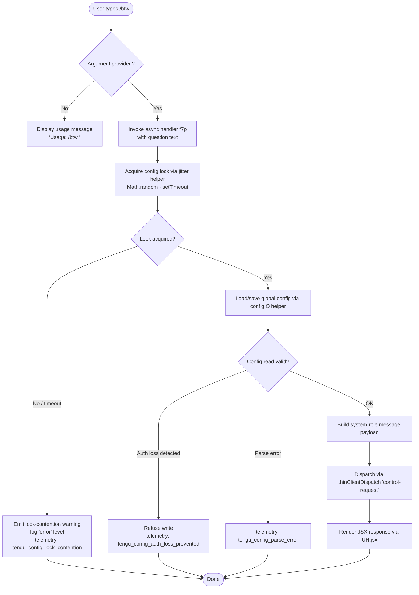

# `/btw`

> Analysis basis: CC v2.1.187 bundle.js (AST extraction + Claude interpretation)
> Minimum version: v2.1.187

---

## Overview

`/btw` ("by the way") lets the user pose a quick side question to the agent without disrupting the primary conversation thread. It is typed as `/btw <question>`, dispatches immediately through a `control-request` channel, and renders its UI via JSX. This makes it suitable for lightweight clarifications that should not consume a full conversational turn.

---

## Registration

| Field | Value |
|---|---|
| type | `local-jsx` |
| name | `btw` |
| description | Ask a quick side question without interrupting the main conversation |
| argumentHint | `<question>` |
| immediate | `true` |
| thinClientDispatch | `control-request` |
| module_id | `Ful` |
| load_inline | `true` |
| loc_byte | `11129150` |
| loc_byte_end | `11129389` |
| loc_line | `6983` |
| arbor_handler.name | `f7p` |
| arbor_handler.fqn | `claude-2.1.187::f7p` |
| arbor_handler.kind | `AsyncFunction` |
| arbor_handler.resolution_path | `module_id` |
| arbor_handler.n_hits | `0` |

Analysis basis: CC v2.1.187 bundle.js:+11129150

---

## Input Branching

Three distinct paths exist: no argument supplied (show usage), argument present and the async handler succeeds, and argument present but the config/lock subsystem raises an error. A Mermaid flowchart is therefore required.



Analysis basis: CC v2.1.187 bundle.js:+11128751, +11128753, +11128792, +11128815, +11128861

---

## Behavioral Spec

### 1. Entry Point — Argument Guard

When the user invokes `/btw`, the handler (`f7p`) first inspects whether a non-empty `<question>` argument was supplied.

```
async function btwHandler(context):
    if context.args is empty:
        return displayUsageHint("Usage: /btw <your question>")
    proceed to configAndDispatch(context.args)
```

Usage hint string: `"Usage: /btw <your question>"` (bundle.js:+11128753).

### 2. Jitter-Based Lock Acquisition

Before touching persistent config, the handler calls a jitter utility (`e`) that combines `Math.random` and `setTimeout` to spread concurrent access.

```
function acquireWithJitter(callback):
    delay = Math.random() * 2      // random float in [0, 2)  → bundle:+14093348, +14093364
    setTimeout(callback, delay)
```

This prevents multiple Claude instances from hammering the config lock simultaneously.
Analysis basis: CC v2.1.187 bundle.js:+14093348, +14093350, +14093364, +14093387

### 3. Global Config I/O (`configIO` — `hn` → `GQn`)

The handler delegates to the config persistence subsystem (`hn` → `GQn`) which:

1. Resolves the config directory via `IS.dirname` and creates it if absent (`s.mkdirSync`).
2. Computes a timestamp with `Date.now` and writes a config-metadata object assembled by `_Ws` / `Object.assign`.
3. Acquires a file-system lock; if acquisition exceeds a threshold it logs at the `"error"` level with the literal message `"Lock acquisition took longer than expected - another Claude instance may be running"` (bundle.js:+13750202) and emits `tengu_config_lock_contention` (bundle.js:+13750291).
4. Reads the existing config via `r.readFileSync` with encoding `"utf-8"` (bundle.js:+13752318), then parses JSON via `Gt` → `JSON.parse`.
5. If the re-read config is missing auth tokens that the in-memory cache holds, the write is aborted and `tengu_config_auth_loss_prevented` is emitted (bundle.js:+13750770). The guard message references GH #3117 (bundle.js:+13750618).
6. On a successful read the config is patched and written atomically via `oIt` (atomic file write using temp file → rename pattern, `r.renameSync`, `uf.fsyncSync`, `uf.fchmodSync`).
7. A rotating backup scheme (`HGl`) stores up to 5 backups (bundle.js:+13751221) in a `"backups"` subdirectory (bundle.js:+13751803), copying older files and unlinking stale ones.

```
async function configIO(payload):
    dir = IS.dirname(configPath)
    s.mkdirSync(dir, { recursive: true })
    lockResult = await acquireLock()
    if lockResult.timedOut:
        log("error", LOCK_CONTENTION_MESSAGE)
        emit("tengu_config_lock_contention")
    existing = JSON.parse(r.readFileSync(configPath, "utf-8"))
    if existing lacks auth that cache holds:
        emit("tengu_config_auth_loss_prevented")
        return
    merged = Object.assign({}, existing, payload)
    atomicWrite(configPath, merged)
    rotateBackups(configPath, maxCount=5)
```

Analysis basis: CC v2.1.187 bundle.js:+13746874, +13750013, +13750018, +13750063, +13750076, +13750202, +13750289, +13750291, +13750580, +13751221

### 4. Message Assembly — System-Role Payload

The handler constructs a message object with `"system"` role (bundle.js:+11128792) carrying the user's question as the content. The message-building utilities (`T`, `Me` → `JSON.stringify`, `wc`, `eLc`) handle path normalization, content sizing (`Buffer.byteLength`), and REDACTED-field substitution (literal `"[REDACTED]"`, bundle.js:+205947).

```
function buildSystemMessage(questionText):
    role    = "system"
    content = sanitize(questionText)   // redact sensitive fields
    return { role, content }
```

Analysis basis: CC v2.1.187 bundle.js:+11128792, +205947, +214530

### 5. Dispatch and JSX Render

Because `thinClientDispatch` is `"control-request"` and `immediate` is `true`, the assembled payload is sent through the control channel without queuing behind any pending agent work. The JSX render helper (`UH.jsx`) then produces the inline UI component.

```
async function dispatchAndRender(message):
    send via controlRequest channel (immediate=true)
    return UH.jsx(BtwComponent, { message })
```

Analysis basis: CC v2.1.187 bundle.js:+11128861

---

## State & Side Effects

| Item | Detail |
|---|---|
| Telemetry — config lock contention | `tengu_config_lock_contention` (bundle.js:+13750291) |
| Telemetry — stale write | `tengu_config_stale_write` (bundle.js:+13750427) |
| Telemetry — auth loss prevented | `tengu_config_auth_loss_prevented` (bundle.js:+13750770) |
| Telemetry — config parse error | `tengu_config_parse_error` (bundle.js:+13752866) |
| Telemetry — config fallback write | `tengu_config_fallback_write` (bundle.js:+13749907) |
| Telemetry — bg dispatch SIGKILL escalation | `tengu_bg_dispatch_sigkill_escalate` (bundle.js:+17196063) |
| Telemetry — bg dispatch low memory | `tengu_bg_dispatch_low_mem` (bundle.js:+17196664) |
| Telemetry — bg spare session enabled | `tengu_bg_spare_enable` (bundle.js:+17197361) |
| Telemetry — bg spare session claimed | `tengu_bg_spare_claim` (bundle.js:+17197489) |
| Telemetry — bg spare claim failed | `tengu_bg_spare_claim_fail` (bundle.js:+17197755) |
| Telemetry — daemon yield | `tengu_daemon_yield` (bundle.js:+17216595) |
| Telemetry — bg proto mismatch | `tengu_bg_proto_mismatch` (bundle.js:+17181686) |
| Telemetry — bg dispatch stale drop | `tengu_bg_dispatch_stale_drop` (bundle.js:+17183085) |
| Telemetry — bg attach legacy auto-respawn | `tengu_bg_attach_legacy_autorespawn` (bundle.js:+17185989) |
| Telemetry — bg attach | `tengu_bg_attach` (bundle.js:+17187248) |
| Telemetry — bg attach stall gave up | `tengu_bg_attach_stall_gave_up` (bundle.js:+17188178) |
| Telemetry — bg attach stall respawn | `tengu_bg_attach_stall_respawn` (bundle.js:+17188448) |
| Telemetry — bg attach kick | `tengu_bg_attach_kick` (bundle.js:+17189445) |
| Telemetry — daemon control | `tengu_daemon_control` (bundle.js:+17233792) |
| Config file mutation | Atomic write + up to 5 rotating backups in `backups/` subdirectory |
| Config lock | File-system lock acquired with jitter; contention logged at `"error"` level |
| Auth guard | Write refused if in-memory auth is absent from re-read config (GH #3117 guard) |
| Dispatch channel | `thinClientDispatch: "control-request"` — bypasses agent task queue |
| Rendering | JSX component rendered via `UH.jsx` |
| Sound | <!-- TODO: not found in depth-2 traversal; needs --depth 4 --> |
| appState changes | <!-- TODO: not found in depth-2 traversal; needs --depth 4 --> |

---

## Version History

| Version | Change |
|---|---|
| v2.1.187 | Initial analysis |

---

## Common Mistakes

1. **Omitting the argument**: Invoking `/btw` with no text returns only the usage hint `"Usage: /btw <your question>"` and does nothing else — the handler exits before any network call.
2. **Expecting conversational continuity**: `/btw` is a side-channel `control-request`; it does not append to the main conversation thread and the agent's primary task is not interrupted.
3. **Concurrent invocations**: Because the command touches the global config under a file-system lock, firing `/btw` rapidly from multiple Claude instances may trigger lock-contention warnings. The jitter delay (`Math.random * 2 ms`) mitigates but does not eliminate this.
4. **Confusing immediate dispatch with instant response**: `immediate: true` means the request skips the queue — it does not mean the model responds instantaneously; round-trip latency still applies.
5. **Assuming the question is stored persistently**: The question text travels through the `control-request` channel and is rendered inline; there is no evidence in the depth-2 traversal that it is persisted to the config file independently of the normal session state.

---

## Appendix — Identifier Mapping

> For bundle debugging only. Identifiers change across versions.

| Identifier | Role |
|---|---|
| `f7p` | Main async handler for `/btw` (arbor_handler; AsyncFunction, resolved via module_id `Ful`) |
| `e` | Jitter-delay utility (wraps `Math.random` + `setTimeout`) |
| `hn` | Config persistence orchestrator (top-level config save coordinator) |
| `GQn` | Config file I/O core (lock, read, write, backup rotation) |
| `Wt` | Path resolution / normalization helper |
| `_Ws` | Config metadata assembler (wraps `Object.assign`) |
| `jRr` | Config metadata sub-helper called by `_Ws` |
| `T` | Message / content builder (constructs API message objects) |
| `Xwc` | Content-type dispatch helper called by `T` |
| `Me` | JSON serialization wrapper (`JSON.stringify`) |
| `wc` | String sanitization / path normalization helper |
| `dze` | Diagnostic/logging sub-helper |
| `eLc` | File content encoding and sizing helper (`Buffer.byteLength`) |
| `W` | General-purpose error/warn logger |
| `cn` | Console/log sink |
| `_Ee` | Config read + backup-read helper |
| `Gt` | JSON parse wrapper |
| `u9` | String prefix-strip utility |
| `HGl` | Backup directory reader and rotation helper |
| `NOo` | Backup path builder (`IS.join` + sort helper) |
| `MHt` | Config schema validator / transformer |
| `n` | String lowercase normalizer |
| `I` | Scroll/cursor math helper (unrelated to btw core path) |
| `x` | Writer/stream helper |
| `A` | Bounded integer clamp helper |
| `H` | IPC/buffer framing helper |
| `g` | Async read helper with timeout |
| `m` | Worker kill helper |
| `mp` | Stream end/flush helper |
| `bJf` | Daemon IPC message dispatcher (large multiplex handler) |
| `be` | String coercion utility |
| `oIt` | Atomic file write helper (temp → rename + fsync + fchmod) |
| `Nd` | Real-path resolution helper |
| `u` | Daemon lifecycle helper (Le/Re/CU/X6 sub-helpers) |
| `kn` | Error-code normalizer |
| `E7e` | Write-error classifier (EINVAL / ENOTSUP / EPERM / ENOSYS) |
| `ADe` | App-state accessor called during config orchestration |
| `DOo` | Object entries iterator helper |
| `MKt` | Timestamp helper (`Date.now`) |
| `BQn` | Config fallback-write path (alternate persistence route) |
| `Pe` | Logger / reporter utility |
| `rKe` | Core logging sink called by `Pe` |

---

Note: index built via Arbor fallback; some signals (telemetry, literals) may be missing — see arbor-fallback.js.