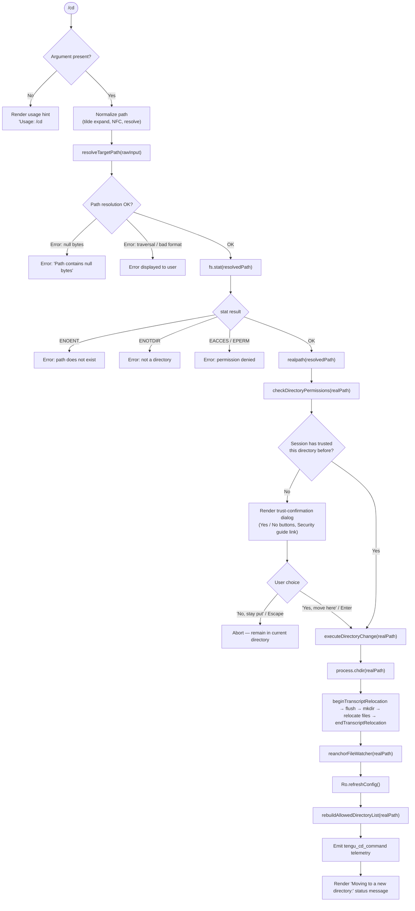

# `/cd`

> Analysis basis: CC v2.1.187 bundle.js (AST extraction + Claude interpretation)
> Minimum version: v2.1.187

---

## Overview

The `/cd` command changes the active working directory for the current Claude Code session. It resolves and validates the target path (including tilde expansion, symlink resolution, and permission checks), optionally presents a trust-confirmation dialog for directories that the session has not visited before, then atomically relocates the session transcript, reloads project configuration, and emits a `tengu_cd_command` telemetry event.

---

## Registration

| Field | Value |
|---|---|
| type | `local-jsx` |
| name | `cd` |
| description | Move this session to a new working directory |
| argumentHint | `<path>` |
| module_id | `hdl` |
| load_inline | `true` |
| loc_byte | `11162958` |
| loc_byte_end | `11163118` |
| loc_line | `7004` |
| arbor_handler.name | `G7p` |
| arbor_handler.fqn | `claude-2.1.187::G7p` |
| arbor_handler.kind | `AsyncFunction` |
| arbor_handler.resolution_path | `module_id` |
| arbor_handler.n_hits | `0` |

Analysis basis: CC v2.1.187 bundle.js:+11162958

---

## Input Branching

Five or more distinct branches exist in the handler (no argument supplied → usage hint; path resolution fails → error; filesystem stat fails → classified error; directory not yet trusted → trust dialog; directory trusted → proceed), so a Mermaid flowchart is used.



---

## Behavioral Spec

### 1 — Path resolution (`resolveTargetPath` / `hs`)

```
function resolveTargetPath(rawInput):
    if rawInput contains null bytes:
        raise Error("Path contains null bytes")

    trimmed = rawInput.trim()
    normalized = unicodeNormalize(trimmed, "NFC")   // TH helper

    if platform is "windows":
        if normalized matches windows-specific pattern:
            // special handling branch
            pass

    if normalized starts with "~/":
        homeDir = os.homedir()
        normalized = path.join(homeDir, normalized.slice(2))
    elif not path.isAbsolute(normalized):
        normalized = path.resolve(currentWorkingDir, normalized)

    return normalized
```

Analysis basis: CC v2.1.187 bundle.js:+1095068 (null-byte check), +1095171 (homedir expansion), +1095331 (isAbsolute), +1095385 (resolve)

The literal `"Path contains null bytes"` is emitted when the raw argument contains a null character (bundle.js:+1095074). Unicode normalization uses form `"NFC"` (bundle.js:+66175). Tilde expansion uses the prefix `"~/"` (bundle.js:+1095202). Platform detection compares against the string `"windows"` (bundle.js:+1095271).

---

### 2 — Filesystem validation (`G7p` main handler)

```
async function handleCdCommand(args):
    if args is empty:
        displayUsage("Usage: /cd <path>")   // literal at +11161481
        return

    resolvedPath = resolveTargetPath(args)

    try:
        stat = await fs.stat(resolvedPath)
    except error:
        code = error.code
        if code in ["ENOENT", "ENOTDIR", "EACCES", "EPERM"]:
            displayError(friendlyMessage(code))
        else:
            displayError(error)
        return

    realPath = await fs.realpath(resolvedPath)
    dirName  = path.dirname(resolvedPath)    // used for display formatting
```

Analysis basis: CC v2.1.187 bundle.js:+11161461 (JSX render call), +11161572 (stat call), +11161664 (dirname), +11161952 (realpath)

Error codes handled explicitly: `ENOENT` (+11161766), `ENOTDIR` (+11161780), `EACCES` (+11161795), `EPERM` (+11161809).

---

### 3 — Trust-confirmation dialog (`mdl` JSX component)

When the resolved real path has not been recorded in the session's trusted-directory set, the handler renders an interactive JSX dialog before proceeding.

```
function renderTrustDialog(targetPath, onConfirm, onCancel):
    display:
        warningBadge("warning")
        heading("Moving to a new directory: " + targetPath)
        body:
            "This session hasn't worked here before. Is this a directory you created or one you trust?"
            "Claude Code will be able to read, edit, and execute files here."
            link("Security guide", "https://code.claude.com/docs/en/security")
        buttons:
            Button("Yes, move here", keyBinding="enter"/"confirm") → onConfirm()
            Button("No, stay put",   keyBinding="escape"/"cancel") → onCancel()
```

Analysis basis: CC v2.1.187 bundle.js:+11158673 (trust-check heading fragment), +11158815 (capability disclosure), +11159007 (security guide URL), +11159153 ("Yes, move here"), +11159182 ("No, stay put"), +11159383 (enter keybind), +11159427 (escape keybind), +11159563 ("Moving to a new directory:")

The component uses a React memo cache of size 12 (bundle.js:+11158476). The `Symbol.for("react.memo_cache_sentinel")` sentinel is used internally (bundle.js:+11158610).

---

### 4 — Directory-change execution (`$7p`)

```
async function executeDirectoryChange(realPath):
    process.chdir(realPath)                    // POSIX chdir syscall
    setShellCwd(realPath)                      // DH → tengu_shell_set_cwd event
    emitCwdChange(realPath)                    // qR → Fsr.emit
    await relocateTranscript(realPath)         // Pbo: beginTranscriptRelocation …
                                               //      flush, mkdir(mode=448), move files,
                                               //      endTranscriptRelocation
    reanchorFileWatcher(realPath)              // BK → hoe.reanchor
    discardStaleContextMessage()               // _E
    await Ro.refreshConfig()                   // reload project/global config
    rebuildAllowedDirectoryList(realPath)      // F7p: walk ancestors, collect CLAUDE.md files
    emitTelemetry("tengu_cd_command")
    renderDirectionConfirmationMessage()       // B7p: bold path display
```

Analysis basis: CC v2.1.187 bundle.js:+11160034 (process.chdir), +11160051 (setShellCwd/DH), +11160057 (qR/emitCwd), +11160085 (Pbo transcript relocation), +11160329 (G1i rebuild), +11160339 (BK reanchor), +11160363 (_E stale context discard), +11160390 (Ro.refreshConfig), +11160411 (tengu_cd_command telemetry), +11160446 (F7p allowed-directory rebuild)

The transcript directory is created with mode `448` (octal 0o700) (bundle.js:+13241833). The string `"cd"` is used as the subdirectory key during transcript relocation (bundle.js:+13241672).

---

### 5 — Allowed-directory list rebuild (`F7p` / `NOt`)

```
function rebuildAllowedDirectoryList(newCwd):
    ancestors = collectAncestorPaths(newCwd)   // walk parent dirs via iWt.parse / iWt.dirname
    ancestors.reverse()
    for each ancestor in ancestors:
        scanForClaudeRulesFiles(ancestor)       // NOt: looks for CLAUDE.md, CLAUDE.local.md
    collectGlobalRulesFiles()                  // OOt
```

Analysis basis: CC v2.1.187 bundle.js:+11159827 (BT set), +11159873 (iWt.parse), +11159903 (iWt.dirname), +11159940 (reverse), +11159968 (NOt call), +11159987 (OOt call)

The scanner looks for `"CLAUDE.md"` (bundle.js:+5084190), `"CLAUDE.local.md"` (bundle.js:+5084358), and files inside `".claude"` directories (bundle.js:+5084257).

---

### 6 — Stale-context injection (`B7p` / display)

After a successful move, the handler appends a system-role message to the conversation informing the model that any file references from the previous directory are stale.

```
function appendStaleContextWarning():
    // System message role: "system" (+11162299)
    // Contains fragment: "previous directory — that information is stale. All tool calls and "
    //   (+11160605)
    appendSystemMessage(buildStaleContextText(previousCwd, newCwd))
```

Analysis basis: CC v2.1.187 bundle.js:+11162161 (B7p call), +11160605 (stale-context literal fragment), +11162299 (role literal "system")

---

## State & Side Effects

| Item | Detail |
|---|---|
| Telemetry: `tengu_cd_command` | Emitted once per successful directory change (bundle.js:+11160411) |
| Telemetry: `tengu_shell_set_cwd` | Emitted when the shell CWD is updated via `DH` (bundle.js:+7065491) |
| Telemetry: `tengu_disable_bypass_permissions_mode` | Emitted if bypass-permissions mode is active and is disabled upon move (bundle.js:+3395452) |
| Telemetry: `tengu_config_lock_contention` | May fire during config reload if another instance holds the lock (bundle.js:+13750291) |
| Telemetry: `tengu_config_stale_write` | May fire during config save if a stale write is detected (bundle.js:+13750427) |
| Telemetry: `tengu_config_auth_loss_prevented` | Fires if auth data would be lost during config write (bundle.js:+13750770) |
| Telemetry: `tengu_config_fallback_write` | Fires if the normal config write path fails and a fallback is used (bundle.js:+13749907) |
| `process.chdir` | Changes the Node.js process CWD to `realPath` (bundle.js:+11160034) |
| File-watcher reanchor | `hoe.reanchor` is called to track the new directory (bundle.js:+1151577) |
| Transcript relocation | Async: `beginTranscriptRelocation` → flush → `gl.mkdir` (mode 448) → move/copy files → `endTranscriptRelocation` (bundle.js:+13241747–13242065) |
| `Ro.refreshConfig` | Project and global configuration is reloaded after the move (bundle.js:+11160390) |
| Allowed-directory rebuild | `F7p` reconstructs the allowed-directory set from ancestor CLAUDE.md files (bundle.js:+11160446) |
| System message injection | A "stale context" system message is appended to the conversation history (bundle.js:+11162161) |
| Config-lock timeout | Lock acquisition warning triggers at 60 000 ms (bundle.js:+13750972) |
| Sound | None detected in depth-2 traversal |

---

## Version History

| Version | Change |
|---|---|
| v2.1.187 | Initial analysis |

---

## Common Mistakes

1. **Passing a relative path that escapes the project root** — the path is resolved relative to the current working directory, not the project root. Use an absolute path or `~/` prefix to be unambiguous.
2. **Omitting the argument entirely** — `/cd` with no argument displays a usage hint (`Usage: /cd <path>`) and does nothing; the session remains in the current directory.
3. **Targeting a file instead of a directory** — the command calls `fs.stat` and will return an `ENOTDIR` error if the resolved path points to a regular file.
4. **Expecting immediate config availability** — config reload (`Ro.refreshConfig`) happens asynchronously after the chdir; a rapid follow-up command may still see the old config briefly.
5. **Dismissing the trust dialog** — pressing Escape or clicking "No, stay put" silently aborts the move. The session remains in its current directory without any error message, which can be confusing if the keypress was accidental.
6. **Assuming previous-directory tool results remain valid** — a system message is injected into the conversation marking prior file references as stale; the model is instructed to ignore them, which may affect ongoing agentic tasks.

---

## Appendix — Identifier Mapping

> For bundle debugging only. Identifiers change across versions.

| Identifier | Role |
|---|---|
| `G7p` | Main async handler for `/cd` (arbor_handler) |
| `hs` | Path resolution and validation helper (null-byte check, tilde expand, normalize, resolve) |
| `Pt` | CWD store getter (reads from async-local storage via `xrn`) |
| `xrn` | Async-local-storage store accessor |
| `QV` | CWD value extractor from store |
| `gr` | General-purpose getter / state reader |
| `VL` | Low-level value lookup helper |
| `Wt` | Logging / warning utility |
| `TH` | Unicode NFC normalizer |
| `cn` | Error/cancellation sentinel helper |
| `pdl` | Tool-permission policy decision logic |
| `dk` | Directory-permission checker and traversal resolver |
| `Acr` | Symlink-aware path accumulator |
| `Nd` | Real-path resolver with lstat |
| `Pre` | Recursive symlink resolution helper |
| `JNl` | Directory cache / visited-set tracker |
| `oWt` | Path prefix stripper |
| `N7p` | Tool-path allowance matcher |
| `rWt` | Glob/pattern path matcher |
| `Wvf` | Settings-aware path policy evaluator |
| `wWe` | CWD-based allowance checker |
| `U7p` | Tool-call policy resolver |
| `Nq` | Deny-rule evaluator |
| `MPo` | Rule push / deny accumulator |
| `Xm` | Rule text formatter |
| `dye` | Allow-rule evaluator |
| `iGe` | Shell-command injection detector |
| `W4t` | Shell injection pattern loader |
| `V4t` | Shell injection string scanner |
| `Dho` | Injection risk reporter |
| `Or` | App-state reader / `getAppState` wrapper |
| `G8n` | Working-directory state extractor |
| `W8n` | Tool-list state extractor |
| `N2` | Session-option builder |
| `it` | Conversation context manager |
| `Dt` | Telemetry event dispatcher |
| `B7p` | Post-move display renderer (bold path + stale-context message) |
| `qp` | Path display formatter |
| `glu` | Backslash escape replacer for display |
| `qxe` | Permission-denied display helper |
| `Zis` | Permission-error message formatter |
| `$7p` | Core directory-change executor (chdir, transcript relocation, config reload) |
| `DH` | Shell CWD setter; emits `tengu_shell_set_cwd` |
| `kn` | Error classification utility |
| `w_r` | CWD write helper (store update + normalize) |
| `Ire` | Config path normalizer |
| `W` | Generic async dispatcher / scheduler |
| `qR` | CWD-change event emitter |
| `Jyt` | Path normalizer used in event emission |
| `Pbo` | Transcript relocation orchestrator |
| `kt` | Config value accessor |
| `Rc` | Hook registration helper |
| `Ei` | Event-bus register wrapper |
| `s3` | Transcript storage manager |
| `nt` | String-coercion utility |
| `B3` | Transcript segment builder |
| `eUe` | Transcript flush helper |
| `JA` | Directory-change event publisher |
| `d6o` | Directory-change event definition |
| `u6o` | Event emitter wrapper |
| `C3l` | File-move / rename helper (handles EEXIST, EBUSY, EXDEV, EISDIR) |
| `K3l` | Recursive directory copier |
| `T` | Log / trace utility |
| `Xwc` | Log record formatter |
| `Me` | JSON serializer (JSON.stringify wrapper) |
| `wc` | Log-line redactor |
| `dze` | Log sink dispatcher |
| `eLc` | Log-file writer |
| `ke` | Config save scheduler |
| `fo` | Error-string formatter |
| `Vi` | Config write queue manager |
| `Qru` | Config write-queue rotator |
| `G1i` | CLAUDE.md / rules-file cache invalidator and rebuilder |
| `fy` | Rules-file cache clearer |
| `Di` | Rules-file loader and parser |
| `Jd` | Rules-file error logger |
| `Gt` | JSON parser (JSON.parse wrapper) |
| `kd` | Rules-file writer |
| `Cm` | Atomic file-write helper (random temp + rename) |
| `Df` | Rules-file existence checker |
| `be` | String coercion for error display |
| `BK` | File-watcher reanchor caller |
| `_E` | Stale-context discard handler |
| `F7p` | Allowed-directory list rebuilder (walks ancestors for CLAUDE.md) |
| `dT` | Path separator normalizer for allowed-dir matching |
| `NOt` | CLAUDE.md scanner (per-directory) |
| `kh` | External config reader |
| `k4` | Directory-entry classifier |
| `ywe` | Recursive directory walker |
| `MOt` | Gitignore-aware directory filter |
| `OOt` | Global rules-file collector |
| `gVn` | HTML-entity encoder for display output |
| `Bv` | Post-move UI state updater |
| `Lmt` | Path normalization utility for context messages |
| `UK` | Platform-aware path normalizer (normalize + replaceAll) |
| `aWt` | Context-message path resolver |
| `hn` | Global config save orchestrator |
| `GQn` | Config-file write-with-lock implementation |
| `_Ws` | Config object merger (Object.assign wrapper) |
| `_Ee` | Config-file reader with backup support |
| `MHt` | Config migration helper |
| `NOo` | Config backup directory manager |
| `oIt` | Atomic file-write-and-flush implementation |
| `ADe` | Config schema adapter |
| `DOo` | Config entries iterator |
| `MKt` | Config timestamp tracker |
| `BQn` | Global config save helper |
| `Pe` | Promise-error handler |
| `mdl` | JSX component for trust-confirmation dialog |
| `ext` | File extension extractor |
| `txt` | Plain-text token type |
| `V9` | Token value builder |
| `hSn` | Token deduplication cache |
| `Rc` | React hook registration helper |
| `$3l` | Transcript segment ID generator |
| `JNl` | Directory-visit cache with timestamp |