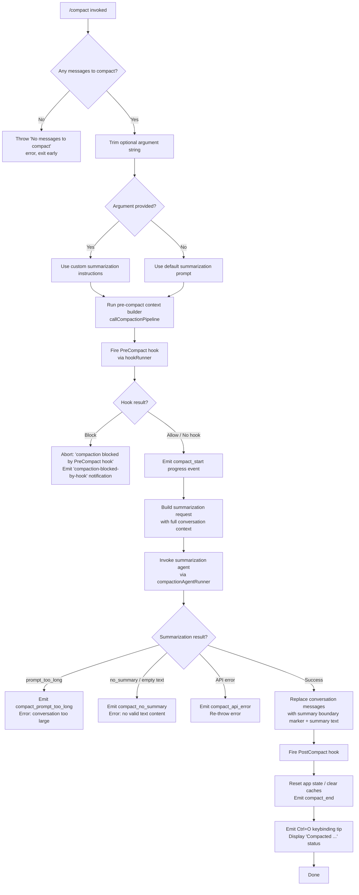

# `/compact`

> Analysis basis: CC v2.1.187 bundle.js (AST extraction + Claude interpretation)
> Minimum version: v2.1.187

---

## Overview

`/compact` frees up context window space by summarizing the conversation history accumulated so far, replacing the prior message history with a compact summary. It accepts an optional custom summarization instruction string that guides how the summary is generated. The command supports both interactive (REPL) and non-interactive execution paths, and integrates with the PreCompact and PostCompact hook lifecycle.

---

## Registration

| Field | Value |
|---|---|
| type | `local` |
| name | `compact` |
| description | `Free up context by summarizing the conversation so far` |
| argumentHint | `<optional custom summarization instructions>` |
| supportsNonInteractive | `true` |
| thinClientDispatch | `post-text` |
| module_id | `wpl` |
| load_inline | `true` |
| loc_byte | `11211237` |
| loc_byte_end | `11211537` |
| loc_line | `7094` |
| arbor_handler.name | `MYp` |
| arbor_handler.fqn | `claude-2.1.187::MYp` |
| arbor_handler.kind | `AsyncFunction` |
| arbor_handler.resolution_path | `module_id` |
| arbor_handler.n_hits | `0` |

Analysis basis: CC v2.1.187 bundle.js:+11211237

---

## Input Branching

The command has 4+ distinct branches depending on message availability, argument content, hook decisions, and error conditions.



---

## Behavioral Spec

### Top-Level Handler (`MYp`)

```
async function compactCommandHandler(context, argument):
    // Guard: must have messages to compact
    if context.messages is empty:
        throw Error("No messages to compact")
    
    customInstructions = argument.trim()  // may be empty string
    
    // Build pre-compact state snapshot
    preCompactState = await buildPreCompactContext(context)   // vpl
    
    // Run the main compaction pipeline
    result = await runCompactionPipeline(context, customInstructions, preCompactState)  // DYp
    
    // Update app state with compacted conversation
    await updateAppStatePostCompact(context, result)          // vpl (second call)
    
    // Emit user-visible notification
    emitCompactNotification(result)                           // OSo / Cpl
    
    if result.canceled:
        output("Compaction canceled.")
        return
    
    return result
```

Analysis basis: CC v2.1.187 bundle.js:+11210238

---

### Pre-Compact Context Builder (`vpl`)

```
async function buildPreCompactContext(context):
    appState = context.getAppState()
    
    // Collect last assistant message for summary reference point
    lastAssistantMsg = findLastAssistantMessage(appState)     // Or
    
    // Collect session state snapshot
    sessionInfo = buildSessionInfo(appState)                  // U5
    
    // Await parallel context tasks
    [contextA, contextB] = await Promise.all([
        buildContextM_(appState),
        buildContextAA(appState)
    ])
    
    return { appState, lastAssistantMsg, sessionInfo, ... }
```

Analysis basis: CC v2.1.187 bundle.js:+11209725

---

### Compaction Pipeline (`DYp`)

```
async function runCompactionPipeline(context, customInstructions, preCompactState):
    startTime = performance.now()
    
    // Build system prompt and context for compaction agent
    [systemPromptResult, ...otherContext] = await Promise.all([
        buildCompactionSystemPrompt(context),    // GT -> cKp
        buildConversationPayload(context),        // WY
        buildSDKStatusContext(context),           // vpl
        buildEnvironmentContext(context),         // z8n
        buildMiscContext(context)                 // MSo
    ])
    
    // Fire PreCompact hook; may block compaction
    preCompactHookResult = await runPreCompactHook(context)   // PYp
    if preCompactHookResult.blocked:
        emitNotification("compaction-blocked-by-hook", "warning")
        return { blocked: true }
    
    // Emit progress: compact_start
    emitProgress("compact_start")
    
    // Invoke compaction agent
    compactionResult = await runCompactionAgent(context, {    // QWn
        customInstructions,
        systemPrompt: systemPromptResult,
        messages: conversationMessages,
        startTime
    })
    
    // Handle post-compaction cleanup
    await runPostCompactCleanup(context, compactionResult)    // xEo
    
    // Optionally apply reactive compact logic
    reactiveResult = await runReactiveCompact(context)        // xEo internal
    
    // Emit compact_end
    emitProgress("compact_end")
    
    return compactionResult
```

Analysis basis: CC v2.1.187 bundle.js:+11206327

---

### PreCompact Hook Runner (`PYp`)

```
async function runPreCompactHook(context):
    startTime = performance.now()
    
    // Retrieve pending precomputed compact if available
    precomputed = getPrecomputedCompact(context)              // IEo
    if precomputed available and valid:
        telemetry("tengu_precomputed_compact_consumed")
        return { applied: precomputed }
    
    if precomputed exists but stale/invalid:
        telemetry("tengu_precomputed_compact_discarded")
    
    // Build compaction agent invocation parameters
    agentParams = buildCompactionAgentParams(context)         // Gft
    
    // Run the compaction sub-agent
    subAgentResult = await runCompactionSubAgent(agentParams) // jWn
    
    if subAgentResult.aborted:
        return { aborted: true }
    
    if subAgentResult.boundaryUUIDMissing:
        telemetry("boundary_uuid_missing")
    
    if subAgentResult.hit:
        telemetry("hit")
    
    return subAgentResult
```

Analysis basis: CC v2.1.187 bundle.js:+11208537

---

### Compaction Agent Invocation (`QWn`)

```
async function runCompactionAgent(context, params):
    { customInstructions, systemPrompt, messages, startTime } = params
    
    // Normalize messages for compaction
    normalizedMessages = normalizeMessagesForCompaction(messages)   // a$e / Sb
    
    // Snapshot tool/config state
    toolSnapshot = captureToolSnapshot(context)                      // xOt
    
    // Save conversation state before compacting
    await saveConversationSnapshot(context)                          // u1t / s7
    
    // Fire the compaction API request
    apiResult = await invokeCompactionAPI(context, {
        systemPrompt,
        messages: normalizedMessages,
        customInstructions,
        toolState: toolSnapshot
    })                                                               // E8p / H8
    
    if apiResult.error == "prompt_too_long":
        telemetry("tengu_compact_ptl_retry")
        return { status: "compact_prompt_too_long" }
    
    if not apiResult.summaryText:
        return { status: "compact_no_summary",
                 error: "Failed to generate conversation summary - response did not contain valid text content" }
    
    // Construct compact boundary marker
    boundaryMarker = buildCompactBoundary(apiResult)                // W6t
    
    // Apply the summary to message history
    compactedMessages = applyCompactionToHistory(context, {
        summary: apiResult.summaryText,
        boundary: boundaryMarker,
        originalMessages: messages
    })                                                              // _xe / xL
    
    // Track timing metrics
    elapsed = Math.round(performance.now() - startTime)
    
    // Emit telemetry
    telemetry("tengu_compact")
    
    return { status: "success", compactedMessages, summary: apiResult.summaryText, elapsed }
```

Analysis basis: CC v2.1.187 bundle.js:+10622119

---

### Message History Replacement (`_xe`)

```
function applyCompactionToHistory(context, { summary, boundary, originalMessages }):
    // Use message construction pipeline
    preCompactMessages = buildPreCompactMessages(context)    // od
    
    // Splice in the compacted summary message
    summaryMessage = buildSummaryMessage(summary, boundary)  // xL
    
    resultMessages = [
        ...preCompactMessages,
        summaryMessage
    ]
    
    return resultMessages
```

Analysis basis: CC v2.1.187 bundle.js:+13354192

---

### Compaction Boundary Marker (`MH` / `pVn`)

```
function buildCompactBoundaryMessage(uuid):
    // Inserts a special system-role "compact_boundary" message
    // used to demarcate where history was replaced
    return {
        role: "system",                    // literal "system" at +13692077
        type: "compact_boundary",          // literal at +13692099
        index: 1,                          // +13692153
        offset: 0                          // +13692158
    }
```

Analysis basis: CC v2.1.187 bundle.js:+13692077

---

### Post-Compact State Reset (`Yte`)

```
async function runPostCompactCleanup(context, result):
    // Reset conversation window state references
    clearConversationCaches(context)     // YWn -> s6.delete, SEo.delete, B6t.delete, sWe.delete
    
    // Clear autonomous loop delivery state
    resetAutonomousLoop(context)         // y8p.resetAutonomousLoopDelivered
    
    // Clear misc module caches
    clearModuleCaches()                  // qWn, faa, g6a, HRe
    
    // Notify state reset complete
    resetStateValues(context)            // Y_, LEo
    
    // Signal PostCompact hook event
    telemetry("post_compact_cleanup")
```

Analysis basis: CC v2.1.187 bundle.js:+10616887

---

### Reactive Compact Path (`xEo` / `y0n`)

```
async function runReactiveCompact(context):
    // Check if reactive compaction is needed (context approaching limit)
    snapshot = captureContextSnapshot(context)               // Sb
    startTime = performance.now()
    
    if snapshot.groups < 2:
        log("Reactive compact: fewer than 2 groups, nothing to compact")
        telemetry("too_few_groups")
        return
    
    if not snapshot.hasAssistantMessages:
        log("Reactive compact: no assistant messages in summarize set, bailing")
        return
    
    // Attempt summarization, handling media-size errors
    attempt = 0
    while attempt < MAX_ATTEMPTS:
        result = await performReactiveCompaction(context, snapshot)  // YNd
        
        if result.ok:
            telemetry("tengu_reactive_compact_succeeded")
            return result
        
        if result.error == "media_too_large":
            log("Reactive compact: summarize hit media-size error, retrying stripped")
            snapshot = stripMediaFromSnapshot(snapshot)
            if not stripped:
                telemetry("media_unstrippable")
                break
            attempt++
            continue
        
        if result.error == "prompt_too_long":
            telemetry("compact_prompt_too_long")
            break
        
        telemetry("tengu_reactive_compact_failed")
        break
    
    return { status: "failed" }
```

Analysis basis: CC v2.1.187 bundle.js:+10620573

---

### Compaction Agent Tool Use Guard (`E0n`)

```
function checkToolUseAllowedDuringCompaction(toolUse, context):
    // Tool use is blocked while the compaction agent is running
    if context.isCompacting:
        return {
            decision: "deny",
            reason: "Tool use is not allowed during compaction"    // +10804753
        }
    
    // Non-text responses from compaction agent are rejected
    if context.isCompactionAgent and toolUse.type != "text":
        return {
            decision: "other",
            reason: "compaction agent should only produce text summary"  // +10804833
        }
    
    return { decision: "allow" }
```

Analysis basis: CC v2.1.187 bundle.js:+10804635

---

### Notification / Status Display (`Cpl`)

```
function emitCompactionCompleteNotification(context, result):
    // Register Ctrl+O keybinding tip for transcript toggle
    registerKeybinding("app:toggleTranscript", "Global", "ctrl+o")   // KI
    
    // Emit dim status line: "Compacted <summary excerpt>..."
    statusText = "Compacted " + truncate(result.summaryExcerpt)       // +11209669
    emitDimStatusLine(statusText)
    
    // Join all output lines for display
    output = lines.join("\n")
    return output
```

Analysis basis: CC v2.1.187 bundle.js:+11209514

---

## State & Side Effects

| Item | Detail |
|---|---|
| Telemetry | `tengu_compact` (+10797067), `tengu_compact_failed` (+10808972), `tengu_compact_ptl_retry` (+10795128), `tengu_compact_cache_prefix` (+10794652), `tengu_compact_cache_sharing_success` (+10805697), `tengu_compact_cache_sharing_fallback` (+10806327), `tengu_reactive_compact_succeeded` (+10623390), `tengu_reactive_compact_attempt` (+5263569), `tengu_reactive_compact_failed` (+10620921), `tengu_precomputed_compact_consumed` (+10615485), `tengu_precomputed_compact_discarded` (+10616124), `tengu_post_compact_file_restore_success` (+10810225), `tengu_post_compact_file_restore_error` (+10810267), `tengu_compact_credits_clamp_rescue` (+5263412), `tengu_model_fallback_triggered` (+10809312) |
| Hook registration | Fires `PreCompact` hook before compaction begins; fires `PostCompact` hook after completion. Compaction is abortable via `PreCompact` hook returning a block decision. |
| appState changes | Post-compaction: clears conversation caches (`s6`, `SEo`, `B6t`, `sWe`), resets autonomous loop delivered state, clears misc module caches, calls `e.setAppState` to persist compacted message list |
| Message history | Replaces full prior conversation with a `compact_boundary` marker message (role=`system`, type=`compact_boundary`) followed by the generated summary text |
| Keybinding | Registers `app:toggleTranscript` → `Ctrl+O` (Global scope) after compaction completes |
| Sound | <!-- TODO: not found in depth-2 traversal; needs --depth 4 --> |
| Progress events emitted | `compact_progress`, `compact_start`, `compact_end`, `hooks_start`, `pre_compact`, `sdk_status`, `compacting`, `stream_mode`, `response_length`, `reset`, `compact_start`, `compact_end` (literals at +11206190 – +11208156) |
| Error literals | `"No messages to compact"` (+11210269), `"Compaction failed · conversation could not be reduced below the context limit"` (+11207281), `"Compaction failed · attached media exceeds size limits"` (+11207403), `"Compaction canceled."` (+11210810), `"compaction blocked by PreCompact hook"` (+10793059) |
| Tool use during compact | Blocked — any tool use request returns `deny` with reason `"Tool use is not allowed during compaction"` (+10804753) |

---

## Version History

| Version | Change |
|---|---|
| v2.1.187 | Initial analysis |

---

## Common Mistakes

1. **Invoking `/compact` on an empty conversation.** The handler immediately throws `"No messages to compact"` if no messages exist. Analysis basis: CC v2.1.187 bundle.js:+11210269
2. **Expecting tool use to work during compaction.** Tool use is actively denied with `"Tool use is not allowed during compaction"` while the compaction agent is running. Analysis basis: CC v2.1.187 bundle.js:+10804753
3. **Assuming PreCompact hooks are purely observational.** A `PreCompact` hook that returns a block decision will silently abort the compaction and emit a `"compaction-blocked-by-hook"` notification rather than displaying an error. Analysis basis: CC v2.1.187 bundle.js:+10793059
4. **Passing multi-line custom instructions expecting full control.** The argument is trimmed (`e.trim`) before use. Very long or structured instructions may be truncated or ignored depending on token budget. Analysis basis: CC v2.1.187 bundle.js:+11210301
5. **Assuming compaction always reduces context.** If the conversation cannot be compacted below the current context limit, the command returns the error `"Compaction failed · conversation could not be reduced below the context limit"` rather than silently succeeding. Analysis basis: CC v2.1.187 bundle.js:+11207281

---

## Appendix — Identifier Mapping

> For bundle debugging only. Identifiers change across versions.

| Identifier | Role |
|---|---|
| `MYp` | Top-level `/compact` command handler (AsyncFunction) |
| `MH` | Build compact boundary message helper |
| `pVn` | Compact boundary message constructor sub-helper |
| `PA` | Low-level message assembly utility |
| `x4` | Conversation message context builder |
| `wr` | Low-level write/emit utility |
| `it` | Message iteration / conversation state utility |
| `V9` | Message type resolver |
| `q9` | Message queue accessor |
| `hSn` | Hook/session state lookup helper |
| `lBr` | Loop broadcast / event emitter helper |
| `mBr` | Message broadcast routing |
| `Dt` | Config/settings read helper |
| `Wt` | Config validation utility |
| `MOo` | Config module-object accessor |
| `_Ee` | Config file I/O (readFileSync, mkdirSync, copyFileSync) |
| `MRf` | Config file watcher/unwatcher |
| `DYp` | Main compaction pipeline orchestrator |
| `GT` | System prompt builder for compaction agent |
| `cKp` | Compaction agent prompt assembly |
| `iwe` | Agent prompt formatting sub-helper |
| `sqn` | System prompt segment assembler (large, many call edges) |
| `WY` | Conversation payload builder |
| `od` | Pre-compact message list builder |
| `kt` | Message content type helper |
| `YP` | Message content type helper (variant) |
| `FI` | Model capability / effort filter |
| `sD` | Session data accessor |
| `EL` | Environment/language model context builder |
| `Pt` | Path / working-directory resolver |
| `xL` | Hook runner (full hook pipeline) |
| `F2` | Policy settings extractor |
| `T` | Message text formatter / truncator |
| `fEe` | Hook type classifier |
| `KDo` | Hook definition loader / filter |
| `VDo` | Hook definition filter sub-utility |
| `zn` | JSON/string normalizer |
| `W` | Warning/log emitter |
| `Me` | JSON serializer (JSON.stringify wrapper) |
| `ke` | Error logger (jJ.logError wrapper) |
| `Re` | Result wrapper utility |
| `f1e` | Feature flag result helper |
| `zx` | AbortController timeout wrapper |
| `Que` | Queue event emitter |
| `LP` | Log-progress emitter |
| `tQn` | Hook turn state tracker |
| `BDo` | MCP tool hook dispatcher |
| `oQn` | Hook JSON output parser |
| `Yce` | Hook environment entries builder |
| `$Do` | HTTP hook dispatcher (BS.post) |
| `H4l` | HTTP hook response parser |
| `Vye` | Hook validation utility |
| `sQn` | Spawn hook executor (shell process) |
| `H9e` | Hook result accumulator |
| `Le` | Log/emit helper |
| `tB` | Telemetry batch emitter |
| `a9e` | MCP server connection manager |
| `brr` | MCP connection result applier |
| `hla` | MCP tool registry lookup |
| `uBo` | MCP server update orchestrator |
| `vpl` | Pre/post compact state context builder |
| `uR` | Full system-prompt assembler (large) |
| `cPo` | App-state context entry |
| `Eo` | Model capability checker (includes check) |
| `wqn` | Working-directory context builder |
| `Ur` | User context / permission builder |
| `RIe` | Remote context fetcher |
| `Nwf` | Output style system prompt injector |
| `Uwf` | Hard-to-reverse action notice injector |
| `Fwf` | Code style match notice injector |
| `x_n` | Fable model prefix checker |
| `XG` | Non-linear context builder |
| `YEi` | Extended tool context injector |
| `WQ` | Work-queue context state |
| `fPo` | Brief-mode context injector |
| `gLf` | Brief-mode gating wrapper |
| `mq` | Model-quality context lookup |
| `Zwf` | Session-specific guidance injector |
| `Lxt` | Memory/CLAUDE.md loader |
| `lLf` | Language setting context injector |
| `aLf` | Environment-info assembler |
| `Vwf` | Verbose context injector |
| `Kwf` | Context efficiency setting injector |
| `uLf` | Background-session context builder |
| `g4n` | Scratchpad context builder |
| `pLf` | Brief-mode enabled checker |
| `hLf` | Flag settings injector |
| `nLf` | Non-linear/next-turn context builder |
| `Wwf` | Worktree context injector |
| `qwf` | Work-queue context injector |
| `uXa` | Cached context compute helper |
| `tLf` | Task-continuity context injector |
| `zwf` | Zero-context placeholder |
| `jwf` | Growthbook experiment context injector |
| `Ywf` | Verified-vs-assumed context tracker |
| `Xwf` | Brief-mode secondary injector |
| `Jwf` | Session control-key context |
| `eLf` | Extended language context injector |
| `PAi` | Permission audit context builder |
| `xIe` | AWS Bedrock context injector |
| `B4l` | System prompt segment finalizer |
| `Or` | Last-assistant-message finder |
| `G8n` | Os-info resolver (variant A) |
| `W8n` | Os-info resolver (variant B) |
| `N2` | Message normalizer |
| `U5` | Session info/system prompt builder |
| `Cc` | Session connector |
| `_v` | Notification emitter |
| `oo` | App bootstrap / process entry |
| `Pe` | Log/print helper |
| `Ve` | Verbose log/print helper |
| `z8n` | Environment text formatter |
| `MSo` | Misc context builder |
| `PYp` | PreCompact hook executor |
| `IEo` | Precomputed compact cache lookup |
| `G6t` | Precomputed compact cache key |
| `Gft` | Compaction sub-agent parameter builder |
| `KWn` | Compaction agent entry: sets up main/precompute |
| `Jg` | Timing / elapsed-ms formatter |
| `Fo` | Output formatter |
| `vEo` | Compacted message slicer |
| `jWn` | Compaction sub-agent invocation wrapper |
| `QWn` | Compaction agent full pipeline |
| `a$e` | Agent type classifier |
| `rD` | Agent type start-prefix checker |
| `Sb` | Context snapshot builder for compaction |
| `a5i` | Compaction capability checker |
| `aee` | Attachment/media normalizer |
| `xOt` | Object-from-entries helper |
| `WBe` | Conversation-save state writer |
| `s7` | Conversation state persistence helper |
| `u1t` | Conversation state persistence driver |
| `s0n` | State save prefix checker |
| `jBe` | State file writer (mkdir + writeFile) |
| `CKe` | Conversation token counter |
| `qft` | Config read helper (Rc) |
| `Rc` | Config/Ei reader |
| `W6t` | UUID generator for compact boundary |
| `BY` | Token/type array filter |
| `eKp` | Array-isArray type checker |
| `ZVp` | Compaction-enabled checker |
| `E8p` | Compaction API request orchestrator |
| `e8n` | File-attachment restore helper |
| `o8n` | App-state local-agent context builder |
| `t8n` | Plan-mode message builder |
| `r8n` | Plan-file message builder |
| `n8n` | Context-window message builder |
| `L_e` | Context strategy selector |
| `Hxe` | Tool/permission set builder for compaction |
| `iWe` | Incremental tool state builder |
| `ti` | Message ID / timestamp assigner |
| `H8` | Hook plugin loader |
| `_xe` | Summary + boundary splicer into message array |
| `MEo` | Message list normalizer post-compact |
| `_We` | Conversation filter utility |
| `ZLn` | Token-count rounding utility |
| `QLn` | Full token count accumulator |
| `Kw` | System prompt token count + cache-prefix builder |
| `ff` | Math.round wrapper |
| `z1d` | Per-message token stats tracker |
| `Bk` | FI+sD combo caller |
| `Vh` | App-state working-directory getter |
| `xEo` | Reactive compact orchestrator |
| `y0n` | Reactive compact core logic |
| `_1t` | Reactive compact initializer |
| `pWi` | Math.max/floor utility |
| `YNd` | Reactive compact summarization attempt |
| `XNd` | Reactive compact pWi caller |
| `qOt` | Compact abort handler |
| `GOt` | Compact abort sub-handler |
| `P4` | PII / path scrubber for telemetry |
| `qNd` | URL redactor |
| `NNd` | Phone number redactor |
| `FNd` | API error body redactor |
| `MNd` | IP address redactor |
| `LNd` | Email address redactor |
| `vNd` | Home directory path redactor |
| `BNd` | Single-quote path redactor |
| `$Nd` | MCP server name redactor |
| `WNd` | API error body (variant) redactor |
| `o5i` | Compact reactive aborted telemetry emitter |
| `Mt` | Success/failure result wrapper |
| `be` | String coercion utility |
| `Yte` | Full post-compact state reset |
| `YWn` | Conversation cache clearer |
| `DOt` | View state clearer |
| `Vw` | View state sub-clearer |
| `OEt` | OEt state cleaner |
| `FEt` | Feature flag reset |
| `VL` | Feature flag registry |
| `bre` | Feature-flag object builder |
| `qWn` | xol cache clearer |
| `faa` | oUt/NJr cache clearer |
| `g6a` | g6a cache clearer |
| `HRe` | HRe cache clearer |
| `Y_` | Output tokens resetter |
| `LEo` | Post-compact LEo finalizer |
| `qBe` | App state setState caller |
| `Cpl` | Compaction-complete notification builder |
| `T6e` | Model display-name builder |
| `ykp` | Model list accessor |
| `KI` | Keybinding registrar |
| `XTn` | Keybinding handler installer |
| `JTn` | Keybinding action lookup |
| `wve` | OTEL metrics context builder |
| `Su` | OTEL resource attribute assembler |
| `G2e` | OTEL attribute key mapper |
| `Vpt` | Full compaction run (alternative/parent entry) |
| `uUt` | OTEL trace span builder |
| `Bae` | OTEL backend initializer |
| `WD` | OTEL writer |
| `cF` | Active trace checker |
| `Tot` | Conversation snapshot helper |
| `_0n` | String trim helper |
| `On` | Sub-agent conversation starter |
| `_` | Sub-agent orchestration loop |
| `eyt` | Sub-agent iteration step |
| `fo` | Error string helper |
| `y` | Sub-session manager |
| `U5e` | Teammate mailbox accessor |
| `ial` | Full REPL turn handler (long) |
| `JZa` | Interval-based turn monitor |
| `s6t` | w_o map accessor |
| `XZa` | Periodic turn state checker |
| `nt` | String coercion (String wrapper) |
| `C0` | Turn clock / event loop |
| `f4n` | Main turn state transition handler |
| `m4n` | Turn secondary handler |
| `DM` | Random-bytes ID generator |
| `Ace` | Turn post-compact file restore caller |
| `j5` | j5 session state handler |
| `lk` | lk state accessor |
| `c6e` | a0p map checker |
| `Zte` | Zte state cleaner |
| `q8n` | q8n state helper |
| `SBa` | c6e-driven SBa helper |
| `cce` | Compaction-compatible message filter |
| `AVp` | Turn output formatter (long) |
| `Ajr` | Turn Ajr brancher |
| `E0n` | Tool-use-during-compact guard |
| `xTe` | xTe state sub-helper |
| `uge` | Context token limit calculator |
| `kIe` | Model output-token limit lookup |
| `yae` | CLAUDE_CODE_MAX_OUTPUT_TOKENS env parser |
| `Rx` | Last-message finder |
| `H0n` | h0n summary message getter |
| `g0n` | findLast summary message |
| `kVp` | kVp message wrapper |
| `SJ` | SJ output helper |
| `bGt` | Tool-search decision maker |
| `LSe` | Tool-search exclusion checker |
| `qj` | Tool name case-normalizer |
| `rse` | Tool registry accessor |
| `ixe` | Tool-search availability checker |
| `uOt` | Tool-search mode classifier |
| `tKp` | Tool-search result finalizer |
| `Sjr` | Message array normalizer for compaction |
| `vVp` | Array type checker |
| `wVp` | Message filter for compaction |
| `LVp` | Message list mapper for compaction |
| `AGt` | Attachment group tracker |
| `xSo` | Recursive content mapper |
| `tal` | Unicode surrogate checker |
| `mot` | Model context/override setter |
| `yT` | Model capability lookup |
| `h5i` | Model override error handler |
| `zOt` | rzr error wrapper |
| `rGi` | rGi model override router |
| `Rfe` | Input rendering helper |
| `Kg` | Kg display sub-helper |
| `n_` | RTe renderer |
| `XC` | _fn content renderer |
| `tse` | fRr content renderer |
| `dU` | Full content display builder |
| `Ba` | Message display assembler |
| `bJf` | PTY/daemon message protocol handler (very large) |
| `nft` | Non-file-tool context builder |
| `KSo` | Fallback request builder |
| `T5l` | Full REPL turn loop (very large) |
| `H3n` | p0/Eo settings accessor |
| `p0` | Dt config reader |
| `zL` | zL VL flag accessor |
| `L` | Background session lifecycle manager |
| `w` | Background session clock |
| `V` | Background session scheduler |
| `k` | Background session key lookup |
| `DVt` | Memory freemem checker |
| `V2l` | it accessor for V2l |
| `N2e` | File lstat/rm/read utility |
| `F` | clearInterval holder |
| `WXn` | it wrapper for WXn |
| `z` | Keyboard/backspace handler |
| `Zm` | Zm Ng/Ve wrapper |
| `Ng` | rKe-based formatter |
| `Rr` | Ng/Ve output helper |
| `yp` | Content/text post-processor |
| `Mp` | Text replace helper |
| `DNe` | Model name case-normalizer |
| `mfn` | mfn string formatter |
| `kfe` | kfe Dt/isArray helper |
| `Hz` | Model suffix checker (endsWith) |
| `_8` | Array.isArray wrapper |
| `ral` | Message slice/turn counter |
| `Iot` | Message push helper |
| `cot` | hge/n1t content checker |
| `hge` | Array-based media checker |
| `n1t` | Token count match parser |
| `_1` | startsWith checker |
| `Uf` | Prompt ID / env assembler |
| `M$` | VL-based flag accessor |
| `gr` | VL-based flag accessor (variant) |
| `gv` | r9/Za/nt/it output helper |
| `r9` | r9 output sub-helper |
| `Za` | String coercion (String wrapper) |
| `fOt` | fOt state accessor |
| `y1t` | jNd text normalizer |
| `jNd` | Text replace/match/trim chain |
| `e7` | Eae/aee media normalizer |
| `Eae` | Xrt-set media checker |
| `sal` | SJ/be/qT state handler |
| `qT` | wr/jL/pUd queue tracker |
| `jL` | jL queue helper |
| `pUd` | YWi/Pjr queue accessor |
| `lUt` | lUt state finalizer |
| `Y3e` | e.setStatus caller |
| `OSo` | nt-based output emitter |

---

Note: index built via Arbor fallback; some signals (telemetry, literals) may be missing — see arbor-fallback.js.