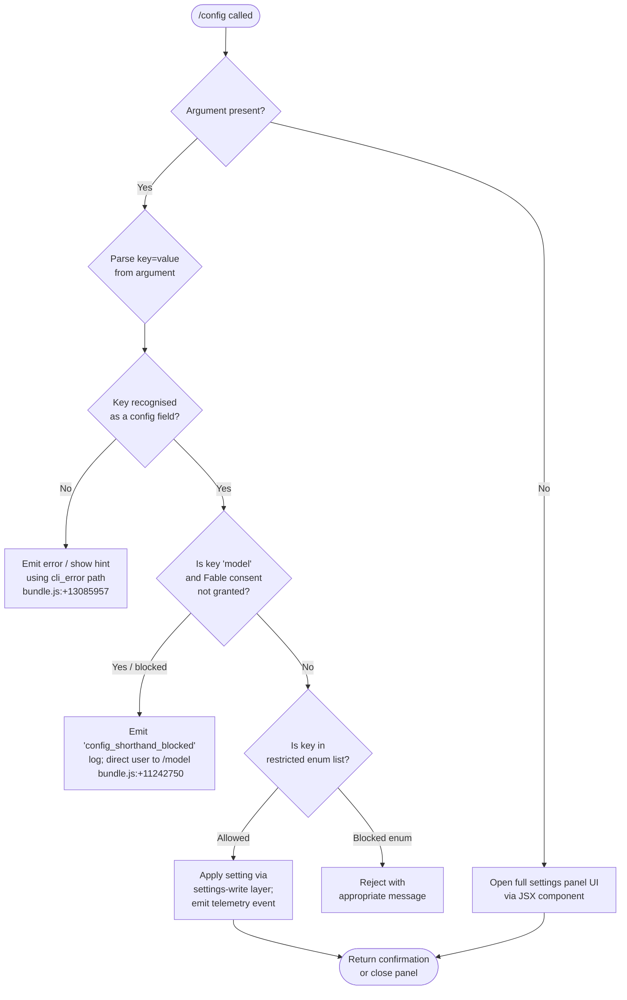

# `/config`

> Analysis basis: CC v2.1.187 bundle.js (AST extraction + Claude interpretation)
> Minimum version: v2.1.187

---

## Overview

The `/config` command (also reachable via `/settings`) opens an interactive settings panel where users can browse and toggle a comprehensive set of Claude Code preferences. When called with a `key=value` shorthand argument, it attempts to apply the named setting directly without opening the full panel UI. The command delegates rendering to a JSX component and persists changes through the global settings layer.

---

## Registration

| Field | Value |
|---|---|
| type | `local-jsx` |
| name | `config` |
| description | `Open settings` |
| argumentHint | `[key=value]` |
| aliases | `settings` |
| module_id | `xhl` |
| load_inline | `true` |
| loc_byte | `11446600` |
| loc_byte_end | `11446878` |
| arbor_handler.name | `EZp` |
| arbor_handler.fqn | `claude-2.1.187::EZp` |
| arbor_handler.kind | `AsyncFunction` |
| arbor_handler.resolution_path | `module_id` |
| arbor_handler.n_hits | `0` |

Analysis basis: CC v2.1.187 bundle.js:+11446600

---

## Input Branching

Four distinct cases arise from the optional argument, so a flowchart is used.



Analysis basis: CC v2.1.187 bundle.js:+11445672 (handler entry), +11445733 (toLower normalisation), +11445752 (key lookup), +11445862 (panel render path), +11445904 (shorthand apply path)

---

## Behavioral Spec

### Handler Entry — `configCommandHandler` (`EZp`)

```
async function configCommandHandler(context, rawArgument):
    argument = rawArgument.toLowerCase().trim()   // +11445733

    if argument is empty or absent:
        render ConfigPanel JSX component          // +11445672
        return

    // Shorthand key=value path
    parsed = parseKeyValue(argument)              // +11445904 → MWt
    if parsed is null:
        reportCliError("invalid syntax")          // +13085957
        exit(1)                                   // +13085983
        return

    applyShorthandSetting(parsed.key, parsed.value)
```

Analysis basis: CC v2.1.187 bundle.js:+11445672

---

### Argument Parser — `parseKeyValue` (`MWt`)

```
function parseKeyValue(input):
    input = input.trim()                          // +11247518
    if not input.includes("="):                   // +11247535
        return { key: input, value: null }

    eqIndex  = input.indexOf("=")                 // +11247625
    key      = input.slice(0, eqIndex)            // +11247642
    valueRaw = input.slice(eqIndex + 1)           // +11247798

    // Handle quoted / bracketed values
    if valueRaw.includes("["):                    // +11247597
        // extract bracketed portion
        ...
    valueParts = valueRaw.split(",")              // +11247569

    return { key: key, values: valueParts }
```

Analysis basis: CC v2.1.187 bundle.js:+11247518

---

### Settings Panel Renderer — `configPanelComponent` (`$mt`)

The panel is a large JSX component that constructs a list of interactive setting rows. Each row is one of several types:

| Row type | Literal key | Display label | Config field |
|---|---|---|---|
| Model picker | `model` | `Model` | `model` |
| Toggle | `verbose` | `Verbose output` | `verbose` |
| Toggle | `autoCompact` | `Auto-compact` | `autoCompactEnabled` |
| Toggle | `tips` | `Show tips` | — |
| Toggle | `reduceMotion` | `Reduce motion` | — |
| Toggle | `thinking` | `Thinking mode` | `thinking_toggle` |
| Toggle | `fast` | `Fast mode` | — |
| Toggle | `promptSuggestionEnabled` | `Prompt suggestions` | — |
| Toggle | `recap` | `Session recap` | — |
| Toggle | `checkpoints` | `Rewind code (checkpoints)` | `fileCheckpointingEnabled` |
| Toggle | `workflows` | `Dynamic workflows` | `workflowKeywordTriggerEnabled` |
| Toggle | `progressBar` | `Terminal progress bar` | `terminalProgressBarEnabled` |
| Toggle | `showStatusInTerminalTab` | `Show status in terminal tab` | — |
| Toggle | `turnDuration` | `Show turn duration` | `showTurnDuration` |
| Toggle | `precomputeCompactionEnabled` | `Precompute compaction` | — |
| Toggle | `timestamps` | `Show message timestamps` | `showMessageTimestamps` |
| Enum | `permissionMode` | `Default permission mode` | values: `default`, `plan`, `bypassPermissions`, `auto` |
| Toggle | `gitignore` | `Respect .gitignore in file picker` | — |
| Toggle | `copyFullResponse` | `Skip the /copy picker` | — |
| Toggle | `copyOnSelect` | `Copy on select` | — |
| Toggle | `autoScroll` | `Auto-scroll` | `autoScrollEnabled` |
| Enum | `agentsView` | `Agents view` | `managedEnum`; `defaultToAgentsView`, `leftArrowOpensAgents` |
| Enum | `autoUpdatesChannel` | `Auto-update channel` | values: `rc`, `slow`, `latest` |
| Enum | `theme` | `Theme` | hint: `For custom themes, use /theme.` |
| Enum | `notifChannel` | `Notifications` | values: `terminal_bell`, `bell`, `iterm2+bell`, `iterm2_with_bell`, `none` |
| Toggle | `inputNeededNotifEnabled` | `Push when actions required` | — |
| Toggle | `agentPushNotifEnabled` | `Push when Claude decides` | — |
| Enum | `outputStyle` | `Output style` | hint: `For custom styles, open /config.` |
| Enum | `defaultView` | `Default view` | values: `transcript`, `chat` |
| Enum | `language` | `Language` | free-text; hint: `Any language name or ISO code (e.g. 'ja'); use 'default' for English.` |
| Enum | `editor` | `Editor mode` | values: `emacs`, `normal`, `vim`; field: `editorMode` |
| Toggle | `externalEditorContext` | `Show last response in external editor` | — |
| Toggle | `prStatus` | `Show PR status footer` | — |
| Enum | `diffTool` | `Diff tool` | values include `terminal` |
| Toggle | `autoConnectIde` | `Auto-connect to IDE (external terminal)` | — |
| Toggle | `autoInstallIdeExtension` | `Auto-install IDE extension` | — |
| Toggle | `chrome` | `Claude in Chrome` | — |
| Enum | `teammateMode` | `Teammate mode` | values: `tmux`, `iterm2`, `in-process` |
| Enum | `teammateDefaultModel` | `Default teammate model` | hint: `For a specific model ID, open /config.` |
| Toggle | `remoteControl` | `Enable Remote Control for all sessions` | `remoteControlAtStartup` |
| Toggle | `showExternalIncludesDialog` | `External CLAUDE.md includes` | — |
| Text | `apiKey` | `Use custom API key` | masked display |
| Enum | `worktreeBaseRef` | `Worktree base ref` | values: `fresh`, `head` |
| Toggle | `useAutoModeDuringPlan` | `Use auto mode during plan` | — |

Analysis basis: CC v2.1.187 bundle.js:+11231173 through +11246776

---

### Setting-Write Layer — `settingsWriter` (`ao`)

```
function settingsWriter(key, value, scope):
    validate key against known schema           // +1337016
    if key === "error" type:
        throw Error(...)                        // +1337187

    targetFile = resolveSettingsFile(scope)     // settings.json / settings.local.json
    existingData = readSettingsFromDisk()       // via _Ee, +13752291
    merged = deepMerge(existingData, {[key]: value})
    writeSettingsWithLock(merged, targetFile)   // via oIt (atomic write), +13751461
    clearSettingsCache()                        // bH clears YYt + xsr, +29197
    emitSettingChangedTelemetry(key)
```

Settings files resolved:
- User settings: `~/.claude/settings.json` (literal `settings.json`, +1317366)
- Local settings: `~/.claude/settings.local.json` (literal `settings.local.json`, +1317428)
- Project settings scope key: `projectSettings` (+1337607)
- Local settings scope key: `localSettings` (+1337630)
- User settings scope key: `userSettings` (+1337492)
- Policy settings scope key: `policySettings` (+1336846)

Analysis basis: CC v2.1.187 bundle.js:+1336908

---

### Atomic File Write — `atomicFileWriter` (`oIt`)

```
function atomicFileWriter(filePath, content):
    tmpPath = filePath + ".backup." + randomHex(6)   // +1100233, +13751088
    write content to tmpPath                          // +1100674
    fchmod tmpPath to match original permissions      // +1100736, msg: "Applied original permissions to temp file" +1100757
    fsync tmpPath                                     // +1100883
    rename tmpPath → filePath                         // +1101092

    on EACCES:
        log "writeFileSyncAndFlush: in-place fallback write failed..." // +1102047

    on success:
        unlink any stale temp paths                   // +1101415
```

Analysis basis: CC v2.1.187 bundle.js:+1099498

---

### Config Save with Lock — `saveConfigWithLock` (`GQn`)

To prevent concurrent writes across multiple Claude instances, a lock file mechanism is used:

```
function saveConfigWithLock(config):
    acquire lock file (timeout 60000 ms)       // +13750972
    if lock took > 100 ms:                     // +13750196
        emit telemetry tengu_config_lock_contention

    reRead = readConfigFromDisk()
    if reRead is missing auth that cache has:
        emit tengu_config_auth_loss_prevented
        log "saveConfigWithLock: re-read config is missing auth..."  // +13750618
        abort write

    write merged config atomically via atomicFileWriter
    release lock
```

Backup retention: keeps up to 5 backups (+13751221); backup directory listing filtered on `.backup.` prefix.

Analysis basis: CC v2.1.187 bundle.js:+13750063

---

### Model Setting — Special Handling (`configPanelComponent` / `Kxe`)

The `model` setting row resolves the display name of the current model and populates a picker with named presets:

- `opus-4-6`, `sonnet-4-6` (+11218810, +11218835) — shorthand aliases
- `sonnet[1m]`, `sonnet-4-6[1m]` (+11221707, +11221733) — extended context variants
- Fable consent gate: if the chosen model requires usage-credits consent and consent is absent, the shorthand path is blocked with key `config_shorthand_blocked` and message `needs usage-credits consent — run /model first` (+11242750, +11242791).

Analysis basis: CC v2.1.187 bundle.js:+11218697

---

### Notification Preferences Patch — `notifPrefsPatcher` (`WYp`)

When a notification-channel setting is changed, the handler calls a remote preferences API:

```
function notifPrefsPatcher(channel, inputNeeded, agentPush):
    if not authenticated:
        log "no_auth"                        // +11223780
        return

    result = patchUserPrefs({
        preferredNotifChannel: channel,
        inputNeededNotifEnabled: inputNeeded,
        agentPushNotifEnabled: agentPush
    })

    on success: emit tengu_push_notif_pref_changed, log "notif_prefs_patch_ok"   // +11223808
    on HTTP error: log "notif_prefs_patch_failed", tag "http_error"               // +11223896
```

Analysis basis: CC v2.1.187 bundle.js:+11223694

---

### Fullscreen / Background-Agent Mode Guard — `bgModeGuard` (`bs`)

Before opening the panel in certain terminal contexts, the handler checks for known incompatible environments:

- tmux-CC / iTerm2 integration mode → logs `fullscreen disabled: tmux -CC (iTerm2 integration mode) detected · set CLAUDE_CODE_NO_FLICKER=1 to override` (+3555946)
- Windows over SSH (ConPTY) → logs `fullscreen disabled: Windows over SSH (ConPTY re-rendering) detected · set CLAUDE_CODE_NO_FLICKER=1 to override` (+3556132)

Analysis basis: CC v2.1.187 bundle.js:+3555719

---

### CLI Error Reporter — `cliErrorReporter` (`Is`)

```
function cliErrorReporter(message):
    print message in red (St.red)              // +13085916
    console.error(message)                     // +13085902
    log event "cli_error"                      // +13085957
    process.exit(1)                            // +13085983
```

Analysis basis: CC v2.1.187 bundle.js:+13085947

---

## State & Side Effects

| Item | Detail |
|---|---|
| Telemetry — model changed | `tengu_config_model_changed` (+11231175) |
| Telemetry — feature ok/bad/sad | `tengu_feature_ok` (+1025122), `tengu_feature_bad` (+1025189), `tengu_feature_sad` (+1025270) |
| Telemetry — push notif pref | `tengu_push_notif_pref_changed` (+11231951) |
| Telemetry — auto-compact | `tengu_auto_compact_setting_changed` (+11232389) |
| Telemetry — refusal fallback | `tengu_refusal_fallback_setting_changed` (+11232627) |
| Telemetry — tips | `tengu_tips_setting_changed` (+11232858) |
| Telemetry — reduce motion | `tengu_reduce_motion_setting_changed` (+11233156) |
| Telemetry — thinking toggled | `tengu_thinking_toggled` (+11233377) |
| Telemetry — fast mode | `tengu_penguins_off` (+2265147), `tengu_chomp_inflection` (+11233818) |
| Telemetry — session recap | `tengu_sedge_lantern` (+11234052) |
| Telemetry — checkpoints | `tengu_file_history_snapshots_setting_changed` (+11234495) |
| Telemetry — verbose (verbose state) | `tengu_maple_sundial` (+11229042) |
| Telemetry — progress bar | `tengu_terminal_progress_bar_setting_changed` (+11235485) |
| Telemetry — terminal sidebar | `tengu_terminal_sidebar` (+11235552) |
| Telemetry — config lock | `tengu_config_lock_contention` (+13750291), `tengu_config_stale_write` (+13750427), `tengu_config_auth_loss_prevented` (+13750770) |
| Telemetry — config parse | `tengu_config_parse_error` (+13752866), `tengu_config_fallback_write` (+13749907) |
| Telemetry — terminal tab status | `tengu_terminal_tab_status_setting_changed` (+11235800) |
| Telemetry — turn duration | `tengu_show_turn_duration_setting_changed` (+11236024), `tengu_sepia_moth` (+11236088) |
| Telemetry — precompute | `tengu_precompute_compaction_setting_changed` (+11236344), `tengu_silk_hinge` (+11236415) |
| Telemetry — message timestamps | `tengu_show_message_timestamps_setting_changed` (+11236659) |
| Telemetry — daemon | `tengu_daemon_config_reload` (+17212183), `tengu_daemon_idle_exit` (+17217625) |
| Telemetry — gitignore | `tengu_respect_gitignore_setting_changed` (+11238350) |
| Telemetry — fullscreen guards | `tengu_amber_creek` (+3556463), `tengu_pewter_brook` (+3556371) |
| Telemetry — push notification input | `tengu_kairos_input_needed_push` (+4942602), `tengu_kairos_push_notifications` (+4942539) |
| Telemetry — default view | `tengu_default_view_setting_changed` (+11241245) |
| Telemetry — editor mode | `tengu_editor_mode_changed` (+11241834) |
| Telemetry — external editor | `tengu_external_editor_context_changed` (+11242149) |
| Telemetry — PR status | `tengu_pr_status_footer_setting_changed` (+11242463) |
| Telemetry — diff tool | `tengu_diff_tool_changed` (+11243036) |
| Telemetry — IDE connect | `tengu_auto_connect_ide_changed` (+11243308) |
| Telemetry — IDE extension | `tengu_auto_install_ide_extension_changed` (+11243612) |
| Telemetry — Chrome | `tengu_claude_in_chrome_setting_changed` (+11243948) |
| Telemetry — teammate mode | `tengu_teammate_mode_changed` (+11244344), `tengu_amber_flint` (+7083491) |
| Telemetry — remote bridge | `tengu_ccr_bridge` (+13733754) |
| Telemetry — auto-mode config | `tengu_auto_mode_config` (+13613222) |
| Telemetry — bg workers | `tengu_bg_retire_pinned_low_mem` (+17200753), `tengu_bg_prewarm_per_sweep` (+17200874) |
| Settings files mutated | `~/.claude/settings.json`, `~/.claude/settings.local.json`, `~/.claude.json` (global config) |
| Settings cache cleared | Both in-memory caches (`YYt`, `xsr`) cleared on every write (+29197, +29209) |
| Atomic write with lock | Lock file + temp-rename pattern; 60 s timeout; up to 5 backup files retained |
| Remote API call | Notification preferences PATCH on notif-channel change (authenticated sessions only) |
| appState changes | `e.setAppState` called after certain toggles to push new config into live UI (+11251572) |
| Sound | None detected |

---

## Version History

| Version | Change |
|---|---|
| v2.1.187 | Initial analysis |

---

## Common Mistakes

1. **Omitting the `=` sign in shorthand mode** — passing `/config verbose` instead of `/config verbose=true` causes the parser to treat the whole string as a bare key with no value, which may silently no-op or error depending on the field type. Use the `[key=value]` form shown in the argument hint (+11247535).
2. **Expecting `/config model=<id>` to accept arbitrary model IDs** — the `model` shorthand is gated on Fable/usage-credits consent. Models requiring that consent will be blocked with a redirect to `/model` (+11242750). Use `/model` directly for raw model IDs.
3. **Confusing `/config` with `/settings`** — the two names are aliases; both trigger the same handler. Muscle memory from other CLIs that treat them differently is misleading.
4. **Setting `language` to a locale code without checking support** — the field accepts any free-text string (language name or ISO code, e.g. `ja`); there is no client-side validation list, so typos are silently stored (+11241415).
5. **Assuming settings changes take effect immediately in all sessions** — the write layer flushes disk and clears in-process caches, but background daemon workers reload config asynchronously (`tengu_daemon_config_reload`); a very short race window exists.
6. **Editing `settings.local.json` manually while Claude is running** — concurrent writes risk the auth-loss-prevention guard triggering (`tengu_config_auth_loss_prevented`, +13750770), which will refuse the write rather than silently corrupt credentials.

---

## Appendix — Identifier Mapping

> For bundle debugging only. Identifiers change across versions.

| Identifier | Role |
|---|---|
| `EZp` | Main async handler for `/config` command (`configCommandHandler`) |
| `PWt` | Config panel wrapper / prop assembler |
| `$mt` | Config panel JSX component (large settings renderer) |
| `MWt` | Key=value argument parser |
| `TTo` | Settings panel top-level JSX tree |
| `ao` | Settings write orchestrator |
| `Is` | CLI error reporter (prints red, exits 1) |
| `aqe` | CLI error formatter (red text via `St.red`) |
| `oT` | File-write helper used by error path |
| `oIt` | Atomic file writer (temp → rename) |
| `GQn` | Config save with lock |
| `_Ee` | Config read from disk |
| `hn` | Global config save |
| `BQn` | Global config fallback writer |
| `PG` | Settings-from-disk loader |
| `l2` | Settings schema / field registry |
| `bH` | Settings cache invalidator (clears `YYt` and `xsr`) |
| `Fis` | Gitignore-tracking file writer |
| `g9` | Settings directory path resolver (`.claude` folder) |
| `QEr` | Settings file reader helper |
| `lEr` | Setting timestamp recorder (`Ion.set`) |
| `Q1e` | User settings merge helper |
| `Le` | Feature flag tester (`tengu_feature_ok`) |
| `Mt` | Feature flag sad-path handler (`tengu_feature_sad`) |
| `Re` | Feature flag bad-path handler (`tengu_feature_bad`) |
| `WYp` | Notification preferences patcher (remote API) |
| `hTo` | Settings panel row builder / key enumeration |
| `Kpl` | Individual setting-row component |
| `Kxe` | Model selector row renderer |
| `QY` | Model name resolver |
| `Qo` | Model alias / shorthand mapper |
| `yT` | Model list initialiser |
| `XG` | Fable model config accessor |
| `zOt` | Model sort helper |
| `E2` | Model picker component |
| `bfn` | Model picker option builder |
| `Kg` | Model picker selection handler |
| `Lm` | Model display-name formatter |
| `H1` | Model tier / first-party classifier |
| `h8` | Model feature-flag checker |
| `wH` | Model extended-context (`[1m]`) handler |
| `ab` | Auth/provider context reader |
| `xfe` | Auth type resolver |
| `Mfe` | Pro-plan detector |
| `Ir` | Auth context accessor |
| `xi` | Provider classifier (bedrock / foundry / vertex …) |
| `Voe` | Fast-mode availability checker |
| `Cw` | Fast-mode toggle row |
| `Bl` | Auth assertion helper |
| `nt` | String/text renderer primitive |
| `it` | Terminal render item (Ink component) |
| `Dt` | Ink renderer / display-text node |
| `Wa` | Agent-teams mode guard |
| `bs` | Background/fullscreen mode guard |
| `J$` | Local-agent type checker |
| `mx` | Feature-flag `ali.isEnabled` wrapper |
| `fZ` | Flicker-suppression helper (`Kud`) |
| `d9r` | ConPTY / Windows SSH detector |
| `p9r` | Terminal renderer for fullscreen-disabled message |
| `Ur` | Config display-name row renderer |
| `zud` | Config toggle row renderer |
| `Xpl` | Settings filter / search component |
| `ese` | Settings search bar component |
| `uTo` | Settings search match — label |
| `dTo` | Settings search match — description |
| `Ba` | Settings row group / section renderer |
| `Umt` | Verbose-setting toggle handler |
| `zxe` | Verbose state accessor |
| `tv` | Verbose flag toggle (writes `ao`) |
| `TL` | Remote-control config row |
| `S6e` | Remote-control item renderer |
| `gq` | Remote-control label component |
| `LKt` | Remote-control state loader |
| `sue` | Remote-control config row handler |
| `oo` | React state initialiser (via `wPe`) |
| `bTo` | Boolean toggle helper |
| `tT` | Text-field row component |
| `sU` | API-key masked display helper |
| `Fmt` | Config panel close / exit handler |
| `lc` | Legacy global-config migration check |
| `fSr` | Legacy config file resolver |
| `PSn` | Workflows allow/disable handler |
| `pSi` | Workflows permission toggler |
| `jxe` | Auto-mode config accessor |
| `UWe` | Auto-mode toggle renderer |
| `mae` | Kairos push-notification toggle |
| `Vi` | Network traffic classification checker |
| `jns` | Network traffic label renderer |
| `uA` | Provider-info accessor |
| `K3e` | IDE connection status checker |
| `OHe` | Auto-updater status row |
| `l7e` | Auto-updater disable-flag checker |
| `PVn` | Teammate model picker |
| `y5t` | Teammate model resolver |
| `k` | Worker process kill helper |
| `wk` | `process.kill` wrapper |
| `Dfe` | Worker trim/parse helper |
| `w` | Background worker sweep manager |
| `L` | Background worker lifecycle loop |
| `fcc` | Worker context `at` accessor |
| `mcc` | Worker context next-item picker |
| `A` | Worker count clamper (`Math.min` / `Math.max`) |
| `_` | Worker pool initialiser |
| `U` | Daemon write-queue flusher |
| `d` | Daemon output-stream writer |
| `M` | Daemon timeout handler |
| `F` | Daemon interval clearer |
| `t$t` | Permission rules display component |
| `B6` | Permission rules list builder |
| `JPo` | Permission row renderer |
| `HEe` | Permission rules group mapper |
| `OBr` | Settings observer / watcher |
| `NBr` | Settings change notifier |
| `hn` | Global config write (with auth-loss guard) |
| `MKt` | Config write timestamp recorder |
| `DOo` | Config entry iterator |
| `ADe` | Config auth presence checker |
| `MHt` | Config merge helper |
| `gr` | Feature-version resolver (`VL`) |
| `DC` | Directory-check helper (`XJ`) |
| `kn` | File existence checker (`cn`) |
| `Sa` | Settings scope selector |
| `T` | Log-level / debug flag helper |
| `Me` | `JSON.stringify` wrapper |
| `Ve` | React key helper (`rKe`) |
| `Pe` | React element helper (`rKe`) |
| `Vl` | CLI flag descriptors (`dl`, `Ad`) |
| `dl` | `--safe-mode` flag descriptor |
| `Ad` | `--bare` flag descriptor |
| `X9` | Argument prefix stripper |
| `HTo` | Settings panel header renderer |
| `Gwn` | Kairos push-notification renderer |
| `qde` | Settings row spacer |
| `n` | String toLowerCase utility |
| `o` | Column padding utility (`padEnd`) |
| `Tn` | Settings persistence driver (`hsn`) |
| `hsn` | Settings disk-write sequencer |
| `zM` | Settings won/loss state handler |
| `fO` | Settings include-list checker |
| `j7e` | Settings change debouncer |
| `E2` | Config-model picker component (duplicate role in JSX tree) |
| `C9` | Config panel conditional renderer |
| `wTe` | Config panel warning text |
| `qNe` | Config panel auth-required gate |
| `OBr` | Settings subscription manager |
| `Peo` | Panel transition renderer |
| `Deo` | Panel dismiss handler |
| `_5t` | Panel scroll-position tracker |
| `lF` | Panel list-focus manager |
| `TLn` | Theme list renderer (`t7`) |
| `nxe` | Agents view toggle component |
| `hx` | Agents view state accessor (`iet`) |
| `iet` | Agents view initialiser (`ABr`) |
| `la` | Agents view label component |
| `n3` | Notification row layout |