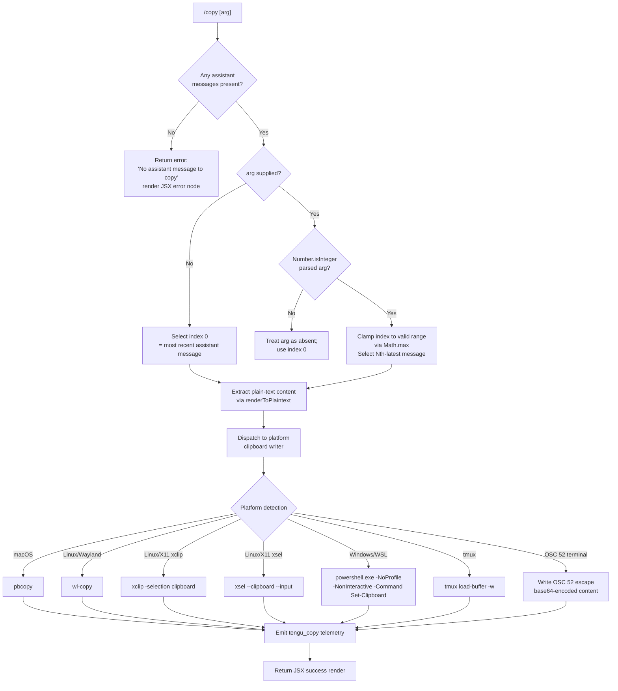

# `/copy`

> Analysis basis: CC v2.1.187 bundle.js (AST extraction + Claude interpretation)
> Minimum version: v2.1.187

---

## Overview

`/copy` copies Claude's most recent assistant response to the system clipboard. An optional numeric argument `N` selects the Nth-latest assistant message instead of the most recent one. The command dispatches to a platform-aware clipboard writer that supports macOS (`pbcopy`), Linux (Wayland `wl-copy`, X11 `xclip`/`xsel`), Windows/WSL (`powershell.exe`), tmux buffers, and OSC 52 terminal escape sequences.

---

## Registration

| Field | Value |
|---|---|
| type | `local-jsx` |
| name | `copy` |
| description | `Copy Claude's last response to clipboard (or /copy N for the Nth-latest)` |
| module_id | `Zdl` |
| load_inline | `true` |
| loc_byte | `11188528` |
| loc_byte_end | `11188714` |
| loc_line | `7016` |
| arbor_handler.name | `SYp` |
| arbor_handler.fqn | `claude-2.1.187::SYp` |
| arbor_handler.kind | `AsyncFunction` |
| arbor_handler.resolution_path | `module_id` |
| arbor_handler.n_hits | `0` |

Analysis basis: CC v2.1.187 bundle.js:+11188528

---

## Input Branching

Four distinct paths exist depending on whether an assistant message is present and what numeric argument (if any) is supplied.



Analysis basis: CC v2.1.187 bundle.js:+11187712 (handler entry `SYp`), +11187822 (Number coercion), +11187836 (Number.isInteger check), +11187753 (error literal), +11182962 (Math.max clamp)

---

## Behavioral Spec

### 1. Argument Parsing

```
async function copyCommandHandler(context):
    messages = context.messages          // full conversation history
    arg      = context.userInput.trim()

    if messages has no entries with role == "assistant":
        return renderError("No assistant message to copy")

    index = 0
    if arg is not empty:
        parsed = Number(arg)
        if Number.isInteger(parsed):
            index = Math.max(0, parsed - 1)   // 1-based input → 0-based
        // non-integer arg: silently fall back to index 0

    assistantMessages = messages
        .filter(m => m.role == "assistant")
        .reverse()                            // most-recent first

    target = assistantMessages[index]
    if target is undefined:
        index = assistantMessages.length - 1  // clamp to oldest available
        target = assistantMessages[index]
```

Analysis basis: CC v2.1.187 bundle.js:+11187822 (`Number` coercion), +11187836 (`Number.isInteger`), +11182962 (`Math.max`), +11187753 (error string literal)

### 2. Plain-text Rendering

The selected assistant message is converted to a plain-text string before being written to the clipboard. The renderer (`renderToPlaintext`, mapped from `hYp`) walks the message content blocks:

```
function renderToPlaintext(message):
    tokens = lexer(message.content)          // Nm.lexer tokenisation
    output = []
    for each token in tokens:
        stripped = token.replace(markupPatterns, "")   // eRe pattern
        output.push(stripped)
    return output.join("")
```

Analysis basis: CC v2.1.187 bundle.js:+11182609 (`Nm.lexer` call inside `hYp`), +11182618 (`eRe` replace), +11182674 (`n.push`)

### 3. Table-style Content Formatting

When the rendered content contains pipe-delimited table rows (detected via the `\\|` literal), a column-width alignment pass runs before the content is sent to the clipboard:

```
function formatTableContent(rawText):
    rows   = rawText.split("\\|")            // literal: "\\|"
    widths = rows.map(row => measureStringWidth(row))   // sn → Bun.stringWidth
    maxW   = Math.max(...widths)
    padded = rows.map((row, i) =>
        pad(row, alignment[i], maxW)         // "center" | "right" | "left"
    )
    return padded.join(" | ")               // literal: " | "
```

Alignment constants: `"center"`, `"right"`, `"left"` (bundle.js:+11183106, +11183144, +11183180).  
Column separator literal: `" | "` (bundle.js:+11183071).

Analysis basis: CC v2.1.187 bundle.js:+11182912 (pipe split), +11182987 (`sn`/`Bun.stringWidth`), +11183125 (`Tf`/pad), +11182962 (`Math.max`)

### 4. Platform Clipboard Dispatch

The dispatcher (`clipboardWriter`, mapped from `zbo` → `sv`) detects the runtime environment and selects the appropriate write strategy:

```
async function clipboardWriter(text):
    encoded = Buffer.from(text, "utf8").toString("base64")

    env = detectTerminalEnvironment()   // sv sub-calls: Nxt, vTi, Nud, i9r, Uxt, Nw, tE

    if env.platform == "darwin":
        spawnAndPipe("pbcopy", [], text)

    else if env.platform == "linux":
        if env.hasWayland:
            spawnAndPipe("wl-copy", [], text)
        else if env.hasXclip:
            spawnAndPipe("xclip", ["-selection", "clipboard"], text)
        else if env.hasXsel:
            spawnAndPipe("xsel", ["--clipboard", "--input"], text)

    else if env.platform == "win32" or env.isWSL:
        spawnAndPipe(
            "powershell.exe",
            ["-NoProfile", "-NonInteractive", "-Command", "Set-Clipboard ..."],
            text
        )

    else if env.isTmux:
        spawnAndPipe("tmux", ["load-buffer", "-w", "-"], text)
        // also supports "--primary" selection variant

    else if env.supportsOSC52:
        strategy = selectOSC52Strategy(env)   // BAn → checks YO.hasOsc52ClipboardUtf8Bug
        // strategy: "raw+dcs" | "dcs" | "raw" | "osc52" | "tmux-buffer" | "none"
        if strategy != "none":
            writeOSC52EscapeSequence(encoded)
            // kitty: double-ESC prefix (\x1b\x1b)
            // screen: wrap in DCS pass-through
```

Platform string constants: `"pbcopy"` (+3548542), `"linux"` (+3547226), `"wl-copy"` (+3547304), `"xclip"` (+3547372), `"xsel"` (+3547412), `"powershell.exe"` (+3548939), `"-NoProfile"` (+3548957), `"-NonInteractive"` (+3548970), `"-Command"` (+3548988), `"wsl"` (+3548929), `"tmux"` (+3547789), `"load-buffer"` (+3547797), `"-w"` (+3547811), `"pbcopy"` (+3548542), `"osc52"` (+3547187), `"tmux-buffer"` (+3547167), `"raw+dcs"` (+3548221), `"dcs"` (+3548244), `"raw"` (+3548250), `"none"` (+3548295), `"kitty"` (+3546768), `"screen"` (+3546299), `"--primary"` (+3548705), `"-selection"` (+3548754), `"clipboard"` (+3548767), `"primary"` (+3548808), `"--clipboard"` (+3548853), `"--input"` (+3548867), `"base64"` (+3548123), `"utf8"` (+3548106).

OSC 52 bug workaround: when `YO.hasOsc52ClipboardUtf8Bug` is `true`, `BAn` routes through the `Oud` fallback path (bundle.js:+3547512, +3547544).

VS Code compatibility note present in bundle: `"VS Code 1.123/1.124 will mojibake this paste — update to ≥1.125"` (bundle.js:+3547569).

Spawn timeout: 2000 ms (bundle.js:+3548508).

Analysis basis: CC v2.1.187 bundle.js:+11184136 (`sv` dispatch), +11184177 (`nu`), +11184252 (`BAn`), +11184275 (`Qdl`)

### 5. Temporary-directory Handling

Some clipboard backends (notably the OSC 52 / file-pipe path) write intermediate data to a temporary directory resolved via `fA` / `Qdl`:

```
function resolveTmpDir():
    base = env.CLAUDE_CODE_TMPDIR ?? "/tmp"     // literal "/tmp" at +3384893
    validate owner matches current user
    // on mismatch: error "Set CLAUDE_CODE_TMPDIR to a directory you control..."
    //   (+3384968)
    mkdir with mode 0o700 (448 decimal, +3385687)
    return resolvedPath
```

Analysis basis: CC v2.1.187 bundle.js:+3384893, +3384968, +3385585, +3385652, +3385687

### 6. Success / Error Rendering

After the clipboard write attempt the handler returns a JSX node (via `JY.jsx`, bundle.js:+11188255). On success a confirmation is displayed. If no assistant message was found the literal `"No assistant message to copy"` is rendered as an error node (bundle.js:+11187753).

The content type system recognises two render modes: `"table"` (+11183483) and `"plaintext"` (+11183924), which influence how the final JSX node is constructed.

---

## State & Side Effects

| Item | Detail |
|---|---|
| Telemetry | `tengu_copy` fired after every clipboard write attempt (bundle.js:+11188131) |
| Telemetry (indirect, deep graph) | `tengu_daemon_config_reload`, `tengu_daemon_yield`, `tengu_mcp_skills`, `tengu_config_auth_loss_prevented`, `tengu_bg_retire_pinned_low_mem`, `tengu_bg_prewarm_per_sweep`, `tengu_config_parse_error`, `tengu_bg_dispatch_sigkill_escalate`, `tengu_feature_bad`, `tengu_feature_ok`, `tengu_bg_low_mem_mb`, `tengu_bg_dispatch_low_mem`, `tengu_daemon_idle_exit`, `tengu_bg_spare_enable`, `tengu_bg_sendclaim_failed`, `tengu_bg_spare_claim`, `tengu_bg_spare_claim_fail`, `tengu_daemon_control` (deep callGraph; not specific to `/copy`) |
| Hook registration | None observed in depth-2 traversal |
| appState changes | None — read-only access to message history |
| Sound | None |
| Clipboard side effect | Overwrites system clipboard (or tmux buffer / OSC 52 terminal buffer) with the selected assistant message text |
| Temp files | Intermediate temp file may be created under `CLAUDE_CODE_TMPDIR` or `/tmp` during some clipboard backend paths; cleaned up after write |
| Spawn | Short-lived child process (`pbcopy`, `wl-copy`, `xclip`, `xsel`, `powershell.exe`, or `tmux`) with 2000 ms timeout |

---

## Version History

| Version | Change |
|---|---|
| v2.1.187 | Initial analysis |

---

## Common Mistakes

1. **Confusion over the `N` argument's base**: `/copy 1` retrieves the **most recent** assistant message (1-indexed from the end). `/copy 2` retrieves the second-most-recent. Passing `0` or a non-integer silently falls back to index 0 (most recent).
2. **Expecting Markdown formatting in the clipboard**: the command strips markup before writing; the clipboard receives plain text, not rendered Markdown.
3. **OSC 52 not working in VS Code 1.123–1.124**: the bundle explicitly warns that these VS Code versions will mojibake OSC 52 pastes. Update VS Code to ≥ 1.125 or use a terminal that supports OSC 52 natively.
4. **Linux clipboard empty when no display server is available**: if neither Wayland (`WAYLAND_DISPLAY`) nor X11 (`DISPLAY`) is set and no tmux/OSC 52 fallback is available, the clipboard write will silently fail or fall through to `"none"` strategy. Run inside a graphical session or configure tmux.
5. **`CLAUDE_CODE_TMPDIR` ownership mismatch**: if the temp directory exists but is owned by a different user, the command aborts with an explicit error message advising you to set `CLAUDE_CODE_TMPDIR` to a directory you control.

---

## Appendix — Identifier Mapping

> For bundle debugging only. Identifiers change across versions.

| Identifier | Role |
|---|---|
| `SYp` | Main async handler for `/copy` command (arbor_handler) |
| `jdl` | Table-row formatting utility (pad/align columns) |
| `gYp` | Maps table rows to formatted strings |
| `JNl` | Daemon status JSON reader |
| `SQ` | Status query helper |
| `Dfe` | Text trim + truncation helper (1000 ms / 0 constants) |
| `Xs` | AsyncLocalStorage store accessor (`$Fu.getStore`) |
| `tVt` | Joins daemon status parts (`XNl.join`) |
| `Me` | `JSON.stringify` wrapper |
| `En` | Regex replace helper used on column content |
| `sn` | String width measurer (`Bun.stringWidth`) |
| `Tf` | Repeat-character pad builder (`e.repeat`, `Number.isFinite`) |
| `Is` | Process-exit helper (`aqe`, `oT`, `process.exit`) |
| `a9e` | MCP server connection orchestrator |
| `RB` | MCP registration/config applier |
| `Pst` | MCP server permission builder |
| `y7` | MCP server slot lifecycle manager |
| `K4` | MCP SDK-type server builder |
| `CRn` | MCP config error colour reporter (`St.red`, `St.yellow`) |
| `xst` | SSE/HTTP transport connection handler |
| `iF` | `Object.create`-based prototype builder |
| `Qw` | Queue/context wrapper (`eh`, `eJr`) |
| `eh` | Telemetry/event dispatch (`tde`, `Dt`, `Sa`) |
| `zn` | No-op / identity utility |
| `mua` | MCP cache read helper (`cZr`, `RLe`, `fyn`) |
| `cZr` | Cache path resolver (`Xs`, `tMn`, `Gt`) |
| `RLe` | Content hasher (`Me`, `Array.isArray`, `msa.createHash`) |
| `fyn` | Object key serialiser (`Ose`, `Object.keys`, `B9`) |
| `myn` | Hash-based cache writer (`fyn`, `vT`) |
| `vT` | SHA-256 hash builder (`Dli.createHash`) |
| `pyn` | Cache path generator (`Gl`) |
| `Gl` | Path join helper (`TWs`) |
| `ln` | MCP debug logger (`c7e.push`, `jJ.logMCPDebug`) |
| `zRn` | MCP connection runner (`wr`, `JVd`, `QVd`) |
| `JVd` | OAuth/authenticated MCP connection handler |
| `QVd` | OAuth callback handler (`zVd`, `Fst`, `Bst`) |
| `BUt` | MCP server reconnect helper |
| `tMn` | Cache path suffix joiner (`eMn.join`, `or`) |
| `mJr` | MCP tool manifest fetcher (`vT`, `Gl`, `ln`, `be`) |
| `be` | String coercion helper |
| `eL` | MCP skills telemetry emitter (`it`) |
| `it` | Telemetry event router (`ext`, `txt`, `V9`, `hSn`, `Dt`) |
| `ZXr` | Command inclusion checker (`hn`, `n.includes`) |
| `hn` | Notification/render dispatcher (`GQn`, `n0`, `ADe`, `DOo`, `MKt`) |
| `w` | Background-session window tracker (`aj`, `fcc`, `mcc`) |
| `L` | Background worker sweep loop |
| `fcc` | Most-recent entry accessor (`e.at`) |
| `mcc` | Cross-node retry helper (`xnr`) |
| `Vc` | MCP error logger (`c7e.push`, `jJ.logMCPError`) |
| `yua` | Async-iterable mapper (`ZW`) |
| `ZW` | Promise-based iterable aggregator |
| `git` | Integer parser variant A (`parseInt`, base 10) |
| `nMn` | Integer parser variant B (`parseInt`, base 20) |
| `brr` | MCP update applier (`e.applyMcpUpdate`, `i9e`, `ln`, `KT`) |
| `i9e` | MCP result validator (`RLe`) |
| `KT` | MCP connection cleanup orchestrator (`mit`, `o.cleanup`, `eL`) |
| `mit` | MCP tool manifest cleaner (`RLe`) |
| `hla` | MCP server query helper (`tQr`) |
| `T` | Global config accessor / environment formatter |
| `Xwc` | Config writer helper (`JP`, `xcr`, `I6o`) |
| `I6o` | Platform-specific config path resolver (`tCc`, `nCc`) |
| `wc` | ANSI/colour stripper (`c8o`, `e.replace`, `r.at`) |
| `c8o` | ANSI code map builder (`zwc.map`) |
| `dze` | Stdout/stderr writer wrapper (`JWo`) |
| `JWo` | Direct `e.write` wrapper |
| `eLc` | Log file appender (`FKe`, `dpe`, `Zwc`, `Ocr`, `Ucr`) |
| `FKe` | Buffered flush writer (`clearTimeout`, `setTimeout`, `setImmediate`) |
| `dpe` | Log path builder (`hze`, `upe.join`, `kt`) |
| `Mre` | Directory creator (`cn`) |
| `p8o` | Path joiner with base (`upe.join`, `kt`) |
| `Ocr` | Atomic file rename helper (`RN.stat`, `RN.rename`, `RN.unlink`) |
| `Zwc` | Append-file writer (`RN.mkdir`, `RN.appendFile`) |
| `Ei` | Signal/handler registration (`b6o.register`) |
| `uBo` | MCP full reconciliation loop (`a9e`, `brr`, `mit`) |
| `xRn` | MCP client set membership checker (`EVd.has`, `aJr.has`) |
| `Kn` | Promise with timeout helper (`Error`, `setTimeout`, `clearTimeout`) |
| `Ydl` | Message content block parser (`Nm.lexer`, `jdl`) |
| `Nm` | Markdown lexer wrapper (`kBe.parse`) |
| `Jdl` | Escape-sequence remover (`e.replace`) |
| `Xdl` | Content-block array normaliser (`Array.isArray`, `Kl`, `t.push`) |
| `Kl` | Text-block filter (`e.filter` for `"text"` kind) |
| `hYp` | Assistant message plain-text renderer (`Nm.lexer`, `eRe`, `n.push`) |
| `eRe` | Markup strip regex replace (`e.replace`) |
| `Dt` | CLAUDE_DATA dir resolver (`Wt`, `n0`, `MOo`, `_Ee`, `MRf`) |
| `_Ee` | Config file reader/writer with backup support |
| `Gt` | `JSON.parse` wrapper |
| `u9` | Prefix-strip helper (`e.startsWith`, `e.slice`) |
| `cn` | Error code mapper (`"EISDIR"` etc.) |
| `HGl` | Backup directory scanner (`IS.basename`, `NOo`, `t.readdirStringSync`) |
| `NOo` | Path join with `or` fallback (`IS.join`) |
| `W` | Structured logger / warning emitter |
| `f` | Background worker manager (daemon-side) |
| `D` | Worker process spawner (`FEc`, `sp`, `ke`, `GJf`) |
| `Re` | Feature-flag failure reporter (`tengu_feature_bad`) |
| `Le` | Feature-flag success reporter (`tengu_feature_ok`) |
| `GXn` | Memory platform detector (`jt`, `it`) |
| `N2e` | Stale cache file pruner (`gb.lstat`, `gb.rm`, `gb.readFile`) |
| `ke` | Error/log emitter to telemetry (`fo`, `nt`, `Vi`, `Qru`) |
| `U` | Worker retire-if-settled logic (`clearTimeout`, `setTimeout`, `d.write`) |
| `C3o` | IPC socket connect helper (`dV.claim`, `Yrr.connect`) |
| `x3o` | Worker lifecycle state machine (`ec`, `qm.rm`, `ke`, `Di`) |
| `p` | Forced shutdown handler (`Kb`, `process.exit`, `u.abort`) |
| `Pe` | Feature gate evaluator (`rKe`) |
| `F` | Heartbeat interval manager (`clearInterval`) |
| `MRf` | Config file watcher (`n0`, `fIt`, `Wt`, `Sa`, `u9`, `MOo`, `Ei`) |
| `fIt` | File watch initiator (`mis.watchFile`) |
| `uV` | Config change notifier |
| `zbo` | Clipboard write orchestrator; selects backend and writes text |
| `sv` | Clipboard backend dispatcher (platform detection + strategy selection) |
| `Nxt` | Terminal capability detector (`A_`) |
| `A_` | Raw terminal info reader |
| `vTi` | OSC 52 capability probe (`jt`, `Un`, `a9r`) |
| `Un` | Terminal write helper (`Wr`, `Pt`) |
| `a9r` | OSC 52 response parser (`jt`, `Cf`) |
| `Nud` | Tmux environment prober (`Un`, `T`) |
| `i9r` | Screen/DCS environment prober (`A_`) |
| `Uxt` | Kitty terminal prober (`Nxt`, `jt`) |
| `Nw` | Escape-prefix normaliser (`i9r`, `e.replaceAll`) |
| `tE` | OSC 52 strategy builder (`CTi`, `e.join`) |
| `CTi` | Strategy constant builder (`A_`) |
| `nu` | Character index finder (`e.indexOf`) |
| `BAn` | OSC 52 bug detector and fallback router (`YO.hasOsc52ClipboardUtf8Bug`, `Oud`) |
| `Oud` | OSC 52 UTF-8 bug workaround writer |
| `Qdl` | Temp directory initialiser (`fA`, `Vdl.join`, `qdl.mkdir`, `$_r`) |
| `fA` | Tmp dir path resolver and permission setter (`$Sn.join`, `RU`, `oCe.mkdirSync`, `MSi`) |
| `RU` | User home / XDG temp path resolver |
| `MSi` | Tmp dir ownership validator (`oCe.lstatSync`, `r.isDirectory`, `vn`, `oCe.chmodSync`) |
| `$_r` | Atomic file write helper (`l9.readlink`, `vf.resolve`, `l9.open`, `r.rename`) |
| `kn` | Error code extractor (`cn`) |
| `E7e` | fsync error code filter (`"EINVAL"`, `"ENOTSUP"`, `"EPERM"`, `"ENOSYS"`) |

---

Note: index built via Arbor fallback; some signals (telemetry, literals) may be missing — see arbor-fallback.js.