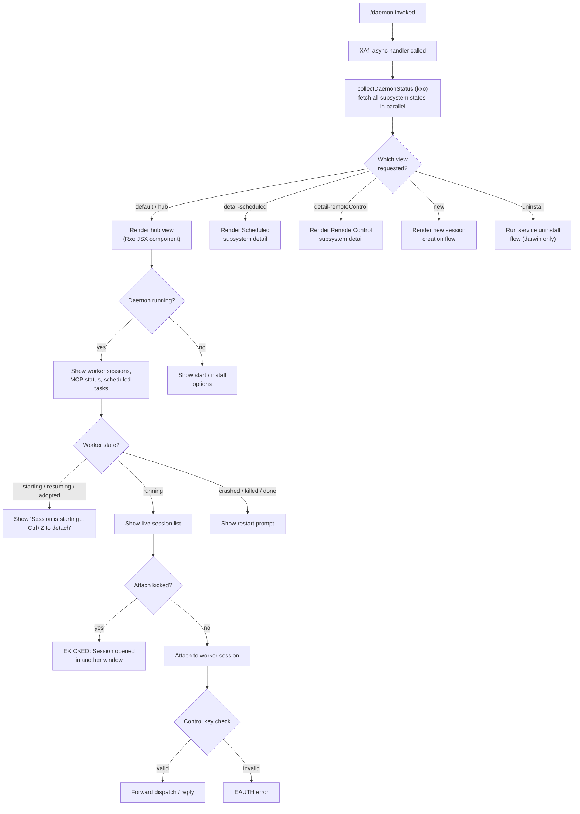

# `/daemon`

> Analysis basis: CC v2.1.187 bundle.js (AST extraction + Claude interpretation)
> Minimum version: v2.1.187

---

## Overview

The `/daemon` command provides a management interface for Claude Code's background daemon process and its associated subsystems — including scheduled task runners, remote-control services, MCP server connections, and background worker sessions. It renders a live JSX panel (type `local-jsx`) that allows users to inspect daemon state, start/stop services, manage worker lifecycles, and view structured status information sourced from on-disk JSON files.

---

## Registration

| Field | Value |
|---|---|
| type | `local-jsx` |
| name | `daemon` |
| description | `Manage background services and routines` |
| loc_byte | `12981728` |
| loc_byte_end | `12981896` |
| loc_line | `8818` |
| immediate | `true` |
| module_id | `xxo` |
| load_inline | `true` |
| arbor_handler.name | `XAf` |
| arbor_handler.fqn | `claude-2.1.187::XAf` |
| arbor_handler.kind | `AsyncFunction` |
| arbor_handler.resolution_path | `module_id` (followed `module_id` → `moduleExports` → name lookup) |
| arbor_handler.n_hits | `0` |

Analysis basis: CC v2.1.187 bundle.js:+12981728

---

## Input Branching

The command presents multiple distinct UI views based on user navigation state and daemon service type. The following flowchart covers the primary branching paths observed in the call graph and literal strings.



---

## Behavioral Spec

### Top-Level Handler (`XAf`)

The Arbor-resolved handler `XAf` is an `AsyncFunction` reached via `module_id` resolution from module `xxo`.

```
async function daemonCommandHandler(context):
    statusBundle = await collectDaemonStatus()     // kxo
    uiTree = buildJsx(statusBundle)               // kc.jsx
    renderPanel = createPanel(uiTree)             // v$l
    return renderPanel
```

Analysis basis: CC v2.1.187 bundle.js:+12971575

---

### Parallel Status Collection (`kxo`)

This function is the primary data-gathering entry point. It fans out in parallel to collect status from all daemon subsystems before the UI is rendered.

```
async function collectDaemonStatus():
    [
        scheduledStatus,        // S$l
        daemonFileStatus,       // m$l
        mainDaemonStatus,       // V0
        scheduledDaemonStatus,  // ZNl / wFl
        rosterStatus,           // Wq
        serviceStatus,          // oX
    ] = await Promise.all([
        fetchScheduledStatus(),
        fetchDaemonFileStatus(),
        killOrReadDaemonStatus(),
        killOrReadScheduledDaemonStatus(),
        readRoster(),
        queryServiceStatus(),
    ])
    keys = Object.keys(collectedData)
    return { ...allStatuses }
```

Analysis basis: CC v2.1.187 bundle.js:+12971134

---

### Daemon Status File Reading (`m$l` / `Z8e`)

Reads `daemon.json` (configuration) and `daemon.status.json` (runtime status) from the daemon's working directory. Falls back to an `ENOENT`-safe path that resolves an empty or rejected promise rather than throwing.

```
async function fetchDaemonFileStatus():
    statusPath = buildPath("daemon.status.json")    // tVt → XNl.join
    configPath = buildPath("daemon.json")           // H6 → GIo.join
    try:
        statusStats = await fs.stat(statusPath)
        if not statusStats.isFile():
            return Promise.reject("ENOENT")
        rawContent = await readFileUtf8(statusPath)
        parsed = parseJsonSafe(rawContent)
        return { config: configContent, status: parsed }
    catch ENOENT:
        return null
    processKillIfNeeded(pid)         // V0 → process.kill
    basename = path.basename(...)    // rEe.basename
```

Analysis basis: CC v2.1.187 bundle.js:+12959587

- `daemon.status.json` path literal: CC v2.1.187 bundle.js:+12784279
- `daemon.json` path literal: CC v2.1.187 bundle.js:+11505677
- `ENOENT` guard literal: CC v2.1.187 bundle.js:+12957828

---

### Scheduled Daemon Status Reading (`ZNl` / `wFl`)

Two parallel readers handle the scheduled daemon subsystem. One reads `daemon.status.json` for the main daemon; the other reads `daemon.scheduled.status.json` for the scheduled runner.

```
async function fetchScheduledDaemonStatus():
    path = buildPath("daemon.scheduled.status.json")    // vFl → IFl.join
    rawContent = await fs.readFile(path)
    parsed = safeJsonParse(rawContent)
    if processIsRunning(parsed.pid):
        process.kill(parsed.pid, signal)
    return startServiceManager()          // JC
```

- `daemon.scheduled.status.json` literal: CC v2.1.187 bundle.js:+12877265

Analysis basis: CC v2.1.187 bundle.js:+12877472

---

### Roster Reading and Parsing (`Wq`)

Reads `roster.json` from the daemon's state directory and validates each entry. Handles malformed, oversized, or non-regular-file roster entries gracefully.

```
async function readRoster():
    rosterPath = buildRosterPath()            // mne → jh.join
    lstat = await fs.lstat(rosterPath)
    if not lstat.isFile():
        logError("is not a regular file — removing")
        // telemetry: tengu_bg_roster_parse_failed
        await fs.rm(rosterPath)
        return []
    raw = await fs.readFile(rosterPath)
    decoded = decodeUtf8(raw)                 // kn
    parsed = safeJsonDecode(decoded)          // Jd
    validated = validateRosterEntries(parsed) // cHl → Array.isArray, Object.keys
    sorted = sortByTimestamp(validated)       // LJt
    return sorted
```

- `roster.json` literal: CC v2.1.187 bundle.js:+11512428
- Error string `"is not a regular file — removing"`: CC v2.1.187 bundle.js:+11516604
- Telemetry `tengu_bg_roster_parse_failed`: CC v2.1.187 bundle.js:+11516650

Analysis basis: CC v2.1.187 bundle.js:+11516457

---

### Service Status Query via launchctl (`oX` / `Un` / `UKn`)

On macOS (darwin), queries `launchctl print` with a 5 000 ms timeout to determine whether the daemon LaunchAgent is installed and running.

```
async function queryServiceStatus():
    uid = process.getuid()                             // Jgl
    serviceLabel = buildServiceLabel(uid)              // UKn
    result = await runCommand("launchctl", ["print", serviceLabel], {
        timeout: 5000
    })
    return parseServiceOutput(result)
```

- `"launchctl"` literal: CC v2.1.187 bundle.js:+11509265
- `"print"` literal: CC v2.1.187 bundle.js:+11509278
- Timeout `5000` ms: CC v2.1.187 bundle.js:+11509312
- LaunchAgents path components: CC v2.1.187 bundle.js:+11505992, +11506002

Analysis basis: CC v2.1.187 bundle.js:+11509262

---

### Daemon Process Management (`V0` / `cMe` / `BIo`)

Handles reading a PID file, signalling the process, and cleaning up stale socket/PID files.

```
async function killOrReadDaemonStatus():
    pidFilePath = buildPidPath()
    try:
        stats = await fs.lstat(pidFilePath)
        if stats.isFile():
            raw = await fs.readFile(pidFilePath, { maxBytes: 65536 })  // 0x10000
            pidStr = decode(raw)                 // kn
            pid = parseInt(pidStr.trim())
            lines = raw.split("\n")
            sliced = lines.slice(n)              // BIo → t.split, n.slice
            process.kill(pid, 0)                 // signal 0: existence check
        await cleanupSocket(pidFilePath)         // cMe → SP.rm
    catch:
        // ignore ENOENT / ESRCH
    return startServiceManager()                 // JC
```

- File size limit `65536` bytes: CC v2.1.187 bundle.js:+11504177
- `"claude daemon"` process name marker: CC v2.1.187 bundle.js:+11505102
- `process.kill` call: CC v2.1.187 bundle.js:+11505211

Analysis basis: CC v2.1.187 bundle.js:+11505183

---

### Scheduled Task Status Aggregation (`S$l` / `zgt` / `RRo` / `ixo`)

Fetches and merges the scheduled task list from configuration files, validating size and JSON structure. Entries tagged `"scheduled"` are recognized.

```
async function fetchScheduledStatus():
    [configData, taskList] = await Promise.all([
        readConfigFile(),    // zgt → RRo
        readTaskIndex(),     // zgt → ixo
    ])
    entries = filterScheduled(taskList)     // oxo
    result.push(...entries)                 // r.push
    return result
```

- Max config file size `1048576` bytes (1 MiB): CC v2.1.187 bundle.js:+12785099
- `"scheduled"` tag literal: CC v2.1.187 bundle.js:+12878770
- `"utf8"` encoding: CC v2.1.187 bundle.js:+12785218

Analysis basis: CC v2.1.187 bundle.js:+12965960

---

### MCP Connection Management (`a9e` / `uBo` / `brr`)

The MCP subsystem is initialised and managed within the daemon panel. The connection lifecycle — including auth-cache checks, retry suppression (15-minute cache), OAuth flow, and slot reconciliation — runs as a side effect when the panel mounts.

```
async function manageMcpConnections(serverConfigs):
    for each [name, config] in Object.entries(serverConfigs):
        if config.status == "disabled":
            continue
        if needsAuthCached(name):
            log("Skipping connection (cached needs-auth)")
            continue
        if recentFailureCached(name):
            log("Skipping connection (recent failure cached; retries in 15 min)")
            continue
        client = await connectMcpServer(config)    // RB / y7
        applyResult(client)                         // brr → e.applyMcpUpdate
    reconcileOrphanedSlots()                        // uBo
```

- `"Skipping connection (cached needs-auth)"`: CC v2.1.187 bundle.js:+12869029
- `"Skipping connection (recent failure cached…)"`: CC v2.1.187 bundle.js:+12869282
- Failure cache file `"mcp-needs-auth-cache.json"`: CC v2.1.187 bundle.js:+12858450
- Telemetry `tengu_mcp_skills`: CC v2.1.187 bundle.js:+12652661

Analysis basis: CC v2.1.187 bundle.js:+12868236

---

### Background Worker Attach Protocol (`bJf`)

The daemon's IPC server handles attach requests from foreground clients. The protocol uses a control key (`EAUTH` errors when mismatched) and supports multiple message types.

```
function handleClientConnection(socket):
    messages = parseFramed(socket)     // ETOOLARGE if oversized
    for msg in messages:
        switch msg.type:
            case "ping":      sendPong()
            case "nudge":     noteActivity()
            case "yield":     yieldToForeground()     // tengu_daemon_yield
            case "lease":     grantLease()
            case "leases":    listLeases()
            case "shutdown":  initiateShutdown()
            case "dispatch":  verifyControlKey(); routeToWorker()
            case "reply":     verifyControlKey(); forwardReply()
            case "exec":      spawnWorker()
            case "kill":      killWorker()
            case "attach":    verifyControlKey(); attachToWorkerPty()
            case "resize":    resizeWorkerPty()
            case "list":      listWorkers()
            case "has":       checkWorkerExists()
            case "subscribe": streamWorkerEvents()
            case "snapshot":  sendStateSnapshot()
            case "permission-response": verifyControlKey(); forwardPermission()
            case "ensure-spare": ensureSpareWorkerExists()
```

- `"ETOOLARGE"` error: CC v2.1.187 bundle.js:+17178382
- `"EAUTH"`: CC v2.1.187 bundle.js:+17183028
- `"ESTARTING"`: CC v2.1.187 bundle.js:+17181591
- `"ERESPAWNING"`: CC v2.1.187 bundle.js:+17185613
- `"ENOJOB"`: CC v2.1.187 bundle.js:+17183801
- `"ENOREPLY"`: CC v2.1.187 bundle.js:+17183942
- `"EPROTO"`: CC v2.1.187 bundle.js:+17181892
- `"EKICKED"` message: `"EKICKED: Session opened in another window"` — CC v2.1.187 bundle.js:+17189585
- Control-key auth failure message for dispatch: CC v2.1.187 bundle.js:+17182952
- Control-key auth failure message for attach: CC v2.1.187 bundle.js:+17185031

Analysis basis: CC v2.1.187 bundle.js:+17178572

---

### Background Worker Sweep / Memory Management (`L`)

A periodic sweep function runs within the daemon to manage worker lifecycle — respawning idle-stale workers, retiring settled workers under memory pressure, and prewarming spares.

```
function periodicWorkerSweep():
    now = Date.now()
    for worker in workers.values():
        worker.shiftGraceClocksForward()
        if memoryPressure and not pinnedWorkers.has(worker):
            worker.retireIfSettled()            // tengu_bg_retire_pinned_low_mem
        elif worker.respawnIfIdleStale():
            schedulePrewarm()                   // tengu_bg_prewarm_per_sweep (up to 12)
    await Promise.all(retireQueue.map(w => w.retireIfSettled()))
    for worker in respawnQueue:
        worker.respawnIfIdleStale()
```

- `"prewarm"` label: CC v2.1.187 bundle.js:+17201478
- Max prewarm per sweep `12`: CC v2.1.187 bundle.js:+17200908
- Low-memory log message: CC v2.1.187 bundle.js:+17200642
- Telemetry `tengu_bg_retire_pinned_low_mem`: CC v2.1.187 bundle.js:+17200753
- Telemetry `tengu_bg_prewarm_per_sweep`: CC v2.1.187 bundle.js:+17200874

Analysis basis: CC v2.1.187 bundle.js:+17200139

---

### Daemon Stop Flow (`u` / `X6`)

Stopping the daemon initiates a graceful shutdown sequence. Telemetry is emitted for both successful and failed stop attempts.

```
async function stopDaemon():
    // tengu_daemon_control emitted
    try:
        await Promise.race([
            shutdownSession(),     // Ome → Pme.shutdown
            timeout(500),          // Vme
        ])
        await Promise.all(cleanupTasks)
        // tengu_daemon_stop recorded (daemon_stop literal)
    catch error:
        // tengu_daemon_stop_failed recorded (daemon_stop_failed literal)
    finally:
        process.exit(0)
```

- `"daemon_stop"` literal: CC v2.1.187 bundle.js:+17233717
- `"daemon_stop_failed"` literal: CC v2.1.187 bundle.js:+17233754
- Stop timeout `500` ms: CC v2.1.187 bundle.js:+17228851
- `"forced shutdown"` label: CC v2.1.187 bundle.js:+17230114
- Telemetry `tengu_daemon_control`: CC v2.1.187 bundle.js:+17233792

Analysis basis: CC v2.1.187 bundle.js:+17228807

---

### macOS Service Install / Uninstall (`nht` / `r8t` / `KIo`)

Service lifecycle commands (`start`, `stop`, `restart`, `kickstart`, `bootout`, `uninstall`) are available on macOS darwin only. `kickstart` polls for daemon exit with up to 50 retries before aborting.

```
async function manageService(action):
    if platform != "darwin":
        throw "service uninstall not available on darwin"
    servicePath = buildLaunchAgentPath()    // VIo → t8t.join, WIo.homedir
    switch action:
        case "start":
            launchctl("kickstart", servicePath)
        case "stop":
            launchctl("stop", serviceLabel)
        case "restart":
            await stopWithTimeout(50 polls)
            if timedOut:
                throw "daemon did not exit within 10s of SIGTERM; restart aborted before kickstart"
            launchctl("kickstart", servicePath)
        case "bootout" / "uninstall":
            launchctl("bootout", serviceLabel)
            await fs.unlink(plistPath)      // rX.unlink
```

- Platform check `"darwin"`: CC v2.1.187 bundle.js:+11508773
- Restart poll limit `50`: CC v2.1.187 bundle.js:+11508418
- SIGTERM timeout message: CC v2.1.187 bundle.js:+11508447
- `"kickstart"` literal: CC v2.1.187 bundle.js:+11508125
- `"bootout"` literal: CC v2.1.187 bundle.js:+11507763
- `"uninstall"` view name: CC v2.1.187 bundle.js:+12972138
- `"service uninstall not available on darwin"` error: CC v2.1.187 bundle.js:+11507894

Analysis basis: CC v2.1.187 bundle.js:+11507735

---

### Daemon Configuration Reload (`d` / supervisor)

When configuration changes are detected, the daemon reloads MCP and related settings without a full restart. The supervisor actor is the target of `stop`, `updateConfig`, and `start` calls in sequence.

```
function reloadDaemonConfig(newConfig):
    supervisor.stop()
    supervisor.updateConfig(newConfig)
    supervisor.start()
    // tengu_daemon_config_reload emitted
```

- `"supervisor"` role string: CC v2.1.187 bundle.js:+17211390
- Telemetry `tengu_daemon_config_reload`: CC v2.1.187 bundle.js:+17212183

Analysis basis: CC v2.1.187 bundle.js:+17211365

---

### Background Focus / Yield (`w` / `L`)

The daemon tracks whether it is in a `"focused"` or `"blurred"` state. When a foreground session takes over, the daemon yields its workers (they are re-adopted later). An idle-exit timer (`daemon_idle_exit`) fires after a configurable period.

```
function onFocusChange(newState):
    if newState == "blurred":
        scheduleIdleCheck(3600000 * 0.8)     // 80% of 1 hour
    elif newState == "focused":
        cancelIdleCheck()
    // tengu_daemon_yield fired on actual yield
    // "yielding to a foreground/service daemon — bg workers will be re-adopted"
```

- `"blurred"` / `"focused"` literals: CC v2.1.187 bundle.js:+16460493, +16460643
- Idle-timeout base `3600000` ms (1 h): CC v2.1.187 bundle.js:+16460554
- Jitter factor `0.8`: CC v2.1.187 bundle.js:+16460610
- Yield log message: CC v2.1.187 bundle.js:+17216513
- Telemetry `tengu_daemon_yield`: CC v2.1.187 bundle.js:+17216595
- Telemetry `tengu_daemon_idle_exit`: CC v2.1.187 bundle.js:+17217625

Analysis basis: CC v2.1.187 bundle.js:+16460481

---

## State & Side Effects

| Item | Detail |
|---|---|
| Telemetry: `tengu_bg_roster_parse_failed` | Fired when `roster.json` is not a regular file (CC v2.1.187 bundle.js:+11516650) |
| Telemetry: `tengu_daemon_config_reload` | Fired on hot-reload of daemon configuration (CC v2.1.187 bundle.js:+17212183) |
| Telemetry: `tengu_daemon_yield` | Fired when daemon yields workers to a foreground service (CC v2.1.187 bundle.js:+17216595) |
| Telemetry: `tengu_mcp_skills` | Fired on MCP connection/skills enumeration (CC v2.1.187 bundle.js:+12652661) |
| Telemetry: `tengu_config_auth_loss_prevented` | Fired when a config save would have overwritten valid auth tokens (CC v2.1.187 bundle.js:+13747209) |
| Telemetry: `tengu_bg_retire_pinned_low_mem` | Fired when pinned workers are retired due to memory pressure (CC v2.1.187 bundle.js:+17200753) |
| Telemetry: `tengu_bg_prewarm_per_sweep` | Fired each sweep that prewarmed spare workers (CC v2.1.187 bundle.js:+17200874) |
| Telemetry: `tengu_feature_ok` / `tengu_feature_bad` | Feature flag check pass/fail (CC v2.1.187 bundle.js:+1025122, +1025189) |
| Telemetry: `tengu_daemon_control` | Fired when daemon stop control is initiated (CC v2.1.187 bundle.js:+17233792) |
| Telemetry: `tengu_amber_anchor` | Background service anchor event (CC v2.1.187 bundle.js:+3350237) |
| Telemetry: `tengu_bg_proto_mismatch` | IPC protocol version mismatch between client and daemon (CC v2.1.187 bundle.js:+17181686) |
| Telemetry: `tengu_bg_dispatch_stale_drop` | Stale dispatch dropped by daemon (CC v2.1.187 bundle.js:+17183085) |
| Telemetry: `tengu_bg_state_read_transient` | Transient error reading worker state file (CC v2.1.187 bundle.js:+4300026) |
| Telemetry: `tengu_bg_attach_legacy_autorespawn` | Legacy client triggered auto-respawn (CC v2.1.187 bundle.js:+17185989) |
| Telemetry: `tengu_bg_attach_upgrade` | Attach triggered a version upgrade path (CC v2.1.187 bundle.js:+13053438) |
| Telemetry: `tengu_bg_attach` | Normal attach to background worker (CC v2.1.187 bundle.js:+17187248) |
| Telemetry: `tengu_bg_attach_stall_ms` | Attach stall duration recorded (CC v2.1.187 bundle.js:+17176880) |
| Telemetry: `tengu_bg_attach_stall_gave_up` | Attach abandoned after repeated stalls (CC v2.1.187 bundle.js:+17188178) |
| Telemetry: `tengu_bg_attach_stall_respawn` | Attach triggered a respawn due to stall (CC v2.1.187 bundle.js:+17188448) |
| Telemetry: `tengu_bg_attach_kick` | Attach kick event (another window took session) (CC v2.1.187 bundle.js:+17189445) |
| Telemetry: `tengu_daemon_idle_exit` | Daemon exiting due to idle timeout (CC v2.1.187 bundle.js:+17217625) |
| Hook registration | `immediate: true` — the command executes immediately without waiting for user input |
| appState changes | Daemon status JSON files (`daemon.json`, `daemon.status.json`, `daemon.scheduled.status.json`, `roster.json`) are read and written as side effects |
| Socket / PID file management | Stale socket and PID files are cleaned up via `SP.rm`, `SP.unlink`, `rX.unlink` during daemon stop or status reads |
| MCP cache files | `mcp-needs-auth-cache.json` is read to skip servers needing auth; failure cache suppresses reconnects for 15 minutes |
| Sound | Not observed in depth-2 traversal |

---

## Version History

| Version | Change |
|---|---|
| v2.1.187 | Initial analysis |

---

## Common Mistakes

1. **Expecting cross-platform service management**: The `start`, `stop`, `restart`, `kickstart`, `bootout`, and `uninstall` service-level actions are gated to `darwin`. On other platforms an error is thrown immediately. Use direct daemon process management instead.

2. **Confusing daemon status files**: There are three distinct status files — `daemon.json` (config), `daemon.status.json` (main daemon runtime), and `daemon.scheduled.status.json` (scheduled runner). Editing or deleting only one will not fully reset daemon state.

3. **Ignoring the 15-minute MCP retry suppression**: MCP servers that fail to connect are cached as failed for 15 minutes. Restarting the daemon will not force a retry. To force a retry before the window expires, edit the MCP plugin config entry to trigger a slot change.

4. **Assuming immediate attach after `exec`**: Background worker sessions may be in `starting`, `resuming`, or `adopted` states after launch. The UI will display "Session is starting — it will appear once ready. Ctrl+Z to detach" during this window. Attempting to attach before the worker is `running` will receive `ESTARTING` or `ERESPAWNING`.

5. **Stale roster entries**: `roster.json` is validated on each read. Non-regular-file entries trigger automatic deletion and `tengu_bg_roster_parse_failed` telemetry. If the roster is corrupted, entries are silently dropped rather than causing a crash.

6. **IPC control-key mismatch**: If the daemon was restarted while a foreground client still holds an old session, dispatch and attach commands will receive `EAUTH`. The fix is to restart the Claude Code daemon (the error message says exactly this).

---

## Appendix — Identifier Mapping

> For bundle debugging only. Identifiers change across versions.

| Identifier | Role |
|---|---|
| `XAf` | Top-level async handler for `/daemon` command (Arbor-resolved) |
| `obf` | Outer command wrapper / JSX render orchestrator |
| `kxo` | Parallel daemon status collector (main fan-out function) |
| `pMe` | Pre-status helper called before parallel collection |
| `S$l` | Scheduled status aggregator |
| `zgt` | Config file reader and task list fetcher |
| `RRo` | Raw config file reader (validates size, parses JSON) |
| `ixo` | Task index reader (validates Array) |
| `ke` | Logger / error-queue writer |
| `V0` | Daemon PID/socket file manager (kill, read, clean) |
| `cMe` | Socket/PID file cleanup (lstat, rm, readFile) |
| `BIo` | PID file line-split reader |
| `JC` | Service manager constructor/starter |
| `m$l` | Daemon status file orchestrator |
| `Z8e` | Status file stat/read/parse with ENOENT guard |
| `Xs` | AsyncLocalStorage store accessor |
| `vxo` | Status file path builder helper |
| `be` | String coercion / error wrapper |
| `H6` | `daemon.json` path builder |
| `ZNl` | Main daemon scheduled-status reader |
| `tVt` | `daemon.status.json` path builder |
| `wFl` | Scheduled daemon status reader |
| `vFl` | `daemon.scheduled.status.json` path builder |
| `Wq` | Roster file reader and validator |
| `mne` | Roster file path builder |
| `yye` | Roster base directory path builder |
| `W` | Generic warn/log utility |
| `Ve` | Roster validation helper |
| `VKn` | Roster file rotation/rename handler |
| `a8t` | Timestamp helper (Date.now wrapper) |
| `Gt` | JSON.parse safe wrapper |
| `kn` | UTF-8 text decoder |
| `Jd` | JSON decode with error handling |
| `cHl` | Roster entry structure validator |
| `LJt` | Roster sort utility |
| `Ng` | Roster normalizer |
| `Fo` | Roster filter helper |
| `oX` | Service status query entry point |
| `Un` | launchctl command runner |
| `Wr` | Shell command executor with timeout |
| `Pt` | Command output parser |
| `UKn` | Service label builder |
| `Jgl` | `process.getuid()` caller for service label |
| `v$l` | Panel/view renderer |
| `eot` | Outer view component factory |
| `YOt` | View state and model handler |
| `DOd` | Model/token configuration handler |
| `T` | Log-level / flag normalizer |
| `OOd` | Model display metadata builder |
| `S5i` | Model capability flags |
| `Eo` | Inference profile type checker |
| `Kg` | Model family selector |
| `Qo` | Model name normalizer (toLowerCase, trim, alias map) |
| `a` | MCP + roster top-level update dispatcher |
| `a9e` | MCP server connection manager (per-slot logic) |
| `RB` | MCP slot reconciler |
| `Pst` | MCP server bootstrap (connect + handshake) |
| `y7` | MCP client connection lifecycle |
| `K4` | MCP config entry enumerator |
| `CRn` | MCP error colour formatter |
| `xst` | MCP transport selector (sse/http/stdio) |
| `iF` | MCP client object factory |
| `Qw` | MCP event dispatcher |
| `eh` | MCP event handler |
| `zn` | Async task helper |
| `mua` | MCP auth cache reader/writer |
| `cZr` | Auth-cache file reader |
| `RLe` | Config hash builder (sha256) |
| `fyn` | Config fingerprint builder |
| `myn` | Config change detector |
| `vT` | Config hash comparator |
| `pyn` | Config fingerprint hash emitter |
| `Gl` | Hash output formatter |
| `ln` | MCP debug logger |
| `zRn` | MCP OAuth flow manager |
| `JVd` | OAuth connection flow handler |
| `QVd` | OAuth callback handler |
| `BUt` | MCP state checker for auth-needed |
| `tMn` | Auth cache path builder |
| `Me` | JSON.stringify wrapper |
| `mJr` | MCP reconnect logic |
| `m` | Worker/session kill handler |
| `n` | String normalizer (toLowerCase) |
| `eL` | MCP connection cleanup |
| `it` | Worker state reader |
| `ZXr` | MCP connection filter |
| `hn` | Global config save handler |
| `w` | Background session focus-state tracker |
| `aj` | Session focus event handler |
| `L` | Periodic worker sweep / memory manager |
| `fcc` | Away-summary message accessor |
| `mcc` | Away-summary context builder |
| `Vc` | MCP error logger |
| `yua` | Async iterator mapper (ZW) |
| `git` | Timeout integer parser |
| `nMn` | Port integer parser |
| `brr` | MCP apply-update handler (slot reconciliation) |
| `i9e` | MCP apply-result helper |
| `KT` | MCP cleanup orchestrator |
| `mit` | MCP server slot cleanup |
| `hla` | MCP hub subscription handler |
| `tQr` | MCP hub transport |
| `l` | Background session lifecycle manager (JNl) |
| `JNl` | Session registration and deregistration |
| `SQ` | Session deferred cleanup |
| `uBo` | MCP orphan slot reconciler |
| `xRn` | MCP server filter (EVd/aJr set check) |
| `Kn` | Connection timeout/retry wrapper |
| `Rxo` | Main JSX UI component for daemon panel |
| `Ts` | Clock context consumer |
| `zc` | Ink `useMemo`/`useRef`/`useContext` combo hook |
| `u` | Background session controller (Le/Re/CU/X6) |
| `Le` | Feature-flag OK path handler |
| `Pe` | rKe caller (event emitter) |
| `Re` | Feature-flag bad path handler |
| `CU` | Session spawn / queue manager |
| `q9` | Session queue depth checker |
| `u$e` | Session slot allocator |
| `aBr` | Session UUID generator and emitter |
| `X6` | Daemon stop race handler |
| `Ome` | Session shutdown caller |
| `Vme` | Stop timeout cleanup |
| `H` | IPC socket frame reader / buffer manager |
| `g` | Socket read-timeout handler |
| `mp` | Socket end/close writer |
| `bJf` | Main IPC server message dispatcher |
| `v_` | Worker state writer |
| `XIe` | Worker state path builder |
| `L3o` | Lease expiry checker |
| `HEc` | Dispatch lease manager |
| `Jte` | Timing-safe control-key comparator |
| `y` | Worker repaint trigger |
| `U5e` | Teammate mailbox read-mark handler |
| `Di` | Worker state file reader |
| `ec` | Jobs directory path builder |
| `Vk` | Jobs base path builder |
| `uoe` | Session file scanner (link/project/resume) |
| `VS` | Realpath resolver |
| `Wy` | Path pattern tester |
| `s2` | Session path normalizer |
| `Ew` | Directory recursive scanner |
| `Nou` | File content scanner (readline) |
| `WXn` | Attach upgrade checker |
| `SJf` | Attach stall timer |
| `M` | Clearable write timer |
| `AJf` | Worker respawn executor |
| `J` | MCP update propagator to workers |
| `_` | Worker command / phase dispatcher |
| `j` | Worker state-machine event handler |
| `z` | Keyboard input handler (backspace) |
| `X` | IZn signal dispatcher |
| `F` | Interval clearer |
| `E` | Tunnel event emitter |
| `eyt` | fyc caller (cycle handler) |
| `N` | Write-queue flusher |
| `U` | Debounced terminal write helper |
| `q` | Socket once-handler |
| `CJf` | Terminal sequence replacer |
| `K` | Socket cleanup (cMe + zgl) |
| `zgl` | Socket unlink helper |
| `g7t` | Socket destroy/write helper |
| `nht` | Service uninstall flow |
| `VIo` | LaunchAgent plist path builder |
| `r8t` | Service install/restart flow |
| `KIo` | Service kickstart and stop poller |
| `gr` | Terminal colour/style helper |
| `VL` | VL colour constant |
| `A` | Layout max/min dimension calculator |
| `p` | Process exit handler |
| `Kb` | Exit code builder |