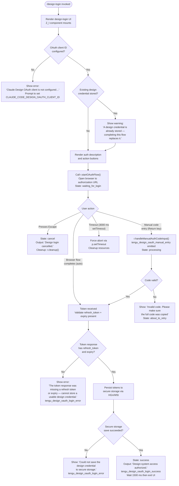

# `/design-login`

> Analysis basis: CC v2.1.187 bundle.js (AST extraction + Claude interpretation)
> Minimum version: v2.1.187

---

## Overview

`/design-login` initiates an OAuth 2.0 authorization flow that grants Claude Code access to the Anthropic design-system service (`claude.ai/design`), a credential distinct from the main session authentication. The command renders a local-JSX interactive UI that walks the user through opening a browser authorization URL, optionally entering an authorization code manually, and then persists the resulting tokens to secure storage for subsequent use by `/design-sync`. Existing design credentials are silently replaced when a new flow completes successfully.

---

## Registration

| Field | Value |
|---|---|
| type | `local-jsx` |
| name | `design-login` |
| description | `Authorize design-system access for /design-sync with your claude.ai account` |
| module_id | `eyl` |
| load_inline | `true` |
| loc_byte | `11631492` |
| loc_byte_end | `11631691` |
| loc_line | `7767` |
| arbor_handler.name | `nyl` |
| arbor_handler.fqn | `claude-2.1.187::nyl` |
| arbor_handler.kind | `Function` |
| arbor_handler.resolution_path | `direct` |
| arbor_handler.n_hits | `1` |

Analysis basis: CC v2.1.187 bundle.js:+11631492

The registration block spans bytes `(11631492, 11631691)`. The handler is inlined via a `load_inline` pattern; the Arbor symbol graph resolved it directly as `nyl` (function `rrf` in the call graph serves as the JSX-rendering entry point). The actual OAuth coordination component is `Z_l`.

---

## Input Branching

The command produces more than three distinct UI/state branches based on the OAuth flow state, keyboard events, and error conditions. A Mermaid flowchart is used.



Analysis basis: CC v2.1.187 bundle.js:+11625231 (component mount), +11625514 (`"success"` literal), +11625602 (`"error"` literal), +11625622 (`"escape"` branch), +11625711 (`"Design login cancelled."` literal), +11626172 (`r.handleManualAuthCodeInput`), +11626567 (`r.startOAuthFlow`), +11626646 (`p.setTimeout`), +11626669 (3000 ms timeout literal), +11627070 (`HGn` token save), +11627179 (`"Could not save the design credential…"` literal), +11627404 (1500 ms exit delay literal).

---

## Behavioral Spec

### Component Initialization (`Z_l`)

```
function designLoginComponent(props):
    [uiState, setUiState] = useState("starting")
    clockCtx   = useClockContext()        // throws if not inside ClockProvider
    termSize   = useTerminalSizeContext() // throws if not inside Ink App
    codeInputRef = useRef()
    maxWidth   = Math.max(termSize.columns, 50)  // minimum width: 50
    tabWidth   = 4

    oauthClientConfigured = checkDesignOAuthClientId()
    if not oauthClientConfigured:
        render error UI: "The Claude Design OAuth client is not configured…
                          Set CLAUDE_CODE_DESIGN_OAUTH_CLIENT_ID…"
        return

    existingCredential = loadStoredDesignCredential()
    if existingCredential:
        render notice: "A design credential is already stored —
                        completing this flow replaces it."

    // Mount: start OAuth flow
    useEffect():
        r.startOAuthFlow()
        setUiState("waiting_for_login")
        timeoutHandle = p.setTimeout(abortFlow, 3000)
        return cleanup:
            r.cleanup()
            clearTimeout(timeoutHandle)
            codeInputRef.forEach(dispose)
            codeInputRef.clear()
```

Analysis basis: CC v2.1.187 bundle.js:+11625231, +11625387, +11625451, +11626312, +11626344, +11626567, +11626646, +11626669, +11627973

### Keyboard Event Handling

```
function handleKeyEvent(key, input):
    if input == "escape":
        setUiState("cancel")
        displayMessage("Design login cancelled.")
        return

    if input == "return":
        rawCode = codeInputRef.current.value.split(delimiter)
        if not isValidCode(rawCode):
            setUiState("about_to_retry")
            displayMessage("Invalid code. Please make sure the full code was copied")
            return
        emit telemetry("tengu_design_oauth_manual_entry")
        setUiState("processing")
        r.handleManualAuthCodeInput(rawCode)
```

Analysis basis: CC v2.1.187 bundle.js:+11625525 (`I.preventDefault`), +11625622 (`"escape"`), +11625711, +11625775 (`"return"`), +11625815 (`"about_to_retry"`), +11625975 (`"Invalid code…"`), +11626048 (`"waiting_for_login"`), +11626134 (`tengu_design_oauth_manual_entry`), +11626172

### OAuth Token Exchange (`IO` / token-exchange function)

```
async function exchangeOAuthCode(code):
    response = await ho.post(
        getOAuthTokenEndpoint(Ls),
        { grant_type: "refresh_token", ... },
        {
            headers: { "Content-Type": "application/json" },
            timeout: 5000
        }
    )
    if ho.isAxiosError(response):
        emit telemetry("oauth_token_revoke") category "network"
        return error

    return response.data
```

Analysis basis: CC v2.1.187 bundle.js:+2143030 (`ho.post`), +2143090 (`"refresh_token"`), +2143145, +2143160, +2143188 (5000 ms), +2143198, +2143322

### Token Validation and Storage (`GHo` / `HGn`)

```
async function validateAndStoreTokens(tokenResponse):
    // Filter out any placeholder/test client entries (prefix "00000000-")
    validClients = Mpe.filter(c => not c.startsWith("00000000-"))

    tokens = IO(tokenResponse)
    if not tokens.refresh_token or not tokens.expiry:
        raise "The token response was missing a refresh token or expiry —
               cannot store a usable design credential."

    joined = tokens.join(separator)

    saveOk = await HGn.onlyIf(tokens)
    if not saveOk:
        emit telemetry("tengu_design_oauth_login_error")
        displayMessage("Could not save the design credential to secure storage.")
        return

    emit telemetry("tengu_design_oauth_login_success")
    setUiState("success")
    displayMessage("Design-system access authorized.")
    await sleep(1500)
    exitComponent()
```

Analysis basis: CC v2.1.187 bundle.js:+10088112 (`"00000000-"` prefix filter), +10088155 (`Mpe.filter`), +10088233, +10088345, +10088538 (`"missing a refresh token or expiry"` literal), +10084835 (`HGn → Gl`), +10084868 (`t.onlyIf`), +10085064 (`"Failed to save design OAuth tokens"`), +11627070, +11627179, +11627275 (`tengu_design_oauth_login_success`), +11627420 (`tengu_design_oauth_login_error`), +11627404 (1500 ms), +11625546 (`"Design-system access authorized."`)

### URL Display and Clipboard Assistance (`Z_l` render branch)

```
function renderAuthURLSection(authUrl, copied):
    render text: "Browser didn't open? Use the url below to sign in"
    render clickable URL: authUrl

    if copied:
        render inline: "(Copied!)"
    else:
        render button: "copy"
        on click: copyToClipboard(authUrl) via sv clipboard module
```

Analysis basis: CC v2.1.187 bundle.js:+11628079, +11628252, +11628817 (`"Browser didn't open?…"`), +11628913 (`"(Copied!)"`), +11628986 (`"copy"`), +11627797 (`sv` clipboard)

### OAuth URL Construction (`Ls` / `yGn`)

```
function buildOAuthUrl(env, clientId):
    baseUrl = switch env:
        "prod"    -> "https://claude.ai"  // derived from non-localhost endpoints
        "staging" -> production staging base
        default   -> one of:
                     "http://localhost:8000"
                     "http://localhost:4000"
                     "http://localhost:3000"
                     "http://localhost:8205"

    path = "/v1/toolbox/shttp/mcp/{server_id}"

    if CLAUDE_CODE_CUSTOM_OAUTH_URL set:
        validate against approved endpoint list
        if not approved:
            raise "CLAUDE_CODE_CUSTOM_OAUTH_URL is not an approved endpoint."
        suffix clientId with "-custom-oauth"
    else:
        suffix clientId with "-local-oauth"

    wellKnownClientId = "22422756-60c9-4084-8eb7-27705fd5cf9a"
    nullClientId      = "00000000-0000-4000-8000-000000000000"
    return constructed URL
```

Analysis basis: CC v2.1.187 bundle.js:+862533, +862807, +862894, +862984, +863481 (`"22422756-…"`), +863537 (`"00000000-…"`), +863594 (`"-local-oauth"`), +863623 (`"http://localhost:8205"`), +863662 (`"/v1/toolbox/shttp/mcp/{server_id}"`), +863768 (`"staging"`), +863928, +864444 (`"-custom-oauth"`), +863732, +863758

### Random Jitter Utility (`e`, referenced from `rrf`)

```
function generateJitter():
    // Used during retry scheduling
    base   = 2
    factor = 1
    return Math.random() * factor  // values in [0, 2)
    setTimeout(callback, jitterMs)
```

Analysis basis: CC v2.1.187 bundle.js:+14093348 (value `2`), +14093350 (`Math.random`), +14093364 (value `1`), +14093387 (`setTimeout`)

---

## State & Side Effects

| Item | Detail |
|---|---|
| Telemetry: `tengu_design_oauth_manual_entry` | Fired when user submits a manual auth code via the Return key (bundle.js:+11626134) |
| Telemetry: `tengu_design_oauth_login_success` | Fired after tokens are validated and persisted successfully (bundle.js:+11627275) |
| Telemetry: `tengu_design_oauth_login_error` | Fired when token response is invalid or secure-storage save fails (bundle.js:+11627428) |
| Telemetry: `tengu_daemon_config_reload` | Emitted by daemon config watcher reachable via `d → W` call path (bundle.js:+17212183) |
| Telemetry: `tengu_daemon_yield` | Background daemon yield event reachable via `x → W` (bundle.js:+17216595) |
| Telemetry: `tengu_mcp_skills` | MCP skills event fired via `eL → it` path (bundle.js:+6652661) |
| Telemetry: `tengu_config_auth_loss_prevented` | Safeguard against overwriting auth config; triggered via `hn` (bundle.js:+13747209) |
| Telemetry: `tengu_bg_retire_pinned_low_mem` | Background worker low-memory retirement (bundle.js:+17200753) |
| Telemetry: `tengu_bg_prewarm_per_sweep` | Background prewarm sweep (bundle.js:+17200874) |
| Telemetry: `tengu_feature_ok` / `tengu_feature_bad` / `tengu_feature_sad` | Feature-gate outcome events (bundle.js:+1025122, +1025189, +1025270) |
| Telemetry: `tengu_daemon_control` | Daemon control lifecycle event (bundle.js:+17233792) |
| Hook registration | `Ei` calls `b6o.register` — registers a process-level hook (bundle.js:+67325) |
| appState changes | UI state machine transitions: `starting → waiting_for_login → processing → success / error / cancel / about_to_retry` (bundle.js:+11625250, +11625514, +11625602) |
| Secure storage write | `HGn.onlyIf(tokens)` persists design OAuth tokens; replaces any prior credential (bundle.js:+10084868) |
| Clipboard | `sv` module copies the authorization URL to system clipboard (`pbcopy` on macOS, `wl-copy`/`xclip`/`xsel` on Linux, `powershell.exe Set-Clipboard` on Windows) (bundle.js:+11627797, +3548542, +3547304) |
| OAuth timeout | `p.setTimeout` enforces a 3000 ms maximum wait before aborting the flow (bundle.js:+11626646, +11626669) |
| Exit delay | After a successful token save, the UI waits 1500 ms before clearing itself (bundle.js:+11627404) |
| MCP cache file | Adjacent MCP subsystem writes `mcp-needs-auth-cache.json` for retry-backoff (bundle.js:+6858450) |
| Config safeguard | `saveGlobalConfig` fallback refuses to write if re-read config is missing auth that cache has, guarded by a known issue reference (bundle.js:+13747081) |
| Sound | <!-- TODO: not found in depth-2 traversal; needs --depth 4 --> |

---

## Version History

| Version | Change |
|---|---|
| v2.1.187 | Initial analysis — `local-jsx` OAuth login UI with manual code entry, clipboard copy, and secure-storage persistence |

---

## Common Mistakes

1. **Missing `CLAUDE_CODE_DESIGN_OAUTH_CLIENT_ID`** — Without this environment variable, the command immediately shows the "Claude Design OAuth client is not configured in this build" error and refuses to start the OAuth flow. Set the registered client ID before running `/design-login`. (bundle.js:+11626344)

2. **Using an unapproved custom OAuth URL** — Setting `CLAUDE_CODE_CUSTOM_OAUTH_URL` to a host not on the approved list raises "CLAUDE_CODE_CUSTOM_OAUTH_URL is not an approved endpoint." and aborts the flow. (bundle.js:+863928)

3. **Entering a partial authorization code** — The manual code entry path validates that the pasted value matches the expected format. Pasting only part of the code results in "Invalid code. Please make sure the full code was copied" and a retry state, not a hard error. (bundle.js:+11625975)

4. **Expecting the old credential to remain** — If a design credential already exists, completing this flow unconditionally replaces it with no undo path. The UI does display a warning, but there is no confirmation prompt. (bundle.js:+11628566)

5. **Remote sessions and the callback redirect** — On headless or remote environments, the browser redirect to `http://localhost:<port>/callback?code=...&state=...` will fail to load, but the URL in the address bar remains valid. Users must copy that full URL and paste it as the manual code; passing only the `code=` value is insufficient because the state parameter is also required. (bundle.js:+6650534, +6650677, +6651640)

6. **Assuming `/design-login` affects the main session auth** — This command is explicitly scoped to design-system access only. It does not modify the primary Claude Code session credential or any other authentication context. (bundle.js:+11628327)

---

## Appendix — Identifier Mapping

> For bundle debugging only. Identifiers change across versions.

| Identifier | Role |
|---|---|
| `nyl` | Arbor-resolved handler function (registration entry point) |
| `rrf` | JSX render wrapper / call-graph entry for the design-login command |
| `Z_l` | Main React component: design-login OAuth UI state machine |
| `Ts` | Clock context consumer (throws if outside `ClockProvider`) |
| `Hr` | Terminal size context consumer (throws if outside Ink App) |
| `IO` | OAuth token HTTP exchange function (axios POST) |
| `GHo` | Token validation and storage orchestrator |
| `HGn` | Secure-storage write helper (`onlyIf` guard) |
| `W5t` | Alternative token-save path / fallback storage writer |
| `q5t` | OAuth client configuration check / feature gate |
| `yGn` | OAuth URL builder dispatcher |
| `Ls` | Base URL resolver for OAuth endpoints |
| `kXo` | OAuth environment constant lookup |
| `dGc` | OAuth endpoint path formatter |
| `e` | Random jitter generator (used in retry scheduling) |
| `a` | MCP connection manager / update applier |
| `a9e` | MCP server connection orchestrator |
| `brr` | MCP connection result applier (`applyConnectionResult`) |
| `KT` | MCP slot cleanup coordinator |
| `uBo` | MCP client discovery and reconnect loop |
| `RB` | MCP registry builder |
| `y7` | MCP server descriptor processor |
| `xst` | MCP SSE/HTTP transport configurator |
| `iF` | MCP capability inheritance helper (`Object.create`) |
| `Qw` | MCP message queue writer |
| `eh` | MCP event dispatch helper |
| `mua` | MCP auth-cache read/write coordinator |
| `cZr` | Auth-cache file path resolver |
| `BUt` | Auth-cache writer |
| `tMn` | Auth-cache path joiner |
| `RLe` | Token hash generator (`sha256`/`hex`) |
| `fyn` | MCP fingerprint helper |
| `myn` | MCP token validator |
| `vT` | Token hash comparator |
| `pyn` | Global config path helper |
| `Gl` | Global config loader (`TWs`) |
| `zRn` | OAuth MCP tool registration wrapper |
| `JVd` | OAuth tool: `authenticate` (start OAuth flow, return auth URL) |
| `QVd` | OAuth tool: `complete_authentication` (exchange callback URL for tokens) |
| `ln` | MCP debug logger |
| `Vc` | MCP error logger |
| `be` | String coercion utility |
| `Me` | JSON serializer (`JSON.stringify`) |
| `eL` | MCP skills emitter |
| `it` | Skills registration helper |
| `ZXr` | MCP include/exclude filter |
| `hn` | Global config save guard (prevents auth-loss on write) |
| `sv` | Clipboard abstraction (pbcopy / wl-copy / xclip / xsel / powershell) |
| `vTi` | Clipboard copy dispatcher |
| `Un` | Clipboard write executor |
| `Wr` | Clipboard write with fallback |
| `a9r` | Platform clipboard selector (linux/macos/windows) |
| `Cf` | Clipboard tool runner |
| `Nxt` | OSC-52 terminal clipboard writer |
| `A_` | OSC-52 DCS sequence builder |
| `Nud` | tmux buffer clipboard writer |
| `i9r` | Screen terminal clipboard helper |
| `Uxt` | Native clipboard method selector |
| `Nw` | replaceAll-based clipboard string sanitizer |
| `tE` | Clipboard join helper |
| `CTi` | Clipboard chunk concatenator |
| `fd` | React context reader (useSyncExternalStore) |
| `W5t` | Token-save error logger / last-resort save path |
| `ke` | Logger / error handler for the command |
| `fo` | Error string coercion |
| `nt` | String normalizer |
| `Vi` | Log entry formatter |
| `jns` | Log entry serializer |
| `Qru` | Circular log buffer manager |
| `d` | Daemon write/supervisor coordinator |
| `Z8e` | File stat / read helper |
| `f$l` | File column formatter |
| `OEc` | Heartbeat sender |
| `E` | Daemon process manager |
| `A` | Worker config updater |
| `I` | Math-bounded value calculator |
| `x` | Daemon yield handler |
| `s` | Async operation tracker (add/finally/delete) |
| `l` | Daemon status file writer (`daemon.status.json`) |
| `JNl` | Status JSON serializer |
| `SQ` | Status formatter |
| `tVt` | Status path builder |
| `p` | Process timeout / forced-shutdown handler |
| `u` | Daemon abort controller |
| `Le` | Daemon feature-ok reporter |
| `Re` | Daemon feature-bad reporter |
| `Mt` | Daemon feature-sad reporter |
| `Pe` | Feature gate result publisher |
| `CU` | Daemon control event emitter |
| `q9` | Control message builder |
| `u$e` | Control socket writer |
| `aBr` | Control event broadcaster (`randomUUID`) |
| `X6` | Graceful-shutdown coordinator (`Promise.race`) |
| `Ome` | MCP shutdown helper |
| `Vme` | Shutdown timeout clearer |
| `Kn` | Connection timeout manager |
| `c` | Background session identifier |
| `w` | Worker sweep / retirement scheduler |
| `aj` | Worker blur/focus state tracker |
| `L` | Worker lifecycle manager (respawn/retire/prewarm) |
| `v` | Worker state reader |
| `fcc` | Worker context peek (`e.at`) |
| `mcc` | Worker context popper |
| `T` | Config/tool transformer |
| `Xwc` | Config path walker |
| `I6o` | Config node reader |
| `wc` | Path component extractor |
| `c8o` | Path map builder |
| `dze` | Config write dispatcher |
| `JWo` | Config file writer |
| `eLc` | Config file manager (read/write/rotate) |
| `FKe` | Buffered log writer (setTimeout/setImmediate flush) |
| `dpe` | Config path resolver |
| `Mre` | EISDIR error handler |
| `p8o` | Config path joiner |
| `Ocr` | Config file rotator (rename/unlink `.txt`) |
| `Zwc` | Config append-file writer (mkdir + appendFile) |
| `Ei` | Process hook registrar (`b6o.register`) |
| `W` | General-purpose event emitter / broadcaster |
| `tQr` | MCP tool query helper |
| `xRn` | MCP tool availability checker |
| `git` | Integer parser (radix 10) |
| `nMn` | Integer parser variant (radix 20) |
| `ZW` | Async iterator / stream adapter |
| `yua` | Stream type dispatcher |
| `zn` | Async continuation helper |
| `FUt` | Future/deferred resolver |
| `K4` | MCP SDK descriptor builder |
| `CRn` | MCP config error colorizer (red/yellow) |
| `Pst` | MCP server status builder |

Note: index built via Arbor fallback; some signals (telemetry, literals) may be missing — see arbor-fallback.js.