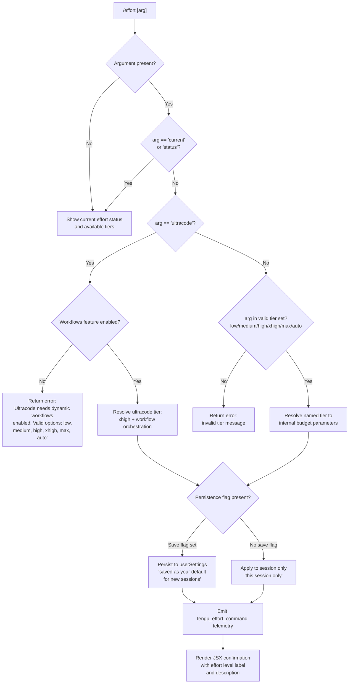

# `/effort`

> Analysis basis: CC v2.1.187 bundle.js (AST extraction + Claude interpretation)
> Minimum version: v2.1.187

---

## Overview

The `/effort` command sets the inference effort level applied to model requests for the current session or as a persistent default. It accepts a named tier from a fixed vocabulary (`low`, `medium`, `high`, `xhigh`, `max`, `ultracode`, `auto`) and translates that tier into internal model-budget parameters, optionally persisting the choice to user settings. The `ultracode` tier is a special compound mode that layers dynamic workflow orchestration on top of the `xhigh` effort level and requires the workflows feature to be enabled.

---

## Registration

| Field | Value |
|---|---|
| type | `local-jsx` |
| name | `effort` |
| description | `Set effort level for model usage` |
| argumentHint | `[low\|medium\|high\|xhigh\|max\|ultracode\|auto] \| [low\|medium\|high\|xhigh\|max\|auto]` |
| immediate | `null` |
| thinClientDispatch | `control-request` |
| module_id | `mNl` |
| load_inline | `true` |
| loc_byte | `12766588` |
| loc_byte_end | `12766919` |
| loc_line | `8695` |
| arbor_handler.name | `sEf` |
| arbor_handler.fqn | `claude-2.1.187::sEf` |
| arbor_handler.kind | `AsyncFunction` |
| arbor_handler.resolution_path | `module_id` |
| arbor_handler.n_hits | `2` |

Analysis basis: CC v2.1.187 bundle.js:+12766588

---

## Input Branching

The command has more than three distinct input paths (no argument / `current` / `status`, `ultracode` requiring workflows check, named tier with optional persistence flag, invalid tier), so a Mermaid flowchart is used.



Analysis basis: CC v2.1.187 bundle.js:+12764789, +12754836, +12753779, +12753823

---

## Behavioral Spec

### Handler Entry Point (`sEf`)

The Arbor-resolved handler is `sEf` (AsyncFunction, `claude-2.1.187::sEf`), reached via `module_id` resolution path from module `mNl`.

```
async function handleEffortCommand(rawArg, context):
    normalizedArg = rawArg.toLowerCase().trim()

    // Status / no-arg path
    if normalizedArg is empty OR normalizedArg in ["current", "status"]:
        return renderCurrentEffortStatus(context)

    // Ultracode special path
    if normalizedArg == "ultracode":
        if not workflowsEnabled(context):
            return errorMessage(
                "Ultracode needs dynamic workflows enabled (see /config)."
                + " Valid options are: low, medium, high, xhigh, max, auto"
            )
        tier = resolveUltracodeTier(context)   // xhigh + workflow orchestration
        label = "ultracode"
        description = "xhigh + workflows"
        goto applyTier

    // Standard named-tier path
    if normalizedArg not in validTiers:
        return errorMessage("Invalid effort level: " + normalizedArg)

    tier = resolveNamedTier(normalizedArg)
    label = normalizedArg
    description = tierDescription(normalizedArg)

    applyTier:
    emit("tengu_effort_command")

    if persistenceRequested(context):
        saveToUserSettings(tier)
        suffix = " (saved as your default for new sessions)"
    else:
        applyToSessionOnly(context, tier)
        suffix = " (this session only)"

    return renderJSX(label, description, suffix)
```

Analysis basis: CC v2.1.187 bundle.js:+12764789, +12764805, +12764807, +12764859

---

### Tier Vocabulary and Descriptions (`resolveNamedTier` / `qme` / `y$e`)

The valid tier set is checked via an `includes` call on a fixed array. Descriptions are static strings associated with each tier label.

```
VALID_TIERS = ["low", "medium", "high", "xhigh", "max", "auto"]
// ultracode handled separately

TIER_DESCRIPTIONS = {
    "low":    "Quick, straightforward implementation with minimal overhead",
    "medium": "Balanced approach with standard implementation and testing",
    "high":   "Comprehensive implementation with extensive testing and documentation",
    "xhigh":  // resolved via xhigh_effort internal key
    "max":    // resolved via max_effort internal key
    "auto":   // resolved via "unset" sentinel -> model default
}
```

- `"auto"` maps to the sentinel value `"unset"`, which instructs the model to use its default effort. Analysis basis: CC v2.1.187 bundle.js:+3375396, +3375424
- `"max"` maps to the internal key `"max_effort"`. Analysis basis: CC v2.1.187 bundle.js:+3373598, +3376115
- `"xhigh"` maps to the internal key `"xhigh_effort"`. Analysis basis: CC v2.1.187 bundle.js:+3374020
- The tier check fires on the string value `"effort"` as a feature gate identifier. Analysis basis: CC v2.1.187 bundle.js:+3373142

---

### Ultracode Tier (`uNl` / `sNl`)

`ultracode` is a composite tier that combines `xhigh` budget parameters with dynamic workflow orchestration. It is displayed with an animated "violet-ripple" particle effect in the UI.

```
function resolveUltracodeTier(context):
    // Guard: workflows feature must be enabled
    if not workflowsEnabled(context):
        raise "Ultracode needs dynamic workflows enabled"

    // Set internal budget to xhigh
    budget = resolveNamedTier("xhigh")

    // Attach workflow orchestration flag
    budget.workflows = true
    budget.displayLabel = "ultracode"
    budget.internalLabel = "xhigh + workflows"

    // UI animation constants
    PARTICLE_COUNT = 17         // initial seed
    PARTICLE_RADIUS = 8.5
    PARTICLE_ANIMATION_STEPS = 18
    WAVE_SPREAD = 4
    COLOR_THEME = "violet-ripple"

    return budget
```

- Particle animation uses `Math.cos`, `Math.sqrt`, `Math.round`, `Math.min`, `Math.floor`. Analysis basis: CC v2.1.187 bundle.js:+12759170, +12759069, +12757566
- The number constants `3`, `17`, `4`, `8.5`, `18` appear in the animation sub-functions. Analysis basis: CC v2.1.187 bundle.js:+12757484, +12757488, +12757577, +12757663, +12757759

---

### Workflows Feature Gate (`pSi` / `Js`)

Before allowing `ultracode`, the handler verifies that the `allow_workflows` feature flag is active for the current session.

```
function workflowsEnabled(context):
    featureFlags = getFeatureFlags(context)
    return featureFlags.has("allow_workflows")
```

- Feature flag key: `"allow_workflows"` Analysis basis: CC v2.1.187 bundle.js:+3372608
- A secondary flag `"allow_product_feedback"` is checked elsewhere in the feature-gate sub-system. Analysis basis: CC v2.1.187 bundle.js:+3352407
- The `"pro"` tier label and `"application-inference-profile"` are consulted during provider-type checks within the same gate path. Analysis basis: CC v2.1.187 bundle.js:+3373054, +2295577

---

### Model Compatibility Check (`FI` / `Eo`)

The tier resolver also inspects the active model identifier to determine which effort parameters are supported.

```
function resolveModelEffortSupport(modelId):
    // Models supporting effort levels
    SUPPORTED_MODELS = [
        "claude-opus-4-0", "claude-opus-4-1",
        "claude-sonnet-4-0", "claude-sonnet-4-5",
        "claude-haiku-4-5", "claude-fable-5",
        "claude-mythos-5", "claude-opus-4-8",
        "claude-opus-4-7", "claude-opus-4-6",
        "claude-sonnet-4-6", "claude-opus-4-5"
    ]
    // Legacy family check: any model starting with "claude-3-" is excluded
    if modelId.startsWith("claude-3-"):
        return NOT_SUPPORTED

    if modelId in SUPPORTED_MODELS:
        return SUPPORTED

    return UNKNOWN
```

- `"claude-3-"` prefix check: Analysis basis: CC v2.1.187 bundle.js:+3373201
- Full model list literals: Analysis basis: CC v2.1.187 bundle.js:+3373219 through +3373525

---

### Provider-Type Resolution (`bO` / `vH`)

The effort tier is further qualified by the active API provider type. Known provider types: `"firstParty"`, `"anthropicAws"`, `"foundry"`, `"mantle"`. Analysis basis: CC v2.1.187 bundle.js:+2131752, +2131770, +2131790, +2131805

```
function adjustTierForProvider(tier, providerType):
    if providerType == "firstParty":
        return tier   // full support
    if providerType in ["anthropicAws", "foundry"]:
        // effort applied locally; server may ignore
        return tier with note " (applied locally — this remote transport can't change server effort)"
    if providerType == "mantle":
        return tier   // pass through
    return tier
```

Analysis basis: CC v2.1.187 bundle.js:+12752833

---

### Persistence Path (`Oyf` / `$Br` / `it`)

When the user requests a permanent default, the handler writes the chosen tier into the settings layer.

```
function persistEffortSetting(tier):
    // Load current settings from disk
    settings = loadSettingsFromDisk()   // fires loadSettingsFromDisk_start / _end

    // Write the effort key under userSettings
    settings.userSettings.effort = tier

    // Save via atomic write (temp file → rename with fsync)
    saveUserSettings(settings)

    // Invalidate in-memory caches
    clearSettingsCache()
```

- Settings file path resolves to `~/.claude/settings.json` (global) or `settings.local.json` (local). Analysis basis: CC v2.1.187 bundle.js:+1317356, +1317366, +1317428
- Atomic write uses a temp file with `fchmodSync` + `fsyncSync` + `renameSync`. Analysis basis: CC v2.1.187 bundle.js:+1100736, +1100883, +1101092
- `tengu_slate_finch` telemetry fires during the settings-write sub-path. Analysis basis: CC v2.1.187 bundle.js:+3377496

---

### Status Display (`renderCurrentEffortStatus` / `sEf` status branch)

When invoked with no argument or the `current`/`status` keyword, the command renders a read-only view.

```
function renderCurrentEffortStatus(context):
    currentTier = readEffortFromState(context)
    if currentTier == "ultracode":
        return staticMessage(
            "Current effort level: ultracode"
            + " (xhigh + dynamic workflow orchestration; this session only)"
        )
    return renderJSX("status", currentTier, availableTierList())
```

- The ultracode status string is a fixed literal. Analysis basis: CC v2.1.187 bundle.js:+12753996
- The `argumentHint` includes `|ultracode` as an addendum only when workflows are enabled. Analysis basis: CC v2.1.187 bundle.js:+12752153

---

### `auto` Tier Explanation

The `auto` tier description is displayed to the user as a static hint string: `"- auto: Use the default effort level for your model"`. Analysis basis: CC v2.1.187 bundle.js:+12752549

---

### JSX Rendering (`nV` / `Ka.jsx`)

The confirmation view is a JSX component rendered inline. It uses an array of particle objects (`c`) that is built with `c.at`, `c.push`, `c.map` calls and animated via cosine/sqrt math helpers. The particle count starts at 5, grows to 7, then 9 in successive animation frames. Analysis basis: CC v2.1.187 bundle.js:+12759601, +12759621, +12759866

---

## State & Side Effects

| Item | Detail |
|---|---|
| Telemetry | `tengu_effort_command` (fired on every successful tier change, CC v2.1.187 bundle.js:+12754427); `tengu_slate_finch` (settings-write path, +3377496); `tengu_workflows_enabled` (workflow gate check, +3372809); `tengu_feature_ok` (+1025122); `tengu_feature_bad` (+1025189); `tengu_feature_sad` (+1025270); `tengu_config_auth_loss_prevented` (+13747209) |
| Settings write | `userSettings.effort` updated in `~/.claude/settings.json` when persistence is requested; atomic rename+fsync pattern used |
| Session state | Effort tier written to in-memory session state when persistence is not requested (session-only mode) |
| Settings cache | In-memory settings caches (`YYt`, `xsr`) cleared after a write. Analysis basis: CC v2.1.187 bundle.js:+29197, +29209 |
| Feature gate | Reads `allow_workflows` feature flag before permitting `ultracode` |
| UI animation | Particle animation rendered via JSX for the `ultracode` tier; uses `Math.cos`, `Math.sqrt`, `Math.round`, `Math.floor`, `Math.min`, `setTimeout`, `Math.random` |
| Hook registration | <!-- TODO: not found in depth-2 traversal; needs --depth 4 --> |
| Sound | <!-- TODO: not found in depth-2 traversal; needs --depth 4 --> |

---

## Version History

| Version | Change |
|---|---|
| v2.1.187 | Initial analysis |

---

## Common Mistakes

1. **Using `ultracode` without enabling workflows.** The command will reject `ultracode` and show an error pointing to `/config` if the `allow_workflows` feature flag is not active in the current session.
2. **Expecting `ultracode` to persist across sessions.** The `ultracode` status message explicitly says "(this session only)"; the underlying `xhigh` budget may be saved, but the workflow orchestration layer is re-evaluated at session start.
3. **Passing `auto` when a specific budget is needed.** `auto` maps to the internal `"unset"` sentinel, which means the model chooses its own effort level; it does not guarantee any particular budget.
4. **Using effort tiers with `claude-3-*` models.** The model compatibility check excludes the entire `claude-3-` family; the tier may be silently ignored or rejected.
5. **Assuming the tier takes effect on remote transports.** For providers `anthropicAws` and `foundry`, effort is applied locally and the server may not honor the setting, as indicated by the warning suffix appended to the confirmation message.
6. **Omitting the argument and expecting a change.** Invoking `/effort` with no argument (or with `current`/`status`) is a read-only status display; no state is modified.

---

## Appendix — Identifier Mapping

> For bundle debugging only. Identifiers change across versions.

| Identifier | Role |
|---|---|
| `sEf` | Main handler for `/effort` command (AsyncFunction; Arbor-resolved) |
| `zYn` | Outer command wrapper / dispatch entry |
| `tZ` | Effort command orchestrator |
| `fb` | Feature flag resolver |
| `MSn` | Feature name normalizer |
| `nt` | String converter utility |
| `qL` | Configuration reader |
| `pSi` | Workflows feature gate checker |
| `Js` | Feature set membership tester |
| `NBr` | Telemetry emission helper |
| `Zad` | Telemetry event builder |
| `Qad` | Config value accessor |
| `eZ` | Tier resolution dispatcher |
| `FI` | Model-effort compatibility checker |
| `Eo` | Provider-type extractor |
| `bO` | Provider kind classifier |
| `vH` | Provider-type-to-effort adjuster |
| `S$e` | Special model tier resolver (opus-4-7, opus-4-8, fable-5) |
| `Dt` | Settings state updater |
| `XG` | Settings cache invalidator |
| `USn` | Effort budget builder for `ultracode`/workflows |
| `E$e` | Numeric effort-level parser |
| `kU` | Integer budget parser (parseInt / isNaN) |
| `_$e` | `max_effort` tier handler |
| `eCe` | `xhigh_effort` tier handler |
| `Nu` | Settings value reader |
| `QPe` | Global config accessor |
| `sD` | Tier label → description mapper |
| `qme` | Tier description lookup |
| `y$e` | Tier membership validator (gx.includes) |
| `Qse` | String-coercion helper for tier label |
| `$Br` | Settings persistence writer |
| `eld` | Settings file locator |
| `Mfe` | Settings file serializer |
| `xi` | Settings write orchestrator |
| `jLr` | Settings pre-write validator |
| `zLr` | Settings schema checker |
| `ay` | Config write executor |
| `it` | Settings save dispatcher |
| `V9` | Settings queue manager |
| `q9` | Settings write queue |
| `hSn` | Deduplication tracker for settings writes |
| `lBr` | Settings write batch processor |
| `mBr` | Settings write finalizer |
| `fNl` | Particle cosine animation function |
| `pNl` | Particle sqrt animation function |
| `uNl` | Ultracode particle animation orchestrator |
| `sNl` | Particle array slicer/mapper |
| `j9` | Effort-state reader |
| `KYn` | Current-effort display renderer |
| `ys` | Model config reader |
| `v9` | Model identifier fetcher |
| `S_` | Session model extractor |
| `lG` | Model list loader |
| `Ba` | Model policy resolver |
| `uCt` | Policy constants loader |
| `dCt` | Policy key enumerator |
| `zNe` | Model string normalizer |
| `Lfe` | Model tier mapper |
| `nl` | String replacement utility |
| `KNe` | Model family prefix checker |
| `ix` | Known-model-string checker |
| `gfn` | Model label builder |
| `wGs` | Model entry formatter |
| `Tn` | Policy settings writer |
| `$Xe` | Provider entry iterator |
| `vGs` | Model index finder |
| `p3u` | Model policy applier |
| `Qo` | Model name normalizer / alias resolver |
| `kwt` | Model alias expander |
| `f3u` | Model prefix stripper |
| `Kg` | Model config builder |
| `vw` | CLAUDE.md / context file parser |
| `mRr` | Context file line parser |
| `Sfn` | Context file section builder |
| `Efn` | Context file header extractor |
| `jYn` | `/effort` JSX component renderer |
| `Nyf` | No-argument (status) render path |
| `_Ro` | Remote-transport warning injector |
| `$S` | Remote transport warning reader |
| `Hxt` | Settings-load-then-render orchestrator |
| `tCe` | Tier label display formatter |
| `ao` | Settings loader (disk → memory) |
| `Jm` | Settings schema validator |
| `Wt` | File path resolver |
| `QEr` | Settings file reader |
| `l2` | Settings schema parser |
| `DC` | XDG config path resolver |
| `kn` | Error code classifier |
| `T` | Log / debug emitter |
| `lEr` | Timestamp cache setter |
| `Q1e` | Settings migration runner |
| `oIt` | Atomic file write (fsync + rename) |
| `Me` | JSON stringifier |
| `bH` | Settings memory cache clearer |
| `Fis` | Git-ignore / gitignore file writer |
| `g9` | `.claude` directory path builder |
| `gr` | Global config path getter |
| `Le` | Feature-ok telemetry emitter |
| `Mt` | Feature-sad telemetry emitter |
| `Re` | Feature-bad telemetry emitter |
| `PG` | Settings save orchestrator |
| `ke` | Settings write error handler |
| `O2` | Effort UI component renderer |
| `hn` | Global config saver |
| `W` | Telemetry event emitter |
| `Ve` | React key helper |
| `rKe` | Component key generator |
| `Uyf` | With-save-flag render path |
| `fet` | Argument trimmer and tier validator |
| `Oyf` | Session-only render path |
| `nV` | Ultracode particle animation JSX component |
| `c` | Particle array accumulator |
| `En` | Animation frame scheduler |

---

Note: index built via Arbor fallback; some signals (telemetry, literals) may be missing — see arbor-fallback.js.