# `/exit`

> Analysis basis: CC v2.1.187 bundle.js (AST extraction + Claude interpretation)
> Minimum version: v2.1.187

---

## Overview

The `/exit` command (also available as `/quit`) terminates the Claude Code CLI session. When invoked, it displays a "Goodbye!" farewell message, performs an orderly shutdown sequence — flushing output, unmounting the UI, retiring background workers, and optionally writing a startup-performance report — and then calls `process.exit` to terminate the Node/Bun process.

---

## Registration

| Field | Value |
|---|---|
| type | `local-jsx` |
| name | `exit` |
| description | `null` |
| aliases | `["quit"]` |
| immediate | `true` |
| module_id | `NOl` |
| load_inline | `true` |
| loc_byte | `12680095` |
| loc_byte_end | `12680291` |
| loc_line | `8675` |
| arbor_handler.name | `N_f` |
| arbor_handler.fqn | `claude-2.1.187::N_f` |
| arbor_handler.kind | `AsyncFunction` |
| arbor_handler.resolution_path | `module_id` |
| arbor_handler.n_hits | `1` |

Analysis basis: CC v2.1.187 bundle.js:+12680095

---

## Input Branching

The command has more than three distinct execution paths through the shutdown flow, so a Mermaid flowchart is used.

```mermaid
flowchart TD
    A["/exit or /quit invoked"] --> B["immediate: true — handler N_f fires synchronously"]
    B --> C["Display 'Goodbye!' farewell via JSX component O_f/tR"]
    C --> D["Call session-state updater Ws\n(checks bg/daemon/daemon-worker modes)"]
    D --> E{"Background/daemon session?"}
    E -- "bg or daemon" --> F["Send detach-request message via pye/a6\n(writes JSON to Qte.write)"]
    E -- "normal foreground" --> G["Skip detach path"]
    F --> H["Proceed to UI teardown"]
    G --> H
    H --> I["Random easter-egg delay via e / Math.random + setTimeout\n(values 1 or 2)"]
    I --> J["Build shutdown summary via CVn\n(collects scheduled tasks via bYp, formats durations via Ui/La)"]
    J --> K["Call gi — main async shutdown orchestrator"]
    K --> L["Flush stdout/stderr — fHe.writeSync"]
    L --> M["Unmount Ink UI — U9e / e.unmount"]
    M --> N["Write terminal state restore sequences via yTn\n(ESC-7 / ESC-8, terminal-specific handling)"]
    N --> O["Emit session_end telemetry via Ve/Rr"]
    O --> P["Flush telemetry drain — $Ke / b6o.drain"]
    P --> Q["Write startup-perf report if enabled — QSt\n(writes UTF-8 JSON via JSe / ape.writeFileSync)"]
    Q --> R{"Outstanding background tasks?"}
    R -- "yes" --> S["Wait up to max(5000, 3500) ms via Promise.race\n(AbortSignal.timeout)"]
    R -- "no" --> T["Proceed immediately"]
    S --> T
    T --> U["Retire/abort background workers via $ga\n(Promise.allSettled + Array.from)"]
    U --> V["Write scroll-summary / scroll stats via oPn\n(tengu_scroll_summary telemetry)"]
    V --> W["Cache-eviction hint — tengu_cache_eviction_hint"]
    W --> X["Final fHe.writeSync flush"]
    X --> Y["Gto: clearTimeout, du.get, then process.exit\nor process.kill if hard-exit path"]
    Y --> Z["Process terminates"]
```



Analysis basis: CC v2.1.187 bundle.js:+12679354 through +12679527

---

## Behavioral Spec

### 1. Handler Entry — `exitCommandHandler` (`N_f`)

```
async function exitCommandHandler(context):
    display farewell component ("Goodbye!" literal)        // +12679318
    sessionStateUpdater(context)                           // Ws, +12679354
    randomDelayHelper(1, 2)                                // e, +12679366
    shutdownSummaryBuilder(context)                        // pye, +12679370
    sessionStateMarker(context)                            // Hm, +12679387
    asyncShutdownOrchestrator(context)                     // CVn, +12679401
    render JSX farewell UI                                 // UOl.jsx, +12679431
    farewellComponentWrapper()                             // O_f, +12679514
    mainShutdownFlow()                                     // gi, +12679527
    emit "prompt_input_exit" telemetry literal             // +12679532
```

Analysis basis: CC v2.1.187 bundle.js:+12679354

### 2. Farewell Display — `farewellComponent` (`O_f` / `tR`)

The JSX-rendered farewell component displays the string `"Goodbye!"` (literal at bundle.js:+12679318) to the terminal before any teardown begins. This is a `local-jsx` type command, so the component is rendered inline via `UOl.jsx` (+12679431).

Analysis basis: CC v2.1.187 bundle.js:+12679309

### 3. Session State Update — `sessionStateUpdater` (`Ws` → `nUe`)

```
function sessionStateUpdater(context):
    mode = context.mode   // checked against "bg", "daemon", "daemon-worker"
    nUe(mode)             // +2309225
    // literals found: "bg" (+2309148), "daemon" (+2309158), "daemon-worker" (+2309172)
```

If the session is running as a background (`bg`), `daemon`, or `daemon-worker` process, the state is updated accordingly before the UI teardown begins.

Analysis basis: CC v2.1.187 bundle.js:+12679354

### 4. Detach-Request Path — `detachRequestWriter` (`pye` → `a6` → `Qte.write`)

```
function detachRequestWriter(context):
    Nfn(context)                          // +11195972
    taskList = ipl(context)               // +11195991
    // ipl calls b8n (+11190030) with value 0, and En (+11190082) with "task"
    a6(taskList)                          // +11196000
    // a6 calls Qte.write (+10685945) — writes JSON-serialised detach-request
    // a6 calls Me which calls JSON.stringify (+192118)
    // literal "detach-request" sent as message type (+11196009)
    rue(context)                          // +11196085
```

When running in a managed session mode, the command sends a `"detach-request"` message to the supervisor before tearing down the UI.

Analysis basis: CC v2.1.187 bundle.js:+11196009

### 5. Shutdown Summary Builder — `shutdownSummaryBuilder` (`CVn`)

```
function shutdownSummaryBuilder(context):
    columnWidthHelper = gI(context)        // +11188763
    taskSummaries = []
    for each scheduled task in context:
        parsed = scheduledTaskParser(task) // bYp, +11188831
        if parsed:
            taskSummaries.push(parsed)     // t.push, +11188790
    formatted = columnTruncator(taskSummaries)   // La, +11188846
    return formatted
```

`bYp` (schedule-expression parser) internally calls:
- `expressionParser` (`xD`) — parses cron-like expressions, calls `parseInt`, `e.trim`, `o.match` (+4925748–+4925924)
- `cronLineParser` (`c1`) — splits lines, delegates to `dMd` (+4924663)
- `timeResolver` (`wrt`) — resolves relative times using `Date` methods (+4924969–+4925370)
- `durationFormatter` (`Ui`) — formats millisecond durations using `Math.floor`/`Math.round` (+220262–+220389)

Known duration literals: `60000` ms, `86400000` ms, `3600000` ms, `1000` ms, `"0s"` (+220187–+220421).

Analysis basis: CC v2.1.187 bundle.js:+11188763

### 6. Main Async Shutdown Orchestrator — `mainShutdownFlow` (`gi`)

```
async function mainShutdownFlow(context):
    await Promise.resolve()                     // +7231663
    sessionWriter = Wd(context)                 // +7231693
    o(context)                                  // +7231706
    timeoutId = setTimeout(callback, ...)       // +7231714
    terminalWriter = U9e(context)               // unmount UI, +7231731
    scrollSummaryWriter = Bto(context)          // +7231737
    cleanupFinalizer = Gto(context)             // process.exit path, +7231743
    waitMs = Math.max(5000, 3500)               // +7231751, literals at +7231760, +7231767
    timer = E0e.unref(setTimeout(waitMs))       // +7231776
    await $Ke()                                 // drain b6o, +7231856
    result = await Promise.race([...])          // +7231880
    clearTimeout(timeoutId)                     // +7231957
    await $ga()                                 // retire all settled bg tasks, +7232005
    r(context)                                  // +7232028
    signal = AbortSignal.timeout(2000)          // +7232045, literal at +7231945
    await QSt(signal)                           // write startup-perf report, +7232081
    oPn(context)                                // scroll summary, +7232094
    W(context)                                  // +7232117
    Ve(context)                                 // session_end telemetry, +7232154
    Rr(context)                                 // nonconforming path cleanup, +7232188
    $9e(context)                                // final promise resolution, +7232205
    fHe.writeSync(...)                          // final stdout flush, +7232231
```

Analysis basis: CC v2.1.187 bundle.js:+7231663

### 7. UI Unmount & Terminal Restoration — `uiUnmounter` (`U9e`) and `terminalSequenceWriter` (`yTn`)

```
function uiUnmounter(context):
    fHe.writeSync(...)          // flush before unmount, +7228663
    instance = du.get(context)  // +7228690
    instance.unmount()          // +7228741
    OU(context)                 // +7228775
    terminalSequenceWriter()    // yTn, +7228823

function terminalSequenceWriter():
    RZ.writeSync(ESC_SAVE)      // "\x1b7" cursor-save sequence, +3899423, +3899577
    Q$e()                       // terminal version checker, +3899597
    // Q$e checks for "ghostty" >= "1.2.0", "iTerm.app" >= "3.6.6" (+3623279–+3623380)
    V$e()                       // +3899626
    Nw()                        // tmux/screen escape replacement, +3899647
    // Nw replaces "\x1b\x1b" in tmux/screen contexts (+3546850, +3546896, +3546923)
    sp()                        // +3899668
    T()                         // debug-log formatter, +3899674
    RZ.writeSync(ESC_RESTORE)   // "\x1b8" cursor-restore sequence, +3899588
```

Analysis basis: CC v2.1.187 bundle.js:+7228663

### 8. Scroll Summary Emitter — `scrollSummaryWriter` (`Bto`)

```
function scrollSummaryWriter(context):
    cw(context)                         // +7228951
    B3(context)                         // +7228958
    kt(context)                         // VL-based, +7228973
    XFt(context)                        // path/stat check, +7228982
    // XFt: M$ (+13223976), Ag (+13223982), gr (+13223985), Qh.join (+13223993)
    // XFt: r.statSync (+13224035)
    ph(context)                         // +7229002
    // ph: kt (+13261284), Rc -> Ei (+13261296)
    escaped = t.replaceAll("\\\\", "\\\"")  // escape backslashes/quotes, +7229021
    vga(context)                        // +7229088
    fHe.writeSync(...)                  // write scroll summary, +7229120
    St.dim(...)                         // dim styling, +7229136
```

Analysis basis: CC v2.1.187 bundle.js:+7228951

### 9. Process Termination — `processTerminator` (`Gto`)

```
function processTerminator(context):
    clearTimeout(pendingTimer)   // +7229247
    instance = du.get(context)   // +7229280
    if graceful:
        process.exit(0)          // +7229328
    else:
        process.kill(pid, ...)   // +7229353
    // If unreachable state reached: throw Error("unreachable") // +7229395, +7229401
```

The `p` function (reached via `xD` → `p`) also contains a direct `process.exit` call (+17230133) guarded by `Kb` and preceded by `u.abort` (+17230154), representing the forced-shutdown path with literal `"forced shutdown"` (+17230114).

Analysis basis: CC v2.1.187 bundle.js:+7229247

### 10. Startup Performance Report — `startupPerfReporter` (`QSt`)

```
async function startupPerfReporter(abortSignal):
    Xcr(context)                // +224755 — collect perf marks
    // M8o: K3.require("perf_hooks") (+223541, +223549)
    // M8o: r.set/r.get/Object.entries (+225452–225540)
    // M8o: Math.round/Math.max/Number.parseInt/Number.isFinite (+225646–226240)
    w8o(context)                // +224770 — write report to disk
    // w8o: YSt.dirname, Wt, JSe(ape.openSync/writeFileSync/fsyncSync/closeSync)
    // w8o: JSON.stringify, T8o (formats checkpoints), K3 (require)
    // w8o: encoding "utf8" (+224910)
    // Literals: "startup-perf" (+225239), "STARTUP PROFILING REPORT" (+224426)
    //           "Startup profiling not enabled" (+224261)
    //           "No profiling checkpoints recorded" (+224351)
    //           "main_after_run" (+225490), "mark" (+225387)
    emit tengu_startup_perf     // +226441
```

The report is gated: if startup profiling was not enabled or no checkpoints exist, the function returns early with the corresponding sentinel string. Otherwise it writes a UTF-8 JSON file and emits the `tengu_startup_perf` telemetry event.

Analysis basis: CC v2.1.187 bundle.js:+224755

### 11. Background Worker Retirement — `bgWorkerReaper` (`$ga`)

```
async function bgWorkerReaper():
    results = await Promise.allSettled(Array.from(activeWorkers))  // +13325489, +13325508
    // retire each settled worker
```

Analysis basis: CC v2.1.187 bundle.js:+7232005

---

## State & Side Effects

| Item | Detail |
|---|---|
| Telemetry — `tengu_scroll_summary` | Emitted during scroll-summary write step (`oPn`), loc +7231176 |
| Telemetry — `tengu_cache_eviction_hint` | Emitted after scroll summary, loc +7232119 |
| Telemetry — `tengu_startup_perf` | Emitted if startup profiling was active, loc +226441 |
| Telemetry — `tengu_amber_creek` | Emitted from UI-mode selector (`bs`), loc +3556463 |
| Telemetry — `tengu_pewter_brook` | Emitted from UI-mode selector (`bs`), loc +3556371 |
| Telemetry — `tengu_bg_dispatch_sigkill_escalate` | Emitted in bg-worker forced-kill path, loc +17196063 |
| Telemetry — `tengu_bg_dispatch_low_mem` | Emitted when free memory is low during bg shutdown, loc +17196664 |
| Telemetry — `tengu_bg_spare_enable` | Emitted when a spare bg session is promoted, loc +17197361 |
| Telemetry — `tengu_bg_spare_claim` | Emitted when a spare session is claimed, loc +17197489 |
| Telemetry — `tengu_bg_spare_claim_fail` | Emitted on spare-claim failure, loc +17197755 |
| Telemetry — `tengu_daemon_yield` | Emitted when daemon yields to foreground, loc +17216595 |
| Telemetry — `tengu_daemon_config_reload` | Emitted when daemon config is reloaded at shutdown, loc +17212183 |
| `prompt_input_exit` literal | Logged/emitted at handler exit, loc +12679532 |
| `session_end` literal | Sent via `Ve` / `Rr` at end of shutdown, loc +7232157 |
| Terminal sequences | ESC-7 (cursor save, +3899577) and ESC-8 (cursor restore, +3899588) written to restore terminal state |
| tmux/screen escape fixup | Double-escape sequences replaced for tmux and screen compatibility (+3546850–+3546923) |
| Ink UI | Unmounted via `e.unmount()` through `U9e` (+7228741) |
| `process.exit` | Called in `Gto` (+7229328) or forced via `p` (+17230133) |
| `process.kill` | Called in hard-exit path within `Gto` (+7229353) |
| Stdout/stderr flush | `fHe.writeSync` called multiple times: pre-unmount (+7228663), scroll-summary (+7229120), final (+7232231) |
| Background session detach | `"detach-request"` JSON message sent via `Qte.write` (+10685945) for bg/daemon sessions |
| Startup perf file | Written via `ape.writeFileSync` + `ape.fsyncSync` if profiling active (+192685, +192729) |
| Drain | `b6o.drain()` awaited via `$Ke` before process exit (+67368) |
| AbortSignal timeout | 2000 ms timeout on startup-perf write (+7231945) |
| Shutdown wait | `Math.max(5000, 3500)` = 5000 ms maximum wait for outstanding tasks (+7231760, +7231767) |

---

## Version History

| Version | Change |
|---|---|
| v2.1.187 | Initial analysis |

---

## Common Mistakes

1. **Confusing `/exit` with a prompt command**: Because `immediate: true` is set, the command fires its handler synchronously before any agent turn is initiated. It does not send a message to the AI model.
2. **Expecting instant termination**: The shutdown sequence can take up to 5 000 ms waiting for background tasks (`Math.max(5000, 3500)`) plus up to 2 000 ms for the startup-perf report flush. Users should not force-close the terminal immediately.
3. **Ignoring the `/quit` alias**: The command is registered with `aliases: ["quit"]`, so `/quit` is fully equivalent to `/exit`.
4. **Assuming the same behaviour in daemon/background sessions**: When running as a `bg`, `daemon`, or `daemon-worker` session, the command sends a `"detach-request"` message rather than immediately tearing down, which may delay or modify the visible shutdown behaviour.
5. **Terminal state corruption**: If the process is killed externally mid-shutdown (before ESC-8 is written), cursor-position state may be left in an inconsistent state, especially under tmux or screen.

---

## Appendix — Identifier Mapping

> For bundle debugging only. Identifiers change across versions.

| Identifier | Role |
|---|---|
| `N_f` | Main exit command handler (`exitCommandHandler`) — AsyncFunction, Arbor-resolved |
| `Ws` | Session state updater — checks bg/daemon/daemon-worker mode |
| `nUe` | Inner session-mode setter called by `Ws` |
| `pye` | Detach-request writer — sends detach message for managed sessions |
| `Nfn` | Helper called by detach-request writer |
| `ipl` | Task-list collector for detach path |
| `b8n` | Sub-helper of task-list collector (numeric arg 0) |
| `En` | Sub-helper of task-list collector ("task" type) |
| `a6` | JSON-over-socket writer (calls `Qte.write`) |
| `Me` | JSON serialiser wrapper (calls `JSON.stringify`) |
| `rue` | Post-detach cleanup helper |
| `Hm` | Session state marker called after detach path |
| `CVn` | Shutdown summary builder — collects and formats scheduled-task info |
| `gI` | Column-width helper inside summary builder |
| `VL` | Low-level value-lookup utility (used in multiple contexts) |
| `bYp` | Schedule-expression parser — parses cron/schedule strings |
| `xD` | Cron-expression tokeniser |
| `c1` | Cron-line parser |
| `dMd` | Cron-field parser (splits, matches, parseInt) |
| `wrt` | Relative-time resolver using `Date` methods |
| `Ui` | Duration formatter (`Math.floor` / `Math.round`) |
| `La` | Column truncator / text-width formatter |
| `sn` | String-width measurer (calls `Bun.stringWidth`) |
| `Rs` | ANSI-aware string renderer |
| `By` | ANSI helper used by `Rs` |
| `O_f` | Farewell JSX component wrapper |
| `gi` | Main async shutdown orchestrator |
| `U9e` | UI unmounter — flushes stdout then calls `e.unmount()` |
| `OU` | Post-unmount cleanup helper |
| `yTn` | Terminal sequence writer (ESC-7/ESC-8, terminal detection) |
| `Q$e` | Terminal-version checker (ghostty, iTerm) |
| `V$e` | Post-terminal-check step |
| `Nw` | tmux/screen escape-sequence fixup |
| `sp` | Terminal state step called by `yTn` |
| `T` | Debug-log / ANSI formatter |
| `Bto` | Scroll summary writer |
| `cw` | Helper within scroll summary |
| `B3` | Helper within scroll summary |
| `kt` | VL-based path helper |
| `XFt` | Path/stat existence checker |
| `M$` | Module reference used by `XFt` |
| `gr` | Module reference used by `XFt` |
| `Wt` | Filesystem path utility |
| `ph` | Additional path handler inside scroll summary |
| `Rc` | Resolver called by `ph` |
| `vga` | Scroll stats formatter |
| `Gto` | Process terminator (`process.exit` / `process.kill`) |
| `$Ke` | Telemetry drain awaiter (calls `b6o.drain`) |
| `d` | Background-supervisor session manager |
| `Z8e` | Supervisor file-stat helper |
| `cn` | Helper called by `Z8e` |
| `Xs` | Async-store getter (`$Fu.getStore`) |
| `vxo` | Sub-helper of supervisor manager |
| `be` | String coercion wrapper |
| `f$l` | Column-width calculator for supervisor output |
| `E` | Worker stop controller |
| `FUt` | Worker controller helper |
| `eyt` | Worker event helper |
| `A` | Animated worker controller (start/stop/updateConfig) |
| `_` | MCP connection manager (connect/disconnect) |
| `OEc` | Heartbeat configurator |
| `Xse` | Heartbeat sub-helper |
| `I` | Input handler / scroll controller |
| `x` | Transient daemon I/O writer |
| `W` | Generic write/state helper (used in multiple contexts) |
| `$ga` | Background-worker reaper (`Promise.allSettled`) |
| `QSt` | Startup-performance report writer |
| `Xcr` | Perf-mark collector |
| `M8o` | Perf-entry aggregator |
| `w8o` | Perf-report file writer |
| `R8o` | Report path builder |
| `JSe` | Sync file writer (openSync/writeFileSync/fsyncSync/closeSync) |
| `T8o` | Checkpoint formatter |
| `K3` | `require("perf_hooks")` wrapper |
| `x8o` | Secondary path builder |
| `oPn` | Scroll-summary telemetry emitter |
| `Cga` | Helper within `oPn` |
| `Iga` | Scroll-stats calculator (`Date.now`, `Math.max`, `Math.round`) |
| `bga` | Sub-helper of `Iga` |
| `bs` | UI-mode selector (fullscreen / default / local-agent) |
| `J$` | Feature-flag checker (`stu.has`) |
| `mx` | Analytics-enabled checker (`ali.isEnabled`) |
| `p9r` | Mode-config reader |
| `fZ` | Fullscreen-mode helper |
| `d9r` | Boolean-mode resolver |
| `Ur` | UI-mode finaliser |
| `zud` | Amber-creek telemetry emitter path |
| `it` | Telemetry event dispatcher |
| `oEt` | Post-scroll-summary step |
| `Ve` | Session-end telemetry emitter |
| `rKe` | Low-level telemetry recorder |
| `Rr` | Nonconforming-session cleanup |
| `Ng` | Helper within `Rr` |
| `$9e` | Final promise-resolution wrapper |
| `ePn` | Sub-helper of `$9e` |

---

Note: index built via Arbor fallback; some signals (telemetry, literals) may be missing — see arbor-fallback.js.