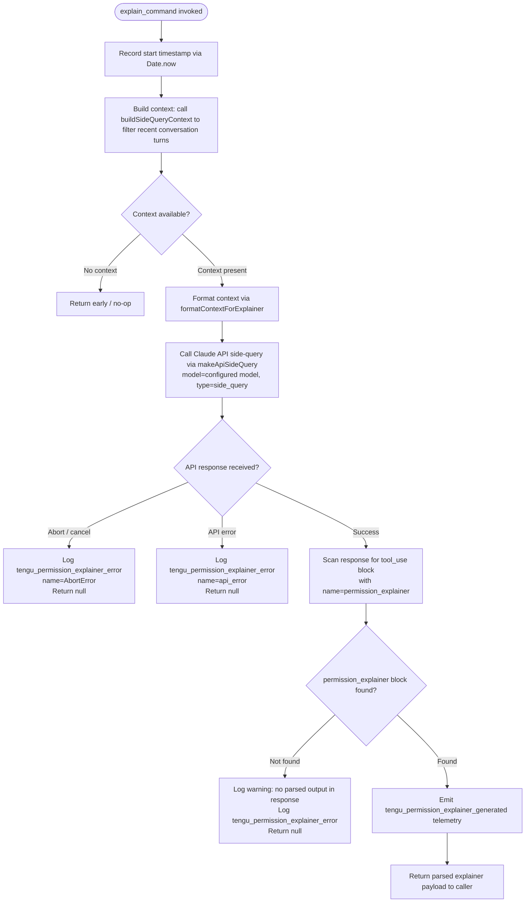

# `/explain_command`

> Analysis basis: CC v2.1.187 bundle.js (AST extraction + Claude interpretation)
> Minimum version: v2.1.187

---

## Overview

The `explain_command` tool is an internal Claude Code command that generates a natural-language explanation of why a given tool use action requires a specific permission. It fires a side-query to the Claude API — using a reduced conversation context (recent assistant turns) — and returns a parsed `permission_explainer` block that the UI can surface to the user. This command is registered as a `tool` type (not a user-facing slash command) and is invoked programmatically when the permission-approval UI needs to explain an action.

---

## Registration

| Field | Value |
|---|---|
| type | `tool` |
| name | `explain_command` |
| description | `null` |
| loc_byte | `14570780` |
| loc_byte_end | `14570816` |
| loc_line | `11161` |
| arbor_handler.name | `_Zl` |
| arbor_handler.fqn | `claude-2.1.187::_Zl` |
| arbor_handler.kind | `AsyncFunction` |
| arbor_handler.resolution_path | `direct` |
| arbor_handler.n_hits | `1` |

Analysis basis: CC v2.1.187 bundle.js:+14570780

---

## Input Branching

The handler has 4+ distinct branches (context filtering, API call, response parsing, error handling), so a Mermaid flowchart is used.



Analysis basis: CC v2.1.187 bundle.js:+14570475 (call to side-query builder), +14570685 (API dispatch), +14570878 (response scan), +14571263 (success telemetry), +14571475 (error telemetry)

---

## Behavioral Spec

### 1. Handler Entry (`explainCommandHandler`)

The async handler (`_Zl`) is the single entry point resolved by Arbor at byte offset 14570780.

```
async function explainCommandHandler(input):
    startTime = Date.now()                       // +14570499
    context = buildSideQueryContext(input)        // +14570475 ($Fo)
    if context is empty:
        return null
    formattedContext = formatContextForSideQuery(context)  // +14570520 (s3f)
    trimmedHistory = buildHistorySlice(context)   // +14570538 (i3f)
    result = await dispatchSideQuery(trimmedHistory, formattedContext)  // +14570685 (ys)
    return processExplainerResult(result)
```

### 2. Context Building (`buildSideQueryContext` / `$Fo`)

Retrieves relevant conversation history slices from the current session and passes them to the config reader (`Dt`) which reads configuration state including the settings file.

```
function buildSideQueryContext(input):
    config = readConfig()           // Dt +14570351
    return { config, input }
```

Analysis basis: CC v2.1.187 bundle.js:+14570475

### 3. History Slice Formatting (`buildHistorySlice` / `i3f`)

Filters conversation messages, keeps only `assistant`-role entries (literal `"assistant"` at +14570079), limits to a recent window (max ~3 entries, number `3` at +14570099), reverses the list to get newest-first, prepends a summary ellipsis (`"..."` at +14570275), and joins the results.

```
function buildHistorySlice(messages):
    assistantMessages = messages.filter(m => m.role == "assistant")
    recent = assistantMessages.reverse().slice(0, 3)
    recent.unshift("...")       // prepend ellipsis sentinel
    return recent.join(separator)
```

Analysis basis: CC v2.1.187 bundle.js:+14570056 (filter), +14570079 (role literal), +14570099 (count limit), +14570124 (reverse), +14570267 (ellipsis), +14570283 (unshift), +14570316 (join)

### 4. Context String Formatting (`formatContextForSideQuery` / `s3f`)

Serializes relevant fields of the explainer request object to a string, using `JSON.stringify` internally (via `Me` at +14569990) and explicit `String()` coercion (+14570016) for non-object fields.

```
function formatContextForSideQuery(context):
    return String(Me(context))   // Me wraps JSON.stringify
```

Analysis basis: CC v2.1.187 bundle.js:+14569990, +14570016

### 5. Side-Query API Dispatch (`dispatchSideQuery` / `ys` → `v9` → model pipeline)

Calls the shared side-query pipeline (`W5`) which orchestrates:
- Setting `"side_query"` as the request type (literal at +8819304)
- Building request headers (User-Agent, Session-Id, etc.)
- Dispatching via the Anthropic SDK wrapper (`pW`)
- Applying model resolution to select the current configured model
- Streaming the response

The full API plumbing (`W5`, `pW`) reuses the standard single-turn request path. The call is tagged `sideQuery: true` (literal `"sideQuery"` at +8820715).

```
async function dispatchSideQuery(historySlice, contextStr):
    request = {
        type: "side_query",
        messages: historySlice,
        context: contextStr
    }
    response = await apiClient.send(request)    // pW / W5 pipeline
    return response
```

Analysis basis: CC v2.1.187 bundle.js:+14570685, +8819304, +8820715

### 6. Response Parsing and Telemetry

After the side-query returns, the handler scans the response for a `tool_use` content block (literal `"tool_use"` at +14570993) whose `name` field equals `"permission_explainer"` (literal at +14570838).

```
function processExplainerResult(response):
    block = response.content.find(b =>
        b.type == "tool_use" AND b.name == "permission_explainer"
    )
    if block is null:
        warn("Permission explainer: no parsed output in response")  // +14571610
        emit("tengu_permission_explainer_error")                     // +14571475
        return null
    emit("tengu_permission_explainer_generated")                     // +14571263
    return block.input
```

Analysis basis: CC v2.1.187 bundle.js:+14570993, +14570838, +14571263, +14571475, +14571610

### 7. Error Handling

Two named error conditions are distinguished:

| Error Name | Literal | Telemetry Event | Behaviour |
|---|---|---|---|
| Abort / cancellation | `"AbortError"` (+14571933) | `tengu_permission_explainer_error` | Return null silently |
| API-level error | `"api_error"` (+14572004) | `tengu_permission_explainer_error` | Return null; caller shows fallback UI |

Analysis basis: CC v2.1.187 bundle.js:+14571933, +14572004, +14571475

### 8. Sub-call: `permission_explainer_generate` Telemetry Label

The literal string `"permission_explainer_generate"` (at +14571365) is used as an event label or sub-operation tag emitted during the API side-query phase, distinct from the outcome telemetry events.

Analysis basis: CC v2.1.187 bundle.js:+14571365

---

## State & Side Effects

| Item | Detail |
|---|---|
| Telemetry emitted (success) | `tengu_permission_explainer_generated` (bundle.js:+14571263) |
| Telemetry emitted (error) | `tengu_permission_explainer_error` (bundle.js:+14571475) |
| Telemetry emitted (API layer) | `tengu_api_success` (bundle.js:+8820975), `tengu_byte_watchdog_fired_late` (bundle.js:+3029744), `tengu_stream_watchdog_default_on` (bundle.js:+3030452), `tengu_byte_stream_idle_timeout_ms` (bundle.js:+3028482) |
| Telemetry emitted (config) | `tengu_config_parse_error` (bundle.js:+13752866), `tengu_config_auth_loss_prevented` (bundle.js:+13747209) |
| Telemetry emitted (background / infra) | `tengu_bg_dispatch_sigkill_escalate`, `tengu_bg_dispatch_low_mem`, `tengu_bg_spare_enable`, `tengu_bg_spare_claim`, `tengu_bg_spare_claim_fail`, `tengu_bg_low_mem_mb`, `tengu_bg_retire_grace_bridged_min`, `tengu_bg_retire_pinned_low_mem`, `tengu_bg_prewarm_per_sweep`, `tengu_bg_attach_upgrade`, `tengu_daemon_config_reload`, `tengu_daemon_yield`, `tengu_daemon_control`, `tengu_daemon_idle_exit` |
| Telemetry emitted (scheduler) | `tengu_scheduled_task_fire`, `tengu_scheduled_task_expired` |
| Telemetry emitted (feature flags) | `tengu_feature_ok`, `tengu_feature_bad`, `tengu_feature_sad` |
| Telemetry emitted (misc) | `tengu_lone_surrogate_sanitized`, `tengu_prompt_cache_1h_config` |
| Side-query API call | Issues one non-interactive Claude API request tagged `side_query` with reduced context; does NOT modify conversation history |
| appState changes | None — read-only; result is returned to the caller (permission UI) without mutating session state |
| Config reads | Reads current config via `Dt` / `_Ee` (file read + parse path) |
| File I/O | Config file read (`r.readFileSync`); backup directory operations (within config read path) |
| Hook registration | None directly from this command |
| Sound | None |

---

## Version History

| Version | Change |
|---|---|
| v2.1.187 | Initial analysis |

---

## Common Mistakes

1. **Treating this as a user-facing slash command.** `explain_command` is registered as `type: "tool"` with `description: null`, meaning it is not surfaced in the slash-command menu and is not intended for direct user invocation. It is called programmatically by the permission-approval UI subsystem.

2. **Expecting a streaming response.** Although it routes through the same API pipeline (`W5` / `pW`) as normal turns, the side-query fires as a single contained call. The returned payload is the parsed `permission_explainer` tool-use block, not a streaming message.

3. **Assuming failure returns an error throw.** Both `AbortError` and `api_error` conditions return `null` rather than raising an exception; callers must handle a null return by showing fallback UI.

4. **Assuming the full conversation history is sent.** The handler explicitly filters to `assistant`-role messages, takes only the most recent ~3, and prepends an ellipsis sentinel before sending, so the side-query context is deliberately truncated.

5. **Confusing `permission_explainer` (the tool name) with `permission_explainer_generate` (the sub-operation label).** These are two distinct literals with different roles: the first identifies the expected `tool_use` block in the API response; the second is a telemetry/label tag emitted during the generation phase.

---

## Appendix — Identifier Mapping

> For bundle debugging only. Identifiers change across versions.

| Identifier | Role |
|---|---|
| `_Zl` | Main handler for `explain_command` (AsyncFunction, Arbor-resolved) |
| `$Fo` | Side-query context builder; reads config and packages tool input |
| `Dt` | Config reader / settings file accessor |
| `Wt` | Logging / warning utility used in config path |
| `MOo` | Config object initializer / module-level constant accessor |
| `_Ee` | Config file read-and-parse function (readFileSync + JSON.parse path) |
| `r` | Node.js `fs` module binding (file system operations) |
| `Gt` | JSON.parse wrapper |
| `u9` | String prefix-strip utility (startsWith + slice) |
| `cn` | Error code constant accessor |
| `HGl` | Config backup directory scanner |
| `T` | MIME / content-type detector or log-level classifier |
| `W` | Generic error/warn logger |
| `NOo` | Path joiner for config backup paths |
| `f` | Background worker / daemon process manager |
| `MRf` | Config file watcher / change listener |
| `fIt` | File watch setup (watchFile binding) |
| `uV` | Config value merger or validator |
| `Ei` | Event/hook registrar |
| `s3f` | Formats explainer context to string for API request |
| `Me` | JSON.stringify wrapper |
| `i3f` | Builds trimmed history slice (filter + reverse + join) |
| `e` | Random/timer utility (Math.random, setTimeout) |
| `n` | String case normalizer (toLowerCase) |
| `i` | Stream or socket handle |
| `s` | Promise/resource tracking set |
| `YR` | Unicode surrogate-pair character inspector |
| `ys` | Top-level side-query dispatcher (routes to v9 model pipeline) |
| `v9` | Model pipeline entry (resolves model, builds request) |
| `S_` | System prompt builder |
| `lG` | Tool definitions assembler |
| `Ba` | Model name/tier resolver |
| `uCt` | Provider credential validator |
| `dCt` | Policy-based model mapping resolver |
| `zNe` | Model string classifier (firstParty/gateway detection) |
| `Lfe` | Model feature capability lookup |
| `nl` | String normalization (replace/trim) |
| `l` | Padding/display utility |
| `o` | Column formatter |
| `KNe` | Capability inclusion checker |
| `ix` | Include-list filter for model features |
| `gfn` | Recursive model resolution helper |
| `wGs` | Object-entries model mapper |
| `Tn` | Header name normalizer |
| `$Xe` | Extended model entry mapper |
| `vGs` | Model index-of lookup helper |
| `p3u` | Partial model resolution step |
| `Qo` | Full model name resolver (trim/toLowerCase/alias expansion) |
| `kwt` | Model tier keyword matcher (sonnet/haiku/opus etc.) |
| `f3u` | Model filter step |
| `Kg` | Model resolution context assembler |
| `vw` | Model description builder |
| `mRr` | Model metadata formatter |
| `Sfn` | Full model spec parser (parses model string to structured spec) |
| `Efn` | Model fallback and alias expander |
| `W5` | Full API request orchestrator (side-query entry used by explain_command) |
| `kf` | Request context extractor |
| `kt` | Thread/context identifier |
| `VL` | Main-thread sentinel |
| `pW` | Core API client send function (headers, auth, dispatch) |
| `yz` | API base URL resolver |
| `qUr` | URL parser (split/trim/indexOf/slice) |
| `Ws` | App context type checker (bg/daemon/cli) |
| `nUe` | App context enum values |
| `Uz` | Async-local-storage context retriever |
| `Cfn` | AsyncLocalStorage getStore accessor |
| `ERr` | URL encoding helper |
| `nt` | String/text node builder |
| `Rh` | OAuth token refresher |
| `W_n` | Token refresh HTTP caller |
| `OGs` | Boolean coercion helper |
| `ay` | Auth credential resolver |
| `Ad` | Git-bare-repo argument builder |
| `cA` | Auth profile loader |
| `Nl` | Error formatter for auth errors |
| `tT` | Token expiry checker |
| `Yg` | Full auth orchestrator (resolves API key or OAuth) |
| `Zkt` | Cached credential accessor |
| `uZe` | Token string builder |
| `zH` | Debug logger |
| `NZu` | Auth token refresh scheduler |
| `tZe` | Periodic refresh ticker |
| `wr` | Proxy configuration reader |
| `Mln` | Proxy auth helper runner |
| `ENe` | Proxy text node builder |
| `Xvs` | Proxy helper executor |
| `UCu` | Integer parser with NaN guard |
| `rU` | Proxy URL builder |
| `NC` | No-proxy list checker |
| `qZu` | HTTP request executor with retry/streaming |
| `Ir` | React/UI node renderer (text output) |
| `lai` | Exponential backoff calculator |
| `a` | Session state map |
| `jUr` | Request ID generator |
| `VZu` | Response header inspector |
| `cai` | Content-type node builder |
| `aai` | Request metadata assembler |
| `KUr` | Timeout calculator (min/max/finite check) |
| `GZu` | Byte stream watchdog / idle timeout handler |
| `vH` | Provider type classifier (bedrock/vertex/anthropic) |
| `zvt` | Provider string normalizer |
| `wFu` | Anthropic-prefix check utility |
| `DNe` | Provider enum value resolver |
| `t2` | AWS region resolver |
| `H1e` | AWS default region constant |
| `ny` | Proxy configuration resolver |
| `Za` | String coercion utility |
| `az` | URL scheme/port parser for proxy exclusion |
| `uYe` | No-proxy env var reader |
| `Jvs` | Proxy env combiner |
| `dCr` | IP address proxy exclusion checker |
| `mCr` | Proxy URL normalizer |
| `WZu` | Request finalization wrapper |
| `oai` | Final header builder |
| `UZu` | Request pre-processor (agent-id, context enrichment) |
| `v_n` | Agent context injector |
| `GKe` | Agent ID reader |
| `xre` | Runtime environment detector |
| `oxr` | Environment variable reader |
| `Ls` | Claude Code OAuth endpoint resolver |
| `FTe` | Gateway JWT refresh orchestrator |
| `far` | Refresh token HTTP caller |
| `E9u` | Token exchange response parser |
| `yXt` | Token storage writer |
| `uar` | Timestamp utility |
| `Fkt` | HTTP response header normalizer |
| `LIe` | SDK warning/error logger |
| `D` | Terminal output writer / process manager |
| `FEc` | File realpath + stat helper |
| `sp` | Process spawner |
| `ke` | Structured logger |
| `GJf` | Session tracking helper |
| `d` | Terminal/PTY write manager |
| `k` | Background worker process tracker |
| `wk` | Process kill sender |
| `w` | Worker lifecycle state tracker |
| `Dfe` | Worker command trimmer |
| `v` | Worker state value holder |
| `qC` | Auth orchestrator quick-path |
| `$Te` | WIF (Workload Identity Federation) credential exchanger |
| `wJe` | WIF credential resolution HTTP caller |
| `Le` | Feature-flag OK reporter |
| `Re` | Feature-flag bad reporter |
| `C9u` | WIF error classifier |
| `I` | Input handler / key event processor |
| `x` | Terminal write buffer |
| `A` | Scroll/viewport calculator |
| `g` | Timer/setTimeout wrapper with session binding |
| `DFe` | Model + provider capability gate |
| `Eo` | Model capability flags resolver |
| `t_` | Model string normalizer (toLowerCase/includes/replace) |
| `UEt` | Capability flag extractor |
| `Mp` | String replace utility |
| `bO` | Provider output formatter |
| `rse` | Request header set builder |
| `hEt` | Header-set initializer |
| `sxr` | Foundry resource URL normalizer |
| `_` | MCP server connection manager |
| `eyt` | MCP transport factory |
| `fyc` | MCP tool key enumerator |
| `fo` | Error string coercer |
| `p0p` | Side-query candidate finder |
| `Ldo` | Request hash generator (SHA-256) |
| `wfn` | Request builder / user-agent assembler |
| `Eu` | Auth environment variable reader |
| `Odn` | Env variable name resolver |
| `PTe` | Request signature builder |
| `VSn` | Output node serializer |
| `u6e` | Conversation context packer (filters repl_main_thread, auto_mode, memdir_relevance) |
| `Ao` | Message block assembler |
| `H2` | Array type checker |
| `Var` | Variable token builder |
| `it` | Message dispatch orchestrator |
| `ext` | External tool result builder |
| `txt` | Text content block builder |
| `V9` | Queue entry builder |
| `hSn` | Dedup-set manager |
| `Kar` | Context size calculator |
| `tD` | HIPAA-mode request filter |
| `oFr` | HIPAA output node builder |
| `MFe` | HIPAA metadata formatter |
| `WNe` | HIPAA exclusion list checker |
| `L` | Background worker sweep manager |
| `V` | Worker lifecycle scheduler |
| `u` | Daemon stop/control dispatcher |
| `F` | Timer/interval tracker |
| `y` | Worker set (active workers) |
| `oOt` | Token usage calculator |
| `Bwn` | Grace period calculator |
| `kdc` | Boolean coercer for loop sentinel |
| `N` | Notification/event queue |
| `tK` | Set membership tester |
| `pae` | Worker retirement filter |
| `DVt` | Memory diagnostics collector |
| `GXn` | macOS memory reporter |
| `V2l` | Worker memory usage aggregator |
| `N2e` | Pins file manager (read/write/expire) |
| `xDt` | Pins file path builder |
| `kn` | Compress/normalize helper |
| `fCd` | Recursive pinned-file scanner |
| `zn` | Daemon-side context string builder |
| `q` | Worker retirement queue |
| `WXn` | Worker attach upgrade helper |
| `z` | Key event interceptor |
| `K` | Key event dispatcher |
| `U` | Idle-exit timer manager |
| `MBa` | Message batch assembler |
| `O_n` | Output capability filter |
| `YC` | Output message mapper |
| `Dwe` | Full conversation dispatch function |
| `yW` | Session worker launcher |
| `hn` | Session bootstrap (config + tool setup) |
| `hc` | Session auth + dispatch helper |
| `t8o` | Conversation history push helper |
| `GJt` | Message content validator |
| `kN` | Deep clone utility (structuredClone) |
| `qJt` | Conversation history pop helper |
| `WJt` | Message content normalizer |
| `Ve` | React version reference |
| `rKe` | React core reference |
| `axr` | API response metadata extractor |
| `jWs` | Response header parser (match/split/trim) |
| `ixr` | Response header set accessor |
| `xSe` | Response error classifier |
| `Rr` | Response renderer entry |
| `Ng` | React node factory |
| `Fo` | React Fragment reference |
| `BDt` | Tool permission cache manager |
| `pNi` | Permission cache lookup |
| `ICd` | Permission set membership checker |
| `Ont` | Permission react-node renderer |
| `$Dt` | Permission hash builder |
| `FDt` | Permission SHA hash function |
| `YU` | Tool identifier parser |
| `TCd` | Tool name prefix stripper (agent:builtin:, agent:custom:, agent:) |
| `OCn` | Tool name normalizer |
| `P2r` | Tool name indexer (indexOf/slice) |
| `rD` | Tool name prefix checker |
| `iEt` | Cache-control header builder |
| `Mi` | MCP tool name classifier (mcp__ prefix detector) |
| `Mt` | Feature flag wrapper |
| `Pe` | React primitive renderer |
| `be` | String coercion utility (String()) |