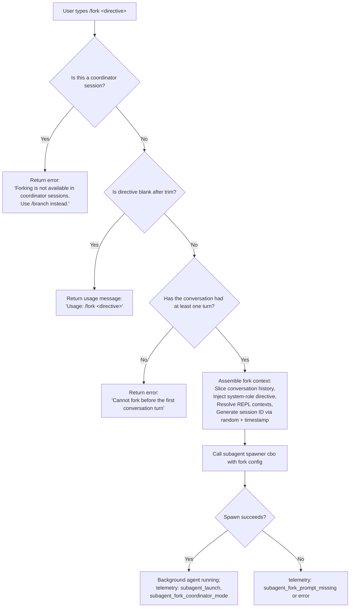

# `/fork`

> Analysis basis: CC v2.1.187 bundle.js (AST extraction + Claude interpretation)
> Minimum version: v2.1.187

---

## Overview

`/fork` spawns a new background agent that inherits the full current conversation context and begins executing a user-supplied directive. The command validates preconditions (session type, conversation readiness), assembles a forked conversation state with a `system`-role injection, and delegates execution to the async agent spawner (`agf`), which coordinates subagent lifecycle management via the background daemon.

---

## Registration

| Field | Value |
|---|---|
| type | `local-jsx` |
| name | `fork` |
| description | `Spawn a background agent that inherits the full conversation` |
| argumentHint | `<directive>` |
| module_id | `AMl` |
| load_inline | `true` |
| loc_byte | `12529899` |
| loc_byte_end | `12530102` |
| loc_line | `8548` |
| arbor_handler.name | `agf` |
| arbor_handler.fqn | `claude-2.1.187::agf` |
| arbor_handler.kind | `AsyncFunction` |
| arbor_handler.resolution_path | `module_id` |
| arbor_handler.n_hits | `0` |

Analysis basis: CC v2.1.187 bundle.js:+12529899

---

## Input Branching

The command has 4+ distinct branches based on session type, directive presence, and conversation state, so a Mermaid flowchart is used.



Analysis basis: CC v2.1.187 bundle.js:+12529458, +12529482, +12529522, +12529550, +12529591, +12529596, +12529669

---

## Behavioral Spec

### 1. Entry: Handler Validation (`agf`)

The primary handler `agf` (an `AsyncFunction`) runs first on invocation.

```
async function forkCommandHandler(rawInput, sessionContext):
    directive = rawInput.trim()                         // +12529458

    if sessionContext.isCoordinatorSession():
        return error("Forking is not available in coordinator sessions. Use /branch instead.")
                                                        // +12529596

    if directive is empty:
        return usage("Usage: /fork <directive>")        // +12529482

    if not sessionContext.hasHadAtLeastOneTurn():
        return error("Cannot fork before the first conversation turn")
                                                        // +12529669

    forkPayload = buildForkPayload(directive, sessionContext)
    result = await spawnSubagent(forkPayload)
    return result
```

Analysis basis: CC v2.1.187 bundle.js:+12529458, +12529480, +12529550

---

### 2. Fork Context Assembly (`cbo`)

`cbo` is the subagent spawner coordinator. It assembles the forked session configuration:

```
function buildForkPayload(directive, sessionContext):
    // Snapshot conversation history up to the current turn
    history = sessionContext.getConversationHistory()
    slicedHistory = history.slice(0, HISTORY_SLICE_INDEX)   // +11116384
                                                              // HISTORY_SLICE_INDEX up to index 50 (+11116381) or 49 (+11116394)

    // Generate a stable random session identifier
    sessionId = generateSessionId()                          // calls DM (+11116411)
                                                              //   which uses randomBytes (8 bytes, hex) (+27987, +28003, +28015)

    // Stamp the launch timestamp
    launchTimestamp = Date.now()                             // +11116438

    // Retrieve REPL contexts (for tool continuity)
    replContexts = sessionContext.getReplContexts()          // +11116236

    // Inject the directive as a system-role message
    systemMessage = { role: "system", content: directive }   // +12529522

    // Resolve subagent spawn configuration
    spawnConfig = resolveSubagentSpawnConfig(sessionContext)  // calls r7p (+11116109)

    // Register a background task entry
    taskEntry = registerBackgroundTask(spawnConfig)           // calls jpt (+11116474)

    // Signal fork mode
    forkMode = "fork"                                         // +11116196

    // Emit telemetry for subagent launch
    emit("subagent_launch")                                   // +11116005
    emit("subagent_fork_coordinator_mode")                    // +11116023

    return {
        history: slicedHistory,
        sessionId,
        launchTimestamp,
        replContexts,
        systemMessage,
        spawnConfig,
        taskEntry,
        mode: forkMode
    }
```

Analysis basis: CC v2.1.187 bundle.js:+11116005, +11116023, +11116147, +11116196, +11116363, +11116384, +11116411, +11116438, +11116474

---

### 3. Subagent Spawn Configuration (`r7p`)

`r7p` resolves the full configuration object passed to the subagent runtime. It reads from `appState` and constructs a parameter bundle that includes tool permissions, model settings, session flags, and memory context:

```
function resolveSubagentSpawnConfig(sessionContext):
    appState = sessionContext.getAppState()              // +11117796
    conversationList = Array.from(appState.conversations) // +11117896

    // Build system prompt via buildSystemPrompt (uR)
    systemPrompt = buildSystemPrompt(appState)           // calls uR (+11117958)

    // Resolve permission mode (bypassPermissions check)
    permissionMode = resolvePermissionMode(appState)
    // Key config keys used: "working_directory", "allowed_tools",
    //   "disallowed_tools", "avoid_prompts", "bypassPermissions",
    //   "permission_mode", "session", "effort", "model",
    //   "max_thinking_tokens", "flag_settings"
    //   (+10787855, +10787910, +10787965, +10788026, +10788159,
    //    +10788128, +10788458, +10788483, +10788496, +10788508, +10788534)

    // Resolve main-thread vs background context
    // label "main-thread" is distinguished at +8636248
    // subagent mode "background" set at +8907124

    return {
        appState,
        conversations: conversationList,
        systemPrompt,
        permissionMode,
        ...modelSettings
    }
```

Analysis basis: CC v2.1.187 bundle.js:+11117796, +11117896, +11117958, +10787855 through +10788534

---

### 4. System Prompt Assembly (`uR`)

`uR` constructs the system prompt for the forked agent. It pulls together a large number of prompt sub-sections. Key named prompt sections found in literals:

| Section key | Description |
|---|---|
| `task_continuity` | Instructs agent on task continuity (+13474077) |
| `fable_identity` | Fable model identity block (+13474110) |
| `tool_param_json` | Tool parameter JSON formatting (+13474158) |
| `env_info_static` | Static environment facts (+13474448) |
| `env_info_simple` | Simplified environment description (+13474485) |
| `language` | Language settings (+13474523) |
| `output_style` | How agent should respond (+13474558) |
| `bg-session` | Background session mode indicator (+13474588) |
| `scratchpad` | Scratchpad config (+13474648) |
| `context_management` | Context compression policy (+13474676) |
| `brief` | Brief mode indicator (+13474715) |
| `reproduce_verify_workflow` | Reproduce-verify workflow instructions (+13474769) |
| `act_dont_rederive` | Instruction not to re-derive actions (+13474820) |
| `heron_brook` | Feature flag section (+13474863) |
| `autonomy_append` | Autonomy instructions (+13474891) |

The fork agent receives mode `"bg"` (background, +13481136) and output style `"bg-session"` (+13474588). If a worktree is involved, the agent receives worktree-specific instructions (+13481453). A temporary scratch directory path is appended (+13482545).

The brief mode path checks `aPo.isBriefEnabled` (+13473947, +13483625).

Analysis basis: CC v2.1.187 bundle.js:+13474077–+13474891, +13481136, +13481209, +13481453, +13482545

---

### 5. Background Task Registration (`jpt`)

`jpt` registers the forked agent as a local background task:

```
function registerBackgroundTask(spawnConfig):
    // Create filesystem symlink entries for the task
    taskDir = ensureTaskDirectory()          // calls K_e → xDo → $ne.mkdir (+13321536)
    symlinkPath = createSymlink(taskDir)     // calls K_e → $ne.symlink (+13324017)

    // Register a signal handler for abort
    signalHandler = registerSignalHandler()  // calls n5i → pOd.register (+5108303)

    // Set initial task state: "pending" (+13325039) → "running" (+10451530)
    taskRecord = {
        type: "local_agent",                 // +10451485
        status: "running",                   // +10451530
        kind: "general-purpose",             // +10451648
        createdAt: Date.now()
    }

    // Start the background agent process
    startBackgroundProcess(taskRecord)       // calls jw (+10451444) for process path
    registerCleanup(taskRecord)              // calls aC (+10451480)

    return taskRecord
```

The background agent is subject to a watchdog timeout. Maximum background agent lifetime implied by a 600,000 ms (10 minute) constant found at +8907275.

Analysis basis: CC v2.1.187 bundle.js:+10451438, +10451444, +10451463, +10451480, +10451485, +10451530, +10451648, +8907275

---

### 6. Subagent Lifecycle Loop (`QB` / `_6e`)

Once spawned, the background subagent runs a full agent loop (`_6e` is the core turn-loop function; `QB` is the outer runner). Key behaviors:

```
async function subagentLoop(taskContext):
    // Initialize transcript and state
    transcript = []
    mode = "responding"                      // +8907366

    loop:
        turn = await runModelTurn(taskContext)  // calls TBa (+8908964)

        if turn.stalled:
            emitTelemetry("tengu_async_agent_stall_timeout")
            reason = "watchdog_stall"        // +8907932
            break

        if turn.complete:
            status = "completed"             // +10444670
            break

        if turn.cancelled:
            status = "cancelled"             // +8911936
            break

    finalizeSubagent(taskContext, status)
    emit("subagent_complete")               // +8908591
```

On stall/timeout, the loop emits `tengu_async_agent_stall_timeout` (+8908351). On completion, it emits `subagent_complete` (+8908591). On async error, it emits `subagent_async_errored` (+8912631).

Analysis basis: CC v2.1.187 bundle.js:+8907366, +8907932, +8908351, +8908591, +8908611, +8911936, +8912631

---

### 7. Coordinator Session Guard

The coordinator session check uses the literal `"Forking is not available in coordinator sessions. Use /branch instead."` (+12529596). This is enforced before any other work is done. The call to `_v` (+12529591) resolves the current session type; when the mode matches coordinator, the error is returned immediately.

A separate check for `subagent_fork_coordinator_mode` telemetry (+11116023) fires only when forking is allowed (non-coordinator path), confirming the coordinator guard is a pre-fork gate.

Analysis basis: CC v2.1.187 bundle.js:+12529591, +12529596, +11116023

---

### 8. Conversation Slice Logic (`wul`)

Before passing history to the fork, the conversation is trimmed:

```
function trimConversationForFork(history):
    // Remove trailing whitespace from each message
    cleaned = history.map(msg => msg.trim())   // wul at +11118203
    // Slice to at most ~50 recent messages     // +11116381 (50), +11116394 (49)
    return cleaned.slice(-50)
```

The constants 50 and 49 at +11116381 and +11116394 suggest a near-50 message window; the slight asymmetry likely accounts for off-by-one handling between user and assistant turns.

Analysis basis: CC v2.1.187 bundle.js:+11116363, +11116381, +11116384, +11116394, +11118203

---

## State & Side Effects

| Item | Detail |
|---|---|
| Telemetry | `subagent_launch` (+11116005), `subagent_fork_coordinator_mode` (+11116023), `subagent_fork_prompt_missing` (+11116147), `tengu_async_agent_stall_timeout` (+8908351), `tengu_agent_summary_skipped` (+8814011), `tengu_async_agent_stranded_tools_cleared` (+8909311), `tengu_agent_tool_completed` (+8904155), `tengu_agent_tool_terminated` (+8912034), `tengu_shale_finch` (+8899608), `tengu_auto_mode_decision` (+8905854), `tengu_forked_agent_default_turns_exceeded` (+10786601) |
| Filesystem | Creates task directory via `$ne.mkdir` (+13321536); creates symlink via `$ne.symlink` (+13324017); writes `.meta.json` and `.jsonl` transcript files (+13222095, +13222251) |
| appState changes | `setAppState` called by forked agent runner (+10730577, +10783040); `setMode` called on agent start (+8907356) |
| Background task registry | Task added to local agent registry with status `"pending"` → `"running"` → `"completed"/"cancelled"/"failed"` |
| Signal handler | Registers abort signal handler via `pOd.register` (+5108303); `n.close`/`r.close` on teardown (+17208740, +17208750) |
| Process lifecycle | Spawns subprocess via `dV.spawn` (+17197818); sends `SIGTERM` (+17198011) then `SIGKILL` (+17196111) on forced shutdown |
| Sound | <!-- TODO: not found in depth-2 traversal; needs --depth 4 --> |
| Hook events | Fires `SubagentStart` (+13357889) and `SubagentStop` (+13399826) hook events; `TaskCompleted` (+13399846) on success |
| OTEL tracing | Emits `claude_code.subagent.spawn` span (+6724279); span type `subagent.spawn` (+6724146) |

---

## Version History

| Version | Change |
|---|---|
| v2.1.187 | Initial analysis |

---

## Common Mistakes

1. **Using `/fork` in a coordinator session** — The command is explicitly blocked in coordinator mode (multi-agent orchestrator sessions). Use `/branch` instead. Error: `"Forking is not available in coordinator sessions. Use /branch instead."` (+12529596)

2. **Omitting the directive argument** — Running `/fork` with no argument returns the usage string `"Usage: /fork <directive>"` (+12529482) and does nothing. A directive is mandatory.

3. **Forking before any conversation turn** — The fork inherits conversation context, so it requires at least one prior assistant turn. Attempting to fork at session start returns `"Cannot fork before the first conversation turn"` (+12529669).

4. **Expecting synchronous output** — The forked agent runs entirely in the background. Results are not streamed back into the current session; they are written to a separate transcript file (`.jsonl`). The parent session continues independently.

5. **Assuming unlimited history inheritance** — The fork receives at most approximately 50 recent conversation messages (+11116381, +11116394), not the full unbounded history.

6. **Expecting the fork to share tool permission state** — The fork agent resolves its own `permissionMode` from `appState`. Tool permissions, `bypassPermissions`, and allowed/disallowed tool lists are re-derived from config, not directly inherited from the parent's runtime state.

---

## Appendix — Identifier Mapping

> For bundle debugging only. Identifiers change across versions.

| Identifier | Role |
|---|---|
| `agf` | Main handler for `/fork` — async entry point (primary handler per Arbor) |
| `cbo` | Subagent spawn coordinator — assembles fork payload and calls spawner |
| `r7p` | Subagent spawn config resolver — reads appState, builds config object |
| `uR` | System prompt builder — assembles full system prompt for forked agent |
| `_v` | Session type resolver — used to detect coordinator mode |
| `Or` | Conversation state resolver — finds last turn, working directory |
| `G8n` | Working directory accessor |
| `W8n` | Working directory setter |
| `N2` | Permission mode normalizer |
| `wul` | Conversation trimmer — trims whitespace from messages |
| `DM` | Session ID generator — uses randomBytes |
| `jpt` | Background task registrar |
| `K_e` | Task directory/symlink setup |
| `VJn` | Task set add/delete (in-flight task registry) |
| `xDo` | Task directory creator (`$ne.mkdir`) |
| `gm` | Symlink path builder |
| `jw` | Background process path resolver |
| `h1` | Signal listener setup |
| `n5i` | Abort signal handler registrar |
| `aC` | Task cleanup registrar (timestamp + directory) |
| `QB` | Outer subagent runner / session loop |
| `_6e` | Core subagent turn-loop function |
| `TBa` | Single-turn model call executor |
| `C0` | Streaming model request builder |
| `qdo` | Post-turn tool dispatch / result handler |
| `Kdo` | Subagent handoff classifier |
| `L9t` | Subagent output scorer / summary builder |
| `m_e` | Subagent state update handler |
| `H6e` | Subagent speculation abort handler |
| `M3n` | Subagent completion/metrics finalizer |
| `f3a` | Task record status updater |
| `p3a` | Transcript update handler |
| `P3n` | Tool call classifier |
| `ZGe` | Search/read command classifier |
| `CBa` | Agent summary state writer |
| `sdt` | Task progress emitter |
| `Is` | CLI error exit handler — used in teardown path |
| `fte` | System prompt section builder (per-model) |
| `vk` | Model selection / routing resolver |
| `Qo` | Model alias resolver (fable/sonnet/haiku/opus/best) |
| `Ba` | Model policy settings resolver |
| `dU` | Model request config builder |
| `Nwf` | Output-style system prompt section builder |
| `Uwf` | Confirmation-before-action prompt section |
| `Fwf` | Confirmation-before-action prompt section (extended) |
| `Lxt` | Memory/context loader for prompt |
| `lLf` | Environment info section builder (simple) |
| `aLf` | Environment info section builder (full) |
| `g4n` | Prompt section for model identity |
| `pLf` | Brief mode prompt section |
| `hLf` | Flag-settings prompt section |
| `nLf` | Base identity/role sentence selector |
| `uLf` | Background session output section |
| `Zwf` | Session/schedule/routines context section |
| `eLf` | Autonomy append section |
| `PAi` | Memory directory disabled section |
| `Wwf` | Heron Brook experiment prompt section |
| `qwf` | Amber sextant section |
| `oLf` | Act-don't-rederive section |
| `Ywf` | Verified-vs-assumed section |
| `Xwf` | Slate harrier section |
| `Jwf` | Orchid mantis section |
| `jwf` | Gwf section (scheduled tasks) |
| `x_n` | Fable identity check (startsWith "claude-fable-") |
| `XG` | Tool param JSON section |
| `YEi` | Send-user-msg section |
| `WQ` | System prompt section joiner |
| `mq` | SDK section builder |
| `tLf` | Task continuation section |
| `oGn` | REPL context builder |
| `n2p` | Assistant message context filter |
| `r2p` | Tool result context filter |
| `t2p` | Code tool result context filter |
| `o2p` | Tool result error context filter |
| `EOt` | Output style mode constant resolver |
| `h0e` | Session mode resolver |
| `oo` | Process/subagent table entry |
| `Ite` | Subagent inner runner (per-session loop) |
| `Gdo` | Tool filter for subagent |
| `Wdo` | Permission set builder for subagent |
| `Bdo` | Environment variable splitter |
| `gv` | Tool display formatter |
| `Xm` | Tool name sanitizer |
| `s0` | Path splitter/joiner |
| `Kpe` | Path utility (`m9`) |
| `hll` | MCP tool filter cache |
| `kY` | Tool list deduplicator |
| `xGt` | Tool set filter |
| `MGt` | Tool metadata filter |
| `dae` | Tool list membership checker |
| `aVp` | Full agent query/execution loop |
| `YWn` | Subagent exit / state cleanup |
| `j5` | Subagent coordination entry point |
| `zt` | Session lifecycle (connect/disconnect) |
| `ge` | MCP server connector |
| `LNo` | Background worker event bridge |
| `he` | Session runner / MCP initializer |
| `ie` | Per-session render / output loop |
| `en` | Session re-entry / environment connector |
| `Jye` | Plugin refresh handler |
| `UA` | Tool permission builder |
| `we` | Queue / rate-limit handler |
| `mDp` | MCP config builder |
| `k` | Output queue |
| `R_e` | Subagent result writer |
| `dC` | Hook execution engine |
| `od` | Hook type resolver |
| `g4t` | Subagent start hook dispatcher |
| `ot` | Fallback credit resolver |
| `Kaa` | OTEL span creator for subagent spawn |
| `zaa` | OTEL span finisher |
| `qfo` | Streaming response parser |
| `Bpo` | Prompt cache store |
| `EBa` | Prompt cache flag checker |
| `Ey` | Token usage tracker |
| `K0f` | Token usage event emitter |
| `Zdt` | Skill/agent progress dispatcher |
| `Sft` | Tool result accumulator |
| `f4n` | Session state writer (setAppState) |
| `h4n` | Tool set initializer for session |
| `bVr` | Tool cost/token budget resolver |
| `s6e` | Retry delay calculator (exponential backoff) |
| `ABa` | Session metadata accumulator |
| `Rua` | MCP server connection manager |
| `wWi` | VSCode extension presence checker |
| `h_c` | CCD session resolver |
| `De` | Deferred action scheduler |
| `KRt` | Worker post-message dispatcher |
| `L_e` | Model backend resolver |
| `MD` | Model standard/gateway type resolver |
| `qj` | Model name normalizer (toLowerCase) |
| `ixe` | Tool list eligibility checker |
| `qSo` | Tool permission set merger |
| `H3n` | Session flags parser |
| `p0` | Session flag key extractor |
| `Ace` | Fork context ref resolver |
| `_We` | Fork context filter |
| `ept` | Agent metadata file writer |
| `U3l` | Process working directory resolver |
| `Me` | JSON stringifier wrapper |
| `Wfo` | Fork context reader |
| `Rc` | Fork context parser (Ei) |