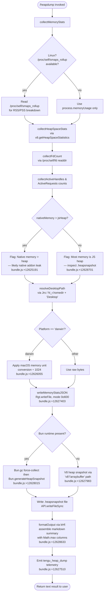

# `/heapdump`

> Analysis basis: CC v2.1.187 bundle.js (AST extraction + Claude interpretation)
> Minimum version: v2.1.187

---

## Overview

`/heapdump` is a hidden diagnostic command that captures a JavaScript heap snapshot and a rich set of memory-usage statistics from the running Claude Code process, then writes the resulting files to the user's Desktop. It is intended for developer and support use to diagnose memory leaks and native-addon memory growth in the CLI process.

---

## Registration

| Field | Value |
|---|---|
| type | `local` |
| name | `heapdump` |
| description | `Dump the JS heap to ~/Desktop` |
| supportsNonInteractive | `true` |
| isHidden | `true` |
| module_id | `IPl` |
| load_inline | `true` |
| loc_byte | `12629389` |
| loc_byte_end | `12629817` |
| loc_line | `8670` |
| arbor_handler.name | `LHf` |
| arbor_handler.fqn | `claude-2.1.187::LHf` |
| arbor_handler.kind | `AsyncFunction` |
| arbor_handler.resolution_path | `module_id` |
| arbor_handler.n_hits | `0` |

Analysis basis: CC v2.1.187 bundle.js:+12629389

---

## Input Branching

The command has more than three distinct execution paths (runtime detection branch, memory-classification branch, Bun vs. V8 snapshot branch, and output-assembly branch), so a Mermaid flowchart is used.



---

## Behavioral Spec

### Top-level handler (`LHf` — `heapDumpCommandHandler`)

The handler is an `AsyncFunction` resolved via `module_id → IPl`. It orchestrates the full dump sequence and assembles the final user-visible text.

```
async function heapDumpCommandHandler(commandInput):
    statsReport   = await collectRichMemoryStats()    // wko → bPl
    snapshotPath  = await writeHeapSnapshot()         // wko → wHf
    summaryLines  = []
    summaryLines.push(
        "Open the .heapsnapshot in Chrome DevTools → Memory → Load to inspect retainers."
    )  // bundle.js:+12628414
    formattedTable = formatMemoryTable(statsReport)   // kHf
    summaryLines.push(formattedTable)
    summaryLines.join("\n")
    emit telemetry("tengu_heap_dump")                 // bundle.js:+12627510
    return { type: "text", content: summaryLines }    // bundle.js:+12628290
```

Analysis basis: CC v2.1.187 bundle.js:+12628258

---

### Memory statistics collector (`bPl` — `collectRichMemoryStats`)

Gathers all available memory signals from the Node/Bun process:

```
async function collectRichMemoryStats():
    mem       = process.memoryUsage()                 // bundle.js:+12624421
    heapStats = v8Module.getHeapStatistics()          // bundle.js:+12624445
    resUsage  = process.resourceUsage()               // bundle.js:+12624471
    uptime    = process.uptime()                      // bundle.js:+12624497
    heapSpaces = v8Module.getHeapSpaceStatistics()    // bundle.js:+12624522
    activeHandles  = process._getActiveHandles()      // bundle.js:+12624564
    activeRequests = process._getActiveRequests()     // bundle.js:+12624601

    // Linux-only: open file-descriptor count
    try:
        fdEntries = fs.readdir("/proc/self/fd")       // bundle.js:+12624652
    catch:
        fdEntries = []

    // Linux-only: smaps_rollup for native RSS
    try:
        smaps = fs.readFile("/proc/self/smaps_rollup", "utf8")  // bundle.js:+12624727
    catch:
        smaps = null

    // Load bun:jsc module if available for extra heap space info
    try:
        jscModule = require("bun:jsc")                // bundle.js:+12624812
    catch:
        jscModule = null

    // Uptime threshold for leak rate calculation
    SECONDS_PER_HOUR = 3600                           // bundle.js:+12624953
    BYTES_PER_MB     = 1048576                        // bundle.js:+12624958

    nativeMemory = mem.rss - mem.heapUsed
    if nativeMemory > mem.heapUsed:
        leakHint = "Native memory > heap - leak may be in native addons (node-pty, sharp, etc.)"
        // bundle.js:+12625191
    else:
        leakHint = null

    // Format heap-space sizes with two decimal places
    formattedSpaces = heapSpaces.map(s => s.toFixed(2))  // bundle.js:+12625314

    if platform == "darwin":
        // macOS: convert memory values dividing by 1024
        // bundle.js:+12626055
        scaledMem = scaleByPlatform(mem, divisor=1024)
    else:
        scaledMem = mem

    if leakHint is null:
        leakHint = "No obvious leak indicators. Check heap snapshot for retained objects."
        // bundle.js:+12626310

    return {
        mem: scaledMem, heapStats, resUsage, uptime,
        heapSpaces: formattedSpaces, activeHandles, activeRequests,
        fdCount: fdEntries.length, smaps, leakHint,
        nativeMemory, jscModule
    }
```

Analysis basis: CC v2.1.187 bundle.js:+12624421 – +12626038

---

### Desktop path resolver (`Jrs` — `resolveDesktopPath`)

```
function resolveDesktopPath(filename):
    home = os.homedir()                    // N_r.homedir — bundle.js:+1105044
    base = path.join(home, "Desktop")     // vf.join — bundle.js:+1105080

    // WSL path rewrite: /mnt/c/Users/<user>/Desktop
    if path startsWith "/mnt/c/Users":    // bundle.js:+1105312
        // Replace Linux mount prefix with Windows-native Desktop
        // Skips special accounts: "Public", "Default", "Default User", "All Users"
        // bundle.js:+1105356 – +1105420
        base = rewriteWslDesktopPath(home)

    return path.join(base, filename)      // bundle.js:+1105080
```

Analysis basis: CC v2.1.187 bundle.js:+1105037

---

### Heap snapshot writer (`wHf` — `writeHeapSnapshotFile`)

```
async function writeHeapSnapshotFile(destPath):
    if runtime is Bun:
        Bun.gc(/* force = */ true)              // bundle.js:+12628015
        snapshot = Bun.generateHeapSnapshot()   // bundle.js:+12627958
    else:
        // V8 path
        snapshot = captureV8Snapshot(           // bundle.js:+12627983
            format = "v8",
            encoding = "arraybuffer"
        )

    APl.writeFileSync(destPath, snapshot)       // bundle.js:+12627938
    return destPath
```

Analysis basis: CC v2.1.187 bundle.js:+12627938 – +12628028

---

### Main orchestrator (`wko` — `runHeapDumpWorkflow`)

```
async function runHeapDumpWorkflow():
    // 1. Collect rich memory stats
    stats = await collectRichMemoryStats()       // bPl — bundle.js:+12626933

    // 2. Resolve Desktop output directory
    outputDir = resolveDesktopPath("")           // Jrs — bundle.js:+12627216

    // 3. Construct output file paths (join with vko.join)
    statsFilePath    = path.join(outputDir, "cc-memory-stats.json")
    snapshotFilePath = path.join(outputDir, "cc-heap.heapsnapshot")
    // bundle.js:+12627325

    // 4. Write memory stats JSON (file mode 384 = 0o600)
    fs.writeFile(statsFilePath, JSON.stringify(stats), { mode: 384 })
    // bundle.js:+12627368, +12627403

    // 5. Write heap snapshot
    await writeHeapSnapshotFile(snapshotFilePath)  // wHf — bundle.js:+12627459

    // 6. Optionally log trigger mode ("manual", priority 0)
    log("manual", 0)                           // bundle.js:+12626896, +12626907

    // 7. Detect auto-1.5GB trigger label if triggered automatically
    autoLabel = "auto-1.5GB"                   // bundle.js:+12627576

    // 8. Emit telemetry
    emit("tengu_heap_dump")                    // bundle.js:+12627510

    return { statsFilePath, snapshotFilePath, stats }
```

Analysis basis: CC v2.1.187 bundle.js:+12626920 – +12627688

---

### Output formatter (`kHf` — `formatMemorySummaryTable`)

```
function formatMemorySummaryTable(stats):
    // Column width floored by Math.max to ensure alignment
    colWidth = Math.max(minWidth, longestLabel.length)  // bundle.js:+12628633

    lines = []

    // Classify memory origin
    if jsHeap > nativeMemory:
        classification = "— most memory is JS heap (inspect the .heapsnapshot)"
        // bundle.js:+12628701
    else:
        classification = "— most memory is native (NOT in the .heapsnapshot)"
        // bundle.js:+12628761

    // Add no-leak note if applicable
    if noLeakIndicators:
        lines.push("  (no obvious leak indicators)")    // bundle.js:+12628898

    // Memory threshold: 1 GiB = 1073741824 bytes
    // Used internally to flag high-memory states
    GIB_THRESHOLD = 1073741824                          // bundle.js:+12629307

    // Build 8-column table
    TABLE_COLS = 8                                      // bundle.js:+12629033

    // Append xgt sub-formatter for heap-space rows
    heapSpaceRows = formatHeapSpaces(stats.heapSpaces, colWidth)  // xgt

    lines.push(classification)
    lines.push(...heapSpaceRows)

    return lines.join("\n")
```

Analysis basis: CC v2.1.187 bundle.js:+12628377 – +12628945

---

## State & Side Effects

| Item | Detail |
|---|---|
| Telemetry | `tengu_heap_dump` (bundle.js:+12627510); also reachable via call graph: `tengu_bg_proto_mismatch` (+17181686), `tengu_bg_dispatch_stale_drop` (+17183085), `tengu_bg_attach_legacy_autorespawn` (+17185989), `tengu_bg_attach` (+17187248), `tengu_bg_attach_stall_gave_up` (+17188178), `tengu_bg_attach_stall_respawn` (+17188448), `tengu_bg_attach_kick` (+17189445) — these belong to the background-daemon IPC layer reached transitively |
| Files written | `~/Desktop/cc-memory-stats.json` (mode `0o600`, bundle.js:+12627403) and `~/Desktop/cc-heap.heapsnapshot` (bundle.js:+12627938) |
| Memory pressure | `Bun.gc(true)` is called before snapshot generation to force a garbage-collection cycle (bundle.js:+12628015) |
| Hook registration | `b6o.register` called via `Ei` (bundle.js:+67325); exact hook type not resolved within depth-2 traversal |
| appState changes | None observed in depth-2 traversal |
| Sound | None observed |
| Platform branching | macOS (`darwin`) applies a ÷1024 memory-unit scaling (bundle.js:+12626045, +12626055); WSL path rewrite active for `/mnt/c/Users` paths (bundle.js:+1105312) |

---

## Version History

| Version | Change |
|---|---|
| v2.1.187 | Initial analysis |

---

## Common Mistakes

1. **Expecting visible output in normal sessions** — the command is `isHidden: true` and does not appear in the slash-command menu. It must be typed explicitly.
2. **Missing Desktop directory** — on headless Linux servers there is no `~/Desktop` by default; the file write will fail unless the directory is created manually before running the command.
3. **Interpreting native-memory warnings as definitive** — the "Native memory > heap" hint (bundle.js:+12625191) is heuristic. RSS includes memory-mapped files and shared libraries, not just addon allocations.
4. **Opening the snapshot before the write completes** — the snapshot file is written synchronously via `APl.writeFileSync` (bundle.js:+12627938) only after an async GC cycle; do not read the file until the command returns its text result.
5. **Assuming Bun snapshot format equals V8 format** — when running under Node.js the V8 `arraybuffer` path is used (bundle.js:+12627983); the resulting `.heapsnapshot` is compatible with Chrome DevTools, but the Bun path produces a different internal layout.
6. **Running with elevated privileges expecting lower file permissions** — the stats JSON is always written with mode `0o600` (decimal 384, bundle.js:+12627403); ownership follows the running process UID.

---

## Appendix — Identifier Mapping

> For bundle debugging only. Identifiers change across versions.

| Identifier | Role |
|---|---|
| `LHf` | `heapDumpCommandHandler` — top-level async command handler (Arbor entry point) |
| `wko` | `runHeapDumpWorkflow` — main orchestrator: collects stats, resolves paths, writes files, emits telemetry |
| `bPl` | `collectRichMemoryStats` — gathers process.memoryUsage, V8 heap stats, /proc/smaps, fd count, active handles |
| `wHf` | `writeHeapSnapshotFile` — Bun.gc + Bun.generateHeapSnapshot / V8 arraybuffer snapshot writer |
| `kHf` | `formatMemorySummaryTable` — formats aligned memory summary table with classification labels |
| `Jrs` | `resolveDesktopPath` — resolves ~/Desktop with WSL path rewrite |
| `kt` | `logUtility` — internal logging helper |
| `VL` | `logBackend` — underlying log sink called by `kt` |
| `y` | `markMessagesAsReadHelper` — TeammateMailbox lock/read helper (reached transitively via bPl) |
| `U5e` | `markMessagesAsRead` — TeammateMailbox message-marking function |
| `H` | `bgProcessOutputCollector` — background-process output buffer handler |
| `g` | `bgProcessOutputParser` — output stream parser for background process |
| `m` | `bgProcessKillManager` — background-process kill/SIGTERM manager |
| `mp` | `bgStreamEnder` — ends a background stream and emits event |
| `bJf` | `bgProtocolDispatcher` — background IPC protocol message dispatcher (large handler with many sub-operations) |
| `be` | `stringCoercer` — coerces a value to String |
| `T` | `telemetryLogger` — telemetry/debug log emitter |
| `Xwc` | `telemetryTransport` — telemetry transport layer |
| `I6o` | `telemetryBatcher` — batches telemetry calls |
| `e` | `randomDelayScheduler` — schedules events with Math.random + setTimeout jitter |
| `Me` | `jsonStringifyWrapper` — wraps JSON.stringify |
| `wc` | `pathSanitizer` — sanitizes/redacts file paths (replaces with `[REDACTED]`) |
| `c8o` | `pathComponentMapper` — maps path components via `zwc.map` |
| `r` | `pathSegmentSource` — provides path segments (calls `Is`) |
| `n` | `lowercasedPathProvider` — lowercases path input via `i.toLowerCase` |
| `dze` | `stdinWriter` — writes to stdin via JWo |
| `JWo` | `stdinWriteImpl` — calls `e.write` on the stream |
| `eLc` | `logFileWriter` — writes log entries to rotating files on disk |
| `FKe` | `logEntryBatcher` — batches and flushes log entries with timers |
| `dpe` | `logFilePathBuilder` — builds log file paths using `hze` and `upe.join` |
| `Wt` | `fsEnsureDir` — ensures a directory exists before writing |
| `Mre` | `fsErrorHandler` — handles EISDIR/errno filesystem errors |
| `p8o` | `logFilenameConstructor` — constructs log filenames with path.join |
| `Ocr` | `logFileRotator` — rotates log files via stat/rename/unlink |
| `Zwc` | `logFileAppender` — appends to log file, creating directory if needed |
| `Ei` | `hookRegistrar` — calls `b6o.register` to register a lifecycle hook |
| `o` | `paddedRowFormatter` — formats rows with padEnd spacing |
| `s` | `asyncTaskTracker` — tracks async tasks with add/delete/finally |
| `i` | `dbConnectionPair` — manages n.close / r.close connection lifecycle |
| `W` | `triggerLabelStore` — stores the dump trigger label (e.g. `"auto-1.5GB"`) |
| `fo` | `errorStringifier` — converts Error objects to strings |
| `sp` | `snapshotPathStore` — holds resolved snapshot output path |
| `ke` | `errorLogger` — logs errors via jJ.logError and pushes to c7e |
| `nt` | `stringNormalizer` — normalises values to String |
| `Vi` | `errorFormatter` — formats errors for display |
| `jns` | `errorTextBuilder` — builds error text strings |
| `Qru` | `recentErrorQueue` — shift/push queue for recent errors (Crn) |
| `xgt` | `heapSpaceRowFormatter` — formats individual heap-space statistics rows |