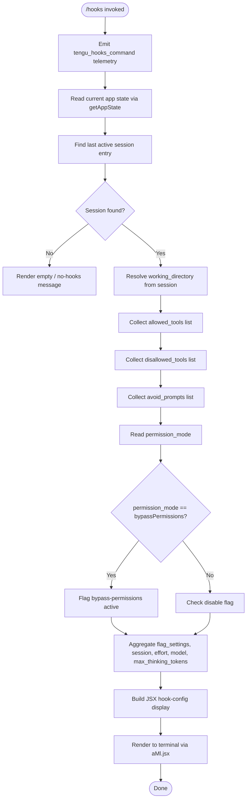

# `/hooks`

> Analysis basis: CC v2.1.187 bundle.js (AST extraction + Claude interpretation)
> Minimum version: v2.1.187

---

## Overview

The `/hooks` command displays the current hook configurations registered for tool events in the Claude Code CLI session. It is a read-only, immediate inspection command that renders hook configuration state as a JSX component in the terminal, allowing users to see which hooks are active, what tools they apply to, and what permission or filtering rules are in effect.

---

## Registration

| Field | Value |
|---|---|
| type | `local-jsx` |
| name | `hooks` |
| description | `View hook configurations for tool events` |
| immediate | `true` |
| module_id | `iMl` |
| load_inline | `true` |
| loc_byte | `12519879` |
| loc_byte_end | `12520029` |
| loc_line | `8548` |
| arbor_handler.name | `Qhf` |
| arbor_handler.fqn | `claude-2.1.187::Qhf` |
| arbor_handler.kind | `AsyncFunction` |
| arbor_handler.resolution_path | `module_id` |
| arbor_handler.n_hits | `0` |

Analysis basis: CC v2.1.187 bundle.js:+12519879

---

## Input Branching

The `/hooks` command follows a multi-branch flow: it reads app state, resolves session context, queries several configuration dimensions (allowed tools, disallowed tools, avoid-prompts, permission mode, bypass-permissions, flag settings), then renders the aggregated hook configuration. Five or more distinct state-driven paths exist, so a flowchart is used.



Analysis basis: CC v2.1.187 bundle.js:+12519687 (handler entry), +10787750 (getAppState), +10787830 (findLast session), +10787855 (working_directory), +10787910 (allowed_tools), +10787965 (disallowed_tools), +10788026 (avoid_prompts), +10788128 (permission_mode), +10788159 (bypassPermissions), +10788534 (flag_settings)

---

## Behavioral Spec

### Handler Entry — `hooksCommandHandler` (`Qhf`)

The top-level async handler is resolved via `module_id` → `iMl` → export `Qhf`.

```
async function hooksCommandHandler(context):
    emit telemetry("tengu_hooks_command")
    appState = readAppState()                  // via getAppState (Or)
    hookConfigDisplay = buildHookConfigView(appState)
    return renderJSX(hookConfigDisplay)        // via aMl.jsx
```

Analysis basis: CC v2.1.187 bundle.js:+12519687 (telemetry emit), +12519721 (readAppState call), +12519729 (buildHookConfigView), +12519759 (aMl.jsx render)

---

### App State Reader — `readAppState` (`Or`)

Retrieves the current application state and extracts the most recent session entry. It uses `Array.prototype.findLast` to locate the last session record, then reads the `working_directory` string from it.

```
function readAppState(stateContainer):
    state = stateContainer.getAppState()
    lastSession = state.findLast(entry => matchesSessionType(entry))
    workingDir  = lastSession["working_directory"]    // string literal key
    allowedTools    = lastSession["allowed_tools"]
    disallowedTools = lastSession["disallowed_tools"]
    avoidPrompts    = lastSession["avoid_prompts"]
    permissionMode  = lastSession["permission_mode"]
    return { workingDir, allowedTools, disallowedTools,
             avoidPrompts, permissionMode, ...lastSession }
```

Key literals extracted from session object:
- `"working_directory"` (bundle.js:+10787855)
- `"allowed_tools"` (bundle.js:+10787910)
- `"disallowed_tools"` (bundle.js:+10787965)
- `"avoid_prompts"` (bundle.js:+10788026)
- `"permission_mode"` (bundle.js:+10788128)
- `"bypassPermissions"` (bundle.js:+10788159)
- `"session"` (bundle.js:+10788458)
- `"effort"` (bundle.js:+10788483)
- `"model"` (bundle.js:+10788496)
- `"max_thinking_tokens"` (bundle.js:+10788508)
- `"flag_settings"` (bundle.js:+10788534)

Analysis basis: CC v2.1.187 bundle.js:+10787750, +10787830

---

### Hook Config Builder — `buildHookConfigView` (`hP`)

The central function that assembles the hook configuration data for display. It orchestrates several sub-queries and builds structured output lists.

```
function buildHookConfigView(appState):
    // Resolve config sources
    configSource = resolveConfigSource(appState)        // gv
    toolConfig   = resolveToolConfig(appState)          // T_o
    featureFlags = resolveFeatureFlags(appState)        // fb
    filteredTools = filterActiveTools(appState)         // Gte
    interactiveConfig = buildInteractiveConfig(appState) // I_o
    booleanConfig = resolveBoolConfig(appState)         // Yc

    outputItems = []
    outputItems.push(renderConfigTable(configSource))   // d.push

    // Check for disabled-bypass state
    if appState.has("bypassPermissions"):
        handleBypassPermissionsMode()                   // N2 → it → disable

    // Check tool-narrowing sources
    if appState.some(hasToolNarrowing):
        applyNarrowingFilter()                          // ql

    // Feature-gate check
    featureEnabled = featureFlag.isEnabled()            // sl.isEnabled, c.isEnabled

    // Filter tool set
    filtered = appState.filter(isRelevantTool)          // o.filter
    restricted = filtered.filter(isRestricted)          // $rt.has
    mapped = filtered.map(buildToolEntry)               // o.map

    // Build interactive config block
    interactiveCfg = buildInteractiveBlock(appState)    // oC

    // Check for "local-agent" path
    if config.includes("local-agent"):                  // l.includes
        fetchDaemonStatus()                             // JNl → daemon.status.json

    // Aggregate and render
    renderItems = assembleRenderList(outputItems)        // u.push
    return renderItems
```

Analysis basis: CC v2.1.187 bundle.js:+10229210, +10229282, +10229297, +10229311, +10229333, +10229348, +10229360, +10229420, +10229527, +10229545, +10229573, +10229585, +10229596, +10229672, +10229687, +10229715, +10229726, +10229768, +10229813

---

### Config Source Resolver — `resolveConfigSource` (`gv`)

Determines the origin of the hook configuration. Distinguishes between `"cli"` and `"remote"` sources, normalising boolean-like strings (`"yes"` / `"on"` → truthy; `"no"` / `"off"` → falsy).

```
function resolveConfigSource(state):
    source = getConfigRef(state)       // r9
    if source == "cli":
        return buildCliConfig(state)   // Za (string normaliser)
    if source == "remote":
        return buildRemoteConfig(state) // nt (string normaliser)
    return buildDefaultConfig(state)   // it
```

Boolean string mapping (bundle.js:+29726, +29732, +29877, +29882):
- Truthy aliases: `"yes"`, `"on"`
- Falsy aliases: `"no"`, `"off"`

Analysis basis: CC v2.1.187 bundle.js:+4976770, +4976787, +4976832, +4976922, +4976933

---

### Tool Config Resolver — `resolveToolConfig` (`T_o`)

Reads tool-related configuration from the session context. Uses `WQa` to look up the tool registry and `oo` (module initialiser) to bind event handlers.

```
function resolveToolConfig(state):
    toolRegistry = lookupToolRegistry(state)   // WQa
    initModule   = initModuleBinding(state)    // oo
    return { toolRegistry, initModule }
```

Analysis basis: CC v2.1.187 bundle.js:+10228997, +10229003

---

### Feature Flag Resolver — `resolveFeatureFlags` (`fb`)

Evaluates several feature flags relevant to hooks. Checks `"allow_workflows"` and computes a feature-gate result used to decide which hook categories are displayed.

```
function resolveFeatureFlags(state):
    base = computeBaseFlags(state)              // MSn → nt, qL
    policyResult = checkPolicy(state)           // pSi → Js
    if policyResult.includes("allow_product_feedback"):
        includeProductFeedback = true
    if policyResult.includes("allow_workflows"):
        emitTelemetry("tengu_workflows_enabled")
    narrowingResult = applyNarrowing(state)     // NBr → Zad
    queryResult = runQuery(state)               // Qad → qL
    return { base, policyResult, narrowingResult, queryResult }
```

Literal keys observed: `"allow_workflows"` (bundle.js:+3372608), `"allow_product_feedback"` (bundle.js:+3352407), `"pro"` (bundle.js:+3373054).

Analysis basis: CC v2.1.187 bundle.js:+3372281, +3372300, +3372344, +3372372

---

### Active Tool Filter — `filterActiveTools` (`Gte`)

Filters the tool list to only those relevant to the current session, using a multi-source tool-narrowing check (`o6t`) that inspects `"cliArg"`, `"toolsNarrowing"`, `"deny"`, and `"blocked"` state flags.

```
function filterActiveTools(tools):
    relevant = tools.filter(isNonBlocked)        // e.filter, "blocked" literal
    for each tool in relevant:
        narrowing = checkNarrowing(tool)         // o6t
        if narrowing.source == "deny":
            markDenied(tool)
        if narrowing.source == "cliArg":
            markCliRestricted(tool)
        if narrowing.source == "toolsNarrowing":
            markNarrowingApplied(tool)
    return relevant
```

Literal keys: `"deny"` (bundle.js:+13581431), `"cliArg"` (bundle.js:+13582078), `"toolsNarrowing"` (bundle.js:+13582099), `"blocked"` (bundle.js:+10228706).

Analysis basis: CC v2.1.187 bundle.js:+10228645, +10228660

---

### Bypass-Permissions Handler — `disableBypassMode` (`N2`)

When the session has `permission_mode` set to `"bypassPermissions"`, this sub-routine is called. It emits a dedicated telemetry event and records the `"disable"` flag in the config output.

```
function disableBypassMode(sessionConfig):
    emitTelemetry("tengu_disable_bypass_permissions_mode")
    sessionConfig.setFlag("disable")        // literal "disable", bundle.js:+3395553
    applyDisablePolicy(sessionConfig)       // it
    recordAuditEntry(sessionConfig)         // Bo
```

Analysis basis: CC v2.1.187 bundle.js:+3395449, +3395499, +3395553

---

### File Config Reader — `readFileConfig` (`Z8e`)

Reads hook configuration from the filesystem. Checks file existence via `stat`, validates it is a regular file (`i.isFile`), enforces a maximum file size of **1 048 576 bytes** (1 MiB), and rejects with `"ENOENT"` if the file is absent. Uses `Object.keys` to enumerate hook event keys and pads column output to width **40** characters.

```
async function readFileConfig(filePath):
    try:
        stats = await fs.stat(filePath)              // p$l.stat
    catch err if err.code == "ENOENT":
        return Promise.reject(err)                   // ENOENT literal
    if not stats.isFile():
        raise error("not a regular file")
    if stats.size > 1048576:                         // bundle.js:+12957888
        raise error("file too large")
    content = await readContent(filePath)            // Xs → $Fu.getStore
    parsed  = parseConfig(content)                   // vxo → Cxo
    keys    = Object.keys(parsed)
    return formatTable(keys, columnWidth=40)         // i.padEnd(40), bundle.js:+17224668
```

Maximum file size: **1 048 576 bytes** (bundle.js:+12957888)
Column pad width: **40 characters** (bundle.js:+17224668)
ENOENT error code literal: bundle.js:+12957828

Analysis basis: CC v2.1.187 bundle.js:+12957797, +12957820, +12957842, +12957869, +12957972, +12958034, +12958099, +12958114, +12958192, +12958306

---

### Daemon Status Reader — `readDaemonStatus` (`JNl`)

When the resolved config path contains `"local-agent"`, the command additionally reads the daemon status file `daemon.status.json` to enrich the hook-config display with daemon liveness information.

```
async function readDaemonStatus(configDir):
    statusPath = join(configDir, "daemon.status.json")   // bundle.js:+12784279
    timestamp  = Date.now()
    context    = getAsyncContext()                        // Xs → $Fu.getStore
    rawData    = await readStatusFile(statusPath)        // tVt → XNl.join, or
    formatted  = formatJSON(rawData)                     // Me → JSON.stringify
    return { timestamp, formatted }
```

Status filename literal: `"daemon.status.json"` (bundle.js:+12784279).

Analysis basis: CC v2.1.187 bundle.js:+12784376, +12784391, +12784423, +12784440, +12784446

---

### Interactive Config Builder — `buildInteractiveConfig` (`I_o`)

Builds the interactive segment of the hooks display, combining platform-sensitive logic (skipping certain paths on `"windows"`) and standard config rendering.

```
function buildInteractiveConfig(state):
    platform = getPlatform()              // f1 → windows literal
    if platform != "windows":
        base = buildPlatformConfig(state) // f1 → jt, nt, Za, Upe, it
    pending = getPendingConfig(state)     // Npt
    binding = initModuleBinding(state)   // oo
    return { base, pending, binding }
```

Platform literal: `"windows"` (bundle.js:+4974153).

Analysis basis: CC v2.1.187 bundle.js:+10229111, +10229135, +10229141

---

### Config Table Formatter — `formatConfigTable` (`f$l`)

Produces the formatted table of hook configuration entries. Uses `Object.keys` to enumerate entries, `Math.max` to compute column widths, and `XH` to render individual rows.

```
function formatConfigTable(hookConfig):
    keys     = Object.keys(hookConfig)
    maxWidth = Math.max(...keys.map(k => k.length))
    rows     = keys.map(k => renderRow(k, hookConfig[k], maxWidth))   // XH
    return rows.join("\n")
```

Analysis basis: CC v2.1.187 bundle.js:+12959018, +12959063, +12959262

---

### Model / Session Config Fields

The following string keys are read from the session object when building the summary display (all extracted from the call through `hP`):

| Config Key | Literal | loc_byte |
|---|---|---|
| Session identifier | `"session"` | 10788458 |
| Effort level | `"effort"` | 10788483 |
| Model name | `"model"` | 10788496 |
| Max thinking tokens | `"max_thinking_tokens"` | 10788508 |
| Flag settings | `"flag_settings"` | 10788534 |

---

## State & Side Effects

| Item | Detail |
|---|---|
| Telemetry: `tengu_hooks_command` | Emitted immediately when `/hooks` is invoked (bundle.js:+12519689) |
| Telemetry: `tengu_disable_bypass_permissions_mode` | Emitted when the session has `bypassPermissions` permission mode active (bundle.js:+3395452) |
| Telemetry: `tengu_workflows_enabled` | Emitted when the `allow_workflows` feature flag is active (bundle.js:+3372809) |
| Telemetry: `tengu_slate_harbor` | Emitted during config source resolution (bundle.js:+4976952) |
| Telemetry: `tengu_cobalt_ridge` | Emitted during platform config building (bundle.js:+4974247) |
| Telemetry: `tengu_feature_ok` | Emitted on successful feature gate evaluation (bundle.js:+1025122) |
| Telemetry: `tengu_feature_bad` | Emitted on failed feature gate evaluation (bundle.js:+1025189) |
| Telemetry: `tengu_daemon_control` | Emitted during daemon lifecycle interactions (bundle.js:+17233792) |
| Telemetry: `tengu_daemon_yield` | Emitted on daemon yield to foreground (bundle.js:+17216595) |
| Telemetry: `tengu_daemon_config_reload` | Emitted when daemon config is reloaded during display (bundle.js:+17212183) |
| App state changes | None — `/hooks` is read-only; `immediate: true` means no conversation turn is created |
| Hook registration | None — command only reads hook configuration, does not register new hooks |
| File I/O | Reads `daemon.status.json` when config path is `"local-agent"` (bundle.js:+12784279) |
| File size limit | Hook config files larger than **1 048 576 bytes** are rejected (bundle.js:+12957888) |
| Sound | None observed |
| JSX render | Output rendered via `aMl.jsx` (bundle.js:+12519759) |

---

## Version History

| Version | Change |
|---|---|
| v2.1.187 | Initial analysis |

---

## Common Mistakes

1. **Expecting output when no session exists**: `/hooks` calls `findLast` on the session list; if no active session is found, the display will be empty or show a no-hooks message. Start a session before invoking `/hooks`.

2. **Confusing `/hooks` with hook management**: This command is read-only. It displays existing hook configurations; it does not add, remove, or toggle hooks. Use the configuration files or CLI flags to modify hook behaviour.

3. **Large config files silently rejected**: Hook configuration files exceeding **1 048 576 bytes** (1 MiB) are rejected at display time. Ensure hook config files are within this limit.

4. **`bypassPermissions` mode indicator**: If the session is running in `bypassPermissions` permission mode, `/hooks` will display a specific flag and emit telemetry. This is not an error — it is an informational annotation in the output.

5. **`local-agent` daemon status**: When the config resolves to the `"local-agent"` path, the command additionally reads `daemon.status.json`. If the daemon is not running, this file may be absent and the status section of the output will be incomplete.

6. **Platform differences**: Certain interactive config paths are skipped on `"windows"` platforms. The output on Windows may have fewer displayed config fields than on Unix-like systems.

---

## Appendix — Identifier Mapping

> For bundle debugging only. Identifiers change across versions.

| Identifier | Role |
|---|---|
| `Qhf` | Top-level async handler for `/hooks` command |
| `W` | Telemetry emit helper |
| `Or` | App state reader (getAppState + findLast session) |
| `G8n` | Allowed-tools configuration resolver |
| `W8n` | Disallowed-tools configuration resolver |
| `N2` | Bypass-permissions disable handler |
| `it` | Core config flag processor |
| `V9` | Config value normaliser sub-helper |
| `hSn` | Config set membership checker (uBr/zIe operations) |
| `Dt` | Audit/timestamp recorder |
| `hP` | Central hook-config view builder |
| `gv` | Config source resolver (cli vs remote) |
| `r9` | Config reference getter |
| `Za` | String normaliser (truthy alias: yes/on) |
| `nt` | String normaliser (falsy alias: no/off) |
| `Z8e` | File-based hook config reader |
| `cn` | File content helper |
| `Xs` | Async context store accessor ($Fu.getStore) |
| `vxo` | Hook config parser |
| `Cxo` | Config parse sub-routine |
| `be` | String coercion helper |
| `Sa` | Config section extractor |
| `f$l` | Config table formatter (Object.keys + Math.max + XH) |
| `E` | Supervisor process controller (stop) |
| `FUt` | Supervisor process sub-routine |
| `eyt` | Process lifecycle helper |
| `A` | Process manager (stop/updateConfig/start) |
| `_` | Process connection handler (connected/failed state machine) |
| `OEc` | Daemon config orchestrator |
| `Xse` | Heartbeat handler |
| `I` | Interactive input handler |
| `x` | Transient/foreground handler (daemon yield) |
| `T_o` | Tool config resolver |
| `oo` | Module initialiser / event binding helper |
| `lYt` | Event bind helper |
| `fb` | Feature flag resolver |
| `MSn` | Base flag computer |
| `qL` | Feature query helper |
| `pSi` | Policy checker |
| `Js` | Policy result evaluator (allow_product_feedback, allow_workflows) |
| `NBr` | Narrowing result computer |
| `Zad` | Narrowing sub-routine (nt/it/Za/xi) |
| `Qad` | Query result runner |
| `Gte` | Active tool filter |
| `o6t` | Tool-narrowing source checker (deny/cliArg/toolsNarrowing) |
| `Nq` | Deny-list checker |
| `DPo` | Tool narrowing detail resolver |
| `OPo` | Tool narrowing fallback resolver |
| `I_o` | Interactive config builder |
| `f1` | Platform-sensitive config builder |
| `Yc` | Boolean config resolver |
| `u` | Render item list accumulator |
| `Le` | Render item: feature-ok entry |
| `Pe` | Render item sub-component |
| `Re` | Render item: feature-bad entry |
| `CU` | Render item: daemon control entry |
| `q9` | Daemon control helper |
| `u$e` | Daemon emit helper |
| `aBr` | Daemon event broadcaster (randomUUID, emit) |
| `X6` | Process exit orchestrator (Promise.race/all + process.exit) |
| `Ome` | Shutdown initiator |
| `Vme` | Timeout clearance helper (GOo) |
| `Kn` | Abort/timeout controller |
| `o3` | Config section renderer (aggregates sub-views) |
| `Nit` | Config sub-renderer (oC + Yc) |
| `oC` | Interactive block builder |
| `vA` | String builder sub-helper (Za) |
| `aft` | Additional config field renderer |
| `MD` | Model / provider config builder |
| `uOt` | Model variant resolver (standard/tst/tst-auto) |
| `T` | Debug/provider mode formatter |
| `Ir` | Provider name resolver (nt) |
| `Eu` | Provider display helper (Odn) |
| `ql` | Tool-narrowing presence check |
| `c` | Feature-gate checker (c.isEnabled → En) |
| `En` | Feature enablement state holder |
| `l` | Config path resolver (l.includes "local-agent") |
| `JNl` | Daemon status file reader |
| `SQ` | Status file parse helper (Dfe) |
| `tVt` | Status path builder (XNl.join + or) |
| `Me` | JSON formatter (JSON.stringify) |

---

Note: index built via Arbor fallback; some signals (telemetry, literals) may be missing — see arbor-fallback.js.