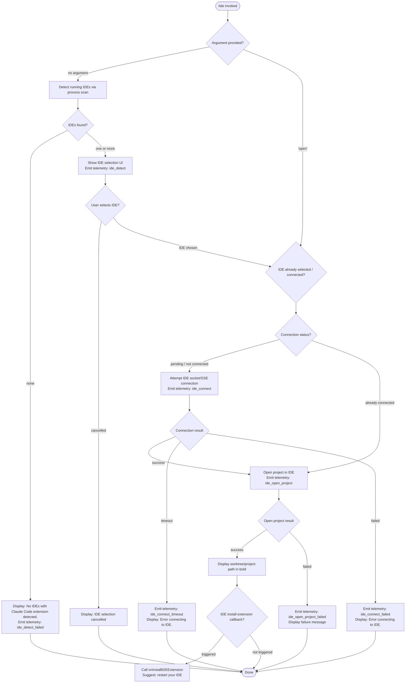

# `/ide`

> Analysis basis: CC v2.1.187 bundle.js (AST extraction + Claude interpretation)
> Minimum version: v2.1.187

---

## Overview

The `/ide` command manages IDE integrations for Claude Code, allowing users to detect connected IDEs, open the current project in a selected IDE, and monitor or establish the IDE extension connection. It operates as a local JSX component (rendered in the terminal UI), detecting running IDEs by process inspection and driving the IDE daemon/socket connection lifecycle.

---

## Registration

| Field | Value |
|---|---|
| type | `local-jsx` |
| name | `ide` |
| description | `Manage IDE integrations and show status` |
| argumentHint | `[open]` |
| module_id | `P_l` |
| load_inline | `true` |
| loc_byte | `11589790` |
| loc_byte_end | `11589946` |
| loc_line | `7283` |
| arbor_handler.name | `Knf` |
| arbor_handler.fqn | `claude-2.1.187::Knf` |
| arbor_handler.kind | `AsyncFunction` |
| arbor_handler.resolution_path | `module_id` |
| arbor_handler.n_hits | `0` |

Analysis basis: CC v2.1.187 bundle.js:+11589790

---

## Input Branching

The command has 4+ distinct branches driven by the argument value (`[open]` vs. absent) and connection state transitions, warranting a Mermaid flowchart.



---

## Behavioral Spec

### 1. Entry Point — Handler Dispatch (Knf)

The primary handler is the async function `Knf` (resolved by Arbor via `module_id` path from `P_l`).

```
async function ideCommandHandler(args, appState, tools):
    emit telemetry "tengu_ext_ide_command"   // loc_byte 11585985

    if args contains "open":
        subcommand = "open"
    else:
        subcommand = null

    connectedIDEs = detectRunningIDEs()      // calls ideProcessScanner

    if connectedIDEs is empty:
        display "No IDEs with Claude Code extension detected."
        return

    selectedIDE = await selectIDE(connectedIDEs, appState)
    if selectedIDE is null:
        display "No IDE selected."
        return

    if subcommand == "open":
        await openProjectInIDE(selectedIDE, appState)
    else:
        await connectToIDE(selectedIDE, appState)
```

Analysis basis: CC v2.1.187 bundle.js:+11585985

---

### 2. IDE Detection — Process Scanner (cxn / axn / ozd)

The IDE detector (`cxn`) scans running processes to find compatible IDEs. On Linux it runs a `ps aux` pipe grep; on macOS it uses a platform-native approach. It normalises process names to lowercase for matching.

```
async function detectRunningIDEs():
    platform = getPlatform()

    if platform == "linux":
        output = shellExec(
            "ps aux | grep -E \"code|cursor|windsurf|devin-desktop|idea|pycharm|..." +
            "| grep -v grep"
        )
        processList = parseProcessOutput(output)
    else:
        processList = getNativeProcessList()   // macOS / Windows path

    results = []
    for each process in processList:
        name = normaliseProcessName(process)    // toLowerCase, basename
        if name matches knownIDEPatterns:
            ideEntry = resolveIDEEntry(process)
            if ideEntry not already seen:
                results.push(ideEntry)

    emit telemetry "ide_detect" (on success) or "ide_detect_failed" (on error)
    return results
```

Known IDE name patterns matched (literals): `windsurf`, `devin`, `cursor`, `insiders`, `vscode`, `vs code`, `visual studio code`, `vscodium`, `code - oss`, `codium`, `jetbrains`, `appcode`, `IDE`.

Analysis basis: CC v2.1.187 bundle.js:+6690250 (cxn), +6686719 (ozd), +6693085 (Qia / name normaliser)

---

### 3. IDE Name Normalisation (Qia / uxn)

Two small helpers normalise the detected IDE display name:

```
function normaliseIDEDisplayName(rawName):
    lower = rawName.toLowerCase()
    if lower.includes("windsurf"): return "Windsurf"
    if lower.includes("devin"):    return "Devin Desktop"
    if lower.includes("cursor"):   return "Cursor"
    if lower.includes("insiders"): return "VS Code Insiders"
    if lower.includes("vscode") or lower.includes("vs code") ...: return "VS Code"
    if lower.includes("vscodium") or lower.includes("codium"): return "VSCodium"
    return rawName   // fallback

function resolveIDEExecutable(ideEntry):
    base = path.basename(ideEntry.execPath)
    lower = base.toLowerCase()
    if lower includes known suffix ".cmd": strip suffix
    return normalised executable name
```

Analysis basis: CC v2.1.187 bundle.js:+6693085 (Qia), +6693528 (uxn)

---

### 4. Open Project in IDE (Le / ide_open_project path)

When the `open` subcommand (or a post-connect auto-open) is executed:

```
async function openProjectInIDE(selectedIDE, appState):
    emit telemetry "ide_open_project"
    worktreePath = appState.worktree ?? appState.project

    try:
        result = await selectedIDE.openPath(worktreePath)
        display bold(path.basename(worktreePath))
        emit telemetry "ide_open_project" (success variant)
    catch error:
        emit telemetry "ide_open_project_failed"
        display error message
```

If the IDE reports that its extension is not installed, `onInstallIDEExtension` is invoked and the user is advised to "restart your IDE".

Analysis basis: CC v2.1.187 bundle.js:+11586517 (Le call / ide_open_project), +11587094 (onInstallIDEExtension), +11587186 ("restart your IDE" literal)

---

### 5. IDE Connection Flow — Socket/SSE (D_l render component)

The JSX component `D_l` renders the connection-status UI and drives the connection lifecycle using React hooks (`useState`, `useRef`, `useEffect`, `useCallback`).

```
function IDEStatusComponent(props):
    [connectionState, setConnectionState] = useState("pending")
    ideRef = useRef(null)

    useEffect(() => {
        attemptConnection()
    }, [selectedIDE])

    async function attemptConnection():
        emit telemetry "ide_connect"
        transport = chooseTransport(selectedIDE)   // "sse-ide" or "ws-ide"

        try:
            connection = await connectWithTimeout(transport, selectedIDE.socketPath)
            setConnectionState("connected")
            if props.subcommand == "open":
                openProjectInIDE(selectedIDE)
        catch TimeoutError:
            emit telemetry "ide_connect_timeout"
            setConnectionState("error")
            display "Error connecting to IDE."
        catch ConnectError:
            emit telemetry "ide_connect_failed"
            setConnectionState("error")
            display "Error connecting to IDE."

    // Disconnect tracking
    useEffect(() => {
        return () => {
            if wasConnected:
                emit telemetry "ide_disconnect"
        }
    }, [])

    // MCP filter: only show tools prefixed "mcp__ide__"
    filteredTools = allTools.filter(t => t.name.startsWith("mcp__ide__"))

    return renderStatusUI(connectionState, filteredTools)
```

Transport choice literals found: `"sse-ide"` (bundle.js:+11584026), `"ws-ide"` (bundle.js:+11584046). Connection attempt uses `"ws:"` prefix detection (bundle.js:+11588827) to select WebSocket vs SSE path.

Analysis basis: CC v2.1.187 bundle.js:+11587800 (D_l useState), +11588017 (ide_connect), +11588104 (ide_connect_failed), +11588211 (ide_connect_timeout), +11588607 (mcp__ide__ prefix filter)

---

### 6. IDE Process Path Resolution (ozd / worktree scanner)

The worktree / project-path scanner used when opening IDE paths:

```
async function resolveIDEProjectPaths(ideEntries):
    seen = new Set()
    results = []

    for each ide in ideEntries:
        candidates = [ide.workspacePath, path.join(homedir(), ".claude"), ...]
        resolved = await fs.realpath(candidate)

        // Skip system/shared Windows paths under WSL
        if resolved.startsWith("/mnt/c/Users"):
            basename = path.basename(resolved)
            if basename in ["Public", "Default", "Default User", "All Users"]:
                continue

        if resolved not in seen:
            seen.add(resolved)
            results.push(resolved)

    return results
```

WSL-path exclusion literals: `/mnt/c/Users` (bundle.js:+6688256), `Public`, `Default`, `Default User`, `All Users` (bundle.js:+6688350–6688414).

Analysis basis: CC v2.1.187 bundle.js:+6687958 (ozd GD.join), +6688711 (realpath), +6688256 (WSL path check)

---

### 7. Linux Process Detection (pzd / DJr)

On Linux, the process-list output is parsed line by line:

```
function parseLinuxProcessOutput(rawOutput):
    lines = rawOutput.split("\n")
    ideList = []

    for each line in lines:
        entries = Object.entries(processPatternMap)
        for [pattern, ideName] in entries:
            if line.includes(pattern) and not line.includes("grep"):
                name = ideName.toLowerCase()
                if name not already in ideList:
                    ideList.push({ name: ideName, line })

    // JetBrains special-case
    if line.includes("appcode") or line.toLowerCase().includes("jetbrains"):
        handle JetBrains path

    return ideList
```

The grep command string (literal): `ps aux | grep -E "code|cursor|windsurf|devin-desktop|idea|pycharm|webstorm|phpstorm|rubymine|clion|goland|rider|datagrip|dataspell|aqua|gateway|fleet|android-studio" | grep -v grep`
(bundle.js:+6695015)

Analysis basis: CC v2.1.187 bundle.js:+6694093 (pzd), +6695541 (DJr)

---

## State & Side Effects

| Item | Detail |
|---|---|
| Telemetry — `tengu_ext_ide_command` | Fired on every `/ide` invocation (bundle.js:+11585987) |
| Telemetry — `ide_detect` | Fired when IDE process scan succeeds (bundle.js:+6691605) |
| Telemetry — `ide_detect_failed` | Fired when no IDEs found or scan error (bundle.js:+6691669) |
| Telemetry — `ide_open_project` | Fired when attempting to open a project path in IDE (bundle.js:+11586520) |
| Telemetry — `ide_open_project_failed` | Fired on open-project failure (bundle.js:+11586627) |
| Telemetry — `ide_connect` | Fired when initiating IDE socket connection (bundle.js:+11588017) |
| Telemetry — `ide_connect_failed` | Fired on connection error (bundle.js:+11588104) |
| Telemetry — `ide_connect_timeout` | Fired when connection attempt times out (bundle.js:+11588211) |
| Telemetry — `ide_disconnect` | Fired when IDE connection is torn down (bundle.js:+11588710) |
| Telemetry — `tengu_feature_ok` / `tengu_feature_bad` / `tengu_feature_sad` | Generic feature outcome events emitted by the feature wrapper (bundle.js:+1025122, +1025189, +1025270) |
| Telemetry — `tengu_bg_*` (many) | Background daemon / worker lifecycle events triggered transitively by the daemon management path (see callGraph depth-2 entries) |
| Transport selection | Sets either SSE (`sse-ide`) or WebSocket (`ws-ide`) transport based on socket URL prefix `ws:` |
| MCP tool filter | Filters active tool list to only entries whose name starts with `"mcp__ide__"` (bundle.js:+11588607) |
| appState changes | Updates IDE connection state; triggers `onInstallIDEExtension` callback when extension install is needed |
| Hook registration | React `useEffect`, `useCallback`, `useRef`, `useState` hooks manage connection lifecycle within the JSX component |
| File I/O | Process scanner may invoke `fs.realpath` to resolve IDE executable symlinks |
| Sound | None observed |

---

## Version History

| Version | Change |
|---|---|
| v2.1.187 | Initial analysis |

---

## Common Mistakes

1. **Invoking `/ide open` without a running IDE**: If no IDE with the Claude Code extension is detected, the command exits immediately with "No IDEs with Claude Code extension detected." — there is no retry or install prompt at this stage.
2. **Expecting instant connection**: The connection attempt uses an async timeout; on slow or busy systems the `ide_connect_timeout` telemetry fires and the user sees "Error connecting to IDE." — retrying `/ide` after a moment is the correct recovery.
3. **Forgetting the extension install step**: If the IDE is detected but the extension is not installed, `onInstallIDEExtension` is triggered and the message "restart your IDE" is shown. Users must restart their IDE after installing the extension, not just reload a window.
4. **WSL path confusion**: On WSL systems, project paths under `/mnt/c/Users/Public`, `/mnt/c/Users/Default`, etc. are intentionally excluded from the IDE project list to avoid opening shared Windows user directories.
5. **MCP tool visibility**: Only tools whose names begin with `mcp__ide__` are surfaced in the IDE status view. Custom MCP tools with different prefixes will not appear here even if connected.

---

## Appendix — Identifier Mapping

> For bundle debugging only. Identifiers change across versions.

| Identifier | Role |
|---|---|
| `Knf` | Main async handler for `/ide` command (arbor_handler) |
| `ACo` | IDE command argument parser / entry coordinator |
| `D_l` | JSX React component rendering IDE status and driving connection lifecycle |
| `cxn` | IDE detection orchestrator — collects running IDE processes, resolves paths, emits detect telemetry |
| `axn` | IDE process path aggregator — maps raw process entries to resolved workspace paths |
| `ozd` | WSL-aware IDE workspace path resolver with realpath and exclusion logic |
| `Qia` | IDE display-name normaliser (toLowerCase + known-name matching) |
| `uxn` | IDE executable name resolver (basename, `.cmd` suffix stripping) |
| `DJr` | Linux process list parser / JetBrains handler |
| `pzd` | Linux ps-aux output line parser mapping process name patterns to IDE identities |
| `NC` | IDE process-info struct builder / platform lookup |
| `N1e` | Shell command executor used for ps-aux grep on Linux |
| `Wr` | Shell command runner with timeout (3000 ms, literal bundle.js:+2303809) |
| `SRr` | Process output string parser (parseInt, isNaN checks) |
| `Le` | Feature-ok telemetry emitter (`tengu_feature_ok`) |
| `Re` | Feature-bad telemetry emitter (`tengu_feature_bad`) |
| `Mt` | Feature-sad telemetry emitter (`tengu_feature_sad`) |
| `Pt` | App-state context reader helper |
| `xrn` | Store accessor (calls `Rrn.getStore`) |
| `gr` | State getter helper (calls `VL`) |
| `Hm` | UI helper used in rendering the IDE status component |
| `Un` | Composite helper combining shell runner (`Wr`) and state context (`Pt`) |
| `fd` | React context + useSyncExternalStore helper for reading app state in JSX |
| `Ht` | App-state hook (wraps `y6r`, `t.getState`, `ZCe.useSyncExternalStore`) |
| `So` | Secondary state hook (wraps `y6r`) |
| `KT` | MCP skill/tool set manager (calls `mit`, `o.cleanup`, `eL`) |
| `mit` | MCP tool hash/fingerprint builder (`RLe` → `msa.createHash sha256`) |
| `eL` | MCP skill iterator (calls `it`) |
| `C3o` | IDE socket claim / connect handler (sends claim frame, drives socket auth) |
| `pJf` | Send-claim timeout manager (5000 ms timeout literal; bundle.js:+17172757) |
| `fJf` | Low-level socket connect helper (`Yrr.connect`, `o.once`, `o.end`) |
| `dJf` | Claim frame builder (`dV.buildClaimFrame`) |
| `gR` | Binary frame serialiser (`Buffer.allocUnsafe`, `writeUInt32BE`, `writeUInt8`) |
| `bJf` | IPC/socket protocol message dispatcher (handles ping, nudge, yield, lease, shutdown, attach, reply, resize, snapshot, stream, state, subscribe) |
| `HEc` | Dispatch timeout/retry handler (30 000 ms literal; bundle.js:+17179350) |
| `Jte` | Timing-safe key comparison (`Psl.timingSafeEqual`) |
| `AJf` | Worker kill / IDE job cleanup handler |
| `CJf` | IDE message content cleaner (includes/replace) |
| `WXn` | Background upgrade/attach helper (calls `it`) |
| `SJf` | Attach stall measurement helper (Math.max, 2000 ms literal; bundle.js:+17176936) |
| `x3o` | Background worker session lifecycle manager (done/killed/failed/crashed/blocked/working/bg/daemon/idle states) |
| `Di` | File-based job roster manager (reads/writes roster entries, manages `qZ` map) |
| `N2e` | Pins file reader/writer (`pins.json`) |
| `fCd` | Job directory scanner (readdir, lstat, filter directories) |
| `_g` | Active-state resolver (`S0` → `$ie`) |
| `S0` | State canonical form resolver |
| `_ve` | Roster entry parser / filter (startsWith, indexOf, slice, set membership checks) |
| `cCd` | Roster line parser (segment extraction, set membership, dedup) |
| `kd` | Job file writer (`Cm` atomic write helper) |
| `Cm` | Atomic file writer (randomBytes temp name, writeFile, rename, copyFile, chmod, unlink) |
| `iht` | PTY/job file sync handler (`Wq`, `_tf`, Date.now) |
| `Wq` | PTY file validator/reader (lstat, isFile, readFile, error code checks E2BIG/EFTYPE) |
| `_tf` | PTY file atomic writer (mkdir, dirname, `Cm`) |
| `Eye` | PTY-pids file path builder (`jh.join`, `ZWe`) |
| `ZWe` | pty-pids directory path builder |
| `iHl` | PTY error/late path builder |
| `uN` | PTY main path builder (`jh.join`, `sht`) |
| `sht` | PTY file path sub-builder |
| `lM` | PTY late-path builder (calls `iHl`) |
| `s8t` | Auth-file path builder |
| `o8t` | Auth-file sub-path builder |
| `i8t` | PTY-pids path builder variant |
| `ZOo` | Session directory initialiser (mkdir, writeFile JSON.stringify, 448/384 mode literals) |
| `yR` | PTY error path helper |
| `F` | Dispose/cleanup helper with clearInterval |
| `u` | Daemon abort / process-exit coordinator |
| `Le` | (also) Daemon start helper (`Le` → `W`, `Pe`) |
| `Re` | (also) Daemon reconnect helper (`Re` → `W`, `Pe`) |
| `CU` | Daemon control emitter (`tengu_daemon_control`, calls `q9`, `aBr`, `u$e`) |
| `aBr` | Daemon session creator (randomUUID, `hZe`, `yW`, `e.emit`, `firstParty` literal) |
| `X6` | Daemon shutdown sequencer (Promise.race/all, `Ome`, `Vme`, `Kn`, process.exit) |
| `Kn` | Timed abort/promise racer (setTimeout, clearTimeout, `s.unref`) |
| `Vme` | Timeout clearer + GOo caller |
| `Ome` | Server shutdown caller (`Pme.shutdown`) |
| `p` | Daemon normalise/abort helper (forced-shutdown, `u.abort`) |
| `Kb` | Daemon stop-failed handler |
| `Is` | CLI error handler (`aqe`, `oT`, process.exit, `"cli_error"` literal) |
| `GXn` | Memory monitor (macOS freemem, `jt`, `it`, `tengu_bg_low_mem_mb`) |
| `it` | Background attach/upgrade emitter (`tengu_bg_attach_upgrade`, `ext`, `txt`, `V9`, `zIe`, `hSn`, `Dt`) |
| `Dt` | Telemetry dispatch helper (`Wt`, `n0`, `MOo`, `_Ee`, Date.now, `MRf`) |
| `hSn` | Telemetry dedup guard (`uBr.has/add`, `zIe.get`, `lBr`, `mBr`) |
| `D` | Worker process manager (FEc, sp, T, ke, GJf, d) |
| `FEc` | Worker real-path resolver (`Zrr.realpath`, `Zrr.stat`, `kn`) |
| `kn` | ENOENT-tolerant error classifier |
| `T` | Process spawn helper (gOe, Xwc, Me, wc, dze, eLc, QP) |
| `Xwc` | Spawn arguments builder (JP, xcr, I6o) |
| `Me` | JSON.stringify wrapper |
| `wc` | Command-line argument redactor (`[REDACTED]` literal) |
| `dze` | Spawn debug logger (`JWo`) |
| `eLc` | IPC channel setup (FKe, dpe, upe.dirname, JP, Wt, Mre, Buffer.byteLength, 1000 ms literal) |
| `ke` | Error formatter (`fo`, `nt`, `Vi`, `Qru`, `c7e.push`, `jJ.logError`) |
| `fo` | Error stringifier |
| `nt` | String coercer |
| `Vi` | Essential-traffic classifier |
| `Qru` | Error ring-buffer manager (`Crn.shift/push`) |
| `GJf` | Worker version-path builder (`B2n`) |
| `B2n` | Version directory resolver (`Im`, `H5e.join`, `Nee`, `claude`, `versions` literals) |
| `d` | Worker I/O stream manager (Z8e, f$l, E.stop, A.stop/updateConfig/start, OEc, I.start, W) |
| `Z8e` | File write guard (`p$l.stat`, isFile, 1048576 byte limit literal) |
| `f$l` | Column-width calculator (Object.keys, Math.max, XH) |
| `OEc` | Heartbeat manager (`Xse`) |
| `E` | Spinner/progress stop helper (`FUt`, `eyt`) |
| `A` | Terminal scroll limiter (Math.max, Math.min) |
| `I` | Keyboard event handler (Math.max, Math.floor, x.preventDefault) |
| `U` | Idle-exit timer manager (clearTimeout, setTimeout, `tengu_daemon_idle_exit`, Math.round, W, M.unref) |
| `M` | Write-throttle timer (clearTimeout, c.write) |
| `c` | Daemon transport socket (`En`) |
| `L` | Sweep/prewarm loop (Date.now, w.values, V.shiftGraceClocksForward, DVt, V2l, N2e, ke, Promise.all, zn, WXn, it) |
| `f` | IDE daemon client main loop (n.get, W, D.kill, Kn, Re, Le, freemem, GXn, Math.round, N2e, ke, it, C3o, n.set, x3o, s, Date.now, cn, Pe, dV.spawn) |
| `m` | Worker kill helper (n.values, x.kill) |
| `x` | Worker write/yield helper (d.write, W) |
| `H` | Protocol framing handler (Buffer.concat, g.indexOf, mp, bJf, startsWith check) |
| `mp` | Connection end/Me helper |
| `g` | Request timer helper (a, r.setTimeout) |
| `J` | Job list updater (_, brr, j.applyMcpUpdate, i9e, z.push, X.push) |
| `j` | Voice/session kick helper (_.current, V.setTimeout, T, X) |
| `K` | Permission handler (cMe, zgl) |
| `z` | Backspace key handler (K.preventDefault, U) |
| `q` | Close event handler |
| `X` | IZn write helper |
| `P` | Protocol state variable |
| `v` | Protocol data variable |
| `rue` | Reconnect helper |
| `y` | Repaint trigger (U5e) |
| `_` | SDK/MCP session manager (eyt, qD, Ox, Promise.all, k7, SB, ke, fo) |
| `eyt` | Session config object reader (`fyc`) |
| `fyc` | Object.keys config walker |
| `Yia` | Process kill helper (`process.kill`) |
| `Zia` | String replacer helper |
| `tL` | IDE CLI command path builder (`fi`, GD.basename, W3e) |
| `fi` | Path segment extractor (indexOf, slice) |
| `Mt` | (also) Feature-sad telemetry wrapper |
| `Ree` | IDE status display renderer |
| `$nf` | IDE status sub-component |
| `PDi` | Argument regex matcher (`e.match`) |
| `lF` | Logging/format helper |
| `Hm` | UI box/layout helper |
| `y6r` | AppState context reader (ZCe.useContext, ReferenceError guard) |
| `v_` | Background-service label renderer (`XIe`, `"background service"` literal) |
| `L3o` | Protocol framing length helper |
| `TJf` | Protocol message type handler |
| `uoe` | Invalid-resume-id file scanner (VS, Wy, OK.join, s2, `invalid-resume-id.jsonl` literal) |
| `ec` | Job directory path builder (py.join, Vk) |
| `Vk` | Job path sub-builder (py.join, or) |
| `xDt` | Pins path builder (py.join, Vk) |
| `Df` | Job state classifier (cn, ipe.has, T, be, ke) |
| `fy` | qZ.delete cleanup helper |
| `cn` | ENOENT/permission error classifier |
| `Jd` | Error code normaliser |
| `be` | String coercer (String()) |
| `Gt` | JSON.parse wrapper |
| `Wt` | Async-safe state updater |
| `Xo` | Permission-error re-thrower (cn) |
| `sp` | Platform identifier |
| `pe` | (Pe) Protocol event emitter (rKe) |

---

Note: index built via Arbor fallback; some signals (telemetry, literals) may be missing — see arbor-fallback.js.