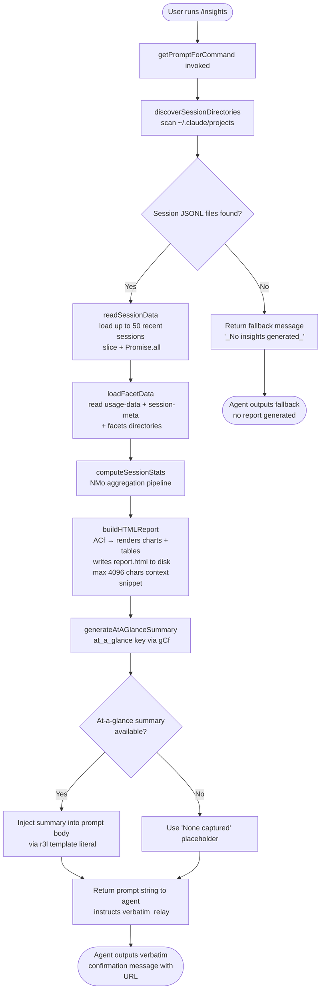

# `/insights`

> Analysis basis: CC v2.1.187 bundle.js (AST extraction + Claude interpretation)
> Minimum version: v2.1.187

---

## Overview

`/insights` generates a shareable HTML usage-report from the user's local Claude Code session data and then instructs the agent to relay a fixed confirmation message to the user. The command reads JSONL session logs and facet data files from disk, computes aggregated statistics, renders a self-contained HTML report, and finally surfaces a report URL and file path through a tightly constrained agent prompt.

---

## Registration

| Field | Value |
|---|---|
| type | `prompt` |
| name | `insights` |
| description | `Generate a report analyzing your Claude Code sessions` |
| loc_byte | `13201932` |
| loc_byte_end | `13203236` |
| loc_line | `9973` |
| handler_method | `getPromptForCommand` |
| handler_method_start | `13202106` |
| handler_method_end | `13203235` |
| prompt_body.length | `513` |
| prompt_body.trace | `call→r3l(...) (1 literals)` |
| arbor_handler.name | `getPromptForCommand` |
| arbor_handler.fqn | `claude-2.1.187::getPromptForCommand` |
| arbor_handler.kind | `Method` |
| arbor_handler.resolution_path | `direct` |
| arbor_handler.n_hits | `1` |

Analysis basis: CC v2.1.187 bundle.js:+13201932

---

## Input Branching

The handler has three or more distinct execution paths (session-data present vs. absent, report generation success vs. error, at-a-glance summary present vs. absent), so a flowchart is used.



---

## Behavioral Spec

### 1. Handler Entry — `getPromptForCommand`

The handler is an inline `ObjectMethod` on the registration object, resolved by Arbor via `direct` path. It orchestrates the full pipeline synchronously (awaiting async sub-calls) and returns a prompt string.

```
async function getPromptForCommand(context):
    sessionDirs = await discoverSessionDirectories()
    if sessionDirs is empty:
        return formatPromptWithFallback("_No insights generated_")

    recentSessions = sessionDirs.slice(0, 50)          // limit: 50 sessions
    sessionData    = await Promise.all(recentSessions.map(loadSessionFile))

    facetData      = await loadFacetData(sessionDirs)
    stats          = computeSessionStats(sessionData, facetData)
    report         = await buildAndWriteHTMLReport(stats)

    atAGlance      = stats.at_a_glance ?? "None captured"
    roundedMetric  = Math.round(stats.primaryMetric)   // Math.round at +13202493

    promptText     = r3l(report.url, report.htmlPath,
                         report.facetsDir, atAGlance,
                         roundedMetric)                // template builder at +13203138
    return promptText
```

Analysis basis: CC v2.1.187 bundle.js:+13202106

---

### 2. Session Directory Discovery — `discoverSessionDirectories` (`TCf`)

Scans the local projects directory to enumerate per-project session folders. Uses `readdir` to list entries, filters for directories only, and returns sorted results with a `setImmediate`-based yield to avoid blocking the event loop.

```
async function discoverSessionDirectories():
    projectsRoot = pathJoin(configDir, "projects")     // "projects" literal at +5244055
    entries      = await fs.readdir(projectsRoot)
    dirs         = entries.filter(entry => entry.isDirectory())
    await yieldToEventLoop()                            // setImmediate at +13188771
    return dirs.sort()                                 // r.sort at +13188795
```

Concurrency constants observed: batch size 10, overlap 9 (`literals` at +13188741, +13188746); outer cap 50, inner slice 200 (`literals` at +13188883, +13188888).

Analysis basis: CC v2.1.187 bundle.js:+13188472

---

### 3. JSONL Session File Enumeration — `enumerateJSONLFiles` (`hHt`)

For each project directory, reads all `.jsonl` files (extension literal `".jsonl"` at +13287303), filters to files only (`o.isFile`), collects file stats (`gl.stat`), and builds a sorted list of session records.

```
async function enumerateJSONLFiles(projectDir):
    entries = await fs.readdir(projectDir)
    files   = entries
                .filter(e => e.isFile())
                .filter(e => isJSONLExtension(e))      // MM / kIc.test at +27890
    fileMeta = await Promise.all(
                 files.map(async f => ({
                     name: path.basename(f),
                     path: path.join(projectDir, f),
                     stat: await fs.stat(path.join(projectDir, f))
                 }))
               )
    fileMap.set(projectDir, fileMeta)
    return categorizeByTimestamp(fileMeta)             // T at +13287605
```

Analysis basis: CC v2.1.187 bundle.js:+13287197

---

### 4. Session Data Loading — `loadSessionFile` (`pCf`)

Reads one JSONL file, decodes it as UTF-8 (`"utf-8"` literal at +13133847), and parses each line via `JSON.parse` (`Gt` at +13133868). Computes the session-meta path via `PMo` → `QVt` which joins `"session-meta"` sub-directory (`literal` at +13127794) under `"usage-data"` (`literal` at +13127698).

```
async function loadSessionFile(sessionPath):
    metaDir  = pathJoin(usageDataRoot, "session-meta")
    raw      = await fs.readFile(sessionPath, { encoding: "utf-8" })
    parsed   = safeJSONParse(raw)                      // Gt → JSON.parse at +192895
    cleaned  = stripNullValues(parsed)                 // ZBl at +13133864
    return parsed
```

Analysis basis: CC v2.1.187 bundle.js:+13133780

---

### 5. Facet Data Loading — `loadFacetsDirectory` (`hJn` → `Qle`)

Reads the `"facets"` sub-directory (`literal` at +13127748) for each project, building multiple keyed Maps covering session transcript metadata, file-history snapshots, attribution snapshots, content-replacement records, isolation-latch state, worktree state, PR links, bridge-session markers, fork-context refs, and marble-origami commits/snapshots/resets. Each facet type is stored under its own Map key.

```
async function loadFacetsDirectory(projectDir):
    facetsPath = pathJoin(usageDataRoot, "facets", projectDir)
    initMaps: {
        summary, last-prompt, custom-title, ai-title,
        tag, agent-name, agent-color, agent-setting,
        mode, permission-mode, isolation-latch,
        worktree-state, pr-link, bridge-session,
        file-history-snapshot, attribution-snapshot,
        content-replacement, fork-context-ref,
        marble-origami-commit, marble-origami-snapshot,
        marble-origami-reset
    }
    files = await fs.readFile(facetsPath)
    for each file:
        parseAndIndexIntoMap(file, maps)               // Evf / yvf at +13269897, +13268688
    return maps
```

Transcript parsing uses a high-performance synchronous reader (`Evf`) with a 1 MB buffer (`1048576` at +13270234) and a 64 KB chunk size (`65536` at +13271555).

Analysis basis: CC v2.1.187 bundle.js:+13287947

---

### 6. Statistics Aggregation Pipeline — `aggregateSessionStats` (`NMo` + `QBl`)

Processes raw session entries into aggregated metrics used by the report. Handles tool-use classification (WebSearch, WebFetch, Edit, Write, `mcp__`-prefixed tools), git-operation detection (`"git commit"`, `"git push"`), response-time bucketing (2–10 s, 10–30 s, 30 s–1 m, 1–2 m, 2–5 m, 5–15 m, >15 m), time-of-day bucketing (Morning 6–12, Afternoon 12–18, Evening 18–24, Night 0–6), and error-category classification (Command Failed, User Rejected, Edit Failed, File Changed, File Too Large, File Not Found, Request Interrupted).

```
function aggregateSessionStats(sessions, facets):
    for each session entry:
        classifyToolUse(entry)           // QBl at +13128232
        detectGitOps(entry)
        bucketResponseTime(entry)        // time buckets at +13145034 … +13145094
        bucketTimeOfDay(entry)           // Morning/Afternoon/Evening/Night at +13145882 …
        classifyErrors(entry)            // error categories at +13129409 …
    computeRollingAverages()             // e3l at +13136079
    computeHourlyDistribution()          // using getHours at +13129081
    return statsObject
```

Session duration capped at 3600 seconds per session (`literal` at +13129195); rolling window cap 1 800 000 ms (`literal` at +13136271); warmup filter key `"warmup_minimal"` (`literal` at +13190679).

Analysis basis: CC v2.1.187 bundle.js:+13130468

---

### 7. HTML Report Generation — `buildHTMLReport` (`ACf`)

Constructs a self-contained HTML report file. Renders multiple chart sections using inline HTML/CSS:

- **Tool usage bar charts** — `cEe` at +13144385; colour palette `#2563eb`, `#0891b2`, `#10b981`, `#8b5cf6` (literals at +13182699–13183152)
- **Response-time distribution** — `yCf` at +13145407
- **Time-of-day activity** — `ECf` at +13146114; colours `#dc2626`, `#16a34a`, `#eab308` (literals at +13186415–13187157)
- **Suggestions / "Add to CLAUDE.md"** — literal at +13150378
- Empty-state placeholders: `"<p class=\"empty\">No data</p>"` (+13144525), `"<p class=\"empty\">No response time data</p>"` (+13144982), `"<p class=\"empty\">No tool errors</p>"` (+13186426)
- HTML entity escaping via `qd` → `Ol` (`&amp;`, `&lt;`, `&gt;`, `&quot;`, `&apos;`)
- Bold formatting: `<strong>$1</strong>` (+13146740); list bullets `"• "` (+13146783); line breaks `"<br>"` (+13146813)

Maximum context snippet injected into prompt: 4096 characters (`literal` at +13135729).

Output filename: `report.html` (`literal` at +13191121).

```
async function buildHTMLReport(stats):
    html = renderHTMLSections(stats)     // ACf pipeline at +13190843
    ensureDir(outputDir)                 // a$.mkdir at +13190862
    timestamp = formatTimestamp(         // getFullYear/getMonth/getDate/
                    new Date())          //   getHours/getMinutes/getSeconds
    outputPath = pathJoin(outputDir,
                     timestamp, "report.html")
    await fs.writeFile(outputPath, html) // a$.writeFile at +13191149
    return { url, htmlPath: outputPath,
             facetsDir, snippet: html.slice(0, 4096) }
```

Analysis basis: CC v2.1.187 bundle.js:+13190843

---

### 8. Per-Session Facet Writing — `writeFacetRecord` (`fCf` / `dCf`)

When processing a session, the pipeline writes normalised facet JSON into the `usage-data/session-meta` directory and a companion `facets` directory. Maximum prompt context stored per facet entry: 384 tokens (`literal` at +13134496).

```
async function writeFacetRecord(sessionId, facetData):
    metaDir = pathJoin(usageDataRoot, "session-meta", sessionId)
    await fs.mkdir(metaDir, { recursive: true })
    await fs.writeFile(
        pathJoin(metaDir, "data.json"),
        JSON.stringify(facetData))          // Me → JSON.stringify at +192118
```

Analysis basis: CC v2.1.187 bundle.js:+13134364

---

### 9. Prompt Assembly and Agent Instruction — `r3l`

After the report file is written, `getPromptForCommand` calls the template-builder function `r3l` (+13203138) with the computed report URL, HTML file path, facets directory, at-a-glance summary, and a rounded numeric metric. The resulting 513-character prompt string instructs the agent to:

1. Acknowledge that the user ran `/insights`.
2. Present the full insights data, report URL, HTML path, and facets directory (injected at runtime).
3. Include an at-a-glance summary for the agent's context only (the user has not yet seen any output).
4. Output the text enclosed in `<message>…</message>` tags **verbatim** as its entire response, without omitting any line. The message confirms that the shareable report is ready and invites the user to explore a section or try a suggestion.

If no sessions were found, the agent receives a fallback prompt referencing the literal `"_No insights generated_"` (+13203003).

Analysis basis: CC v2.1.187 bundle.js:+13202106, +13203138

---

## State & Side Effects

| Item | Detail |
|---|---|
| Telemetry | `tengu_transcript_phantom_parent` (+13272445); `tengu_relink_walk_broken` (+13250563); `tengu_transcript_parent_cycle` (+13276365); `tengu_chain_parent_cycle` (+13252340); `tengu_chain_timestamp_fallback` (+13252489); `tengu_chain_parallel_tr_recovered` (+13254355). MCP-path telemetry also reachable: `tengu_mcp_skills` (+6652661). Daemon telemetry (`tengu_daemon_control`, `tengu_daemon_config_reload`, `tengu_daemon_yield`, `tengu_daemon_idle_exit`) reachable through shared infrastructure but not specific to `/insights` execution. |
| File system writes | Creates `~/.claude/projects/<project>/usage-data/session-meta/<id>/` and `facets/` directories; writes `report.html` under a timestamped output directory. |
| File system reads | Reads all `.jsonl` conversation logs under `~/.claude/projects`; reads `usage-data`, `session-meta`, and `facets` sub-directories. |
| appState changes | None observed in depth-2 traversal. |
| Hook registration | None observed in depth-2 traversal. |
| Sound | None observed. |
| MCP connections | `getPromptForCommand` reaches MCP infrastructure (`a9e`, `uBo`, `brr`) through the shared connection-manager subsystem; this is background infrastructure, not triggered by `/insights` directly. |

---

## Version History

| Version | Change |
|---|---|
| v2.1.187 | Initial analysis |

---

## Common Mistakes

1. **Running `/insights` in a workspace with no prior sessions** — the command silently returns the `"_No insights generated_"` fallback because `discoverSessionDirectories` finds no `.jsonl` files; no report file is written.
2. **Expecting interactive input** — `/insights` takes no arguments. The command reads existing session data only; passing arguments has no effect.
3. **Expecting the agent to summarise or paraphrase the report** — the prompt explicitly instructs the agent to relay the `<message>` block verbatim. Any deviation from this is an agent non-compliance, not a command limitation.
4. **Assuming the HTML report is immediately openable via the printed URL** — the URL is computed at report-generation time and inserted by `r3l`; it may be a `file://` path that requires the OS to open the file locally.
5. **Expecting real-time data** — the command reads snapshot files on disk; any sessions started after the command was invoked are not included.
6. **Confusing the facets directory with raw logs** — the `facets/` directory stores normalised, per-session structured JSON records, not raw JSONL transcripts. The two hierarchies are distinct within `usage-data/`.

---

## Appendix — Identifier Mapping

> For bundle debugging only. Identifiers change across versions.

| Identifier | Role |
|---|---|
| `__handler_insights` | Synthetic BFS entry point for the `/insights` command handler (not a real bundle symbol) |
| `n3l` | Top-level insights pipeline orchestrator (called by `getPromptForCommand`) |
| `TCf` | Session directory discovery — scans projects root, filters dirs, sorts |
| `i7` | Path-join helper combining config root with `"projects"` segment |
| `hHt` | JSONL file enumerator within a project directory |
| `MM` | JSONL extension test predicate (wraps `kIc.test`) |
| `T` | Timestamp categorisation / file classification helper |
| `pCf` | Single-session file loader (reads + parses JSONL) |
| `PMo` | Session-meta path resolver |
| `QVt` | Usage-data path resolver |
| `ZBl` | Null-value stripper for parsed session objects |
| `Gt` | Safe JSON parse wrapper |
| `hJn` | Facets directory loader / indexer |
| `Qle` | Facet Map initialiser and per-facet-type index builder |
| `KCf` | Facet key dispatcher |
| `Evf` | High-performance synchronous JSONL binary reader (1 MB buffer) |
| `Svf` | Synchronous single-record binary reader |
| `yvf` | Streaming JSONL parser for facet records |
| `w3l` | Facet relink / parent-chain walker |
| `XHe` | Transcript chain builder (handles cycles via `tengu_chain_parent_cycle`) |
| `avf` | NaN-guard for chain timestamp values |
| `lvf` | Parallel-transcript recovery sorter |
| `svf` | Chain segment dequeue helper |
| `Z3l` | Transcript segment accumulator |
| `out` | Entry mapper for chain segments |
| `fDo` | Prompt-text extractor / replaceAll cleaner |
| `yqt` | Compact-summary detector and text extractor |
| `hDo` | Attachment-type classifier |
| `cvf` | Image/document content filter |
| `uvf` | Array-type content checker |
| `LJn` | Tool-result lookup helper |
| `kJn` | Array.from values collector |
| `NMo` | Session statistics aggregator (main stats pipeline) |
| `QBl` | Per-entry classifier (tool-use, git ops, error categories) |
| `rCf` | File-extension extractor for tool-use entries |
| `JVt` | Tool-use categorisation helper |
| `Fwe` | Diff computation helper (`SGi.diff`) |
| `nu` | Index-of helper for classification |
| `mh` | Numeric rounding helper for aggregated stats |
| `oCf` | NaN guard for session counts |
| `OMo` | Output-metrics formatter |
| `fCf` | Session-meta facet writer |
| `dCf` | Facets-directory writer |
| `uCf` | Facet cleanup / unlink helper |
| `mJn` | Session-meta path builder |
| `o3l` | JSON parse-or-default helper |
| `mCf` | Full per-session processing pipeline |
| `cCf` | Chunked session-batch processor |
| `iCf` | Inner session record builder |
| `Zpt` | Agent-listing delta processor |
| `oqn` | Agent listing delta writer (creates hash, writes to disk) |
| `On` | UUID-based output path builder |
| `G8e` | Assistant-message extractor |
| `XBl` | Per-session HTML snippet builder |
| `ZIf` | Session output path resolver |
| `ACf` | Full HTML report renderer |
| `SCf` | JSON-stringify helper for report sections |
| `cEe` | Tool-usage chart HTML builder |
| `yCf` | Response-time distribution chart builder |
| `ECf` | Time-of-day / error chart builder |
| `fJn` | Section-label formatter |
| `qd` | HTML entity escaper |
| `Ol` | `replaceAll` entity-escape helper |
| `gCf` | At-a-glance summary generator |
| `t3l` | Detailed statistics table builder |
| `mHt` | `Object.entries` statistics mapper |
| `e3l` | Rolling-average / percentile calculator |
| `fi` | Slice/indexOf helper for stat windows |
| `ICf` | `Object.keys` stat-key enumerator |
| `r3l` | Prompt template-literal builder (assembles final 513-char prompt) |
| `Me` | `JSON.stringify` wrapper |
| `fo` | Error-string formatter |
| `ke` | Structured error logger / reporter |
| `Xo` | Canonical-path helper |
| `nt` | `String()` coercion helper |
| `n_` | RTe-based path normaliser |
| `kf` | Main-thread path resolver |
| `kt` | VL-based URL/path helper |
| `Kl` | Filter-based list pruner |
| `lk` | Literal key helper |
| `zL` | VL wrapper utility |
| `KO` | Output-key finaliser |
| `JBl` | n_-based path joiner |