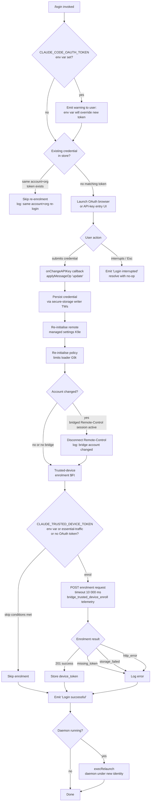

# `/login`

> Analysis basis: CC v2.1.187 bundle.js (AST extraction + Claude interpretation)
> Minimum version: v2.1.187

---

## Overview

`/login` is the account-switching and initial sign-in command for Claude Code. When invoked it launches an OAuth browser flow (or accepts an API key), stores the resulting credential, re-initialises remote-settings and policy-limits subsystems, and optionally re-launches the daemon under the new identity. The command exposes a JSX-based interactive UI (`cRe` / `kkp` component tree) and integrates with the trusted-device enrolment service.

---

## Registration

| Field | Value |
|---|---|
| type | `local-jsx` |
| name | `login` |
| description | `Switch Anthropic accounts \| Sign in with your Anthropic account` |
| module_id | `u9a` |
| load_inline | `true` |
| loc_byte | `11631729` |
| loc_byte_end | `11631949` |
| loc_line | `7767` |
| arbor_handler.name | `oyl` |
| arbor_handler.fqn | `claude-2.1.187::oyl` |
| arbor_handler.kind | `Function` |
| arbor_handler.resolution_path | `direct` |
| arbor_handler.n_hits | `2` |

Analysis basis: CC v2.1.187 bundle.js:+11631729

---

## Input Branching

The command has more than three distinct execution paths (OAuth browser flow, existing-token re-login, API-key path, daemon relaunch, interrupt/cancel). A flowchart is used.



---

## Behavioral Spec

### Top-level login handler (`kkp` / `oyl`)

The handler is the JSX component registered under module `u9a`. Its React render tree is rooted at `cRe`; the state machine runs inside `lRe`.

```
function loginCommandHandler(props):
    render <LoginView props=props />

component LoginView(props):
    [loginState, dispatch] = useReducer(loginReducer)
    useEffect(() => subscribeToFeatureEvents(Kz))

    oauthWarning = checkEnvOverride()   // CLAUDE_CODE_OAUTH_TOKEN
    if oauthWarning:
        display warning string           // bundle.js:+8945078

    inputComponent = buildInputWidget(xm, s1i, XGr)
    keyHandler   = registerKeyHandler(Dr)

    if loginState == "Login successful":   // bundle.js:+8945499
        props.onDone()
    if loginState == "Login interrupted":  // bundle.js:+8945518
        props.onDone()

    render jsxs(LoginLayout, [
        oauthWarning?,
        inputComponent,
        exitHint("Press Esc / Ctrl-C to cancel"),  // bundle.js:+8946014
    ])
```

Analysis basis: CC v2.1.187 bundle.js:+8945437 (`kkp` → `cRe` → `lRe`)

---

### Core login state machine (`lRe`)

```
async function loginStateMachine(context):
    // 1. Kick off remote-settings re-load (K9e)
    remoteSettingsManager = initRemoteSettings()       // bundle.js:+8943885

    // 2. Apply message op "update"                     // bundle.js:+8943792
    context.applyMessageOp("update")

    // 3. Read current credential from store
    existing = du.get(context.credentialKey)            // bundle.js:+8943905

    if existing and sameAccountAndOrg(existing, newCred):
        log("[trusted-device] Same account+org re-login … skipping re-enrollment")
                                                        // bundle.js:+8944674
        return Promise.resolve()                        // bundle.js:+8943939

    // 4. Persist new credential
    y5e(newCred)                                        // bundle.js:+8943969

    // 5. Relaunch daemon
    f.execRelaunch()                                    // bundle.js:+8943991

    // 6. Reset network caches
    clearCACertCache()    // Hcs  bundle.js:+8942159
    clearMTLSCache()      // Scs  bundle.js:+8942165
    clearProxyCache()     // yCr  bundle.js:+8942171

    // 7. Reload global config
    globalConfig = K5(context)                          // bundle.js:+8944070

    // 8. Refresh feature flags
    refreshFeatures(HSn)                                // bundle.js:+8940506

    // 9. If bridge Remote-Control session active and account changed:
    if context.getAppState().bridge and accountChanged:
        log("[bridge:repl] Account changed via /login — disconnecting …")
                                                        // bundle.js:+8944407
        context.setAppState(disconnectBridge)           // bundle.js:+8944495

    // 10. Trusted-device enrolment
    enrollResult = await trustedDeviceEnroll($Ft)       // bundle.js:+8944781

    // 11. Emit login result
    if success:
        emit "Login successful"
    else:
        emit "Login interrupted"
```

Analysis basis: CC v2.1.187 bundle.js:+8943750 – +8944890

---

### Remote-managed settings re-initialisation (`K9e`)

Triggered after credential change to pull fresh enterprise/team settings.

```
async function reinitRemoteSettings(authContext):
    hashPayload = computeHash(tHa)          // sha256/hex  bundle.js:+7241222
    prevHash    = cachedHash

    if hashPayload == prevHash:
        log("Remote settings: Cache still valid (304 Not Modified)")
                                            // bundle.js:+7268627
        return

    settingsPromise = fetchRemoteSettings(WHa)
    // HTTP headers: User-Agent, If-None-Match  bundle.js:+7266014 / +7266040
    // Accepted status codes: 200, 204, 304, 404  bundle.js:+7266134–7266161
    // Auth-required guard: 401 forces re-auth   bundle.js:+7267276

    result = await settingsPromise with timeout(B7 backoff)

    switch result.status:
        case "succeeded":
            applySettings(Tno)
            log("Remote settings: Applied new settings successfully")
                                            // bundle.js:+7269015
            emit telemetry "remote_managed_settings_pull"
                                            // bundle.js:+7268376
        case "user_rejected":
            log("Remote settings: User rejected new settings, using cached settings")
                                            // bundle.js:+7268865
        case "fetch_failed":
            log("Remote settings: Using stale cache after fetch failure")
                                            // bundle.js:+7268458
            emit telemetry "remote_managed_settings_fetch_failed"
                                            // bundle.js:+7268407
        case "unexpected":
            emit telemetry "remote_managed_settings_unexpected"
                                            // bundle.js:+7269330

    log("Remote settings: Refreshed after auth change")  // bundle.js:+7269894
```

Analysis basis: CC v2.1.187 bundle.js:+7269883 (`VHa` → `K9e` flow)

---

### Policy-limits re-initialisation (`G9t`)

```
async function reinitPolicyLimits(authContext):
    // Uses the same fetch / cache / backoff pattern as remote settings
    result = await fetchPolicyLimits(dGl, pGl)

    switch result:
        case "succeeded":
            log("Policy limits: Applied new restrictions successfully")
                                            // bundle.js:+13730999
        case "stale_cache_used":
            log("Policy limits: Using stale cache after fetch failure")
                                            // bundle.js:+13730615
        case "304":
            log("Policy limits: Cache still valid (304 Not Modified)")
                                            // bundle.js:+13730780
        case "unexpected_error":
            log("Policy limits: Using stale cache after error")
                                            // bundle.js:+13731191

    emit telemetry "policy_limits_fetch"    // bundle.js:+13730188
    log("Policy limits: Refreshed after auth change")  // bundle.js:+13732133
```

Analysis basis: CC v2.1.187 bundle.js:+8944107 (`lRe` → `G9t`)

---

### Trusted-device enrolment (`$Ft`)

```
async function trustedDeviceEnroll(oauthToken, appState):
    // Skip conditions (in order):
    if env.CLAUDE_TRUSTED_DEVICE_TOKEN:
        log("[trusted-device] CLAUDE_TRUSTED_DEVICE_TOKEN env var is set, skipping enrollment")
                                            // bundle.js:+7223989
        return

    if isEssentialTrafficOnly():
        log("[trusted-device] Essential traffic only, skipping enrollment")
                                            // bundle.js:+7224303
        return

    if not oauthToken:
        log("[trusted-device] No OAuth token, skipping enrollment")
                                            // bundle.js:+7224416
        return

    // Enrol
    response = await POST(enrollEndpoint,
        headers={"Content-Type":"application/json"},  // bundle.js:+7224667
        timeout=10000                                  // bundle.js:+7224710
    )

    switch response.status:
        case 201:                           // bundle.js:+7224898
            if not response.device_token:
                log("[trusted-device] Enrollment response missing device_token field")
                                            // bundle.js:+7225095
                emit telemetry outcome="missing_token"
                return
            storeDeviceToken(Gl)            // secure-storage write
            emit telemetry "bridge_trusted_device_enroll" outcome="success"
                                            // bundle.js:+7224812
        default (http_error):
            emit telemetry outcome="http_error"  // bundle.js:+7225017
            // storage failure path also handled  bundle.js:+7225404
```

Analysis basis: CC v2.1.187 bundle.js:+8944781 (`lRe` → `$Ft`)

---

### Credential secure-storage writer (`Gl` / `TWs`)

```
async function writeCredentialToStorage(credential):
    // Attempt primary secure store
    try:
        primaryResult = await securePrimaryWrite(credential)
        emit telemetry "secure_storage_credentials_write"  // bundle.js:+2337252
    catch:
        if primaryTransient:
            emit telemetry "primary_transient_skip_fallback"  // bundle.js:+2337350
            raise
        // Fall through to plaintext fallback
        plaintextWrite(credential)
        emit telemetry "plaintext_fallback_used"   // bundle.js:+2337499

    if primaryAndFallbackBothFailed:
        emit telemetry "primary_and_fallback_failed"  // bundle.js:+2337602
```

Analysis basis: CC v2.1.187 bundle.js:+2337249 (`TWs` write path)

---

### Backoff / retry helper (`B7`)

Used by both remote-settings and policy-limits fetch loops.

```
function exponentialBackoff(attempt, baseMs=32000):  // bundle.js:+13720931
    delay = min(baseMs, baseMs * pow(2, attempt) * 0.25)  // bundle.js:+13720957/+13720994
    jitter = random() * delay                             // bundle.js:+13720980
    parsed = parseInt(delay + jitter)                     // bundle.js:+13721013
    if isNaN(parsed): parsed = 10                         // bundle.js:+13721024
    return max(0, parsed)                                 // bundle.js:+13721048
```

Analysis basis: CC v2.1.187 bundle.js:+13720944

---

## State & Side Effects

| Item | Detail |
|---|---|
| Telemetry — remote settings | `tengu_remote_settings_401_force_refresh_retry` (bundle.js:+7267345) |
| Telemetry — managed settings security | `tengu_managed_settings_security_dialog_shown` (+7262956), `…_accepted` (+7262640), `…_rejected` (+7262690) |
| Telemetry — remote settings pull | `remote_managed_settings_pull` (+7268376), `remote_managed_settings_fetch_failed` (+7268407), `remote_managed_settings_unexpected` (+7269330) |
| Telemetry — policy limits | `tengu_policy_limits_fetch` (+13730188), `tengu_policy_limits_cache_write_failed` (+13729591) |
| Telemetry — trusted device | `bridge_trusted_device_enroll` (+7224812) |
| Telemetry — config | `tengu_config_auth_loss_prevented` (+13747209) |
| Telemetry — feature flags | `tengu_feature_ok` (+1025122), `tengu_feature_bad` (+1025189), `tengu_feature_sad` (+1025270) |
| Telemetry — auto mode | `tengu_auto_mode_config` (+13610472), `tengu_disable_bypass_permissions_mode` (+13612681) |
| Telemetry — daemon | `tengu_daemon_config_reload` (+17212183), `tengu_daemon_idle_exit` (+17217625), `tengu_daemon_control` (+17233792) |
| Telemetry — secure storage | `secure_storage_credentials_write`, `plaintext_fallback_used`, `primary_and_fallback_failed` (bundle.js:+2337252/+2337499/+2337602) |
| appState changes | Disconnects active Remote-Control bridge session when account changes (bundle.js:+8944407/+8944495) |
| Hook registration | Key handler registered via `Dr` (registerHandler) for Esc / Ctrl-C interrupt (bundle.js:+4210883) |
| Network side-effects | Clears CA-cert cache ("Cleared CA certificates cache", +1350500), mTLS cache (+1353967), proxy-agent cache (+1864687) |
| Daemon relaunch | `f.execRelaunch()` invoked after successful credential store (bundle.js:+8943991) |
| Feature-flag refresh | `HSn` / `e.refreshFeatures()` called after credential update (bundle.js:+3333260) |
| Sound | <!-- TODO: not found in depth-2 traversal; needs --depth 4 --> |

---

## Version History

| Version | Change |
|---|---|
| v2.1.187 | Initial analysis |

---

## Common Mistakes

1. **Environment variable overrides persist.** If `CLAUDE_CODE_OAUTH_TOKEN` is set in the shell, it will silently override the token obtained via `/login` at runtime. The warning is displayed in the UI (bundle.js:+8945078) but is easy to miss. Unset the variable after logging in.
2. **Re-login is not always a no-op.** If the same account and organisation token already exists, enrolment is skipped — but if a different account is used, the daemon is relaunched (`execRelaunch`). Unsaved in-session state may be lost.
3. **Trusted-device enrolment silently skips in restricted environments.** If `essential-traffic-only` mode is active or no OAuth token is present, enrolment is skipped without user-visible feedback (bundle.js:+7224303/+7224416).
4. **Plain-text credential fallback.** When the primary secure store is unavailable and the failure is not transient, credentials fall back to plain-text storage. The telemetry event `plaintext_fallback_used` fires but there is no interactive warning.
5. **Remote-settings security dialog can block the login flow.** The managed-settings security dialog emits `tengu_managed_settings_security_dialog_shown` and only proceeds on acceptance; a timeout message ("managed-settings security dialog requester wait timed out", bundle.js:+7262454) fires if the dialog is not answered promptly.

---

## Appendix — Identifier Mapping

> For bundle debugging only. Identifiers change across versions.

| Identifier | Role |
|---|---|
| `oyl` | Arbor-resolved handler function for `/login` (arbor_handler.name) |
| `lRe` | Core login state-machine function |
| `kkp` | Top-level login JSX component (handler_name) |
| `cRe` | Inner login view React component |
| `K9e` | Remote-managed settings re-initialiser |
| `$Ft` | Trusted-device enrolment function |
| `G9t` | Policy-limits re-initialiser |
| `Tno` | Remote settings apply/merge function |
| `WHa` | Remote settings HTTP fetch function |
| `dGl` | Policy-limits fetch/cache function |
| `pGl` | Policy-limits background poll function |
| `B7` | Exponential backoff with jitter helper |
| `Kn` | Generic async timeout / abort helper |
| `Gl` | Credential secure-storage write dispatcher |
| `TWs` | Low-level credential read/write operations |
| `HSn` | Feature-flag refresh-on-auth-change handler |
| `CEi` | Feature-flag payload ingestion function |
| `vEi` | Feature-flag value extractor |
| `K5` | Global-config reload function |
| `Dt` | Config serialise/save function |
| `f` | Daemon process manager / execRelaunch host |
| `D` | Daemon spawn helper |
| `C3o` | Daemon socket-claim function |
| `x3o` | Daemon session writer |
| `ftp` | Background-poll tick handler (remote settings) |
| `wSn` | setInterval / clearInterval wrapper for polls |
| `KHa` | Remote-settings background-poll starter |
| `VHa` | Remote-settings auth-change refresh trigger |
| `Sno` | Remote-settings initial load / consent dialog |
| `GHa` | Remote-settings consent dialog UI |
| `OHa` | Remote-settings apply-and-validate function |
| `cHa` | Remote-settings field validator |
| `Eat` | Remote-settings enum-field parser |
| `aPn` | Remote-settings key enumerator |
| `DHa` | Remote-settings security-check state machine |
| `rtp` | Security-check approval queue manager |
| `NHa` | Remote-settings user-rejection handler |
| `BHa` | Remote-settings file write-to-disk function |
| `Ron` | OAuth token getter |
| `Wpe` | Auth-token utility wrapper |
| `vau` | Auth context reader |
| `bH` | Auth-related cache clear helper |
| `tHa` | Settings-hash computation function |
| `rno` | Recursive object normaliser (for hashing) |
| `dtp` | Remote settings fetch orchestrator |
| `ctp` | Remote settings cache reader |
| `Ic` | Remote-settings rejection-state handler |
| `M1` | Remote-settings sentinel writer |
| `$Ha` | Settings validation dispatcher |
| `ibe` | Settings field validator |
| `qW` | Settings write-permission checker |
| `Re` | Feature-flag status recorder (ok path) |
| `Le` | Feature-flag status recorder (bad path) |
| `Mt` | Feature-flag status recorder (sad path) |
| `$9t` | Auto-mode config evaluator |
| `F9t` | Auto-mode loader |
| `jz` | Feature-gate lookup |
| `gSn` | Feature-flag value getter |
| `ys` | Model-string resolver |
| `Qo` | Model alias normaliser |
| `Kg` | Model alias lookup |
| `yme` | Model generation classifier |
| `Eo` | Model inference-profile tester |
| `sZe` | Model string normaliser |
| `Or` | Init-system-prompt reader |
| `G8n` | Working-directory init reader |
| `W8n` | Disallowed-tools init reader |
| `N2` | Permission-mode init reader |
| `iH` | Permission-state update handler |
| `HEe` | Batch permission-state update |
| `Su` | Permission event emitter |
| `Nhe` | Gate-denied notification handler |
| `U9t` | Session permission initialiser |
| `i9n` | Permission bypass-mode guard |
| `hBr` | Feature-flag bool reader |
| `e$t` | Session permission state loader |
| `jse` | Feature-system cleanup / teardown |
| `net` | Feature-system shutdown (clear all maps) |
| `gBr` | clearInterval + removeListener cleanup |
| `hc` | Config UI renderer |
| `ay` | Settings display component |
| `Zkt` | Settings section component |
| `uZe` | Settings field component |
| `VMt` | Trusted-device token checker |
| `Dto` | AppState provider read helper |
| `$Ft` | Trusted-device enrolment (duplicate row — primary reference) |
| `Oep` | Enrolment feature-flag gate |
| `Lto` | Enrolment OAuth-token gate |
| `Ls` | Enrolment endpoint URL builder |
| `kXo` | URL environment selector |
| `dGc` | URL environment config map |
| `Orn` | Enrolment POST response handler |
| `Gl` | Credential writer (duplicate row — primary reference) |
| `TWs` | Credential store I/O layer (duplicate row — primary reference) |
| `lUe` | Credential store async-read helper |
| `o9n` | Session-state reset on re-login |
| `r9a` | In-flight request cache clear |
| `HSn` | Feature-refresh on auth (duplicate — primary reference) |
| `hn` | Telemetry event builder |
| `o9a` | Config key filter |
| `xK` | Config allow-list gate |
| `_dt` | Config diff/merge helper |
| `vkp` | Config version-key diff |
| `Ckp` | Config capability-key diff |
| `x1i` | Config key upper-case normaliser |
| `M1i` | Config key deny-list checker |
| `Tkp` | Config third-key diff |
| `ex` | Config watch-set updater |
| `WSn` | Pending-config watch notifier |
| `Hcs` | CA-cert cache clear |
| `Scs` | mTLS config cache clear |
| `yCr` | Proxy-agent cache clear |
| `fvt` | Proxy-agent builder |
| `Yvs` | Proxy URL parser |
| `jvs` | Proxy parse error |
| `az` | Proxy URL classifier |
| `mCr` | Proxy protocol detector |
| `EOo` | Policy-limits clearTimeout helper |
| `AOo` | Policy-limits abort helper |
| `Bme` | Policy-limits auth-type classifier |
| `xQn` | Policy-limits load-promise manager |
| `K9` | Policy-limits config reader |
| `lxt` | Policy-limits apply function |
| `QIe` | Policy-limits file path builder |
| `DQn` | Policy-limits poll orchestrator |
| `dGl` | Policy-limits fetch/cache (duplicate — primary reference) |
| `cxt` | Policy-limits cache read |
| `cGl` | Policy-limits cache freshness check |
| `axt` | Policy-limits in-flight guard |
| `uRf` | Policy-limits hash computation |
| `dRf` | Policy-limits apply-and-diff |
| `pRf` | Policy-limits fetch with backoff |
| `gRf` | Policy-limits poll-tick function |
| `pGl` | Policy-limits poll starter (duplicate — primary reference) |
| `mRf` | Policy-limits write-to-cache |
| `Tw` | Policy-limits settings renderer |
| `Fo` | Policy-limits feature-flag reader |
| `Mt` | Policy-limits status recorder |
| `OIe` | Post-login cleanup step |
| `s9a` | Post-login state flush |
| `_po` | Post-login side-effect step |
| `Z3n` | Model selector UI component |
| `dU` | Model display string builder |
| `RGs` | Model enforcement evaluator |
| `Ba` | Model token-budget parser |
| `Sfn` | Model policy enforcer |
| `Efn` | Model list filter |
| `mRr` | Model rendering helper |
| `vw` | Model display component |
| `OA` | App-state connector component |
| `L6e` | Feature-event subscription hook |
| `Kz` | Feature-event subscribe helper |
| `bEi` | Async feature-event dispatcher |
| `a_` | AppState selector hook |
| `Ht` | AppState context reader |
| `y6r` | AppState context guard |
| `ZE` | Theme context reader |
| `Dr` | Key-handler registration hook |
| `QE` | Input context reader |
| `xm` | Input widget host component |
| `s1i` | Input suggestion component |
| `XGr` | Text-input component |
| `vu` | Input focus manager |
| `J2` | Input timeout / debounce hook |
| `g4` | Input submit handler |